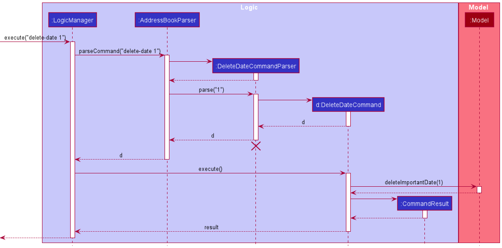
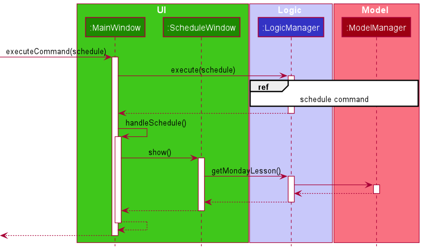

## Table of Contents
* Table of Contents
{:toc}

--------------------------------------------------------------------------------------------------------------------

## **Setting up, getting started**

Refer to the guide [_Setting up and getting started_](SettingUp.md).

<a href="#table-of-contents"> <button>Back to Table of Contents </button></a>

--------------------------------------------------------------------------------------------------------------------

## **Design**

### Architecture

The ***Architecture Diagram*** given above explains the high-level design of the App. Given below is a quick overview of each component.

:bulb: **Tip:** The `.puml` files used to create diagrams in this document can be found in the [diagrams](https://github.com/se-edu/addressbook-level3/tree/master/docs/diagrams/) folder. Refer to the [_PlantUML Tutorial_ at se-edu/guides](https://se-education.org/guides/tutorials/plantUml.html) to learn how to create and edit diagrams.

**`Main`** has two classes called [`Main`](https://github.com/se-edu/addressbook-level3/tree/master/src/main/java/seedu/address/Main.java) and [`MainApp`](https://github.com/se-edu/addressbook-level3/tree/master/src/main/java/seedu/address/MainApp.java). It is responsible for,
* At app launch: Initializes the components in the correct sequence, and connects them up with each other.
* At shut down: Shuts down the components and invokes cleanup methods where necessary.

[**`Commons`**](#common-classes) represents a collection of classes used by multiple other components.

The rest of the App consists of four components.

* [**`UI`**](#ui-component): The UI of the App.
* [**`Logic`**](#logic-component): The command executor.
* [**`Model`**](#model-component): Holds the data of the App in memory.
* [**`Storage`**](#storage-component): Reads data from, and writes data to, the hard disk.

Each of the four components,

* defines its *API* in an `interface` with the same name as the Component.
* exposes its functionality using a concrete `{Component Name}Manager` class (which implements the corresponding API `interface` mentioned in the previous point.

For example, the `Logic` component (see the class diagram given below) defines its API in the `Logic.java` interface and exposes its functionality using the `LogicManager.java` class which implements the `Logic` interface.

**How the architecture components interact with each other**

The *Sequence Diagram* below shows how the components interact with each other for the scenario where the user issues the command `delete 1`.

The sections below give more details of each component.

<a href="#table-of-contents"> <button>Back to Table of Contents </button></a>

### UI component

**API** :
[`Ui.java`](https://github.com/se-edu/addressbook-level3/tree/master/src/main/java/seedu/address/ui/Ui.java)

The UI consists of a `MainWindow` that is made up of parts e.g.`CommandBox`, `ResultDisplay`, `PersonListPanel`, `StatusBarFooter` etc. All these, including the `MainWindow`, inherit from the abstract `UiPart` class.

The `UI` component uses JavaFx UI framework. The layout of these UI parts are defined in matching `.fxml` files that are in the `src/main/resources/view` folder. For example, the layout of the [`MainWindow`](https://github.com/se-edu/addressbook-level3/tree/master/src/main/java/seedu/address/ui/MainWindow.java) is specified in [`MainWindow.fxml`](https://github.com/se-edu/addressbook-level3/tree/master/src/main/resources/view/MainWindow.fxml)

The `UI` component,

* Executes user commands using the `Logic` component.
* Listens for changes to `Model` data so that the UI can be updated with the modified data.

<a href="#table-of-contents"> <button>Back to Table of Contents </button></a>

### Logic component

**API** :
[`Logic.java`](https://github.com/se-edu/addressbook-level3/tree/master/src/main/java/seedu/address/logic/Logic.java)

1. `Logic` uses the `AddressBookParser` class to parse the user command.
1. This results in a `Command` object which is executed by the `LogicManager`.
1. The command execution can affect the `Model` (e.g. adding a person).
1. The result of the command execution is encapsulated as a `CommandResult` object which is passed back to the `Ui`.
1. In addition, the `CommandResult` object can also instruct the `Ui` to perform certain actions, such as displaying help to the user.

Given below is the Sequence Diagram for interactions within the `Logic` component for the `execute("delete 1")` API call.

:information_source: **Note:** The lifeline for `DeleteCommandParser` should end at the destroy marker (X) but due to a limitation of PlantUML, the lifeline reaches the end of diagram.

<a href="#table-of-contents"> <button>Back to Table of Contents </button></a>

### Model component

**API** : [`Model.java`](https://github.com/se-edu/addressbook-level3/tree/master/src/main/java/seedu/address/model/Model.java)

The `Model`,

* stores a `UserPref` object that represents the user’s preferences.
* stores the address book data.
* stores a Person object.
* exposes an unmodifiable `ObservableList<Person>` that can be 'observed'.
  * UI bounded to this list and Person object will be automatically updated when the data in the list change.
* does not depend on any of the other three components.

:information_source: **Note:** An alternative (arguably, a more OOP) model is given below. It has a `Tag` list in the `AddressBook`, which `Person` references. This allows `AddressBook` to only require one `Tag` object per unique `Tag`, instead of each `Person` needing their own `Tag` object. 

<a href="#table-of-contents"> <button>Back to Table of Contents </button></a>

### Storage component

**API** : [`Storage.java`](https://github.com/se-edu/addressbook-level3/tree/master/src/main/java/seedu/address/storage/Storage.java)

The `Storage` component,
* can save `UserPref` objects in json format and read it back.
* can save the address book data in json format and read it back.

<a href="#table-of-contents"> <button>Back to Table of Contents </button></a>

### Common classes

Classes used by multiple components are in the `seedu.addressbook.commons` package.

<a href="#table-of-contents"> <button>Back to Table of Contents </button></a>

--------------------------------------------------------------------------------------------------------------------

## **Implementation**

This section describes some noteworthy details on how certain features are implemented.

### Add feature

#### Implementation
The add mechanism is facilitated by `AddCommand` and `AddCommandParser`.

`AddCommand` extends `Command` and implements the following operation:

* `AddCommand#execute()` — adds the student with personal details if the details are valid, and returns a new
  `CommandResult` with a success message.

`AddCommandParser` implements the `Parser` interface and implements the following operation:

* `AddCommandParser#parse()`  —  parses the user's input and returns a `AddCommand` if the command format
  is valid

Given below is an example usage scenario and how the add mechanism behaves at each step.

:bulb: **Note:**
Name and phone are compulsory details which must be included in add command, while school, email, address,
guardian's name, guardian's phone, education level, subjects and lessons are optional. Any missing optional details can be added in later
by using Edit feature. Here, an example of a student with only compulsory details available is used.

Step 1. The user executes `add n/John Doe p/98765432` command to add a new student who is called John Doe
and has a phone number of 98765432 in TutorsPet.

Step 2. The user input is parsed by `AddressBookParser`, which passes the add command's argument to `AddCommandParser`.

Step 3. `AddCommandParser` creates a new `Person` object for the new student and returns a new `AddCommand`
if the argument is valid. Otherwise, a `ParseException` is thrown.

Step 4. `LogicManager` then calls `AddCommand#execute()`.

Step 5. `AddCommand#execute()` checks if the student represented by the `Person`object exists.
If the student does not exist, he/she gets added and a new `CommandResult` is returned.
Otherwise, a `CommandException` is thrown.

Step 6. If the add command has been successfully executed, the success message will be displayed.

#### Sequence Diagram

The sequence diagram below shows how the add feature works:

#### Activity Diagram

The activity diagram shows the workflow when an add command is executed:

#### Design consideration:

##### Aspect: Whether to allow incomplete fields(i.e. some personal details can be missing when adding a new student)

* **Alternative 1 (current choice):** Certain fields are optional when a new student are added.
    * Pros: More flexible and user-friendly.
    * Cons: It may take some time to add in the missing fields in the future.

* **Alternative 2:** All fields of a student must be added at first.
    * Pros: More standardized and easier to track.
    * Cons: Certain fields of a new student may not be known by the user at once.

<a href="#table-of-contents"> <button>Back to Table of Contents </button></a>

### Edit feature

#### Implementation
The edit mechanism is facilitated by `EditCommand` and `EditCommandParser`.

`EditCommand` extends `Command` and implements the following operation:

* `EditCommand#execute()` — edits the student with new personal details if the details are valid, and returns a new
  `CommandResult` with a success message.

`EditCommandParser` implements the `Parser` interface and implements the following operation:

* `EditCommandParser#parse()`  —  parses the user's input and returns a `EditCommand` if the command format
  is valid.

Given below is an example usage scenario and how the edit mechanism behaves at each step.

:bulb: **Note:**
Assume that a student John Doe has been added in with the command `add n/John Doe p/98765432` and is currently the 1st student in TutorsPet. 
Then, the information of John Doe is edited. Here, an example of the student's phone being changed and the student's subject being added with `edit` command is used.

Step 1. The user executes `edit 1 p/98765431 t/bio` command to edit the existing student John Doe 
to change his phone number and add in his subject.

Step 2. The user input is parsed by `AddressBookParser`, which passes the edit command's argument to `EditCommandParser`.

Step 3. `EditCommandParser` creates a new `EditPersonDescriptor` object to include the new values of the fields to be changed to.
The student index `1` and the `EditPersonDescriptor` object are passed into the `SearchCommand` constructor as the arguments, if they are valid. 
Otherwise, a `ParseException` is thrown.

Step 4. `LogicManager` then calls `EditCommand#execute()`.

Step 5. `EditCommand#execute()` checks if the student represented by the `Person`object exists. 
If the student does not exist, he/she gets added and a new `CommandResult` is returned. 
Otherwise, a `CommandException` is thrown.

Step 6. If the edit command has been successfully executed, the success message will be displayed.

#### Sequence Diagram

The sequence diagram below shows how the edit feature works:

#### Activity Diagram

The activity diagram shows the workflow when an edit command is executed:

#### Design consideration:

##### Aspect: Whether to enable every optional field to clear the current values under a field with blank space after its prefix

:bulb: **Note:**
Optional fields here refer to school, email, address,guardian's name, guardian's phone, education level, subjects and lessons, 
whereas name and phone are compulsory details which must not be blank at any time.

* **Alternative 1 (current choice):** Only subjects and lessons can be cleared by `edit` command with blank space after their respective prefixes.
    * Pros: Fewer fields need to be taken care of and are easier to remember. 
      Subjects and lessons taken by the students could be removed.
    * Cons: Deletion of a wrong piece of information is disallowed once it is stored in TutorsPet and no new information is available. 
      It might cause confusion in the future.

* **Alternative 2:** All the optional fields of a student can be cleared by `edit` command with blank space after their respective prefixes.
    * Pros: User can alter students' information more freely.
    * Cons: User might lose track of important personal details if they accidentally leave the field blank after any prefix.

<a href="#table-of-contents"> <button>Back to Table of Contents </button></a>

### Delete feature

#### Implementation
The delete mechanism is facilitated by `DeleteCommand` and `DeleteCommandParser`.

`DeleteCommand` extends `Command` and implements the following operation: 

* `DeleteCommand#execute()` — deletes the student at the given index if the index is valid, and returns a new
`CommandResult` with a success message.
  
`DeleteCommandParser` implements the `Parser` interface and implements the following operation:

* `DeleteCommandParser#parse()`  —  parses the user's input and returns a `DeleteCommand` if the command format
is valid

Given below is an example usage scenario and how the delete mechanism behaves at each step.

Step 1. The user executes `delete 1` command to delete the 1st student in TutorsPet.

Step 2. The user input is parsed by `AddressBookParser`, which passes the delete command's argument to `DeleteCommandParser`.

Step 3. `DeleteCommandParser` returns a new `DeleteCommand` if the argument is valid. Otherwise, a `ParseException` is thrown.

Step 4. `LogicManager` then calls `DeleteCommand#execute()`.

Step 5. `DeleteCommand#execute()` checks if the student specified exists. If the student exists, he/she gets deleted and
a new `CommandResult` is returned. Otherwise a `CommandException` is thrown.

Step 6. If the delete command has been successfully executed, the success message will be displayed.

#### Sequence Diagram

The sequence diagram below shows how the delete feature works:

#### Activity Diagram

The activity diagram shows the workflow when a delete command is executed:

#### Design consideration:

##### Aspect: Whether to provide options to delete specific fields

* **Alternative 1 (current choice):** Deletes the entire Student object.
    * Pros: Easy to implement, less prone to errors.
    * Cons: Less flexibility. 

* **Alternative 2:** Provide options to delete specific fields that belong to a Student.
    * Pros: Unnecessary information can be removed easily.
    * Cons: Certain fields such as subjects and lessons can already be cleared easily with the `edit` command.

<a href="#table-of-contents"> <button>Back to Table of Contents </button></a>

### Detail feature

#### Implementation
The detail mechanism is facilitated by `DetailCommand` and `DetailCommandParser`.

`DetailCommand` extends `Command` and implements the following operation:

* `DetailCommand#execute()` — displays the details of the student at the given index if the index is valid, 
  and returns a new `CommandResult` with a success message.

`DetailCommandParser` implements the `Parser` interface and implements the following operation:

* `DetailCommandParser#parse()`  —  parses the user's input and returns a `DetailCommand` if the command format
  is valid

Given below is an example usage scenario and how the detail mechanism behaves at each step.

Step 1. The user executes `detail 1` command to display the details of the 1st student in TutorsPet.

Step 2. The user input is parsed by `AddressBookParser`, which passes the detail command's argument to `DetailCommandParser`.

Step 3. `DetailCommandParser` returns a new `DetailCommand` if the argument is valid. Otherwise, a `ParseException` is thrown.

Step 4. `LogicManager` then calls `DetailCommand#execute()`.

Step 5. `DetailCommand#execute()` checks if the student specified exists. If the student exists, his/her details will
get displayed and a new `CommandResult` is returned. Otherwise, a `CommandException` is thrown.

Step 6. If the detail command has been successfully executed, the success message will be displayed.

#### Sequence Diagram

The sequence diagram below shows how the detail feature works:

#### Activity Diagram

The activity diagram shows the workflow when a delete command is executed:

#### Design consideration:

##### Aspect: Whether to provide options to display multiple contacts

* **Alternative 1 (current choice):** Display one Student object.
    * Pros: Easy to implement, less prone to errors.
    * Cons: Less flexibility.

* **Alternative 2:** Provide options to display multiple Students objects.
    * Pros: Able to user to multi-task.
    * Cons: GUI space restriction.

<a href="#table-of-contents"> <button>Back to Table of Contents </button></a>

### Search feature

#### Implementation

The search mechanism is facilitated by `SearchCommand`, `SearchCommandParser` and `NameSchoolAndSubjectContainsKeywordsPredicate`.

`SearchCommand` extends `Command` and contains a `Predicate`. It implements the following operation:

* `SearchCommand#execute()`  —  displays a list of students whose name, school or tag matches the keywords following the prefixes n/ s/ t/ respectively in the search command.
  Returns a new `CommandResult` with a message indicating the number of students found.

`SearchCommandParser` implements the `Parser` interface and implements the following operation:

* `SearchCommandParser#parse()`  —  parses the user's input and returns a new `SearchCommand` with a new `NameSchoolAndSubjectContainsKeywordsPredicate` as argument if the command format is valid.
* `SearchCommandParser#extractKeywordsAsArray()`  —  extracts the keywords following a prefix that is passed as parameter into an array.

`NameSchoolAndTagContainsKeywordsPredicate` implements the `Predicate` interface and contains 3 `List` of keywords: name, school and subject. It implements the following operations:

* `NameSchoolAndSubjectContainsKeywordsPredicate#test()`  —  tests if the name, school and tag keywords matches the name, school and subjects of the student contacts respectively, and returns true if matches.
* `NameSchoolAndSubjectContainsKeywordsPredicate#testBySubject()`  —  tests if the subject keywords matches the subjects of the student.
* `NameSchoolAndSubjectContainsKeywordsPredicate#testBySchool()`  —  tests if the school keywords matches the school of the student.
* `NameSchoolAndSubjectContainsKeywordsPredicate#testByName()`  —  tests if the name keywords matches the name of the student.

Given below is an example usage scenario and how the search mechanism behaves at each step.

Step 1. The user executes `search n/alice t/math` command to search for students with the name `alice` or with the subject `math`, both case insensitive.

Step 2. `LogicManager#execute()` is called to execute the given command. It first calls `AddressBookParser#parseCommand()` which passes the command’s argument `SearchCommandParser#parse()` to parse the `search` command.

Step 3. `SearchCommandParser#parse()` calls `SearchCommandParser#extractKeywordsAsArray()` to obtain the name, school and subject keywords in separate `List`.
A new `NameSchoolAndSubjectContainsKeywordsPredicate` is created using the 3 keyword lists, and is passed into the `SearchCommand` constructor as the argument.
The new `SearchCommand` is then returned if the argument is valid with the correct prefixes. Otherwise, a `ParseException` is thrown.

Step 4. After the new `SearchCommand` is returned, the `LogicManager#execute()` continues and calls `SearchCommand#execute()`.

Step 5. `SearchCommand#execute()`  filters the filtered person list by passing the `NameSchoolAndSubjectContainsKeywordsPredicate` argument into `Model#updateFilteredPersonList()`.
The updated filtered person list with the search results will then be displayed.

Step 6. If the `search` command has been successfully executed, a message will be displayed indicating the number of person listed.

#### Sequence Diagram
The sequence diagram below shows how the `search` feature works:

#### Activity Diagram
The activity diagram shows the workflow when a `search` command is executed:

#### Design consideration:

##### Aspect: Whether to use prefix in the search command.

* **Alternative 1 (current choice):** Use prefix to indicate the aspect to be searched.
    * Pros: Results in a more accurate search result.
    * Cons: Less flexibility.

* **Alternative 2:** Search using general keywords without use of prefix.
    * Pros: Allows for a more general search which searches through all the contact's details. Easier to implement, less prone to errors.
    * Cons: Less accurate search result due to nature of contact details. 
      For example a student's name and a guardian's name might be the same.

<a href="#table-of-contents"> <button>Back to Table of Contents </button></a>

### Sort feature

#### Implementation

The search mechanism is facilitated by `SortCommand` and `SortCommandParser`.

`SortCommand` extends `Command` and contains a `Predicate` and a `Comparator`. It implements the following operation:

* `SortCommand#execute()`  —  displays a list of students who has been sorted according to either their name, 
  school, subject or lesson if the sorting prefix is valid, then returns a new `CommandResult` with a message indicating how the list has been sorted, and the number of students displayed.

`SortCommandParser` implements the `Parser` interface and implements the following operation:

* `SortCommandParser#parse()`  —  parses the user's input and returns a new `SortCommand` with the prefix specified
  by the user.

Given below is an example usage scenario and how the sort mechanism behaves at each step.

Step 1. The user executes `sort n/` command to sort students by the alphabetical order of their `Name`.

Step 2. The user input is parsed by `AddressBookParser`, which passes the sort command's argument to `SortCommandParser`.

Step 3. `SortCommandParser` returns a new `SortCommand` if the argument is valid. Otherwise, a `ParseException` is thrown.

Step 4. `SortCommand` internally assigns the appropriate comparator and predicate to its fields.

Step 5. `LogicManager` then calls `SortCommand#execute()`.

Step 6. `SortCommand#execute()` uses the right comparator and predicate according to its fields and 
a new `CommandResult` is returned. 

Step 7. If the sort command has been successfully executed, the success message will be displayed.

#### Sequence Diagram
The sequence diagram below shows how the `search` feature works:

#### Activity Diagram
The activity diagram shows the workflow when a `sort` command is executed:

#### Design consideration:

##### Aspect: Whether to display students without the attribute to be sorted as well.

* **Alternative 1 (current choice):** Filter out students without the attribute to be sorted.
  * Pros: Neater results list.
  * Cons: List is not complete.

* **Alternative 2:** Leave all the students without the attribute to be sorted in the list display,
  perhaps at the start or end of the list.
  * Pros: List shows all the students every time.
  * Cons: Might clutter the GUI with people the user does not want to see.

### Advance levels feature

#### Implementation
The advancing levels mechanism is facilitated by `LevelUpCommand` and `LevelUpCommandParser`.

`LevelUpCommand` extends `Command` and implements the following operation:

* `LevelUpCommand#execute()` — advances all the student by one education level, unless students are excluded, and returns a new
  `CommandResult` with a success message.

`LevelUpCommandParser` implements the `Parser` interface and implements the following operation:

* `LevelUpCommandParser#parse()`  —  parses the user's exclusions (if any) and returns a `LevelUpCommand` if the command format
  is valid

Given below is an example usage scenario and how the advancing mechanism behaves at each step.

Step 1. The user executes `levelup ex/1` command to advance all the students except the 1st student by 
one education level in TutorsPet.

Step 2. The user input is parsed by `AddressBookParser`, which passes the advancing command's argument to `LevelUpCommandParser`.

Step 3. `LevelUpCommandParser` returns a new `LevelUpCommand` with a lists of excluded indexes if the argument is valid. 
Otherwise, a `ParseException` is thrown.

Step 4. `LogicManager` then calls `levelUpCommand#execute()`.

Step 5. `LevelUpCommand#execute()` checks if the indexes correspond to valid students, then the rest of the students
are advanced by one education level. Otherwise, a `CommandException` is thrown.

Step 6. If the advancing command has been successfully executed, the success message will be displayed.

#### Sequence Diagram

The sequence diagram below shows how the levelup feature works:

#### Activity Diagram

The activity diagram shows the workflow when a levelup command is executed:

#### Design consideration:

##### Aspect: Whether to also add an option to only advance some students

* **Alternative 1 (current choice):** Only have option to exclude students and not include students.
  * Pros: Fits the purpose of the command, which is to advance all students at the start of the year, 
    except for those who retain a year.
  * Cons: Does not cover the case where most of the students end up retaining.

* **Alternative 2:** Provide the option to include students as well.
  * Pros: Allows for the mass advancement of a group of students that is still smaller than the
    majority.
  * Cons: Seems redundant, cases where a majority of the students do not advance is slim.

<a href="#table-of-contents"> <button>Back to Table of Contents </button></a>

### Demote levels feature

#### Implementation
The demoting levels mechanism is facilitated by `LevelDownCommand` and `LevelDownCommandParser`.

`LevelDownCommand` extends `Command` and implements the following operation:

* `LevelDownCommand#execute()` — demotes all the student by one education level, unless students are excluded, and returns a new
  `CommandResult` with a success message.

`LevelDownCommandParser` implements the `Parser` interface and implements the following operation:

* `LevelDownCommandParser#parse()`  —  parses the user's exclusions (if any) and returns a `LevelDownCommand` if the command format
  is valid

Given below is an example usage scenario and how the advancing mechanism behaves at each step.

Step 1. The user executes `leveldown ex/1` command to demote all the students except the 1st student by
one education level in TutorsPet.

Step 2. The user input is parsed by `AddressBookParser`, which passes the advancing command's argument to `LevelUpCommandParser`.

Step 3. `LevelDownCommandParser` returns a new `LevelDownCommand` with a lists of excluded indexes if the argument is valid.
Otherwise, a `ParseException` is thrown.

Step 4. `LogicManager` then calls `LevelDownCommand#execute()`.

Step 5. `LevelDownCommand#execute()` checks if the indexes correspond to valid students, then the rest of the students
are advanced by one education level. Otherwise, a `CommandException` is thrown.

Step 6. If the advancing command has been successfully executed, the success message will be displayed.

#### Sequence Diagram

The sequence diagram below shows how the leveldown feature works:

#### Activity Diagram

The activity diagram shows the workflow when a leveldown command is executed:

#### Design consideration:

##### Aspect: Whether to combine the leveldown command with the levelup command

* **Alternative 1 (current choice):** Separate the leveldown command from the levelup command
  * Pros: Clearly separates the two commands, because they have different purposes; levelup is meant to be used
    at the start of the school year, while leveldown is mostly to undo levelup if a mistake is made
  * Cons: Redundant code.

* **Alternative 2:** Combine the two commands to have one levelchange command.
  * Pros: Neater code, since the two commands manipulate the same data.
  * Cons: Messy, because the two commands have different purposes.

<a href="#table-of-contents"> <button>Back to Table of Contents </button></a>

### Add important date feature

#### Implementation

The add important date mechanism is facilitated by `AddDateCommand` and `AddDateCommandParser`.

`AddDateCommand` extends `Command` and implements the following operation:

* `AddDateCommand#execute()` — adds the important date consisting of description and details if both are valid, and returns a new
  `CommandResult` with a success message.

`AddDateCommandParser` implements the `Parser` interface and implements the following operation:

* `AddDateCommandParser#parse()`  —  parses the user's input and returns a `AddDateCommand` if the command format
  is valid

Given below is an example usage scenario and how the add important date mechanism behaves at each step.

:bulb: **Note:**
Description of an important date must be unique, and if description entered by user matches the description of an existing
important date, it will be considered a duplicate and cannot be added into TutorsPet. 

Step 1. The user executes `add-date d/math exam dt/2022-03-03 0800` command to add a new important date with a description
`math exam` and details `2022-03-03 0800` into TutorsPet.

Step 2. The user input is parsed by `AddressBookParser`, which passes the command's argument to `AddDateCommandParser`.

Step 3. `AddDateCommandParser` creates a new `ImportantDate` object for the new important date and returns a new `AddDateCommand`
if the argument is valid. Otherwise, a `ParseException` is thrown.

Step 4. `LogicManager` then calls `AddDateCommand#execute()`.

Step 5. `AddDateCommand#execute()` checks if the important date represented by the `ImportantDate`object exists.
If the important date does not exist, it gets added and a new `CommandResult` is returned.
Otherwise, a `CommandException` is thrown.

Step 6. If the add important date command has been successfully executed, the success message will be displayed.

#### Sequence Diagram

The sequence diagram below shows how the add important date feature works:

#### Activity Diagram

The activity diagram shows the workflow when an add important date command is executed:

#### Design consideration:

##### Aspect: Whether to allow important dates with the same description but different details

* **Alternative 1 (current choice):** Important dates with the same description are considered to be duplicates.
    * Pros: Each important date is unique, user will not be confused by dates with the same description but different details.
    * Cons: User might want to add in an important date with the same description but different details due to the recurring
      nature of the event that is associated with the date. User will then have to change the description for it to be added in.

* **Alternative 2:** Important dates with the same description but different details can be added in. 
    * Pros: More convenient for the user as it allows user to input recurring important dates in advance, with the same description.
    * Cons: May cause confusion if date with the same description is added by accident by the user.

<a href="#table-of-contents"> <button>Back to Table of Contents </button></a>

### Delete important date feature

#### Implementation
The delete important date mechanism is facilitated by `DeleteDateCommand` and `DeleteDateCommandParser`.

`DeleteDateCommand` extends `Command` and implements the following operation:

* `DeleteDateCommand#execute()` — deletes the important date at the given index if the index is valid, and returns a new
  `CommandResult` with a success message.

`DeleteDateCommandParser` implements the `Parser` interface and implements the following operation:

* `DeleteDateCommandParser#parse()`  —  parses the user's input and returns a `DeleteDateCommand` if the command format
  is valid

Given below is an example usage scenario and how the delete important date mechanism behaves at each step.

Step 1. The user executes `delete-date 1` command to delete the 1st important date in TutorsPet, according to the date and time of the important date.

Step 2. The user input is parsed by `AddressBookParser`, which passes the command's argument to `DeleteDateCommandParser`.

Step 3. `DeleteDateCommandParser` returns a new `DeleteDateCommand` if the argument is valid. Otherwise, a `ParseException` is thrown.

Step 4. `LogicManager` then calls `DeleteDateCommand#execute()`.

Step 5. `DeleteDateCommand#execute()` checks if the important date specified exists. If the important date exists, it gets deleted and
a new `CommandResult` is returned. Otherwise a `CommandException` is thrown.

Step 6. If the delete important date command has been successfully executed, the success message will be displayed.

#### Sequence Diagram

The sequence diagram below shows how the delete feature works:

#### Activity Diagram

The activity diagram shows the workflow when a delete command is executed:

#### Design consideration:

##### Aspect: Whether to delete the important date based on the order it has been input in or according to the order the dates are displayed in, which is sorted by details (time and date).

* **Alternative 1 (current choice):** Deletes important date based on the order it is displayed in. 
    * Pros: It is easier for the user to find and delete the correct important date by just scrolling through the list. 
    * Cons: User will have to scroll through the list multiple times to obtain the correct index if user wants to delete multiple important dates that have been added in consecutively.

* **Alternative 2:** Deletes important date based on the order it was added in.
    * Pros: User can easily delete dates that have been added in consecutively. 
    * Cons: The index displayed next to each of the dates in the important dates list must correspond to the sequence it has been added in. 
      A separate command will have to be implemented in order to show the user the important dates sorted according to details (time and date).

<a href="#table-of-contents"> <button>Back to Table of Contents </button></a>

### List important dates feature

#### Implementation
The list important dates mechanism is facilitated by `ImportantDatesCommand`.

`ImportantDatesCommand` extends `Command` and implements the following operation:

* `ImportantDatesCommand#execute()` — lists the important dates stored in TutorsPet sorted according to the details (time and date), and returns a new
  `CommandResult` with a success message.

Given below is an example usage scenario and how the list important dates mechanism behaves at each step.

Step 1. The user executes `list-date` command to view a list of important dates in TutorsPet.

Step 2. The user input is parsed by `AddressBookParser`, which returns a new `ImportantDatesCommand`. 

Step 3. `LogicManager` then calls `ImportantDatesCommand#execute()`.

Step 4. `ImportantDatesCommand#execute()` calls `Model#updateSortedImportantDatesList()` and returns a new `CommandResult`.

Step 5. If the list important dates command has been successfully executed, the success message will be displayed.

#### Sequence Diagram

The sequence diagram below shows how the list important dates feature works:

#### Activity Diagram

The activity diagram shows the workflow when a list important dates command is executed:

#### Design consideration:

##### Aspect: Whether to display the list as a separate window or within the main window. 

* **Alternative 1 (current choice):** Displays the list as a separate window.
    * Pros: The main window would not be cluttered with too much information. 
    * Cons: Users might not like having many windows open.

* **Alternative 2:** Displays the list within the main window.
    * Pros: Users do not have to switch between windows when they want to enter commands to modify the important dates in the list.
    * Cons: Having too much information in the main window might appear to be overwhelming, especially for the new users.

<a href="#table-of-contents"> <button>Back to Table of Contents </button></a>

### Schedule feature

#### Implementation

The schedule mechanism is facilitated by `ScheduleCommand`, `MainWindow` and `ScheduleWindow`.

`ScheduleCommand` extends `Command`. It implements the following operation:

* `ScheduleCommand#execute()`  —  displays all of the student contacts in TutorsPet.
  Returns a new `CommandResult` with boolean value of `showSchedule` set as `true`.
  
`MainWindow` extends `UiPart<Stage>`. It implements the following relevant operations:

* `MainWindow#executeCommand()`   —  calls `LogicManager#execute()` to execute user command.
* `MainWindow#handleSchedule()`  —  calls `ScheduleWindow#show()` to open a new schedule window if it is not opened yet. 
  Otherwise, call `ScheduleWindow#focus()` to focus on the already opened schedule window.
  
`ScheduleWindow` extends `UiPart<Stage>`. It implements the following relevant operations:

* `ScheduleWindow#show()`  —  adds all lessons in TutorsPet to the schedule UI, and opens up a new schedule window.
* `ScheduleWindow#focus()`  —  focuses on already opened schedule window.

Given below is an example usage scenario and how the schedule mechanism behaves at each step.

Step 1. All lessons are stored in an `ObservableList` named `internalList`. There are additional seven separate `ObservableList` for lessons
for each day of the week, which are sorted by day and time. For example `transformedMondayList` and `transformedSundayList`.

Step 2. The user executes `add n/Mary p/98765432 le/monday 1000` command to add in a student contact whose lesson
is on `monday 1000`. The `add` command calls `Model#addPersonToLesson()` which adds the lessons to the `internalList`,
and updates the `transformedMondayList`.

Step 3. The user executes `delete 2` command to delete the 2nd person in TutorsPet. The `delete` command calls
`Model#removePersonFromLesson()` which removes the lesson from the `internalList` if the contact to be deleted is the
only person in that lesson. If the lesson to be removed is on a `Tuesday`, `transformedTuesdayList` will be updated accordingly.

Step 4. The user now wants to look at the schedule and hence executes `schedule` command to open up the schedule window.
The `schedule` command will return a new `CommandResult` whose `showSchedule` boolean value is set to `true`. 
`MainWindow#executeCommand()` then checks the value of `showSchedule`, and since it is `true`, 
`MainWindow#handleSchedule()` is called to open the schedule window. `ScheduleWindow#show()` is called, which will
create a `LessonListPanel` for each day, each containing the `ObservableList` of lessons for that day.

The sequence diagram below shows how the `schedule` feature works:

Step 5. The user then executes `detail 1` command that does not modify the `internalList` or the seven separate `ObservableList`
of lessons for each day of the week. The `detail` command instead modifies another `ObservableList`. Thus, the schedule
window continues to display the correct list of lessons for each day.

#### Design consideration:

##### Aspect: Whether to use a separate ObservableList for each day of the week.

* **Alternative 1 (current choice):** Use a separate ObservableList for each day.
    * Pros: Results in real time update of schedule.
    * Cons: Takes up more space, more tedious to manage since there are seven different lists.

* **Alternative 2:** Use only one ObservableList
    * Pros: Less prone to errors, easier to manage.
    * Cons: Schedule will not be updated in real time. 
    For example, when schedule window is opened and user adds or edits a contact, the change will not be reflected 
      real time on the opened schedule window. It is only reflected when the schedule window is closed and reopened.

<a href="#table-of-contents"> <button>Back to Table of Contents </button></a>

--------------------------------------------------------------------------------------------------------------------

## **Documentation, logging, testing, configuration, dev-ops**

* [Documentation guide](Documentation.md)
* [Testing guide](Testing.md)
* [Logging guide](Logging.md)
* [Configuration guide](Configuration.md)
* [DevOps guide](DevOps.md)

--------------------------------------------------------------------------------------------------------------------

## **Appendix: Requirements**

### Product scope

**Target user profile**: Private tuition teachers

* has a need to manage a significant number of student contacts
* has to plan lessons based on each student's profile
* is comfortable carrying a laptop around
* can type fast

**Value proposition**: manage many contacts with a lot of different details

### User stories

Priorities: High (must have) - `* * *`, Medium (nice to have) - `* *`, Low (unlikely to have) - `*`

| Priority | As a …​                                    | I want to …​                     | So that I can…​                                              |
| -------- | ------------------------------------------ | ------------------------------- | ---------------------------------------------------------------------- |
| `* * *`  | new user                                   | see usage instructions          | refer to instructions when I forget how to use the App                 |
| `* * *`  | user                                       | add new student's contact       | I can store information on a student                                   |
| `* * *`  | user                                       | delete a student's contact      | remove entries that I no longer need and reduce cluttering             | 
| `* * *`  | user                                       | edit a student's contact        | I can update the contact book when a student’s details has changed.    |
| `* *`    | user                                       | find a student by name          | locate details of students without having to go through the entire list|
| `* *`    | user                                       | find a student by school        | plan my lesson/schedules according to their school’s curriculum        |
| `* *`    | user                                       | sort students by lesson days    | I can see my schedule for the week                                     |
| `* *`    | user                                       | easily access guardians’ contact| I can quickly reach them in case of any emergencies or sudden changes  |
| `*`      | expert user                                | add customized subjects to contacts | I will be able to access each group of students more easily        |
| `*`      | expert user                                | attach remarks to contacts      | So I remember details that might not be covered in the original program|
| `*`      | user                                       | hide private contact details    | minimize chance of someone else seeing them by accident                |

*{More to be added}*

### Use cases

(For all use cases below, the **System** is the `TutorsPet` and the **Actor** is the `user`, unless specified otherwise)

**Use case: Add a new contact**

**MSS**

1.  User keys in the contact to be added
2.  TutorsPet shows the added contact into the list

    Use case ends.

**Extensions**

* 1a. The given details is in an incorrect format.

    * 1a1. TutorsPet shows an error message.

      Use case ends.

**Use case: Clears all entries contact**

**MSS**

1.  User enters clears all entries contact command
2.  TutorsPet clears all the contact in list

    Use case ends.

**Extensions**

* 1a. The given details is in an incorrect format.

    * 1a1. TutorsPet shows an error message.

      Use case ends.

**Use case: Delete a student contact**

**MSS**

1.  User requests to list contacts
2.  TutorsPet shows a list of students’ contact
3.  User requests to delete a specific contact from the list
4.  TutorsPet deletes the person

    Use case ends.

**Extensions**

* 2a. The list is empty.

  Use case ends.

* 3a. The given index is invalid.

    * 3a1. TutorsPet shows an error message.

      Use case resumes at step 2.

**Use case: Editing an existing contact**

**MSS**

1.  User requests to list contacts
2.  TutorsPet shows a list of students’ contact
3.  User requests to edit a specific contact from the list
4.  TutorsPet edits the selected contact

    Use case ends.

**Extensions**

* 1a. The given details is in an incorrect format.

    * 1a1. TutorsPet shows an error message.

      Use case ends.

* 2a. The list is empty.

  Use case ends.

* 3a. The given index is invalid.

    * 3a1. TutorsPet shows an error message.

      Use case resumes at step 2.

**Use case: Exit TutorsPet**

**MSS**

1.  User enters exit into command prompt
2.  TutorsPet saves the current contact in the list and exits.

    Use case ends.

**Extensions**

* 1a. The given details is in an incorrect format.

    * 1a1. TutorsPet shows an error message.

      Use case resumes at step 2.

**Use case: Search for a student contact**

**MSS**

1.  User enters the specified keyword to be searched.
1.  TutorsPet shows a list of searched students.

**Extensions**

* 1a. The given search command is in an incorrect format. 
  * 1a1. TutorsPet shows an error message. 
    
    Use case ends.
* 2a. The given search command has two of the same parameters.
  * 2a1. TutorsPet executes the command while taking in the last occurrence of the parameters only. 
    
    Use case resumes at step 2.
* 3a. The search result list is empty.

  Use case ends.

**Use case: Add a new important date**

**MSS**

1.  User keys in the important date to be added.
2.  TutorsPet adds the important date and indicates success.

    Use case ends.

**Extensions**

* 1a. The given description or details is in an incorrect format.

  * 1a1. TutorsPet shows an error message.

    Use case ends.
  
* 1b. There exists an important date in TutorsPet with the same description.
  
  * 1b1. TutorsPet shows an error message.
  
    Use case ends.

**Use case: Deletes a new important date**

**MSS**

1.  User requests to list important dates.
2.  TutorsPet shows a list of important dates.
3.  User requests to delete a specific important date from the list.
4.  TutorsPet deletes the important date.

    Use case ends.

**Extensions**

* 1a. The list is empty
  
    Use case ends.

* 3a. The given index of the important date is invalid.

  * 3a1. TutorsPet shows an error message.

    Use case resumes from step 2.

**Use case: Lists important dates**

**MSS**

1.  User requests to list important dates.
2.  TutorsPet shows a list of important dates.

    Use case ends.

**Extensions**

* 1a. The given command is in an invalid format.
  
  * 1a1. TutorsPet shows an error message.
  
    Use case ends.

*{More to be added}*

<a href="#table-of-contents"> <button>Back to Table of Contents </button></a>

### Non-Functional Requirements

1.  Should work on any _mainstream OS_ as long as it has Java `11` or above installed.
2.  Should be able to hold up to 1000 persons without a noticeable sluggishness in performance for typical usage.
3.  A user with above average typing speed for regular English text (i.e. not code, not system admin commands) should be able to accomplish most of the tasks faster using commands than using the mouse.
4.  Should work without requiring an installer.
5.  Should not depend on remote server.
6.  Everything should be packaged into a single JAR file.
7.  JAR file should not exceed 100MB.
8.  System should be usable and understandable by a novice.
9.  System should be able to run even if the data file has errors arising from a user manually editing it.
10. Users should be comfortable with the system even after not using it for a period of time.
11. System should be able to store up to 500 contacts.
12. System should be able to function if a user overwrites the data file with another data file that is named the same.

*{More to be added}*

<a href="#table-of-contents"> <button>Back to Table of Contents </button></a>

### Glossary

* **Private tuition teachers**: Freelance tuition teachers not belonging to any organisations
* **Mainstream OS**: Windows, Linux, Unix, OS-X
* **Private contact detail**: A contact detail that is not meant to be shared with others
* **Novice**: A user that is new to using TutorsPet

<a href="#table-of-contents"> <button>Back to Table of Contents </button></a>

--------------------------------------------------------------------------------------------------------------------

## **Appendix: Instructions for manual testing**

Given below are instructions to test the app manually.

:information_source: **Note:** These instructions only provide a starting point for testers to work on;
testers are expected to do more *exploratory* testing.

### Launch and shutdown

1. Initial launch

   1. Download the jar file and copy into an empty folder

   1. Double-click the jar file Expected: Shows the GUI with a set of sample contacts. The window size may not be optimum.

1. Saving window preferences

   1. Resize the window to an optimum size. Move the window to a different location. Close the window.

   1. Re-launch the app by double-clicking the jar file. 
       Expected: The most recent window size and location is retained.

1. _{ more test cases …​ }_

<a href="#table-of-contents"> <button>Back to Table of Contents </button></a>

### Deleting a student

1. Deleting a student while all students are being shown

   1. Prerequisites: List all students using the `list` command. Multiple students in the list.

   1. Test case: `delete 1` 
      Expected: First contact is deleted from the list. Details of the deleted contact shown in the status message. Timestamp in the status bar is updated.

   1. Test case: `delete 0` 
      Expected: No student is deleted. Error details shown in the status message. Status bar remains the same.

   1. Other incorrect delete commands to try: `delete`, `delete x`, `...` (where x is larger than the list size) 
      Expected: Similar to previous.

1. _{ more test cases …​ }_

<a href="#table-of-contents"> <button>Back to Table of Contents </button></a>

### Viewing a student contact details

1. Viewing a student contact details while all students are being shown

  1. Prerequisites: List all students using the `list` command. Multiple students in the list.

  1. Test case: `detail 1` 
     Expected: Details of the first contact from the list is displayed on the Contact Detail panel.

  1. Test case: `detail 0` 
     Expected: No student detail is displayed. Error details shown in the status message. Status bar remains the same.

  1. Other incorrect delete commands to try: `detail`, `detail x`, `...` (where x is larger than the list size) 
     Expected: Similar to previous.

1. _{ more test cases …​ }_

<a href="#table-of-contents"> <button>Back to Table of Contents </button></a>

### Saving data

1. Dealing with missing/corrupted data files

   1. _{explain how to simulate a missing/corrupted file, and the expected behavior}_

1. _{ more test cases …​ }_

<a href="#table-of-contents"> <button>Back to Table of Contents </button></a>

### Adding an important date

1. Adding an important date while all important dates are being shown

    1. Prerequisites: List all important dates using the `list-date` command. Multiple important dates in the list.
  
    1. Test case: `add-date d/math exam dt/2021-11-03 0800` 
       Expected: Adds an important date with the description `math exam` and details `2021-11-03 0800`. Details of the added important date is shown in the status message. List is updated. 
  
    1. Test case: `add-date d/math exam` 
       Expected: No important date is added. Error details shown in the status message.
       
    1. Test case: `add-date dt/2021-11-03 0800` 
       Expected: Similar to previous.
       
    1. Test case: `add-date d/math exam dt/2021/11/03 8am` 
       Expected: Similar to previous.
  
    1. Other incorrect add important date commands to try: `add-date`, `add-date x`, `...` (where x is the description or details without the `d/` or `dt/` prefix) 
       Expected: Similar to previous.

<a href="#table-of-contents"> <button>Back to Table of Contents </button></a>

### Deleting an important date

1. Deleting an important date while all important dates are being shown
   
    1. Prerequisites: List all important dates using the `list-date` command. Multiple important dates in the list.
    
      1. Test case: `delete-date 1` 
         Expected: First important date is deleted from the list. Details of the deleted important date is shown in the status message.
    
      1. Test case: `delete-date 0` 
         Expected: No important date is deleted. Error details shown in the status message.
    
      1. Other incorrect delete important date commands to try: `delete-date`, `delete x`, `...` (where x is larger than the list size, larger than 2147483647 or not a positive integer) 
         Expected: Similar to previous.

<a href="#table-of-contents"> <button>Back to Table of Contents </button></a>

### Listing all important dates

1. List all important dates.

    1. Test case: `list-date 2` 
       Expected: Opens window with a list of important dates. Success details is shown in the status message.
    
    1. Incorrect list important date commands include cases where the command entered is not `list-date`

<a href="#table-of-contents"> <button>Back to Table of Contents </button></a>
