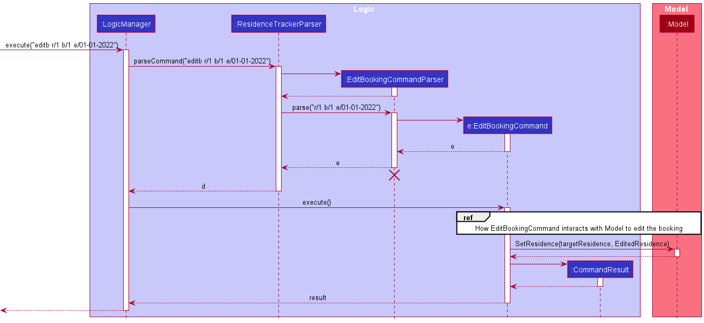
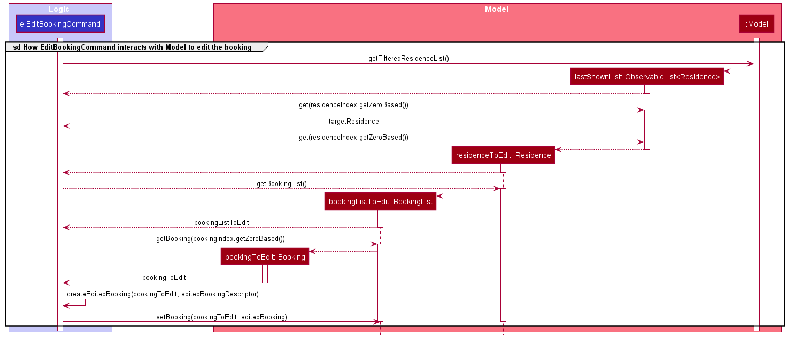
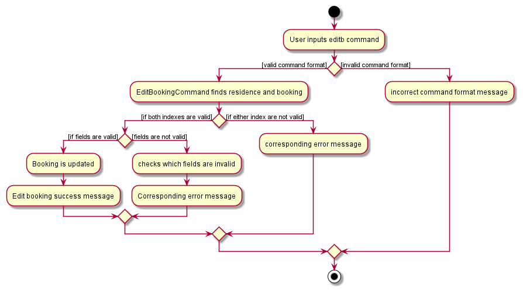

* Table of Contents
{:toc}

--------------------------------------------------------------------------------------------------------------------

## **Setting up, getting started**

Refer to the guide [_Setting up and getting started_](SettingUp.md).

--------------------------------------------------------------------------------------------------------------------

## **Design**

### Architecture

The ***Architecture Diagram*** given above explains the high-level design of the App. Given below is a quick overview of each component.

:bulb: **Tip:** The `.puml` files used to create diagrams in this document can be found in the [diagrams](https://github.com/ay2021s2-cs2103-t16-3/tp/tree/master/docs/diagrams/) folder. Refer to the [_PlantUML Tutorial_ at se-edu/guides](https://se-education.org/guides/tutorials/plantUml.html) to learn how to create and edit diagrams.

**`Main`** has two classes called [`Main`](https://github.com/ay2021s2-cs2103-t16-3/tp/tree/master/src/main/java/seedu/address/Main.java) and [`MainApp`](https://github.com/se-edu/addressbook-level3/tree/master/src/main/java/seedu/address/MainApp.java). It is responsible for,
* At app launch: Initializes the components in the correct sequence, and connects them up with each other.
* At shut down: Shuts down the components and invokes cleanup methods where necessary.

[**`Commons`**](#common-classes) represents a collection of classes used by multiple other components.

The rest of the App consists of four components.

* [**`UI`**](#ui-component): The UI of the App.
* [**`Logic`**](#logic-component): The command executor.
* [**`Model`**](#model-component): Holds the data of the App in memory.
* [**`Storage`**](#storage-component): Reads data from, and writes data to, the hard disk.

Each of the four components,

* defines its *API* in an `interface` with the same name as the Component.
* exposes its functionality using a concrete `{Component Name}Manager` class (which implements the corresponding API `interface` mentioned in the previous point.

For example, the `Logic` component (see the class diagram given below) defines its API in the `Logic.java` interface and exposes its functionality using the `LogicManager.java` class which implements the `Logic` interface.

**How the architecture components interact with each other**

The *Sequence Diagram* below shows how the components interact with each other for the scenario where the user issues the command `delete 1`.

The sections below give more details of each component.

### UI component

**API** :
[`Ui.java`](https://github.com/ay2021s2-cs2103-t16-3/tp/tree/master/src/main/java/seedu/address/ui/Ui.java)

The UI consists of a `MainWindow` that is made up of parts e.g.`CommandBox`, `ResultDisplay`, `PersonListPanel`, `StatusBarFooter` etc. All these, including the `MainWindow`, inherit from the abstract `UiPart` class.

The `UI` component uses JavaFx UI framework. The layout of these UI parts are defined in matching `.fxml` files that are in the `src/main/resources/view` folder. For example, the layout of the [`MainWindow`](https://github.com/se-edu/addressbook-level3/tree/master/src/main/java/seedu/address/ui/MainWindow.java) is specified in [`MainWindow.fxml`](https://github.com/se-edu/addressbook-level3/tree/master/src/main/resources/view/MainWindow.fxml)

The `UI` component,

* Executes user commands using the `Logic` component.
* Listens for changes to `Model` data so that the UI can be updated with the modified data.

### Logic component

**API** :
[`Logic.java`](https://github.com/ay2021s2-cs2103-t16-3/tp/tree/master/src/main/java/seedu/address/logic/Logic.java)

1. `Logic` uses the `ResidenceTrackerParser` class to parse the user command.
1. This results in a `Command` object which is executed by the `LogicManager`.
1. The command execution can affect the `Model` (e.g. adding a residence).
1. The result of the command execution is encapsulated as a `CommandResult` object which is passed back to the `Ui`.
1. In addition, the `CommandResult` object can also instruct the `Ui` to perform certain actions, such as displaying help to the user.

Given below is the Sequence Diagram for interactions within the `Logic` component for the `execute("delete 1")` API call.

:information_source: **Note:** The lifeline for `DeleteCommandParser` should end at the destroy marker (X) but due to a limitation of PlantUML, the lifeline reaches the end of diagram.

### Model component

**API** : [`Model.java`](https://github.com/ay2021s2-cs2103-t16-3/tp/tree/master/src/main/java/seedu/address/model/Model.java)
The `Model`,

* stores a `UserPref` object that represents the user’s preferences.
* stores the residence tracker data.
* exposes an unmodifiable `ObservableList<Residence>` that can be 'observed' e.g. the UI can be bound to this list so that the UI automatically updates when the data in the list change.
* does not depend on any of the other three components.

:information_source: **Note:** An alternative (arguably, a more OOP) model is given below. It has a `Tag` list in the `ResidenceTracker`, which `Residence` references. This allows `ResidenceTracker` to only require one `Tag` object per unique `Tag`, instead of each `Residence` needing their own `Tag` object. 

### Storage component

**API** : [`Storage.java`](https://github.com/ay2021s2-cs2103-t16-3/tp/tree/master/src/main/java/seedu/address/storage/Storage.java)

The `Storage` component,
* can save `UserPref` objects in json format and read it back.
* can save the residence tracker data in json format and read it back.

### Common classes

Classes used by multiple components are in the `seedu.address.commons` package.

--------------------------------------------------------------------------------------------------------------------

## **Implementation**

This section describes some noteworthy details on how certain features are implemented.

### Remind feature

#### Implementation

The proposed mechanism is facilitated by the `logic` component described above. It filters the displayed `Residence` list to show those with bookings starting in the next 7 days. It makes use of the following new method in `Residence`.

* `Residence#hasUpcomingBooking()` — Returns true if the `Residence` has a booking starting in the next 7 days.

These operations make use of the `Model` interface's `Model#updateFilteredResidenceList(Predicate<Residence> predicate)` method and `Model` has a new public static `Predicate` named `PREDICATE_UPCOMING_BOOKED_RESIDENCES`.

Given below is an example usage scenario and how the reminder filtering mechanism behaves at each step.

Step 1. The user launches the application for the first time. The `ResidenceTracker` will be initialized with the initial residence tracker state.

Step 2. The user executes `addb 2 n/New Tenant p/098 ...` command to add a booking that starts within the next 7 days to the 2nd residence in the residence tracker. The `addb` command calls `Residence#addBooking(Booking booking)`, which replaces the 2nd residence with the new `Residence` after the command execution.

Step 3. The user executes `remind` to list all residences with upcoming bookings. The `remind` command also calls `Model#updateFilteredResidenceList(Predicate<Residence> predicate)`, causing a filtered list of `Residence`s to be displayed which includes the updated residence from the previous step.

Step 4. Any successful execution of commands `add`, `addb`, `edit`, `editb`, `delete`, `deleteb` or `list` will return to the previous display of the full residence list.

#### Design consideration:

* **Alternative 1 (current choice):** Checks if residences have bookings starting in the next 7 days.
    * Pros: Easy to implement.
    * Cons: User is forced to actively use the command to be reminded.

* **Alternative 2:** Residences are automatically displayed with residences having upcoming bookings on top.
    * Pros: Users will be able to see the residences that need the most urgent attention on top of their list without interacting with the app.
    * Cons: The users will not be able to tell how many in the list will need to be cleaned immediately for the next 7 days. 
      Using colour codes to differentiate the residences from the rest will make it visually more unpleasant for the users as it already uses colour coding for bookings.

### Status feature

#### Implementation

The proposed mechanism is facilitated by the `logic` component described above. It updates clean status of multiple `Residences` at one time. It makes use of the following new method.

* `StatusCommand#createUpdatedResidence()` —  Create updated residence with the required clean status and the same other data.
* `StatusCommandParser#paser()` —  Manage the status command input, return a status command with required clean status and target residence index list.

These operations make use of the `Model` interface's `Model#updateFilteredResidenceList(Predicate<Residence> predicate)` method to update the order of residence list, 
and `Model#setResidence()` to update the residence in the residence list. 

Given below is an example usage scenario and how the `status` filtering mechanism behaves at each step.

Step 1. The user launches the application for the first time. The `ResidenceTracker` will be initialized with the initial residence tracker state, which has three sample residences.

Step 2. The user executes two or more input`add n/NAME a/ADDRESS c/y ...` command to add multiple residence with the same clean status "CLEAN". The `add` command calls `addResidence()` which checks and adds new residence to the end of unique residence list where "UNCLEAN" residences is in front of "CLEAN" residences. 

Step 3. The user plans to set the forth and fifth  residences clean status from "CLEAN" to "UNCLEAN" since bookings finished. So the user executes the command `status unclean 4 5`.

Step 4. The command is parsed by `StatusCommandParser` and returns a `StatusCommand` to be executed.

Step 5. `StatusCommand#execute` checks if the residence exists and if status expression is correct.

Step 6. The method then calls `StatusCommand#createUpdatedResidence()` to create status-updated residence one by one, and calls `Model#setResidence` to set the these residences.
Finally, it calls `Model#updateFilteredResidenceList(Predicate<Residence> predicate)`, causing an ordered list of `Residence`s to be displayed.

#### Design consideration:How to update clean status of residences

* **Alternative 1 (current choice):** Create status-updated residences one by one and set them to residence list through function `Model#setResidence` 
    * Pros: Easy to implement,and not change the existing structure.
    * Cons: Adopt a loop, spending extra storage to create new residences.

* **Alternative 2:** use index to find residences in residence list and set their clean status directly 
    * Pros: Can change status directly, don't need to spend extra storage to create residence.
    * Cons: it needs new function to find residences by the index and change their clean status, which may damage security of residence list. 

The following sequence diagram shows how the status operation works:

The following activity diagram summarizes what happens when a user executes a `status` command:

### Edit Booking feature

#### Implementation
The proposed mechanism is facilitated by the `logic` component described above. It edits the details of existing bookings that are currently in Residence Tracker. It makes use of the following methods.

* `EditBookingCommandParser#parse` parses the prefixes and the corresponding parameters to be edited.
* `BookingList#containsExclude` determines if edited dates are valid by checking if it overlaps with any of the existing bookings.
* `EditBookingCommand#execute` finds the target residence and target booking and edits the corresponding details accordingly.

After `EditBookingCommand#execute` finds the target residence and booking, it makes use of `BookingList#setBooking` and `Model#setResidence` to update the booking of the residence in the residence list. 

Given below is an example usage scenario of how the editing of bookings work.

Step 1. The user launches the application. `ResidenceTracker` is initialised with prior saved data of residences.

Step 2. The user plans to edit the end date of a booking since the tenants requested for an extension. The user executes the command `editb r/2 b/1 e/01-01-2022` to edit the end date of the first booking of the second residence displayed in `ResidenceTracker`.

Step 3. The command is parsed by `EditBookingCommandParser` and returns a `EditBookingCommand` to be executed.

Step 4. `Editbookingcommand#execute` checks if the residence and booking exists and if the edited end date is valid.

Step 5. The method then calls `BookingList#setBooking` to set the edited booking before calling `Model#setResidence` to set the edited residence. Finally, it calls `Model#updateFilteredResidenceList(Predicate<Residence> predicate)`, causing an ordered list of `Residence`s to be displayed.

Below shows the sequence diagram of `EditBookingCommand`

And the activity diagram:

### Design Consideration

#### How to check if the edited booking has dates that overlap with other bookings of the residence

Implementation of edit booking creates a `editedBooking` before calling `BookingList#setBooking` to replace `bookingToEdit` with `editedBooking`. There is a need to ensure that `editedBooking` has no overlap dates with other bookings. However, if `BookingList#contains` (method that checks if a booking overlaps with other bookings in the `bookingList`) is called, it is likely that it returns `true` because `editedBooking` has overlapping dates with `bookingToEdit` since at this point, `bookingToEdit`still exists in the `bookingList`.

* **Alternative 1: After creating `editedBooking`, use `DeleteBookingCommand` on `bookingToEdit` and `AddBookingCommand` to add `editedBooking` back to the `bookingList`**
    * Pros: `AddBookingCommand` handles the check for overlapping dates for `editedBooking`. Previous issue of `bookingToEdit`existing in the `bookingList` is solved by deletion.
    * Cons: ties the implementation of `EditBookingCommand` to `AddBookingCommand` and `DeleteBookingCommand`.

* **Alternative 2: Verify the validity of `BookingList#setBooking` by simulating the deletion of `bookingToEdit` and addition of `editedBooking` through a method in `BookingList`**
    * Pros: allows the use of `BookingList#setBooking`, separating `EditBookingCommand` from `AddingBookingCommand` and `DeleteBookingCommand`.
    * Cons: creating a method that is similar to `BookingList#contains`.

--------------------------------------------------------------------------------------------------------------------

## **Documentation, logging, testing, configuration, dev-ops**

* [Documentation guide](Documentation.md)
* [Testing guide](Testing.md)
* [Logging guide](Logging.md)
* [Configuration guide](Configuration.md)
* [DevOps guide](DevOps.md)

--------------------------------------------------------------------------------------------------------------------

## **Appendix: Requirements**

### Product scope

**Target user profile**:

* busy user that has to manage a considerable number of residences
* is constantly renting out residences; high turnover rate
* prefers working on laptop over mobile
* is able to type quickly
* prefers using a keyboard to using a mouse
* is familiar with CLI apps

**Value proposition**: easily keep track of residences and inform cleaning agency whenever necessary

### User stories

Priorities: High (must have) - `* * *`, Medium (nice to have) - `* *`, Low (unlikely to have) - `*`

| Priority | As a …​                                 | I want to …​                     | So that I can…​                                                       |
| -------- | ------------------------------------------ | ----------------------------------- | ----------------------------------------------------------------------   |
| `* * *`  | new user                                   | See a list of all commands          | refer to instructions when I forget how to use the App                   |
| `* * *`  | user                                       | add a new residence                 | manage all the residences I wish to keep track of                                                                         |
| `* * *`  | user                                       | delete a residence                  | remove residences that I no longer need to track                             |
| `* * *`  | user                                       | find a residence by name            | review details of specific residences without having to go through the entire list |
| `* *`    | new user                                   | clear all sample residences         | begin using Residence Tracker with my own data quickly
| `* *`    | user                                       | edit a residence                    | change the information of a residence when necessary           |
|`* *`     | user                                       | exit the application                | use my computer for other stuff
|`* *`     | user                                       | go through a tutorial guide         | quickly learn the usage of the application 
|`* *`     | user                                       | add a new booking of a residence    | keep track of all booking information of my residences
|`* *`     | user                                       | edit a new booking of a residence   | change the information of booking when necessary
|`* *`     | user                                       | delete a new booking of a residence | remove booking details that I no longer need to track
|`* *`     | busy user                                  | be reminded me of upcoming bookings | quickly view the residences that need to be urgently cleaned
| `*`      | busy user renting out many residences      | update status of multiple residence at once  | save time and get to my other works    |

*{More to be added}*

### Use cases

(For all use cases below, the **System** is the `ResidenceTracker` and the **Actor** is the `user`, unless specified otherwise)

**Use case (UC01): Add a residence** 
**MSS**  
1.  User adds in the details of a residence.
2.  User validates the details of the residence to be added.
3.  System confirms the addition and residence is added to the list of existing residence.
4.  System saves the updated data.
     Use case ends.

**Extensions**

* 2a. System detects error in submission if user did not provide all relevant fields correctly.  
    * 2a1. ResidenceTracker shows an error message.  
      use case restarts from 1.
 

**Use case (UC02): Delete a residence**  
**MSS**  
1.  User deletes a residence.
2.  System validates the residence to be deleted.
3.  System deletes the respective entry of the residence.
4.  System saves the updated data.
     Use case ends.

**Extensions**

* 2a. System detects an error in the user input.
    * 2a1. System requests for the expected format to delete a residence.
    * 2a2. User inputs the corrected details to delete a residence.
      
      Use case resumes at step 2.

 
      
**Use case(UC03): Find a residence**  
**MSS**  
1.  User searches residences with keywords.
2.  System returns the residence(s) which include the keyword in their name.
     Use case ends.

**Extensions**  
* 1a. System found no matching residences.
    * 1a1. A corresponding message is shown and the residence list displayed is empty.
       Use case ends.

 

**Use case(UC04): View list of all residences** 
**MSS** 
1.  User lists all residences.
2.  System displays all residences in the list.
     Use case ends.

 

**Use case(UC05): Edit information of a residence**  
**MSS**  
1.  User edits a residence.
2.  System validates the edits to the given residence.
3.  System updates the residence accordingly.
4.  System saves the updated data.
     Use case ends.

**Extensions**  
* 2a. System detects an error in the user input.
    * 2a1. System requests for the expected input format to edit a residence.
    * 2a2. User inputs the corrected details to edit a residence.
       Use case resumes at step 2.

 

**Use case (UC06): Show all available commands**  
**MSS** 
1.  User requests the help page.
2.  System displays the help page.
         Use case ends.

 

**Use case (UC07): Exit the application**  
**MSS**  
1.  User exits the application.
2.  System shuts down.
     Use case ends.
    
 

**Use case(UC08): Update clean status of multiple residences at once**  
**MSS**  
1.  User updates multiple residences' clean status at once.
2.  System confirms the validity of clean status and residences provided.
3.  System updates the required residences' clean status.
4.  System saves the updated data.    
         Use case ends.

**Extensions**  
* 2a. System detects an error in the user input.

    * 2a1. System requests for the expected format to update multiple residences' clean status.
    * 2a2. User inputs the corrected details to update multiple residences' clean status.
             Use case resumes at step 2.

 

**Use case(UC09): Adds a new booking of the specified residence**  
**MSS**  
1.  User adds a new booking to a residence.
2.  System confirms the validity of the residence and the new booking details.
3.  System adds the new booking to the residence's booking list.
4.  System saves the updated data.    
         Use case ends.

**Extensions**  
* 2a. System detects an error in the user input.

    * 2a1. System requests for the expected format to add a booking to a residence.
    * 2a2. User inputs the corrected details to add a booking to a residence.
             Use case resumes at step 2.

 

**Use case(UC10): edit a booking of the specified residence**  
**MSS**  
1.  User edits a residence's booking. 
2.  System confirms the validity of the residence and the edited booking details.
3.  System updates the given booking in the residence's booking list.
4.  System saves the updated data.     
         Use case ends.

**Extensions**  
* 2a. System detects an error in the user input

    * 2a1. System requests for the expected format of editing a residence's booking.
    * 2a2. User inputs the corrected details to edit a residence's booking.
             Use case resumes at step 2.

 

**Use case (UC11): Delete a booking of a residence**

**MSS**
1.  User deletes a booking from a residence.
2.  System validates the booking to be deleted.
3.  System deletes the respective entry of the booking from the given residence.
4.  System saves the updated data.    
         Use case ends.

**Extensions**

* 2a. System detects an error in the user input.

    * 2a1. System requests for the correct format to delete a booking from a residence.
    * 2a2. User inputs the corrected details to delete a booking from a residence.
             Use case resumes at step 2.

 

**Use case (UC12): Reminder of Residences with Upcoming Bookings**  
**MSS** 
1.  User requests a reminder of residences with upcoming bookings.
2.  System shows a list of all residences with bookings starting in the next 7 days.
         Use case ends.

 

**Use case (UC13): CLear all residence at once**  
**MSS** 
1.  User chooses to clear all residences.
2.  System deletes all residence data from the storage file.
         Use case ends.

 

### Non-Functional Requirements

1.  Should work on any _mainstream OS_ as long as it has Java `11` or above installed.
2.  Should be able to hold up to 100 residences without a noticeable sluggishness in performance for typical usage.
3.  A user with above average typing speed for regular English text (i.e. not code, not system admin commands) should be able to accomplish most of the tasks faster using commands than using the mouse.

*{More to be added}*

### Glossary

* **Mainstream OS**: Windows, Linux, Unix, OS-X
* **Residence Status**:
    * **Clean**: The residence has been cleaned
    * **Unclean**: The residence needs to be cleaned
    
--------------------------------------------------------------------------------------------------------------------

## **Appendix: Instructions for manual testing**

Given below are instructions to test the app manually.

:information_source: **Note:** These instructions only provide a starting point for testers to work on;
testers are expected to do more *exploratory* testing.

### Launch and shutdown

1. Initial launch

   1. Download the jar file and copy into an empty folder

   1. Double-click the jar file Expected: Shows the GUI with a set of sample contacts. The window size may not be optimum.

1. Saving window preferences

   1. Resize the window to an optimum size. Move the window to a different location. Close the window.

   1. Re-launch the app by double-clicking the jar file. 
       Expected: The most recent window size and location is retained.

### Deleting a residence

1. Deleting a residence while all residence are being shown

   1. Prerequisites: List all residences using the `list` command. Multiple residences in the list.

   1. Test case: `delete 1` 
      Expected: First residence is deleted from the list. Details of the deleted residence shown in the status message.

   1. Test case: `delete 0` 
      Expected: No residence is deleted. Error details shown in the status message. Status bar remains the same.

   1. Other incorrect delete commands to try: `delete`, `delete x`, `...` (where x is larger than the list size) 
      Expected: Similar to previous.

### Saving data

1. Dealing with corrupted data files

    1. Prerequisites: There are some stored residences in the residence tracker. The app is closed.

    1. Test case: corrupted `residencetracker.json`  
       Steps: First edit the `residencetracker.json` such that it becomes an invalid format by removing a single `}` at the end of the file. Open the residence tracker. 
       Expected: The residence tracker will start but the residence list will be empty (i.e all previous data is lost). Add a few residences and try other commands. They should work as expected.

    1. Test case: missing `residencetracker.json`  
       Steps: Exit the residence tracker. First delete the `residencetracker.json` from the `/data` directory. Open the residence tracker. 
       Expected: The residence tracker will start with only the sample data.
       

1. _{ more test cases …​ }_
