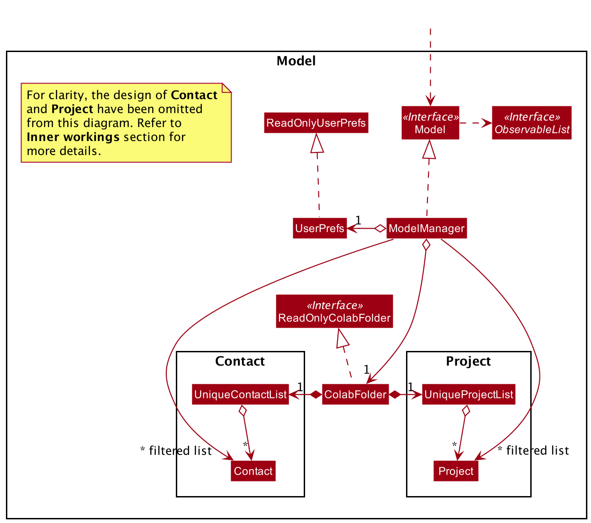

* Table of Contents
{:toc}

--------------------------------------------------------------------------------------------------------------------
## **Setting up, getting started**

Refer to the guide [_Setting up and getting started_](SettingUp.md).

--------------------------------------------------------------------------------------------------------------------

## **Design**

### Architecture

The ***Architecture Diagram*** given above explains the high-level design of the App. Given below is a quick overview of each component.

:bulb: **Tip:** The `.puml` files used to create diagrams in this document can be found in the [diagrams](https://github.com/AY2021S2-CS2103T-W10-1/tp/tree/master/docs/diagrams/) folder. Refer to the [_PlantUML Tutorial_ at se-edu/guides](https://se-education.org/guides/tutorials/plantUml.html) to learn how to create and edit diagrams.

**`Main`** has two classes called [`Main`](https://github.com/AY2021S2-CS2103T-W10-1/tp/tree/master/src/main/java/seedu/address/Main.java) and [`MainApp`](https://github.com/AY2021S2-CS2103T-W10-1/tp/tree/master/src/main/java/seedu/address/MainApp.java). It is responsible for,
* At app launch: Initializes the components in the correct sequence, and connects them up with each other.
* At shut down: Shuts down the components and invokes cleanup methods where necessary.

[**`Commons`**](#common-classes) represents a collection of classes used by multiple other components.

The rest of the App consists of four components.

* [**`UI`**](#ui-component): The UI of the App.
* [**`Logic`**](#logic-component): The command executor.
* [**`Model`**](#model-component): Holds the data of the App in memory.
* [**`Storage`**](#storage-component): Reads data from, and writes data to, the hard disk.

Each of the four components,

* defines its *API* in an `interface` with the same name as the Component.
* exposes its functionality using a concrete `{Component Name}Manager` class (which implements the corresponding API `interface` mentioned in the previous point.

For example, the `Logic` component (see the class diagram given below) defines its API in the `Logic.java` interface and exposes its functionality using the `LogicManager.java` class which implements the `Logic` interface.

**How the architecture components interact with each other**

The *Sequence Diagram* below shows how the components interact with each other for the scenario where the user issues the command `delete 1`.

The sections below give more details of each component.

### UI component

**API** :
[`Ui.java`](https://github.com/AY2021S2-CS2103T-W10-1/tp/tree/master/src/main/java/seedu/address/ui/Ui.java)

The UI consists of a `MainWindow` that is made up of parts e.g.`CommandBox`, `ResultDisplay`, `PassengerListPanel`, `StatusBarFooter` etc. All these, including the `MainWindow`, inherit from the abstract `UiPart` class.

The `UI` component uses JavaFx UI framework. The layout of these UI parts are defined in matching `.fxml` files that are in the `src/main/resources/view` folder. For example, the layout of the [`MainWindow`](https://github.com/AY2021S2-CS2103T-W10-1/tp/tree/master/src/main/java/seedu/address/ui/MainWindow.java) is specified in [`MainWindow.fxml`](https://github.com/AY2021S2-CS2103T-W10-1/tp/tree/master/src/main/resources/view/MainWindow.fxml)

The `UI` component,

* Executes user commands using the `Logic` component.
* Listens for changes to `Model` data so that the UI can be updated with the modified data.

### Logic component

**API** :
[`Logic.java`](https://github.com/AY2021S2-CS2103T-W10-1/tp/tree/master/src/main/java/seedu/address/logic/Logic.java)

1. `Logic` uses the `AddressBookParser` class to parse the user command.
1. This results in a `Command` object which is executed by the `LogicManager`.
1. The command execution can affect the `Model` (e.g. adding a passenger).
1. The result of the command execution is encapsulated as a `CommandResult` object which is passed back to the `Ui`.
1. In addition, the `CommandResult` object can also instruct the `Ui` to perform certain actions, such as displaying help to the user.

Given below is the Sequence Diagram for interactions within the `Logic` component for the `execute("delete 1 2")` API call.

:information_source: **Note:** The lifeline for `DeleteCommandParser` should end at the destroy marker (X) but due to a limitation of PlantUML, the lifeline reaches the end of diagram.

### Model component

**API** : [`Model.java`](https://github.com/AY2021S2-CS2103T-W10-1/tp/tree/master/src/main/java/seedu/address/model/Model.java)

The `Model`,

* stores a `UserPref` object that represents the user’s preferences.
* stores the GME terminal data.
* exposes an unmodifiable `ObservableList<Passenger>` and `ObservableList<Pool>` that can be 'observed' e.g. the UI can be bound to this list so that the UI automatically updates when the data in the list change.
* does not depend on any of the other three components.

:information_source: **Note:** An alternative (arguably, a more OOP) model is given below. It has a `Tag` list in the `AddressBook`, which `Passenger` references. This allows `AddressBook` to only require one `Tag` object per unique `Tag`, instead of each `Passenger` needing their own `Tag` object. 

### Storage component

**API** : [`Storage.java`](https://github.com/AY2021S2-CS2103T-W10-1/tp/tree/master/src/main/java/seedu/address/storage/Storage.java)

The `Storage` component,
* can save `UserPref` objects in json format and read it back.
* can save the address book data in json format and read it back.

### Common classes

Classes used by multiple components are in the `seedu.addressbook.commons` package.

--------------------------------------------------------------------------------------------------------------------

## Implementation
This section describes some noteworthy details on how certain features are implemented.

### Pool feature
This feature allows users to create and add a pool to the list of pools, through the use of a `pool` command.

Design considerations include the `pool` command being able to be used in conjunction with the `find` command. For instance, the user would
first use `find tag/female` and then followed by `pool n/Alice p/91234567 d/MONDAY t/1930 c/2 c/3`.
The `find tag/female` command first filters the list of displayed passengers, such that only passengers with the `female` tag would be displayed. Calling the `pool` command
would then assign `Alice` with number `91234567` to be the driver of the passengers specified by the indices for the currently displayed list.

The activity diagram below encapsulates the user workflow of adding passengers, finding passengers and then pooling the passengers:

The rationale behind this implementation was because once the GME terminal is populated with a large number of passengers, it would be rather difficult for the user to find a specific passenger.
By allowing the user to first filter the passengers then subsequently pooling from the filtered list would greatly enhance the feature, thereby making the product much more cohesive as features work well together.

Given below is the Sequence Diagram for interactions within the Logic component for the `execute("pool n/Alice p/91234567 d/monday t/1930 c/2 c/3")` command.

:information_source: **Note:**  The `command` argument that is passed into
`execute()`, represents the string `"pool n/Alice p/91234567 d/monday t/1930 c/2 c/3"`, and has been abstracted for readability.
 
The lifeline for `PoolCommandParser` should end at the destroy marker (X) but due to a limitation of PlantUML, the lifeline reaches the end of diagram.

From the diagram illustrated above:
1. `LogicManager` has its `execute()` method called when a user enters the `"pool n/Alice p/91234567 d/monday t/1930 c/2 c/3"` command.
1. `AddressBookParser` class is then instantiated, which subsequently instantiates `PoolCommandParser` class to help parse the user's command.
1. `AddressBookParser` would then have its `parse()` method invoked to parse the arguments of `"n/Alice p/91234567 d/monday t/1930 c/2 c/3"` to
   `PoolCommandParser` which creates and returns a `PoolCommand`.
1. `LogicManager` would subsequently invoke the `execute()` method of the `PoolCommand`, which in turn calls its own method of `getPassengersFromIndexes()` 
   that gets a list of passengers from `Model` by calling `getFilteredPassengerList()`.
1. A `Pool` object is then created with the list of passengers returned by `getPassengersFromIndexes()`, and then added to the model by the `addPool()` method.
1. The model filtered pool list is then updated with `updateFilteredPoolList()` with a predicate to show all pools in the list `PREDICATE_SHOW_ALL_POOLS`.
1. Finally, a `CommandResult` would be returned back to `LogicManager` to indicate the completion status of the command.

It is worth noting that in the case of adding a passenger, a `Passenger` object is created by `AddCommandParser` and used in the constructor of `AddCommand`.
However, in the case of adding a pool, a `PoolCommand` is constructed using the details specified and parsed from `PoolCommandParser`, instead of creating and passing a `Pool` object.
The rationale is due the fact that a list of passengers have to be obtained from the indexes specified, which requires interactions with the model.
The current implementation thus encapsulates all the interactions with model, within the methods of `PoolCommand`.

### Unpool feature
This feature allows users to remove a pool from the pool list through the specification of an index.

Design considerations include the `findPool` command being able to be used in conjunction with the `unpool` command. For instance, the user might first use `findPool n/Alice` and then followed by `unpool 1`.
The `findPool n/Alice` command first filters the list of displayed pools, such that only pools in which there is a passenger named Alice will be displayed. Calling the `unpool` command would then remove the pool specified by the provided indices from the currently displayed list, removing it from the system. The `findPool` command works similarly to the `find` command, except that it currently only supports the use of the name prefix: "/n"

The activity diagram below encapsulates the user workflow of adding passengers, finding passengers and then pooling the passengers:

The rationale behind this implementation was because once the GME terminal is populated with a large number of pools, it would be rather difficult for the user to find a specific pool with a specific passenger.
By allowing the user to first filter the pools before subsequently removing the pool from the filtered list, the findPool feature greatly enhances the unpool feature, thereby making the product much more cohesive as features work well together.

Given below is the Sequence Diagram for interactions within the Logic component for the `execute("unpool 1")`.

:information_source: **Note:** The lifeline for `UnpoolCommandParser` should end at the destroy marker (X) but due to a limitation of PlantUML, the lifeline reaches the end of diagram.

From the diagram illustrated above:
1. `LogicManager` has its `execute()` method called when a user enters the `"unpool 1"` command.
1. `AddressBookParser` class is then instantiated, which subsequently instantiates `UnpoolCommandParser` class to help parse the user's command.
1. `AddressBookParser` would then have its `parse()` method invoked, passing the argument `"1"` to `UnpoolCommandParser`.
1. Given that the index `"1"` is a valid index, an `UnpoolCommand` object would be created and returned to `LogicManager`.
1. `LogicManager` would subsequently invoke the `execute()` method of the `UnpoolCommand` which in turn invokes `deletePool()` method with an argument of `1`.
1. This would update the model by deleting the specified pool at the first index, then the result of the command execution `CommandResult` would be created and returned back to `LogicManager`.

### findPool feature
This feature allows users to find a pool that contains a passenger with a provided keyword in their name.

Given below is the Sequence Diagram for interactions within the Logic component for the `execute("findPool n/Alice")` command.

:information_source: **Note:**  The `command` argument that is passed into
`execute()`, represents the string `"findPool n/Alice"`, and has been abstracted for readability.
 
The lifeline for `FindPoolCommandParser` should end at the destroy marker (X) but due to a limitation of PlantUML, the lifeline reaches the end of diagram.

From the diagram illustrated above:
1. `LogicManager` has its `execute()` method called when a user enters the `"findPool n/Alice"` command.
1. `AddressBookParser` class is then created, which subsequently creates `FindPoolCommandParser` class to help parse the user's command.
1. `AddressBookParser` would then have its `parse()` method invoked to parse the argument `"n/Alice"` and passes it to
   `FindPoolCommandParser`.
1. `FindPoolCommandParser` parses the argument `"n/Alice"` and creates a `PooledPassengerContainsKeywordPredicate` which is returned to the `FindPoolCommandParser`.
1. `FindPoolCommandParser` then creates a `FindPoolCommand`, and provides the newly created `PooledPassengerContainsKeywordPredicate` to it. The `FindPoolCommand` object is then returned to `LogicManager`.
1. `LogicManager` would subsequently invoke the `execute()` method of the `FindPoolCommand`, which in turn calls the `updateFilteredPoolList()` method in `Model`, causing the shown pool list to be updated according to the predicate in the `FindPoolCommand` object.
1. A `Pool` object is then created with the list of passengers returned by `getPassengersFromIndexes()`, and then added to the model by the `addPool()` method.
1. Finally, a `CommandResult` would be returned to `LogicManager` to indicate the completion status of the command.

### Find feature

The rationale behind expanding on the find feature is to allow for the user to find passengers by more attributes to improve usability.
Instead of being restricted to searching for names only, the user can now find other passengers with the same day or of a certain area.
This is vital as it is necessary to improve the usability for the user when attempting to find passengers to carpool with drivers.

:information_source: **Note:**  The `command` argument that is passed into
`execute()`, represents the string `"find n/Lucy n/Adam"`, and has been abstracted for readability.
 
The lifeline for `FindCommandParser` should end at the destroy marker (X) but due to a limitation of PlantUML, the lifeline reaches the end of diagram.

From the diagram illustrated above:
1. `LogicManager` has its `execute()` method called when a user enters the `"find n/Lucy n/Adam"` command.
1. Object of `AddressBookParser` class is then accessed, which then subsequently creates `FindCommandParser` class object to help parse the user's command.
1. `AddressBookParser` would then invoke the `parse()` method of `FindCommandParser`, with parameters `n/Lucy n/Adam`, to parse the arguments `n/Lucy n/Adam`.
1. `FindCommandParser` parses the arguments `n/Lucy n/Adam` and creates a `NameContainsKeywordPredicate` object named `predicate` which is returned to the `FindCommandParser` object.
1. `FindCommandParser` then instantiates a `FindCommand` object with `predicate` as a parameter. The `FindCommand` object is then returned to `LogicManager`.
1. `LogicManager` would subsequently invoke the `execute()` method of `FindCommand`, which in turn calls the `updateFilteredPoolList()` method in `Model`, causing the shown pool list to be updated according to `predicate` in the `FindCommand` object.
1. A `CommandResult` object is then created with a message which includes the number of passengers found on the list updated by `updateFilteredPoolList()`.
1. Finally, the `CommandResult` object is returned to `LogicManager`.

--------------------------------------------------------------------------------------------------------------------

## **Documentation, logging, testing, configuration, dev-ops**

* [Documentation guide](Documentation.md)
* [Testing guide](Testing.md)
* [Logging guide](Logging.md)
* [Configuration guide](Configuration.md)
* [DevOps guide](DevOps.md)

--------------------------------------------------------------------------------------------------------------------

## **Appendix: Requirements**

### Product scope

**Target user profile**:

- a HR executive who is required to find and pool passengers with drivers from an already existing database.
- prefer desktop apps over other types
- is able to type fast
- prefers typing to mouse interactions
- is reasonably comfortable using CLI apps

**Value proposition**: Greater ease of use in managing driver and passenger profiles as compared to an Excel sheet.

--------------------------------------------------------------------------------------------------------------------

### User Stories

Priorities: High (must have) - `* * *`, Medium (nice to have) - `* *`, Low (unlikely to have) - `*`

|Priority|As a …​    |I want to …​                                                  |So that                                                                                         |
|--------|--------------|-----------------------------------------------------------------|------------------------------------------------------------------------------------------------|
|* * *   |HR Executive  |allocate drivers to passengers to be picked up                   |I can arrange carpooling trips for my colleagues                                                |
|* * *   |HR Executive  |search for specific type of passengers                           |I can see if any passengers fulfil a criteria and view their carpool details                    |
|* * *   |HR Executive  |list all passengers                                              |I can see all the passengers available                                                          |
|* * *   |HR Executive  |create a profile                                                 |I can easily manage and track drivers and passengers                                            |
|* * *   |HR Executive  |delete employee profile                                          |passenger's data will not be stored when they are no longer looking to carpool                  |
|* *     |HR Executive  |filter passengers' destination and pickup point based on location|drivers are not heavily inconvenienced to pick up passengers                                    |
|* *     |HR Executive  |match only with female drivers                                   |so that female colleagues looking to carpool only with female drivers can be easily accomodated |
|* *     |HR Executive  |edit drop off location                                           |passengers and drivers who have negotiated a new drop off location can be easily updated        |
|*       |HR Executive  |indicate the price willing to pay                                |drivers are more likely to choose these passengers                                              |

## Use Cases

**Use case: Allocate drivers to passengers to be picked up**

**MSS:**
1. Search or list out passengers available to be picked up.
2. GME shows a list of passengers.
3. HR executive chooses and view the details of the specific passenger.
4. HR executive allocates drivers to specific passenger to the driver's carpooling group.
   
   Use case ends.

***Extensions***

* 1a. The list is empty.

  Use case ends.

--------------------------------------------------------------------------------------------------------------------

**Use case: Search for specific type of passengers**

**MSS:**
1. HR executive chooses the criteria that the passengers need to fulfil in order to be picked up.
2. HR exective initiates the search.
3. GME shows a list of passengers that fulfils the criteria.

   Use case ends.

***Extensions***

* 3a. No passenger fulfils the criteria.
  * 3a1. GME shows empty list.

  Use case ends.

--------------------------------------------------------------------------------------------------------------------

**Use case: Create a passenger profile**

**MSS:**
1. HR exeuctive fills out the passenger's name, contact number and pickup address.
2. GME verifies that all the required fields are not empty.
3. GME adds passenger's details to GME.

   Use case ends.

***Extensions***

* 2a. Any required field is missing.
  * 2a1. GME warns the user to input the data missing.

    Use case ends.

--------------------------------------------------------------------------------------------------------------------

**Use case: Delete a passenger profile**

**MSS:**
1. HR exeuctive indicates they would like to delete a passenger profile.
2. GME verifies that passenger exists.
3. GME deletes the specific passenger's profile.

   Use case ends.

***Extensions***

* 2a. Index number of passenger does not exist.
    * 2a1. GME warns that no such passenger exists.

      Use case ends.

--------------------------------------------------------------------------------------------------------------------

**Use case:** **Match only with female drivers**

**Pre-conditions:** Female passenger profile indicating that they are looking for female drivers only have been created

**MSS:**
1. HR Executive finds passengers only looking for female drivers.
2. HR Executive then matches female drivers to female passengers looking for female drivers only.

   Use case ends.

--------------------------------------------------------------------------------------------------------------------

### Non-Functional Requirements

1. **Usability**:
    - GME shall work on any *mainstream OS* as long as it has Java `11` or above installed.
    - GME's interface shall be user-friendly and easy to use by using mouse when not using commands, meaning all buttons and interaction should be self-explanatory and intuitive which can be used by people without training.
    - A user with above average typing speed for regular English text (i.e. not code, not system admin commands) should be able to accomplish most of the tasks faster using commands than using the mouse.
2. **Reliability**:
    - GME shall allow drivers to pick passengers throughout the week ant any time during the day, up to 6 passengers depending on car size.
    - GME Should be able to hold up to 1000 persons (drivers and passengers included) without a noticeable sluggishness in performance for typical usage.
3. **Security:**
    - Only users that creates their own profile can view their private information and change the privacy settings
4. **Integrity**
    - All monetary amounts (including passenger's tips) must be accurate to two decimal places and in SGD.
    - All geolocation coordinates must be accurate to six decimal places.
    - All email and phone numbers provided by users must pass through format check.
    - All time-related data that is presented to user must be accurate to minutes, and use `DD-MM-YYYY` format
    - All timestamps for any events occurred recorded by the GME shall be in UTC (Universal Time Coordinated) when placed into permanent storage.
5. **Flexibility**
    - GME shall be able to process different date formats input by user and converts to `DD-MM-YYYY`

--------------------------------------------------------------------------------------------------------------------

### Glossary

- **Driver**: An employee that is in-charge of driving passengers within the pool to their location.
- **GME**: GreenMileageEfforts, this software that is used to arrange carpooling.
- **Mainstream OS**: Windows, Linux, Unix, MacOS.
- **Pool**: A group of employees carpooling together. Consists of one driver and at least one passenger.
- **Passenger**: An employee carpooling with at least one driver.
- **Tag**: A miscellaneous piece of information about the pool, passenger, or driver that isn't captured by the other fields but is good to have.

--------------------------------------------------------------------------------------------------------------------

## **Appendix: Instructions for manual testing**

Given below are instructions to test the app manually.

:information_source: **Note:** These instructions only provide a starting point for testers to work on;
testers are expected to do more *exploratory* testing.

### Launch and shutdown

1. Initial launch.

    1. Download the jar file and copy into an empty folder.

    1. Double-click the jar file Expected: Shows the GUI with a set of sample contacts. The window size may not be optimum.

1. Saving window preferences.

    1. Resize the window to an optimum size. Move the window to a different location. Close the window.

    1. Re-launch the app by double-clicking the jar file. 
       Expected: The most recent window size and location is retained.

### Deleting a passenger

1. Deleting a passenger while all passengers are being shown.

    1. Prerequisites: List all passengers using the `list` command. Multiple passengers in the list. Passengers to be deleted are not in a pool.

    1. Test case: `delete 1`. 
       Expected: First contact is deleted from the list. Name of the deleted contact shown in the status message.

    1. Test case: `delete 0`. 
       Expected: No passenger is deleted. Error details shown in the status message. Text in command bar turns red.

    1. Other incorrect delete commands to try: `delete`, `delete x`, `...` (where x is larger than the list size). 
       Expected: Similar to previous.

1. Deleting multiple passengers while all passengers are being shown.

    1. Prerequisites: List all passengers using the `list` command. Multiple passengers in the list. Passengers to be deleted are not in a pool.

    1. Test case: `delete 1 2`. 
       Expected: First and second contact is deleted from the list. Names of deleted contacts are shown in the status message.

### Finding a passenger

1. Finding passengers by name while all passengers shown.

    1. Prerequisites: Using sample passengers, list all passengers using the `list` command. Multiple passengers in the list.

    1. Test case: `find n/bernice`. 
       Expected: Details of passenger named `Bernice Yu` is shown. Status message shows 1 passenger listed.

    1. Test case: `find n/alex`. 
       Expected: No passengers are shown. Status message shows 0 passenger listed.

    1. Test case: `find n/ROY n/lEnny`. 
       Expected: Details of passengers named `Roy Balakrishnan` and `Lenny Hoon` shown. Status message shows 2 passengers listed.

    1. Test case: `find n/   David lI`. 
       Expected: Details of passenger named `David Li` is shown. Status message shows 1 passenger listed.

1. Finding passengers by tag while all passengers are shown.

    1. Prerequisites: Using sample passengers, list all passengers using the `list` command. Multiple passengers in the list.

    1. Test case: `find tag/finance`. 
       Expected: Details of `Bernice Yu` and `Roy Balakrishnan` are shown. Status message shows 2 passengers listed.

    1. Test case: `find tag/marketing tag/sales`. 
       Expected: Details of `Bernice Yu`, `Irfan Ibrahim` and `Turner Peck` are shown. Status message shows 3 passengers listed.

    1. Test case: `find tag/marketing sales`. 
       Expected: Passengers are shown are same as previous. Status message shows tag provided is invalid.

### Saving data

1. Dealing with missing/corrupted data files.

    1. _{explain how to simulate a missing/corrupted file, and the expected behavior}_

1. _{ more test cases …​ }_
