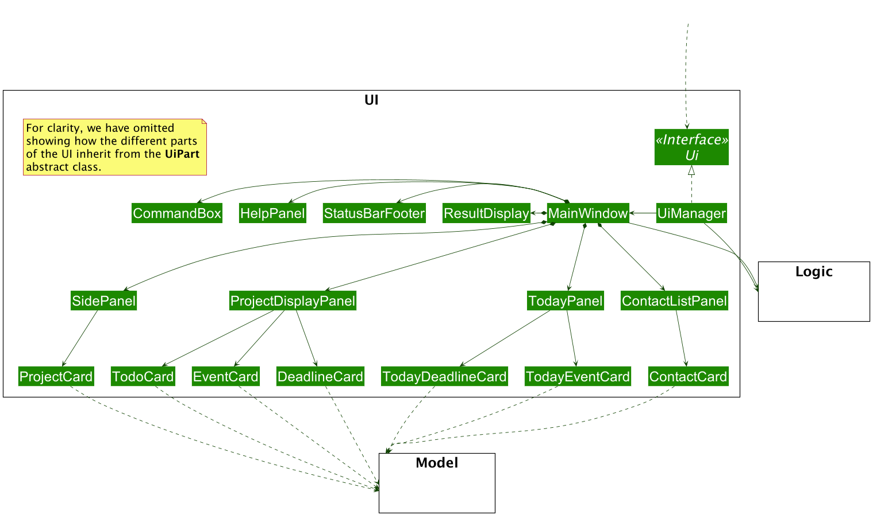

* Table of Contents
{:toc}

--------------------------------------------------------------------------------------------------------------------

## **Setting up, getting started**

Refer to the guide [_Setting up and getting started_](SettingUp.md).

--------------------------------------------------------------------------------------------------------------------
## **Introduction**
**Tutor Tracker** is a desktop tuition management application meant for secondary students to track their tuition information, such as upcoming tuition appointments and tutor's contact information.
It focuses on the Command Line Interface (CLI) while providing users with a simple and clean Graphical User Interface (GUI).
Thus, the main interaction with **Tutor Tracker** will be done through commands.

Tutor Tracker is an all-in-one tuition management solution for tech-savvy secondary school students.
The features of Tutor Tracker includes:

- Viewing of tutors' profile
- Adding a note to each tutor's profile
- Exporting tutor's details  
- Adding, editing, deleting and viewing of tuition appointments
- Adding, editing, deleting and viewing of tuition-related schedules
- Filtering tutors by personal preference (i.e. availability, experiences, name, location, price, etc.)
- Adding, editing, deleting and listing grade records in GradeBook
- Adding, editing, deleting and viewing of reminders

The purpose of this Developer Guide is to help you understand the design and implementation of Tutor Tracker to get started on your contributions to Tutor Tracker.

## **Design**
This section will help you learn more about the design and structure of Tutor Tracker. Each section will describe and explains how each component of the application works.
It's noteworthy to mention that the Tutor Tracker follows an Object-Oriented Programming paradigm.

### Architecture

_Figure 1. Architecture Diagram of Tutor Tracker_

The ***Architecture Diagram*** given above explains the high-level design of the App. Given below is a quick overview of each component.

:bulb: **Tip:** The `.puml` files used to create diagrams in this document can be found in the [diagrams](https://github.com/se-edu/addressbook-level3/tree/master/docs/diagrams/) folder. Refer to the [_PlantUML Tutorial_ at se-edu/guides](https://se-education.org/guides/tutorials/plantUml.html) to learn how to create and edit diagrams.

The application consists of 6 main components:

| Component                           | Description
| ----------------------------------- | -------------------------------------------------------------------- |
| `Main`                              | **`Main`** has two classes called [`Main`](https://github.com/AY2021S2-CS2103-T14-3/tp/blob/master/src/main/java/seedu/address/Main.java) and [`MainApp`](https://github.com/AY2021S2-CS2103-T14-3/tp/blob/master/src/main/java/seedu/address/MainApp.java).  It is responsible for: <li>At app launch: Initializes the components in the correct sequence, and connects them up with each other.</li> <li>At shut down: Shuts down the components and invokes cleanup methods where necessary.</li>|
| [**`UI`**](#ui-component)           | The UI of the App.                                                   |
| [**`Logic`**](#logic-component)     | The command executor.                                                |
| [**`Model`**](#model-component)     | Holds the data of the App in memory.                                 |
| [**`Storage`**](#storage-component) | Reads data from, and writes data to, the hard disk.                  |
| [**`Commons`**](#common-classes)    | Represents a collection of classes used by multiple other components.|

For each of `UI`, `Logic`, `Model` and `Storage` component, it
* defines its *API* in an `interface` with the same name as the Component.
* exposes its functionality using a concrete `{Component Name}Manager` class (which implements the corresponding API `interface` mentioned in the previous point.

**How the architecture components interact with each other**

The *Sequence Diagram* below shows how the components interact with each other for the scenario where the user issues the command `delete_appointment 1`.

The sections below give more details of each component.

### UI component

**API** :
[`Ui.java`](https://github.com/AY2021S2-CS2103-T14-3/tp/blob/master/src/main/java/seedu/address/ui/Ui.java)

The UI consists of a `MainWindow` that is made up of parts e.g.`CommandBox`, `ResultBarFooter`, `FilterPanel`, `TutorListPanel` etc. 
All these, including the `MainWindow`, inherit from the abstract `UiPart` class.

The `UI` component uses JavaFx UI framework. The layout of these UI parts are defined in matching `.fxml` files that are in the `src/main/resources/view` folder. For example, the layout of the [`MainWindow`](https://github.com/AY2021S2-CS2103-T14-3/tp/blob/master/src/main/java/seedu/address/ui/MainWindow.java) is specified in [`MainWindow.fxml`](https://github.com/AY2021S2-CS2103-T14-3/tp/blob/master/src/main/resources/view/MainWindow.fxml)

The `UI` component,

* Executes user commands using the `Logic` component.
* Listens for changes to `Model` data so that the UI can be updated with the modified data.

### Logic component

**API** :
[`Logic.java`](https://github.com/AY2021S2-CS2103-T14-3/tp/blob/master/src/main/java/seedu/address/logic/Logic.java)

1. `Logic` uses the `TutorTrackerParser` class to parse the user command.
1. This results in a `Command` object which is executed by the `LogicManager`.
1. The command execution can affect the `Model` (e.g. adding an appointment).
1. The result of the command execution is encapsulated as a `CommandResult` object which is passed back to the `Ui`.
1. In addition, the `CommandResult` object can also instruct the `Ui` to perform certain actions, such as displaying help to the user.

Given below is the Sequence Diagram for interactions within the `Logic` component for the `execute("delete_appointment 1")` API call.

:information_source: **Note:** The lifeline for `DeleteCommandParser` should end at the destroy marker (X) but due to a limitation of PlantUML, the lifeline reaches the end of diagram.

### Model component

**API** : `Model.java`

The `Model`,

* stores a `UserPref` object that represents the user’s preferences.
* stores the TutorTracker data.
* exposes an unmodifiable `ObservableList<XYZ>` that can be 'observed' e.g. the UI can be bound to this list so that the UI automatically updates when the data in the list change.

### Storage component

**API** : `Storage.java`

The `Storage` component,
* can save `UserPref` objects in json format and read it back.
* can save the Tutor Tracker details in json format and read it back.

### Common classes

Classes used by multiple components are in the `seedu.address.commons` package.

--------------------------------------------------------------------------------------------------------------------

## **Implementation**

### [Proposed] Favourite Feature
#### Proposed Implementation
The proposed favourite feature is to facilitate the user to keep track of his/her favourites out of the entire list of tutors. 
It implements the following operations:
* `Favourite tutor` - Add a tutor to the list of favourite tutors.
* `Unfavourite tutor` - Delete the tutor from the list of favourite.
* `List favourites` - Show the list of the favourite tutor.

These operations are exposed in the `Logic` interface by parsing respective `FavouriteCommand`,
`UnfavouriteCommand` and `ListFavouriteCommand`.

Given below are example usage scenarios and how the favourite feature behaves at each step.

### Note Feature
#### Proposed Implementation
Tutor Tracker's Notes feature allows users to create notes that are tagged to specific tutors and export them into a text file.

#### Rationale
As Tutor Tracker is an application to aid users to track their upcoming tuition appointments, we have also considered 
that users may also wish to add notes to specific tutors to keep track of miscellaneous information that the user might have. 
We also considered that the user might want to export details and notes of a tutor into a text file for ease of reference and sharing.

#### Implementation
The proposed note feature is to facilitate the user to keep track of his/her own note of different tutors and export them.
The notes feature consists of the following operations that can be performed on tutors:
* `Add note` - Adds a note to a tutor
* `Delete note` - Deletes the note of a tutor
* `Edit note` - Edits a note of a tutor
* `List note` - List tutor(s) that has a note
* `Export tutor` - Exports the details and attached notes into a text file 

These operations are exposed in the `Logic` interface by parsing respective `AddNoteCommand`,
`DeleteNoteCommand`, `EditNoteCommand`, `ListNoteCommand` and `ExportCommand`.

Given below are example usage scenarios and how the note feature behaves at each step.

When the user enters any of the aforementioned commands, 
the user input command undergoes the same command 
parsing as described in the [Logic component](#logic-component).

To add, delete or edit a `Notes` of a `Tutor`, we use of an `EditTutorDescriptor`. The `EditTutorDescriptor` describes the 
attributes of a tutor to be edited. To add a `Notes` to a `Tutor`, we can simply create an `EditTutorDescriptor` which a 
`Notes` descriptor, and edit the corresponding `Tutor` with this descriptor. The following shows an example of how an
`AddNoteCommand` is executed.

Steps for the execution of the `AddNoteCommand` (assuming that no errors are encountered):
1. When the `execute()` method of the `LogicManager` is called, the `TutorTrackerParser`'s `parseCommand()` method is called.
2. The `TutorTrackerParser` will then create a `AddNoteCommandParser`.
3. The `AddNoteCommandParser` will then parse and validate the inputs, and creates a `AddNoteCommand` with a target index number, 
   and an `EditTutorDescriptor` with a `Notes` descriptor.
4. The `execute()` method of the created `AddNoteCommand` will be called.
5. The `AddNoteCommand` will validate both the index number and the `EditTutorDescriptor` and call the `ModelManager`'s 
   `setTutor()` command which will add a new `Notes` to the existing tutor. 
6. After the new `Notes` has been successfully added to a tutor, it will update the GUI with the new `Notes`, and return
   a `CommandResult` to provide feedback of the command's execution.

#### Design Consideration

**Displaying Notes in the GUI**

|              | **Pros**   | **Cons** |
| -------------|-------------| -----|
| **Option 1 (current choice)**   Display tutors with attached notes in the same list view. | Allows users to view everything in a single panel. | The tutor panel might look cluttered when the notes are long.|
| **Option 2**   Display notes with a pop up when a tutor is selected. | Prevents the GUI from being too cluttered with information. | May impose inconvenience as users would have to select a tutor in order to view their notes |

Reason for choosing option 1:
* We want the user to be able to see their notes easily and having to type in another command to select and show the notes
  in a separate pop up poses too much of an inconvenience.
* The window to display the notes has been made static, and a scrollbar is added when the notes are too long to fit into the
  static window. This can help make the GUI look less cluttered.
  
The following activity diagram summarizes what happens when the `add_note` command is executed.

To export the details and notes of a `Tutor` into a text file, we use the `export` command. The `export` command would
create a new folder `/export` in the root directory. Details and notes of a `Tutor` would be converted into human-readable
text form and exported into the `/export` folder.

### Grade Book
Tutor tracker's Grade Book is to allow users to keep track their grade records for self reference and future study planning.

#### Rationale
As Tutor Tracker is an application to aid users to manage the tutor and tuition information, we have also considered that users
may wish to keep track and manager their academic records for self reference and future study planning. Examples are keeping track
their grades of different tests and different subjects. With Grade Book, users can now store and manage all tuition-related and academic
related information on the same application instead of using multiple applications.

#### Implementation
A grade is composed of a `subject`, `graded item` and `grade letter`, out of which `subject` and `graded item` are used to identify a grade object uniquely. 

All the user's grades are stored internally in the `GradeList`. Grade Book consist of the following operations
that can be performed on the grade:   

* `Add a grade` - Add a grade record to user's `GradeBook`.
* `Delete a grade` - Delete an existing grade record at specified index of the `GradeBook`.
* `Edit a grade` - Edit an existing grade record (changing its attributes' value) at specified index displayed in the `GradeBook`.
* `List all grades` - Display a list of all existing grade records in the `GradeBook`

These operations are exposed in the `Logic` interface by parsing respective `AddGradeCommand`,
`DeleteGradeCommand`, `EditGradeCommand` and `ListGradeCommand`.

When the user enters the `add_grade` command to add a new command, the user input command undergoes
the same command parsing as described in [Logic component](#logic-component).

Steps for the execution of the `AddGradeCommand` (assuming that no errors are encountered):
1. When the `execute()` method of the `LogicManager` is called, the `TutorTracker`'s `parseCommand()` method is called.
2. The `TutorTrackerParser` will then create a `AddGradeCommandParser`.
3. The `AddGradeCommandParser` will then parse the inputs, and creates a `AddGradeCommand`.
4. The `AddGradeCommand` will then validate the parameters and creates a `Grade` object.
5. Assuming that the above steps are all successful, the `LogicManager` will call the `ModelManager`'s `addGrade()`, 
then create a `CommandResult` object and return the result.
6. The `Ui` component will detect this cahnge and update the GUI.

#### Design Consideration

**Displaying Schedule in the GUI**

|              | **Pros**   | **Cons** |
| -------------|-------------| -----|
| **Option 1**   Display grades with budget and reminder in the same list view. | Allows users to view everything in a single panel. | Users may have difficulty to differentiate grades, budget and reminders if a considerable number of them are listed all together.|
| **Option 2 (current choice)**   Display grades in a separate tab from budget and reminder in a `Your Information` panel. | Clear segregation between grades, budget and reminder. | May impose inconvenience as users have to switch tabs between grades, budget and reminder depending on their needs |

Reason for choosing option 2:
* As we do not wish to overwhelm the user with too much information to provide a better user experience, we decided that option 2 may be a better option.

The following activity diagram summarizes what happens when the `add_grade` command is executed.

### [Proposed] Filter Feature
This Filter feature would allow users to manage filters and apply them to the list of tutors
and appointments. This would facilitate filtering of tutors by attributes such as personal
information as well as the subjects they teach, as well as filter appointments by appointment attributes.

The following commands would be added:
* Add filter - Add a new filter to the filter list, updating the visible tutors and appointments
* Delete filter - Delete a filter from the filter list
* Edit filter - Edit a filter from the filter list (including whether it is active)
* List filters - List all filters currently used

#### Proposed Implementation
A new `Filter` class would be implemented, along with a list to store them. Each `Filter` object
would contain predicates that filter the attribute classes, which would be combined and used to
filter the lists of tutors and appointments.

These filters would be shown in the UI along the top of the list of tutors and appointments, showing
the active and inactive filters.

### Schedule Tracker
Tutor Tracker's Schedule Tracker allows users to create schedules to track their ongoing or upcoming timed-sensitive tasks.

#### Rationale
As Tutor Tracker is an application to aid users to track their upcoming tuition appointments, we have also considered that users may also wish to keep track and manage other time-sensitive tuition-related tasks. 
Examples are allocating time to finish their tuition homework or any other tuition-related tasks.
With Schedule Tracker feature, users can now keep track and manage all tuition-related information on the same application instead of using multiple applications.

#### Implementation

A schedule is composed of a `title`, `description`, `schedule date`, `time from` and `time to`, which are used to identify a schedule uniquely.

All the user's schedules are stored internally in the `scheduleList`.
Schedule Tracker consist of the following operations that can be performed on schedule:
* `Add a schedule` - Add a new schedule and store it in the user's `scheduleList`.
* `Delete a schedule` - Delete a schedule by the index displayed in the `scheduleList`.
* `Edit a schedule` - Edit a schedule (changing its attributes' value) by the index displayed in the `scheduleList`. 
* `View schedules` - View the list of schedules that is happening on the queried date.
* `List all schedules` - View all the schedules stored in the `scheduleList`.
 
These operations are exposed in the `Logic` interface by parsing respective `AddScheduleCommand`,
`DeleteScheduleCommand`, `EditScheduleCommand` and `ViewScheduleCommand`.

When the user enters the `add_schedule` command to add a new schedule, the user input command undergoes the same command parsing as described in
[Logic component](#logic-component).

Steps for the execution of the `AddScheduleCommand` (assuming that no errors are encountered):
1. When the `execute()` method of the `LogicManager` is called, the `TutorTrackerParser`'s `parseCommand()` method is called.
2. The `TutorTrackerParser` will then create a `AddScheduleCommandParser`.
3. The `AddScheduleCommandParser` will then parse the inputs, and creates a `AddScheduleCommand`.
4. The `AddScheduleCommand` will then validates the parameters and creates a `Schedule` object.
5. Assuming that the above steps are all successful, the `LogicManager` will call the `ModelManager`'s `addSchedule()`, then create a `CommandResult` object and return the result.
6. The `Ui` component will detect this change and update the GUI.

#### Design Consideration

##### Determine the hierarchy of schedule

|              | **Pros**   | **Cons** |
| -------------|-------------| -----|
| **Option 1**   Schedule to be a subclass of Appointment. | More ideal in terms of naming convention. | It may cause huge code changes and refactor required due to the Appointment class have already completed. |
| **Option 2 (current choice)**   Create an additional parent class to be inherited by Appointment and Schedule. | Less change in codes as the Appointment class was completed (v1.2) before this idea extension proposed in v1.3. | May confuse users with the naming convention if the definitions and examples are not clearly stated. |

Reason for choosing option 2:
* We estimated the number of code changes required, and we deem it to be quite substantial. Hence, we have decided to go for option 2, by creating an abstract parent class called `Event`.

##### Naming of the datetime attribute

After choosing option 2 from the previous consideration, another issue arose due to the separation of classes.

|              | **Pros**   | **Cons** |
| -------------|-------------| -----|
| **Option 1**   Rename `AppointmentDateTime` to `EventDateTime` . | More ideal in terms of naming convention. | It may cause huge code changes and refactor required due to the Appointment class have already completed. At the same time, we have other features such as the Appointment Filter, which is heavily build using the `AppointmentDateTime` variable. |
| **Option 2 (current choice)**   Retain the `AppointmentDateTime` attribute. | Less change in codes as the Appointment class was completed (v1.2) before this idea extension proposed in v1.3. | May confuse developers with the naming convention if the definitions and examples are not clearly stated. |

Reason for choosing option 2:
* We estimated the number of code changes required, and we deem it to be quite substantial. Hence, we have decided to go for option 2 by retaining the name `AppointmentDateTime` under the `Event` class. We have put comments in the class to explain the rationale behind it.

##### Displaying Schedule in the GUI

|              | **Pros**   | **Cons** |
| -------------|-------------| -----|
| **Option 1**   Display schedules with appointments in the same list view. | Allows users to view everything in a single panel. | Users may have difficulty to differentiate appointments and schedule if not looked properly. |
| **Option 2 (current choice)**   Display schedules in a separate tab from appointment. | Clear segregation between appointments and schedules. | May impose inconvenience as users have to switch tabs between appointments and schedules depending on their needs. |

Reason for choosing option 2:
* As we do not wish to overwhelm the user with too much information to provide a better user experience, we decided that option 2 may be a better option.
* Viewing appointments and schedules in the same panel is later proposed as a different solution in the Timeable Feature.

The following activity diagram summarizes what happens when the `add_schedule` command is executed.

### Reminder Tracker
Tutor Tracker's Reminder Tracker allows users to create reminders to help them track their ongoing or upcoming todos or non-time constraint tasks.

#### Rationale
As Tutor Tracker is an application to aid users to track their upcoming tuition appointments, we have also considered that users may also wish to keep track and manage tuition-related reminders.
Reminders are date but not time-sensitive, users can add as many reminders as they wish on a certain day.

#### Implementation
A reminder is composed of `description` and `date`, which are used to identify a reminder uniquely.

All the user's reminders are stored internally in the `reminderList`.
Reminder Tracker consist of the following operations that can be performed on reminders:
* `Add a reminder` - Add a new reminder and store it in the user's `reminderList`.
* `Delete a reminder` - Delete a reminder by the index displayed in the `reminderList`.
* `Edit a reminder` - Edit a reminder (changing its attributes' value) by the index displayed in the `reminderList`.
* `List all reminders` - View all the reminders stored in the `reminderList`.

These operations are exposed in the `Logic` interface by parsing respective `AddReminderCommand`,
`DeleteReminderCommand` and `EditReminderCommand`.

When the user enters the `add_schedule` command to add a new schedule, the user input command undergoes the same command parsing as described in
[Logic component](#logic-component).

Steps for the execution of the `AddReminderCommand` (assuming that no errors are encountered):
1. When the `execute()` method of the `LogicManager` is called, the `TutorTrackerParser`'s `parseCommand()` method is called.
2. The `TutorTrackerParser` will then create a `AddReminderCommandParser`.
3. The `AddReminderCommandParser` will then parse the inputs, and creates a `AddReminderCommand`.
4. The `AddReminderCommand` will then validates the parameters and creates a `Reminder` object.
5. Assuming that the above steps are all successful, the `LogicManager` will call the `ModelManager`'s `addReminder()`, then create a `CommandResult` object and return the result.
6. The `Ui` component will detect this change and update the GUI.

**Displaying Reminders in the GUI**

|              | **Pros**   | **Cons** |
| -------------|-------------| -----|
| **Option 1**   A pop-up notification for reminder of the day. | User are notified of reminders without having specifically request for it. | Multiple pop-up notifications from the reminders could cause annoyance for the user. |
| **Option 2 (current choice)**   Display reminders at the side of the main window. | User could see clearly the duration left for each task at a glance. | Reminders can be missed out if users are not aware of it. |

Reason for choosing option 2:
* Pop-up notifications can be intrusive and may cause latency when using the application.

The following activity diagram summarizes what happens when the `add_reminder` command is executed.

### Timetable Window
Tutor Tracker's Timetable GUI allows users to view their appointments and schedules of a particular week in a graphical representation.

#### Rationale
As Tutor Tracker is an application to aid users in tracking their upcoming tuition appointments and schedules, our target users are secondary students.
Similar to their school's timetable, we wish to present their personal tuition appointments and schedules as a timetable.

#### Implementation
The current implementation of the timetable view retrieve the list of appointments and schedules from the `ModelManager`. 
The timetable view will display appointments and schedules timeslots from Monday to Sunday using JavaFx's GridPane. 
Each row would consist of all appointments & schedules of a specific day.
The duration of an appointment or schedule would correspond to the number of columns. 
The date of an appointment will be indicated using the first column of the grid.

When the user enters the `timetable` command to open the timetable window, the user input command undergoes the same command parsing as described in
[Logic component](#logic-component).

Steps for the execution of the `ViewTimeTableCommand` (assuming that no errors are encountered):
1. When the `execute()` method of the `LogicManager` is called, the `TutorTrackerParser`'s `parseCommand()` method is called.
2. The `TutorTrackerParser` will then create a `ViewTimeTableCommandParser`.
3. The `ViewTimeTableCommandParser` will then parse the inputs, and creates a `ViewTimeTableCommand`.
4. The `ViewTimeTableCommand` will then validates the parameters.
5. Assuming that the above steps are all successful, the `LogicManager` will call the `ModelManager`'s `viewTimetable()`, then create a `CommandResult` object and return the result.
6. The `Ui` component will detect that it is asking for the timetable window, and will open it as a separate window.

**Displaying TimeTable in the GUI**

|              | **Pros**   | **Cons** |
| -------------|-------------| -----|
| **Option 1**   A embedded timetable at the side of main window. | Users can view their timetable without having specifically request for it. | UI may be too cluttered due to amount of information on screen. |
| **Option 2 (current choice)**   Displaying timetable as a separate window. | Visually cleaner and clearer as it is isolated from the other Tutor Tracker's Main Window. | Lower user experience as commands are required to open the timetable window. |

Reason for choosing option 2:
* To avoid overwhelming users with a huge amount of information, we strongly believe that opening a separate window is ideal.

The following activity diagram summarizes what happens when the `timetable` command is executed.

### [Proposed] Budget Feature
#### Proposed Implementation
The proposed budget feature is to facilitate the user to keep track of the total
cost of all of his own appointments and whether it is within the budget he has set for
himself. The budget is an optional feature, and can easily be added through
CLI.
It supports the following operations:
#### `command` - example usage
* `add_budget budget_size` - add_budget b/500
* `edit_budget budget_size` - edit_budget b/600
* `delete_budget` - delete_budget
* `view_budget` - view_budget

Given below is example usage scenarios and how the reminder features behave.

_{More to be added}_

--------------------------------------------------------------------------------------------------------------------

## **Documentation, logging, testing, configuration, dev-ops**

* [Documentation guide](Documentation.md)
* [Testing guide](Testing.md)
* [Logging guide](Logging.md)
* [Configuration guide](Configuration.md)
* [DevOps guide](DevOps.md)

--------------------------------------------------------------------------------------------------------------------

## **Appendix: Requirements**

### Product scope

**Target user profile**:

Tech-savvy secondary school students in Singapore who to need to search for tutors, manage their tuition appointments
and academic records, and prefer CLI over GUI.

**Value proposition**:

The demand for tuition in Singapore is escalating, especially among secondary school students. A large amount of time and money has been invested in finding tutors and managing ever growing lists of tuition appointments. Currently, there are limited number of apps and websites that cater to this need, particularly in a streamlined typing oriented CLI. Therefore, this app aims to assist secondary school students in streamlining the process of searching for tutors and managing their tuition appointments. These students can search for an ideal tutor based on their personal preferences (such as subjects, expertise, years of experience, cost, availability etc.), and cut down on the time taken tracking their favoured tutors and tuition appointments.

### User stories

Priorities: High (must have) - `* * *`, Medium (nice to have) - `* *`, Low (unlikely to have) - `*`

| Priority| As a …​                                 | I want to …​                 | So that I can…​                                                    |
| --------| ------------------------------------------ | ------------------------------ | ---------------------------------------------------------------------- |
| `* * *` | User | Add new tutor details                              | Keep track of a new tutor that I have heard about               |
| `* * *` | User | Delete tutor details                               | Remove tutors that I no longer need the details of              |
| `* * *` | User | List all tutors                                    | See all known tutors                                            |
| `* * *` | User | View details of a tutor (subject, background, age) | Determine whether I should choose this tutor                    |
| `* * *` | User | Add tuition appointment                            | Keep track of appointments I have made                          |
| `* * *` | User | View my tuition appointments                       | Keep track of appointments                                      |
| `* * *` | User | Filter my tuition appointments by tutor's name     | Keep track of all the tuition appointments under a particular tutor|
| `* * *` | User | Filter my tuition appointments by date             | Keep track of all the tuition appointments that falls on the same day|
| `* * *` | User | Delete a tuition appointment                       | Remove canceled appointments                                    |
| `* * *` | User | Check my own tuition appointments list             | Know the timing of ALL my appointments in order                 |
| `* * *` | User | Filter tutors by their subject discipline          | Find a tutor that caters to my needs (academic)                 |
| `* * *` | User | Filter tutor by cost                               | Find a tutor that fits into budget as well                      |
| `* * *` | User | Filter a tutor by his/her name                     | View tutor's profile                                            |
| `* * *` | User | Filter tutors by their years of experience         | Find a tutor with experience within the range of my expectation |
| `* * *` | User | Filter tutors by their available timeslots         | Find a tutor with matched tuition time                          |
| `* * *` | User | Filter tutors by their available location          | Find tutors in a specific area                                  |
| `* *`   | Careless user  | Edit tutor details                       | Fix typos or add in details that I forgot to enter of the tutor |
| `* * `  | Tech-savvy user| Export tutor's details into a text file  | Share the tutor's details with others                           |
| `* *`   | User | Keep track of the details of my favourite tutors   | Contact them and set up an appointment with them                |
| `* *`   | User | Unfavourite a tutor                                | Remove the tutor from my list of favourites                     |
| `* *`   | User | List all the tutors that were added to favourites  | Access the details of the favourite tutor(s) fast               |
| `* *`   | Meticulous user| Add note to tutor                        | Remind myself of some additional details of the tutor           |
| `* *`   | User | Delete note from tutor                             | Remove note from tutor that are no longer relevant              |
| `* *`   | User | List tutors with note                              | Keep track which tutor has note added                           |
| `* *`   | Tech-savvy User | Add grade records to a digital GradeBook | Keep track of grades I obtained for reference and future study plan          |
| `* *`   | Careless user   | Edit grade record details               | Correct typos or update the details of my academic records            |
| `* *`   | User  | Delete outdated grade records                     | Remove past grades if they are no longer needed                    |
| `* *`   | User  | List all grades                                   | See all existing academic records in my GradeBook      
| `* *`   | User  | add_budget                                        | Add a personal budget to keep track of
| `*`     | User  | delete_budget                                     | Delete an existing budget that I have and no longer need
| `* *`   | User  | edit_budget                                       | Change an existing budget that I have   
| `* *`   | User  | view_budget                                       | View an existing budget and cost of total appointments of user
| `* *`   | User | Add a schedule                                         | Keep track of tuition-related schedules                          |
| `* *`   | User | View my schedules on a particular date               | Know what schedules do I have on a particular day                                      |
| `* *`   | User | Delete a schedule                                    | Remove canceled schedules                                    |
| `* *`   | User | Check my own schedule list                           | Know the timing of all my schedules in order                 |
| `* *`   | Careless user  | Edit schedule details                       | Fix typos or add in details that I forgot to enter of the schedule |
| `* *`   | Meticulous user  | View my timetable that consist of both appointments and schedules                       | Keep track of appointments and schedules happening on a particular week |
| `* *`   | User | Add a reminder                                         | Keep track and manage personal reminders                          |
| `* *`   | User | Delete a reminder                                    | Remove unnecessary reminders                                    |
| `* *`   | User | Check my own reminder list                           | Know the dates of all my reminders in order                 |
| `* *`   | Careless user  | Edit reminder details                       | Fix typos or add in details that I forgot to enter of the reminder |

### Use cases

_For all use cases below, the **System** is the `TutorTracker` and the **Actor** is the `user`, unless specified otherwise._

**Use Case UC0001: Add new tutor details**

**MSS**

1. User inputs tutor details.
2. TutorTracker confirms that tutor details have been added to list.

**Extensions**
* 1a. Details are not keyed in the correct format as specified in user guide.
    * 1a1. TutorTracker shows an error message

      Use case resumes at step 1.
    
* 2a. Tutor details already exists in list.
    * 2a1. TutorTracker shows an error message 
      
      Use case resumes at step 1.

**Use Case UC0002: Edit tutor**

**MSS**
1. User requests to edit tutor.
2. TutorTracker confirms that tutor details have been edited.

   Use case ends.

**Extensions**
* 1a. Details are not keyed in the correct format as specified in user guide.
    * 1a1. TutorTracker shows an error message

      Use case resumes at step 1.

* 1b. The index of tutor is invalid.
    * 1b1. TutorTracker shows an error message.
    
      Use case resumes at step 1.
    

**Use Case UC0003: List tutor(s)**

**MSS**
1. User requests to list tutor(s).
2. TutorTracker shows a list of tutor(s).

    Use case ends.

**Use Case UC0004: Delete a tutor**

**MSS**

1.  User requests to list tutors.
2.  TutorTracker shows a list of tutors.
3.  User requests to delete a tutor in the list by index.
4.  TutorTracker deletes the tutor.

    Use case ends.

**Extensions**

* 1a. The list is empty.
  
      Use case ends.

* 3a. The index is invalid.
    * 3a1. TutorTracker shows an error message.
      Use case resumes at step 2.

**Use Case UC0005: Favourite a tutor**

**MSS**

1.  User requests to list tutors.
2.  TutorTracker shows a list of tutors.
3.  User requests to favourite a tutor in the list by index.
4.  Tutor added as favourite.

    Use case ends.

**Extensions**

* 1a. The list is empty.

      Use case ends.

* 3a. The index is invalid.
    * 3a1. TutorTracker shows an error message.
      Use case resumes at step 2.

**Use Case UC0006: List favourite(s)**

**MSS**

1.  User requests to list tutors who were added as favourite.
2.  TutorTracker shows a list of favourite tutor(s).

    Use case ends.

**Extensions**

* 1a. The list is empty.

      Use case ends.

**Use Case UC0007: Unfavourite a tutor**

**MSS**

1.  User requests to list tutors.
2.  TutorTracker shows a list of tutors.
3.  User requests to favourite a tutor in the list by index.
4.  Tutor added as favourite.

    Use case ends.

**Extensions**

* 1a. The list is empty.

      Use case ends.

* 3a. The index is invalid.
    * 3a1. TutorTracker shows an error message.
      Use case resumes at step 2.

**Use Case UC0008: Export tutor's details **

**MSS**

1.  User requests to list tutors.
2.  TutorTracker shows a list of tutors.
3.  User requests to export a tutor's details and notes in the list by index.
4.  Text file containing tutor's details and notes created.

**Extensions**

* 1a. The list is empty.

      Use case ends.

* 3a. The index is invalid.
    * 3a1. TutorTracker shows an error message.
      Use case resumes at step 2.

**Use Case UC0009: Add new tuition appointment**

**MSS**

1.  User requests to add an appointment.
2.  TutorTracker adds the appointment and displays the new appointment.

    Use case ends.

**Extensions**
* 1a. The tutor name, date of appointment or start and end time is empty.
    * 1a1. TutorTracker shows an error message.

      Use case ends.

* 1b. The given date or start and end time is invalid.
    * 1b1. TutorTracker shows an error message.

        Use case ends.

**Use Case UC0010: List all tuition appointments**

**MSS**

1. User requests to view the list of tuition appointments.
2. TutorTracker displays the list of tuition appointments to the user.

    Use case ends.

**Use Case UC0011: View tuition appointment**

**MSS**

1.  User requests to view the list of tuition appointments.
2.  TutorTracker displays the list of tuition appointments to the user.
3.  User requests to view an appointment by date.
2.  TutorTracker displays the appointment.

    Use case ends.

**Extensions**

* 1a. The list is empty.
    * 1a1. TutorTracker shows a message that there are no appointments.

    Use case ends.

* 3a. The date is invalid.
    * 3a1. TutorTracker shows an error message.

    Use case ends.

**Use Case UC0012: Find tuition appointment**

**MSS**

1.  User requests to view the list of tuition appointments.
2.  TutorTracker displays the list of tuition appointments to the user.
3.  User requests to find appointments by tutor's name.
2.  TutorTracker displays the appointment that match the search value.

    Use case ends.

**Extensions**

* 1a. The list is empty.
    * 1a1. TutorTracker shows a message that there are no appointments.

  Use case ends.

* 3a. No appointment matches the search value.
    * 3a1. TutorTracker displays an empty list.

  Use case ends.

**Use Case UC0013: Delete a tuition appointment**

**MSS**

1.  User requests to list appointments.
2.  TutorTracker shows a list of appointments.
3.  User requests to delete a specific appointment in the list.
4.  TutorTracker deletes that specific appointment.

**Use Case UC0014: Add a new grade**

**MSS**

1. User inputs grade details.
2. TutorTracker confirms that grade details have been added to GradeBook.

**Extensions**
* 1a. Grade details are invalid or empty.
    * 1a1. TutorTracker shows an error message
    
* 2a. Grade details already exists in list.
    * 2a1. TutorTracker shows an error message

  Use case resumes at step 1.

**Use Case UC0015: List all grades**

**MSS**
1. User requests to list grades.
2. TutorTracker shows a list of grades.

   Use case ends.

**Use Case UC0016: Delete a grade**

**MSS**

1.  User requests to list grades.
2.  TutorTracker shows a list of grades.
3.  User requests to delete a grade at specified index.
4.  TutorTracker deletes that specific grade.

**Extensions**
* 3a. Index is invalid.
    * 3a1. TutorTracker shows an error message

  Use case resumes at step 1.

**Use Case UC0017: Edit a grade**

**MSS**

1.  User requests to list grades.
2.  TutorTracker shows a list of grades.
3.  User requests to edit a grade at specified index.
4.  TutorTracker deletes that specific grade.

**Extensions**
* 3a. Index is invalid.
    * 3a1. TutorTracker shows an error message

* 3b. Grade details already exists in list.
    * 3b1. TutorTracker shows an error message

  Use case resumes at step 1.

**Use Case UC0018: Add a budget**

**MSS**

1. User wants to add a personal budget to keep track of.
2. User keys in command to add budget of an amount he wants. 

**Extensions** 
* 2a. A budget is already present.
    * 2a1. TutorTracker flags out an error.
* 2b. Invalid budget amount is added, for example a negative amount.
    * 2b1. TutorTracker flags out the error.
    

**Use Case UC0019: Edit a budget**

**MSS**

1. User wants to change the existing budget.
2. User requests to change the budget to an amount he wants.

**Extensions**
* 2a. A budget is already present.
    * 2a1. TutorTracker flags out an error.

    
**Use Case UC0020: Delete a budget**

**MSS**

1. User does not want to do with a budget.
2. User requests to delete budget. 

**Extensions** 
* 2a. There is no existing budget.
    * 2a1. TutorTracker flags out an error.

**Use Case UC0021: View a budget**

**MSS**

1. User does not want view an existing budget.
2. User requests to view budget.

**Extensions**
* 2a. There is no existing budget.
  * 2a1. TutorTracker flags out an error.

**Use Case UC0022: Add new schedule**

**MSS**

1.  User requests to add a schedule.
2.  TutorTracker adds the schedule and displays the new schedule.

    Use case ends.

**Extensions**
* 1a. The title, description, date of schedule or start and end time is empty.
    * 1a1. TutorTracker shows an error message.

      Use case ends.

* 1b. The given date or start and end time is invalid.
    * 1b1. TutorTracker shows an error message.

      Use case ends.

**Use Case UC0023: List all schedules**

**MSS**

1. User requests to view the list of schedules.
2. TutorTracker displays the list of schedules to the user.

   Use case ends.

**Use Case UC0024: View schedule**

**MSS**

1.  User requests to view the list of schedules.
2.  TutorTracker displays the list of schedules to the user.
3.  User requests to view schedules on a particular date.
4.  TutorTracker displays the schedules happening on a particular date the user have requested for.

    Use case ends.

**Extensions**

* 1a. The list is empty.
    * 1a1. TutorTracker shows a message that there are no schedules.

  Use case ends.

* 3a. The date is invalid.
    * 3a1. TutorTracker shows an error message.

  Use case ends.

**Use Case UC0025: Delete a schedule**

**MSS**

1.  User requests to view the list of schedules.
2.  TutorTracker displays the list of schedules to the user.
3.  User requests to delete a specific schedule in the list by indicating the index shown.
4.  TutorTracker deletes that specific schedule.

**Extensions**

* 3a. The index is out of bound.
    * 3a1. TutorTracker shows an error message.

  Use case ends.

**Use Case UC0026: Add a new reminder**

**MSS**

1.  User requests to add a reminder.
2.  TutorTracker adds the reminder and displays the new reminder.

    Use case ends.

**Extensions**
* 1a. The description or date of reminder is empty.
    * 1a1. TutorTracker shows an error message.

      Use case ends.

* 1b. The given date is invalid.
    * 1b1. TutorTracker shows an error message.

      Use case ends.

**Use Case UC0027: List all reminders**

**MSS**

1. User requests to view the list of reminders.
2. TutorTracker displays the list of reminders to the user.

   Use case ends.

**Use Case UC0028: Delete a reminder**

**MSS**

1. User requests to view the list of reminders.
2. TutorTracker displays the list of reminders to the user.
3. User requests to delete a specific reminder in the list by indicating the index shown.
4. TutorTracker deletes that specific reminder.

**Extensions**

* 3a. The index is out of bound.
    * 3a1. TutorTracker shows an error message.

  Use case ends.

**Use Case UC0029: Open timetable window**

**MSS**

1. User requests to view timetable of a particular week by entering a date.
2. TutorTracker open and displays the timetable window to user.

**Extensions**

* 1a. The date is empty.
    * 1a1. TutorTracker set the default date is today.

    Use case resumes at step 2.

* 1b. The given date is invalid.
    * 1b1. TutorTracker shows an error message.
      
    Use case ends.

*{More to be added}*

### Non-Functional Requirements
**Technical Requirements**:
* Application should be able to launch in any operating
  systems (Linux, Max, Windows) with JDK 11 installed on computer.
* Should be able to
  run on both 32-bit and 64-bit systems.

**Performance Requirements**
* Response to user command (add, delete, update, retrieve)
  should be visible within 2 seconds.
* Should be able to hold at least 10000 persons
  and appointments without any noticeable decrease in loading time.

**Quality Requirements**
* Interface can be used by a user with no programming
  experience, i.e., user should not be expected to key in complicated commands or
  logical statements to get a desired output.

**Process Requirements**
* Project to be updated with one new feature/improvement from
  each member each week.
* Updates will be pushed to each teammates' individual branches,
  where PRS are made to the master branch.

### Glossary

* **Mainstream OS**: Windows, Linux, Unix, OS-X
* **Event**: Something happening on the day.
* **Appointment**: An event that refers to a tuition session with a particular tutor. Information stored including the tutor's name, date of appointment, start and end time and location.
* **Schedule**: An event that is closely related to tuition, such as allocating time to do tuition homework or assessments.
* **Education Level**: The level of education offered by a tutor for a specific subject, e.g, "O level".
* **Years of Experience**: Years of experience of tutoring a specific subject.
* **Qualifications**: Official certificates of successful completion of an education programme, e.g, Bachelor of Science.
* **Index**: Index number shown in the displayed list. The index must be a positive integer 1, 2, 3, …​
* **Unfavourite**: Reverse the action of adding as a favourite
* **Singapore-GCE O'Level grading system**: The alphanumeric grade A (1,2), B (3,4), C (5,6), D7, E8, and F9. (Reference: [Singapore-GCE O'Level grading system](https://en.wikipedia.org/wiki/Singapore-Cambridge_GCE_Ordinary_Level#Grades).)

--------------------------------------------------------------------------------------------------------------------

## **Appendix: Instructions for manual testing**

Given below are instructions to test the app manually.

### Launch and shutdown

1. Initial launch

    1. Download the jar file and copy into an empty folder

    1. Double-click the jar file Expected: Shows the GUI with a set of sample tutors. The window size may not be optimum.

1. Saving window preferences

    1. Resize the window to an optimum size. Move the window to a different location. Close the window.

    1. Re-launch the app by double-clicking the jar file. 
       Expected: The most recent window size and location is retained.

1. _{ more test cases …​ }_

### Deleting a tutor

1. Deleting a tutor while all tutor(s) are being shown

    1. Prerequisites: List all tutor(s) using the `list` command. Multiple tutors in the list.

    1. Test case: `delete 1` 
       Expected: First tutor is deleted from the list. Details of the deleted tutor shown in the status message.

    1. Test case: `delete 0` 
       Expected: No tutor is deleted. Error details shown in the status message. Status bar remains the same.

    1. Other incorrect delete commands to try: `delete`, `delete x`, `...` (where x is larger than the list size) 
       Expected: Similar to previous.

1. _{ more test cases …​ }_

### Adding a Schedule

1. Adding a schedule
    1. Prerequisites:
        1. Arguments are valid and compulsory parameters are provided 
        2. The date must be in the form `yyyy-mm-dd`. 
        3. The time must be in the form ` hh:mm a`.
        4. TIME_FROM` and `TIME_TO` must be a valid time range (`TIME_FROM` must be before `TIME_TO`).
        5. The earliest possible `TIME_FROM` is **06:00 AM** and latest possible `TIME_TO` is **11:00 PM**.
        6. The shortest possible schedule is **1 hour**, and the longest possible schedule is **8 hours**
        7. The schedule's timeslot must be in blocks of **30 minutes** or **1 hour**.
        8. The schedule's timeslot must not clash with existing appointments & schedules.   
    2. Test Case: `add_schedule t/Maths Tuition Homework d/2021-6-2 fr/5:00pm to/7:00pm ds/Calculus Topic`  
       Expected: Adds a schedule by the name `Maths Tuition Homework`, happening from `Jun 02 2021 05:00 PM to Jun 02 2021 07:00 PM`   
    3. Test Case: `add_schedule t/Science Tuition Homework d/2021-6-31 fr/6:00pm to/7:00pm ds/Chapter 5 to 6`  
       Expected: Adds a schedule by the name `Science Tuition Homework`, happening from `Jun 30 2021 06:00 PM to Jun 30 2021 07:00 PM`   
    4. Test Case: `add_schedule t/Maths Tuition Homework d/2021-6-2 fr/5:00pm to/7:00pm ds/Calculus Topic`  
       Expected: The schedule is not added. An error message saying that the schedule already exists (assuming you did the first
       test case) is shown   
    5. Test Case: `add_schedule t/Maths Tuition Homework d/2/5/2021 fr/5:00pm to/7:00pm ds/Calculus Topic`  
       Expected: The schedule is not added. An error message saying that the date is in the wrong format is shown   
    6. Test Case: `add_schedule t/Maths Tuition Homework d/2021-6-10 fr/15:00pm to/7:00pm ds/Calculus Topic`  
      Expected: The schedule is not added. An error message saying that the time is in the wrong format is shown   
    7. Test Case: `add_schedule t/Maths Tuition Homework d/2021-6-10 fr/7:00pm to/5:00pm ds/Calculus Topic`  
      Expected: The schedule is not added. An error message saying that the time range is invalid is shown   
    8. Test Case: `add_schedule t/Maths Tuition Homework d/2021-6-10 fr/5:00am to/10:00am ds/Calculus Topic`  
      Expected: The schedule is not added. An error message saying that the start time is invalid is shown   
    9. Test Case: `add_schedule t/Maths Tuition Homework d/2021-6-10 fr/10:00pm to/1:00am ds/Calculus Topic`  
      Expected: The schedule is not added. An error message saying that the end time is invalid is shown   
    10. Test Case: `add_schedule t/Maths Tuition Homework d/2021-6-10 fr/5:31pm to/8:46pm ds/Calculus Topic`  
      Expected: The schedule is not added. An error message saying that the time minutes are not in blocks of 30 or 60 minutes is shown   
    11. Test Case: `add_schedule t/English Tuition Homework d/2021-6-2 fr/4:00pm to/8:00pm ds/Calculus Topic`  
      Expected: The schedule is not added. An error message saying that the schedule clashes with another appointment or schedule (assuming you did the first
      test case) is shown   

### Deleting a Schedule

1. Deleting a Schedule
    1. Prerequisites: 
        1. List all schedule(s) using the `list_schedules` command. Multiple schedules in the list. 
        2. The schedule to be deleted must exist.
        3. Index must be a positive integer.
    2. Test Case: `delete_schedule 1`  
       Expected: The first schedule displayed in the list is deleted.   
    3. Test Case: `delete_schedule`  
       Expected: An error message about the invalid command format is shown   
    4. Test Case: `delete_schedule -1`  
      Expected: An error message about the invalid command format is shown   

### Adding a Reminder

1. Adding a reminder
    1. Prerequisites:
        1. Arguments are valid and compulsory parameters are provided
        2. The date must be in the form `yyyy-mm-dd`.   
    2. Test Case: `add_reminder ds/Science Tuition Payment Due d/2021-6-2`  
       Expected: Adds a reminder by the name `Science Tuition Payment Due`, to be reminded on `Jun 02 2021`   
    3. Test Case: `add_reminder ds/Maths Tuition Payment Due d/2021-6-21`  
       Expected: Adds a schedule by the name `Maths Tuition Payment Due`, to be reminded on `Jun 21 2021`   
    4. Test Case: `add_reminder ds/Science Tuition Payment Due d/2021-6-2`  
       Expected: The reminder is not added. An error message saying that the schedule already exists (assuming you did the first
       test case) is shown   
    5. Test Case: `add_reminder ds/Science Tuition Payment Due d/2/6/2021`  
       Expected: The reminder is not added. An error message saying that the date is in the wrong format is shown   
       
### Deleting a Reminder

1. Deleting a Reminder
    1. Prerequisites:
        1. List all reminder(s) using the `list_reminders` command. Multiple reminders in the list.
        2. The reminder to be deleted must exist.
        3. Index must be a positive integer.
    2. Test Case: `delete_reminder 1`  
       Expected: The first reminder displayed in the list is deleted.   
    3. Test Case: `delete_reminder`  
       Expected: An error message about the invalid command format is shown.   
    4. Test Case: `delete_reminder -1`  
       Expected: An error message about the invalid command format is shown.   

### Adding a Grade

1. Adding a grade
    1. Prerequisites:
        1. Arguments are valid and compulsory parameters are provided
        2. There should not be any duplicate grade (equal `subject` and equal `graded item`) existing in the list.
        3. `grade letter` must follow the [Singapore-GCE O'Level grading system](#Glossary).
    2. Test Case: `add_grade s/Geography gi/CA1 gr/A1`  
       Expected: Adds a grade with subject `Geography`, graded item `CA1` and a grade `A1`   
    3. Test Case: `add_grade s/Geography gi/CA1 gr/A1`   
       Expected: The grade is not added. An error message saying that the grade already exists (assuming you did the previous
       test case) is shown   
    3. Test Case: `add_grade s/Geography gi/CA1 gr/A2`   
       Expected: The grade is not added. An error message saying that the grade already exists (assuming you did the first
       test case) is shown   
    5. Test Case: `add_grade s/Geography gi/Final Exam gr/A3`  
       Expected: The grade is not added. An error message saying that the grade letter is in the wrong format is shown   

### Deleting a Grade

1. Deleting a Reminder
    1. Prerequisites:
        1. List all grade(s) using the `list_grades` command. Multiple grades in the list.
        2. The grade to be deleted must exist.
        3. Index must be a positive integer and must be smaller or equal to the largest index of the list.
    2. Test Case: `delete_grade 1`  
       Expected: The first grade displayed in the list is deleted.   
    3. Test Case: `delete_grade`  
       Expected: An error message about the invalid command format is shown.   
    4. Test Case: `delete_grade -1`  
       Expected: An error message about the invalid command format is shown.   
       
### Saving data

1. Dealing with missing/corrupted data files

    1. _{explain how to simulate a missing/corrupted file, and the expected behavior}_

1. _{ more test cases …​ }_
