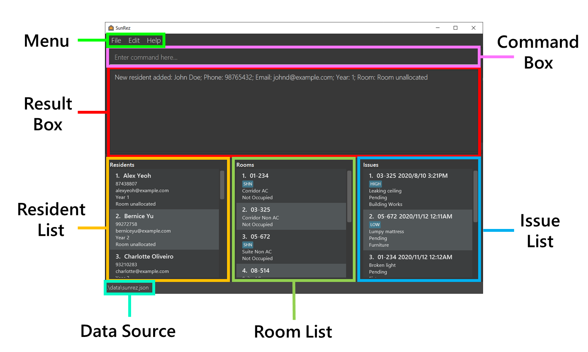
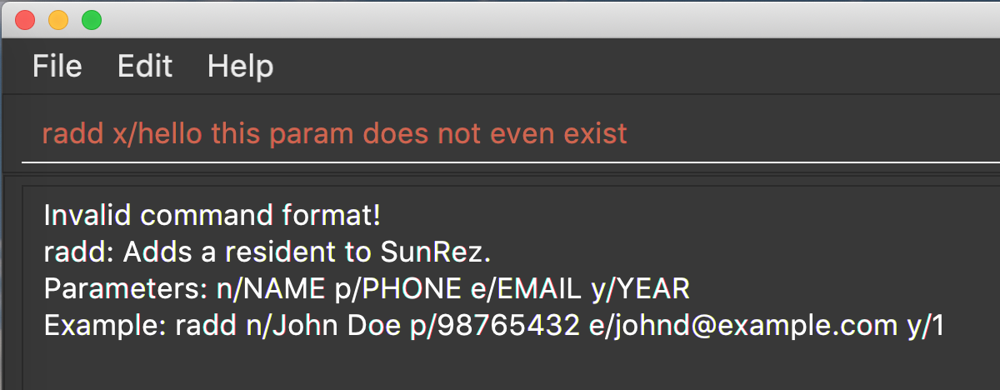
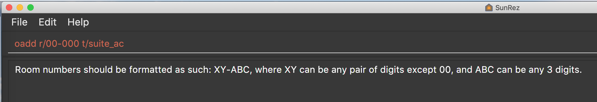
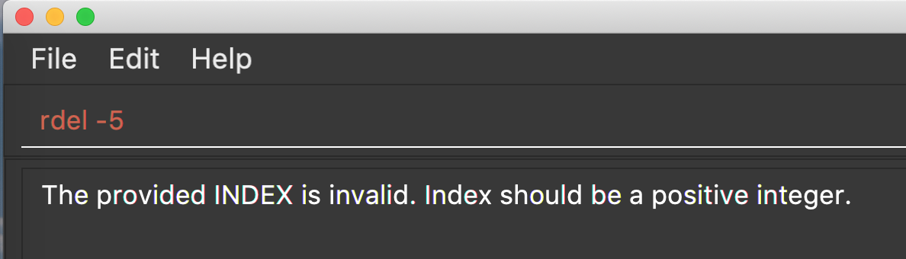
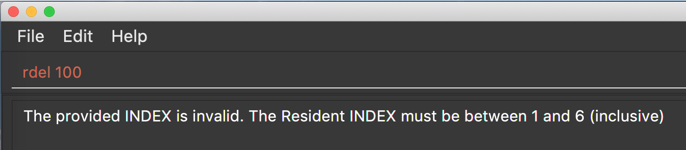

* Table of Contents
{:toc}

--------------------------------------------------------------------------------------------------------------------

## Introduction
**SunRez** is a desktop app designed for college residential staff to efficiently manage student housing services. It
features a Graphical User Interface (GUI) but is optimized for use via a Command Line Interface (CLI).

**SunRez** has the following features:
* Keeps track of maintenance issues
* Keeps track of student records
* Keeps track of room records

--------------------------------------------------------------------------------------------------------------------

## Quick start

1. Ensure you have Java `11` or above installed in your Computer.

2. Download the latest `sunrez.jar` from [here](https://github.com/AY2021S2-CS2103-T14-1/tp/releases).

3. Copy the file to the folder you want to use as the _home folder_ for your SunRez.

4. Double-click the file to start the app. A GUI like the one pictured below should appear in a few seconds.
   Note how the app contains some sample data. 
   

5. Type a command in the command box and press `ENTER` to execute it.
   e.g. typing `help` and pressing `ENTER` will open the help window. 

   Some example commands you can try:

    * `rlist`: Lists all residents.

    * `radd n/Joseph Tan p/84666774 e/e0103994@u.nus.edu y/2`:
      Adds a resident named `Joseph Tan` with phone number `84666774`, email `e0103994@u.nus.edu`, a 2nd year student.

    * `rdel 3`: Deletes the 3rd resident shown in the current resident list.

    * `exit`: Exits the app.

6. Refer to the [Features](#features) below for details of each command.

--------------------------------------------------------------------------------------------------------------------

## SunRez User Interface (UI)
The following image shows the different parts of the SunRez application window:

### Using the UI

SunRez is optimized for fast typists, so most input to SunRez takes the form of commands. To execute a command,
simply type it into the **Command Box** then press `ENTER` on the keyboard. The result (or an error message) will be
displayed in the **Result Box** following a command execution. Details about specific commands can be found in the
[features](#features) section.

An error message may be shown for various reasons. Most commonly, one is shown if a command cannot be parsed (that is,
if SunRez cannot understand the format of your command) or if a command has been given parameters which are out of
the acceptable range. In the following sections, more information is given about acceptable
[command formats](#command-format), [command parameters](#command-parameters), and the
[command parsing process](#command-parsing).

### Command Format

Commands in this user guide follow this format:

* Words in `UPPER_CASE` are the parameters to be supplied by the user. 
  e.g. in `radd n/NAME p/PHONE_NUMBER e/EMAIL y/YEAR`, the paramters are `NAME`, `PHONE_NUMBER`, `EMAIL`, and `YEAR`. The command can be used as `radd n/Joseph Tan p/84666774 e/e0103994@u.nus.edu y/2`.

* Items in square brackets are optional. 
  e.g. `d/DESCRIPTION [t/TIMESTAMP]` can be used as `d/Broken chair t/2020/3/23 11:59pm` or as `d/Broken chair`.

* Items with `...` after them can be used multiple times including zero times. 
  e.g. `[t/TAG]...​` can be used as <code> </code>&nbsp;(i.e. 0 times), `t/SHN`, `t/SHN` `t/Renovating` etc.

* Parameters can be in any order. 
  e.g. if the command specifies `n/NAME p/PHONE_NUMBER`, `p/PHONE_NUMBER n/NAME` is also acceptable.

* If a parameter is expected only once in the command, but you specified it multiple times, only the last occurrence
  of the parameter will be taken. 
  e.g. if you specify `n/John Doe n/Jane Doe`, only `n/Jane Doe` will be taken.

* Extraneous parameters for commands that do not take in parameters (such as `help`, `ilist`, `exit` and `clear`) will be ignored. 
  e.g. if the command specifies `help 123`, it will be interpreted as `help`.

### Command Parsing

#### Repeated parameters
All commands in SunRez default to taking the latest occurrence of a duplicate parameter **except [tags](#tag)**.
For example, if you key in this command:

`radd n/John Doe n/Timmy Tan p/91234567 e/e0123456@u.nus.edu y/3`

The resident's name will take the **later** occurrence of name and create a resident named "Timmy Tan".

On the other hand, **all** [tags](#tag) specified will be taken.

For instance, `radd n/John Doe n/Timmy Tan p/91234567 e/e0123456@u.nus.edu y/3 g/tag_one g/tag_two g/tag_three` will
create a resident with tags `tag_one`, `tag_two` and `tag_three`.

#### Interpreting parameter values
Commands in SunRez have a pre-set parameter list they accept. The value for the parameter will be all characters
until the next occurrence of a parameter prefix for the command.
For example, if you key in this command:

`radd n/John Doe p/91234567 e/e0123456@u.nus.edu y/3`

The resident's name will be all characters that follows `n/` until just before the start of `p/`, including the space.
Most commands, however, trim leading and trailing spaces.

Let us break this down further and assume `radd` only takes in 2 parameters for the purposes of explanation.
We can break the command down as follows:

`radd n/[NAME_STRING] p/[PHONE_NUM_STRING]`

A user can enter a `NAME_STRING` that consists of anything, including text that contains prefix-like strings such as `s/`.
For example, a user could enter `John s/o Tom`.
However, as `s/` is not a valid prefix for the `radd` command, the command parser will treat `John s/o Tom` as the
value for the name parameter.

The validation for the `Name` parameter will process `John s/o Tom` and may reject it based on the stated validation rules.
However, a known limitation of this approach is that parameter values containing valid parameter prefixes will cause issues.

Let us take a look at another example:

If `NAME_STRING` = `John p/ Tom`, the command keyed in could look like `radd p/[VALID_PHONE_NUM] n/John p/ Tom`
(Remember that prefix order does not matter.)

This will create the presence of 2 phone number parameters. In such a case, the latter value will be taken.
As `Tom` is not a valid phone number, it will be rejected.

#### Interpreting errors

In most cases, the error displayed should be relatively self-explanatory. This sub-section aims to clear up any ambiguity
you might encounter when dealing with invalid commands or errors.

We will break our explanation down into the following categories:
- Incorrect formats
- Parameters do not conform to required values
- Commands that require an [`INDEX`](#index) (e.g. `redit 1 n/John`)

##### Incorrect formats
This error typically shows a message along the following lines: `Invalid command format! [Information on how to use
the command]`

Typically this happens because the command does not match the required format. Check if you are missing any parameters.
A special case of this takes place when the `INDEX` value is not a number.

##### Parameters do not conform to required values
This error typically shows a message along the following lines: `[Parameter name] must be [some condition]`. E.g.
`Room numbers should be formatted as such: XY-ABC, where XY can be any pair of digits except 00, and ABC can
be any 3 digits.`

Typically this happens because the parameter provided does not match the required format. Check if your parameter conforms
to the format stated under the [command parameters](#command-parameters) section. The error message usually gives some
helpful information in resolving the error too.

##### Commands that require an `INDEX`
The bounds of the `INDEX` parameter is documented [below](#index). This section will explain how errors with the `INDEX`
will be dealt with.

- If you do not specify the `INDEX` (e.g. `rdel`): The app will inform you that the format is invalid, and display the
  format that should be used. This is a specific case of [incorrect formats](#incorrect-formats).

- If the `INDEX` is not an integer (e.g. `rdel abc`): The app will inform you that the format is invalid, and display the
  format that should be used. This is also a specific case of [incorrect formats](#incorrect-formats), as the command
  expects a number but did not get one.

- If the `INDEX` parameter is required alongside other parameters e.g. [`redit`](#edit-a-resident-record--redit), and
  **only** an `INDEX` (be it valid or not) value is provided (e.g. `redit 1000` or `redit 1`): The app will inform you
  that the format is invalid, and display the format that should be used. This is another specific case
  of [incorrect formats](#incorrect-formats), as the command compulsorily needs at least one of the optional parameters
  to be provided.

- If the `INDEX` is 0 or lesser (e.g. `rdel -5`): The app will inform you that `INDEX` should be a positive integer.

- If the `INDEX` is above the range of the collection specified (e.g. `rdel 100` but there are only 6 residents): The
  app will inform you that `INDEX` needs to be between 1 and the size of the collection in question.

### Command Parameters

Many SunRez commands use various parameters. Their formats, constraints and rationale, if any, are provided in this subsection.

| Parameter | Prefix | Applicable to | Description |
|---|---|---|---|
|  `ALIAS_NAME` | `a/` | `alias` `unalias` | The name of an alias.{::nomarkdown}<ul><li> Must be alphanumeric. </li><li> Must not contain space. </li><li> Must not be empty. </li><li> Must not be a reserved keyword i.e. names of other system commands. </li></ul>{:/} |
|  `CATEGORY` | `c/` | `iadd` `iedit`| The category of an issue.{::nomarkdown}<ul><li> Must be alphanumeric. </li><li> Must not be empty. </li></ul>{:/} |
|  `COMMAND` | `cmd/`| `alias` | The command that an alias is short for.{::nomarkdown}  <ul><li> Must not be empty. </li><li> Must not be recursive i.e. contains another alias name. </li></ul>{:/} |
|  `COUNT` | - | `history` | The number of command history entries wanted.{::nomarkdown} <ul><li> Must be a positive integer: 1, 2, 3, ... </li><li> Must be at most the total number of entries in command history. </li><li>Exception: if command history is empty then <code>COUNT</code> can be greater than the number of entries in command history (that is, it can be a positive integer). SunRez will simply indicate that command history is empty.</li></ul>{:/} |
|  `DESCRIPTION` | `d/` | `iadd` `iedit` | The description of an issue.{::nomarkdown} <ul><li> Accepts only alphanumeric characters and spaces. </li><li> Must not be empty. </li><li> Will wrap if too long. </li><li> These constraints are chosen for simplicity's sake and ease of displaying. </li></ul>{:/} |
|  `EMAIL` | `e/` | `radd` `redit` | The email of a resident.{::nomarkdown} <ul><li> Format: local-part@domain. </li><li> Local-part should only contain alphanumeric characters, and these special characters, excluding the parenthesis (!#$%&'*+/=?&#96;{&#124;}~^.-). </li><li> Must contain @. </li><li> Domain must be at least 2 characters long, start and end with alphanumeric characters, and consist of alphanumeric characters, a period or a hyphen for the characters in between, if any. </li><li> e.g. e0123456@u.nus.edu </li><li> These constraints are specific to intended use cases and not meant to emulate industry standards for emails. </li></ul>{:/} |
|  `INDEX` | - | `redit` `rdel` `oedit` `odel` `iedit` `iclo` `idel` `alloc` `dealloc`| The index number shown in the displayed list.{::nomarkdown} <ul><li> Must be a positive integer: 1, 2, 3, ... </li></ul>{:/} |
|  `KEYWORD` | - | `rfind` `ofind` `ifind` | A keyword used in the various find commands.{::nomarkdown} <ul><li> Format: Single word consisting of any character except spaces. </li><li> For best usage: Use English characters only. </li></ul>{:/} |
|  `NAME` | `n/` | `radd` `redit` | The identifier of a resident.{::nomarkdown} <ul><li> Accepts only alphabetic characters and spaces. </li><li> Must not be blank. </li><li> Must be unique. </li><li> While it is acknowledged that some names may have special characters, the chosen constraints are sufficient for intended use cases. </li></ul>{:/} |
|  `PHONE_NUMBER` | `p/` | `radd` `redit` | The phone number of a resident.{::nomarkdown} <ul><li> Must contain only digits. </li><li> Must be at least 3 digits long. </li></ul>{:/} |
|  `ROOM_NUMBER` | `r/` | `oadd` `oedit` `iadd` `iedit` | Room number for a room.{::nomarkdown} <ul><li> Format: <code>XY-ABC</code>, where XY can be any pair of digits except 00, and ABC can be any 3 digits. <ul><li> Valid examples: 01-000, 11-100, 12-345. </li><li> Invalid examples: 00-000, 00-100. </li></ul> </li><li> Room numbers are unique within SunRez. </li><li> We disallow floor numbers being 00. However, unit numbers can be 000. </li></ul>{:/} |
|  `ROOM_TYPE` | `t/` | `oadd` `oedit` | Room type of a room.{::nomarkdown} <ul><li> Must be one of the following strings: <code>corridor_ac</code>, <code>corridor_non_ac</code>, <code>suite_ac</code>, <code>suite_non_ac</code>. </li><li> Strings are not case-sensitive. </li></ul>{:/} |
|  `STATUS` | `s/` | `iadd` `iedit` | The status of an issue.{::nomarkdown} <ul><li> Must of one of the following strings: <code>PENDING</code>, <code>CLOSED</code>. </li><li> Short forms are available: <code>P</code> for <code>PENDING</code>, <code>C</code> for <code>CLOSED</code>. </li><li> Strings are not case-sensitive. </li></ul>{:/} |
|  `TAG` | `g/` | `oadd` `oedit` `iadd` `iedit` | The tag associated with a room or issue.{::nomarkdown} <ul><li> Tags must be non-blank and alphanumeric (spaces are not allowed). </li><li> Tags are limited to 25 characters. </li><li> Tags are case-sensitive: e.g. <code>SHN</code>,<code>shn</code> and <code>Shn</code> are each considered separate tags. </li><li> Insertion order of tags does not guarantee display order in any part of the user interface. </li><li> Duplicate tags will be accepted as input, but only one instance will be recorded. </li><li> For the best experience, we recommend keeping tags short and having fewer than 20 of them per entry. There is no theoretical limit to the number of tags an entry can have, but SunRez may slow down or run into unexpected problems for a huge number of tags. </li><li> These constraints are chosen for simplicity's sake and ease of displaying. </li></ul>{:/} |
|  `TIMESTAMP` | `t/` | `iadd` `iedit` | The timestamp for which the issue occurred.{::nomarkdown} <ul><li> Must not be in the future. </li><li> Must be in the format: <code>yyyy/MM/dd hh:mma</code>. </li><li> <code>yyyy</code> - 4 digit year (e.g. <code>2021</code>). </li><li> <code>MM</code> - 2 digit month (e.g. <code>01</code>, <code>05</code>, <code>12</code>). </li><li> <code>dd</code> - 2 digit day (e.g. <code>01</code>, <code>05</code>, <code>31</code>). </li><li> <code>hh</code> - 2 digit hour (<code>01</code>-<code>12</code>) (midnight is <code>12:00am</code>). </li><li> <code>mm</code> - 2 digit minutes (<code>00</code>-<code>59</code>). </li><li> <code>a</code> - case-insensitive AM/PM. </li><li> Example: <code>2021/01/01 12:00am</code>. </li></ul>{:/} |
|  `YEAR` | `y/` | `radd` `redit` | The year of study of a resident.{::nomarkdown} <ul><li> Must be a single digit numeric character from 1 to 5 inclusive. </li></ul>{:/} |

--------------------------------------------------------------------------------------------------------------------

## Features

This section contains the details on SunRez commands and features.

### Resident Management

#### Add a resident : `radd`

Adds a resident to the housing management system.

Format: `radd n/NAME p/PHONE_NUMBER e/EMAIL y/YEAR`

Parameters:
* [`NAME`](#name) The name of the resident.
* [`PHONE_NUMBER`](#phone_number) The phone number of the resident.
* [`EMAIL`](#email) The email of the resident.
* [`YEAR`](#year) The year of the resident.

Examples:
* `radd n/John Doe p/91234567 e/e0123456@u.nus.edu y/3`
  Adds a resident named `John Doe` with phone number `91234567`, email `e0123456@u.nus.edu`, and as a 3rd year student,
  without any room allocated.

#### List all residents : `rlist`

Shows a list of all residents in the system sorted by alphabetical order.

Format: `rlist`

#### Find residents : `rfind`

Finds residents whose names contain any of the given keywords.

Format: `rfind KEYWORD [MORE_KEYWORDS]`
* The search is case-insensitive. e.g. `hans` will match `Hans`.
* The order of the keywords does not matter. e.g. `Hans Bo` will match `Bo Hans`.
* Only the name is searched.
* Only full words will be matched e.g. `Han` will not match `Hans`.
* Residents matching at least one keyword will be returned (i.e. OR search). e.g. `Hans Bo` will return `Hans Gruber`, `Bo Yang`.
* If no resident matching the search criteria is found, the resulting resident list will be blank.

Examples:
* `rfind john` returns `john` and `John Doe`.
* `rfind alex david` returns `Alex Yeoh`, and `David Li`.

#### Edit a resident record : `redit`

Edits the existing resident record at a specified index.

Format: `redit INDEX [n/NAME] [p/PHONE_NUMBER] [e/EMAIL] [y/YEAR]`
* At least one of the optional fields must be provided.
* Existing values will be updated to the input values.
* `redit` will be blocked if the resident has an active room allocation. Run `dealloc` before making further edits.
  See [Deallocate a resident](#deallocate-resident-from-room--dealloc).

Parameters:
* [`INDEX`](#index) The index of the displayed resident.
* [`NAME`](#name) The name of the resident.
* [`PHONE_NUMBER`](#phone_number) The phone number of the resident.
* [`EMAIL`](#email) The email of the resident.
* [`YEAR`](#year) The year of the resident.

Example:
* `redit 1 p/91234567 e/e0123456@u.nus.edu` Edits the phone number and email address of the 1st resident to
  be `91234567` and `e0123456@u.nus.edu` respectively.

#### Delete a resident : `rdel`

Deletes the resident record at a specified index.

Format: `rdel INDEX`
*  A resident allocated to a room cannot be deleted until it is first deallocated. Run `dealloc` commmand before
   deletion. See [Deallocate a resident](#deallocate-resident-from-room--dealloc).

Parameters:
* [`INDEX`](#index) The index of the displayed resident.

Example:
* `rdel 1` deletes the 1st resident in the resident list.

### Room Management

:thinking: Why do room commands start with `o`? 
:point_right: Room commands are prefixed with `o` as `r` is taken up by Resident commands.
`o` is the second character in R**o**om.

:information_source: Rooms are always sorted in ascending order by room number in all views.

#### Add a room : `oadd`

Adds a room to the housing management system.

Format: `oadd r/ROOM_NUMBER t/ROOM_TYPE [g/TAG]...`
* Room is initialised with default occupancy status of "No".
* The occupancy status cannot be defaulted to "Yes" during room addition.
* Room occupancy status can only be changed through the `alloc` or `dealloc` command when a resident is allocated or
  deallocated. See [allocate a resident](#allocate-resident-to-room--alloc) or
  [deallocate a resident](#deallocate-resident-from-room--dealloc) for more info.

Parameters:
* [`ROOM_NUMBER`](#room_number) The room number of the room to add.
* [`ROOM_TYPE`](#room_type) The type of the room being added.
* [`TAG`](#tag) Optional tags that may be specified to assist in management of the room.

Example:
* `oadd r/10-112 t/corridor_ac g/SHN` Adds a room numbered `10-112` of type `corridor_ac` with the tag `SHN`.

#### List all rooms : `olist`

Shows a list of all rooms in the system sorted by room number.

Format: `olist`

#### Find rooms : `ofind`

:information_source: `ofind` currently only searches through rooms via room number or tags. Searching by room type will be implemented in the future.

Finds all rooms by room number or tag that contain any of the given keywords.

Format: `ofind KEYWORD [MORE_KEYWORDS]`
* The search matches any part of the room number. e.g. `10` will match `10-111` and `14-101`.
* The search for tags matches any part of the tag and is NOT case-sensitive. e.g. `mell`, `smell`, `smelly` or `room`
  all work to match `smellyroom`. `s` will match both `smellyroom` and `SHN`.
* The order of the keywords does not matter. e.g. `11- 10-` will match `10-100`, `10-101`, `11-100`, and `11-101`.
* Only the room number and tags are searched.
* Rooms matching at least one keyword will be returned (i.e. OR search). e.g. `10 20` will return `10-100`, `11-120`.
* If no room matching the search criteria is found, the resulting room list will be blank.

Parameters:
* [`KEYWORD`](#keyword) The keyword to search for in the room list.

Examples:
* `ofind 10-` returns `10-100`, `10-101`, and `10-102`.
* `ofind 10- 15-` returns `10-100`, `10-101`, `15-100`, and`15-101`.
* `ofind 10` returns `09-100`, `09-110`, `10-100`, and `10-101`.
* `ofind s` returns `SHN` and `smellyroom`.
* `ofind 1 s` returns `10-100` and `SHN`.

#### Edit a room record : `oedit`

Edits the existing room record at a specified index.

Format: `oedit INDEX [r/ROOM_NUMBER] [t/ROOM_TYPE] [g/TAG]...`
* `INDEX` refers to the index number shown in the displayed room list.
* At least one of the optional fields must be provided.
* Existing values will be updated to the input values.
* `oedit` will block editing of a room number **if the room is occupied**. Run `dealloc` to deallocate the room before
  making further edits.
  * This is done to prevent residents from being assigned to non-existent rooms by editing away a room's number after
    allocating a resident to it.
* The occupancy status is not controllable through the `oedit` command.
* Room occupancy status can only be changed through the `alloc` or `dealloc` command when a resident is allocated or
  deallocated. See [allocate a resident](#allocate-resident-to-room--alloc) or
  [deallocate a resident](#deallocate-resident-from-room--dealloc) for more info.
* `oedit` will block editing of a room number **if there are issues tagged to the room**. Run `idel` to
  [delete the issues](#delete-an-issue--idel) associated with the room before making further edits.
    * This is done to prevent issues from being assigned to non-existent rooms by editing away a room's number after
      assigning an issue to it.

:information_source: Room numbers are editable *in general* as renovation or re-numbering exercises may take place.

Parameters:
* [`INDEX`](#index) The index of the room to edit.
* [`ROOM_NUMBER`](#room_number) The room number to change the room identified by [`INDEX`](#index) to.
* [`ROOM_TYPE`](#room_type) The room type to change the room identified by [`INDEX`](#index) to.
* [`TAG`](#tag) Optional tags that may be updated for the room identified by [`INDEX`](#index).

Example:
* `oedit 1 g/SHN g/Blue` Edits the 1st room's tags to `SHN` and `Blue`.

#### Delete a room : `odel`

Deletes the room at a specified index.

Format: `odel INDEX`
* `INDEX` refers to the index number shown in the displayed room list.
* `odel` will be blocked if the room is occupied. Run `dealloc` to deallocate the room before attempting to delete the room.
  See [deallocate a resident](#deallocate-resident-from-room--dealloc) for more info.
* `odel` will be blocked if there are issues associated with the room.
  Run `idel` to delete all issues associated with the room before attempting to delete the room.
  See [delete an issue](#delete-an-issue--idel) for more info.

Parameters:
* [`INDEX`](#index) The index of the room to delete.

Example:
* `odel 1` Deletes the 1st room in the room list.

### Room Allocation/Deallocation

#### List all unallocated residents : `rulist`

Shows a list of all unallocated residents in the system sorted by alphabetical order.

Format: `rulist`

#### Allocate resident to room : `alloc`
Allocates an existing resident to an existing room.

Format: `alloc ri/RESIDENT_INDEX oi/ROOM_INDEX`
* Both fields must be provided.
* The resident and room at `RESIDENT_INDEX` and `ROOM_INDEX` respectively must both be unallocated.

Parameters:
* [`RESIDENT_INDEX`](#index) The index of the displayed resident.
* [`ROOM_INDEX`](#index) The index of the displayed room.

Note that `RESIDENT_INDEX` and `ROOM_INDEX` both conform to [`INDEX`](#index).

Example:
* `alloc ri/1 oi/2` Allocates the 1st resident in the resident list to the 2nd room in the room list.

#### Deallocate resident from room : `dealloc`
Deallocates an existing resident from an existing room.

Format: `dealloc RESIDENT_INDEX`
* The resident at `RESIDENT_INDEX` must already be allocated.

Parameters:
* [`RESIDENT_INDEX`](#index) The index of the displayed resident.

Note that `RESIDENT_INDEX` conforms to [`INDEX`](#index).

Example:
* `dealloc 1` Deallocates the 1st resident in the resident list from its allocated room.

### Issue Management

**:information_source: Issues are always sorted by status (`Pending` then `Closed`) then by timestamp in ascending order in all views.**

**:information_source: Issues are considered duplicate if their room numbers, description, timestamp, status, and category are the same.**

#### Add an open issue : `iadd`

Adds an issue to the housing management system.

Format: `iadd r/ROOM_NUMBER d/DESCRIPTION [t/TIMESTAMP] [s/STATUS] [c/CATEGORY] [g/TAG]...`

Parameters:
* [`ROOM_NUMBER`](#room_number) The room number of the issue to be added. Room number must exist in SunRez.
* [`DESCRIPTION`](#description) The description of the issue to be added.
* [`TIMESTAMP`](#timestamp) Optional timestamp of the issue to be added, defaults to the current time.
* [`STATUS`](#status) Optional status of the issue to be added, defaults to `Pending`.
* [`CATEGORY`](#category) Optional category that the issue belongs in, defaults to `No Category`.
* [`TAG`](#tag) Optional tags of the issue to be added.

Example:
* `iadd r/10-100 d/Broken light c/Furniture`
  Creates an issue for room number `10-100` with description `Broken light` under the category `Furniture`.

#### List all issues : `ilist`

Shows a list of all issues in the system sorted by their timestamp.

Format: `ilist`

#### Find issues : `ifind`

Finds all issues that contain any of the given keywords in the room number, description or tags.

:information_source: `ifind` currently only searches through issues via room number, description or tags. Searching by status will be implemented in the future.

Format: `ifind KEYWORD [MORE_KEYWORDS]`
* The search is case-insensitive. e.g. `broken` will match `Broken`.
* The order of the keywords does not matter. e.g. `Broken light` will match `light broken`.
* The search for tags and description matches any part of the tag and is NOT case-sensitive.
  e.g. `high`, `HIGH` or `h` all work to match `High`. `H` will match both `Hot` and `High`.
* The search matches any part of the room number. e.g. `10` will match `10-111` and `14-101`.
* Only the description, room number, and tags are searched.
* Issues matching at least one keyword will be returned (i.e. OR search).
  e.g. `Broken window` will return `Broken light`, `Dirty window`, and `Broken window`.
* If no issue matching the search criteria is found, the resulting issue list will be blank.

Parameters:
* [`KEYWORD`](#keyword) The keyword to search for in the issue list.

Examples:
* `ifind chair` returns `Broken chair` and `Chair missing wheel`.
* `ifind wardrobe table` returns `Wardrobe door broke`, `Table unstable`, and `Table stuck in wardrobe`.
* `ifind 1 s` returns room number `10-100`, description `Table unstable` and tag `Insect` as they all either contain `1` or the string `s`.

#### Edit an issue record : `iedit`

Edits the existing issue record at a specified index.

Format: `iedit INDEX [r/ROOM_NUMBER] [d/DESCRIPTION] [t/TIMESTAMP] [s/STATUS] [c/CATEGORY] [g/TAG]...`
* `INDEX` refers to the index number shown in the displayed issue list.
* At least one of the optional fields must be provided.
* Existing values will be updated to the input values.

Parameters:
* [`INDEX`](#index) The index of the issue to edit.
* [`ROOM_NUMBER`](#room_number) The room number to change the issue identified by [`INDEX`](#index) to. Room number must exist in SunRez.
* [`DESCRIPTION`](#description) The description to change the issue identified by [`INDEX`](#index) to.
* [`TIMESTAMP`](#timestamp) The timestamp to change the issue identified by [`INDEX`](#index) to.
* [`STATUS`](#status) The status to change the issue identified by [`INDEX`](#index) to.
* [`CATEGORY`](#category) The category to change the issue identified by [`INDEX`](#index) to.
* [`TAG`](#tag) Optional tags that may be updated for the issue identified by [`INDEX`](#index).

Example:
* `iedit 1 r/20-109 s/Closed` Edits the room number and status of the 1st issue to be `20-109` and `Closed` respectively.

#### Close an issue : `iclo`

Marks as closed the issue at a specified index.

Format: `iclo INDEX`
* `INDEX` refers to the index number shown in the displayed issue list.

Parameters:
* [`INDEX`](#index) The index of the displayed issue.

Example:
* `iclo 1` Closes the 1st issue.

#### Delete an issue : `idel`

Deletes the issue at a specified index.

Format: `idel INDEX`
* `INDEX` refers to the index number shown in the displayed resident list.

Parameters:
* [`INDEX`](#index) The index of the displayed issue.

Example:
* `idel 1` Deletes the 1st issue.

### General

#### Show help : `help`

Shows a message explaining how to access the help page.

Format: `help`

#### Delete all data : `clear`

Deletes all rooms, residents and issues in SunRez.

Format: `clear`

#### Undo previous command : `undo`

Restores SunRez to its state before an _undoable_ command was executed.

**:information_source: _Undoable_ command:** 
An undoable command is one which modifies the data of SunRez.

e.g. `radd`, `redit`, `idel`, `clear`, etc.

Format: `undo`

Examples:
* `rdel 1`  
  `undo` Undoes the `rdel 1` command.

* `iedit 1 r/20-109 s/Closed`  
  `clear`  
  `undo` Undoes the `clear` command.  
  `undo` Undoes the `iedit 1 r/20-109 s/Closed` command.

* `history 5`  
  `undo` Fails because `history 5` did not modify SunRez's data.

**:information_source: Shortcuts to undo:** 
1. **GUI:** Select `Edit` -> `Undo` in the menu at the top of SunRez.
2. **Keyboard:** Press `CTRL`+`Z` (Windows, Linux) or `CMD`+`Z` (Mac).

These behave as if you entered `undo` in the command box and hit `ENTER`; an `undo` command will be registered in
command history.

#### Redo previously undone command: `redo`

Reverses the previous undo operation.

Format: `redo`

Examples:
* `rdel 1`  
  `undo` Undoes the `rdel 1` command.  
  `redo` Redoes the `rdel 1` command.

* `rdel 1`  
  `redo` Fails because there are no previous `undo` commands.

* `iedit 1 r/20-109 s/Closed`  
  `clear`  
  `undo` Undoes the `clear` command.  
  `undo` Undoes the `iedit 1 r/20-109 s/Closed` command.  
  `redo` Redoes the `iedit 1 r/20-109 s/Closed` command.  
  `redo` Redoes the `clear` command.

**:information_source: Shortcuts to redo:** 
1. **GUI:** Select `Edit` -> `Redo` in the menu at the top of SunRez.
2. **Keyboard:** Press `CTRL`+`SHIFT`+`Z` (Windows, Linux) or `CMD`+`SHIFT`+`Z` (Mac).

These behave as if you entered `redo` in the command box and hit `ENTER`; a `redo` command will be registered in
command history.

#### Add an alias : `alias`

Adds a user-defined alias, which represents a shortcut to a longer command.

Format: `alias a/ALIAS_NAME cmd/COMMAND`
* Parameters must be in this exact order.
* Any parameters after `cmd/` will be parsed as part of the command.

Parameters:
* [`ALIAS_NAME`](#alias_name) The name of the alias to be added.
* [`COMMAND`](#command) The command that the alias is short for.

Examples:
* `alias a/ol cmd/olist` Adds the `ol` alias which is a shortcut for `olist` command.
* `alias a/fNemo cmd/rfind Nemo` Adds the `fNemo` alias which is a shortcut for `rfind Nemo` command.

#### Delete an alias : `unalias`

Deletes a previously defined alias.

Format: `unalias a/ALIAS_NAME`

Parameters:
* [`ALIAS_NAME`](#alias_name) The name of the alias to be deleted.

Example:
* `unalias a/findBob` Deletes the `findBob` alias, provided that the alias was previously added.

#### List all aliases : `aliases`

Shows a list of current aliases in the system sorted by names in alphabetical order.

Format: `aliases`

#### View command history : `history`

Displays the user's valid command history, sorted from most to least recent.

Format: `history [COUNT]`
* Displays the `COUNT` most recent command entries, if `COUNT` is specified. Otherwise, displays all command entries.

Parameters:
* [`COUNT`](#count) The number of most recent command entries to display.

Examples:
* `history` Displays all command entries.
* `history 5` Displays the 5 most recent command entries.

#### Access command history

Previous successful commands can be accessed via the `UP` and `DOWN` arrow keys on the keyboard.
`UP` selects the previous command. `DOWN` selects the next command.

Example usage:
1. Enter some commands as per normal.
1. Make sure the command box is in focus (e.g. click on it).
1. Press the `UP` arrow key on your keyboard.
1. SunRez should display the most recent successful command in the command box.
    * Hit `ENTER` to run that command again.
    * Alternatively, select other commands via the `UP` and `DOWN` arrow keys.

#### Exit the program : `exit`

Exits the program.

Format: `exit`

### SunRez Data Files

SunRez main application data and command history are saved in the hard disk automatically after any command
that changes the data. There is no need to save manually.

#### Undo/redo history

Undo/redo history is not saved to the hard disk, so it will be lost when SunRez is exited.

#### Edit the data files

* SunRez main application data is saved as a JSON file `[JAR_file_location]/data/sunrez.json`.
* SunRez command history is saved as a plain-text file `[JAR_file_location]/data/commandhistory.txt`.
    * Each command history entry is a single line in the file.
    * The entire command history can be cleared by simply deleting the contents of the command history file.

Advanced users are welcome to edit these files directly.

**:exclamation:Caution**:  
If your changes to the data file makes its format invalid, SunRez will discard all data and start with an empty data file at the next run.  
If your changes are in a valid format but contain normally illegal data (e.g. duplicate residents, self-referencing aliases, etc.) then SunRez may stop functioning properly. We currently make no guarantees on the usability of SunRez if you edit its data files directly, although in future we may add protective measures.

--------------------------------------------------------------------------------------------------------------------

## FAQ

### How do I transfer my data to another computer?
* On the computer with your data, do the following:
    1. Navigate to where SunRez is installed: the location of `sunrez.jar`.
    2. Copy the following files to your other computer: `data/commandhistory.txt`,
       `data/sunrez.json`
* Then, on your other computer, do the following:
    1. Download SunRez (`sunrez.jar`) and place it in a suitable folder.
    1. Paste the files from earlier in this folder. If prompted to replace existing files, do so.

--------------------------------------------------------------------------------------------------------------------

## Command summary

Action | Format, Examples
--------|------------------
**Show help** | `help`
**Add a resident** | `radd n/NAME p/PHONE_NUMBER e/EMAIL y/YEAR`   e.g. `radd n/Joseph Tan p/84666774 e/e0103994@u.nus.edu y/2`
**List all residents** | `rlist`
**List all unallocated residents** | `rulist`
**Find residents** | `rfind KEYWORD [MORE_KEYWORDS]`   e.g. `rfind bob bobby`
**Edit a resident record** | `redit INDEX [n/NAME] [p/PHONE_NUMBER] [e/EMAIL] [y/YEAR]`   e.g. `redit 1 p/91234567 e/e0123456@u.nus.edu`
**Delete a resident** |  `rdel INDEX`   e.g. `rdel 1`
**Add a room** |  `oadd r/ROOM_NUMBER t/ROOM_TYPE [g/TAG]...`   e.g. `oadd r/17-101 t/corridor_ac g/SHN`
**List all rooms** |  `olist`
**Find rooms** |  `ofind KEYWORD [MORE_KEYWORDS]`   e.g. `ofind 10- 15-`
**Edit a room record** |  `oedit INDEX [r/ROOM_NUMBER] [t/ROOM_TYPE] [g/TAG]...`   e.g. `oedit 1 g/SHN`
**Delete a room** | `odel INDEX`   e.g. `odel 1`
**Allocate a Resident to Room** | `alloc ri/RESIDENT_INDEX oi/ROOM_INDEX`   e.g. `alloc ri/1 oi/2`
**Deallocate a Resident from Room** | `dealloc INDEX`   e.g. `dealloc 1`
**Add an open issue** | `iadd r/ROOM_NUMBER d/DESCRIPTION [t/TIMESTAMP] [s/STATUS] [c/CATEGORY] [g/TAG]...`   e.g. `iadd r/10-100 d/Broken light c/Furniture g/HIGH`
**List all issues** | `ilist`
**Find issues** | `ifind KEYWORD [MORE_KEYWORDS]`   e.g. `ifind wardrobe table`
**Edit an issue record** | `iedit INDEX [r/ROOM_NUMBER] [d/DESCRIPTION] [t/TIMESTAMP] [s/STATUS] [c/CATEGORY] [g/TAG]...`   e.g. `iedit 1 r/20-109 s/Closed`
**Close an issue** | `iclo INDEX`   e.g. `iclo 1`
**Delete an issue** | `idel INDEX`   e.g. `idel 1`
**View command history** | `history [COUNT]`   e.g. `history 5`
**Undo previous command** | `undo`   `CTRL`+`Z`/`CMD`+`Z` (keyboard shortcuts)
**Redo previously undone command** | `redo`   `CTRL`+`SHIFT`+`Z`/`CMD`+`SHIFT`+`Z` (keyboard shortcuts)
**Add an alias** | `alias a/ALIAS_NAME cmd/COMMAND`   e.g. `alias a/il cmd/ilist`
**Delete an alias** | `unalias a/ALIAS_NAME`   e.g. `unalias a/findBob`
**List all aliases** | `aliases`
**Delete all data** | `clear`
**Exit the app** | `exit`
