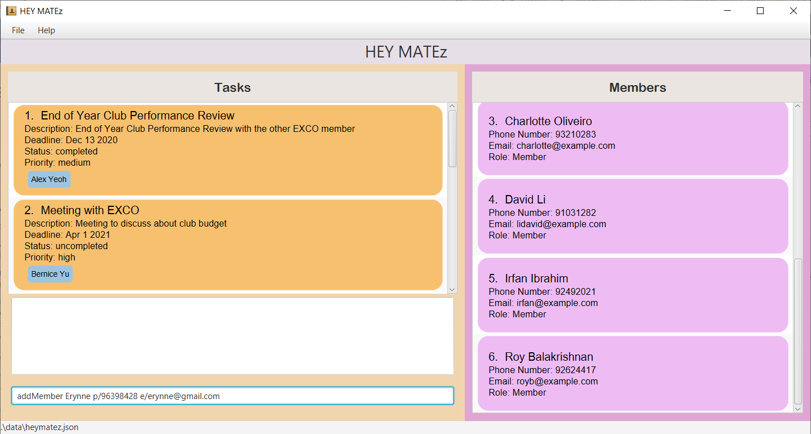
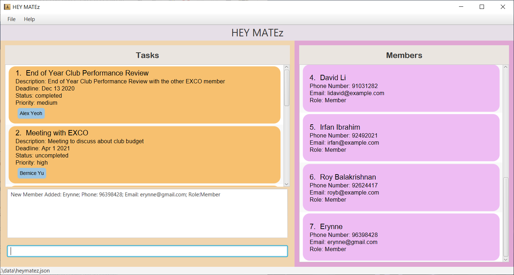
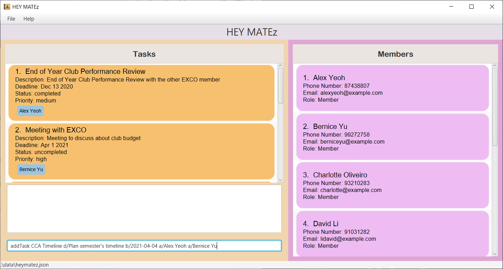
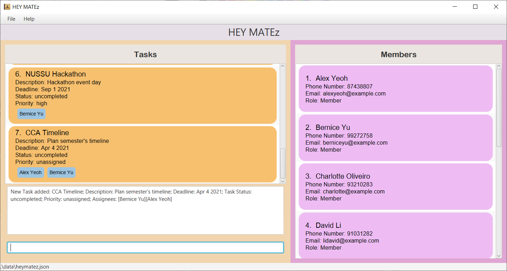

## Welcome to HEY MATEz
As a Club leader, are you struggling to **keep track of the ever-changing members** of your club as well as **manage 
the mountain of tasks** that have to be completed? Or perhaps it is a challenge to **keep track of the increasing 
number of deadlines** and be able to **assign tasks to members efficiently**. 

HEY MATEz is a desktop application to get rid of your woes by allowing you to **track 
members** and **tasks** within the club **efficiently and easily**! It is
a Command Line Interface (CLI) application which handles user requests that are typed into the input box as commands.

With HEY MATEz, managing and distributing tasks will never be a headache again! :smile:

## About this User Guide
This user guide includes information on the **features** of HEY MATEz as well as a walkthrough on how to use them. The features 
are further divided into 3 sections which include the **General features**, **Member related features** as well as the **Task related features**.
Member related features allow you to manage a list of members and find members. On the other hand, Task related features allow you
to manage tasks which can be identified by their unique list indexes.

* [Introduction](#introduction)  
* [Quick Start](#quick-start)  
* [Features](#features)
  + [General Features](#general)
    - [1. View Help: `help`](#help)
    - [2. Clear all data in HEY MATEz: `clear`](#clear)
    - [3. Exit Program: `exit`](#exit)
  + [Member Related Features](#members)
    - [1. Add Member: `addMember`](#addMember)
    - [2. Delete Member: `deleteMember`](#deleteMember)
    - [3. View Members: `viewMembers`](#viewMembers)
    - [4. Edit Member: `editMember`](#editMember)
    - [5. Find Members by Keywords: `findMembers`](#findMember)
  + [Task Related Features](#tasks)
    - [1. Add Task: `addTask`](#addTask)
    - [2. Delete Task: `deleteTask`](#deleteTask)
    - [3. View Tasks: `viewTasks`](#viewTasks)
    - [4. Edit Task: `editTask`](#editTask)
    - [5. Mark Task as Completed: `done`](#doneTask)
    - [6. Mark Task as Uncompleted: `undo`](#undoTask)
    - [7. Find Tasks by Keywords: `findTasks`](#findTask)
    - [8. Find Tasks by Deadline: `findBefore`](#findBefore)
    - [9. Find Tasks by Priority: `findPriority`](#findPriority)
    - [10. Clear all Members Assigned to a Task: `clearAssignees`](#clearAssignees)
    - [11. View List of Unassigned Tasks: `viewUnassignedTasks`](#findUnassigned)
    - [12. View List of Uncompleted Tasks: `viewUncompletedTasks`](#findUncompleted)
    - [13. Find Tasks Assigned to a Single Member: `findTasksFor`](#findTasksFor)
* [Data Storage](#dataStorage)
  + [Saving the data](#savingData)
  + [Editing the data file](#editData)
* [FAQ](#faq)
* [Command Summary](#summary)

--------------------------------------------------------------------------------------------------------------------

## Quick Start

1. Ensure you have Java `11` or above installed in your Computer. You can install Java `11` [here](https://www.oracle.com/sg/java/technologies/javase-jdk11-downloads.html).

1. Download the latest `heymatez.jar` from [here](https://github.com/AY2021S2-CS2103T-W14-3/tp/releases).

1. Copy the file to the folder you want to use as the _home folder_ for your HEY MATEz.

1. Double-click the file to start the app. The GUI similar to the below should appear in a few seconds. Note how the app contains some sample tasks and members. 
   

1. Type the command in the command box and press Enter to execute it. e.g. typing **`help`** and pressing Enter will open the help window. 
   Some example commands you can try:

   * **`viewMembers`** : Lists all members.

   * **`addTask`**`Proposal d/Write out detailed proposal plan for CCA timeline b/2021-04-22` : Adds a task named `Proposal` to HEY MATEz.
  
   * **`deleteTask`**`3` : Deletes the 3rd task shown in the list.

   * **`clear`** : Deletes all tasks and members.

   * **`exit`** : Exits the app.

1. Refer to the [Features](#features) below for details of each command.

-------------------------------------------------------------------------------------------------------------

## Features

**:bookmark_tabs: Notes about the command format:** 

* Words in `UPPER_CASE` are the parameters to be supplied by the user. 
  e.g. in `addMember NAME`, `NAME` is a parameter which can be used as `addMember John Lim`.

* Items in square brackets are optional. 
  e.g `d/DESCRIPTION [p/PRIORITY]` can be used as `d/Meeting p/high` or as `d/Meeting`.
    
* Items with `…`​ after them can be used multiple times including zero times. 
  e.g. `[a/ASSIGNEE]…​` can be used as ` ` (i.e. 0 times), `a/Duncan`, `a/Daniel a/Benson` etc.

* Parameters can be in any order. 
  e.g. if the command specifies `e/EMAIL p/PHONE_NUMBER`, `p/PHONE_NUMBER e/EMAIL` is also acceptable.
  
* If a parameter is expected only once in the command, but you specified it multiple times, only the last occurrence of the parameter will be taken. 
  e.g. if you specify `p/98562545 p/88885555`, only `p/88885555` will be taken.
  
* Extraneous parameters for commands that do not take in parameters (such as `help`, `exit` and `clear`) will be ignored. 
  e.g. if the command specifies `help 123`, it will be interpreted as `help`.

* For features which use the INDEX field, the INDEX you specify must be a valid number in the currently displayed list of tasks.

--------------------------------------------------------------------------------------------------------------------

## General Features

### 1. View Help: `help`
Shows a message explaining how to access the help page.

Format: `help`

Example: `help`

### 2. Clear all data in application: `clear`
Clears all entries from the application.

Format: `clear`

Example: `clear`

### 3. Exiting the programme: `exit`
Exits the program.

Format: `exit`

Example: `exit`

-------------------------------------------------------------------------------------------------------------

## Member Related Features

### 1. Add Member: `addMember`

With new members joining the club, you can add a new member along with his/her contact number and email to the members list.

Format: `addMember NAME p/PHONE_NUMBER e/EMAIL [r/ROLE]`

* NAME field is case-sensitive.   
* NAME and ROLE fields can take on any values with alphanumeric characters.
* PHONE_NUMBER field has to have a minimum length of 3 digits and maximum length of 15 digits.
* If ROLE field is not specified, person will be assigned a default role of `Member`.

Assumptions:
* Every member in the CCA has a different name. An error will be prompted when you add a member with the same name but with
a different phone number, email or role.

Examples: 
* `addMember Dylan p/64529356 e/dylan@gmail.com`
* `addMember Dylan p/64529356 e/dylan@gmail.com r/President`

  

Using the following addMember command, `addMember Erynne p/96398428 e/erynne@gmail.com`, the addMember command
can be used as shown below:

1. Key in the addMember command and its parameters
  

  
2. Press enter and view the result of the addMember command
  

  

### 2. Delete Member: `deleteMember`

As members leave the club, you can delete a member along with all of his/her contact details from the members list.

Format: `deleteMember NAME`

* NAME field is case-sensitive.

:exclamation: **Caution:**
The NAME specified must appear in the currently displayed list of members in order for it to be valid.

Examples:
* `deleteMember Rachel`

### 3. View Members: `viewMembers`

Displays the list of members that you have added into HEY MATEz.

Format: `viewMembers `

Examples: 
* `viewMembers`

### 4. Edit Member: `editMember`
Club members may change their emails or phone numbers after a while. This feature allows you to edit the details of the 
existing Member in the application with the name you specify.

Format: `editMember NAME [n/NEW_NAME] [p/NEW_PHONE_NUMBER] [e/NEW_EMAIL] [r/NEW_ROLE]`

* Edits the member at the specified NAME.
* NAME field is case-sensitive.
* At least one of the optional fields must be provided.
* NEW_NAME and NEW_ROLE fields can take on any values with alphanumeric characters.
* Existing values will be updated to the input values. 

:exclamation: **Caution:**
The NAME specified must appear in the currently displayed list of members in order for it to be valid.

Examples: 
* `editMember Alice n/Alice Tan`
* `editMember Alice n/Alice Tan p/98154155 e/aliceTan@gmail.com`
* `editMember Alice n/Alice Tan p/98154155 e/aliceTan@gmail.com r/Events head`

### 5. Find Members by Keywords: `findMembers`

With so many members in the club, you may want to find a particular member's details quickly. 
This feature allows you to find all members whose NAME, PHONE_NUMBER, EMAIL or ROLE contain
any of the specified keywords.

Format: `findMembers KEYWORD [MORE_KEYWORDS]...`

* KEYWORD must match an entire word in order for the particular member to be found. 
  * e.g. `Rachel` will not match with `Rach`.
* The search using KEYWORD is case-insensitive
  * e.g. `Rachel` will match with `rachel`. 

Examples: 
* `findMembers Rachel`
* `findMembers Rachel 98562154 john@gmail.com`
* `findMembers Rachel 98562154 john@gmail.com President`

-------------------------------------------------------------------------------------------------------------

## Task Related Features

### 1. Add Task: `addTask`

With new tasks that needs to be completed within the club every week, you can add a task, with its description and 
deadline to the task list.

Format: `addTask TITLE d/DESCRIPTION b/DEADLINE [s/STATUS] [p/PRIORITY] [a/ASSIGNEE]...`

* If you did not specify a value for STATUS, the Task will be assigned a default status value of **uncompleted**.
* STATUS field can only take on the values **completed** or **uncompleted** (Values are case-sensitive).
* If you did not specify a value for PRIORITY, the Task will be assigned a default priority of **unassigned**.
* PRIORITY field can only take on the values **high**, **medium**, **low** or **unassigned** (Values are case-sensitive).
* ASSIGNEE is case-sensitive and format-sensitive: "Alex Yeoh" and "Alex &nbsp; &nbsp; &nbsp; Yeoh" are not the same assignee.

 :bulb: **Tip:**
A task can have any number of assignees (including 0). To add multiple assignees, simply use multiple assignee prefixes. 

Examples: 
* `addTask CCA Timeline d/Plan semester's timeline b/2021-04-04 s/completed p/high a/Rachel`
* `addTask CCA Timeline d/Plan semester's timeline b/2021-04-04 a/Rachel a/James`

  

Using the following addTask command, `addTask CCA Timeline d/Plan semester's timeline b/2021-04-04 a/Alex Yeoh a/Bernice Yu`, the 
addTask command can be used as shown below:
 
1. Key in the addTask command and its parameters
  

  
2. Press enter and view the result of the addTask command
  

  

### 2. Delete Task: `deleteTask`
If a task is no longer relevant, you can delete the task along with its details from the list with the task index you specified.

Format: `deleteTask INDEX`

Examples: 
* `deleteTask 1`

### 3. View Tasks: `viewTasks`
Displays the list of tasks that you have added into HEY MATEz.

Format: `viewTasks`

Examples: 
* `viewTasks`

###     4. Edit Task: `editTask`
With ever-changing task requirements, you can edit a task at the task index specified with the new details 
you key in.

Format: `editTask INDEX [n/NEW_TITLE] [d/NEW_DESCRIPTION] [b/NEW_DEADLINE] [s/NEW_STATUS] [p/NEW_PRIORITY] [a/NEW_ASSIGNEE]...`

* Edits the Task at the specified INDEX.
* At least one of the optional fields must be provided.
* Existing values will be updated to the input values.
* When editing assignees, the existing assignees of the task will be removed i.e adding of assignees is not cumulative.
* NEW_ASSIGNEE is case-sensitive and format-sensitive: "Alex Yeoh" and "Alex &nbsp; &nbsp; &nbsp;  Yeoh" are not the same assignee.

:bulb: **Tip:**
Any number of assignees can be specified here (including 0). To have multiple assignees, simply use multiple assignee prefixes.    

Examples: 
* `editTask 1 n/Plan meeting d/Plan board meeting`
* `editTask 1 n/Plan meeting d/Plan board meeting b/2021-04-04`
* `editTask 1 n/Plan meeting d/Plan board meeting b/2021-04-04 a/Samuel a/Christian`
    

### 5. Mark Task as Completed: `done`

Upon completion of a task, you can change the status of a task with the task index you specify from **uncompleted** 
to **completed**.

Format: `done INDEX`

Examples: 
* `done 1`

### 6. Mark Task as Uncompleted: `undo`

Changes the status of a task with the task index you specify from **completed** to **uncompleted**.

Format: `undo INDEX`

Examples: 
* `undo 1`

### 7. Find Tasks by Keywords: `findTasks`

With so many tasks, you may want to find tasks quickly using some keywords.
This feature allows you to find all tasks which contain any of the specified keywords in its TITLE or DESCRIPTION.

Format: `findTasks KEYWORD [MORE_KEYWORDS]...`

* KEYWORD must match an entire word in order for the particular task to be found.
  * e.g. `Meeting` will not match with `Meet`.
* The search using KEYWORD is case-insensitive.
  * e.g. `Meeting` will match with `meeting`.

Examples: 
* `findTasks Meeting`
* `findTasks Meeting Proposal Draft`

### 8. Find Tasks due before certain date: `findBefore`

With so many tasks that need to be completed at different times, you may want to find tasks which are due before a certain date.
This feature allows you to find all tasks with deadlines before the date you have specified.

Format: `findBefore DATE`

:bulb: **Tip:**
The DATE specified must follow the format `YYYY-MM-DD`and be a valid date in the calendar.

Examples: 
* `findBefore 2021-05-04`

### 9. Find Tasks by Priority: `findPriority`

With so many tasks that are of different priority, this feature allows you to find all tasks containing the priority that 
you have specified.

* The valid input values for `findPriority` are **high**, **medium**, **low** and **unassigned**.

:bulb: **Tip:**
The input values are case-sensitive.

Format: `findPriority PRIORITY`

Examples:
* `findPriority high`

### 10. Remove all Members Assigned to a Task: `clearAssignees`

If you have accidentally assigned a task to the wrong group of members,
you can easily remove all members assigned to that task with the task index you specified.

Format: `clearAssignees INDEX`

Examples: 
* `clearAssignees 2`

### 11. View List of Unassigned Tasks: `viewUnassignedTasks`

In order to efficiently distribute tasks to members, you may want to view tasks which have yet to be assigned to any member.
This feature allows you to view the list of unassigned tasks.

Format: `viewUnassignedTasks`

Examples: 
* `viewUnassignedTasks`

### 12. View List of Uncompleted Tasks: `viewUncompletedTasks`

In order to be on track with work, you may want to view tasks which have not been completed.
This feature allows you to view the list of uncompleted tasks.

Format: `viewUncompletedTasks`

Examples: 
* `viewUncompletedTasks`

### 13. Find Tasks Assigned to a Single Member: `findTasksFor`

In order to manage members efficiently, you may want to track the tasks that are assigned to each member.
This feature allows you to find all tasks assigned to a single member.

Format: `findTasksFor NAME`

* The search using NAME is case-sensitive.
  * e.g. `David Li` will only match with `David Li`.
* NAME must match an entire member's name exactly in order for the tasks assigned to that member to be found. 
  * e.g. `David` will not match with `David Li`
 

 :bulb: **Tip:**
A NAME that does not belong to a member inside HEY MATEz will return no tasks listed.

Examples: 
* `findTasksFor Alex Yeoh`
* `findTasksFor Bernice Teo Hui Min`

--------------------------------------------------------------------------------------------------------------------

## Data Storage 

### Saving the data

HEY MATEz data is saved in the hard disk automatically after any command that changes the data. There is no need to save manually.

### Editing the data file

HEY MATEz data is saved as a JSON file `[JAR file location]/data/heymatez.json`. Advanced users are welcome to update data directly by editing that data file.

:exclamation: **Caution:**
If your changes to the data file makes its format invalid, HEY MATEz will discard all data and start with an empty data file at the next run.

--------------------------------------------------------------------------------------------------------------------

## FAQ

**Q**: How do I transfer my data to another Computer? 
**A**: Install the app in the other computer and overwrite the empty data file it creates with the file that contains the data of your previous HEY MATEz home folder.

--------------------------------------------------------------------------------------------------------------------

## Command summary

Action | Format, Examples
--------|------------------
**View Help** | `help`
**Clear Data** | `clear`
**Exit Program** | `exit`
||
**Add Member** | `addMember NAME p/PHONE_NUMBER e/EMAIL [r/ROLE]`   e.g., `addMember Dylan p/64529356 e/dylan@gmail.com r/Member`
**Delete Member** | `deleteMember NAME`   e.g., `deleteMember Rachel`
**View Members** | `viewMembers`  e.g., `viewMembers`
**Edit Member** | `editMember NAME [n/NEW_NAME] [p/NEW_PHONE_NUMBER] [e/NEW_EMAIL] [r/NEW_ROLE]`  e.g.,`editMember Alice e/newAlice@gmail.com r/Events head`
**Find Members by Keywords** | `find KEYWORD [MORE_KEYWORDS]...`  e.g., `findMembers Rachel 98562154 john@gmail.com`
||
**Add Task** | `addTask TITLE d/DESCRIPTION b/DEADLINE [s/STATUS] [p/PRIORITY] [a/ASSIGNEE]...`   e.g., Example: `addTask CCA Timeline d/Plan semester's timeline b/2021-04-04 s/completed p/high a/Rachel`
**Delete Task** | `deleteTask INDEX`   e.g., `deleteTask 1`
**View Tasks** | `viewTasks`  e.g., `viewTasks`
**Edit Task** | `editTask INDEX [n/NEW_TITLE] [d/NEW_DESCRIPTION] [b/NEW_DEADLINE] [s/NEW_STATUS] [p/NEW_PRIORITY] [a/NEW_ASSIGNEE]...`  e.g.,`editTask 1 n/Plan meeting d/Plan board meeting b/2021-04-04`
**Mark Task as Completed** | `done INDEX`  e.g., `done 1`
**Mark Task as Uncompleted** | `undo INDEX`  e.g., `undo 1`
**Find Tasks by Keywords** | `findTasks KEYWORD [MORE_KEYWORDS]...`  e.g., `findTasks Meeting Proposal Draft`
**Find Tasks by Deadline** | `findBefore DATE`  e.g., `findBefore 2021-04-05`
**Find Tasks by Priority** | `findPriority PRIORITY`  e.g., `findPriority high`
**Clear all Members Assigned to a Task** | `clearAssignees INDEX`  e.g., `clearAssignees 2`
**View Unassigned Tasks** | `viewUnassignedTasks`  e.g., `viewUnassignedTasks`
**View Uncompleted Tasks** | `viewUncompletedTasks`  e.g., `viewUncompletedTasks`
**Find Member's Tasks** | `findTasksFor NAME`   e.g., `findTasksFor Alice Tay`
