Taskify is a **desktop app for university students** who have a seemingly endless list of tasks to finish week 
after week. Many students **struggle to track all their tasks in a systematic and efficient manner** and this is 
where Taskify comes to the rescue! With Taskify, students can 
**manage all their tasks (academics/personal/CCA) 
effectively and seamlessly** through a beautiful interface.   Taskify is optimized for use via a Command Line 
Interface (CLI) while still having the benefits of a Graphical User Interface (GUI). Simply put, a **CLI is just 
a text box where you type in commands** so if you can type fast, Taskify can get your task management done faster 
than traditional GUI apps.

This user guide is to help you learn how to use Taskify to manage your tasks efficiently.

* Table of Contents
{:toc}
  

--------------------------------------------------------------------------------------------------------------------

## Quick start

1. Ensure you have Java `11` or above installed in your Computer. Refer to [this guide](https://java.com/en/download/help/download_options.html) to install Java.
2. Download the latest `taskify.jar` from [here](https://github.com/AY2021S2-CS2103T-W14-4/tp/releases).

3. Copy the `taskify.jar` file to the folder you want to use as the _home folder_ for Taskify.

4. Double-click the `taskify.jar` file to start the app. The GUI similar to the below should appear in a few seconds.
   
   
:bulb: **Tip:**
    The app comes preloaded with sample data to start you off!
   

   
   
   

5. Type the command in the command box and press Enter to execute it. e.g. typing **`help`** and pressing Enter will 
   open the help window.
   Some example commands you can try can be seen [here](#command-summary).

6. Refer to the [Features](#features-and-behaviour) below for the details of the main commands.

--------------------------------------------------------------------------------------------------------------------
## UI Layout
This section introduces you to the UI of Taskify. Let us take a closer look at the different sections and fields
present in the UI of Taskify.

Here is a sample usage of Taskify:  
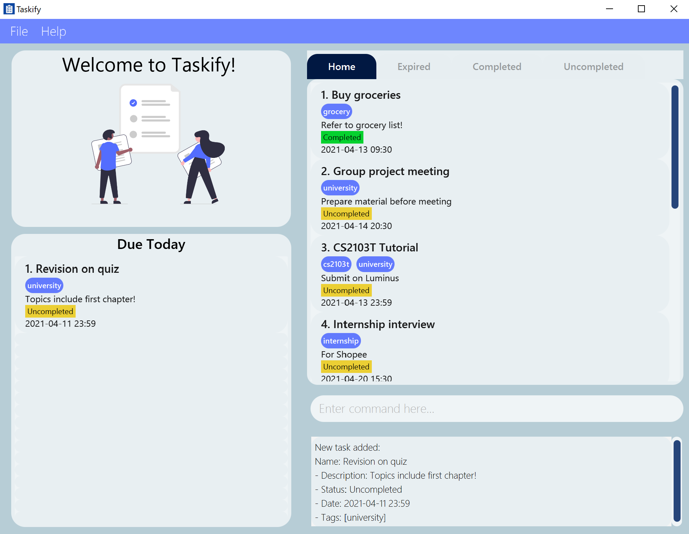

The UI of Taskify is split into 4 main components:
1. Task List
2. Command Box
3. Response Box
4. Due Today List

### 1. Task list
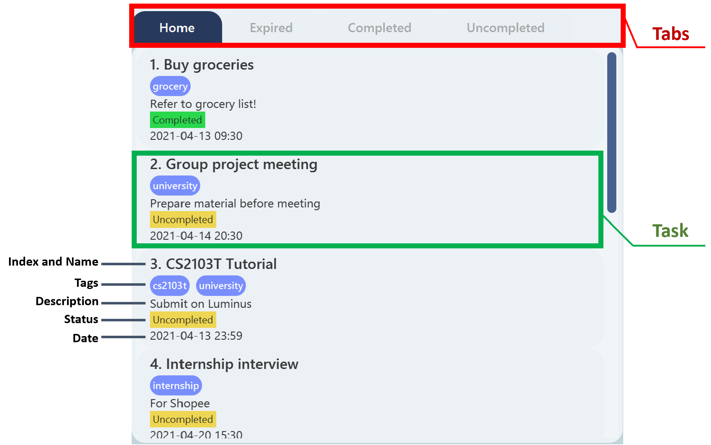

Shown above are positions of the Tabs and Tasks of a Task List. The fields of a Task include Index, Name,
Tags, Description, Status and Date.

A Status can be one of the following: `uncompleted`, `completed` or `expired`.

### 2. Command box

This is the Command Box. This is where you will input your commands.

### 3. Response Box
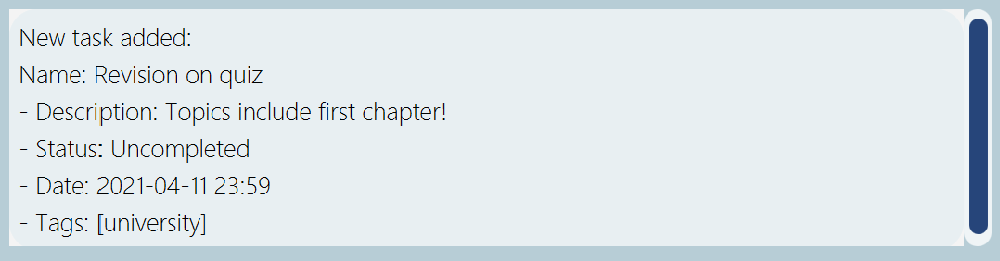

This is the Response Box. This is where you will see Taskify's response to your commands.

### 4. Due Today List
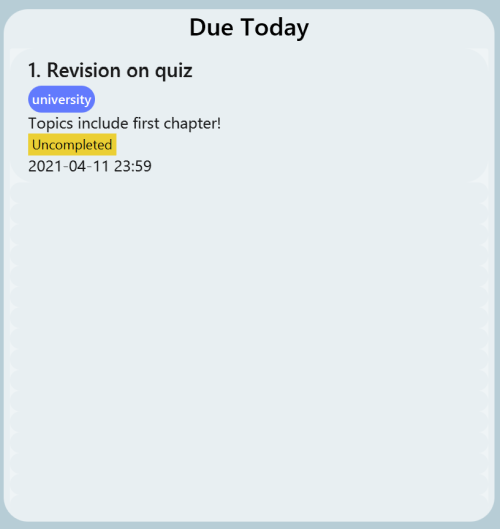

This is the Due Today List. This is where Tasks that are due today will be displayed
for your convenience.

**:information_source: Notes about the UI:** 

* The maximum screen size of the UI has been restricted for the best viewing experience.
* Maximising the app window and moving it will resize the window to the most recent unmaximised size.
* Navigating between tabs can only be done via CLI.

--------------------------------------------------------------------------------------------------------------------
## Features and Behaviour
This section highlights the features and behaviour of Taskify when it comes to certain situations. Refer to
this section if there are any unexpected or undesirable behaviour while using Taskify. We welcome any feedback
or suggestions [here](https://github.com/AY2021S2-CS2103T-W14-4/tp/issues). 

**:information_source: Notes about the Taskify's Behaviour:** 

* Words in `UPPER_CASE` are the parameters to be supplied by the user.
  
  e.g. in `add n/NAME`, `NAME` is a parameter which can be used as `add n/Finish Tutorial`.

* Items in square brackets are optional.
  
  e.g. `n/NAME [t/TAG]` can be used as `n/Finish Tutorial t/CS2103T` or as `n/Finish Tutorial`.

* Items with `…`​ after them can be used multiple times including zero times.
  
  e.g. `[t/TAG]…​` can be used as ` ` (i.e. 0 times), `t/CS2103T`, `t/Assignment t/CS2103T` etc.

* Parameters can be in any order.
  
  e.g. if the command specifies `n/NAME desc/DESCRIPTION`, `desc/DESCRIPTION n/NAME` is also acceptable.
  
* If a parameter is expected only once in the command, but you specified it multiple times, only the last occurrence 
  of the parameter will be taken.
  
  e.g. if you specify `n/Finish Tutorial n/Watch Lecture`, only `n/Watch Lecture` will be taken.

* Extraneous parameters for commands that do not take in parameters (such as `help`, `list`, `exit`, `sort` and `clear`) will be ignored.
  
  e.g. if the command specifies `help 123`, it will be interpreted as `help`.

* Adding a task in the `home` tab will display the full list of tasks.

* A task is considered duplicated if it's name, description and date are the same.

* For the `completed`, `uncompleted`, `expired` tabs, only the following commands work: `help`, `exit`, `uncompleted`, 
  `completed`, `expired` and `home`. Switch to the `home` tab to utilize the other commands.

* In the current implementation, for tasks which have expired, the app has to be restarted for the status of the task to be updated
from `uncompleted` to `expired`.

### Viewing help : `help`

Shows a message explaining how to access the help page.

Format: `help`

### Adding a task : `add`

Adds a new task to Taskify.

Format: `add n/NAME desc/DESCRIPTION [date/DATE] [t/TAG]…`

* The name of the task that is inputted is case-sensitive

* If a date is not specified in the command, the newly added Task will have its date set to the end of today (Today's date, 2359hrs).

* All tags are automatically converted to lowercase.

* The task name is limited to a maximum length of **50 characters** while the task description is limited to **80 
  characters**.

:bulb: **Tip:**
A Task can have any number of tags (including 0)

Examples:
* `add n/CS2100 Finals desc/Revise for Finals date/2021-04-13 12:00`
* `add n/Consult Professor desc/Discuss project with prof date/2021-04-04 10:30 t/project`
* `add n/Buy groceries desc/Don't forget tomatoes`

| Screenshot         | Remark |
| :-----------: | :-----------: |
|  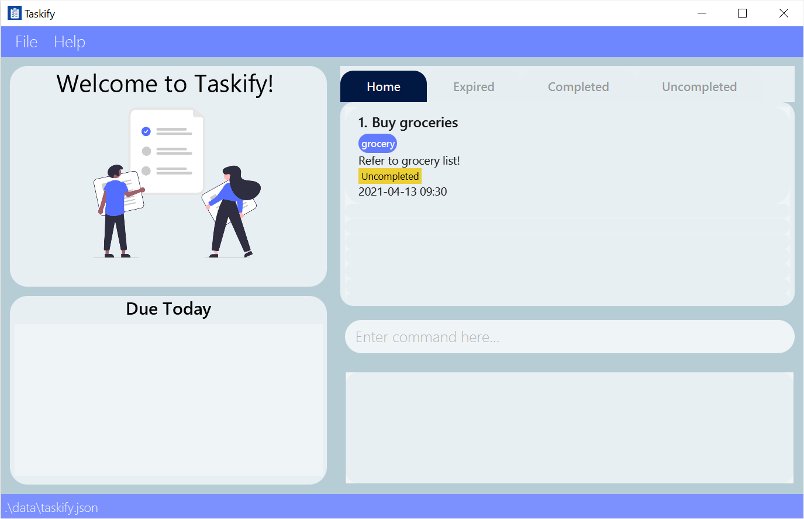     | <ins>**Before**</ins> Command Entered: `add n/Finish 2103 Tutorial desc/Draw UML diagram date/2021-04-13 10:30`  |
|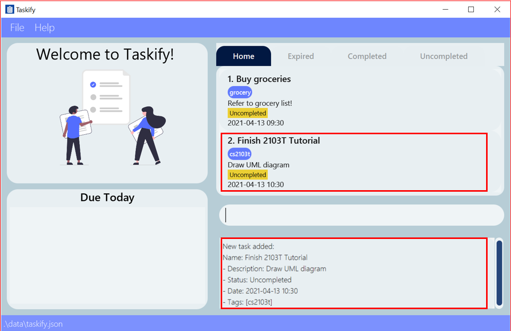  | <ins>**After**</ins> A new task named 'Finish 2103 Tutorial' has been added        |

### Listing all tasks : `list`

View a list of all tasks in Taskify.
Format: `list`

### Editing a task : `edit`

Edits an existing task in Taskify. Editing tasks allows you to keep track of any changes/updates to your schedule by 
modifying the task data.

Format: `edit INDEX [n/NAME] [desc/DESCRIPTION] [date/DATE] [s/STATUS] [t/TAG]…`

* Edits the task at the specified `INDEX`. The index refers to the index number shown in the displayed task list. The index **must be a positive integer** 1, 2, 3, …​
* Existing values will be updated to the input values.
* When editing tags, the existing tags of the task will be removed i.e. adding of tags is not cumulative.
* You can remove all the task’s tags by typing `t/` without specifying any tags after it.
* There are 3 Task statuses: `expired`, `uncompleted` and `completed`. However, you can cannot directly modify a 
  task's status to `expired` or from `uncompleted`/`completed` to `expired`.
* After editing a task, if it is a duplicate of another task currently in the list, an error will be thrown to the user.

Examples:
*  `edit 1 desc/my typical description` Edits the description of the 1st task to be `my typical description`.
*  `edit 2 n/Important Task t/` Edits the name of the 2nd task to be `Important Task` and clears all existing tags.
*  `edit 2 s/completed` sets the status of the 2nd task in the list to `completed`.

| Screenshot         | Remark |
| :-----------: | :-----------: |
|  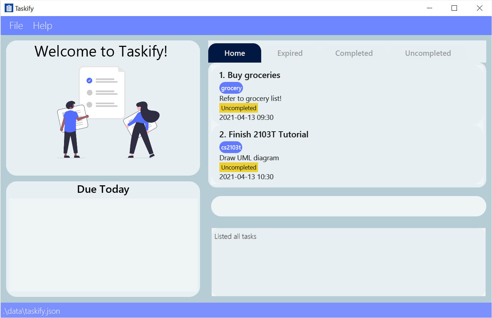     | <ins>**Before**</ins> Command Entered: `edit 2 s/completed`  |
|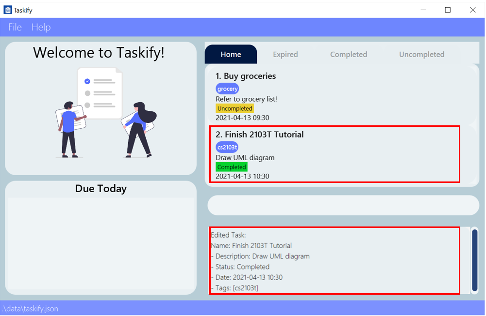  | <ins>**After**</ins> The status of the task at index 2 has been changed to completed        |

### Deleting a task : `delete`

Deletes an existing task in Taskify. Deletion of multiple tasks with one command is also supported.

Format: `delete INDEX`

Examples: `delete 2` deletes the 2nd task in Taskify, if there are at least 2 or more tasks.

Notes:
* The index refers to the index number shown in the displayed task list in `home` tab.
* The index **must be a positive integer** 1, 2, 3, …

#### Deleting multiple tasks

Deletes multiple tasks with one command.

Delete multiple tasks by either:
1. Listing individual indices (i.e more than one index)
2. Stating an index range
3. Indicating the desired `Status` of tasks to delete

* Listing individual indices
    * Format: `delete INDEX INDEX ...`
    * Examples: `delete 1 2 3` deletes the 1st, 2nd, 3rd task as displayed, if Taskify has at least 3 tasks.
    * Note:
        * If any of the indices provided are invalid, no tasks will be deleted.
    

* Stating the range of indexes
    * Format: `delete INDEX-INDEX`
    * Examples: `delete 1-3` deletes the 1st, 2nd, 3rd task as displayed, if Taskify has at least 3 tasks.
    * Notes:
        * `delete 1-3` will **NOT** delete the 1st and 2nd task if there are **only** two tasks in Taskify.
        * `delete 2-2` does not delete the 2nd task. Use `delete 2` instead
    
        
* Indicating the `Status` to delete by
    * Format: `delete STATUS -all`
    
    * Examples: `delete expired -all` deletes **all** tasks that are **expired**.

    * Notes:
        * All tasks have one of the 3 `Status`: `uncompleted`, `completed`, `expired`
        * Newly created tasks have `uncompleted` as their `Status`

| Screenshot         | Remark |
| :-----------: | :-----------: |
|  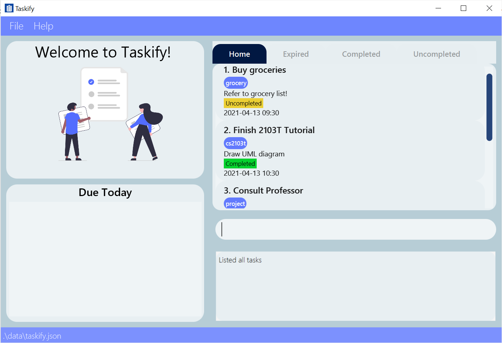     | <ins>**Before**</ins> Command Entered: `delete 2 3`  |
|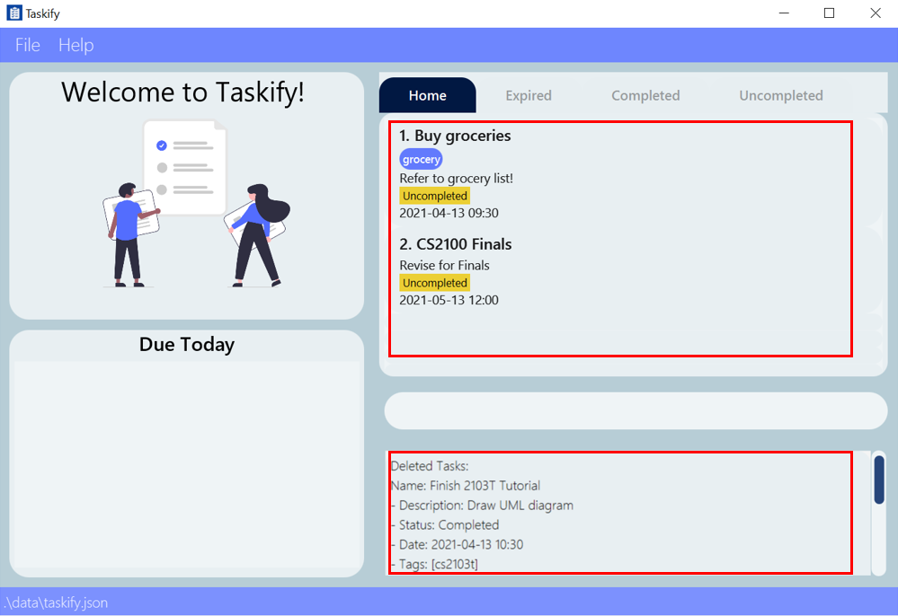  | <ins>**After**</ins> The tasks with indices 2 and 3 have been deleted        |
    
    

### Locating a task by name : `find`

Find tasks whose names contain any of the given keywords. This feature allows you to quickly find important tasks 
without going through everything.

Format: `find KEYWORD [MORE_KEYWORDS]`

* The search is case-insensitive. e.g. `cs2103t` will match `CS2103T`
* The order of the keywords does not matter. e.g. `Finish CS2103T Tutorial` will match `CS2103T Tutorial Finish`
* Only the name of the task is searched.
* Only full words will be matched e.g. `CS2103` will not match `CS2103T`
* Tasks matching at least one keyword will be returned.
  e.g. `CS2103T` will return `Finish CS2103T Tutorial`, `Watch CS2103T Lecture`

Examples:
* `find CS2103T` returns `Study for CS2103T Tutorial` and `Practical for CS2103T`, but does not return `CS2103TExam`

### Searching for a task by tags : `tag-search`

Find and list all tasks containing the same tags. Searching via tags improves efficiency by 
allowing you to quickly find all the tasks belonging to the same category of tags.

Format: `tag-search TAG [MORE_TAGS]`

Examples:
* `tag-search tutorial CS2103T`

| Screenshot         | Remark |
| :-----------: | :-----------: |
 |      | <ins>**Before**</ins> Command Entered: `tag-search finals`  |
|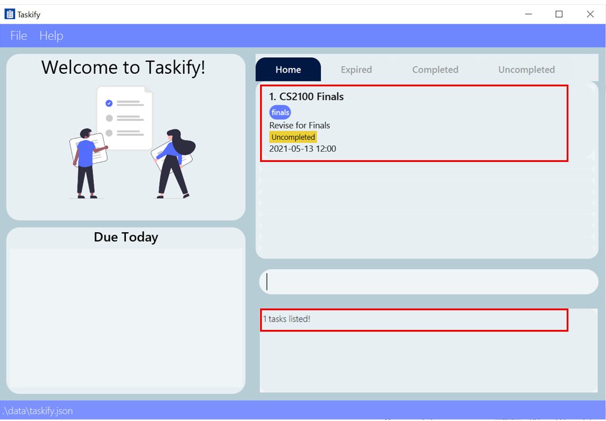  | <ins>**After**</ins> All the tasks containing the 'finals' tag have been displayed       |

### Viewing a task based on date : `view`

Find and list all tasks with the same date as the specified date. Viewing via dates can help you see what's due on a certain date easily.

* The `DATE` format `yyyy-mm-dd`.
* The `DATE` can also be specified as `today` or `tomorrow` to search for the current or next day's tasks
  easily.

Format: `view DATE`

Examples:
* `view 2021-05-21`
* `view today`
* `view tomorrow`

### Sorting tasks by date : `sort`

Sort tasks in ascending order of their dates. By sorting tasks you can easily see upcoming deadlines and decide 
which tasks to prioritise.

* If you sort in the `home` tab, the tasks in the other tabs will also be sorted.

Format: `sort`

| Screenshot         | Remark |
| :-----------: | :-----------: |
 |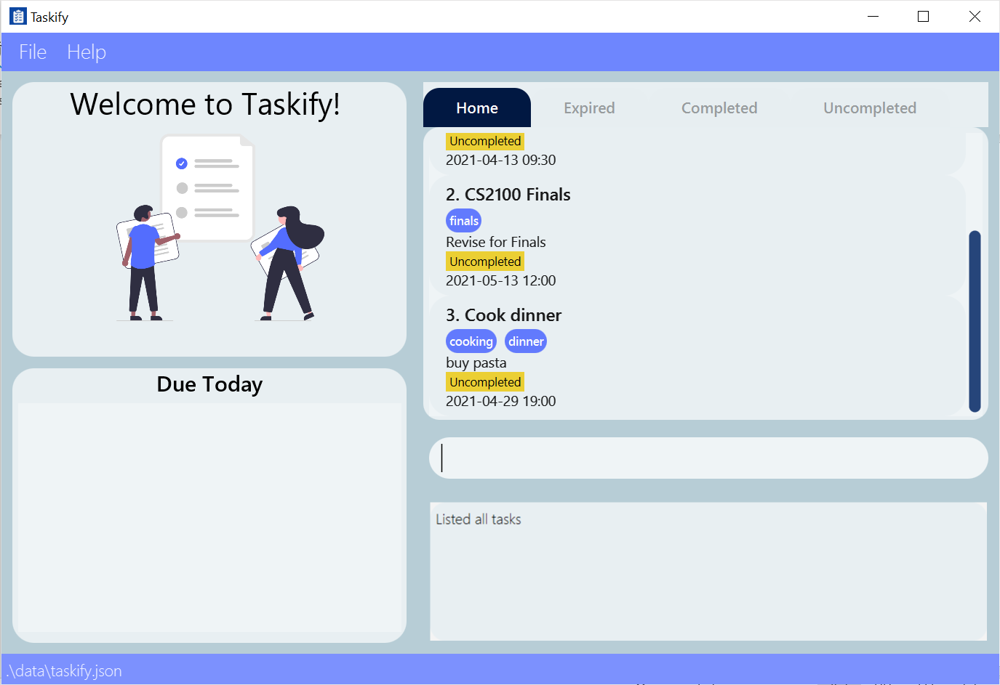     | <ins>**Before**</ins> Command Entered: `sort`  |
|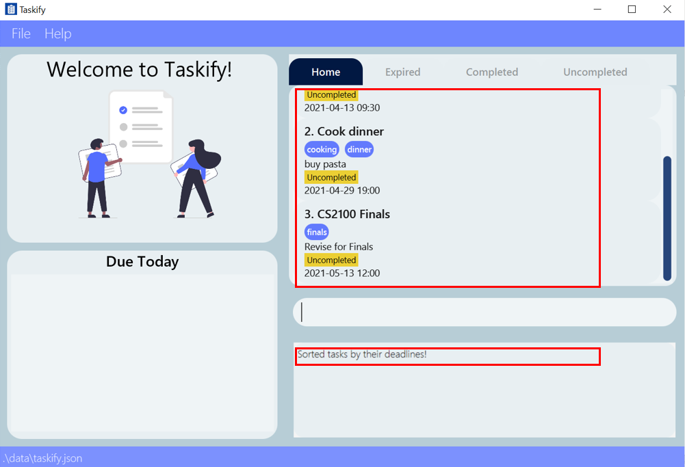  | <ins>**After**</ins> All the tasks have been sorted by deadline date       |

### Switching between tabs :`home` / `uncompleted` / `completed` / `expired`

Switch between the tabs in Taskify. Each tab displays tasks with the corresponding status.

Format: `home` / `uncompleted` / `completed` / `expired`

Examples: `completed` (change to the completed tab)

| Screenshot         | Remark |
| :-----------: | :-----------: |
 |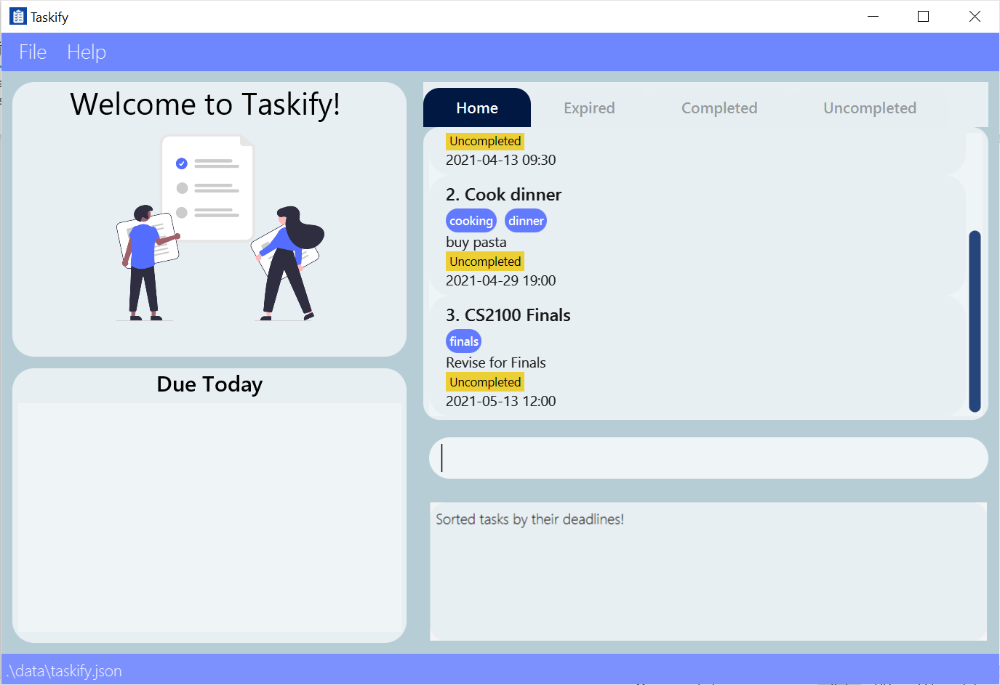     | <ins>**Before**</ins> Command Entered: `expired`  |
|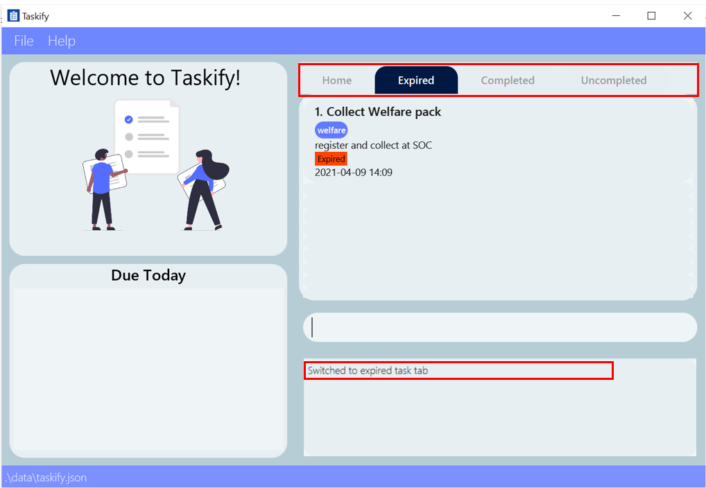  | <ins>**After**</ins> The UI has switched to display the expired tab    |

### Clearing all tasks : `clear`

Clears all tasks in Taskify.

Format: `clear`

### Exiting the program : `exit`

Exits the program.

Format: `exit`

--------------------------------------------------------------------------------------------------------------------

## FAQ

**Q**: Does Taskify only work for university Students?  
**A**: No, although Taskify is catered to university students, we welcome everyone interested in Taskify to use it. 

**Q**: Is Taskify free? 
**A**: Yes! Taskify is totally free to use.

**Q**: How do I transfer my data to another Computer? 
**A**: Install Taskify by downloading the `taskify.jar` file in the other computer and replace the default data file it creates 
(located at `[JAR file location]/data/taskify.json`) with the Taskify data file from your 
previous computer.

--------------------------------------------------------------------------------------------------------------------
## Glossary

Term | Explanation 
--------|--------
**App** | Short form for application
**CCA** | Abbreviation for Co-curricular activities
**CLI** | Abbreviation for Command Line Interface. The command line interface is an interface that accepts text input from users which is then processed and passed as commands to Taskify.
**GUI** | Abbreviation for Graphical User Interface. The graphical user interface is a form of user interface that allows users to interact with Taskify through graphical icons.   
**UI**  | Abbreviation for User Interface

## Command summary

Command | Format | Examples
--------|--------|----------
**Help** | `help` | `help`
**Add** | `add n/NAME desc/DESCRIPTION date/DATE [t/TAG]…` | `add n/Finish CS2103T Tutorial desc/another task date/2021-12-12 10:10 t/Assignment`
**List** | `list` | `list`
**Edit** | `edit INDEX [n/NAME] [desc/DESCRIPTION] [date/DATE] [t/TAG] [s/STATUS]…` | `edit 1 s/completed`
**Delete** | `delete INDEX`, `delete INDEX INDEX ...`, `delete INDEX-INDEX`, `delete STATUS -all`| `delete 3`, `delete 4 10 6`, `delete 5-8`, `delete completed -all`
**Find** | `find KEYWORD [MORE_KEYWORDS]` | `find Module Code`
**Tag-Search** | `tag-search TAG [MORE_TAGS]` | `tag-search CS2103T isFun`
**View** | `view DATE` | `view 2021-05-21`, `view today`, `view tomorrow`
**Sort** | `sort` | `sort`
**Home** | `home` | `home`
**Uncompleted** | `uncompleted` | `uncompleted`
**Completed** | `completed` | `completed`
**Expired** | `expired` | `expired`
**Clear** | `clear` | `clear`
**Exit** | `exit` | `exit`

