* Table of Contents
{:toc}

--------------------------------------------------------------------------------------------------------------------

## Introduction

Welcome to the User Guide (UG) of **SmartLib**!

Are you an owner of a private book loaning service or a library,
who is struggling to keep track of your readers' and books' records?
Do you frequently spend countless hours of your time trying to organize and manage the mountain of records generated by
your readers' borrowing activities?

If the above situation sounds familiar to you, fret not, for SmartLib is here to save the day!
SmartLib is a desktop application which would help you reduce the hassle of managing your business or library,
and save your valuable time.
It is an application optimized for use via a Command Line Interface (CLI),
meaning that you will be operating the application by typing commands into a Command Box.
It also provides users with the benefits of a Graphical User Interface (GUI),
which is a feature that enables users to interact with the application through simple interactive graphics such as buttons.

If you can type fast, SmartLib would be a brilliant and efficient assistant in the systematic management of your books
and borrowers' information, as compared to the traditional GUI apps currently available in the market!

If you are interested in using our wonderful application,
head over to [quick start](#quick-start) now to learn how to begin your journey with SmartLib!

--------------------------------------------------------------------------------------------------------------------

## Quick start

1. Ensure you have Java `11` or above installed in your Computer.

2. Download the latest `smartlib.jar` from [here](https://github.com/AY2021S2-CS2103T-W13-2/tp/releases).

3. Copy the file to the folder you want to use as the _home folder_ for your SmartLib.

4. Double-click the file to start the app. The GUI similar to the below should appear in a few seconds. Note how the app
contains some sample data.  

5. Type the command in the command box and press Enter to execute it. e.g. typing `listbook` and pressing Enter will
list all the current books in store. 
   Some example commands you can try:

   * `addreader r/John Doe p/98765432 e/johnd@example.com a/John street, block 123, #01-01` : Adds a reader named
   `John Doe` to SmartLib.

   * `deletereader 3` : Deletes the 3rd contact shown in the current list.

   * `listbook` : Lists all stored books in SmartLib.

   * `exit` : Exits the app.

6. Refer to the [Features](#features) below for details of each command.

--------------------------------------------------------------------------------------------------------------------

## Features

**:information_source: Notes about the command format:** 

* Words in `UPPER_CASE` are the parameters to be supplied by the user. 
  e.g. in `addreader r/NAME`, `NAME` is a parameter which can be used as `addreader r/John Doe`.  
  For more details regarding each parameter, you may want to explore
  [Readers' Command Parameters](#readers-command-parameters), [Books' Command Parameters](#books-command-parameters),
  and [Records' Command Parameters](#records-command-parameters).

* Items in square brackets are optional. 
  e.g `r/NAME [t/TAG]` can be used as `r/John Doe t/VIP` or as `r/John Doe`.

* Items with `…`​ after them can be used multiple times including zero times. 
  e.g. `[t/TAG]…​` can be used as ` ` (i.e. 0 times), `t/VIP`, `t/VIP t/MostFrequentCustomer`, etc.

* Parameters can be in any order. 
  e.g. if the command specifies `r/NAME p/PHONE_NUMBER`, `p/PHONE_NUMBER r/NAME` is also acceptable.

* If a parameter is expected only once in the command but you specified it multiple times, **only the last occurrence**
  of the parameter will be taken. 
  e.g. if you specify `p/12341234 p/56785678`, only `p/56785678` will be taken.

* Extraneous parameters for commands that do not take in parameters (such as `help`, `list`, `exit` and `clear`) will be
  ignored. 
  e.g. if the command specifies `help 123`, it will be interpreted as `help`.

### Managing your readers

SmartLib is aware that managing the contacts of your readers is a must for your service.
The features provided in this section will enable you to keep track of any relevant information which you might require
to keep track of your readers.

#### Readers' Command Parameters

Before you head into the usage of each feature, you may want to take a look at the table of command parameters
given below, and familiarize yourself with them.

| Parameter       | Description                                                                                                                                                                                                                                                                                                                                                   | Valid examples                                                                   |
| --------------- | ------------------------------------------------------------------------------------------------------------------------------------------------------------------------------------------------------------------------------------------------------------------------------------------------------------------------------------------------------------- | -------------------------------------------------------------------------------- |
| `NAME`          | The name of the reader.  It must be alphanumeric (may contain spaces).  Reader names must be unique (this restriction will be lifted in a later version of our app).                                                                                                                                                                              | `Bob Tan`, `noobmaster69`, `X AE A12`                                            |
| `PHONE_NUMBER`  | The contact number of the reader.  It must consist only of numbers, and be at least 3 digits long.                                                                                                                                                                                                                                                      | `98765432`, `012`                                                                |
| `EMAIL`         | The email of the client.  Emails should be in `name@domain` format, where the `name` part should only contain alphanumeric and special characters, whereas the `domain` part should only contain alphanumeric characters with a period in between.  Different readers may share the same email (as we understand that some families may do that). | `bob@bmail.com`, `bob-123@bobby.sg`                                              |
| `ADDRESS`       | The address of the reader.  It must be made up of alphanumeric and special characters (may contain spaces), and should not be blank.  Different readers may share the same address (as we understand that some readers may come from the same family).                                                                                            | `#01-23, Blk 13, Bukit Timah Road`                                               |
| `TAG`           | The tag that you would like to attach to or search for your reader.  It must be a single alphanumeric word.                                                                                                                                                                                                                                       | `VIP`, `MostBorrows`                                                             |
| `INDEX`         | The index of the reader or book in the displayed list.  It must be a valid index number (i.e. in the range [`1`,`2`, ..., `length of list`]).                                                                                                                                                                                                           | `1`                                                                              |
| `KEYWORD`       | The keyword that you would like to use to search for your target reader(s) or book(s).  It must be a single alphanumeric word.                                                                                                                                                                                                                          | `Bob`, `Tan`, `noobmaster69`, `AE`                                               |
| `MORE_KEYWORDS` | Other keywords that you may want to use to search for your target reader(s) or book(s).  Each additional keyword must be a single alphanumeric word, separated from each other by a space.  This field is optional.                                                                                                                               |                                                                                  |
| `MORE_TAGS`     | Other tags that you may want to use to search for your target reader(s).  Each additional tag must be a single alphanumeric word, separated from each other by a space.  This field is optional.                                                                                                                                                  |                                                                                  |

#### Adding a reader : `addreader`

You can use this command to add a new reader to SmartLib's registered reader base.

Format: `addreader r/NAME p/PHONE_NUMBER e/EMAIL a/ADDRESS [t/TAG]…`

**:information_source: Notes:**

* Refer to [Readers' Command Parameters](#readers-command-parameters) for more details about each parameter.
* Note that SmartLib uses reader names to identify a reader. Hence, duplicate names are not allowed.
* The reader's name is case sensitive, e.g. `Bob` and `bob` are two different readers.
* The `[t/TAG]…` parameters are optional.
  Duplicate tags will be ignored.

Example use:

Let's say a new reader wishes to be registered as a VIP.
You can follow the steps below to add the reader to SmartLib's registered reader list.

Steps:

1. Type `addreader r/John Doe p/98765432 e/johnd@example.com a/John street, block 123, #01-01 t/vip` into the
   _Command Box_.
2. Press `Enter` to execute your input.

Outcome:

* The _Result Display_ will show a success message with the newly added reader's information.
    
  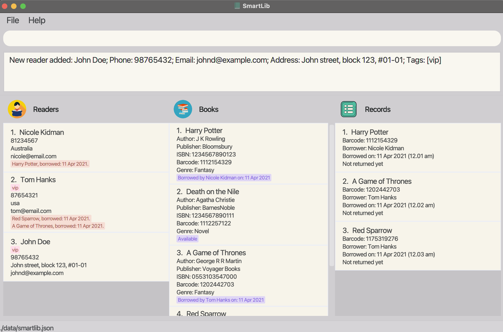

#### Deleting a reader : `deletereader`

You can use this command to delete a reader from SmartLib's registered reader base.

Format: `deletereader INDEX`

**:information_source: Notes:**

* Refer to [Readers' Command Parameters](#readers-command-parameters) for more details about each parameter.
* Deletes the reader at the specified `INDEX`.
* The index refers to the index number shown in the displayed reader list.
* The index **must be a positive integer**, i.e. 1, 2, 3, …​

**:warning: Warning:**

* A reader cannot be deleted if he/she has unreturned books. This is to prevent the loss of your books.

  To delete a reader holding on to unreturned books, you will need to first return the books borrowed by the reader
  (see the [return command](#returning-a-book--return) for more details), before deleting him/her.

Example use:

If a reader wishes to have his/her registration cancelled and personal information erased from SmartLib, 
you can follow the steps below to delete the reader from SmartLib's registered reader base.

Steps:

1. Type `deletereader 3` into the _Command Box_ if the reader has an index of 3 as shown on the displayed reader list.
2. Press `Enter` to execute.

Outcome:

* The _Result Display_ will show a success message with the deleted reader's information.
    
  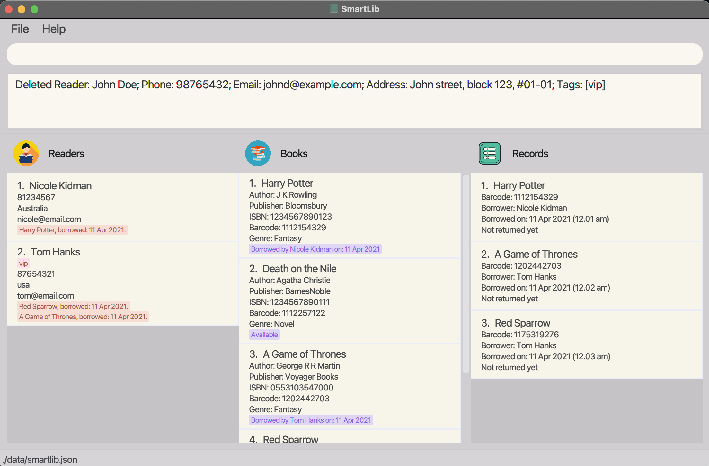

#### Finding readers : `findreader`

##### By name:

You can use this command to find readers whose names contain any of the given keywords.

Format: `findreader KEYWORD [MORE_KEYWORDS]…`

**:information_source: Notes:**

* Refer to [Readers' Command Parameters](#readers-command-parameters) for more details about each parameter.
* The search is case-insensitive. e.g `hans` will match `Hans`.
* The order of the keywords does not matter. e.g. `Hans Bo` will match `Bo Hans`.
* Only full words will be matched e.g. `Han` will not match `Hans`.
* The search will only display readers whose name matches any of the keywords (i.e. it disregards tags,
  phone numbers, etc.).
* Readers matching at least one keyword will be returned (i.e. `OR` search).
  e.g. `Hans Bo` will return `Hans Gruber`, `Bo Yang`.

Example use:

Suppose you have many readers in your registered reader base, and you are trying to find a particular reader
which you could only remember as `Bob` (let's say you have forgotten his full name).
You can follow the steps below to obtain a list of readers named Bob.

Steps:

1. Type `findreader Bob` into the _Command Box_.
1. Press `Enter` to execute your input.

Outcome:

* The _Result Display_ will show a message with the number of matching results indicating success.
* SmartLib will list out all the readers with `Bob` in their name.
    
  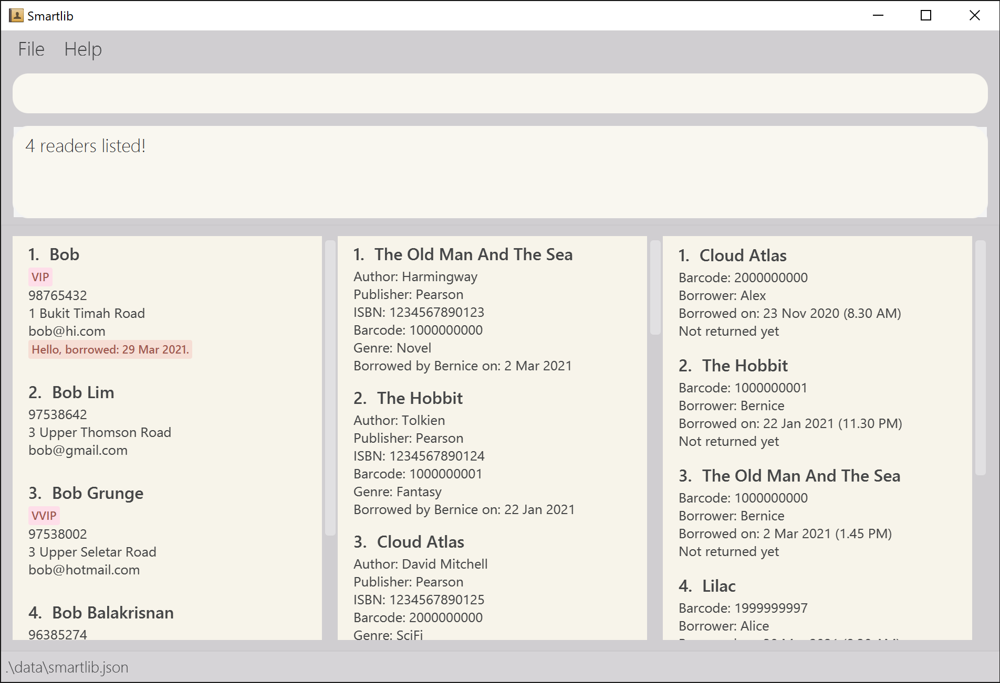

##### By tag:

You can also use this command to find readers whose tags contain any of the specified tags.

Format: `findreader t/TAG [MORE_TAGS]…`

**:information_source: Notes:**

* Refer to [Readers' Command Parameters](#readers-command-parameters) for more details about each parameter.
* Currently, SmartLib does not support finding readers by name and tag concurrently.
* The search is case-insensitive. e.g `vip` will match `VIP`.
* The order of the tags do not matter. e.g. `VIP TopBorrower` will match `TopBorrower VIP`.
* Only full words will be matched e.g. `VIP` will not match `VVIP`.
* The search will only display readers whose tags matches any of the keywords (i.e. it disregards reader names,
  phone numbers, etc.).
* Readers matching at least one tag will be returned (i.e. `OR` search).
  e.g. `VIP VVIP` will return readers with either the tag `VIP` or with the tag `VVIP`.

Example use:

Let's say you have many readers in your registered reader base,
and you are trying to find more information about a particular type of reader(s) (e.g. VIPs).
You can follow the steps below to obtain a list of readers with the `VIP` tag.

Steps:

1. Type `findreader t/VIP` into the _Command Box_.
1. Press `Enter` to execute your input.

Outcome:

* The _Result Display_ will show a message with the number of matching results indicating success.
* SmartLib will list out all the readers with `VIP` in their list of tags.
    
  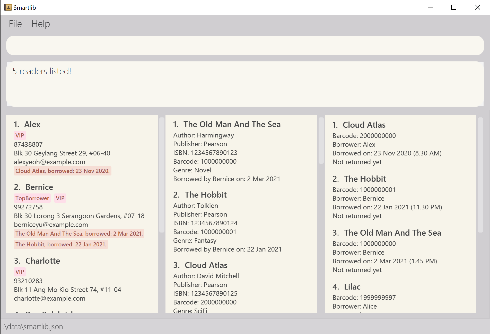

#### Listing all readers : `listreader`

You can use this command to display a list of all readers in SmartLib's registered reader base.

Format: `listreader`

**:information_source: Note:**

* Any parameters stated after `listreader` will be ignored by SmartLib.

Example use:

Let's say you have just performed `findreader Bob`,
and you would like to head back to view the full list of readers.
You can follow the steps below to get SmartLib to display the entire list of readers.

Steps:

1. Type `listreader` into the _Command Box_.
1. Press `Enter` to execute your input.

Outcome:

* The _Result Display_ will show a message indicating success.
* SmartLib will list out all the readers in its registered reader base.
    
  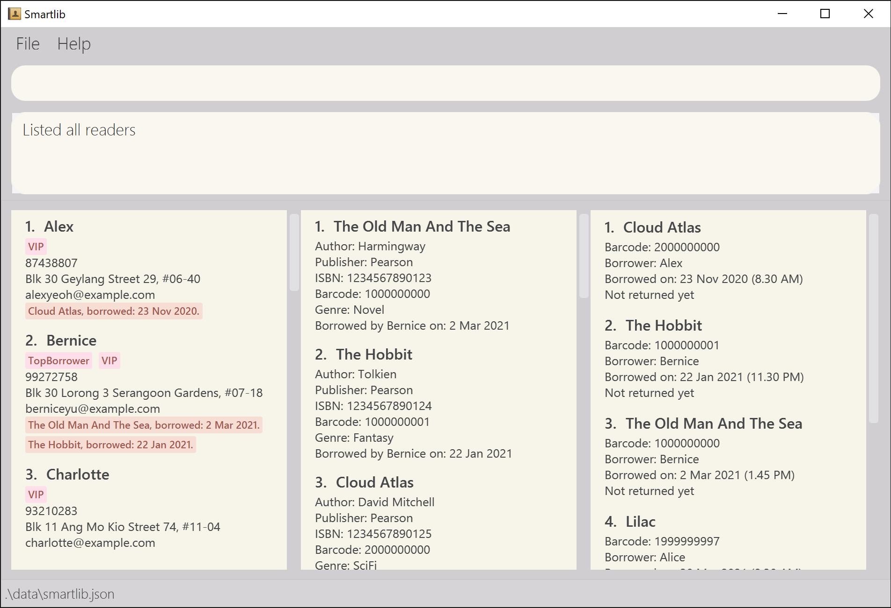

### Managing your books

SmartLib is aware that managing your books is also an essential part of your service.
The features provided in this section will enable you to keep track of any relevant information which you might require
to keep track of your books.

#### Books' Command Parameters

Before you head into the usage of each feature, you may want to take a look at the table of command parameters
given below, and familiarize yourself with them.

| Parameter       | Description                                                                                                                                                                                                          | Valid examples                                                                   |
| --------------- | -------------------------------------------------------------------------------------------------------------------------------------------------------------------------------------------------------------------- | -------------------------------------------------------------------------------- |
| `NAME`          | The name of the book.  It must be alphanumeric (may contain spaces).  SmartLib is able to hold multiple books with the same name.                                                                        | `A Book`, `noobbook69`, `X AE A12`                                               |
| `AUTHOR`        | The author of the book.  It must be alphanumeric (may contain spaces).                                                                                                                                         | `Bob Tan`, `noobmaster69`, `X AE A12`                                            |
| `PUBLISHER`     | The publisher of the book.  It must be alphanumeric (may contain spaces).                                                                                                                                      | `Bob Tan`, `noobmaster69`, `X AE A12`                                            |
| `ISBN`          | The ISBN of the book.  It must consist only of numbers, and be exactly 13 digits long.  Different books cannot share the same ISBN.                                                                      | `1234567890123`                                                                  |
| `GENRE`         | The genre of the book.  It must be alphanumeric (may contain spaces).                                                                                                                                          | `Fantasy`, `Folk Tales`                                                          |
| `INDEX`         | The index of the book in the displayed list.  It must be a valid index number (i.e. in the range [`1`,`2`, ..., `length of list`]).                                                                            | `1`                                                                              |
| `KEYWORD`       | The keyword that you would like to use to search for your target book(s).  It must be a single alphanumeric word.                                                                                              | `Bob`, `Tan`, `noobmaster69`, `AE`                                               |
| `MORE_KEYWORDS` | Other keywords that you may want to use to search for your target book(s).  Each additional keyword must be a single alphanumeric word, separated from each other by a space.  This field is optional.   |                                                                                  |

#### Adding a book : `addbook`

You can use this command to add a new book to SmartLib's registered book list.

Format: `addbook b/NAME a/AUTHOR p/PUBLISHER i/ISBN g/GENRE`

**:information_source: Notes:**

* Refer to [Books' Command Parameters](#books-command-parameters) for more details about each parameter.
* The book's name is case sensitive, e.g. `Secret` and `secret` are two different books.
* Note that SmartLib uses book ISBN to uniquely identify a unique edition and variation of a book. Hence,
  * There may be multiple copies of a book with the same name and ISBN.
  * Books with different names cannot share the same ISBN.
  * Books with the same name can have different ISBNs,
    as different authors may decide to publish books with the same name but with different content
    (e.g. _Great Expectations_, by Charles Dickens vs. _Great Expectations_, by Kathy Acker).
    
    In fact, in the event that the same author publishes two distinct books (i.e. different ISBN) with the same name,
    SmartLib will also be able to distinguish between them as well.

Example use:

Let's say you have ordered a new book (e.g. Harry Potter) for your library, and would like SmartLib to register the new
book.
You can follow the steps below to add the book to SmartLib's registered book list.

Steps:

1. Type `addbook b/Harry Potter a/JK Rowling p/Bloomsbury i/9780747532743 g/Fantasy` into the _Command Box_.
2. Press `Enter` to execute your input.

Outcome:

* SmartLib will randomly assign a barcode to your newly added book.
* The _Result Display_ will show a success message with the newly added book's information.
    
  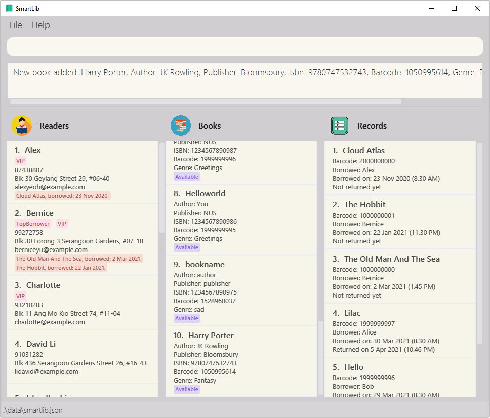

#### Deleting a book : `deletebook`

You can use this command to delete a specific book from SmartLib's registered book list.

Format: `deletebook INDEX`

**:information_source: Notes:**

* Refer to [Books' Command Parameters](#books-command-parameters) for more details about each parameter.
* Deletes the book at the specified `INDEX`.
* The index refers to the index number shown in the displayed book list.
* The index **must be a positive integer**, i.e. 1, 2, 3, …​

**:warning: Warning:**

* A book cannot be deleted if it is not returned.

  To delete a book that is still loaned out, you will need to first return the book
  (see the [return command](#returning-a-book--return) for more details), before deleting it.

Example use:

Let's say some of your books in the library have never been borrowed by your readers,
and you would like to donate them to charity.
You can follow the steps below to delete the book from SmartLib's registered book list.

Steps:

1. Type `deletebook 10` into the _Command Box_ if the book has an index of 10 as shown on the displayed book list.
2. Press `Enter` to execute your input.

Outcome:

* The _Result Display_ will show a success message with the deleted book's information.
    
  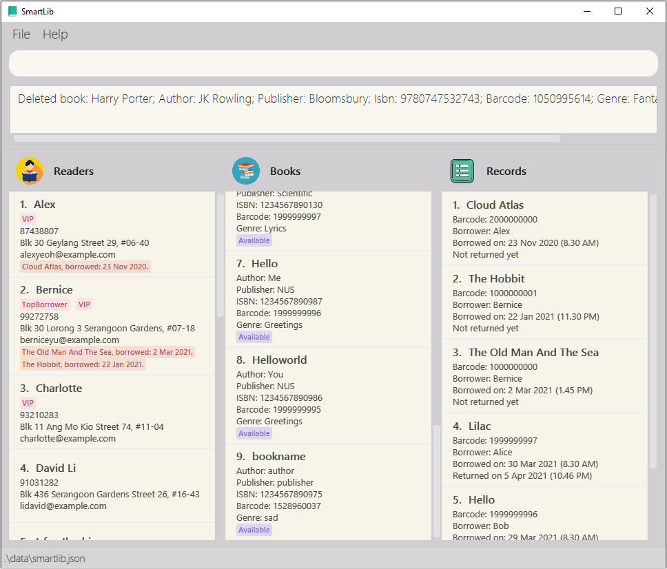

#### Finding books : `findbook`

You can use this command to find books whose information (i.e. title, author, publisher, ISBN, or genre)
contain any of the given keywords.

Format: `findbook KEYWORD [MORE_KEYWORDS]…`

**:information_source: Notes:**

* Refer to [Books' Command Parameters](#books-command-parameters) for more details about each parameter.
* The search is case-insensitive. e.g `Harry Potter` will match `harry potter`.
* The order of the keywords do not matter. e.g. `Potter Harry` will match `Harry Potter`.
* Only full words will be matched e.g. `Po` will not match `Potter`.
* The search will display all books whose information matches any of the keywords (i.e. regardless of whether the
  keyword appears in the book's title, author, publisher, ISBN, or genre field).
* Books with information matching at least one keyword will be returned (i.e. `OR` search).
  e.g. `Harry Fantasy` will return books with either the title `Harry Potter and the Goblet of Fire` or
  `Harry Potter and the Deathly Hallows`, as well as books with the genre `Fantasy`.

Example use:

Let's assume you are trying to find all the books of the genre `Novel` in SmartLib.
You can follow the steps below to obtain a list of books under the genre `Novel`.

Steps:

1. Type `findbook novel` into the _Command Box_.
1. Press `Enter` to execute your input.

Outcome:

* The _Result Display_ will show a message with the number of matching results indicating success.
* SmartLib will list out all the books under the genre `Novel`.
    
  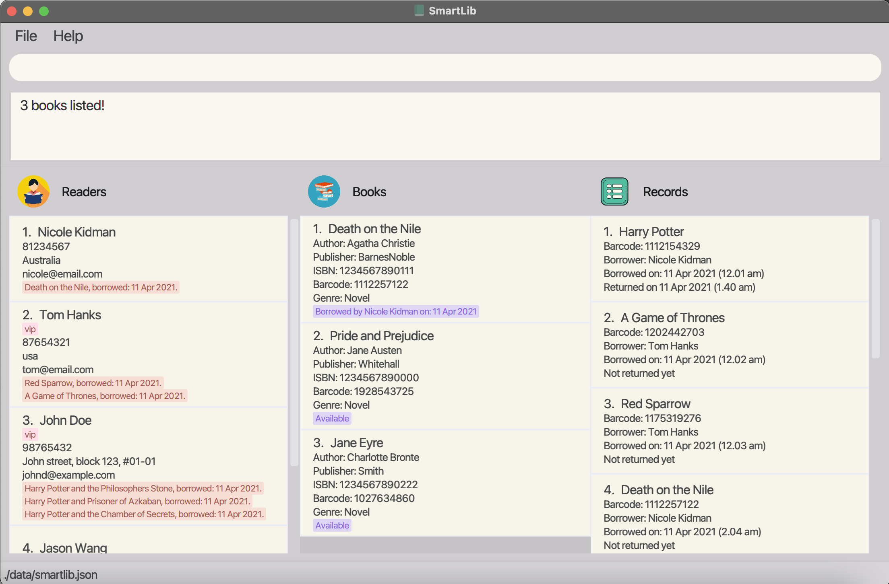

Another example use:

Let's say you have many books in your book list,
and you are trying to find more information about a certain book which you believe has a title containing the word
`Cloud`, and falls under the genre `Fantasy`.
You can follow the steps below to obtain a list of books with `Cloud` in their titles, or with the genre `Fantasy`.

Steps:

1. Type `findbook Cloud Fantasy` into the _Command Box_.
2. Press `Enter` to execute your input.

Outcome:

* The _Result Display_ will show a message with the number of matching results indicating success.
* SmartLib will list out all the books with `Cloud` in their titles, as well as books with the genre `Fantasy`.
    
  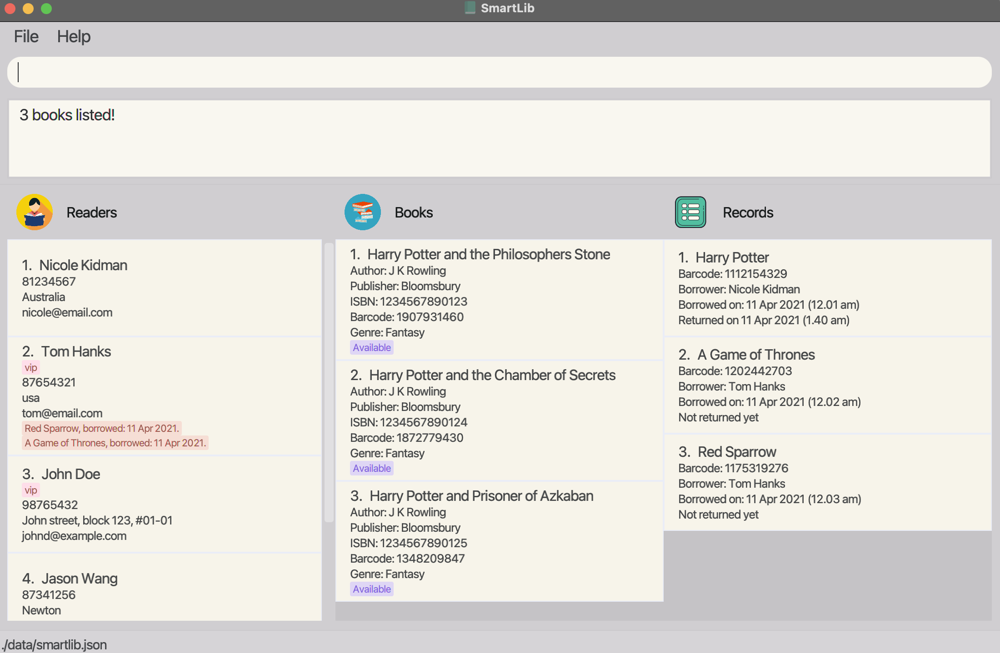

#### Listing all books : `listbook`

You can use this command to display a list of all the books in SmartLib's registered book list.

Format: `listbook`

**:information_source: Note:**

* Any parameters stated after `listbook` will be ignored by SmartLib.

Example use:

Let's say you have just performed `findbook Cloud`,
and you would like to head back to view the full list of books.
You can follow the steps below to get SmartLib to display the entire list of books.

Steps:

1. Type `listbook` into the _Command Box_.
1. Press `Enter` to execute your input.

Outcome:

* The _Result Display_ will show a message indicating success.
* SmartLib will list out all the books in its registered book list.
    
  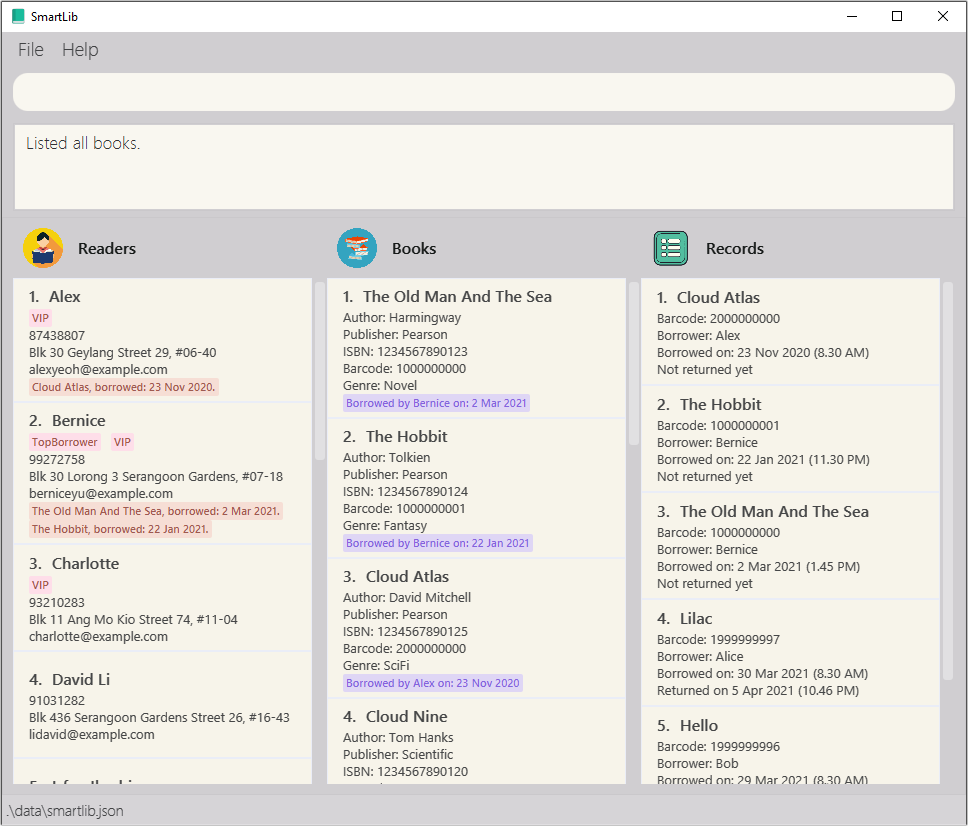

#### Listing all overdue books : `listoverdue`

You can use this command to display a list of all overdue books in SmartLib's registered book list.

Format: `listoverdue`

**:information_source: Note:**

* Any parameters stated after `listoverdue` will be ignored by SmartLib.

Example use:

Let's say you are interested to know which books are currently overdue,
so that you could send a reminder to readers who are holding on to them.
You can follow the steps below to get SmartLib to display the list of overdue books.

Steps:

1. Type `listoverdue` into the _Command Box_.
1. Press `Enter` to execute your input.

Outcome:

* The _Result Display_ will show a message indicating success.
* SmartLib will list out all overdue books in its registered book list.
    
  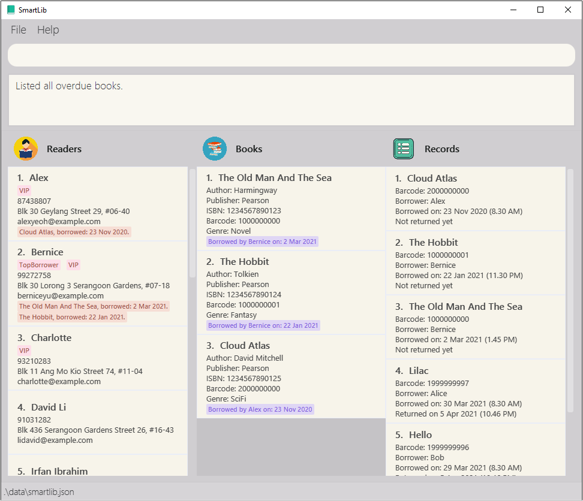

### Managing borrowing records

SmartLib also provides a variety of features to manage the borrowing records of your readers.
The features provided in this section will enable you to keep track of any relevant information which you might require
to keep track of your readers' borrowing records.

#### Records' Command Parameters

Before you head into the usage of each feature, you may want to take a look at the table of command parameters
given below, and familiarize yourself with them.

| Parameter       | Description                                                                                                                                                                                                          | Valid examples                                                                   |
| --------------- | -------------------------------------------------------------------------------------------------------------------------------------------------------------------------------------------------------------------- | -------------------------------------------------------------------------------- |
| `READERNAME`    | The name of the reader associated with the record.  It must be alphanumeric (may contain spaces).                                                                                                              | `Bob Tan`, `noobmaster69`, `X AE A12`                                            |
| `BARCODE`       | The barcode of the book associated with the record.  It must be a valid barcode (i.e. it must consist only of numbers, and be exactly 10 digits long).                                                         | `1234567890`                                                                     |
| `KEYWORD`       | The keyword that you would like to use to search for your target record(s).  It must be a single alphanumeric word.                                                                                            | `Bob`, `Tan`, `noobmaster69`, `AE`                                               |
| `MORE_KEYWORDS` | Other keywords that you may want to use to search for your target record(s).  Each additional keyword must be a single alphanumeric word, separated from each other by a space.  This field is optional. |                                                                                  |

#### Borrowing a book : `borrow`

You can use this command to get SmartLib to keep track of a reader borrowing a book.

Format: `borrow bc/BARCODE r/READERNAME`

**:information_source: Notes:**

* Refer to [Records' Command Parameters](#records-command-parameters) for more details about each parameter.
* The reader's name is case sensitive, e.g. `Bob` and `bob` are two different readers.
  (The reason for case sensitivity is because reader names are currently being used as a unique identifier for each
  reader.)
* Readers who are currently holding on to overdue books are not allowed to borrow books, until they have returned the
  overdue books.
* Each reader can only borrow up to 4 books at any point in time.

Example use:

Let's say the reader `Charlotte` would like to borrow the book `Cloud Nine`.
You can follow the steps below to get SmartLib to keep track of the borrowing record.

Steps:

1. Type `borrow bc/1999999999 r/Charlotte` into the _Command Box_.
1. Press `Enter` to execute your input.

Outcome:

* The _Result Display_ will show a message indicating success.
* SmartLib will record down this borrowing activity.
* The relevant parts of the GUI will be updated.
    
  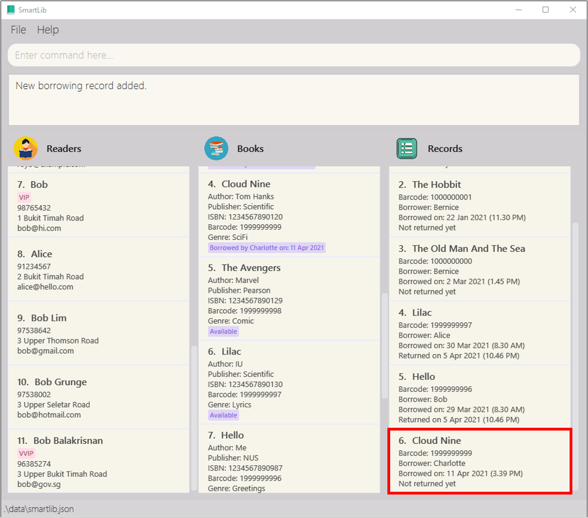

#### Returning a book : `return`

You can use this command to get SmartLib to keep track of a book being returned.

Format: `return bc/BARCODE`

**:information_source: Notes:**

* Refer to [Records' Command Parameters](#records-command-parameters) for more details about each parameter.
* The output message will contain the amount of fine that the reader needs to pay if the book is overdue.

Example use:

Let's say the reader `Charlotte` would like to return the book `Cloud Nine`.
You can follow the steps below to get SmartLib to keep track of the returning of the book.

Steps:

1. Type `return bc/1999999999` into the _Command Box_.
1. Press `Enter` to execute your input.

Outcome:

* The _Result Display_ will show a message indicating success.
* If the book returned is an overdue book, SmartLib will show you how long it exceeded the 
  original due date.
* SmartLib will record down this returning activity.
* The relevant parts of the GUI will be updated.
    
  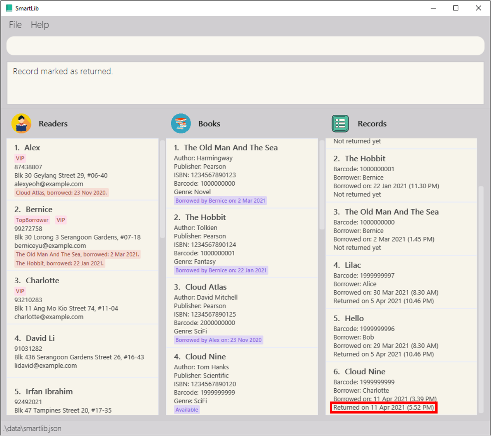

#### Finding records : `findrecord`

You can use this command to find records whose associated book titles contains any of the given keywords.

Format: `findrecord KEYWORD [MORE_KEYWORDS]…`

**:information_source: Notes:**

* Refer to [Records' Command Parameters](#records-command-parameters) for more details about each parameter.
* The search is case-insensitive. e.g `Harry Potter` will match `harry potter`.
* The order of the keywords do not matter. e.g. `Potter Harry` will match `Harry Potter`.
* Only full words will be matched e.g. `Po` will not match `Potter`.
* The search will only display records whose associated book's title matches any of the keywords
  (i.e. it disregards reader names, book's barcode, etc.).
* Records matching at least one keyword will be returned (i.e. `OR` search).
  e.g. `Harry` will return records associated with either the book `Harry Potter and the Goblet of Fire` or
  `Harry Potter and the Deathly Hallows`.

Example use:

Suppose you have many records in your records list, and you are trying to find a particular record
associated with the book titled `Lilac`.
You can follow the steps below to obtain a list of records associated with the keyword `Lilac`.

Steps:

1. Type `findrecord Lilac` into the _Command Box_.
1. Press `Enter` to execute your input.

Outcome:

* The _Result Display_ will show a message with the number of matching results indicating success.
* SmartLib will list out all the records associated with the book `Lilac`.
    
  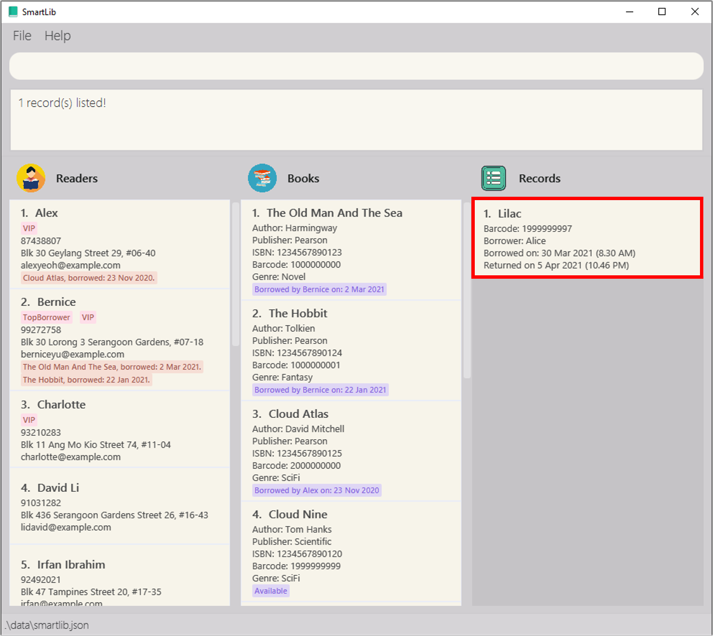

#### Listing all records : `listrecord`

You can use this command to display a list of all records in SmartLib's record list.

Format: `listrecord`

**:information_source: Note:**

* Any parameters stated after `listrecord` will be ignored by SmartLib.

Example use:

Let's say you have just performed `findrecord Lilac`,
and you would like to head back to view the full list of records.
You can follow the steps below to get SmartLib to display the entire list of records.

Steps:

1. Type `listrecord` into the _Command Box_.
1. Press `Enter` to execute your input.

Outcome:

* The _Result Display_ will show a message indicating success.
* SmartLib will list out all the records in its record list.
    
  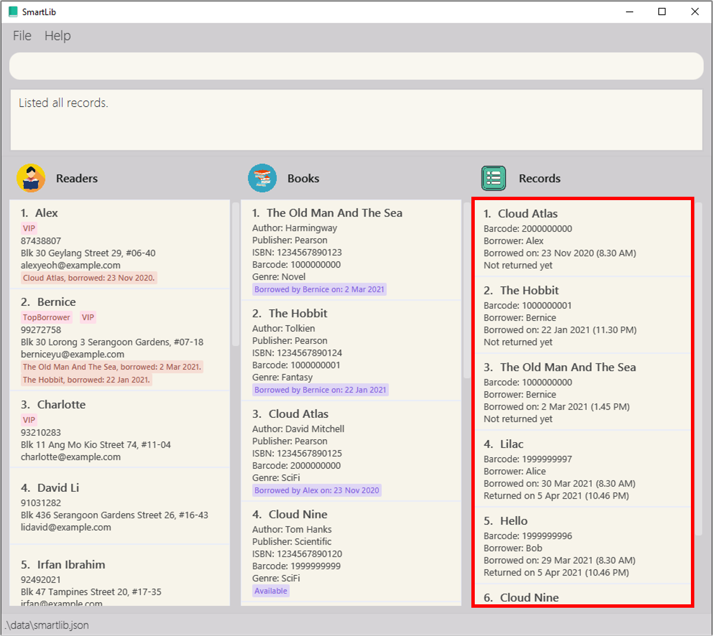

### Miscellaneous commands

Finally, SmartLib also provides a number of commands which will serve to be very helpful in your day-to-day use of the
application.

#### Clearing all entries : `clear-everything-in-my-smartlib`

You can use this command to clear all of your entries in SmartLib.

Format: `clear-everything-in-my-smartlib`

**:information_source: Notes:**
* As there is currently no way to undo your actions once you have cleared your SmartLib, 
  we have thus designed the command word for clearing entries to be especially complex,
  so that it would be unlikely for you to accidentally wipe out all of your precious data.
* Any parameters stated after `clear-everything-in-my-smartlib` will be ignored by SmartLib.

Example use:

Let's say you have decided to close down your bookstore due to a lack of visitors,
and decided to start anew with a comic store instead,
since you have observed a growing consumer base for comics and manga.

Let's also assume that you have enjoyed using SmartLib for your previous business,
and would like to continue using our app for your new venture.
You can follow the steps below to start with a new blank copy of SmartLib.

Steps:

1. Type `clear-everything-in-my-smartlib` into the _Command Box_.
1. Press `Enter` to execute your input.

Outcome:

* The _Result Display_ will show a message indicating success.
* SmartLib will clear all its data.
    
  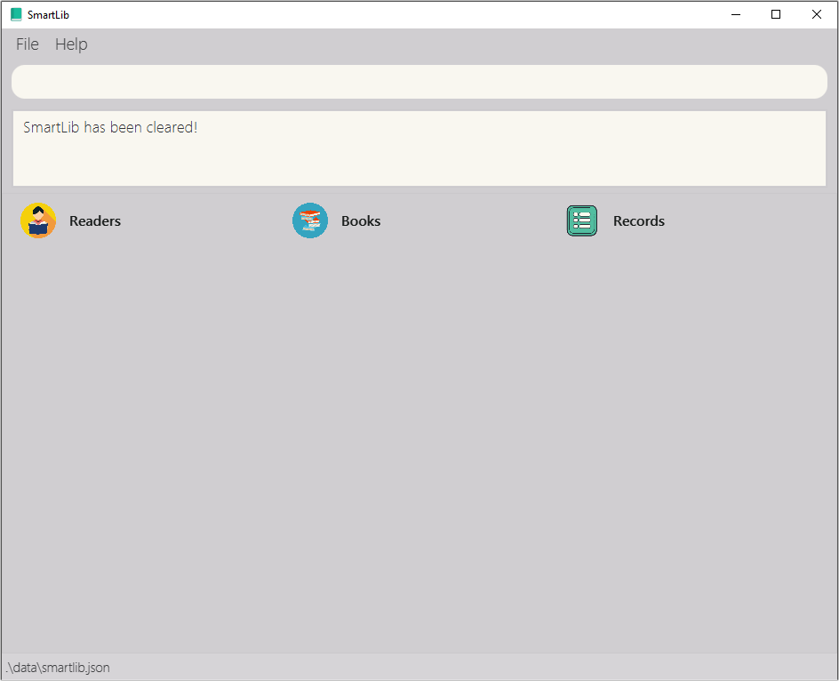

#### Viewing help : `help`

You can use this command to access the URL of a page showing SmartLib's features,
and the list of commands supported by SmartLib (i.e. this page).

Format: `help`

**:information_source: Note:**
* Any parameters stated after `help` will be ignored by SmartLib.

Example use:

Let's say you are a new user of SmartLib, and would like to learn more about how SmartLib can be used.
You can follow the steps below to get SmartLib to display a link to its User Guide,
containing explanations for its features, and the list of commands it supports. 

Steps:

1. Type `help` into the _Command Box_.
1. Press `Enter` to execute your input.

Outcome:

* The _Result Display_ will show a message indicating success.
* SmartLib will show a link to its User Guide, which you can then copy into your web browser.
    
  

#### Exiting the program : `exit`

You can use this command to exit the program.

Format: `exit`

**:information_source: Note:**
* Any parameters stated after `help` will be ignored by SmartLib.

Example use:

Let's say you would like to exit SmartLib, but you are not able to access the exit button of the application.
Fret not, you could also exit the application by following the steps below.

Steps:

1. Type `exit` into the _Command Box_.
1. Press `Enter` to execute your input.

Outcome:

* SmartLib will terminate.

### Miscellaneous features (for advanced users)

Some features, such as data saving and storage, and handled automatically by SmartLib.

#### Saving the data

SmartLib's data are saved in the hard disk automatically after any command that causes a change in the data.
There is no need to save manually.

#### Editing the data file

SmartLib data are saved as a JSON file `[JAR file location]/data/smartlib.json`. Advanced users are welcome to update
data directly by editing that data file.

**:exclamation: Caution:**

* If your changes to the data file makes its format invalid, SmartLib will discard all data and start with an empty data
  file at the next run.

--------------------------------------------------------------------------------------------------------------------

## FAQ

**Q**: How do I transfer my data to another computer? 
**A**: Install the app in the other computer and overwrite the empty data file it creates with the file that contains
the data of your previous SmartLib home folder.

**Q**: Why is there miscellaneous user data in my new copy of SmartLib? 
**A**: We have placed miscellaneous user data for new users to try out SmartLib's various commands, so that they could
make a more informed decision with regards to whether SmartLib is suitable for their daily use.

To purge all sample user data from SmartLib, you may use the command
[`clear-everything-in-my-smartlib`](#clearing-all-entries--clear-everything-in-my-smartlib).

--------------------------------------------------------------------------------------------------------------------

## Glossary

* **Alphanumeric**: Alphanumeric characters include uppercase letters from 'A' to 'Z',
    lowercase letters from 'a' to 'z', and
    numbers from '0` to '9'.

* **Barcode**: A barcode is an unique identifier for a book. Books with the same name will share the same ISBN,
    but each copy of a book with have a different barcode. This is to ensure that you will not be having a headache
    when trying to keep track of which copy of a book has been returned and which copy hasn't.

* **Command Box**: The _Command Box_ is the component of the GUI where you will be entering your user input.

* **Graphical User Interface (GUI)**: The GUI is a form of user interface that allows users to interact with electronic
    devices through graphical icons, instead of text-based user interfaces or typed command labels.

* **International Standard Book Number (ISBN)**: The ISBN is a numeric commercial book identifier which is intended to
    be unique for each book. Books with the same name will share the same ISBN. A 13-digit ISBN can be separated into 
    its parts (prefix element, registration group, registrant, publication and check digit), and when this is done it is 
    customary to separate the parts with hyphens or spaces.
     
* **JavaScript Object Notation (JSON) file**: This is a file format that uses human-readable text to store data.

* **Result Display**: The _Result Display_ is the component of the GUI where you will be notified whether your command
    was successfully executed by SmartLib.

* **Special characters**: Special characters refer to any characters that are not alphanumeric.

* **Web browser**: A web browser is a piece of application software for accessing the World Wide Web.
    Some examples include Google Chrome, Mozilla Firefox, and Safari.

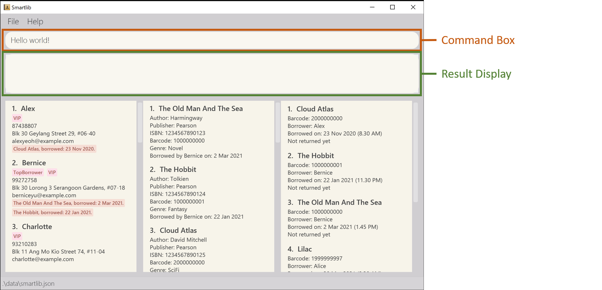

--------------------------------------------------------------------------------------------------------------------

## Command summary

Action                 | Format, Examples
-----------------------|------------------
**Add reader**         | `addreader r/NAME p/PHONE_NUMBER e/EMAIL a/ADDRESS [t/TAG]…`    e.g. `addreader r/James Ho p/22224444e/jamesho@example.com a/123, Clementi Rd, 1234665`
**Delete reader**      | `deletereader INDEX`   e.g. `deletereader 3`
**Find reader**        | `findreader KEYWORD [MORE_KEYWORDS]…` or `findreader t/TAG [MORE_TAGS]…`    e.g. `findreader James Jake`
**List readers**       | `listreader`
**Add book**           | `addbook b/NAME a/AUTHOR p/PUBLISHER i/ISBN g/Genre`    e.g. `addbook b/Harry Potter a/JK Rowling p/Bloomsbury i/9780747532743 g/Fantasy`
**Delete book**        | `deletebook INDEX`   e.g. `deletebook 3`
**Find book**          | `findbook KEYWORD [MORE_KEYWORDS]…`   e.g. `findbook Thomas Tank Engine`
**List books**         | `listbook`
**List overdue books** | `listoverdue`
**Borrow book**        | `borrow bc/BARCODE r/READERNAME`   e.g. `borrow bc/1000000000 r/Alex`
**Return book**        | `return bc/BARCODE`   e.g. `return bc/1202179131`
**Find record**        | `findrecord KEYWORD [MORE_KEYWORDS]…`   e.g. `findrecord Cloud Hobbit`
**List records**       | `listrecord`
**Clear**              | `clear-everything-in-my-smartlib`
**Help**               | `help`
**Exit**               | `exit`
