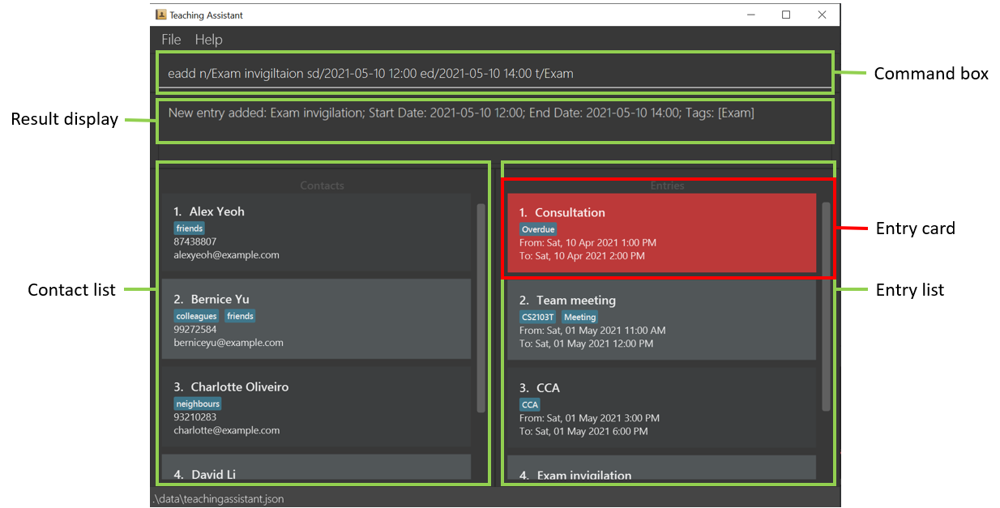

Welcome to the User Guide of _Teaching Assistant_!

Are you a JC/Secondary school teacher, having troubles keeping track of all your consultations, meetings and your
students' contacts? No worries! Our application, _Teaching Assistant_ will provide an all-in-one platform for you to
organise your entries (tasks and schedules) and contacts!

We target JC/Secondary school teachers as they are the teachers who have a greater need to contact their students
compared to primary school schools, yet do not have a standardised platform for communication unlike teachers
in tertiary schools.

_Teaching Assistant_ mainly uses a Command Line Interface (CLI). This means that a user can use the application by
typing into a Command Box. For users who type fast, they can use this application more efficiently than other
applications that heavily use Graphical User Interface (GUI), where a user uses the application by interacting with
graphical features such as buttons.

If you are interested, jump to [Quick Start](#quick-start) to learn how to learn how to start using _Teaching Assistant_
.

An image of our GUI is shown below!

---

- [Quick Start](#quick-start)
- [Structure of User Guide](#structure-of-the-user-guide)
    - [Reading this User Guide](#reading-this-user-guide)
        - [Terminology](#terminology)
        - [General Syntax and Symbols](#general-symbols-and-syntax)
- [Features](#features)
    - [Viewing help](#viewing-help)
    - [Contact](#adding-a-contact)
        - [Add](#adding-a-contact)
        - [Find](#finding-a-contact)
        - [Filter](#filter-contact-tags)
        - [Edit](#editing-a-contact)
        - [List](#listing-contacts)
        - [Delete](#deleting-a-contact)
    - [Entry](#adding-an-entry)
        - [Add](#adding-an-entry)
        - [Find](#finding-an-entry)
        - [Filter](#filter-entry-tags)
        - [Edit](#editing-an-entry)
        - [List](#listing-entries)
        - [Free](#checking-if-time-interval-is-free)
        - [Delete](#deleting-an-entry)
        - [Clear](#clearing-overdue-entries)
    - [Clear](#clearing-all-data)
    - [Exiting](#exiting-the-program)
- [Command Summary](#command-summary)

---

## Quick Start

1. Ensure you have Java 11 installed in your computer. You may install it [here](https://www.oracle.com/sg/java/technologies/javase-jdk11-downloads.html).
1. Download the latest `teachingAssistant.jar` [here](https://github.com/AY2021S2-CS2103T-W13-4/tp/releases).
1. Copy the file to the folder you want to use as the *home folder* for your Teaching Assistant.
1. Double-click the file to start the app. The GUI similar to the image above should appear.
1. Type the command in the command box and press Enter to execute it.
   Some example commands you can try:
   * **`clist`**: Lists all contacts in Teaching Assistant.
   * **`cadd n/Danny p/98765432 e/danny@email.com`**: Adds a contact named `Danny` to Teaching Assistant.
   * **`efind consultation 1`**: Finds an entry named `consultation 1' in Teaching Assistant.
   * **`exit`**: Exits the app.
1. Refer to the [Features](#features) below for details of each command.

---

## Structure of the User Guide

Worried about how tedious it will be to read this document? Not to worry! We have structured this User Guide in a way
that makes it easy and quick for you to find what you need. In this next subsection,
[Reading this User Guide](#reading-this-user-guide), you can find some tips we have on how to read this guide. The
next section, [Features](#features), documents the main functionalities of _Teaching Assistant_ and how to use them.

The main functions of _Teaching Assistant_ can be summmarised as the following:
* Contact management
* Entry (schedules) management

If you prefer a brief overview of all the commands, head over to [command summary](#command-summary) which provides you
with a table of all available commands.

### Reading this User Guide
This section introduces you to some technical terms and syntax that will be used throughout the User Guide.
You may want to read through this section thoroughly first before moving on to the next sections.

##### Terminology
The image of our GUI is shown below, annotated with descriptions of each GUI component we refer to in this User Guide.

The table below defines some technical terminology used throughout the User Guide.

Terms | Meaning
----------------- | -------------------
GUI | Graphical User Interface. It refers to the part of the application you interact with.
JSON | JavaScript Object Notation. Your Teaching Assistant data is stored as a JSON file format. You can find out more on their official website [here](https://www.json.org/json-en.html)!

##### General Syntax
The table below explains the general syntax used throughout the User Guide.

Syntax | Meaning
----------------- | -------------------
`command` | This markup is used to specify text that can be entered into the command box.
italics | Italics is used to represent terminology that is only specific to Teaching Assistant.

:bulb:
 | A bulb indicates that the following text is a tip.

:exclamation:
 | An exclamation mark indicates that the following text is a warning.

---

## Features

**:information_source: Notes about the command format:** 

* Words in `UPPER_CASE` are the parameters to be supplied by the user. e.g. in `cadd n/NAME`, `NAME` is a parameter which
  can be used as `cadd n/John Doe`.
* Items in the square brackets are optional. Users can choose to leave the field empty.
* Items with `...` after them can be used multiple times including zero times. e.g. `[t/TAG]...` can be used as `  ` 
  (i.e. 0 times), t/friend, t/friend t/family etc.
* Parameters can be in any order. e.g. if the command specifies `n/NAME p/PHONE_NUMBER`, `p/PHONE_NUMBER n/NAME` is also
  acceptable.
* If a parameter is expected only once in the command but you specified it multiple times, only the last occurrence of
  the parameter will be taken. e.g. if you specify `p/12341234 p/56785678`, only `p/56785678` will be taken.
* Extraneous parameters for commands that do not take in parameters (such as `help`, `list`, `exit` and `clear`) will be
  ignored. e.g. if the command specifies `help 123`, it will be interpreted as `help`.

---

### Viewing help

Shows a message explaining how to access the help page.

Format: `help`

---

### Adding a contact

Adds a contact into Teaching Assistant.

Format: `cadd n/NAME p/NUMBER e/EMAIL a/ADDRESS [t/TAG]...`

* A contact can have any number of tags (including 0).
* A contact can be tagged to an entry to easily filter for contacts related an entry.

Example(s):

* `cadd n/Danny p/98765432 e/danny@email.com t/consultation 1`
* `cadd n/Amy p/12345678 e/amy@email.com t/Colleague t/OwesMoney t/meeting 1`

### Finding a contact

Finds all contacts whose name contain all of the specified keywords and displays them as a list.

Format: `cfind KEYWORD [MORE_KEYWORDS]...`

* Only names are searched.
* The search is case-insensitive e.g. `amy` will match `Amy`.
* The order of the keywords does not matter. e.g. `Hans Bo` will match `Bo Hans`
* Only full words will be matched e.g. `Han` will not match `Hans`.
* Only contacts matching all keywords will be returned (i.e. AND search). E.g. `Hans Bo` will only return `Hans Bo`.

Example(s):

* `cfind John` returns `john` and `John Doe`
* `cfind alex yeoh` returns only `Alex Yeoh`

### Filter contact tags

Filters all contacts that have the tags of the specified keywords and displays them as a list with index numbers.

Format: `cfilter KEYWORD [MORE_KEYWORDS]...`

* Only tags are searched.
* The filtering is case-insensitive e.g. `CS2100` will match `cs2100`.
* Only full words will be matched e.g. `Friend` will not match `Friends`.
* If more than one keyword is provided, only contacts with all the keywords provided will be displayed.
  E.g. `filter colleagues friends` will only return a contact with both tags `colleagues` and `friends`. Contacts with
  only one of the 2 keywords will not be displayed.
* The order of the keywords does not matter. e.g. `colleagues friends` will match `friends colleagues`

Example(s):

* `cfilter student english`
* `cfilter colleagues`

### Editing a contact

Edits an existing contact with the specified index in Teaching Assistant.

Format: `cedit INDEX [n/NAME] [p/PHONE] [e/EMAIL] [a/ADDRESS] [t/TAG]...`

* `INDEX` refers to the index numer shown in the displayed entry list.
* `INDEX` must be a positive integer 1,2,3, ...
* At least one of the optional fields must be provided.
* Existing values will be updated to the input values.
* When editing tags, the existing tags of the contact will be removed i.e. adding of tags is not cumulative.
* You can remove all the contact’s tags by typing t/ without specifying any tags after it.

Example(s):

* `cedit 1 p/91234567 e/alexyeoh@example.com` Edits the phone number and email address of the contact corresponding to 
  index 1 and to `p/91234567` and `alexyeoh@example.com` respectively.
* `cedit 1 n/Bernice Yu Xiao Ling t/` Edits the name of the contact corresponding to index 1 to be `Bernice Yu Xiao Ling` 
  and clears all existing tags.

### Listing contacts

Lists all the contacts in Teaching Assistant.

Format: `clist`

### Deleting a contact

Deletes an existing contact with the specified index in Teaching Assistant.

Format: `cdelete INDEX`

* `INDEX` refers to the index number shown in the displayed person list.
* `INDEX` must be a positive integer 1, 2, 3, ...

Example(s):

* `cdelete 1`

---

### Adding an entry

Adds a new entry into Teaching Assistant.

Format: `eadd n/NAME sd/START_DATE ed/END_DATE [t/TAG]...`

* `START DATE` and `END DATE` are in the format `yyyy-mm-dd HH:MM`.
* `START DATE` should be before `END DATE`.
* Entries cannot overlap. i.e. Entries with overlapping timings will not be added.

Example(s):

* `eadd n/meeting sd/2021-02-15 21:00 ed/2021-02-15 23:00`
* `eadd n/consultation sd/2021-02-15 22:00 ed/2021-02-15 23:00 t/consultation`

### Finding an entry

Finds all entries whose name contain all of the specified keywords and displays them as a list.

Format: `efind KEYWORD [MORE_KEYWORDS]...`

* Only names are searched.
* The search is case-insensitive e.g. `meeting` will match `Meeting`.
* The order of the keywords does not matter. e.g. `teaching assistant` will match `assistant teaching`.
* Only full words will be matched e.g. `meeting` will not match `meetings`.
* Only entries matching all keywords will be returned (i.e. AND search). E.g. `assignment 1` will only return
  `assignment 1`.

Example(s):

* `efind assignment` returns `assignment 1` and `assignment 2`
* `efind assignment 2` returns only `assignment 2`

### Filter entry tags

Filters all entries that have the tags of the specified keywords and displays them as a list.

Format: `efilter KEYWORD [MORE_KEYWORDS]...`

* Only tags are searched.
* The filtering is case-insensitive e.g. `CS2100` will match `cs2100`.
* Only full words will be matched e.g. `CS2103` will not match `CS2103T`.
* If more than one keyword is provided, only entries with all the keywords provided will be displayed.
  E.g. `filter meeting CS2103T` will only return an entry with both tags `meeting` and `CS2103T`. Entries with only one
  of the 2 keywords will not be displayed.
* The order of the keywords does not matter. e.g. `meeting CS2103T` will match `CS2103T meeting`.

Example(s):

* `efilter CS2103T`
* `efilter CS2100 Meeting`

### Editing an entry

Edits an existing entry with the specified index in Teaching Assistant.

Format: `eedit INDEX [n/NAME] [sd/START_DATE] [ed/END_DATE] [t/TAG]...`

* `INDEX` refers to the index numer shown in the displayed entry list.
* `INDEX` must be a positive integer 1,2,3, ...
* At least one of the optional fields must be provided.
* Existing values will be updated to the input values.
* When editing tags, the existing tags of the entry will be removed i.e. adding of tags is not cumulative.
* You can remove all the entry’s tags by typing t/ without specifying any tags after it.

Example(s):

* `eedit 1 sd/2021-05-03 13:00 ed/2021-05-03 14:00` Edits the start and end dates of the entry corresponding to index 1 to
  be `2021-05-03 13:00` and `2021-05-03 14:00` respectively.
* `eedit 1 t/` Edits the entry corresponding to index 1 by clearing all existing tags.

### Listing entries

Lists all entries in Teaching Assistant by displaying them as a list sorted by date. Entries can also be listed by day/week.

Format: `elist [FORMAT]`

* No argument: listing all entries
* `FORMAT` is only restricted to the following cases
    * `day`: listing entries for today
    * `week`: listing entries for the next 7 days

Example(s):

* `elist`
* `elist day`
* `elist week`

### Checking if time interval is free

Indicates if an interval is free. If free, a message indicating that will be shown. If not, entries occupying that
interval will be shown in the entries list.

Format: `free sd/START_DATE ed/END_DATE`

* `START DATE` and `END DATE` are in the format `yyyy-mm-dd HH:MM`.
* `START DATE` should be before `END DATE`.

Example(s):

* `free sd/ 2021-12-20 12:00 ed/ 2021-12-20 13:00` if the time interval is free, entries list will be empty and _"You're
  free!"_ message is shown. If not, a message _"Sorry, you're not free. Entries occupying that time interval listed
  below!"_ will be shown, accompanied by occupying entries in the entry list.

### Deleting an entry

Deletes an existing entry with the specified index in Teaching Assistant.

Format: `edelete INDEX`

* `INDEX` refers to the index number shown in the displayed person list.
* `INDEX` must be a positive integer 1, 2, 3, ...

Example(s):

* `edelete 1`

### Clearing overdue entries

Clears all entries that have dates before today's date.

Format: `eclear`

---

### Clearing all data

Clears all contacts and entries from Teaching Assistant.

Format: `clear`

### Exiting the program

Exits the program.

Format: `exit`

---

## Command summary

### Others

Action | Format
------- | ------------------
**View all commands** | `help`
**Clear** | `clear`
**Exit** | `exit`

### Contacts

Action | Format
-------- | ------------------
**Add** | `add n/NAME p/NUMBER e/EMAIL a/ADDRESS [t/TAG]`
**Find** | `find KEYWORD [MORE_KEYWORDS]`
**Filter tags** | `filter KEYWORD [MORE_KEYWORDS]`
**Edit** | `edit NAME [n/NAME] [p/PHONE] [e/EMAIL] [a/ADDRESS] [t/TAG]`
**List** | `list`
**Delete** | `delete INDEX`

### Entries

Action | Format
-------- | ------------------
**Add** | `eadd n/NAME [sd/START DATE] ed/END DATE [t/TAG]`
**Find** | `efind KEYWORD [MORE_KEYWORDS]`
**Filter tags** | `efilter KEYWORD [MORE_KEYWORDS]`
**List (by day/week)** | `elist [day/week]`
**Check if free** | `free sd/START_DATE ed/END_DATE`
**Delete** | `edelete NAME`
**Clear overdue entries** | `eclear`

