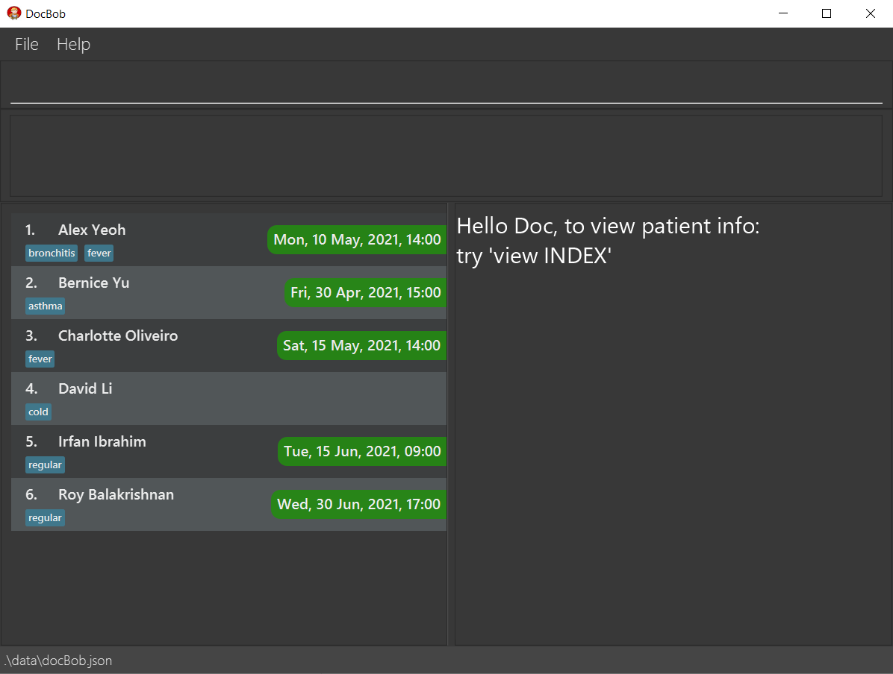

**DocBob** is a lightweight patient management system built to help small clinics better manage the appointments & medical information of their beloved patients. With DocBob, you will never have to go through the hassle of manually keeping track of your patients' medical information and appointments ever again. Leave the pen and paper in the past and let DocBob take you to an automated future. 
If there are any issues, please feel free to contact the team via the emails provided below under the **Issues** section

* Table of Contents
{:toc}

--------------------------------------------------------------------------------------------------------------------
# Application Layout

DocBob's interface comprises of 4 main parts.
* The **command box** is where you would enter the commands to be executed.
* The **command response** is where you would be able to see DocBob's response to the command you have just entered.
* The **patient book** is where your current displayed patient list would be shown.
* The **selected patient** is where the patient you are currently viewing would be displayed with all their contact information, medical information, appointments and medical records.

--------------------------------------------------------------------------------------------------------------------

# Quick start

1. Ensure you have Java `11` or above installed on your computer.

1. Download the latest `docbob.jar` from [here](https://github.com/AY2021S2-CS2103T-W12-1/tp/releases).

1. Double-click the file to start the app. You should see a Graphical User Interface similar to the image below on startup.
   > **First Startup**: If the full Graphical User Interface does not appear on your screen, please resize your window. DocBob comes with some sample patient data when started for the first time. Try out the example commands below with the sample data and when you are ready, use the `clear` command to remove all sample patient data and start adding your own patients!

1. Execute commands by typing them in the command box and pressing **Enter**. See [Features](#features) for more comprehensive details of each and every command. 
   Example commands you can try:
   * **`list`** : Lists out all patients in DocBob's main patient list.

   * **`add n/Breanna Frye y/13121999 g/F p/97890525 e/example@gmail.com a/4340 Monroe Street b/AB+ h/163cm w/54kg`** : Adds a patient named `Breanna Frye` with the given information to the patient book.

   * **`appt 1 d/010120301200`** : Adds a scheduled appointment with the patient at index 1 in DocBob's main patient list, on 1st January 2030 12pm.

> **Quick tip**: Typing **`help`** and pressing Enter will list out all available commands!

--------------------------------------------------------------------------------------------------------------------

# Features

**:information_source: Notes about the command format:** 

* Words in `UPPER_CASE` are the parameters to be supplied by the user. 
  e.g. in `add n/NAME`, `NAME` is a parameter which can be used as `add n/John Doe`.

* Items in square brackets are optional. 
  e.g `n/NAME [t/TAG]` can be used as `n/John Doe t/cough` or as `n/John Doe`.

* Items with `…`​ after them can be used multiple times including zero times. 
  e.g. `[t/TAG]…​` can be used as ` ` (i.e. 0 times), `t/friend`, `t/friend t/family` etc.

* Parameters can be in any order. 
  e.g. if the command specifies `n/NAME p/PHONE_NUMBER`, `p/PHONE_NUMBER n/NAME` is also acceptable.

* If a parameter is expected only once in the command but you specified it multiple times, only the last occurrence of the parameter will be taken. 
  e.g. if you specify `p/12341234 p/56785678`, only `p/56785678` will be taken.

* Certain commands (such as `help`, `list`, `exit` and `clear`) do not take in parameters.  In cases like this, the extra input parameters will be ignored. 
  e.g. if the command specifies `help 123`, it will be interpreted as `help`.

Our features are divided into three categories:

**Basic Features** contain the basic functionality of DocBob. These include commands that interact with the list of patients, viewing individual patients as well as the management of patient data.

**Appointments & Medical Records** contain the intermediate-level commands related to the storage and usage of appointments and medical records. These form the
core functionality of DocBob and clinics should look to use these functions as soon as possible.

**Archive** contains more advanced commands related to interacting with the archive and moving patients to and from the archive. These commands are suitable for clinics with a 
large number of patients in their database, as the archive allows clinics to better organise their patients to maintain a smooth workflow.

--------------------------------------------------------------------------------------------------------------------

## Basic Features
Basic features contain the commands for interacting with the list of patients. Add a new patient with `add`, or edit an existing one with `edit`. View the full list of existing patients 
with `list`, or find a specific patient with `find`. To view the comprehensive information on a patient, use `view`.

> **Quick tip**: To keep the patient list concise, only the most relevant information about a patient such as their name and tags are displayed. To view the full information on a patient, use the
> **`view`** function

### Adding a patient's contact: `add`

Adds a patient to DocBob's main patient list. A patient has multiple types of information like name, gender, phone number etc. The format below shows what information a patient can have. The information in square brackets ( [] ) is optional.

Format: `add n/NAME y/DATEOFBIRTH g/GENDER p/PHONENUMBER e/EMAIL a/ADDRESS b/BLOODTYPE h/HEIGHT w/WEIGHT [t/TAG]`

* `NAME` should only contain alphanumeric characters and spaces and cannot be blank.
* `DATEOFBIRTH` should be in the form DDMMYYYY, be a valid date, and be in the past.
* `GENDER` should only be `M`(MALE) or `F`(FEMALE) and nothing else.
* `PHONENUMBER` should only contain numbers and be at least 3 digits long.
* `EMAIL` should be in the format local-part@domain.
* `ADDRESS` can take any values and cannot be blank.
* `BLOODTYPE` should be either `A`, `B`, `AB` or `O` and include Rh factor(`+` or `-`).
* `HEIGHT` should be more than 0, an integer, and in cm. (Decimal support coming soon!)
* `WEIGHT` should be more than 0, an integer, and in kg. (Decimal support coming soon!)
* `TAG` should only contain alphanumeric characters with no spaces.
* This command will fail if there is already a patient with the exact same name in the patient book.

Example:
* `add n/Shrek y/27021999 g/M p/69696969 e/shrek@swampmail.com a/Swamp b/O- h/243cm w/94kg t/acromegaly`

Output:

`New patient added: Shrek; Date Of Birth: 27-02-1999; Gender: M; Phone: 69696969; Email: shrek@swampmail.com; Address: Swamp; BloodType: O-; Height: 243cm; Weight: 94kg; Tags: [acromegaly]`

> **Quick tip**: You can always change these details later on using the `edit` command!

### Listing out all patients : `list`

Shows the main list of your patients, with their next scheduled appointment beside their name along with their tags.

Format: `list`

Example: `list`

Output:

### View all information regarding a patient : `view`

Shows an overview of all the details, tags, appointments and medical records of a patient, identified by the index number shown in the displayed patient list.

Format : `view INDEX`
where INDEX must be a positive integer (1,2,3,...)

Examples:
* `view 6`

Output:

### Locating a patient by name : `find`

Finds patients in the displayed patient list whose names contain any of the given keywords, and displays an overview of information of the first patient found.

Format: `find KEYWORD [MORE_KEYWORDS]`

* The search is case-insensitive. e.g `hans` will match `Hans`
* The order of the keywords does not matter. e.g. `Hans Bo` will match `Bo Hans`
* Only the name is searched.
* Only full words will be matched e.g. `Han` will not match `Hans`
* Persons matching at least one keyword will be returned (i.e. `OR` search).
  e.g. `Hans Bo` will return `Hans Gruber`, `Bo Yang`
* If the displayed patient list is the main list, then `find` will only match patients from the main list.
* If the displayed patient list is the archived list, then `find` will only match patients from the archived list.

Examples:
* `find John` returns `john` and `John Doe`
* `find alex david` returns `Alex Yeoh`, `David Li` 

### Editing a patient's information : `edit`

Edits the information of an existing patient in DocBob's displayed patient list.

Format: `edit INDEX [n/NAME] [y/DATEOFBIRTH] [g/GENDER] [p/PHONE] [e/EMAIL] [a/ADDRESS] [b/BLOODTYPE] [h/HEIGHT] [w/WEIGHT] [t/TAG]…​`

* Edits the patient at the specified `INDEX`. The index refers to the index number shown in the displayed patient list. The index **must be a positive integer** 1, 2, 3, …​
* At least one of the optional fields must be provided.
* Existing values will be updated to the input values.
* When editing tags, the existing tags of the patient will be removed i.e adding of tags is not cumulative.
* You can remove all the patient’s tags by typing `t/` without
    specifying any tags after it.

Examples:
*  `edit 1 p/91234567 e/johndoe@example.com` Edits the phone number and email address of the 1st patient to be `91234567` and `johndoe@example.com` respectively.
*  `edit 2 n/Betsy Crower t/` Edits the name of the 2nd patient to be `Betsy Crower` and clears all existing tags.

### Deleting a patient's contact : `delete`

Deletes a patient from DocBob's patient list, identified by the index number shown in the displayed patient list.

Format : `delete INDEX`
where INDEX must be a positive integer (1,2,3,...)

* If the displayed patient list is the main list, then `delete` will delete the specified patient from the main list.
* If the displayed patient list is the archived list, then `delete` will delete the specified patient from the archived list.

Example:
* `delete 1`

Output:

`Deleted Person: Shrek; Date Of Birth: 27-02-1999; Gender: M; Phone: 69696969; Email: shrek@swampmail.com; Address: Swamp; BloodType: O-; Height: 243cm; Weight: 94kg; Tags: [acromegaly]`

--------------------------------------------------------------------------------------------------------------------

## Appointments & Medical Records
Clinics deal with an unending stream of new appointments, and the collection of medical records is constantly growing. DocBob supports adding multiple appointments/medical records to each
patients, as well as convenient ways to view the upcoming appointments and records. Add an appointment with the `appt` command, or view all upcoming appointments sorted by date with `listappt`. Open a new medical record of the selected patient with `mrec`, or view 
an existing record with `vrec`.

In addition to commands by the user, DocBob also does some bookkeeping of its own! Appointments that are more than a day past are automatically deleted, and empty sections (without a title 
and body) of a medical record are automatically removed. 

> **Limitations**: DocBob currently does not support editing/removal of existing appointments. Clinics may choose to edit the data file directly to edit/remove appointments, or wait for the 
> appointment date to pass and the appointment to be automatically cleaned up.

### Adding an appointment to a patient : `appt`

Adds a scheduled upcoming appointment to a patient in DocBob's displayed patient book. The appointment is specified by its date and time, where the year is optional(assumed to be the current year if not specified). 
The patient is identified by their index number shown in the displayed patient book.

> **Date inference**: DocBob offers two ways of specifying the format of the date, the first with the year specified and the second without. In the latter case, DocBob automatically infers the current year to be the
intended year for the appointment.

Format: `appt INDEX d/DATE`
where INDEX must be a positive integer (1,2,3,...)
and DATE is `DDMMYYYYhhmm` or `DDMMhhmm`

Examples:
* `appt 3 d/25120800`

Output:

`Appointment added: Sat, 25 Dec, 08:00`

### Listing out your upcoming appointments : `listappt`

Shows all your patients with appointments, the number of appointments you have, and a list of all your upcoming appointments sorted by nearest date and time. 

This command will automatically filter the patient book to only show patients with an appointment, as well as replace the selected patient in the selected patient box with the upcoming appointments in sorted order (by date). 

> **Viewing appointments**: The nearest upcoming appointment of each patient is already included beside each patient in the patient list. Simply scroll around for a quick look in the patient list for
> appointments if your hands are tied, or use `listappt` for a more complete view.

Format: `listappt`

Example: `listappt`

Output:

### Create a new medical record for a patient : `mrec`

Opens an editor for you to write a custom medical report for the patient, identified by the index number shown in the displayed patient list.

Different clinics and/or practices often have their style when it comes to structuring their medical records. We introduce multiple sections within a single medical record
to allow for customization. Under the editor window, add a new section with the **New Section** button, specifying a title and body for each of them.

Once done, click the **Save Record** button to save the record for future viewing with the `vrec` command.

> **Separate windows**: The medical record opens on a separate window to allow users to have multiple medical records open at once while continuing to run commands on the main DocBob
> application. More importantly, this also allows users to reference previous medical records while drafting the current record, a key feature of our medical record functionality.

Format : `mrec INDEX`
where INDEX must be a positive integer (1,2,3,...)

Examples:
* `mrec 3`

Output:

> **Quick tip**: You can still edit a medical record with `vrec` within a day of the creation of the record, should you need to change some details.

### View a patient's pre-existing medical record : `vrec`

Views a past medical report of a patient identified by the index number of the medical record of the currently selected patient via the `view` command. A medical report is editable for up to a day after creation.

Medical records are not meant to be editable after the consultation, and any clarifications/elaborations are often made on a separate record. To capture this idea while allowing clinics to
correct any careless mistakes should they occur, medical records in DocBob are editable up to one day after creation. 

Viewing a medical record with `vrec` that is less than a day old automatically opens it in 'edit' mode, where changes can be made and the record subsequently saved. After which, medical 
records can still be viewed but will be opened in 'view' mode, where the **New Section** and **Save Record** buttons will be greyed out and the text fields not editable.

Format : `vrec INDEX`
where INDEX must be a positive integer (1,2,3,...)

Examples:
* `vrec 4`

Output:

> **Quick tip**: Make sure you have selected the patient whose medical record you want to view first, using `view`. If the selected patient has no medical records to view, you can create a new one using `mrec`

--------------------------------------------------------------------------------------------------------------------

## Archive
As clinics grow, the patient book may grow to a size that is too large for clinics to continue using DocBob efficiently. To accommodate an ever growing number of patients, we introduce a suite of
archive commands for better organisation and management of the patient book. Specifically, it allows clinics to 'archive' inactive patients without deleting their medical data and records, which
may prove relevant in the future.

The archive is a separate book of archived patients which can be accessed via `archivelist`, designed for clinics to place inactive/deceased patients in. Archive a patient with `archive`, and move a patient
from the archive back to the main patient book with `unarchive`. Return to the main patient book from the archive with `list`, the same command for viewing all patients in the patient book.

All information of a patient is preserved when moving to and from the archive, including appointments, medical records and patient information.

### Archiving a patient : `archive`

Archives a patient from DocBob's main patient book, identified by the index number shown in the displayed patient book. The patient is then added to the archive.

Format : `archive INDEX`
where INDEX must be a positive integer (1,2,3,...)

> **Quick tip**: Remember to be on the main patient book when archiving a patient using the `list` command.

Example:
* `archive 1`

Output:

### Listing out all archived patients : `archivelist`

Shows the list of all your archived patients' details.

When viewing the archive, the `find`, `delete` and `unarchive` commands are still supported. Notably, this allows clinics to search for patients in the archive.
Use `list` to return to the main patient book.

Format: `archivelist`

Example: `archivelist`

### Unarchiving a patient : `unarchive`

Unarchives a patient from DocBob's archived patient book, identified by the index number shown in the displayed archived patient list. The patient is added back to DocBob's main patient book.

Format : `unarchive INDEX`
where INDEX must be a positive integer (1,2,3,...)

Example:
* `unarchive 3`

Output:

> **Tip**: Make sure you are on the archive list(using the `archivelist` command) before trying to unarchiving a patient!

### Clearing all entries : `clear`

Clears all patients from DocBob.

Format: `clear`

### Exiting the program : `exit`

Exits the program.

Format: `exit`

### List out all available commands : `help`

Opens a help window containing a link to this User Guide and a list of all available commands for use in the app, with format example.

Format: `help`

Example: `help`

Output:

DocBob will open up a help window with command information.

### Saving the data

Client contact data is saved in the hard disk automatically after any command that changes the data. There is no need to save manually.

### Editing the data file

Client contact data is saved as a JSON file `[JAR file location]/data/docBob.json`. Advanced users are welcome to update data directly by editing that data file.

:exclamation: **Caution:**
If your changes to the data file makes its format invalid, docBob will discard all data and start with an empty data file at the next run.

--------------------------------------------------------------------------------------------------------------------

# FAQ

**Q**: How do I transfer my data to another Computer? 
**A**: Install the app in the other computer and replace the empty data file it creates with the file that contains the data of your previous DocBob home folder. 
**Q**: How do I edit a patient's details or add appointments to a patient that is archived? 
**A**: Unarchive the patient using the `unarchive` command and proceed with editing the patient's details or scheduling appointments with the patient. 
**Q**: How do I restore the sample patient data that comes with when I first opened the app after I cleared it? 
**A**: Delete the data folder along with the docBob.json file inside and restart the app. Note that you will lose any patient info that you added after clearing the app of all sample patient data. 
**Q**: Why is some information not visible? 
**A**: The screen size differs depending on your device, try resizing your window if some information is not visible.

--------------------------------------------------------------------------------------------------------------------

# Glossary

Terminology | Definition
------------|------------
**Parameter** |  In the command format given, the words in `UPPER_CASE` are the parameters or arguments to be supplied by you. For example, in the add command, the given format is: `add n/NAME p/PHONENUMBER e/EMAIL a/ADDRESS h/HEIGHT w/WEIGHT [t/TAG]`. Thus, `NAME`, `PHONENUMBER`, `EMAIL`, `ADDRESS`, `HEIGHT`, `WEIGHT` and `TAG` are the parameters to be keyed in by you. `TAG` is an optional parameter.
**Index** | Index refers to the position of the patient in the displayed patient list. For example, if the order in which patients are displayed in the app is {Alice,Bob,Charlie} then Alice's index is 1, Bob's is 2, and Charlie's is 3.
**Medical record** | The report that the doctor writes during an appointment with a patient. Can be created using the `mrec` command. A medical record is made up of multiple sections.
**Section** | A way for doctors to organise their medical record into parts so that it looks neat.
**Acromegaly** | A disorder that results from excess growth hormone.

--------------------------------------------------------------------------------------------------------------------

# Command summary

Action | Format, Examples
--------|------------------
**add** | `add n/NAME y/DATEOFBIRTH g/GENDER p/PHONENUMBER e/EMAIL a/ADDRESS b/BLOODTYPE h/HEIGHT w/WEIGHT [t/TAGS]`   e.g., `add n/Shrek y/27021999 g/M p/69696969 e/shrek@swampmail.com a/Swamp b/O- h/243cm w/94kg t/acromegaly`
**list** | `list`
**delete** | `delete INDEX`   e.g., `delete 1`
**find** | `find KEYWORD [MORE_KEYWORDS]`   e.g., `find john`
**edit** | `edit INDEX [n/NAME] [y/DATEOFBIRTH] [g/GENDER] [p/PHONE] [e/EMAIL] [a/ADDRESS] [b/BLOODTYPE] [h/HEIGHT] [w/WEIGHT] [t/TAG]…​`   e.g., `edit 1 p/91234567 e/johndoe@example.com`
**view** | `view INDEX`   e.g., `view 6`
**appt** | `appt INDEX /dDATE`   e.g., `appt 1 d/010120211200`
**listappt** | `listappt`
**mrec** | `mrec INDEX`   e.g., `mrec 3`
**vrec** | `vrec INDEX`   e.g., `vrec 4`
**archive** | `archive INDEX`   e.g., `archive 2`
**archivelist** | `archivelist`
**unarchive** | `unarchive INDEX`   e.g., `unarchive 2`
**clear** | `clear`
**exit** | `exit`
**help** | `help`

# Issues
If there are any issues with DocBob or this UG, please contact the team via any of the emails below  
e0406660@u.nus.edu.com 
e0407819@u.nus.edu.com 
e0407867@u.nus.edu.com 
e0415569@u.nus.edu.com 
