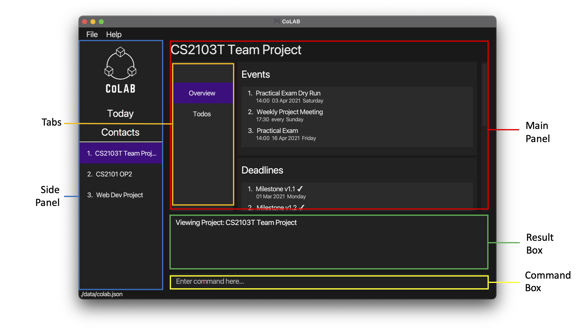
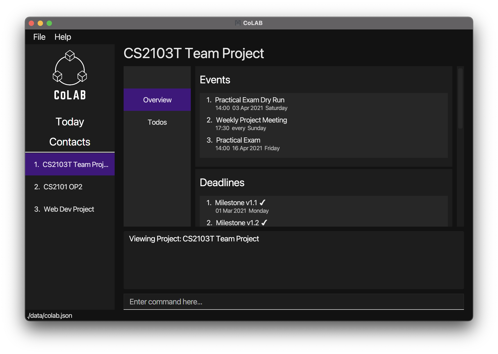
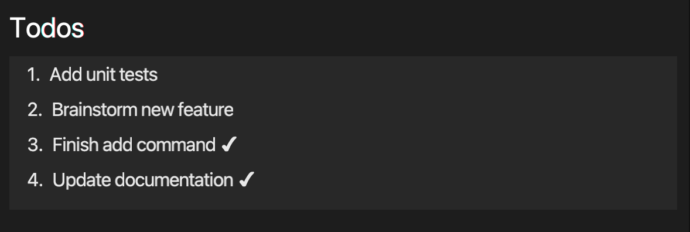
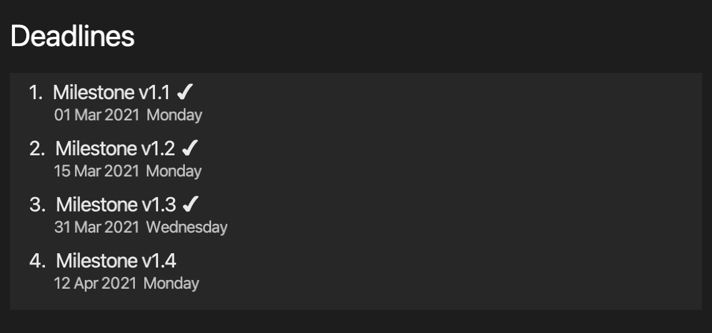
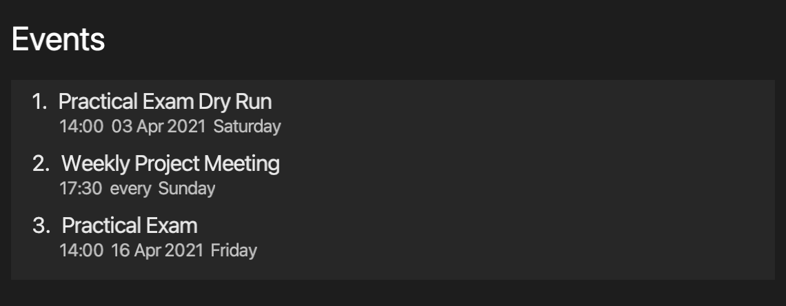
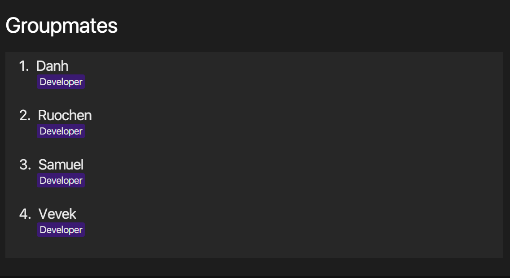
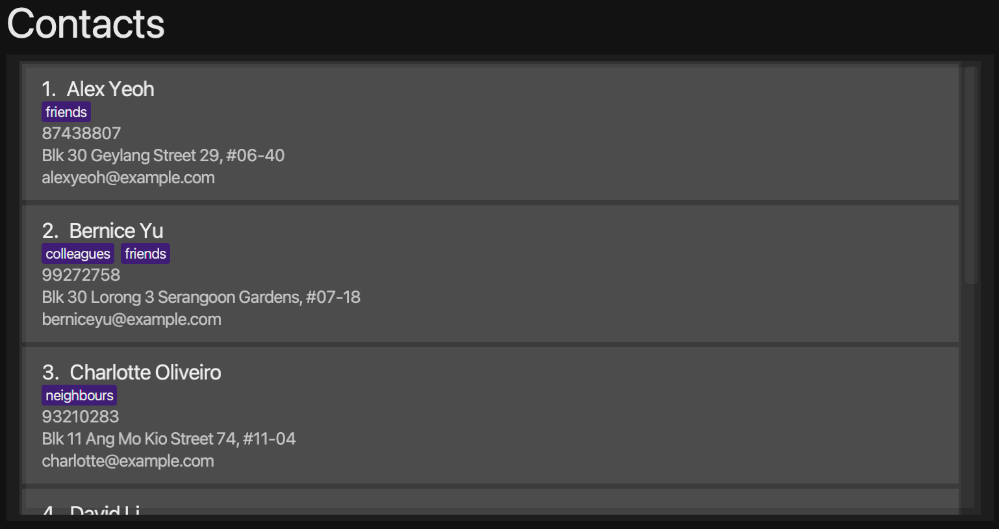
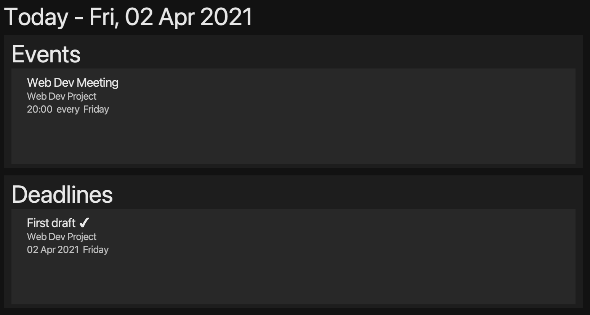

<!-- TOC adapted from
https://github.com/AY2021S1-CS2103T-W16-3/tp/pull/179/commits/aec461182c194c9ca2c67d7c407fcabb376191ff
-->

  * Table of Contents
  {:toc}

## **1. Introduction**

  

Welcome and thank you for downloading **CoLAB**! Are you a university student in search of a reliable app to keep track of your school projects? Do you struggle to keep track of the many tasks and deadlines for various school projects? Do you also tend to forget the various group meetings you have scheduled? You have come to the right place!

CoLAB (Collaboration Lab) is a **desktop app for university students to manage their school projects.**  CoLAB's main features include:

* Project management
* Contact management
* Today View that surfaces an overview of upcoming events and deadlines

With CoLAB, you can efficiently manage all your school projects through our comprehensive project management tools.

We have designed a user-friendly User Interface (UI) that is intuitive to both first-time users and seasoned ones. It is optimized for use via a Command Line Interface (CLI) while still having the benefits of a clean and inviting Graphical User Interface (GUI). If you can type fast, CoLAB can get your project management tasks done faster than traditional GUI apps.

We look forward to seeing what you accomplish with CoLAB. Get your journey started with the [Quick Start section](#3-quick-start)!

--------------------------------------------------------------------------------------------------------------------

## **2. About**

This section serves to familiarise you with the information and terms that would help you make the best use of this user guide.

### **2.1 Structure of This Document**

We have included a large set of features in CoLAB to give you the greatest flexibility over what you can do with it. As such, this User Guide has been structured in a manner that allows you to easily find what you are looking for.

In [Section 2.2: Reading this Document](#22-reading-this-document), you will find useful tips on efficiently reading this document.

In [Section 3: Quick Start](#3-quick-start), you will find a quick start guide to get you started with using CoLAB.

In [Section 4: Features](#4-features), you will find documentation on all of CoLAB's commands and features.

In [Section 5: FAQ](#5-faq), you may find answers to some questions you may have on using CoLAB.

In [Section 6: Command Summary](#6-command-summary), you will find a summary on CoLAB's commands.

You can also easily sift through CoLAB's various commands and features by referring to the Table of Contents at the beginning of this User Guide.

### **2.2 Reading This Document**

This subsection serves to provide explanations on the application's user interface (UI) as well as symbols, syntax and technical terms used throughout this User Guide. Familiarising yourself with this subsection will make the User Guide easier to read.

#### **2.2.1 Special Formats**

Formats discussed in this section may be used in relevant areas of this user guide.

**Tips**

Messages that appear in a tip box are useful for improving your experience with CoLAB.

:bulb: **Tip:**
Example tip!

**Warnings**

Messages that appear in a warning box are important to follow as unintended consequences may follow otherwise.

:exclamation: **Caution:**
Example warning!

**Additional Information**

Messages that appear in an information box are additional information that may be useful to know.

:information_source: **Info:**
Example information!

**Highlights**

Words or sentences that appear in these highlighted boxes are being emphasised for their relevance in that section.

`Example highlight!`

#### **2.2.2 Sections of the Application Window**

Different sections of the application window will be referred to by the names described in the image shown below:

#### **2.2.3 Navigating the UI**

Although most of the buttons you see on the screen are clickable, the UI has been designed primarily to be navigated using the command line interface.

Users can enter commands into the command box and press `ENTER` to execute it. The result box will be updated with information on whether the command has been successfully executed. Depending on the command executed, the main panel may also be updated based on the command executed.

:bulb: **Tip:**
Most commands include all the required information (e.g. project index and deadline index when updating a deadline) needed so that you can run the command from anywhere in the app.

When entering a command, you may find it helpful to see a history of your previous commands. To do so simply press `UP` or `DOWN` while typing to navigate through the command history list.

:information_source: **Info:**
Only successfully executed commands will be saved.

#### **2.2.4 Command Format**

Commands discussed in this user guide follow these rules:

* Words in `UPPER_CASE` are the parameters to be supplied by the user. 
  e.g. in `addC n/NAME`, `NAME` is a parameter which can be used as `addC n/John Doe`.

* Items in square brackets are optional. 
  e.g. `n/NAME [t/TAG]` can be used as `n/John Doe t/friend` or as `n/John Doe`.

* Items with `…`​ after them can be used multiple times including zero times. 
  e.g. `[t/TAG]…​` can be used as ` ` (i.e. 0 times), `t/friend`, `t/friend t/family` etc.

* Parameters can be in any order. This excludes a parameter without a prefix, which must be the first parameter when required. 
  e.g. if the command specifies `n/NAME p/PHONE_NUMBER`, `p/PHONE_NUMBER n/NAME` is also acceptable. 
  e.g. if the command specifies `PROJECT_INDEX i/TODO_INDEX d/DESCRIPTION`, `i/TODO_INDEX d/DESCRIPTION PROJECT_INDEX` is **not**  acceptable as `PROJECT_INDEX` is a parameter without a prefix and should be the first parameter.

:information_source: **Info:**

* If a parameter is expected only once in the command but you specified it multiple times, only the last occurrence of the parameter will be taken. 
  e.g. if you specify `p/12341234 p/56785678`, only `p/56785678` will be taken.

* Commands that do not take in extra parameters (such as `help` and `exit`) will ignore the additional parameters that are appended to it. 
  e.g. if the command specifies `help 123`, it will be interpreted as `help`.

:bulb: **Tip:**
Parameters refer to information that is to be included as an input to a command.

#### **2.2.5 Command Parameters**

This subsection serves to list out the parameters used in this document.

:exclamation: **Caution:**
To achieve the best possible experience, avoid adding excessively long text to CoLAB. At small screen resolutions and with unusually long parameters, text may be truncated to  fit in the main panel. While we do not expect such occurrences to happen in day to day regular use, we have made accommodations for it. To view the rest of the truncated text, simple hover over the relevant section and scroll sideways, either with a trackpad or shift-scroll if you are using a mouse with a scroll wheel.

##### `ADDRESS`

* The address of a contact.
* Addresses can take any values, but it should not be blank.

##### `DATE`

* The date associated with a deadline or event.
* Date can be only be entered in one of these formats:
    * 23-11-2021
    * 23/11/2021
    * 23.11.2021
    * 23112021
* Date should be a valid date (dd/MM/yyyy) where:
    * The Year Field (yyyy) should be a non-negative number between 0000 and 9999.
    * The Month Field (MM) should be a non-negative number between 01 and 12.
    * The Day Field (dd) should be a non-negative number between 00 and 31 (may be less than 31 depending on the number of days in the month).

##### `DESCRIPTION`

* The description of a deadline, event or todo.
* Description can take any values, and it should not be blank.

##### `EMAIL`

* The email address of a contact.
* Emails should be of the format local-part@domain.
* The local-part should only contain alphanumeric characters and these special characters, <code>!#$%&'*+/=?`{|}~^.-</code>.
* This is followed by a '@' and then a domain name.
* The domain name must:
    * be at least 2 characters long
    * start and end with alphanumeric characters
    * consist of alphanumeric characters, a period or a hyphen for the characters in between, if any.

##### `INDEX`

* Indexes are used to identify specific items in CoLAB. There are 6 types of indexes:
    * `CONTACT_INDEX` refers to the number shown beside the contact in the Main Panel when contacts are displayed.
    * `DEADLINE_INDEX` refers to the number shown beside the deadline in the Main Panel when a project is displayed.
    * `EVENT INDEX` refers to the number shown beside the event in the Main Panel when a project is displayed.
    * `GROUPMATE_INDEX` refers to the number shown beside the groupmate in the Main Panel when a project is displayed.
    * `PROJECT_INDEX` refers to the number shown beside the project name in the side panel.
    * `TODO_INDEX` refers to the number shown beside the todo in the Main Panel when a project is displayed.
* Indexes **must be a positive integer** 1, 2, 3, …​

##### `KEYWORD`

* The keyword used to search for contacts.
* `MORE KEYWORDS` also follows this definition.
* Keywords can take any values, but it should not be blank.

##### `NAME`

* The name of a contact/groupmate/project.
* Names should only contain alphanumeric characters and spaces, and it should not be blank.

##### `PHONE_NUMBER`

* The phone number of a contact.
* Phone numbers should only contain numbers, and it should be at least 3 digits long.

##### `REPEAT_WEEKLY`

* Indicates whether the event repeats every week.
* `REPEAT_WEEKLY` must be one of the following values:
    * `Y`
    * `N`
    * `y`
    * `n`
* `Y` or `y` indicates that the event repeats every week.
* `N` or `n` indicates that the event is a one time event.

##### `ROLE`

* The role associated with a groupmate in a project.
* Roles should:
  * Consist of alphanumeric characters, hyphens and underscores.
  * Be at least 2-character long.
  * If there are hyphens or underscores, they should not be at the start or end of the role string

##### `TAG`

* The tag associated with a contact.
* The `TAG` parameter can only be used for contacts. It cannot be used for projects.
* Tags should:
    * Consist of alphanumeric characters, hyphens and underscores.
    * Be at least 2-character long.
    * If there are hyphens or underscores, they should not be at the start or end of the tag string

##### `TIME`

* The time of an event.
* Time can be only be entered in one of these formats:
    * 1730
    * 17:30
* Time should be a valid time (from 0000 to 2359) where:
    * The Hour Field (first 2 digits) should be a non-negative number between 00 and 23 (inclusive).
    * The Minute Field (last 2 digits) should be a non-negative number between 00 and 59 (inclusive).

--------------------------------------------------------------------------------------------------------------------

## **3. Quick Start**

1. Ensure you have Java `11` or above installed in your Computer.

1. Download the latest `CoLAB.jar` from [here](https://github.com/AY2021S2-CS2103T-T11-2/tp/releases).

1. Copy the file to the folder you want to use as the _home folder_ for CoLAB.

1. Double-click the file to start the app. The GUI similar to the below should appear in a few seconds. Note how the app contains some sample data.  

   

1. Type the command in the command box and press Enter to execute it. e.g. typing **`contacts`** and pressing Enter will list all contacts. 
   Some example commands you can try:

    * **`project 1`** : Displays the first project.

    * **`addP`**`n/My Project` : Adds a new project named `My Project` to CoLAB.

    * **`todos`** : Displays the todos of the currently displayed project.

    * **`addT`**`1 d/My Task` : Adds a todo with the description `My Task` to the first project.

    * **`deleteP`**`3` : Deletes the third project in the list.

    * **`exit`** : Exits the app.

6. Refer to the [Features](#4-features) below for details of each command.

:bulb: **Tip:**
When the sample data is no longer required, you may use the `clear` command to clear sample projects and contacts from CoLAB.

--------------------------------------------------------------------------------------------------------------------

## **4. Features**

This section contains documentation on CoLAB's features and commands.

It is split into various subsections:

* [Projects](#41-projects)
    * [Todos](#411-todos)
    * [Deadlines](#412-deadlines)
    * [Events](#413-events)
    * [Groupmates](#414-groupmates)
* [Contacts](#42-contacts)
* [Today View](#43-today-view)
* [Others](#44-others)

### **4.1 Projects**

Each project in CoLAB contains information about todos, deadlines, events and groupmates to help you keep track of everything you need to effectively manage the project.

You may view a list of all your projects in the side panel and view a specific project in the main panel using the `project` command.

:information_source: **Info:**
Project names that are too long may be truncated in the side panel. Simply view the project using the `project` command to view the full name in the main panel.

Each project is divided into an overview page and a todo page. The overview page contains information about your project's events, deadlines and groupmates and the todo page contains information about your project's todos.

:bulb: **Tip:**
To switch between the overview and todo pages, you can use the `overview` and `todo` commands respectively.

Commands related to Projects will be discussed first followed by sections on `Todos`, `Deadlines`, `Events` & `Groupmates`.

##### Viewing a Project: `project`

Displays a panel with details of a specified project.

Format: `project PROJECT_INDEX`

* Displays a panel with details of the project at the specified `PROJECT_INDEX`.

Parameter:

* [`PROJECT_INDEX`](#index) The index of the project.

Example:

* `project 1` displays the first project.

##### Viewing the Overview of a Project: `overview`

Displays a panel containing an overview of the project that is currently displayed.

Format: `overview`

:information_source: **Info:**
This command can only be used when a project is currently being displayed.

##### Viewing the Todos of a Project: `todos`

Displays a panel containing the todos of the project that is currently displayed.

Format: `todos`

:information_source: **Info:**
This command can only be used when a project is currently being displayed.

##### Adding a Project: `addP`

Adds a project to CoLAB.

Format: `addP n/NAME`

* Adds a project to CoLAB with a new `NAME`.

Parameters:

* [`NAME`](#name) The name of the project.

Example:

* `addP n/CS2103T Team Project` adds a project with the name `CS2103T Team Project` to CoLAB.

##### Updating a Project: `updateP`

Updates an existing project in CoLAB.

Format `updateP PROJECT_INDEX n/NAME`

* Updates the name of the project at the specified `PROJECT_INDEX` to the new `NAME`.
* Existing values will be updated to the input values.

Parameters:

* [`PROJECT_INDEX`](#index) The index of the project.
* [`NAME`](#name) The updated name of the project.

Example:

* `updateP 1 n/CS2103 Group Project` updates the name of the first project in CoLAB to `CS2103 Group Project`.

##### Deleting a Project: `deleteP`

Deletes a project from CoLAB.

Format: `deleteP PROJECT_INDEX`

* Deletes the project at the specified `PROJECT_INDEX`.

Parameters:

* [`PROJECT_INDEX`](#index) The index of the project.

Example:

* `deleteP 1` deletes the first project in CoLAB.

#### **4.1.1 Todos**

Todos are used in CoLAB to represent a task that has to be done. These are usually short-term tasks which have to be done in a short timeframe or have no due date.

:information_source: **Info:**
Todos may be known as tasks in other similar applications.

Todos contain a description. They can also be marked as done using the `markT` command. Todos that have been marked as done have a ✔ next to their description.

Todos are sorted alphabetically.

##### Adding a Todo to a Project: `addT`

Adds a todo to a project in CoLAB.

Format: `addT PROJECT_INDEX d/DESCRIPTION`

* Adds a todo with a `DESCRIPTION` to the project at the specified `PROJECT_INDEX`.

Parameters:

* [`PROJECT_INDEX`](#index) The index of the project.
* [`DESCRIPTION`](#description) The description of the todo.

Example:

* `addT 1 d/Add unit tests` adds a todo with the description `Add unit tests` to the first project in CoLAB.

:information_source: **Info:**
You can add a todo to a project containing another todo with the same `DESCRIPTION` as long as the todo in the project has been marked as done.

##### Updating a Todo of a Project: `updateT`

Updates an existing todo of a project in CoLAB.

Format: `updateT PROJECT_INDEX i/TODO_INDEX d/DESCRIPTION`

* Updates the `DESCRIPTION` of the todo at the specified `TODO_INDEX` of the project at the specified `PROJECT_INDEX`.
* Existing values will be updated to the input values.

Parameters:

* [`PROJECT_INDEX`](#index) The index of the project.
* [`TODO_INDEX`](#index) The index of the todo.
* [`DESCRIPTION`](#description) The updated description of the todo.

Example:

* `updateT 1 i/2 d/Review latest PR` updates the description of the second todo of the first project with the new description `Review latest PR`.

##### Marking a Todo as Done: `markT`

Marks a todo as done.

Format: `markT PROJECT_INDEX i/TODO_INDEX`

* Marks the todo at the specified `TODO_INDEX` from the project at the specified `PROJECT_INDEX` as done.

Parameters:

* [`PROJECT_INDEX`](#index) The index of the project.
* [`TODO_INDEX`](#index) The index of the todo.

Example:

* `markT 1 i/1` marks the first todo of the first project as done.

##### Deleting a Todo From a Project: `deleteT`

Deletes a todo from a project in CoLAB.

Format: `deleteT PROJECT_INDEX i/TODO_INDEX`

* Deletes the todo at the specified `TODO_INDEX` from the project at the specified `PROJECT_INDEX`.

Parameters:

* [`PROJECT_INDEX`](#index) The index of the project.
* [`TODO_INDEX`](#index) The index of the todo.

Example:

* `deleteT 1 i/1` deletes the first todo of the first project.

#### **4.1.2 Deadlines**

Deadlines are used in CoLAB to represent project deadlines.

Deadlines contain a description and a date. They can also be marked as done using the `markD` command. Deadlines that have been marked as done have a ✔ next to their description.

Deadlines are sorted in ascending order by date.

##### Adding a Deadline to a Project: `addD`

Adds a deadline to a project in CoLAB.

Format: `addD PROJECT_INDEX d/DESCRIPTION by/DATE`

* Adds a deadline to the project at the specified `PROJECT_INDEX` with a `DESCRIPTION` and a `DATE`.

Parameters:

* [`PROJECT_INDEX`](#index) The index of the project.
* [`DESCRIPTION`](#description) The description of the deadline.
* [`DATE`](#date) The due date of the deadline.

Example:

* `addD 1 d/Milestone v1.2 by/01-03-2021` adds a deadline to the first project with description `Milestone v1.2` and due date `01-03-2021`.

:information_source: **Info:**
You can add a deadline to a project containing another deadline with the same `DESCRIPTION` and `DATE` as long as the deadline in the project has been marked as done.

##### Updating a Deadline of a Project: `updateD`

Updates an existing deadline of a project in CoLAB.

Format: `updateD PROJECT_INDEX i/DEADLINE_INDEX [d/DESCRIPTION] [by/DATE]`

* Updates the `DESCRIPTION` or the due `DATE` of the deadline at the specified `DEADLINE_INDEX` of the project at the specified `PROJECT_INDEX`.
* Existing values will be updated to the input values.

:information_source: **Info:**
At least one of the optional fields must be provided.

Parameters:

* [`PROJECT_INDEX`](#index) The index of the project.
* [`DEADLINE_INDEX`](#index) The index of the deadline.
* [`DESCRIPTION`](#description) The updated description of the deadline.
* [`DATE`](#date) The updated due date of the deadline.

Examples:

* `updateD 1 i/2 d/Finish v1.3 by/02-02-2021` updates the second deadline of the first project with new description `Finish v1.3` and new due date `02-02-2021`.
* `updateD 2 i/1 by/31-03-2021` updates the first deadline of the second project with the new due date `31-03-2021`.

##### Marking a Deadline as Done: `markD`

Marks a deadline as done.

Format: `markD PROJECT_INDEX i/DEADLINE_INDEX`

* Marks the deadline at the specified `DEADLINE_INDEX` from the project at the specified `PROJECT_INDEX` as done.

Parameters:

* [`PROJECT_INDEX`](#index) The index of the project.
* [`DEADLINE_INDEX`](#index) The index of the deadline.

Example:

* `markD` 1 i/1 marks the first deadline of the first project as done.

##### Deleting a Deadline From a Project: `deleteD`

Deletes a deadline from a project in CoLAB.

Format: `deleteD PROJECT_INDEX i/DEADLINE_INDEX`

* Deletes the deadline at the specified `DEADLINE_INDEX` from the project at the specified `PROJECT_INDEX`.

Parameters:

* [`PROJECT_INDEX`](#index) The index of the project.
* [`DEADLINE_INDEX`](#index) The index of the deadline.

Example:

* `deleteD 1 i/1` deletes the first deadline of the first project.

#### **4.1.3 Events**

Events are used in CoLAB to represent project specific events.

Events contain a description, date and a time. Events can be set to either occur once or repeat at the same time every week.

Events are sorted in ascending order by date.

##### Adding an Event to a Project: `addE`

Adds an event to a project in CoLAB.

Format: `addE PROJECT_INDEX d/DESCRIPTION on/DATE at/TIME w/REPEAT_WEEKLY`

* Adds an event to the project at the specified `PROJECT_INDEX` with a `DESCRIPTION` as well as the `DATE` and `TIME` of the event.
* `REPEAT_WEEKLY` accepts values `Y` or `y` if the event repeats weekly and `N` or `n` if the event is a one time event.

Parameters:

* [`PROJECT_INDEX`](#index) The index of the project.
* [`DESCRIPTION`](#description) The description of an event.
* [`DATE`](#date) The date of the event, or the starting date of the event if the event repeats every week.
* [`TIME`](#time) The time of the event.
* [`REPEAT_WEEKLY`](#repeat_weekly) Indicates whether the event repeats every week.

Examples:

* `addE 1 d/Project Meeting on/24-04-2021 at/2000 w/Y` adds a weekly event with description `Project Meeting` starting on `24-04-2021` at `2000` to the first project.
* `addE 2 d/CS2101 Presentation on/14-04-2021 at/1015 w/n` adds a one time event with description `CS2101 Presentation` on `14-04-2021` at `1015` to the second project.

:information_source: **Info:**
You cannot add an event to a project containing another event with the same `DESCRIPTION`, `DATE`, `TIME` and `REPEAT_WEEKLY`.

##### Updating an Event of a Project `updateE`

Updates an existing event of a project in CoLAB.

Format: `updateE PROJECT_INDEX i/EVENT_INDEX [d/DESCRIPTION] [on/DATE] [at/TIME] [w/REPEAT_WEEKLY]`

* Updates the `DESCRIPTION`, `DATE`, `TIME` or `REPEAT_WEEKLY` status of the event at the specified `EVENT_INDEX` of the project at the specified `PROJECT_INDEX`.
* Existing values will be updated to the input values.
* `REPEAT_WEEKLY` accepts values `Y` or `y` if the event repeats weekly and `N` or `n` if the event is a one time event.

:information_source: **Info:**
At least one of the optional fields must be provided.

Parameters:

* [`PROJECT_INDEX`](#index) The index of the project.
* [`EVENT_INDEX`](#index) The index of the event.
* [`DESCRIPTION`](#description) The updated description of the event.
* [`DATE`](#date) The updated date of the event, or the updated starting date of the event if the event repeats every week.
* [`TIME`](#time) The updated time of the event.
* [`REPEAT_WEEKLY`](#repeat_weekly) Indicates whether the event repeats every week.

Examples:

* `updateE 1 i/1 d/Project Meeting on/24-04-2021 w/Y` updates the first event of the first project to be weekly event with new description `Project Meting` starting on `24-04-2021`.
* `updateE 2 i/2 on/14-04-2021 at/1015` updates the second event of the second project to a new date `14-04-2021` at `1015`.

##### Deleting an Event From a Project: `deleteE`

Deletes an event from a project in CoLAB.

Format: `deleteE PROJECT_INDEX i/EVENT_INDEX`

* Deletes the event at the specified `EVENT_INDEX` from the project at the specified `PROJECT_INDEX`.

Parameters:

* [`PROJECT_INDEX`](#index) The index of the project.
* [`EVENT_INDEX`](#index) The index of an event.

Example:

* `deleteE 1 i/1` deletes the first event of the first project.

#### **4.1.4 Groupmates**

Groupmates are used in CoLAB to represent the people you are working with for a particular project.

Groupmates contain a name and zero or more roles. The role serves to indicate their role in the project.

Groupmates are sorted alphabetically by name.

:bulb: **Tip:**
You can use the contacts feature in CoLAB to store more information about a groupmate. Once the contact has been added, you can then easily find the contact by using the `fincC` command to search for their name.

##### Adding a Groupmate to a Project: `addG`

Adds a groupmate to a project in CoLAB.

Format: `addG PROJECT_INDEX n/NAME [r/ROLE]…​`

* Adds a groupmate with a `NAME` and zero or more `ROLE`s to the project at the specified `PROJECT_INDEX`.

Parameters:

* [`PROJECT_INDEX`](#index) The index of the project.
* [`NAME`](#name) The name of the groupmate.
* [`ROLE`](#role) The roles of the groupmate.

:information_source: **Info:**
A groupmate can have any number of roles (including 0).

Examples:

* `addG 1 n/John Doe` adds a groupmate with name `John Doe` to the first project.
* `addG 2 n/Betsy Crowe r/developer` adds a groupmate with name `Betsy Crowe` and role `developer` to the second project.

##### Updating a Groupmate : `updateG`

Updates an existing groupmate of a project in CoLAB.

Format: `updateG PROJECT_INDEX i/GROUPMATE_INDEX [n/NAME] [r/ROLE]…​`

* Updates a groupmate with a new `NAME` or zero or more `ROLE`s at the specified `GROUPMATE_INDEX` of the project at the specified `PROJECT_INDEX`.
* Existing values will be updated to the input values.

:information_source: **Info:**

* At least one of the optional fields must be provided.
* When updating roles, the existing roles of the groupmate will be removed i.e. adding of roles is not cumulative.
* You can remove all the roles of the groupmate by giving **only one** `r/` without specifying any roles after it.

Parameters:

* [`PROJECT_INDEX`](#index) The index of the project.
* [`GROUPMATE_INDEX`](#index) The index of the groupmate.
* [`NAME`](#name) The updated name of the groupmate.
* [`ROLE`](#role) The updated roles of the groupmate.

Examples:

* `updateG 1 i/1 n/Leslie Knope` Updates the name of the first groupmate of the first project with the new name `Leslie Knope`.
* `updateG 2 i/2 n/Betsy Crower r/` Updates the name of the second groupmate of the second project with the new name `Betsy Crower` and clears all existing roles.
* `updateG 2 i/3 n/Betsy Crower r/group-leader r/tester` Updates the name of the third groupmate of the first project to the new name `Betsy Crower` and changes her roles to `group-leader` and `tester`.

##### Deleting a Groupmate From a Project: `deleteG`

Deletes a groupmate from a project in CoLAB.

Format: `deleteG PROJECT_INDEX i/GROUPMATE_INDEX`

* Deletes the groupmate at the specified `GROUPMATE_INDEX` from the project at the specified `PROJECT_INDEX`.

Parameters:

* [`PROJECT_INDEX`](#index) The index of the project.
* [`GROUPMATE_INDEX`](#index) The index of the groupmate.

Example:

* `deleteG 1 i/1` deletes the first groupmate of the first project.

### **4.2 Contacts**

Contact are used in CoLAB to store contact information about a person, to help you keep track of people you contact frequently.

Each contact contains a name, phone_number, email, address and zero or more tags.

##### Viewing All Contacts : `contacts`

Displays a panel with a list of all contacts in CoLAB.

Format: `contacts`

##### Adding a Contact: `addC`

Adds a contact to CoLAB.

Format: `addC n/NAME p/PHONE_NUMBER e/EMAIL a/ADDRESS [t/TAG]…​`

* Adds a contact with the a `NAME`, `PHONE_NUMBER`, `EMAIL`, `ADDRESS` and zero or more `TAG`s to CoLAB.

Parameters:

* [`NAME`](#name) The name of a contact.
* [`PHONE_NUMBER`](#phone_number) The phone number of a contact.
* [`EMAIL`](#email) The email of a contact.
* [`ADDRESS`](#address) The address of a contact.
* [`TAG`](#tag) The tag associated with a contact.

:information_source: **Info:**
A contact can have any number of tags (including 0)

:bulb: **Tip:**
If you do not have information required for a compulsory parameter, consider leaving it as a dummy character such as `-`. For example, if you do not have the address of a contact, you can enter the parameter as `a/-`.

Example:

* `addC n/John Doe p/98765432 e/johnd@example.com a/John street, block 123, #01-01` adds a contact with the name `John Doe`, phone number `98765432`, email `johnd@example.com` and address `John street, block 123, #01-01`.

##### Updating a Contact : `updateC`

Updates an existing contact in CoLAB.

Format: `updateC CONTACT_INDEX [n/NAME] [p/PHONE_NUMBER] [e/EMAIL] [a/ADDRESS] [t/TAG]…​`

* Updates the contact at the specified `CONTACT_INDEX` with a new `NAME`, `PHONE_NUMBER`, `EMAIL`, `ADDRESS` or zero or more `TAG`s.
* Existing values will be updated to the input values.

:information_source: **Info:**
* At least one of the optional fields must be provided.
* When updating tags, the existing tags of the contact will be removed i.e. adding of tags is not cumulative.
* You can remove all the contact’s tags by giving **only one** `t/` without specifying any tags after it.

Parameters:

* [`NAME`](#name) The updated name of the contact.
* [`PHONE_NUMBER`](#phone_number) The updated phone number of the contact.
* [`EMAIL`](#email) The updated email of the contact.
* [`ADDRESS`](#address) The updated address of the contact.
* [`TAG`](#tag) The updated tag of the contact.

Examples:

* `updateC 1 p/91234567 e/johndoe@example.com` updates the first contact with a new phone number `91234567` and email `johndoe@example.com`.
* `updateC 2 n/Betsy Crower t/` updates the second contact with a new name `Betsy Crower` and clears all existing tags.

##### Locating Contacts by Name: `findC`

Find contacts whose names contain any of the given keywords.

Format: `findC KEYWORD [KEYWORD]…​`

* Finds and displays contacts whose name contains any of the `KEYWORD`s.
* At least one keyword must be present.

:information_source: **Info:**
* The search is case-insensitive. e.g. `hans` will match `Hans`
* The order of the keywords does not matter. e.g. `Hans Bo` will match `Bo Hans`
* Only the contact name is searched.
* Only full words will be matched e.g. `Han` will not match `Hans`
* Contacts matching at least one keyword will be returned (i.e. `OR` search). e.g. `Hans Bo` will return `Hans Gruber`, `Bo Yang`

:bulb: **Tip:**
Once the `findC` command is executed, only the relevant contacts will be shown. To view all contacts again, simply enter the `contacts` command or click on the contacts button in the side panel.

Parameter:

* [`KEYWORD`](#keyword) The keyword used to search for contacts.

Example:

* `findC alex david` displays a list containing `Alex Yeoh` and `David Li` 

##### Deleting a Contact : `deleteC`

Deletes a contact from CoLAB.

Format: `deleteC CONTACT_INDEX`

* Deletes the contact at the specified `CONTACT_INDEX`.

Parameter:

* [`CONTACT_INDEX`](#index) The index of the contact.

Examples:

* `deleteC 2` deletes the second contact in CoLAB.
* `findC Betsy` followed by `deleteC 1` deletes the first contact in the results list of the `findC` command.

### **4.3 Today View**

The today view contains a summary of the events and deadlines due today.

:information_source: **Info:**
The today page displays the events and deadlines on the day that you open the today page. To prevent events and deadlines from changing abruptly without notice, the user interface does not update the today page automatically when the date changes.

##### Viewing Today Panel : `today`

Displays a panel containing information on Events & Deadlines that are relevant today.

Format: `today`

### **4.4 Others**

##### Viewing Help : `help`

Displays a panel containing a summary of commands as well as a link to this user guide. The link can be copied to the system clipboard by clicking on the `Copy` button.

Format: `help`

##### Undoing Previous Command : `undo`

Restores CoLAB to the state before the previous undoable command was executed.

Format: `undo`

:information_source: **Info:**
* Only commands that modify data are undoable. These commands include all commands that start with `add`, `update`, `delete` or `mark` as well as the `clear` command.
* All other commands are not undoable.

Example:

* `deleteP 1` Deletes the first project in the list.
* `undo` Reverses the `deleteP 1` command.

##### Redoing Previous Command : `redo`

Reverses the most recent undo command.

Format: `redo`

* Requires an undo command to have been performed prior to a redo command.

##### Exiting the Program : `exit`

Exits the program.

Format: `exit`

##### Clearing All Entries : `clear`

Clears all entries from CoLAB. Both contacts and projects will be cleared.

Format: `clear`

--------------------------------------------------------------------------------------------------------------------

## **5. FAQ**

**Q**: How do I transfer my data to another Computer? 
**A**: Install the app in the other computer and overwrite the empty data file it creates with the file that contains the data of your previous CoLAB home folder.

**Q**: How do I save my data? 
**A**: CoLAB's data is saved in the hard disk automatically after any command that changes the data. There is no need to save manually.

**Q**: Are my contacts and project groupmates linked? 
**A**: No, currently there is no link between contacts and groupmates. This is a feature that we plan to add in future versions of CoLAB. However, you may still add a contact with the contact details of the groupmate. Once the contact has been added, you can then easily find the contact by using the `findC` command to search for their name.

**Q**: Can I edit the data files directly? 
**A**: CoLAB's data is saved as a JSON file `[JAR file location]/data/colab.json`. Advanced users are welcome to update data directly by editing that data file.

:exclamation: **Caution:**
If your changes to the data file makes its format invalid, CoLAB will discard all data and start with an empty data file at the next run.

--------------------------------------------------------------------------------------------------------------------

## **6. Command summary**

### Projects

Action | Format, Examples
--------|------------------
**View Project** | `project PROJECT_INDEX`
**View Overview** | `overview`
**View Todos** | `todos`
**Add Project** | `addP n/NAME`
**Update Project** | `updateP PROJECT_INDEX n/NAME`
**Delete Project** | `deleteP PROJECT_INDEX`

### Todos

Action | Format, Examples
--------|------------------
**Add Todo to Project** | `addT PROJECT_INDEX d/DESCRIPTION`
**Mark Todo as done** | `markT PROJECT_INDEX i/TODO_INDEX`
**Update Todo** | `updateT PROJECT_INDEX i/TODO_INDEX d/DESCRIPTION`
**Delete Todo from Project** | `deleteT PROJECT_INDEX i/TODO_INDEX`

### Deadlines

Action | Format, Examples
--------|------------------
**Add Deadline to Project** | `addD PROJECT_INDEX d/DESCRIPTION by/DATE`
**Mark Deadline as done** | `markD PROJECT_INDEX i/DEADLINE_INDEX`
**Update Deadline** | `updateD PROJECT_INDEX i/DEADLINE_INDEX [d/DESCRIPTION] [by/DATE]`
**Delete Deadline from Project** | `deleteD PROJECT_INDEX i/DEADLINE_INDEX`

### Events

Action | Format, Examples
--------|------------------
**Add Event to Project** | `addE PROJECT_INDEX d/DESCRIPTION on/DATE at/TIME w/REPEAT_WEEKLY`
**Update Event** | `updateE PROJECT_INDEX i/EVENT_INDEX [d/DESCRIPTION] [on/DATE] [at/TIME] [w/REPEAT_WEEKLY]`
**Delete Event from Project** | `deleteE PROJECT_INDEX i/EVENT_INDEX`

### Groupmates

Action | Format, Examples
--------|------------------
**Add Groupmate to Project** | `addG PROJECT_INDEX n/NAME [r/ROLE]…​`
**Update Groupmate** | `updateG PROJECT_INDEX i/GROUPMATE_INDEX [n/NAME] [r/ROLE]…​`
**Delete Groupmate from Project** | `deleteG PROJECT_INDEX i/GROUPMATE_INDEX`

### Contacts

Action | Format, Examples
--------|------------------
**View Contacts** | `contacts`
**Add Contact** | `addC n/NAME p/PHONE_NUMBER e/EMAIL a/ADDRESS [t/TAG]…​`   e.g., `addC n/James Ho p/22224444 e/jamesho@example.com a/123, Clementi Rd, 1234665 t/friend t/colleague`
**Delete Contact** | `deleteC CONTACT_INDEX`  e.g., `deleteC 3`
**Update Contact** | `updateC CONTACT_INDEX [n/NAME] [p/PHONE_NUMBER] [e/EMAIL] [a/ADDRESS] [t/TAG]…​`  e.g.,`updateC 2 n/James Lee e/jameslee@example.com`
**Find Contact** | `findC KEYWORD [KEYWORD]…​`  e.g., `findC James Jake`

### Today View and Other Commands

Action | Format, Examples
--------|------------------
**View Today Panel** | `today`
**Help** | `help`
**Undo previous command** | `undo`
**Redo previous command** | `redo`
**Exiting the Program** | `exit`
**Clear All Entries** | `clear`

--------------------------------------------------------------------------------------------------------------------

## **7. Acknowledgements**

- This project is based on the AddressBook-Level3 project created by the [SE-EDU initiative](https://se-education.org).
- Some code for integrating automated GUI tests was referenced from the AddressBook-Level4 [codebase](https://github.com/se-edu/addressbook-level4).
- Libraries used:
    - [JavaFX](https://openjfx.io/)
    - [Jackson](https://github.com/FasterXML/jackson)
    - [JUnit5](https://github.com/junit-team/junit5)
    - [TestFX](https://github.com/TestFX/TestFX)
