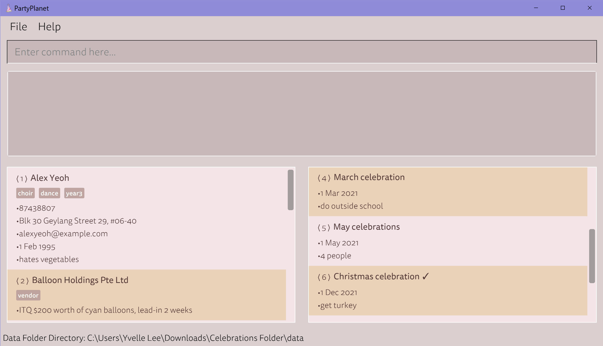
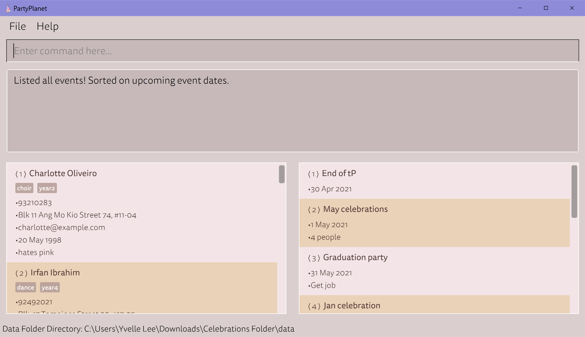

PartyPlanet is a **desktop app for managing birthdays of contacts, optimised for use via a Command Line
Interface** (CLI) while still having the benefits of Graphical User Interface (GUI). If you can type fast,
PartyPlanet can get the planning of your birthday celebrations done faster than traditional GUI apps.

* Table of Contents
{:toc}

--------------------------------------------------------------------------------------------------------------------

## Quick start

1. Ensure you have Java `11` or above installed in your Computer.

2. Download the latest `PartyPlanet.jar` from [here](https://github.com/AY2021S2-CS2103-W16-3/tp/releases).

3. Double-click the file to start the app. 
   

**:warning: PartyPlanet will use its default Address (resp. Event) Book if it is unable to locate the
JSON file for the Address (resp. Event) Book. It will start with an empty Address (resp. Event) Book if there is an error in the JSON file for the Address (resp. Event) Book.**

--------------------------------------------------------------------------------------------------------------------

## Tutorial: Common Workflow for a Welfare IC

Stated below are the steps that a Welfare IC will most likely follow while using PartyPlanet. For visualisation
purposes, these steps are split into a few categories.

#### Adding contacts

1. Add in all members in the CCA to easily track who and when to plan birthday celebrations for. All fields are
   optional except name so that the Welfare IC can decide what information has to be stored and what information is
   not important. For instance, the Welfare IC might want to store the address of a member to hold a surprise party.

2. Add in vendors that are commonly contacted during party planning to allow for ease of reference when planning for
   further parties. All fields are optional except name as it does not make sense for the welfare IC to be forced to
   store information such as Birthdays. This gives the Welfare IC flexibility to decide on what information needs to
   be stored. For instance, the Welfare IC might want to store the email of a catering company, or the address of a bakery for cake pickups.

#### Adding events

3. Add in past events to store for reference when planning future events. As most parties in CCAs are repetitive, it would be
   useful for Welfare ICs to store past events for ease of reference when planning future events that are similar.

4. Add in upcoming events to plan for. Welfare ICs can add in events that are upcoming so that they can be reminded
   to plan for these events. All fields are optional except name so that the Welfare IC can decide what information
   has to be stored for each event.
   For instance, a farewell party for the graduating batch needs to be planned in the next month, but the date is unconfirmed.
   The welfare IC can add this as `eadd -n Party for graduating seniors -r Confirm availability of seniors to fix date`

#### Marking events as done

5. Welfare ICs can mark events as done. They can choose to use this feature in the way they prefer.
   These are 2 possible ways of using this feature:
    * Mark the event as done after the planning is completed
    * Mark the event as done after the event is over

   As such, the Welfare ICs are given the flexibility to decide what way they want to use the feature, and hence the
   event will not automatically be marked as done after the date of the event passes.

This image below is a screenshot of the app displaying contacts of a CCA member and a vendor, and events of different
dates where event 6 is marked as done.

#### Search and Sort through contacts and events

6. Welfare ICs can search and sort people by criteria. This allows them to search for people by name, birthday month
   and tag to allow for ease of searching for specific people even with lots of contacts. The seraching and sorting 
   allows Welfare ICs an easy way of organising the people. For example, they can search for all people with 
   birthdays in the month September `list -b 9` so that they can plan for the parties accordingly.

7. Welfare ICs can search and sort events by criteria. This allows them to search for events by event name and
   remark to allow for ease of searching for specific events even with lots of events. The sorting allows Welfare
   ICs an easy way of organising the events. For example, they can sort by upcoming event dates (according to day,
   month and year) with `elist -s u` so that they can refer and plan for the upcoming parties accordingly.

This image below is a screenshot of the app displaying events sorted by upcoming event dates.

#### Deleting contacts and events

8. Welfare ICs can delete people by the tags they contain (eg. `AY1920`). This can allow for Welfare ICs to stop
   storing information about members who contain that tag (eg. graduated members).

9. Welfare ICs can delete events. This can allow for Welfare ICs to stop storing information about one-off events
   and reduce clutter in the application.

--------------------------------------------------------------------------------------------------------------------

## Glossary of parameters

| Parameter | Prefix | Applicable to | Description |
|---|---|---|---|
| `ADDRESS` | `-a` / `--address` | Contact | Any value |
| `BIRTHDAY` | `-b` / `--birthday` | Contact | Valid date, with or without a year:{::nomarkdown}<ul><li>Year must be a positive integer between 0001 and 9999 if specified, and birthday must be in the past</li><li>If the day is incompatible with the month and year, the closest valid date may be matched e.g. <code>29 Feb 2021</code> is mapped to <code>28 Feb 2021</code></li><li>Accepted date formats are listed below, case-insensitive:<ul><li>ISO format: <code>--01-09</code> / <code>1997-01-09</code></li><li>Dot delimited: <code>9.1</code> / <code>9.1.1997</code></li><li>Slash delimited: <code>9/1</code> / <code>9/1/1997</code></li><li>Long DMY format: <code>9 Jan</code> / <code>9 Jan 1997</code></li><li>Full DMY format: <code>9 January</code> / <code>9 January 1997</code></li><li>Long YMD format: <code>Jan 9</code> / <code>Jan 9 1997</code></li><li>Full YMD format: <code>January 9</code> / <code>January 9 1997</code></li></ul></li></ul>{:/} |
| `BIRTHDAY_MONTH` | `-b` / `--birthday` | Contact | Any of the following: <li>A valid month represented by a string, e.g. `Jan`, `Jun`, `Dec` </li><li>An integer ranging from [0, 12]</li>|
| `COMMAND` | - | - | Any valid command listed [below](#party-planet-commands) |
| `DATE` | `-d` / `--date` | Event | Valid date with a year:{::nomarkdown}<ul><li>Year must be present and a positive integer between 0001 and 9999</li><li>See <code>BIRTHDAY</code> parameter above for available date formats</li></ul>{:/} |
| `EMAIL` | `-e` / `--email` | Contact | In the format `USER@DOMAIN`:{::nomarkdown}<ul><li><code>USER</code> can only contain alphanumerics and any of <code>_!#$%&'*+/=?`{&#124;}~^.-</code></li><li><code>DOMAIN</code> must comprise at least one non-empty label with an optional trailing period.</li><li>A label contains at least one of alphanumerics or underscores, with optional hyphens. Labels cannot start with a hyphen.</li></ul>{:/} |
| `INDEX` | - | any | Positive integer between 0 and 2,147,483,647 inclusive, representing the ID present in the filtered list |
| `NAME` | `-n` / `--name` | any | Any value containing only alphanumerics and spaces, unique to the contact/event list (case-sensitive) and not longer than 25 characters|
| `PHONE` | `-p` / `--phone` | Contact | Any number at least three digits long |
| `REMARK` | `-r` / `--remark` | any | Any value |
| `SORT_FIELD` | `-s` / `--sort` | any | Any valid option, specified below in `list` and `elist` commands |
| `SORT_ORDER` | `-o` / `--order` | any | Any of the following:{::nomarkdown}<ul><li><code>a</code>, <code>asc</code>, <code>ascending</code> (ascending order)</li><li><code>d</code>, <code>desc</code>, <code>descending</code> (descending order)</li></ul>{:/} |
| `TAG` | `-t` / `--tag` | Contact | Any value containing only alphanumeric characters and not longer than 40 characters|

**:information_source: Additional notes on parameter parsing:** 

* Parameters cannot accept specific syntax that denote a valid prefix within the command. 
  e.g. `ADDRESS` fields containing `-a` with leading and trailing spaces (such as in `Blk 123 Yishun -a Singapore 760123`)
  will not parse fully since the `-a` is marked as a separate prefix.

* All parameters will have leading and trailing spaces removed before processing.

* All references to alphanumerics in PartyPlanet specifically refer to ASCII alphanumerics only.
  The character codes are 48-57 (0-9), 65-90 (A-Z), 97-122 (a-z).

--------------------------------------------------------------------------------------------------------------------

## Party Planet Commands

**:information_source: Notes about the command format:** 

* Words in `UPPER_CASE` are the parameters to be supplied by the user. 
  e.g. in `add -n NAME`, `NAME` is a parameter which can be used as `add -n John Doe`.

* Parameters in square brackets are optional. 
  e.g. `-n NAME [-t TAG]` can be used as `-n John Doe -t friend` or as `-n John Doe`.

* Parameters with `...` after them can be used any number of times. 
  e.g. `[-t TAG]...` can be used as ` `, `-t friend`, `-t friend -t family` etc.

* Parameters can be in any order. 
  e.g. if the command specifies `-n NAME -p PHONE`, the alternative `-p PHONE -n NAME` is also acceptable.

* If a prefix is expected only once in the command, but you specified it multiple times, only the last occurrence of the parameter will be taken. 
  e.g. if you specify `-p 12341234 -p 56785678`, only `-p 56785678` will be taken.

* Extraneous parameters for commands that do not take in parameters (such as `exit` and `undo`) will be ignored. 
  e.g. if the command specifies `exit 123`, it will be interpreted as `exit`.

* Parameters in `{}` represents mutually-exclusive parameters. 
  Each mutually-exclusive parameter is separated by a `|`. 
  e.g. `command {foo | bar}` means that either `command foo` or `command bar` are valid commands. 
  However, `command foo bar` is an invalid command.

### Summary

For data specific commands, the unqualified commands operate on the contact list, while
commands prepended with `e` operate on the event list.

| Action | Command |
|---|---|
| Adding new | `add` (contact), `eadd` (event) |
| Edit existing | `edit` (contact), `eedit` (event) |
| Delete existing | `delete` (contact), `edelete` (event) |
| List / Search | `list` (contact), `elist` (event) |
| Mark as done | no contact-equivalent, `edone` (event) |

Other app-wide commands are also available.
These commands do not process any additional parameters, including the single-argument `help` command.

| Action | Command |
|---|---|
| Undo / Redo | `undo`, `redo` |
| Change theme | `theme` |
| Show help | `help` |
| Exit the app | `exit` |

A special command invoked by pressing the <kbd>TAB</kbd> key instead of `Enter` exists for `edit` and `eedit` -  details specified
in the [autocomplete section](https://ay2021s2-cs2103-w16-3.github.io/tp/UserGuide.html#autocomplete-tab)

### Contact list commands

#### Adding contacts : `add`

Adds a person to the contact list.

Format: `add -n NAME [-p PHONE] [-e EMAIL] [-a ADDRESS] [-t TAG]... [-b BIRTHDAY] [-r REMARK]`

Examples:
* `add -n John Doe`
* `add -n James Ho -p 22224444 -e jamesho@example.com -a 123, Clementi Rd, 1234665 -t friend -t colleague -b 1 Jan
  -r allergic to nuts` Adds a new person James Ho with specified details

#### Deleting contacts : `delete`

Deletes person(s) from the contact list.

Format: `delete [{INDEX [INDEX]... | [--any] -t TAG [-t TAG]...}]`
1. If no parameters supplied, `delete`: 
Deletes all contacts in the displayed contact list
2. If indices supplied, `delete INDEX [INDEX]...`: 
Deletes the contacts associated with each specified `INDEX`
   * Invalid indices are ignored.
3. If tags supplied, `delete [--any] -t TAG [-t TAG]...`: 
Delete the contacts containing all specified tags
   * If the `--any` flag is supplied, contacts only need to match with any of the specified tags.
   * Tags specified are case-sensitive.

Examples:
* `delete` deletes all contacts in current filtered list
* `delete 3` deletes contact at the 3rd index
* `delete 3 4 5` deletes contacts at the 3rd, 4th and 5th index
* `delete -t colleague -t cs2103` deletes contacts that contain both tag "colleague" and "cs2103".
* `delete --any -t colleague -t cs2103` deletes contacts with either tag "colleague" or tag "cs2103"

#### Editing contacts : `edit`

Edits an existing person in the contact list.

Format: `edit {INDEX [-n NAME] [-p PHONE] [-e EMAIL] [-a ADDRESS] [-t TAG]... [-b BIRTHDAY] [-r REMARK] | --remove -t TAG [-t TAG]...}`
1. If index supplied, `edit INDEX [-n NAME] [-p PHONE] [-e EMAIL] [-a ADDRESS] [-t TAG]... [-b BIRTHDAY] [-r REMARK]`: 
Edits the person at the specified `INDEX`
   * At least 1 parameter must be supplied.
   * Existing values are replaced by the input values, if specified.
   * To retrieve existing values, use the autocompletion workflow specified [below](#autocomplete-tab).
   * Tags can be removed from a contact by specifying a standalone `-t` without parameters.
2. If `--remove` flag specified, `edit --remove -t TAG [-t TAG]...`: 
Removes all specified tags from every contact in the displayed list
   * All specified tags will be removed from every contact in the displayed list.
   * Tags specified are case-sensitive.

Examples:
* `edit 2 -n James Lee -e jameslee@example.com` Edits the contact name to be "James Lee" and email address to be “jameslee@example.com”.
* `edit 2 -n Betsy Crower -t` Edits the name of the 2nd person to be "Betsy Crower" and clears all existing tags.
* `edit --remove -t friends` Removes the `friends` tag from every contact in the filtered list.

#### Listing contacts : `list`

Displays a list of contacts in the contact list, with optional search criteria.

Format: `list [--exact] [--any] [-n NAME]... [-t TAG]... [-b BIRTHDAY_MONTH]... [-s SORT_FIELD] [-o SORT_ORDER]`
1. If no search parameters specified, `list [-s SORT_FIELD] [-o SORT_ORDER]`: 
List all contacts in contact list
2. If search parameters specified, `list [--exact] [--any] [-n NAME]... [-t TAG]... [-b BIRTHDAY_MONTH]... [-s SORT_FIELD] [-o SORT_ORDER]`: 
List all contacts matching the search criteria

Search criteria, case-insensitive:
* `-n`, `--name` filters the contacts by name
* `-t`, `--tag` filters the contacts by tags
* `-b`, `--birthday` filters contacts by birthday month
  * If `BIRTHDAY_MONTH` is "0" or unspecified, displays filtered contacts without birthday.
  * Otherwise, `BIRTHDAY_MONTH` must be one of the 12 months, represented either by the month value or string,
    i.e. `12`, `Dec`, `December` filters contacts with a birthday in December.

Partial matches to names and tags are performed by default, unless `--exact` is specified for exact matches.
`--exact` requires exact spelling match, but is still case-insensitive. e.g. `alEx yeOh` will match `Alex Yeoh`.

All specified search criteria must be fulfilled by each contact by default, unless `--any` is specified, then at least one of the search criteria need to be fulfilled.

Filtered contacts can be additionally sorted using the `-s` and `-o` prefixes (except upcoming birthdays), as below.

`-s` parameter optionally sorts contacts by `SORT_FIELD`. Possible values of `SORT_FIELD`:
* `n`, `name`: names in (case-insensitive) lexicographical order (by default, if `-s` not specified)
* `b`, `birthday`: day and month of the birthday (Insensitive to year, will not sort by year)
* `u`, `upcoming`: days left to next upcoming birthday (only sorts in `ascending` order regardless of `SORT_ORDER` parameter)

`-o` parameter optionally determines the direction of sort, according to `SORT_ORDER`:
* `a`, `asc`, `ascending`: ascending (by default, if `-o` not specified)
* `d`, `desc`, `descending`: descending

Examples:
* `list` Lists out all the contacts in the contact list.
* `list -s name -o desc` Lists out all the contacts by name in descending lexicographical order.
* `list -t friend` Lists out all contacts who has tags containing the word "friend"
* `list -n alice -t friend` Lists out all contacts whose name contains the word "alice" and tag contains the word
  "friend"
* `list --any -n alice -t friend` Lists out all contacts whose name contains "alice" or tag contains the word
  "friend"
* `list --exact -n alice -t friend` Lists out all contacts whose name is exactly "alice" and who have tags that is
  exactly "friend"
* `list --exact --any -n alice -t friend` Lists out all contacts whose name is "alice" or who have tags that is exactly
  "friend"
* `list --any -n alice -n bob` Lists out all contacts whose name contain either "alice" or "bob"
* `list --any -b 8 -b 9` Lists out all contacts whose birthdays are either in August or September

### Event List Commands

#### Adding events : `eadd`

Adds an event to PartyPlanet's Events list. Similar to `add` for person contacts.

Format: `eadd -n NAME [-d DATE] [-r REMARK]`

* The date must be in a valid date format with year, e.g. 2022-05-07, 2 feb 2021

Examples:
* `eadd -n April Fools -d 2021-04-01 -r Prank the april babies!` Adds a new event April Fools with specified details.

#### Editing events : `eedit`

Edits an existing event in PartyPlanet's Events List. Similar to `edit`.

Format: `eedit INDEX [-n NAME] [-d DATE] [-r REMARK]`

* Edits the event at the specified `INDEX`.
  * The index refers to the index number shown in the displayed events list.
  * At least 1 parameter must be supplied.
* Existing values will be updated to the input values.

Examples:
* `eedit 3 -r Celebrate during first combined practice` Edits the remark of the 3rd event to specified remark.

#### Listing events: `elist`

Shows a list of all events in PartyPlanet's Event List. Similar to `list`.

Format: `elist [--exact] [--any] [-n NAME]... [-r REMARK]... [-s SORT_FIELD] [-o SORT_ORDER]`

1. If no search parameters specified, `elist [-s SORT_FIELD] [-o SORT_ORDER]`: 
List out all events in event list.
2. If search parameters specified, `elist [--exact] [--any] [-n NAME]... [-r REMARK]... [-s SORT_FIELD] [-o
   SORT_ORDER]`: 
List all events matching the search criteria

Search criteria, case-insensitive:
* `-n`, `--name` filters the events by event name
* `-r`, `--remark` filters the events by event remarks
    * Partial matches to event names and remarks are performed by default, e.g. `key` will match `turkey`.
    * If exact match is desired, specify an additional `--exact` flag. `--exact` requires exact spelling match, but is not case-sensitive.
    * All searches are case-insensitive, e.g. `cHriStmAs` will match `Christmas`.
    * If multiple names/tags are specified, all specified search criteria must be fulfilled by each event by
      default, unless `--any` is specified, then at least one search criteria needs to be fulfilled.
    * The filtered events can be additionally sorted using the `-s` and `-o` prefixes, as below.

`-s` parameter optionally sorts events by `SORT_FIELD`. Possible values of `SORT_FIELD`:
* `n`, `name`: names (case-insensitive) in lexicographical order (by default, if `-s` not specified)
* `d`, `date`: event dates (Sensitive to year, will sort according to date with respect to year)
* `u`, `upcoming`: days left to next upcoming event (All overdue events or events marked as `done` will appear at the bottom of the list regardless of the date)

Note: Sorts by upcoming birthday ignores the sort order parameter and only sorts in `ascending` order

`-o` parameter optionally determines the direction of sort, according to `SORT_ORDER`. Possible values of `SORT_ORDER`:
* `a`, `asc`, `ascending`: ascending (by default, if `-o` not specified)
* `d`, `desc`, `descending`: descending

Examples:
* `elist --exact -n Graduation party -r Get job` Lists out all events whose name is exactly "Graduation party" and remark is exactly "Get job"
* `elist --any -n Christmas -r tarts` Lists out all events whose name contains "Christmas" or whose remarks contain "tarts"
* `elist -s date` Lists out all events in chronological order (ascending event date)

#### Marking events as done : `edone`

Marks event(s) in PartyPlanet's Events List as done.

Format: `edone INDEX [INDEX]...`

* `INDEX` must be a positive integer within the number of events in Events List.

Examples:
* `edone 2 3 5` Marks the 2nd, 3rd and 5th events as done.

#### Deleting events : `edelete`

Deletes event(s) from PartyPlanet's Events List. Similar to `delete`.

Format: `edelete [INDEX [INDEX]...]`

* If no parameters `edelete`: 
Deletes all events in the current events list.
* If provided with index(es) `edelete INDEX [INDEX]...`: 
Deletes the event(s) at the specified `INDEX`.
  * All indexes must be a positive integer valid in the list.

Examples:

* `edelete` deletes all events in the current Events List.
* `edelete 1 2 3` deletes events at 1st, 2nd and 3rd indexes.

### General Commands

#### Showing help : `help`

Shows a message explaining a list of available commands.

Format: `help [COMMAND]`
* List all available commands.
* `[COMMAND]` a single parameter requesting help for a specific command's syntax.
* Any additional parameters will be ignored.
* If command is not understood, then all available commands will be listed.

Examples:
* `help` lists all available commands.
* `help list` shows the syntax and description for the `list` command.

#### Autocomplete: <kbd>TAB</kbd>

The Autocomplete feature helps autocomplete when editing a Person or an Event to save the user time from retyping details. Currently, the feature only works for commands `edit` and `eedit`.

Format:

Edit: `edit INDEX [-n NAME] [-p PHONE] [-e EMAIL] [-a ADDRESS] [-t TAG]... [-b BIRTHDAY] [-r REMARK]`<kbd>TAB</kbd>

EEdit: `eedit INDEX [-n NAME] [-d DATE] [-r REMARK]`<kbd>TAB</kbd>

Note: Valid INDEX must be used in order for Autocomplete to function.

Below are the respective behaviors of Autocomplete for various prefixes.

All Prefixes except Tag: For any valid and empty prefix that the user inputs, the relevant details will be autocompleted on <kbd>TAB</kbd> keypress down.

Tags: Due to the plural nature of Tags, the Tag Autocomplete will always add all remaining existing tags belonging to the person.

Below are some examples for example Person 1 with Tags "Hello" and "World".
1. Empty Tag Prefix, e.g. `edit 1 -t`
      * Expected Behavior: Autocompletes all tags from Person 1.
      * Example Output: `edit 1 -t Hello -t World`
2. Tag Prefix(es) containing valid existing Tags, e.g. `edit 1 -t World`
      * Expected Behavior: Autocompletes remaining valid tags from Person 1.
      * Example Output: `edit 1 -t World -t Hello`
3. Tag Prefix(es) that do not currently belong to Person, `edit 1 -t Foo`
      * Expected Behavior: Autocompletes and adds all tags from Person 1.
      * Example Output: `edit 1 -t Foo -t Hello -t World`

Note: Autocompleted Tags will be returned in alphabetical order and is case-sensitive.

#### Undoing actions : `undo`

Undoes the most recent action that changed PartyPlanet's Contact or Event List.

Note: This means that only the commands, `add`, `delete`, `edit`, `eadd`, `edelete`, `eedit`, `edone`, can be undone.

Can be invoked repeatedly until there is no more history from the current session.

Format: `undo`

Shortcuts:
PC: `CTRL + Z`
Mac: `CMD + Z`

#### Redoing actions : `redo`

Redoes the previous action that changed PartyPlanet's Contact or Event List.

Can be invoked repeatedly until there are no more previously executed actions from the current session.

Format: `redo`

Shortcut:
PC: `CTRL + SHIFT + Z` or `CTRL + Y`
Mac: `CMD + SHIFT + Z` or `CMD + Y`

#### Toggle theme : `theme`

Toggles between Dark and Pastel theme

Format: `theme`

#### Leaving app : `exit`

Exits the app.

Format: `exit`

### Other features

#### InputHistory / Keyboard shortcuts :

Retrieves previously entered input.

* Entering new command adds new entry to InputHistory.
* InputHistory will save last 20 inputs.
* Pressing `Up` arrow key in the text input panel reverts to earlier input.
* Pressing `Down` arrow key undoes the history revert.
* At the most recent input, pressing `Down` arrow key once more clears the text box.
* `ESC` key clears the text box.
* `CTRL + Z`(PC) or `CMD + Z` (Mac) key combination undoes the last change to the address or event books.
* `CTRL + SHIFT + Z` or `CTRL + Y` (PC) or `CMD + SHIFT + Z` or `CMD + Y` (Mac) key combinations redo the last undone change to the address or event books.

#### Data path display :

* Displays the absolute path to the folder where the data is stored at the bottom of PartyPlanet.
* Data directory will only be created only upon the first command input. Fresh application start ups will not have the data folder.

**:warning: If length of the path is more than 60 characters, path may be truncated with a trailing `...`.**

### Coming Soon (Additional Features)
* Archiving of Data Files
* Custom fonts
* Even more themes
* Mass Operations (e.g. mass edit)
* Calendar View
* _and much more!_

--------------------------------------------------------------------------------------------------------------------

## FAQ

**Q**: **What is the name of your application?** 
**A**: PartyPlanet

**Q**: **How much does it cost?** 
**A**: Free!

--------------------------------------------------------------------------------------------------------------------

## Command summary

Action | Format, Examples
--------|------------------
**Add** | `add -n NAME [-p PHONE] [-e EMAIL] [-a ADDRESS] [-t TAG]... [-b BIRTHDAY] [-r REMARK]`   e.g. `add -n James Ho -p 96280000 -t friend -t colleague -r allergic to nuts`
**EAdd** | `eadd -n NAME [-d DATE] [-r REMARK]`   e.g. `eadd -n April Fools -d 2021-04-01 -r Prank the april babies!`
**Delete** | `delete [{INDEX [INDEX]... | [--any] -t TAG [-t TAG]...}]`  e.g. `delete`   e.g. `delete 3 4 5`   e.g. `delete -t colleague`
**EDelete** | `edelete [INDEX [INDEX]...]`   e.g. `edelete 1 2 3`
**EDone** | `edone INDEX [INDEX]...`   e.g. `edone 2 3 5`
**Edit** | `edit {INDEX [-n NAME] [-p PHONE] [-e EMAIL] [-a ADDRESS] [-t TAG]... [-b BIRTHDAY] [-r REMARK] | --remove -t TAG [-t TAG]...}`  e.g. `edit 2 -n James Lee -e jameslee@example.com`  e.g. `edit --remove -t colleague`
**EEdit** | `eedit INDEX [-n NAME] [-d DATE] [-r REMARK]`   e.g. `eedit 3 -r Celebrate during first combined practice`
**List** | `list [--exact] [--any] [-n NAME]... [-t TAG]... [-b BIRTHDAY]... [-s SORT_FIELD] [-o SORT_ORDER]`  e.g. `list`  e.g. `list -s date`
**EList** | `elist [--exact] [--any] [-n NAME]... [-r REMARK]... [-s SORT_FIELD] [-o SORT_ORDER]`   e.g. `elist --any -n Christmas -r tarts`
**Undo** | `undo`
**Redo** | `redo`
**Help** | `help [COMMAND]`  e.g. `help`  e.g. `help list`
**Toggle theme** | `theme`
**Exit** | `exit`

--------------------------------------------------------------------------------------------------------------------

**Acknowledgements**

This project is based on the AddressBook-Level3 project created by the [SE-EDU initiative](https://se-education.org).

* Libraries used: [JavaFX](https://openjfx.io/), [Jackson](https://github.com/FasterXML/jackson), [JUnit5](https://github.com/junit-team/junit5)
* Image used: [VectorStock](https://www.vectorstock.com/royalty-free-vector/birthday-hat-cartoon-vector-22619168)
