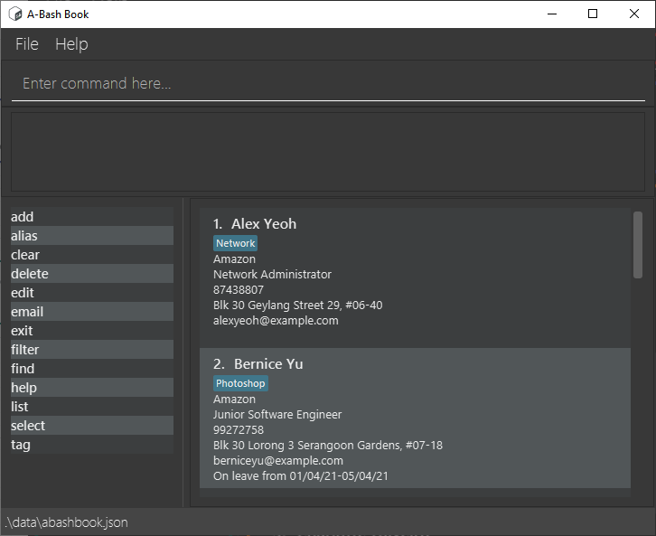
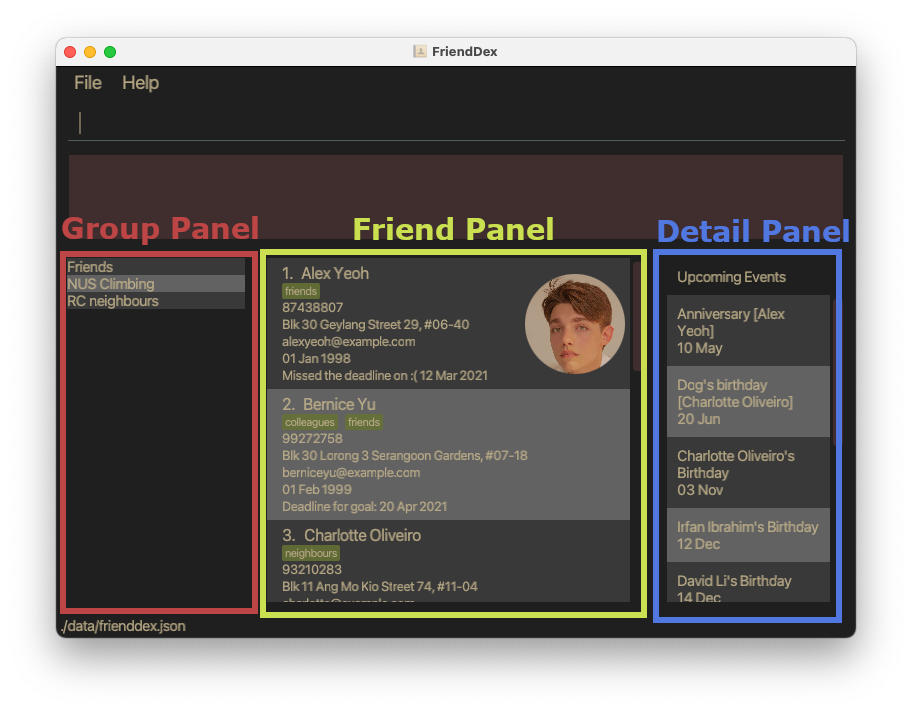
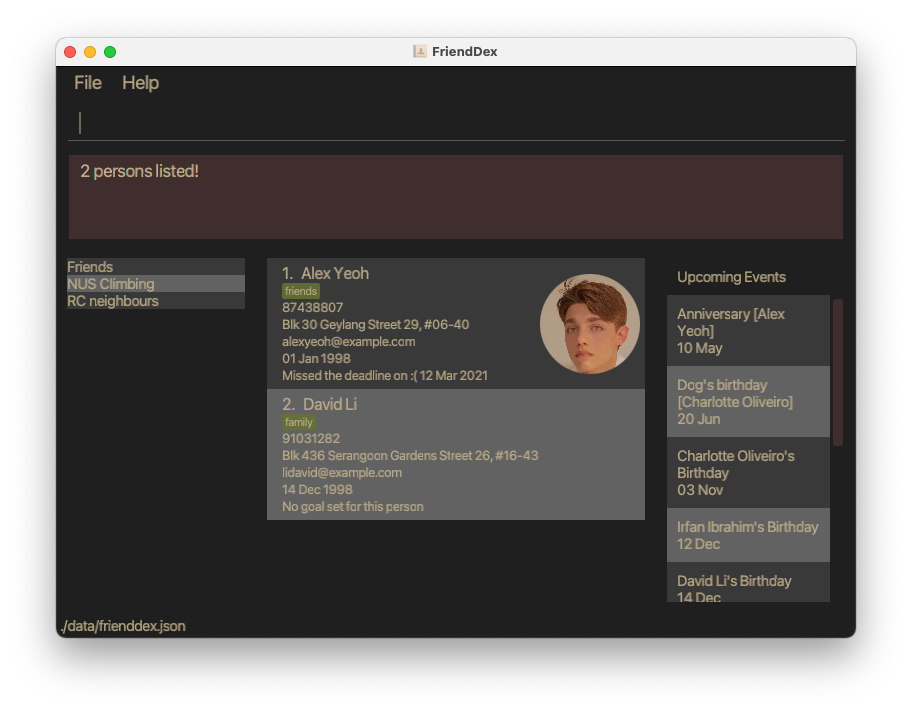
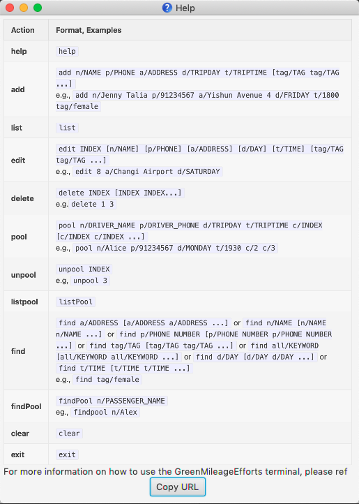

Our world is more connected than ever. There are numerous interactions between multiple people daily in our lives. 
As we move forward towards more of an asynchronous and remote way of living, daily interactions become more transient and harder to remember. 
FriendDex aims to act as a tool to bridge that gap so that interactions become more permanent. FriendDex will empower you to have better relationships with people around you.

Welcome to the FriendDex User Guide. FriendDex, a portmanteau of Friend and Pokedex, is a relationship management tool, catered to those who would like to maintain their personal relationships without compromising on other aspects of their life. 
A good example is students who are struggling to do well in both their studies and social life. Managing your relationships should not be any more tedious than doing your laundry.

FriendDex uses a command line interface; this means that you type commands to interact with the application. 

To help you get started, you should read the [Installation](#installation) and [Quick start](#quick-start) section first.

* Table of Contents
{:toc}

--------------------------------------------------------------------------------------------------------------------
## About
This document can be thought of as a manual and a reference guide for FriendDex. It will guide you on how to use FriendDex and will provide complete information on each available command.
Furthermore, the guide gives information on the User Interface (UI) and the other useful features of FriendDex. Each section of the guide can be read independently. 
You can view the full list of content using the Table of Contents above. You can also use your document viewer’s Find function to quickly navigate to the content you want to know more about. 

It is generally advised for new users to at least read through the [Quick Start](#quick-start) section to familiarise themselves with FriendDex.

Note the following symbols and formatting used in this document:

`list n/Close Friends` <br>
The grey highlight, also called a mark-up, indicates that the text in it can be typed into the command line and executed by the application.  

<div markdown="block" class="alert alert-info">

:information_source: **Notes:**<br>

* This block is used for detailing information about formatting, handling exceptional cases or special keywords used in the corresponding section.
</div>

<div markdown="span" class="alert alert-primary">
:bulb: **Tip:**
This block is used to provide you extra details about the feature that will enable you to use it more effectively.
</div>

<div markdown="span" class="alert alert-warning">
:exclamation: **Caution:** This block is used to point out any dangerous actions that may result in the loss of data or the app crashing.
</div>

--------------------------------------------------------------------------------------------------------------------

## Installation

1. Ensure you have Java `11` or above installed in your Computer. Your Computer's operating system (OS) needs to be Windows, macOS or Linux, and the OS version you are using should still be supported by the respective companies.
   For more detailed Java installation instructions, please click [here](https://docs.oracle.com/en/java/javase/11/install/preface.html#).

2. Download the latest `frienddex.jar` from [here](https://github.com/AY2021S2-CS2103T-W14-1/tp/releases).

3. Copy the file to the folder you want to use as the _home folder_ for FriendDex.

4. Double-click the file to start the app. The GUI similar to the below should appear in a few seconds. Note how the app contains some sample data. Once the GUI finishes loading, you are ready to start using FriendDex.<br>
   
   
5. You can move on to the [Quick Start](#quick-start) section to learn about the common operations for FriendDex.

--------------------------------------------------------------------------------------------------------------------

## Quick start

1. Once FriendDex is installed, you first want to begin by populating it with your friends’ information. You might notice that FriendDex comes with some sample data. You may remove this sample data using the `clear` command.

2. To add a person to the FriendDex, you may use the `add` command followed by their relevant details. 
   For example, here’s how you can add a friend, John Doe with the following particulars:

   Friend Detail  | Value
   ---------------|------------------
   Phone number | 98765432
   E-mail | johnd@example.com 
   Address | John street, block 123, #01-01
   Birthday | 19th January 1998
   
   Type the full `add` command into the command bar to execute it
    * `add n/John Doe p/98765432 e/johnd@example.com a/John street, block 123, #01-01 b/19-01-1998`
<br/><br/>

3. If you made a mistake while adding a person, you can easily amend it with the `edit` command. 
    For example, changing the phone number of John Doe to ‘87654321’. Assuming John is the first person in the list of friends on the screen, you may use the `edit` command as follows,
    * `edit 1 p/87654321`
<br/><br/>    

4. Now that you have populated the app, you are ready to explore the various relationship management features that FriendDex has to offer. Here are some things you can try:
    * `set-goal` : Set a goal for how often you would like to meet a friend
    * `add-meeting` : Record details about a meeting you’ve had with a friend
    * `add-group` : Categorise and group your friends on the app (e.g. RC neighbours, CCA mates)
    * `add-date` : Record special dates for a friend (e.g. Anniversary)
<br/><br/>
    
5. FriendDex comes with a built-in autocomplete feature, so there's no need to memorise any of the commands. If you need help with the commands, a thorough documentation for each command is provided in this user guide, complete with usage instructions and examples.

--------------------------------------------------------------------------------------------------------------------

## UI 



### Group Panel
The left panel of FriendDex shows the list of groups that are available in the application.

To list the friends within a specific group, use `list n/GROUP_NAME`. See [List Command](#listing-all-persons--list) for specific details.

### Friend Panel
The centre panel shows the currently listed friends in the application.
Commands such as `list`, `find`, `add`, `clear`, `delete` will change the listed friends. 
See [Features](#features) for specific details. 

### Details Panel
The right panel of FriendDex is a multi-purpose details panel. It displays upcoming events by default, and can be toggled to display different information. 
The available dashboards are detailed below.

#### Upcoming Events
By default, FriendDex displays your upcoming events on the details panel, such as upcoming birthdays and special dates.

#### Streaks Dashboard
The Streaks dashboard shows how consistent you stick to your goal of meeting your friends up till the current day.    

#### Full Details of a Person
As a person in the FriendDex can contain a lot of information, not all of it is displayed in the main list of persons.
Upon execution of the `details` command, FriendDex will display the full details of the specified person on the details panel.

--------------------------------------------------------------------------------------------------------------------

## Autocomplete

There is no need to remember commands as FriendDex will suggest them to you as you type. To use a suggested command, press up/down to the desired command and hit enter.
The suggested command will be automatically typed into the command bar.

--------------------------------------------------------------------------------------------------------------------

## Features

<div markdown="block" class="alert alert-info">

**:information_source: Notes about the command format:**<br>

* Words in `UPPER_CASE` are the parameters to be supplied by the user.<br>
  e.g. in `add n/NAME`, `NAME` is a parameter which can be used as `add n/John Doe`.

* Items in square brackets are optional.<br>
  e.g. `n/NAME [t/TAG]` can be used as `n/John Doe t/friend` or as `n/John Doe`.

* Items with `…`​ after them can be used multiple times including zero times.<br>
  e.g. `[t/TAG]…​` can be used as ` ` (i.e. 0 times), `t/friend`, `t/friend t/family` etc.<br>
  e.g. `p/ INDEX…​` must have at least one `INDEX`, `p/1`, `p/1 2` etc.

* Parameters can be in any order.<br>
  e.g. if the command specifies `n/NAME p/PHONE_NUMBER`, `p/PHONE_NUMBER n/NAME` is also acceptable.

* If a parameter is expected only once in the command, but you specified it multiple times, only the last occurrence of the parameter will be taken.<br>
  e.g. if you specify `p/12341234 p/56785678`, only `p/56785678` will be taken.

* Extraneous parameters for commands that do not take in parameters (such as `help`, `exit` and `clear`) will be ignored.<br>
  e.g. if the command specifies `help 123`, it will be interpreted as `help`.
  
* The `INDEX` parameter in a command will refer to the index number shown in the currently displayed person list. The index **must be a positive integer** 1, 2, 3, ...​
  e.g. `edit 2 n/Gregory` will change the name of the 2nd person on the displayed person list to Gregory. 

</div>

### Adding a person : `add`

Adds a person to FriendDex.

Format: `add n/NAME p/PHONE_NUMBER e/EMAIL a/ADDRESS b/BIRTHDAY [t/TAG]…​`

<div markdown="span" class="alert alert-primary">:bulb: **Tip:**
You can provide any number of tags (including 0)
</div>

Examples:
* `add n/John Doe p/98765432 e/johnd@example.com a/John street, block 123, #01-01 b/19-01-1998`
* `add n/Betsy Crowe t/friend e/betsycrowe@example.com b/19-03-1998 a/Newgate Prison p/1234567 t/criminal`

### Adding a special date : `add-date`

Adds a special date for an existing person in FriendDex.

Format: `add-date INDEX d/DATE desc/DESCRIPTION`

* Adds a special date with the person at the specified `INDEX`.

<div markdown="block" class="alert alert-info">
:information_source: **Notes: Special dates**<br>

* A special date is a date that repeats annually, e.g. Anniversaries.
</div>

Examples:
* `add-date 1 d/16-02-2021 desc/Anniversary`
* `add-date 2 d/17-02-2021 desc/Dog's birthday`

### Adding debt : `add-debt`

Adds a specified amount to the debt owed to the friend at the specified `INDEX`.

Format: `add-debt INDEX DEBT_AMOUNT`

<div markdown="block" class="alert alert-info">

:information_source: **Notes: Add Debt Command**<br>

* `DEBT_AMOUNT` provided should be a **positive number** of up to 2 decimal places
  e.g `10.10` or `10.1000` and **not** `10.103`.
</div>

Examples:
* `add-debt 1 100` adds 100 to the debt owed to the 1st listed friend.

### Adding a friend group : `add-group`

Creates a new friend group to FriendDex with a specified name and adds all the people at the specified
indexes to the group.

Format: `add-group n/GROUP_NAME p/INDEX…​`

* You should provide at least one index.
* If the group name you provided already exists, the friends at the specified `INDEX…​` will be added to the group.
* If some friends specified already exist in the group, they will be ignored.

Examples:
* `add-group n/Close Friends  p/1 2 3 4 5`

### Adding a meeting : `add-meeting`

Records a meeting with an existing person in FriendDex.

Format: `add-meeting INDEX d/DATE t/TIME desc/DESCRIPTION`

* Records a meeting with the person at the specified `INDEX`.

Examples:
* `meeting 1 d/16-02-2021 t/1130 desc/We had lunch together!`
* `meeting 2 d/17-02-2021 t/1930 desc/We went to see the sunset!`

### Adding a profile picture : `add-picture`

Adds a profile picture to an existing person in FriendDex.

Format: `add-picture INDEX FILE_PATH`

* The image of the friend should be at the `FILE_PATH` you provided.

Examples:
* `add-picture 1 /Users/john/Desktop/jake.png`

<div markdown="span" class="alert alert-warning">:exclamation: **Caution:**
To edit your profile picture, edit the original image and use the `add-picture` command again.
Editing of pictures directly from the `/data` folder is not supported.
</div>

### Clearing all entries : `clear`

Clears all entries from FriendDex.

Format: `clear`

### Deleting a person : `delete`

Deletes the specified person from FriendDex.

Format: `delete INDEX`

* Deletes the person at the specified `INDEX`.

Examples:
* `list` followed by `delete 2` deletes the 2nd person in FriendDex.
* `find Betsy` followed by `delete 1` deletes the 1st person in the results of the `find` command.

### Deleting a special date : `del-date`

Deletes a special date from an existing person in FriendDex.

Format: `del-date INDEX i/DATE_INDEX`

* Deletes a special date with the person at the specified `INDEX`.

Examples:
* `del-date 1 i/2` deletes the 2nd special date from the 1st listed friend.

### Deleting a friend group: `del-group`

Deletes a friend group from FriendDex with the specified name.

Format: `del-group n/GROUP_NAME`

* The group name provided should already exist in FriendDex.

Examples:
* `del-group n/Close Friends`

### Deleting a meeting: `del-meeting`

Deletes a meeting from an existing person in FriendDex.

Format: `del-meeting INDEX i/MEETING_INDEX`

* Deletes a meeting with the person at the specified `INDEX`.

Examples:
* `del-meeting 1 i/3` deletes the 3rd meeting from the 1st person in FriendDex.

### Deleting a profile picture: `del-picture`

Deletes a profile picture from an existing person in FriendDex.

Format: `del-picture INDEX`

* The person selected should already have a profile picture.

### Viewing full details : `details`

Displays the full details of the specified person from FriendDex.

Format: `details INDEX`

* Displays the full details of the person at the specified `INDEX`.

Examples:
* `list` followed by `details 2` displays the details of the 2nd person in FriendDex.
* `find Betsy` followed by `details 1` displays the details of the 1st person in the results of the `find` command.

### Editing a person : `edit`

Edits an existing person in FriendDex.

Format: `edit INDEX [n/NAME] [p/PHONE] [e/EMAIL] [a/ADDRESS] [b/DATETIME] [t/TAG]…​`

* Edits the person at the specified `INDEX`.
* At least one of the optional fields must be provided.
* Existing values will be updated to the input values.
* When editing tags, the existing tags of the person will be removed i.e. adding of tags is not cumulative.
* You can remove all the person’s tags by typing `t/` without
  specifying any tags after it.

Examples:
*  `edit 1 p/91234567 e/johndoe@example.com` Edits the phone number and email address of the 1st person to be `91234567` and `johndoe@example.com` respectively.
*  `edit 2 n/Betsy Crower t/` Edits the name of the 2nd person to be `Betsy Crower` and clears all existing tags.

### Exiting the program : `exit`

Exits the program.

Format: `exit`

### Locating persons by name : `find`

Finds persons whose names contain any of the given keywords.

Format: `find KEYWORD [MORE_KEYWORDS] [p/]`

<div markdown="block" class="alert alert-info">

:information_source: **Notes: Find Command**<br>

* The search is case-insensitive. e.g. `hans` will match `Hans`
* The order of the keywords does not matter. e.g. `Hans Bo` will match `Bo Hans`
* Only the name is searched.
* Only full words will be matched e.g. `Han` will not match `Hans`
* Persons matching at least one keyword will be returned (i.e. `OR` search).
  e.g. `Hans Bo` will return `Hans Gruber`, `Bo Yang`
* If the `p/` flag is set, then the argument(s) `KEYWORD [MORE KEYWORDS]` will be treated as a
  [regular expression](https://pubs.opengroup.org/onlinepubs/7908799/xbd/re.html).
</div>

Examples:
* `find John` returns `john` and `John Doe`
* `find alex david` returns `Alex Yeoh`, `David Li`<br>
  
* `find ^a.*h$ p/` returns contacts with names that starts with `a` and ends with `h`: `Alex Yeoh`

Note that the [Java regex engine](https://docs.oracle.com/javase/7/docs/api/java/util/regex/Pattern.html) conforms to PERL5 regex specification and thus PERL5 regex should be used.

### Viewing help : `help`

Shows a message explaining how to access the help page.



Format: `help`

### Listing all persons : `list`

Shows a list of all persons in FriendDex.

<div markdown="span" class="alert alert-primary">:bulb: **Tip:**
You can optionally provide a group name to list all friends in that group.
</div>

Format: `list [n/GROUP_NAME]`

Example:
* `list n/Primary School` to list persons in the `Primary School` group
* `list` to list all persons in FriendDex

### Setting meeting goal: `set-goal`

Format: `set-goal INDEX f/FREQUENCY`

* Sets a goal to achieve an ideal frequency for meeting a contact
* FriendDex will give reminders based on the frequency specified and the latest meeting the user had with that person.
* Accepts the following as FREQUENCY: weekly (`w`, `week`, `weekly`), monthly (`m`, `month`, `monthly`), yearly (`y`, `year`, `yearly`), and none (`n`, `none`).

Example:
* `set-goal 1 f/w`, `set-goal 1 f/week` and `set-goal 1 f/weekly` will do the same thing by setting the goal to meet the person at index 1 every week.
* `set-goal 1 f/n` and `set-goal 1 f/none` will remove the goal set with the person at the specified index. 

### Subtracting debt: `subtract-debt`

Subtracts a specified amount to the debt owed to the friend at the specified `INDEX`.

<div markdown="block" class="alert alert-info">

:information_source: **Notes: Subtract Debt Command**<br>

* `DEBT_AMOUNT` provided should be a **positive number** of up to 2 decimal places,
  e.g `10.10` or `10.1000` and **not** `10.103`.
</div>

Format: `subtract-debt INDEX DEBT_AMOUNT`

Examples:
`subtract-debt 1 100` subtracts 100 to the debt owed to the 1st listed friend.

### Styling the application : `theme`

Applies a colorscheme to the application based on the supplied theme.

Format `theme THEME`

* Applies the theme specified by the argument `THEME`.
* FriendDex is shipped with the following preinstalled themes:
  * `monokai`
  * `sweetlove`
  * `pulp`
  * `paraiso-light`
* To apply a preinstalled theme, prepend it with an `@`.
* Applied themes will persist for subsequent sessions. 

<div markdown="span" class="alert alert-primary">
:bulb: **Tip:**
You can also define your own theme. Find out more [here](#defining-your-own-theme). To apply a custom theme, 
pass the file path to the custom theme as the `THEME` parameter.     
</div>

Example:
* `theme @monokai` applies the `monokai` theme to the application.
* `theme /Users/john/Desktop/themes/solarized.dark.json` applies the custom theme found at the given file path to the application.

See also:
* [Defining your own Theme](#defining-your-own-theme)

### Viewing different details panel: `view`

Select a details panel to display. Available panels:
* Upcoming Events (`upcoming events`)
* Streaks (`streaks`)

Format: `view (upcoming events | streaks)`

Example:
* `view streaks` will switch the details panel to show the Streaks dashboard.

--------------------------------------------------------------------------------------------------------------------

## Data Storage
### Saving the data

FriendDex data is saved in the hard disk automatically after any command that changes the data. There is no need to save manually.

### Editing the data file

FriendDex data is saved as a JSON file at `[JAR file location]/data/frienddex.json`. 
Gui-related settings such as theme preference are saved in the same directory under `preferences.json`.
Advanced users are welcome to update the data directly by making edits to these files.

<div markdown="span" class="alert alert-warning">:exclamation: **Caution:**
If your changes to the data file makes its format invalid, FriendDex will discard all data and start with an empty data file at the next run.
</div>

## Defining your own theme

FriendDex allows advanced users to customize and apply their own theme. This can be done by supplying the path to a `json` file specifying the theme.

### Theme format

A valid theme is a JSON object containing the following fields:

| Name         | Type         | Description                                                                                                                                                             |
|--------------|--------------|-------------------------------------------------------------------------------------------------------------------------------------------------------------------------|
| `foreground` | `String`     | The foreground color of the application in valid hex color string                                                                                                       |
| `background` | `String`     | The background color of the application in valid hex color string                                                                                                       |
| `color`      | `String[16]` | Colors 0 to 15 of the application in valid hex color strings. Refer to [XTerm colors](https://invisible-island.net/xterm/manpage/xterm.html#h3-VT100-Widget-Resources). |

A sample theme (Monokai Dark)
```
{
  "color": [
    "#272822", "#f92672", "#a6e22e", "#f4bf75",
    "#66d9ef", "#ae81ff", "#a1efe4", "#f8f8f2",
    "#75715e", "#f92672", "#a6e22e", "#f4bf75",
    "#66d9ef", "#ae81ff", "#a1efe4", "#f9f8f5"
  ],
  "foreground": "#f8f8f2",
  "background": "#272822"
}
```

### Applying the theme

Instead of providing a preinstalled `THEME` as an argument, simply supply the file path instead.

Example:
* `theme sample-theme.json` applies the theme defined in the file `sample-theme.json`.

<div markdown="span" class="alert alert-warning">:exclamation: **Caution:**
If the previous theme file supplied is not found or unreadable, then the default theme will be applied.
</div>

--------------------------------------------------------------------------------------------------------------------

## FAQ

**Q**: How do I transfer my data to another Computer?<br>
**A**: Install the app in the other computer and overwrite the files it creates with the files in your previous FriendDex home folder.

**Q**: Where can I find more themes?<br>
**A**: Certain online tools such as [terminal.sexy](https://terminal.sexy) can be used to generate the required `json` file.

--------------------------------------------------------------------------------------------------------------------

## Troubleshooting Instructions

If FriendDex is unresponsive, you can force quit the application through your OS’s task manager and restart it. The data saved from the last operation will automatically be loaded back into the app. 
If FriendDex is still not working, you can reinstall the app by deleting `friendDex.jar` from the _home folder_ of FriendDex and redownloading the latest version [here](https://github.com/AY2021S2-CS2103T-W14-1/tp/releases).

--------------------------------------------------------------------------------------------------------------------

## Where to get additional help

If you are still facing an issue that is not addressed in the guide, you submit it issue on Github page [here](https://github.com/AY2021S2-CS2103T-W14-1/tp/issues).

--------------------------------------------------------------------------------------------------------------------

## Command summary

Action | Format, Examples
--------|------------------
**Add** | `add n/NAME p/PHONE_NUMBER e/EMAIL a/ADDRESS [b/BIRTHDAY] [t/TAG]…​`<br> e.g. `add n/James Ho p/22224444 e/jamesho@example.com a/123, Clementi Rd, 1234665 t/friend t/colleague`
**Add Date** | `add-date INDEX d/DATE desc/DESCRIPTION`<br> e.g. `add-date 1 d/16-02-2021 desc/Anniversary`
**Add Debt** | `add-debt INDEX DEBT_AMOUNT`<br> e.g. `add-debt 1 100`
**Add Group** | `add-group n/GROUP_NAME p/[INDEX...]`<br> e.g. `add-group n/Close Friends p/1 2 3 4`
**Add Meeting** | `add-meeting INDEX d/DATE t/TIME desc/DESCRIPTION`<br> e.g. `add-meeting 2 d/17-02-2021 t/1930 desc/We went to see the sunset!`
**Add Picture** | `add-picture INDEX FILE_PATH`<br> e.g. `picture 1 /Users/john/Desktop/jake.png`
**Clear** | `clear`
**Delete** | `delete INDEX`<br> e.g. `delete 3`
**Delete Date** | `del-date INDEX i/DATE_INDEX`<br> e.g. `del-date 1 i/1`
**Delete Group** | `del-group n/GROUP_NAME` <br> e.g. `del-group n/Close Friends`
**Delete Meeting** | `del-meeting INDEX i/MEETING_INDEX`<br> e.g. `del-meeting 1 i/2`
**Delete Picture** | `del-picture INDEX` <br> e.g. `del-picture 1`
**Details** | `details INDEX`<br> e.g. `details 1`
**Edit** | `edit INDEX [n/NAME] [p/PHONE_NUMBER] [e/EMAIL] [a/ADDRESS] [b/BIRTHDAY] [t/TAG]…​`<br> e.g.`edit 2 n/James Lee e/jameslee@example.com`
**Exit** | `exit`
**Find** | `find KEYWORD [MORE_KEYWORDS]`<br> e.g. `find James Jake`
**Help** | `help`
**List** | `list [n/GROUP_NAME]` <br> e.g. `list` or `list n/Close Friends`
**Set Goal** | `set-goal INDEX f/FREQUENCY` <br> e.g. `set-goal 1 f/w`
**Subtract Debt** | `subtract-debt INDEX DEBT_AMOUNT`<br> e.g. `subtract-debt 1 100`
**Theme** | `theme THEME`<br> e.g. `theme @monokai`
**View** | `view (upcoming events | streaks)` <br> e.g.`view streaks`
