* Table of Contents
{:toc}

# Overview

Welcome to the Pawbook User Guide!
In this section, you will be given a brief overview of what Pawbook is all about and what you can takeaway from this user guide. We will show you how to use Pawbook from a user's perspective.

This user guide contains (but not limited to) a [quick start guide](#quick-start), a [features walkthrough](#commands) and a [command summary table](#command-summary) for easy reference. In each feature or functionality, we further provide command formats and command examples to ensure that you can become proficient in using Pawbook.

## Introduction

Managing a business is definitely not easy, so imagine if your business involves taking care of countless energetic furpals. That's right! We are talking about the job of dog school managers.

As dog schools and dog day cares rise in popularity due to the hectic work life of dog owners, the operations of dog schools can quickly get out of hand. But no worries, we have Pawbook to save the day!

With Pawbook, you can add and delete owner and dog profiles alike, to easily keep track of dogs and their respective owners. Pawbook also allows the managing of the various canine-training programs to cater to your furry customers. We understand that as a successful business you have many programs running in the school everyday, Pawbook helps to condense your hectic schedule for you. With the ability viewing your schedule, you are able to better plan for the day ahead.

Pawbook is a desktop application for dog school managers to facilitate their bookkeeping of puppies and dogs in the school, optimized for input via a **Command Line Interface (CLI)** which caters to fast-typers who prefer to use a keyboard. You can navigate the application with ease and execute instructions by typing text-based commands in the command box provided without ever having to reach for your mouse!

Pawbook also has the benefits of a **Graphical User Interface (GUI)** to provide you with a visually appealing view, thus bringing you the best user experience to complement.

## Purpose

The aim of this user guide is to help novice familiarise themselves with Pawbook. It also aids more experienced users by providing a detailed explanation on the different features and components of Pawbook. This allows old and new users alike to easily learn and use the various features and functionalities provided by Pawbook.

# About the User Guide

In this section, we will teach you everything you need to know to effectively use this user guide.

## Contributors

This user guide is created by **CS2103T-T10-Group1**.
* Charles Lee Lin Ta
* John Alec Mendoza Branzuela
* Kou Yong Kang
* Lam Xuan Yi, Shaelyn
* Wei Yutong
* Zhang Anli

## Navigating the User Guide

This user guide provides you with all the information you need to utilize Pawbook. We understand the pains of using a Command Line Interface (CLI) program and have bested our efforts into ensuring a very readable guide on how to use our program.

If you need help setting up Pawbook, you can go to the _[Quick Start](#quick-start)_ section.

If you want to find out more about Pawbook's features and commands, you can go to the _[Commands](#commands)_ section.

If you need an overview regarding the usage of Pawbook's commands, head on to the _[Command Summary](#command-summary)_ section.

Here are some important syntax to take note of to facilitate your reading before continuing.

| **Symbol/Format** | **Meaning** |
| :------------------:|:-------------|
| <kbd>Enter</kbd> | Indicates the enter button on the user's keyboard |
| `Markdown` | Example of what to type in the command textbox |
| **Bold** | Note-worthy keywords |
| :bulb: | Indicates an important note that will enhance your user experience |
| :heavy_exclamation_mark: | Indicates something that the user should take caution of |

## Syntax Format

Syntax | Meaning | Example | Explanation
--------|------------------|----------|---------
`lower_case/` |  Prefix | `n/`, `p/`, `t/` | To be placed right before the actual parameter value, order does not matter.
normal font | Command keyword | `schedule` | -
CAPS_WITH_UNDERSCORE | Compulsory parameter | `delete dog DOG_ID` | `delete dog` are the command keywords, while DOG_ID is compulsory and any valid dog ID can be provided.
[SQUARE BRACKETS] | Optional parameter | [t/TAG] | When adding a dog for example, the tags to be added are optional.
Ellipsis | Repeatable parameters | [t/TAG]... | When adding a dog for example, multiple tags can be supplied and all will be recognized, unlike non-repeatable parameters which only the last occurrence of the paramter will be recognized. 

## GUI Layout

In this section, you will be introduced to the layout of Pawbook's Graphical User Interface (GUI). This will help you better understand what each component that you observe on-screen represents.

There are a total of two views that you can navigate to when using Pawbook:

* [Main Page View](#main-page-view)
* [Help Page View](#help-page-view)

### Main Page View

You will be directed to the main page view upon launching Pawbook. On this page, you will first see the list of dogs that are currently stored in Pawbook.

Here is how the main page view looks like on launch:


Component | Purpose
--------|-----------------
**Menu Bar** | A menu bar that allows users to click on shortcuts
**Main Display** | The main display that shows the results of each command
**Response Display** | A display that shows the response message from Pawbook after a command has been executed
**Card Component** | Each card component represents one entity profile (i.e. Dog, Owner, Program)
**Command Box** | A text field for the user to enter his/her command

### Help Page View

The help page view provides a short summary list of commands that you can use, as well as a link to this user guide.

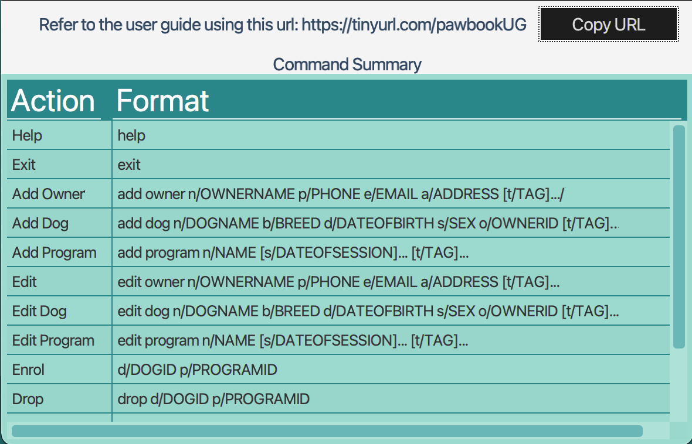

----

# Quick Start

If this is your first time using Pawbook, follow these simple steps to jump straight into the action:

1. Ensure you have **Java 11 or above** installed in your computer.
2. Download the **latest** pawbook.jar [here](https://github.com/AY2021S2-CS2103T-T10-1/tp/releases).
3. Copy the _pawbook.jar_ file to the folder you wish to use as the root directory for Pawbook (other configuration and data files will be stored in the same directory or subdirectories).
4. Double-click the file to start the app. The GUI should appear shortly.
5. Congratulations, you have successfully launched Pawbook! For new users, type `help` in the command box to launch the [help page view](#help-page-view).
6. Type the command in the command box and press <kbd>Enter</kbd> to execute it. e.g. typing `add` and pressing <kbd>Enter</kbd> will allow you to start adding information into Pawbook.

<div markdown="span" class="alert alert-info">
:bulb: Please refer to the features below for details of each command.

:heavy_exclamation_mark: Ensure that the <kbd>data/pawbook.json</kbd> file is not corrupted or edited wrongly. If any part of the file is invalid or corrupted, Pawbook will not be able to restore the data from the previous session and will start fresh, writing over the same file when saving!
</div>

----

# Commands

In this section, you will learn about the commands available in Pawbook and how to use them.

### Add Command: Create a dog/owner/program

**Function**: Creates an entry for an entity (dog/owner/program) and adds to Pawbook.<br>
**Use case**: When you want to create a new entry for a new customer or program, this is the right command! For instance, when a new dog arrives at the school with its owner, you will first need to add the owner followed by the dog.

Format:

```
add dog n/DOG_NAME b/BREED d/DATE_OF_BIRTH s/SEX o/OWNER_ID [t/TAG]...
add owner n/OWNER_NAME p/PHONE_NUMBER e/EMAIL a/ADDRESS [t/TAG]...
add program n/PROGRAM_NAME [s/SESSION_TIME]... [t/TAG]...
```

Note:

- Different prefixes should be used for the respective entities to specify details.
- Names are allowed to contain basic Latin letters, numerics, hyphens, commas, periods and apostrophes. This is catered for cases when a program name contains numbers and in some cases, even dog names and owner names. Extra punctuation are subjected to common usages.
- Pawbook support arbitrary length phone numbers. This is to support phone numbers with differing lengths from different regions.
- Tags are optional and multiple tags can be added.
- Tags are only able to take in one alphanumeric string. To write tags with multiple words, consider using camelCase for combining multiple words.
- Date format used is <kbd>dd-MM-yyyy</kbd>, time format is <kbd>HH:mm</kbd>. For date and time of sessions, it will need therefore need to follow <kbd>dd-MM-yyyy HH:mm</kbd>.<br>

Date time part| Code | Valid values
--------------|------|-------------
Date of month | <kbd>dd</kbd> | 01~31
Month | <kbd>MM</kbd> | 01~12
Year | <kbd>yyyy</kbd> | 0000~9999
Hours | <kbd>HH</kbd> | 00~23
Minutes | <kbd>mm</kbd> | 00~59

Examples:

1. Adds an owner named John with the details provided in Pawbook.<br>
   Command: `add owner n/John Doe p/98765432 e/johnd@example.com a/311, Clementi Ave 2, #02-25 t/friends t/owesMoney`

2. Adds a dog named BRUCE belonging to owner with ID 1 in Pawbook.<br>
   Command: `add dog n/Bruce b/Chihuahua d/12-02-2019 s/Male o/1 t/playful t/active`

3. Creates a program with program name Obedience Training.<br>
   Command: `add program n/Obedience Training s/02-02-2020 18:00 t/puppies`

<div markdown="span" class="alert alert-info">
:bulb: Address fields are free from input checking to allow flexibility to users from different countries with different address formats.
</div>

To add a dog called Oreo, with breed Jack Russell Terrier, date of birth 20 August 2020, sex female, belonging to the owner with ID 1, tags shy and docile,
type `add dog n/Oreo b/Jack Russell Terrier d/2-02-2020 s/Female o/1 t/shy t/docile` into the commmand box. 


If successfully added, Pawbook will display a success message as shown here.


### Delete Command: Remove a dog/owner/program

**Function**: Remove the entry for an entity (dog/owner/program) from Pawbook.<br>
**Use case**: When you want to delete an entity, you can simply use the delete command and delete the entity that you want using their ID number. For instance, when a dog is no longer under your care, you can delete the dog's profile using this command.

Format:

```
delete dog DOG_ID
delete owner OWNER_ID
delete program PROGRAM_ID
```

Note:

- The ID must be a positive integer 1, 2, 3 etc.

Examples:

1. Deletes the owner with ID 1 in Pawbook.<br>
   Command: `delete owner 1`

2. Deletes the dog with ID 2 in Pawbook.<br>
   Command: `delete dog 2`

3. Deletes the program with ID 3 in Pawbook.<br>
   Command: `delete program 3`

<div markdown="span" class="alert alert-info">
:heavy_exclamation_mark: Take note that deleting an owner will automatically delete all the dogs that belong to that owner as well. We do not allow dogs in Pawbook to not have an owner!

:heavy_exclamation_mark: Requiring the type of entity you are deleting to be specified helps ensure that you do not accidentally delete the wrong entity and lose important customer data!

:bulb: Deleting using ID instead of name? Yes, all commands other than `add` and `find` uses the entity's ID. When a new entity is added to Pawbook, the system assigns an unique ID to each of them.
</div>

The ID for all entities is displayed in the first line beside its name.


To delete dog 3 from Pawbook, type `delete dog 3` into the command box.
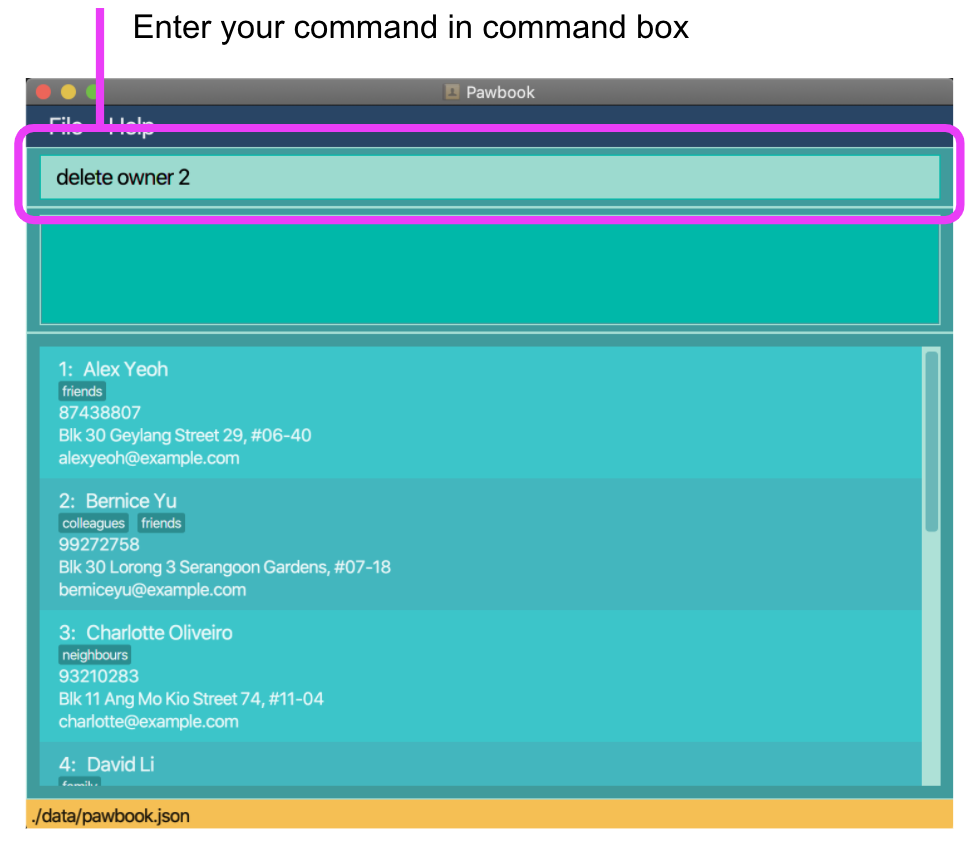 

If successfully deleted, Pawbook will display a success message as shown here.
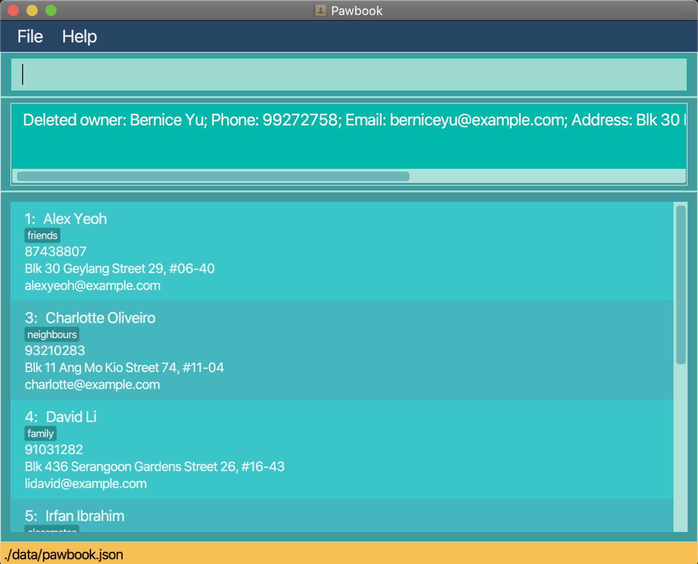

### Edit Command: Modify the details of a dog/owner/program

**Function**: Edits a dog/owner/program from Pawbook.<br>
**Use case**: This command allows you to edit the attributes of the entity (dog/owner/program) in your Pawbook. Let's say you just added an entry for a dog but you realized that you filled in one of the owner particulars wrongly. The edit command allows you to quickly correct that mistake. More details about each of the editable attributes can be found _[here](#add-command-create-a-dogownerprogram)_.

Format:

```
edit dog DOG_ID [n/DOG_NAME] [b/BREED] [d/DATE_OF_BIRTH] [s/SEX] [o/OWNER_ID] [t/TAG]...
edit owner OWNER_ID [n/OWNER_NAME] [p/PHONE] [e/EMAIL] [a/ADDRESS] [t/TAG]...
edit program PROGRAM_ID [n/PROGRAM_NAME] [s/SESSION_TIME]... [t/TAG]...
```

Note:

- The ID must be a positive integer 1, 2, 3 etc.
- Only include the attributes that need to be edited after the integer
- Multiple attributes can be edited at once

Examples:

1. Edits the owner with ID 1 in Pawbook.<br>
   Command: `edit owner 1 p/12345678`

2. Edits the dog with ID 2 in Pawbook.<br>
   Command: `edit dog 2 n/Bruce t/playful`

3. Edits the program with ID 3 in Pawbook.<br>
   Command: `edit program 3 t/learn`

<div markdown="span" class="alert alert-info">
:bulb: Tags are only able to take in one alphanumeric string!

:heavy_exclamation_mark: Take note that editing sessions for programs and tags for any entity will automatically override **all** its current sessions/tags! To clear all sessions/tags, use "s/" and "t/" respectively without any values.

:heavy_exclamation_mark: At least one attribute needs to be modified!
</div>

To edit the phone number of owner with ID 1 to 91234567, type `owner ID p/91234567` into the command box.
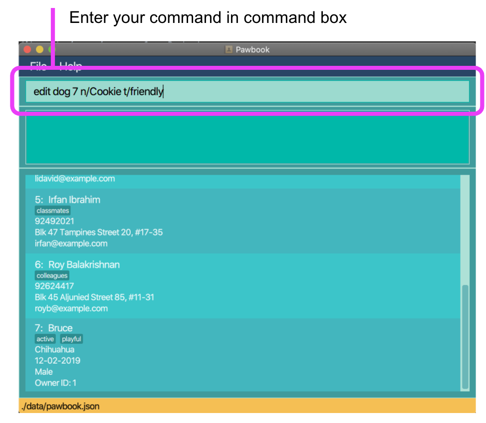

If successfully edited, Pawbook will display a success message as shown here.
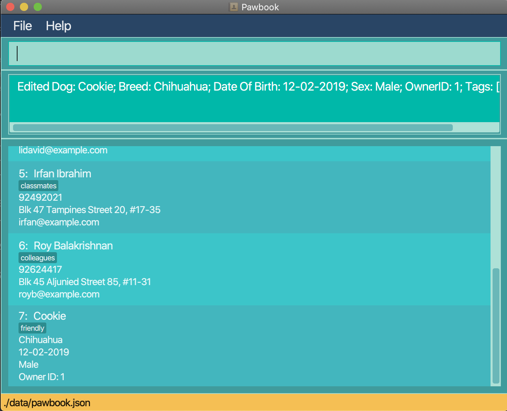

### Enrol Command: Let a dog join a program

**Function**: Enrol a specified dog to a specified program that the dog was previously not enrolled in. Batch enrolment is also supported, which means that multiple dogs can be enrolled into the same program, or one dog can be enrolled into multiple programs.<br>
**Use case**: When you want to enrol a dog into a specific program, you can use this command. One instance is when after a new dog Bruce has just joined the school and is applying for Obedience Training. You can then enrol Bruce into the Obedience Training program after you have added Bruce into the system.

Format:

```
enrol d/DOG_ID [d/DOG_ID]... p/PROGRAM_ID (enrolling multiple dogs into one program)
enrol d/DOG_ID p/PROGRAM_ID [p/PROGRAM_ID]... (enrolling one dog into multiple programs)
```

Note:

- The dogs and programs IDs must all be valid.
- Dog must not be enrolled in the program.

Examples:

1. Enrol dog with ID 2 into program with ID 3.<br>
   Command: `enrol d/2 p/3`

2. Enrol dogs with ID 2 and 3 into program with ID 4.<br>
   Command: `enrol d/2 d/3 p/4`

3. Enrol dog with ID 2 into programs with ID 3 and ID 4.<br>
   Command: `enrol d/2 p/3 p/4`

<div markdown="span" class="alert alert-info">
:bulb: Even for batch enrolment, the dog must not be enrolled in any of the programs, or all dogs must not be enrolled in that program, in order for the command to work.

:heavy_exclamation_mark: Take note that enrolling multiple dogs into multiple programs at once is **NOT** allowed as it is error-prone.
For example, `enrol d/2 d/3 p/4 p/5` is **NOT** allowed!
</div>

To enrol dog 4 into program 13, type `enrol d/4 p/13` into the command box.
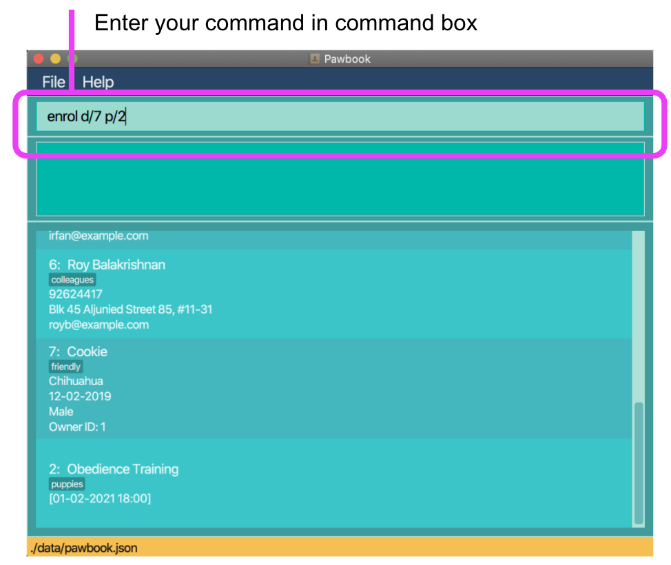

Upon successful enrollment, Pawbook will display a success message as shown here.
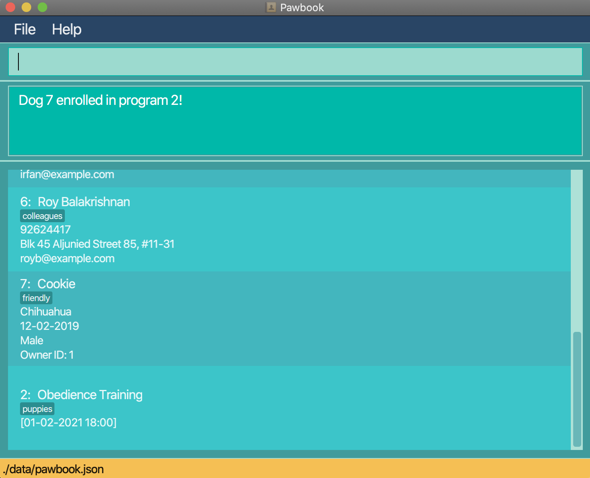

### Drop Command: Remove dogs from enrolled programs

**Function**: Removes a specified dog from a specified program that the dog was previously enrolled in. Batch removal is supported, which means that multiple dogs can be removed from the same program, or a single dog can be removed from multiple programs.<br>
**Use case**: After a dog has finished a program or has dropped out of the program, you can remove him from the program using this command.

Format:

```
drop d/DOG_ID [d/DOG_ID]... p/PROGRAM_ID (removing multiple dogs from one program)
drop d/DOG_ID p/PROGRAM_ID [p/PROGRAM_ID]... (removing one dog from multiple programs)
```

Note:

- The dogs and programs IDs must all be valid.
- Dog must be enrolled in the program.

Examples:

1. Remove dog with ID 2 from program with ID 3.<br>
   Command: `drop d/2 p/3`

2. Drop dogs with ID 2 and 3 from program with ID 4.<br>
   Command: `drop d/2 d/3 p/4`

3. Drop dog with ID 2 from programs with ID 3 and 4.<br>
   Command: `drop d/2 p/3 p/4`

<div markdown="span" class="alert alert-info">
:bulb: Even for batch removal, the dog must be enrolled in all of the programs, or all dogs must be enrolled in that program for the command to work.

:heavy_exclamation_mark: Take note that removing multiple dogs from multiple programs at once is **NOT** allowed! For example, `drop d/2 d/3 p/4 p/5` is **NOT** allowed!
</div>

To drop dog 4 from program 13, type `drop d/4 p/13` into the command box.
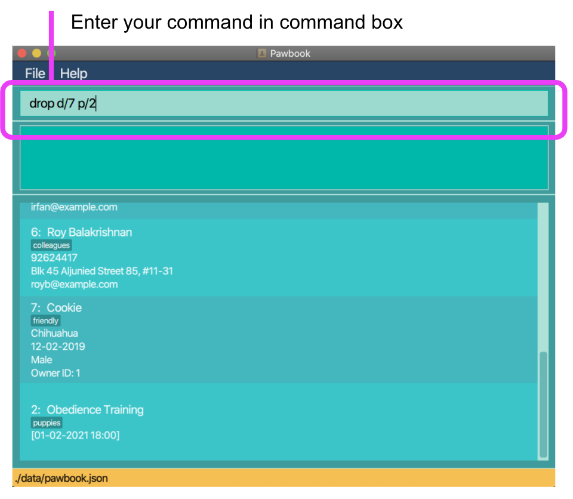

Upon successful dropping, Pawbook will display a success message as shown here.
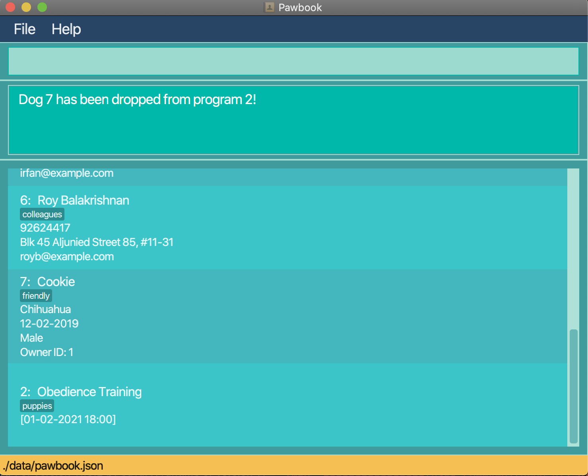

### Schedule Command: See all your programs at a glance

**Function**: Display all programs happenings on the current day or any specified date.<br>
**Use case**: As a busy dog school manager, this allows you to view at one glance what are the programs that are lined up on any given day.

Format:

```
schedule [DATE]
```

Note:

- Date has to be specified in the `dd-MM-yyyy` format, details are explained [here](#add-command-create-a-dogownerprogram).
- If no date is provided, the schedule command will display all programs occurring on the current day.

Examples:

1. Display the schedule for today:
   Command: `schedule`
2. Display the schedule for 1st April 2021:
   Command: `schedule 01-04-2021`
   
To view the schedule for 01-02-2021, type `schedule 01-02-2021` into the command box.


If there is a schedule to be viewed, Pawbook will display a success message as shown here.


### List Command: Switch to viewing a particular type of entity

**Function**: Display entities filtered by type.<br>
**Use case**: To see the three different types of entities (dog/owner/program), you can use this command. Let's say you want to see all the dogs that you are in-charge of. Simply type `list dog` and all the dogs in Pawbook will be displayed.

Format:

```
list dog
list owner
list program
```

Note:

- On Pawbook's startup, all dogs are listed.

Examples:

1. List all dogs.<br>
   Command: `list dog`
2. List all owners.<br>
   Command: `list owner`
3. List all programs.<br>
   Command: `list program`

To view all the programs in Pawbook, type `list program` into the command box.
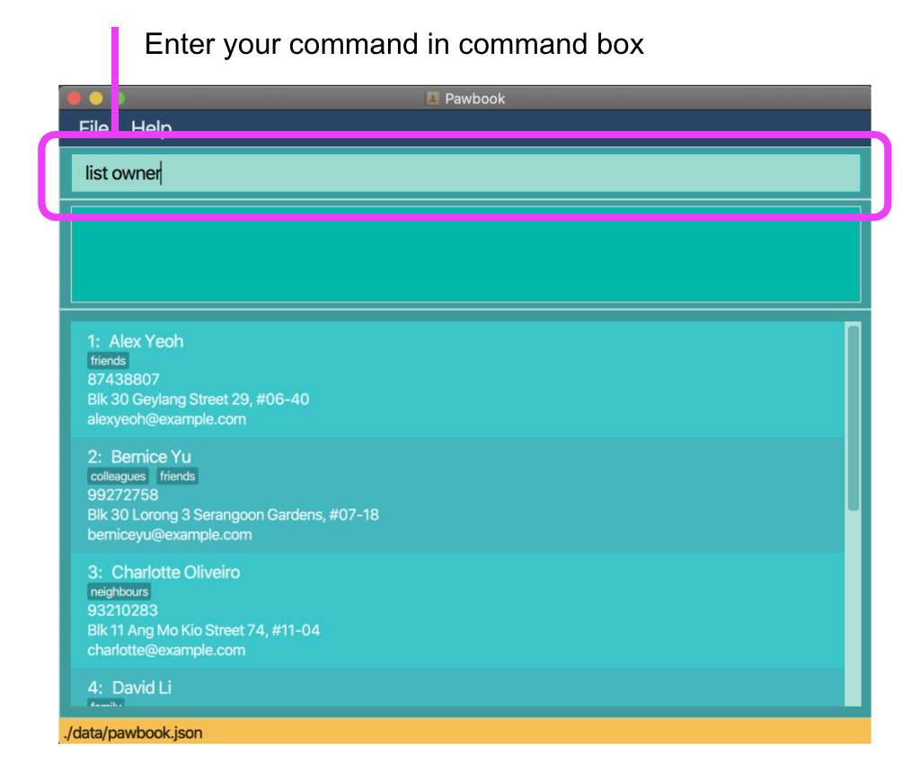

If there are programs to be viewed, Pawbook will display a success message as shown here.


### Find Command: Search for entities by name

**Function**: Shows the list of entities with names that contain the keywords supplied.<br>
**Use case**: When you forgot the ID of an entity (dog/owner/program) and want to find it by their name. You can also find multiple entities by providing multiple keywords. This may be helpful when you want to see just one specific entity profile.

Format:

```
find KEYWORD [MORE_KEYWORDS]...
```

Note:

- As long as a name contains one of the keyword, the corresponding entity will show up in the results.

Examples:

1. Find all entities with the name "Alice".<br>
   Command: `find alice`

2. Find all entities with the name "Alice", "Bob" or "Charlie".<br>
   Command: `find alice bob charlie`

<div markdown="span" class="alert alert-info">
:bulb: `find` is able to take in multiple keywords and return all results as long as the name contains any one of the keywords.
</div>

To find entities containing `Berry` and `Training`, type `find berry training` into the command box.
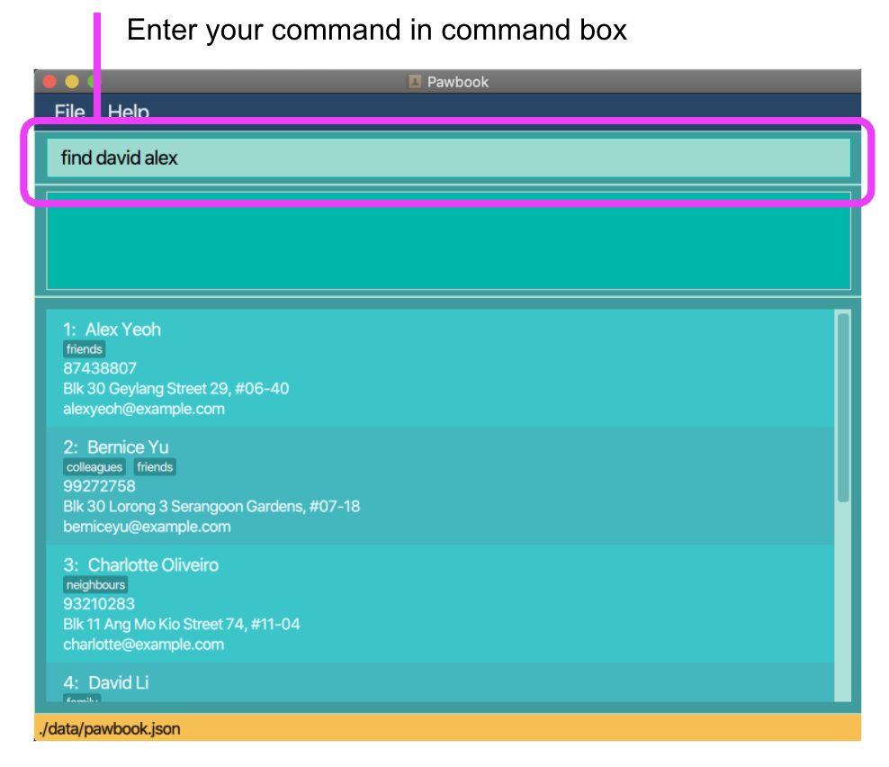

If there are entities to be viewed, Pawbook will display a success message as shown here.
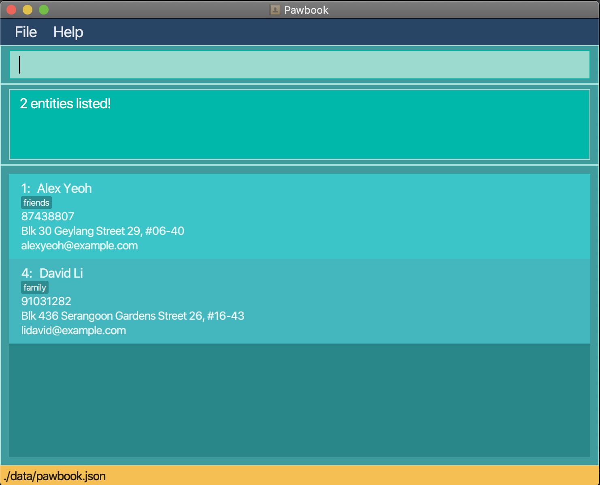

### View Command: See a particular entity alongside related entities

**Function**: Views the entity with the given ID together with all entities related to the specified entity.<br>
**Use case**: When you want to have a more detailed view of a particular entity (dog/owner/program), you can use this command to see more details. The first entry at the top will be the profile of the entity you want to view. This is followed by the all its related entities. For instance, when you view Bruce the dog, you will first see the his profile, followed by his owner's profile and finally all the programs that Bruce is enrolled in.

Format:

```
view ENTITY_ID
```

Examples:

1. View ID 1 which belongs to an owner, the owner and all his dogs will be displayed.<br>
   Command: `view 1`

2. View ID 2 which belongs to a dog, the dog and its owner will be displayed, followed by the programs that the dog is enrolled in.<br>
   Command: `view 2`

3. View ID 3 which belongs to a program, the program and all the enrolled dogs will be displayed.<br>
   Command: `view 3`

To view all entities related to entity with ID 4, type `view 4` into the command box.
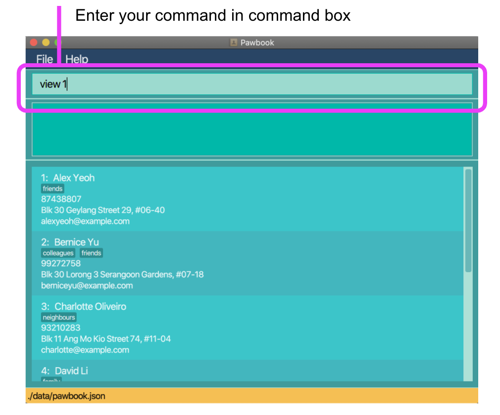

If there are entities to be viewed, Pawbook will display a success message as shown here.


### Help Command

**Function**: Shows the help page.<br>
**Use case**: If you are unsure about how to use Pawbook, execute this help command to view a complete list of commands.

Format:

```
help
```

If you require help, type `help` into the command box.
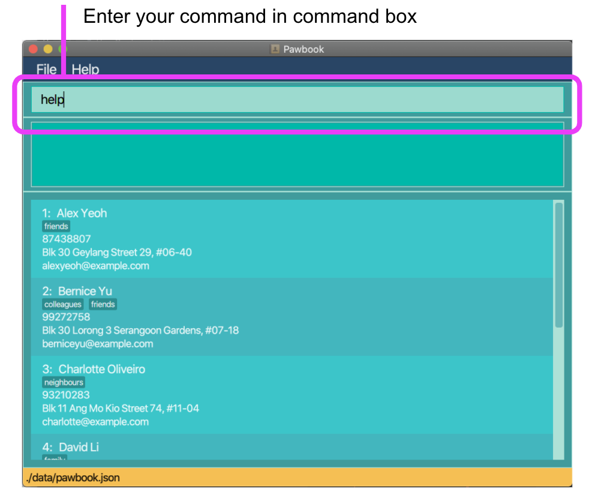

A command summary will appear, for more detailed information, click the <kbd>Copy URL</kbd> button to get the link to our user guide.


### Exit Command: Goodbye!

**Function**: Exits Pawbook.<br>
**Use case**: It's the end of the day and you want to close Pawbook. Simply use this command to exit. The data will be automatically saved upon exit and will still be there the next time you reopen Pawbook.

Format:

```
exit
```

To exit Pawbook, type `exit` into the command box.
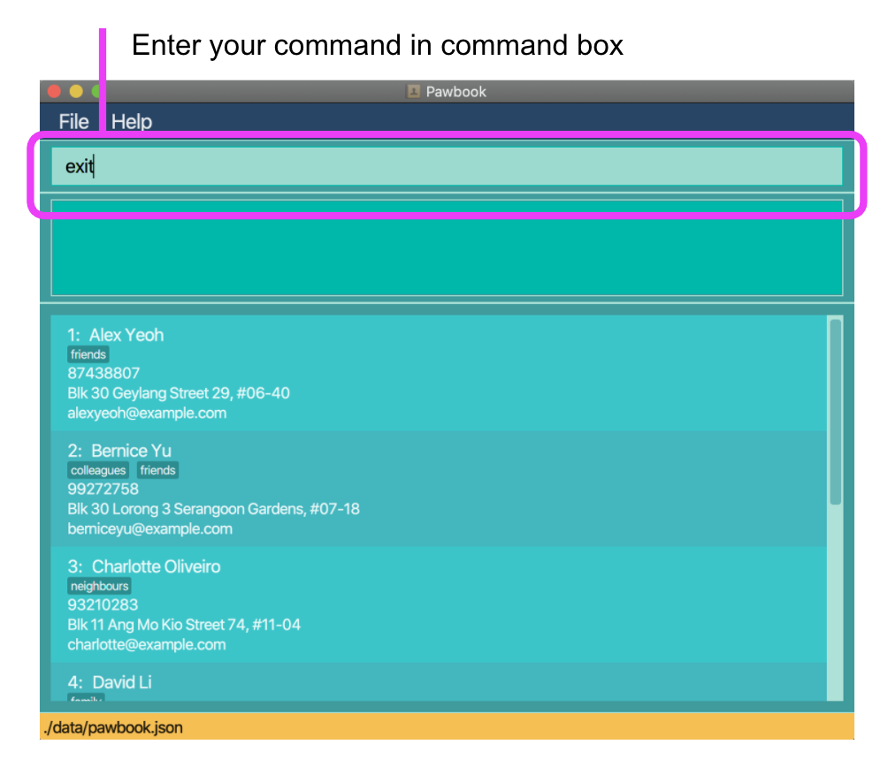

-----

# FAQ

Q: How do I transfer my data to another computer?<br>
A: Install the app in the other computer and overwrite the empty data file it creates with the file that contains the
data of your previous Pawbook home folder.

Q: Where is my data saved?<br>
A: They are stored in the <kbd>data</kbd> sub-folder where the Pawbook application can be found.

Q: How can I make backups of my data in Pawbook?<br>
A: Copy and paste the <kbd>data</kbd> folder located in the Pawbook home folder to somewhere safe and
easy to remember. In order to restore the backup, copy the entire folder back into the same home folder and rewrite the existing folder.

Q: How do I delete all my data in Pawbook?<br>
A: Delete the <kbd>data</kbd> folder in the Pawbook home folder.

Q: Will my data be compromised?<br>
A: Fret not! All your data on Pawbook is stored in your local device and will not be transferred over the Internet.

Q: Does Pawbook require an internet connection to function?<br>
A: Pawbook does not access any web services and can be run completely offline.

-----

# Command Summary

Action | Format
--------|------------------
**Add** | 1. `add dog n/DOG_NAME b/BREED d/DATE_OF_BIRTH s/SEX o/OWNER_ID [t/TAG]...`<br> 2. `add owner n/OWNER_NAME p/PHONE e/EMAIL a/ADDRESS [t/TAG]...`<br> 3. `add program n/PROGRAM_NAME [s/SESSION_TIME]... [t/TAG]...`
**Delete** | 1. `delete dog DOG_ID`<br> 2. `delete owner OWNER_ID`<br> 3. `delete program PROGRAM_ID`
**Drop** | 1. `drop d/DOG_ID [d/DOG_ID]... p/PROGRAM_ID`<br> 2. `drop d/DOG_ID p/PROGRAM_ID [p/PROGRAM_ID]...`
**Edit** | 1. `edit dog DOG_ID [n/DOG_NAME] [b/BREED] [d/DATE_OF_BIRTH] [s/SEX] [o/OWNER_ID] [t/TAG]...`<br> 2. `edit owner OWNER_ID [n/OWNER_NAME] [p/PHONE] [e/EMAIL] [a/ADDRESS] [t/TAG]...`<br> 3. `edit program PROGRAM_ID [n/PROGRAM_NAME] [s/SESSION_TIME]... [t/TAG]...`
**Enrol** | 1. `enrol d/DOG_ID [d/DOG_ID]... p/PROGRAM_ID`<br> 2. `enrol d/DOG_ID p/PROGRAM_ID [p/PROGRAM_ID]...`
**Exit** | `exit`
**Find** | `find KEYWORD [MORE_KEYWORDS]...`
**Help** | `help`
**List** | 1. `list dog`<br> 2. `list owner`<br> 3. `list program`
**Schedule** | `schedule [DATE]`
**View** | `view ENTITY_ID`

-----

# Glossary

Term  | Explanation
------|------------------
CLI | Short for Command Line Interface. CLI-based applications are primarily used through processing text commands.
GUI | Short for Graphical User Interface. GUIs work as the tangible user interface between program and user. Users interact with Pawbook through the GUI on their devices.
Entity | Refers to either an owner, a dog or a program.
Camel Case | Refers to a style of writing without spaces and indicating the separation of words using a single capitalized letter.
