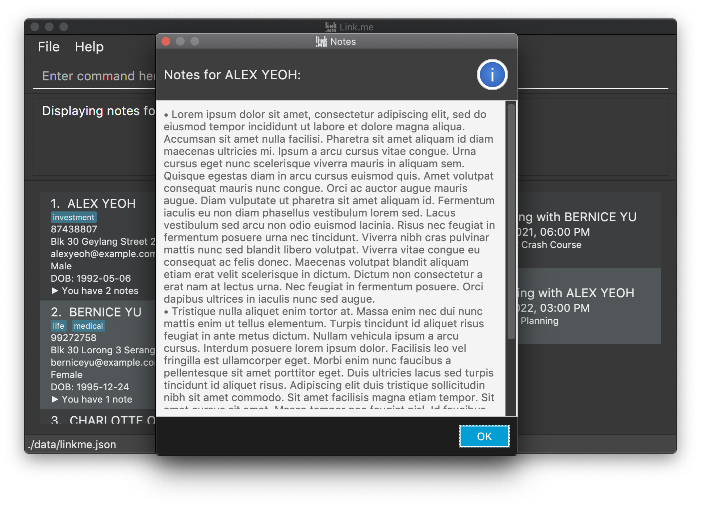

Are you finding it difficult to keep track of your insurance clients? Life as an insurance agent isn't easy. We
understand. Link.me is a **desktop app built for insurance agents** to help you manage your clients. Features of 
Link.me include adding, editing, deleting, searching for and filtering clients. Link.me also supports peripheral 
features such as meeting scheduling, recording client notes and notifying the user of important upcoming events.

Link.me is **optimized for use via a Command Line Interface (CLI)** while still having the benefits of a Graphical 
User Interface (GUI). If you can type fast, Link.me can get your client management tasks done faster than traditional 
GUI apps.

### Using this guide

This user guide will guide you, as an insurance agent, through the process of setting up Link.me, introduce you to the
capabilities of Link.me and facilitate your usage of Link.me so that you can better manage your ever-increasing clients.

Note the following symbols and formatting used in this guide:

Symbol/ Formatting           | Meaning
-----------------------------|------------------------------------------------------------------------------------------
`delete 1`                   |A grey highlight indicates that this is a command that you can type into the command line
:information_source:         |This symbol indicates important information to take note of
:bulb:                       |This symbol indicates helpful tips 
:exclamation:                |This symbol indicates warnings that you should follow

You may navigate this document using the Table of Contents provided below.

------------------------------------------------------------------------------------------------------------------------

* Table of Contents {:toc}

------------------------------------------------------------------------------------------------------------------------

## Quick start

1. Ensure you have Java `11` or above installed on your Computer.

2. Download the latest `linkme.jar` from [here](https://github.com/AY2021S2-CS2103T-W12-3/tp/releases).

3. Copy the file to the folder you want to use as the _home folder_ for `Link.me`.

4. Double-click the file to start `Link.me`. A window similar to the one shown below should appear in a few seconds.
   Note how Link.me already contains some sample data. You may look through the sample data to get an idea of what
   client information Link.me will store. 
   

5. Type a command in the command box and press Enter to execute it. e.g. typing **`help`** and pressing Enter will open
   the help window. 
   Some example commands you can try:

    * **`list`** : Lists all of your clients.

    * **`add n/John Doe p/98765432 e/johnd@example.com a/123 John Street g/M b/1993-05-06`** : Adds a client named `John Doe` to Link.me.
    
    * **`delete 3`** : Deletes the 3rd client shown in the current list.

    * **`clear`** : Deletes all of your clients. You may use this to clear the sample data.

    * **`exit`** : Exits Link.me.

6. Refer to the [Features](#features) section below for details of each command.

--------------------------------------------------------------------------------------------------------------------

## Overview

### Layout

The structure of the Link.me interface is split into five main parts:

* The **Input Command Line** is where you input commands for execution.

* The **Result Display** displays the result of your input.

* The **Client List** displays the list of clients you have stored in Link.me.

* The **Meeting List** displays the list of meetings that you have scheduled.

* The **Status Bar** displays information regarding where your information is stored. (Not relevant for basic users.)

You can view the personal information of each client, as well as their insurance plans and notes you have taken for them.

You can view information regarding upcoming meetings, including meeting time and a brief description.

### Functionalities

Action                            | Format
----------------------------------|------------------------------------------------------------------------------------
**Add a client**                  | `add n/NAME p/PHONE_NUMBER e/EMAIL a/ADDRESS g/GENDER b/BIRTHDATE [t/TAG]...`
**Add or remove insurance plans** | `plan INDEX i/PLAN_NAME $PREMIUM` (add) `plan INDEX c/PLAN_INDEX` (remove)
**Clear all clients**             | `clear`
**Delete a client**               | `delete INDEX`
**Edit a client**                 | `edit INDEX [n/NAME] [p/PHONE_NUMBER] [e/EMAIL] [a/ADDRESS] [g/GENDER] [b/BIRTHDATE] [t/TAG]...`
**Exit Link.me**                  | `exit`
**Filter by attribute**           | `filter PREFIX/KEYWORD [PREFIX/MORE_KEYWORDS]`
**Find by name**                  | `find KEYWORD [MORE_KEYWORDS]`
**List all clients**              | `list`
**Record, clear or view notes**   | `note INDEX r/NOTE` (record)  `note INDEX c/` (clear) `note INDEX v/` (view)
**Remove meetings**               | `unschedule INDEX` (remove specified meeting)  `unschedule all` (remove all meetings)  `unschedule expired` (remove expired meetings)
**Schedule meetings**             | `schedule INDEX m/DESCRIPTION @ DATE_TIME`
**Show notifications**            | `notif`
**View Help**                     | `help`
--------------------------------------------------------------------------------------------------------------------

## Features

**:information_source: Notes about the command format:** 

* Words in `UPPER_CASE` are the inputs you should supply. 
  e.g. in `add n/NAME`, `NAME` represents the client's name that you should provide. For instance, if the
  client's name is "John Doe", you should input: `add n/John Doe`.
  

* Inputs in square brackets are optional. 
  e.g. in `n/NAME [t/TAG]`, while the input for `n/NAME` is mandatory, it is okay to omit `[t/TAG]`. 
  For instance, these two inputs are valid:
    * `n/John Doe t/medical`
    * `n/John Doe`
    

* Inputs with `…`​ after them can be used multiple times (including zero times). 
  e.g. in `[t/TAG]…​`, the following inputs are valid:
    * `t/medical`
    * `t/mdecial t/investment`
    * ` `  (an empty input)

* You can enter your inputs in any order. 
  e.g. if the command specifies `n/NAME p/PHONE_NUMBER`, `p/PHONE_NUMBER n/NAME` is also acceptable.

* If an input is expected only once in the command, but you specify it multiple times, only the last occurrence of the
  input will be taken. 
  e.g. if you specify `p/12341234 p/56785678`, only `p/56785678` will be taken.

* For commands that do not take in additional inputs (such as `help`, `list`, `exit` and `clear`), any additional inputs will
  be ignored. 
  e.g. for the `help` command, if you input `help 123`, it will be interpreted as `help`.
  

### Listing all of your clients : `list`

You can view a list of all of your clients stored in Link.me.

Format: `list`

### Adding a client: `add`

You can add a client to Link.me, by specifying each of the fields below:

* Name 
  * should only contain alphanumeric characters and spaces
  * should not be blank
  * should not have the same name
    * To assist you with finding the correct client among clients with the exact same name, you can input a bracket
      after the individual client to distinguish him from the rest, for instance:
      * John Doe (Primary school classmate)
      * John Doe (Soccer teammate)

* Phone number 
  * should only contain numbers
  * should be at least 3 digits long

* Email
  * should be in the format `local-part@domain`
  * `local-part` should not be blank and should contain alphanumeric characters and the following characters within parenthesis (!#$%&'*+/=?`{|}~^.-) 
  * `domain` should be at least 2 characters long, start and end with alphanumeric characters, and consist of alphanumeric characters, periods and hyphens

* Address
  * should not be blank
    
* Gender
  * should be either `M`/`Male`, `F`/`Female` or `N`/`Non-binary`
    
* Birthdate
  * should be in the format YYYY-MM-DD
  * should be a valid date
    
* Tags (optional)
  * should be alphanumeric

Format: `add n/NAME p/PHONE_NUMBER e/EMAIL a/ADDRESS g/GENDER b/BIRTHDATE [t/TAG]...`

:bulb: **Tip:**A client can have any number of tags (including 0).

Examples:

* `add n/John Doe p/98765432 e/johnd@example.com a/John street, block 123, #01-01 g/M b/1995-01-01 t/investment`
* `add n/Betsy Crowe t/medical e/betsycrowe@example.com a/Newgate Prison p/91234567 t/life g/F b/1998-02-03`

### Editing a client : `edit`

You can edit the information of an existing client.

Format: `edit INDEX [n/NAME] [p/PHONE_NUMBER] [e/EMAIL] [a/ADDRESS] [g/GENDER] [b/BIRTHDATE] [t/TAG]...`

* Edits the client at the specified `INDEX`. The index refers to the index number shown in the displayed client list.
  The index **must be a positive integer** 1, 2, 3, …​
* At least one of the optional fields must be provided.
* The format of each field is specified above under [Adding a client](#adding-a-client-add).
* Existing values will be updated to new values you provide.
* When editing tags, the existing tags of your client will be removed i.e. adding of tags is not cumulative.
* When editing names, you cannot use a name that is identical to that of an existing client
  * To assist you with finding the correct client among clients with the exact same name, you can input a bracket
    after the individual client to distinguish him from the rest, for instance:
    * John Doe (Primary school classmate)
    * John Doe (Soccer teammate)

:bulb: **Tip:**
You can remove all your client’s tags by typing `t/` without specifying any tags after it.

Examples:

* `edit 1 p/91234567 e/johndoe@example.com` Edits the phone number and email address of the 1st client to be `91234567`
  and `johndoe@example.com` respectively.
* `edit 2 n/Betsy Crower t/` Edits the name of the 2nd client to be `Betsy Crower` and clears all existing tags.
* `edit 2 t/medical` Edits the insurance tag of the 2nd client to be `medical`.

### Deleting a client : `delete`

You can delete a specific client from Link.me.

Format: `delete INDEX`

* Deletes the client at the specified `INDEX`. The index refers to the index number shown in the displayed client list.
* The index **must be a positive integer** 1, 2, 3, …​

Examples:

* `list` followed by `delete 2` deletes the 2nd client in Link.me.
* `find Betsy` followed by `delete 1` deletes the 1st client in the results of the `find` command.

### Clearing all clients : `clear`

You can remove all clients from Link.me.

Format: `clear`

### Adding or removing insurance plans of a client : `plan`

#### Adding an insurance plan

You can add a new insurance plan to an existing client.

Format: `plan INDEX i/PLAN_NAME $PREMIUM`
* Adds the insurance plan to the client specified at `INDEX`. `INDEX` refers to the index number shown in the displayed client list.
* `INDEX` **must be a positive integer** 1, 2, 3, …​
* `PLAN_NAME` refers to the name of the insurance plan.
* `PREMIUM` refers to the yearly premium amount that the client pays for this plan.
* `PREMIUM` **must be a positive integer** 1, 2, 3, …​

Example:

* `plan 3 i/Protecc $4000` Adds a new insurance plan Protecc with a yearly premium amount of $4000 to the 3rd client.

#### Removing an insurance plan

You can remove an existing insurance plan from a client.

Format: `plan INDEX c/PLAN_INDEX`
* Removes the plan specified by `PLAN_INDEX` from the client specified at `INDEX`.
*`INDEX` refers to the index number shown in the displayed client list, while `PLAN_INDEX` refers to the index number shown in the list of insurance plans for that client.
* Both `INDEX` and `PLAN_INDEX` **must be a positive integer** 1, 2, 3, …​

Example:

* `plan 2 c/3` Removes the 3rd insurance plan of the 2nd client in the displayed client list.

### Recording, clearing or viewing notes : `note`

#### Recording a note

You can record a note for a specific client.

Format: `note INDEX r/NOTE`

* Adds the provided `NOTE` to the client specified at `INDEX`. `INDEX` refers to the index number shown in the displayed client list.
* `INDEX` **must be a positive integer** 1, 2, 3, …​
* `NOTE` should not be empty.

Example:

* `note 3 r/Wants to upgrade insurance coverage` adds the note "Wants to upgrade insurance coverage" to the 3rd client.

:bulb: **Tip:**New notes will not replace old notes. Instead, they will be added to the existing list of notes.

#### Viewing notes

You can view all existing notes for a specific client. Notes will be displayed in a popup box, with each note listed as
a bullet point.

Format: `note INDEX v/`

* View notes from the client specified at `INDEX`. `INDEX` refers to the index number shown in the displayed client list.
* `INDEX` **must be a positive integer** 1, 2, 3, …​

Example:

* `note 4 v/` generates a popup box displaying the notes recorded for the 4th client.

#### Clearing all notes

You can clear all existing notes from a specific client.

Format: `note INDEX c/`

* Clears all notes from the client specified at `INDEX`. `INDEX` refers to the index number shown in the displayed client list.
* `INDEX` **must be a positive integer** 1, 2, 3, …​

Example:

* `note 4 c/` clears all notes from the 4th client.

### Arranging Meetings with Clients

#### Scheduling a meeting : `schedule`

You can schedule a meeting with a specific client in Link.me.

Format: `schedule INDEX m/DESCRIPTION @ DATE_TIME`

* Adds the client at the specified `INDEX`, the `DATE_TIME` and the `DESCRIPTION` of the meeting to the scheduled meetings list.
* `INDEX` refers to the index number shown in the displayed client list.
* `INDEX` **must be a positive integer** 1, 2, 3, …​
* `DATE_TIME` refers to the date and time of the scheduled meeting.
* `DATE_TIME` should be provided in the specific datetime format `YYYY-MM-DD HH:MM`.

:bulb: **Tip:**`* Scheduling a new meeting will replace any existing meeting with that client.

:bulb: **Tip:**`DESCRIPTION` can contain any character, including "@".

:bulb: **Tip:** Meetings with clashes will not be scheduled, but Link.me only detects clashes when the scheduled time 
is exactly the same. Even with a minute difference, Link.me will schedule a new meeting. This is to ensure that our 
users have the largest flexibility when using Link.me.

Example:

* `schedule 2 m/Insurance Plan @ 2020-02-28 14:30` schedules a meeting with description "Insurance Plan" with the 2nd client 
  on 28th October 2020 2:30 pm.

#### Removing a meeting : `unschedule`

Removing meetings comes in three flavors:

* Format: `unschedule INDEX` 
  * Removes the meeting in the meeting list at `INDEX`. `INDEX` refers to the index number shown in the displayed meeting list.
  * The `INDEX` **must be a positive integer** 1, 2, 3, …​
* Format: `unschedule all` 
  * Removes all meetings in the meeting list.
* Format: `unschedule expired` 
  * Removes all expired meetings in the meeting list, i.e. meetings before the present date and time.
    

Example:

* `unschedule 2` removes the 2nd meeting on the meeting list.

### Searching for clients

#### Finding clients by name: `find`

You can find clients by simply entering their name. If you wish to search for clients with a specific attribute
such as gender, age, insurance plan name, etc, refer to the `filter` command below.

Format: `find KEYWORD [MORE_KEYWORDS]`

* The search is case-insensitive. e.g. `hans` will match `Hans`
* The order of the keywords does not matter. e.g. `Hans Bo` will match `Bo Hans`
* Only full words will be matched e.g. `Han` will not match `Hans`
* Clients matching at least one keyword will be returned (i.e. `OR` search). e.g. `Hans Bo` will return `Hans Gruber`
  , `Bo Yang`

Examples:

* `find John` returns `john` and `John Doe`
* `find alex david` returns `Alex Yeoh`, `David Li` 
  

#### Filtering clients by attributes : `filter`

You can filter clients by their address, gender, age, tags or insurance plan name.

Format: `filter PREFIX/KEYWORD [PREFIX/MORE_KEYWORDS]...`

Supported `PREFIX/KEYWORD` pairs:
* address: `a/ADDRESS`
* gender: `g/GENDER` (`GENDER` should be either `M`/`Male`, `F`/`Female` or `N`/`Non-binary`)
* tag: `t/TAG`
* age: `age/[AGE]` or `age/[AGE_LOWER_BOUND]-[AGE_HIGHER_BOUND]`
* insurance plan name: `i/PLAN_NAME`

Lists all of your clients that has one of their attributes that match your search keywords.

* The search is case-insensitive. e.g. for gender, `male` will match `Male`
* Only attributes that are identical will be matched e.g. for insurance plan, `Protect` will not match `Protect Plan`
* Clients matching at least one attribute will be returned (i.e. `OR` search). e.g. `g/F age/40` will return any
female clients and clients aged 40.

Only attributes that are exactly the same will be matched.

Example:

* `filter a/Clementi g/M t/medical i/Protecc age/23-30` returns:

  * clients who have "Clementi" in their address, or
  * clients who are Male, or
  * clients with the "medical" tag, or
  * clients with the insurance plan "Protecc", or
  * clients aged between 23 and 30 years old, inclusive

### Displaying notifications : `notif`

You can view a notification window containing: 
* All meetings occurring today, arranged in order of time.
* All client birthdays within the next two weeks, arranged in order of time.

These timeframes were chosen to give you ample time to prepare for upcoming meetings, or prepare gifts for upcoming client birthdays.

:bulb: **Tip:**This notification window is also shown when starting up Link.me.

Format: `notif`

### Viewing help : `help`

You can view a message explaining how to access the help page.

Format: `help`

### Exiting the program : `exit`

You can exit Link.me.

Format: `exit`

### Saving the data

Link.me data is saved in the hard disk automatically after any command that modifies existing data. There is no need to
save manually.

#### Editing the data file

Link.me data is saved as a JSON file `[JAR file location]/data/linkme.json`. We encourage only advanced users to edit
the JSON file directly. The Link.me team does not take any responsibility in data loss or startup failures following
invalid inputs.

:exclamation: **Caution:**
If your changes to the data file makes its format invalid, Link.me will try to discard all data and start with an empty 
data file at the next run. However, if the damage is too excessive, Link.me may be unable to start up.
In the case that this happens, please manually delete the data file to start the app.

--------------------------------------------------------------------------------------------------------------------

## FAQ

**Q**: How do I transfer my data to another computer? 
**A**: Install Link.me in the other computer and overwrite the empty data file it creates with the data file in your
current Link.me home folder.

**Q**: What operating systems can I install Link.me on? 
**A**: You can install Link.me on most modern desktop operating systems, including Linux, MacOS and Windows.
--------------------------------------------------------------------------------------------------------------------
