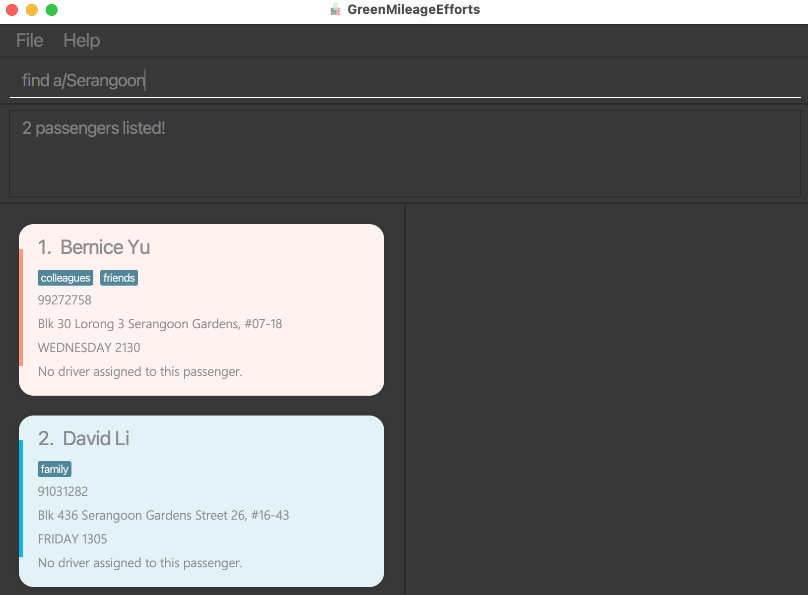

GreenMileageEfforts (GME) is a platform that helps drivers and passengers of any IT company quickly arrange carpooling in order to lower their carbon footprint. The platform follows that of a command-line interface (CLI) such that power users that are familiar can efficiently navigate the program.

* Table of Contents
{:toc}

--------------------------------------------------------------------------------------------------------------------

# Quick start

1. Ensure you have java 11 or above installed in your computer
2. Download the latest `GreenMileageEfforts.jar` from [here](https://github.com/AY2021S2-CS2103T-W10-1/tp/releases)
3. Copy the file to the folder you want to use as the *home* folder for your **GreenMileageEfforts**.
4. Double click the file to start the app.
5. Type the command in the command box and press `Enter` to execute it
6. Refer to the [Features]() below for the details on each command.

--------------------------------------------------------------------------------------------------------------------

## Features

**:information_source: Notes about the command format:** 

* Words in `UPPER_CASE` are the parameters to be supplied by the user. 
  e.g. in `add n/NAME`, `NAME` is a parameter which can be used as `add n/John Doe`.

* Items in square brackets are optional. 
  e.g `n/NAME [tag/TAG]` can be used as `n/John Doe tag/friend` or as `n/John Doe`.

* Items with `…`​ after them can be used multiple times including zero times. 
  e.g. `[tag/TAG]…​` can be used as ` ` (i.e. 0 times), `tag/friend`, `tag/friend tag/family` etc.

* Parameters can be in any order. 
  e.g. if the command specifies `n/NAME p/PHONE_NUMBER`, `p/PHONE_NUMBER n/NAME` is also acceptable.

* If a parameter is expected only once in the command but you specified it multiple times, only the last occurrence of the parameter will be taken. 
  e.g. if you specify `p/12341234 p/56785678`, only `p/56785678` will be taken.

* Extraneous parameters for commands that do not take in parameters (such as `help`, `list`, `exit` and `clear`) will be ignored. 
  e.g. if the command specifies `help 123`, it will be interpreted as `help`.

### Viewing help : `help`

Shows a message explaning how to access the help page.

Format: `help`

### Add passengers: `add`

Adds a new passenger in the GME terminal.

Format: `add n/NAME p/PHONE a/ADDRESS d/DAY t/TIME [tag/TAG]`

* Day is required to be a valid day of the week. e.g. `SUNDAY` or `FRIDAY`
* Time is required to be in the 24-hour format. e.g. `0530` or `2359` 

**Examples:**
* `add n/Ben Dover p/91234567 a/Geylang d/FRIDAY t/1800`
* `add n/Jenny Talia p/98765432 a/Yishun Avenue 4 d/SATURDAY t/0830 tag/female`

### Listing all passengers : `list`

Lists the passengers currently stored in the GME terminal.

Format: `list`

### Editing a person : `edit`

Edits an existing person in the GME terminal.

Format: `edit INDEX [n/NAME] [p/PHONE] [a/ADDRESS] [d/DAY] [t/TIME] [tag/TAG]…​`

* Edits the person at the specified `INDEX`. The index refers to the index number shown in the displayed person list. The index **must be a positive integer** 1, 2, 3, …​
* At least one of the optional fields must be provided.
* Existing values will be updated to the input values.
* When editing tags, the existing tags of the person will be removed i.e adding of tags is not cumulative.
* You can remove all the person’s tags by typing `tag/` without
  specifying any tags after it.

**Examples:**
* `edit 1 p/91234567 e/johndoe@example.com` Edits the phone number and email address of the 1st person to be `91234567` and `johndoe@example.com` respectively.
* `edit 2 n/Betsy Crower tag/` Edits the name of the 2nd person to be `Betsy Crower` and clears all existing tags.

### Locating passengers by name: `find`

Finds passengers whose names contain any of the given keywords.

Format: `find PREFIX/KEYWORD` where PREFIX is one of the following: `n`, `a`, `p`, `tag`

* The search is case-insensitive. e.g `hans` will match `Hans`
* Only full words will be matched e.g. `Han` will not match `Hans`
* Only **one type of prefix** can be specified
* Keywords separated by space will require both keywords to be matched.
  e.g. `Hans Yang` will only return `Hans Gruber Yang` instead of `Bo Yang`
* Prefixes for searching name `n/`, address `a/`, tag `tag/`, phone number `p/`

**Examples:**
* `find n/John` returns `john` and `John Doe`
* `find a/serangoon` returns `Bernice Yu`, `David Li` 
  

### Delete passengers: `delete`

Deletes the specific passenger from the GME terminal.

Format: `delete INDEX`

* Deletes the passenger at the specified `INDEX`.
* The index refers to the index number shown in the displayed passenger list.
* The index **must be a positive integer** 1, 2, 3, …​
* `search female` followed by `delete 3` deletes the *1st* passenger in the results of `search female` command

**Examples:**
* `list` followed by `delete 3` deletes the *3rd* person in the address book

### Select passengers to be driven: `drive`

Selects passengers from the current view in the GME terminal to be driven.

Format: `drive n/DRIVER_NAME p/DRIVER_PHONE c/INDEX [c/INDEX c/INDEX...]`

* The index refers to the index number shown in the displayed person list.
* The index **must be a positive integer** 1, 2, 3, …​
* The order of the passengers' index does not matter
* You must select at least 1 person to drive with one command

**Examples**:
* `find tag/female` followed by `drive n/Ben p/91234567 c/2 c/3 c/4` selects the the *2nd*, *3rd* and *4th* person in the results of `find tag/female` command, and assigns *Ben* with number *91234567* to be their driver

### Clearing all entries : `clear`

Clears all entries from the address book.

Format: `clear`

### Exiting the program : `exit`

Exits the program.

Format: `exit`

### Saving the data

GME data is saved in the hard disk automatically after any command that changes the data. There is no need to save manually.

### Editing the data file

GME data is saved as a JSON file `[JAR file location]/data/GreenMileageEfforts.json`. Advanced users are welcome to update data directly by editing that data file.

### Archiving data files `[coming in v2.0]`

_Details coming soon ..._

--------------------------------------------------------------------------------------------------------------------

# FAQ

**Q:** Where can I find the data stored by GME terminal?

**A:** The json file containing the data stored is named `GreenMileageEfforts.json` and can be found in the `../data` folder, where `..` is the path to your `GreenMileageEfforts.jar` file.

--------------------------------------------------------------------------------------------------------------------

## Command summary

Action | Format, Examples
--------|------------------
**add** | `add n/NAME p/PHONE a/ADDRESS d/DAY t/TIME [tag/TAG]`   e.g., `add n/Jenny Talia p/91234567 a/Yishun Avenue 4 d/FRIDAY t/1800 tag/female`
**list** | `list`
**edit** | `edit INDEX [n/NAME] [p/PHONE] [a/ADDRESS] [d/DAY] [t/TIME] [tag/TAG]`   e.g., `edit 8 a/Changi Airport d/SATURDAY`
**delete** | `delete INDEX`  e.g.,`delete 3`
**drive** | `drive n/DRIVER_NAME p/DRIVER_PHONE c/INDEX [c/INDEX c/INDEX...]`  e.g., `drive n/Ben p/91234567 c/2 c/3 c/4`
**find** | `find a/ADDRESS` or `find n/NAME` or `find p/PHONE NUMBER` or `find tag/TAG`   e.g., `find tag/female`
