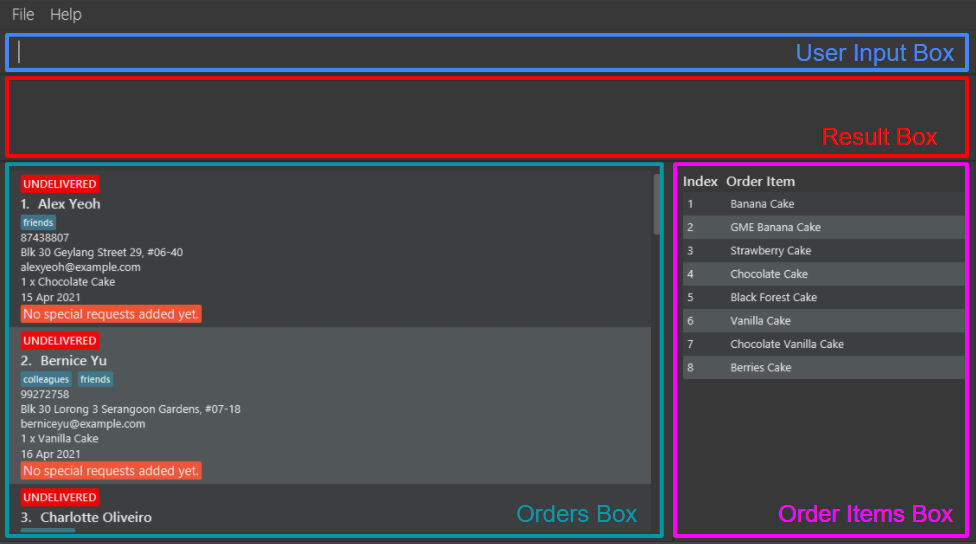
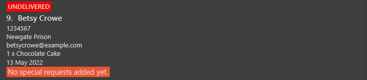
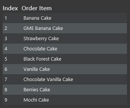
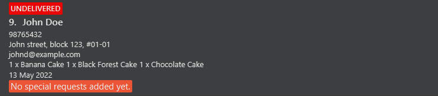
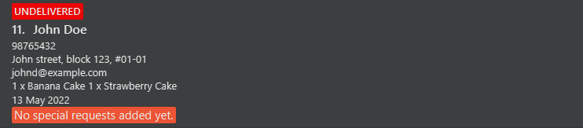
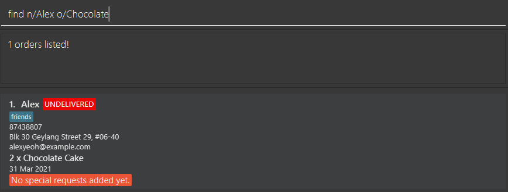
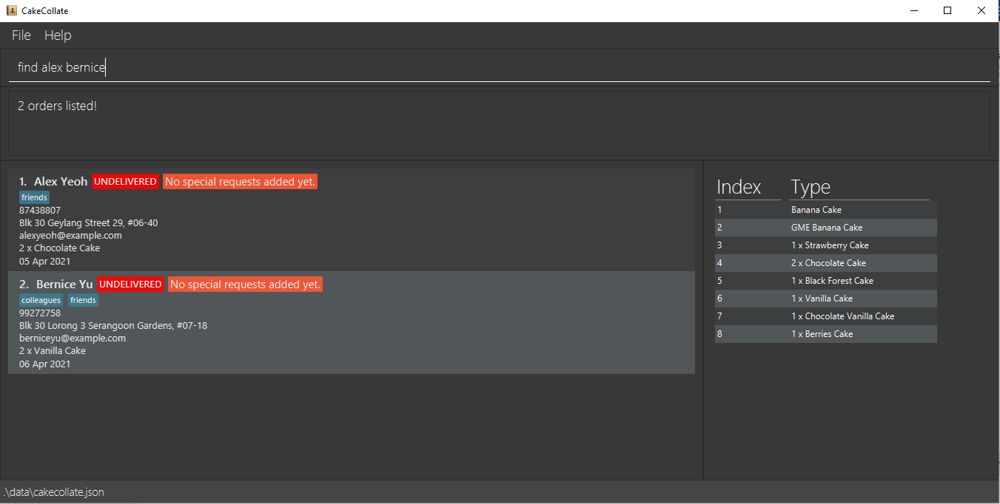
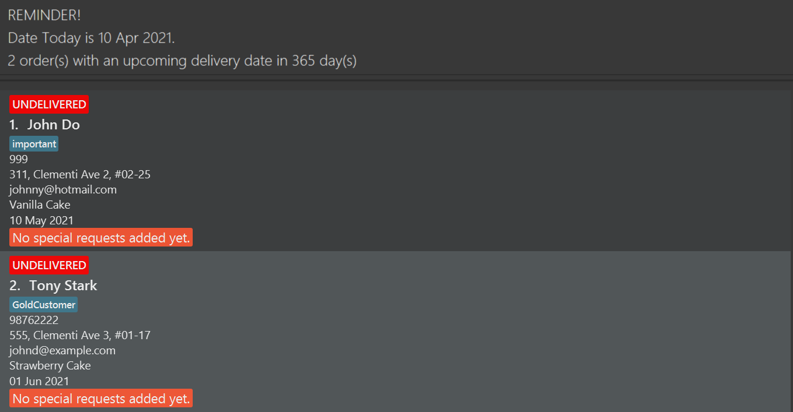

<!-- This UG's structure is inspired by 
https://ay2021s2-cs2103t-t11-2.github.io/tp/UserGuide.html#1-introduction
-->

  * Table of Contents
  {:toc}

--------------------------------------------------------------------------------------------------------------------

## **1. Introduction**
Welcome to our User Guide and thank you for using CakeCollate! Are you a home baker searching for a reliable tool to keep track of your orders? 
CakeCollate promises to be an efficient desktop application that allows you to easily consolidate and manage your orders. Our main features include: 
1. Order management
2. Order Item management
3. Quick search function for your orders
4. Reminder for undelivered orders that have delivery dates approaching the current date
5. Checking the delivery status of your orders

It is optimized for use via a Command Line Interface (CLI) while still having the benefits of a Graphical User Interface (GUI). If you're a small-time cake seller that can type fast, CakeCollate can get your order management tasks done faster than traditional GUI applications.

Let us take you through how to use CakeCollate in the rest of our User Guide.

--------------------------------------------------------------------------------------------------------------------

## **2. Using the User Guide**
In this section, you can learn more about the different terminologies and what to expect from each section of the User Guide.
This allows you to better comprehend the terms that are used and quickly navigate to sections where the answers to your questions
may lie.

### **2.1 What's in the User Guide**

In [Section 2.2: Reading the User Guide](#22-reading-the-user-guide), you can find essential information that enables you to read
the User Guide seamlessly.

In [Section 3: Getting started](#3-getting-started), you can find instructions on how to install and set up CakeCollate.
CakeCollate.

In [Section 4: Features](#4-commands-and-features), you can find instructions on the existing features and commands in CakeCollate
as well as how you can use them to suit your needs.

In [Section 5: Glossary](#5-glossary), you can find some terms that have been frequently used in our User Guide and their definitions.

In [Section 6: FAQ](#6-faq), you can find answers to frequently asked questions.

In [Section 7: Command Summary](#7-command-and-prefix-summary), you can find a summary of all the available commands.

### **2.2 Reading the User Guide**
In this section, you will learn about CakeCollate's User Interface (UI), the format of commands, and the types of user inputs that you can specify in commands.

#### **2.2.1 Sections of the UI**

1. The **User Input Box** is where you can type in commands. Commands are what help you interact with CakeCollate. For example, you can use commands to tell CakeCollate to add a particular order, or display specific orders.

2. The **Result Box** is where response messages from CakeCollate are displayed. If your commands are valid and processed successfully by CakeCollate, a response message indicating success will be displayed. If your commands are invalid or processed unsuccessfully, then an error response message will be displayed.

3. The **Orders Box** is where all the orders that you have added to CakeCollate are displayed.

    :information_source: **In what order are orders displayed in CakeCollate?**  
      * CakeCollates always displays orders by their statuses - undelivered, then cancelled, then delivered orders. 
      * For orders that have the same statuses, they are then arranged according to delivery date, with the earliest date on the top of the GUI. 

4. The **Order Items Box** is where all the different type of order items you have already entered into CakeCollate are displayed. You can think of it as a product catalogue. 

4. The **Order Items Box** is where all the different types of order items you have already entered into CakeCollate are displayed in an order items table.

#### **2.2.2 Formatting of the commands**

**:information_source: Interpreting command formats:** 

* Words in `UPPER_CASE` are [types of user inputs](#223-types-of-user-input). 
  E.g. in `add n/NAME`, `NAME` is a type of user input which can be used as `add n/John Doe`.

* Items in square brackets are optional fields that the user can choose to include or not. 
  E.g `n/NAME [t/TAG]` can be used as `n/John Doe t/friend` or as `n/John Doe`.

* Items with `…`​ after them can be used multiple times.    E.g. `[t/TAG]…​` can be used as ` ` (i.e. 0 times), `t/friend`, `t/friend t/family` etc. <!-- order desc? --> 

* The different types of user input can be placed in any order. 
  E.g. if the command specifies `n/NAME p/PHONE_NUMBER`, `p/PHONE_NUMBER n/NAME` is also acceptable.

* If a particular type of input is expected only once in a command, but has been specified multiple times, only the last occurrence will be taken. 
  E.g. if you specify `p/12341234 p/56785678`, only `p/56785678` will be taken.
  
* If a user input is specified for a command that does not accept it, (such as [`help`](#viewing-help-help), [`list`](#list-all-existing-orders-list), [`exit`](#exiting-the-program--exit) and [`clear`](#clearing-all-existing-orders-and-order-items-clear)) it will be ignored. 
  E.g. if you specify `help 123`, `123` will be ignored and the command will be interpreted as `help`.

#### **2.2.3 Types of user input**
In this section, you will learn about the commonly used user inputs as well as their accompanying prefixes. 
These will be helpful when you are trying to specify the fields for certain commands.
  

##### `ADDRESS`
The address of the customer who has placed the order. 
Prefix: `a/`
* It can contain all types of characters.
* It cannot be empty.

##### `DAYS`
The number of days from today's date. 
Prefix: `none`
* It can contain integers greater than or equal to 0. 
  E.g. `0`,`365`,`99`

##### `DELIVERY_DATE`
The delivery date for the order. 
Prefix: `d/`
* It should be a valid calendar date.
* It should be in one of the following formats:
  * `dd/MM/yyyy` E.g. `01/01/2021`
  * `dd-MM-yyyy` E.g. `31-01-2021`
  * `dd.MM.yyyy` E.g. `01.12.2021`
  * `dd MMM yyyy` E.g. `31 Dec 2021` 
  :information_source: Dates and months from `1-9` should be specified as `01-09`. E.g. The first of January should be specified as `01/01` instead of `1/1`. 
  :information_source: `MMM` specifies the first three characters of the month. The first character should be capitalised.
* When adding or editing an order, the `DELIVERY_DATE` should either be today's date or a date in the future. 
  I.e. the date today or a date after today.
* Orders with a `DELIVERY_DATE` before today's date will not be deleted. 
  I.e. If you enter an order with a `DELIVERY_DATE` for tomorrow, the order will not be deleted even if you launch the application again in two days. 
:information_source: You do not have to worry about losing track of overdue orders. 

**:exclamation: For advanced users:** You can set the delivery date of an order that is yet to be delivered to a past date in the storage file, `cakecollate.json`. The application will not be able to warn you that you have added an invalid delivery date. As such, you are recommended to add/edit a delivery date through the application itself.

##### `INDEX`
Each order is given a particular index so that you can easily refer to an order for certain commands. In particular, the index of an order can be found beside the name of the customer in the [orders box](#221-sections-of-the-ui). 
Prefix: `none`
* It can contain positive integers greater than or equal to 1, but should not be greater than the total number of orders in 
the orders box. 
  E.g. `1`,`20`,`35`

##### `INDEXES`

Certain commands (such as [`delete`](#deleting-an-order-delete)) allow you to specify multiple [index](#index), which allows you to delete multiple orders at one go.

Prefix: `none`
* To specify multiple indexes separate them with a space. 
  E.g. `1 2 5`

##### `EMAIL`
The email of the customer who has placed the order. 
Prefix: `e/`
* Emails should be of the format `local-part@domain`.
* `local-part` can contain alphabetical and numerical characters and also the following special characters: ``!#$%&'*+/=?`{|}~^.-``. 
  E.g. `alice#3in?wonderland!`
* `domain` should
  * be at least 2 characters long
  * start and end with alphabetical or numerical characters
  * contain alphabetical or numerical characters, a period `.` or a hyphen `-` for the characters in between, if any. 
  E.g. `sample-domain.com`
  
##### `NAME`
The name of the customer who has placed the order. 
Prefix: `n/`
* It can contain alphabets, numbers and spaces. 
  E.g. `Alex Yeoh`, `Johnathan9`, `Charlotte the 5th`
* It cannot be longer than 70 characters.
* It cannot be empty.

##### `ORDER_DESCRIPTION`
The order description of the order. 
Prefix: `o/`
* It can contain alphabets and spaces.
* It cannot be longer than 70 characters.
* It cannot be empty. 
  E.g. `Durian Cake`, `Blackforest Cake`

##### `ORDER_ITEM_INDEXES`
The order item index in the order items table. 
Prefix: `oi/`
* This refers to indexes of the order items in the [order items box](#221-sections-of-the-ui).
* This can be used with or as a replacement for `ORDER_DESCRIPTION`, given the order item in the table matches the order description you want to add/edit.

##### `PHONE_NUMBER`
The phone number of the customer who has placed the order. 
Prefix: `p/`
* It can contain numbers. 
  E.g. `90126969`
* It should be at least 3 digits long.
* It cannot be longer than 20 digits.

##### `REQUEST`
The special request or notes you can add to an order. What makes it different from tags is that it can contain a
large amount of information. 
Prefix: `r/`
* It can contain all types of characters.
* It can be empty.
  * An empty request is used to clear/reset the `REQUEST` field of the order.

:information_source: The user input `REQUEST` and its prefix `r/` should only be specified in the [`request`](#adding-a-special-request-to-an-order-request) and [`find`](#locating-orders-find) commands.

##### `TAG`
The tags you can add to an order. A small piece of information you can add to an order. 
Prefix: `t/`
* It can contain alphabetical or numerical characters but not spaces.
* Each tag cannot be longer than 30 characters.
* There is no specific usage for `TAG`.
  * Use it as a tag for the customer. E.g. `friend`, `fussy`, `important`
  * Use it as a tag for the order. E.g. `urgent`, `complicated`
    
**:exclamation: For advanced users:** Only `NAME`, `ADDRESS`, `ORDER_DESCRIPTION` and `DELIVERY_DATE` are taken into consideration when comparing if two orders are the same order.

--------------------------------------------------------------------------------------------------------------------

## **3. Getting started**

1. Ensure you have Java `11` or above installed on your computer.

2. Download the latest `cakecollate.jar` from [here](https://github.com/AY2021S2-CS2103T-T11-4/tp/releases).

3. Copy the file to the folder you want to use as the _home folder_ for your CakeCollate.

4. Double-click the file to start CakeCollate. A GUI similar to the below should appear in a few seconds. Note how the application contains some sample data. 
You can use the sample data pre-loaded in the application to play around and get used to the available commands.   
  

5. Type the command in the command box and press Enter to execute it. 
   E.g. typing **`help`** and pressing Enter will display the help window. 
   Some example commands you can try:

   * **`list`** : Lists all orders in CakeCollate.

   * **`add`**`n/John Doe p/98765432 e/johnd@example.com a/John street, block 123, #01-01 d/13-05-2021 o/Strawberry Cake` : Adds a `Strawberry Cake` order to CakeCollate. 
   :information_source: Please note that `d/13-05-2021` may become an invalid date depending on when you view this User Guide. Refer to [`DELIVERY_DATE`](#delivery_date) to check the constraints.

   * **`delete`**`3` : Deletes the 3rd order shown in the current list.
   
   * **`remind`**`2` : Lists all undelivered orders that are within 2 days from today's date.

   * **`clear`** : Deletes all order and order items in CakeCollate.

   * **`exit`** : Exits the app.

6. Refer to the [Features](#4-commands-and-features) section below for details of each command.

--------------------------------------------------------------------------------------------------------------------

## **4. Commands and features**
This section contains information about all existing commands and features that we have implemented.
Being well-versed in this section will enable you to use CakeCollate to its fullest potential.
This section is categorised into 3 parts: [orders](#41-orders), [order items](#42-order-items) and [others](#43-others).

### **4.1 Orders**
This section contains information about the commands that can modify the [orders box](#221-sections-of-the-ui).

#### **4.1.1** ***Modifying the data***

##### Adding an order: `add`

Add an order to CakeCollate. The delivery status of the order will be initialised as undelivered, but can be modified with the [`delivered`](#setting-the-delivery-status-of-an-order-as-delivered-delivered) and [`cancelled`](#setting-the-delivery-status-of-an-order-as-cancelled-cancelled) commands.
The special request of the order will be initialised as none, but can be modified with the [`request`](#adding-a-special-request-to-an-order-request) command.

###### Basic format

Format: `add n/NAME p/PHONE_NUMBER e/EMAIL a/ADDRESS d/DELIVERY_DATE o/ORDER_DESCRIPTION…​ [t/TAG]…​`

Examples:

* `add n/Betsy Crowe e/betsycrowe@example.com a/Newgate Prison p/1234567 d/13-05-2022 o/Chocolate Cake o/chocolate cake o/Mochi Cake t/friend t/daughter` adds an order with all compulsory fields, three order descriptions, and a friend and daughter tag. 
  
* `add n/Betsy Crowe e/betsycrowe@example.com a/Newgate Prison p/1234567 d/13-05-2022 o/Chocolate Cake` adds an order with all compulsory fields, one order description and no tags. 

:information_source: **How do you specify that a cake has been ordered multiple times?** 
* If your customer orders 2 chocolate cakes and 1 mochi, you can specify the `o/` prefix twice, e.g. `o/Chocolate Cake o/Chocolate Cake o/Mochi Cake` (same as the first example above)
* The GUI will then display `2 x Chocolate Cake` and `1 x Mochi Cake` in the order that was newly added.
  * Note how there is no need for you to type `2 x` or `1 x` - CakeCollate helps you count each order description for you.

:information_source: **Order descriptions are not case-sensitive** 
  * CakeCollate recognizes that `Chocolate cake` and `chocolatE caKe` are the same order description and will treat them like the same `Chocolate Cake`, so if you add `o/Chocolate cake o/chocoLATE CAKE` to your order, it will be still displayed as `2 x Chocolate Cake`, making your GUI look neat.  

###### Alternative format 

Format: `add n/NAME p/PHONE_NUMBER e/EMAIL a/ADDRESS d/DELIVERY_DATE oi/ORDER_ITEM_INDEXES [o/ORDER_DESCRIPTION]…​ [t/TAG]…​`

* The difference here compared to the previous format is that you can omit the `ORDER_DESCRIPTION` input, but you need to include an `ORDER_ITEM_INDEXES` input.

* This alternative format is aimed at saving you some typing. If an order description you want to specify already exists in the [order items box](#221-sections-of-the-ui), you can specify its index instead of typing its entire name out.

* For example, for an order that involves Chocolate Cake, if `Chocolate Cake` exists in the [order items box](#221-sections-of-the-ui) as shown, instead of typing `o/Chocolate Cake`, you can type `oi/4`.

* As such, you can interpret the order items table of the GUI as being a shortcut table.

Examples:

 
(This is a screenshot extracted from the sample [here](#221-sections-of-the-ui))

* `add n/John Doe p/98765432 e/johnd@example.com a/John street, block 123, #01-01 d/13-05-2022 oi/1 4 5` adds an order with all compulsory fields and adds order items 1, 4, 5 of order items table to the order. 

* `add n/John Doe p/98765432 e/johnd@example.com a/John street, block 123, #01-01 d/13-05-2022 o/Strawberry Cake oi/1` adds an order with all compulsory fields, an order description of Strawberry Cake and the first item of the order items table. 

:information_source: **How are items added to the order items table?** 

* When you specify an order description using the prefix `o/`, E.g. `o/Chocolate Cake`, CakeCollate automatically adds it into the order items table. As such, you don't need to go through extra steps to add in items into the order items table manually.

* If you do want to add items into the order items table, you can refer to the [`addItem`](#adding-order-items-additem) command below.

:information_source: **How do you specify that a cake has been ordered multiple times using the `oi/` prefix?** 

* If Chocolate Cake is at index 4 of the order items table, you can specify `oi/4 4`.

##### Adding a special request to an order: `request`

Add a special request to an existing order in CakeCollate.

Format: `request INDEX r/REQUEST`

* Adds a special request to the order at the specified `INDEX`. Refer to [`INDEX`](#index) for more details.
* Adding new special requests to an order will replace the existing special request the order currently has.
* You can remove an order’s special request by specifying `r/` without any requests after it, or only specifying the index without adding the prefix.
* By default, no special request will be added to an order when it is first added to CakeCollate. 
  

Examples:

* `request 1 r/More sugar, spice and everything nice` sets the special request of the first order to be `More sugar, spice and everything nice`. 
  
* `request 1 r/` removes the first order's special request. 
  
* `request 1` removes the first order's special request. 
  

##### Deleting an order: `delete`

Delete the order(s) based on the specified indexes from CakeCollate.

Format: `delete INDEXES`

* Delete the order(s) with the specified `INDEXES`. Refer to [`INDEXES`](#indexes) for more details.

Examples:
* `delete 2` delete the order with `INDEX` 2 from CakeCollate.
* `delete 2 3` delete the orders with `INDEXES` 2 and 3 from CakeCollate.

##### Editing an order: `edit`

Edit an existing order in CakeCollate.

Format: `edit INDEX [n/NAME] [p/PHONE_NUMBER] [e/EMAIL] [a/ADDRESS] [d/DELIVERY_DATE] [o/ORDER_DESCRIPTION]…​ [t/TAG]…​`

* Edit the order at the specified `INDEX`. Refer to [`INDEX`](#index) for more details.
* At least one of the optional fields must be provided.
* Existing values will be updated to the input values.
* When editing tags, the existing tags of the order will be removed. 
  I.e. adding of tags is not cumulative.
* You can remove all of an order’s tags by specifying `t/` without any tag after it.

Examples:
* `edit 1 p/91234567 e/johndoe@example.com` edits the phone number and email address of the first order to `91234567` and `johndoe@example.com` respectively.
* `edit 2 n/Betsy Crower t/` edits the name of the second order to be `Betsy Crower` and removes all existing tags.

##### Updating delivery status of an order

###### Setting the delivery status of an order as undelivered: `undelivered`

Sets the delivery status of the specified order(s) in CakeCollate as `undelivered`.

Format: `undelivered INDEXES`

* Sets the delivery status of the orders with the specified `INDEXES` as `undelivered`. Refer to [`INDEXES`](#indexes) for more details.

Examples:

* `undelivered 2` sets the delivery status of the order with `INDEX` 2 in CakeCollate as `undelivered`.
* `undelivered 2 3` sets the delivery status of the orders with `INDEXES` 2 and 3 in CakeCollate as `undelivered`.

###### Setting the delivery status of an order as delivered: `delivered`

Sets the delivery status of the specified order(s) in CakeCollate as `delivered`.

Format: `delivered INDEXES`

* Sets the delivery status of the orders with the specified `INDEXES` as `delivered`. Refer to [`INDEXES`](#indexes) for more details.

Examples:

* `delivered 2` sets the delivery status of the order with `INDEX` 2 in CakeCollate as `delivered`.
* `delivered 2 3` sets the delivery status of the orders with `INDEXES` 2 and 3 in CakeCollate as `delivered`.

###### Setting the delivery status of an order as cancelled: `cancelled`

Sets the delivery status of the specified order(s) in CakeCollate as `cancelled`.

Format: `cancelled INDEXES`

* Sets the delivery status of the orders with the specified `INDEXES` as `cancelled`. Refer to [`INDEXES`](#indexes) for more details.

Examples:

* `cancelled 2` sets the delivery status of the order with `INDEX` 2 in CakeCollate as `cancelled`.
* `cancelled 2 3` sets the delivery status of the orders with `INDEXES` 2 and 3 in CakeCollate as `cancelled`.

#### **4.1.2** ***Modifying what is displayed*** 

##### Locating orders: `find`

Find orders whose specified field contain any of the keywords input by the user.

Format: `find [n/KEYWORD_NAME]…​ [p/KEYWORD_PHONE]…​ [e/KEYWORD_EMAIL]…​ [a/KEYWORD_ADDRESS]…​ [o/KEYWORD_ORDER_DESCRIPTION]…​ [t/KEYWORD_TAG]…​ [d/KEYWORD_DELIVERY_DATE]…​ [s/KEYWORD_DELIVERY_STATUS]…​ [r/KEYWORD_REQUEST]…​`

* At least one of the optional fields must be provided.
* The search is case-insensitive. 
  E.g. `hans` will match `Hans`.
* The order of the keywords does not matter. 
  E.g. `Hans Bo` will match `Bo Hans`.
* Sub-strings will be matched. 
  E.g. `Han` will match `Hans`.
* Fields are searched according to specified prefixes. 
  E.g. `n/Hans` will only find orders with names that match `Hans`.
* If no prefixes are specified, orders matching at least one keyword will be returned. 
  I.e. `OR` search. 
  E.g. `Hans Bo` will return `Hans Gruber`, `Bo Yang`.
* If multiple keywords are specified for a certain prefix, orders matching at least one keyword for the specified field will be returned. 
  I.e. `OR` search. 
  E.g. `n/Hans Bo` will return orders with names `Hans Gruber`, `Bo Yang`.
* If multiple prefixes are specified, each keyword specified for each field must match orders with corresponding fields. 
  I.e. `AND` search. 
  E.g. `n/Hans o/Cake` will only match orders with names that match `Hans` and order descriptions that match `Cake`.
* `AND` searches will take priority.

Examples:

* `find n/John` will return all orders with name `john`, `John Doe` or `Johnathan`.
* `find n/Alex Bob` will return all orders with name `Alex`, `alexander`, `Bob` or `bobby`.

*Using the sample data:*
* `find n/Alex o/Chocolate` will return all orders with name `Alex` and order description `Chocolate`. 
  
  

* `find alex bernice` will return all orders that matches `alex` or `bernice`. 
  
  

* `find n/Alex Charlotte o/Chocolate` will return all orders that matches (`Alex` or `Charlotte`) and `Chocolate`.  
    
  
##### List all existing orders: `list`

Shows a list of all orders in CakeCollate.

Format: `list`

##### Display upcoming orders: `remind`

Displays a list of undelivered orders with an upcoming `DELIVERY_DATE`.

Format: `remind DAYS`

* Displays a list of all undelivered orders with an upcoming `DELIVERY_DATE` within `DAYS` days from today.

Examples:
* `remind 0` displays all undelivered orders that have a delivery date for today.
* `remind 365` displays all undelivered orders that have a delivery date within 365 days from today.  
     

### **4.2 Order Items**
This section contains information about the commands that can modify the [order items box](#221-sections-of-the-ui).

#### Adding order items: `addItem`

Adds an order item to the order items table.

Format: `addItem ORDER_DESCRIPTION`

* Refer to [`ORDER_DESCRIPTION`](#order_description) for more details.

Examples:

* `addItem Red Velvet Cake` adds an order item with the specified description to the order items table.

#### Deleting order items: `deleteItem`

Deletes order items from the order items table based on the specified indexes.

Format: `deleteItem ORDER_ITEM_INDEXES`

* Refer to [`ORDER_ITEM_INDEXES`](#order_item_indexes) for more details.

Examples:
* `deleteItem 2` deletes the order item with `ORDER_ITEM_INDEX` 2 from the order items table.
* `deleteItem 2 3` deletes the order items with `ORDER_ITEM_INDEXES` 2 and 3 from the order items table.

### **4.3 Others**
This section contains information about other useful commands that you can use as well as features that are implemented in CakeCollate.

#### Viewing help: `help`

* Gives instructions on how to enter orders into the CLI.
* Displays a message with a list of all available commands and their format.
* To return to the main order list click on the `Return to the order list` button. 
* Help can also be accessed by clicking the `help` button on the top left corner of the application or by clicking the `F1` keyboard key.

:bulb: **Tip:** You can enter the command `list` to go back to the orders and order items table. 

  

Format: `help`

#### Clearing all existing orders and order items: `clear`

Deletes all existing orders and order items in CakeCollate.

:exclamation: **Caution:**
This action is irreversible! With this command, all existing orders and order items will be deleted from 
CakeCollate and you will not be able to retrieve them. 

Format: `clear`

#### Exiting the program : `exit`

Exits the program.

Format: `exit`

#### Saving the data

CakeCollate data is saved in the hard disk automatically after any command that changes the data. There is no need to save manually.

#### Editing the data file

CakeCollate order data is saved as a JSON file `[JAR file location]/data/cakecollate.json`. 
CakeCollate order item data is saved as a JSON file `[JAR file location]/data/OrderItems.json`. 
Advanced users are welcome to update data directly by editing these data files.

:exclamation: **Caution:**
If your changes to the data files make their format invalid, CakeCollate will discard all data from the data file and start with an empty data file at the next run.

#### Keyboard shortcuts

* Press the `Up` arrow in the keyboard to traverse up the previously inputted commands if they exist. 
* Press the `Down` arrow in the keyboard to traverse down the previously inputted commands if they exist. 
* Press the `Shift`Button followed by the `Backspace` button on the keyboard to delete all the text in the command box in one go. 

--------------------------------------------------------------------------------------------------------------------

## **5. Glossary**

* **Command**: Commands are user inputs that are recognised by CakeCollate to modify the data that is stored or displayed.
* **JSON**: JSON stands for Javascript Object Notation. It is a format for saving data which provides user-friendliness as it is easy to read and write data in this format.
* **CLI**: CLI is an abbreviation for Command Line Interface. A Command Line Interface enables the user to interact with the application via commands in text format.
* **GUI**: GUI is an abbreviation for Graphical User Interface. A Graphical User Interface enables the user to interact with the application by clicking on visual components.

--------------------------------------------------------------------------------------------------------------------

## **6. FAQ**

**Q**: How do I transfer my data to another Computer? 
**A**: 1. Install CakeCollate on your other computer and launch it.  
       2. Run the `list` command and close the application. 
       3. A folder named data would have been created in the CakeCollate home folder. 
       4. Replace this folder with the data folder from your original CakeCollate home folder. 

**Q**: How do I install Java? 
**A**: [Click Here](https://www.oracle.com/sg/java/technologies/javase-jdk11-downloads.html) and download Java based 
on the operating system of the computer that you are running CakeCollate on.

--------------------------------------------------------------------------------------------------------------------

## **7. Command and prefix summary**

### Orders

#### Modifying the data

Action  | Format
--------|------------------
**Add** | `add n/NAME p/PHONE_NUMBER e/EMAIL a/ADDRESS d/DELIVERY_DATE o/ORDER_DESCRIPTION…​ [t/TAG]…​`     `add n/NAME p/PHONE_NUMBER e/EMAIL a/ADDRESS d/DELIVERY_DATE oi/ORDER_ITEM_INDEXES [o/ORDER_DESCRIPTION]…​ [t/TAG]…​`
**Request** | `request INDEX r/REQUEST`
**Delete** | `delete INDEXES`
**Edit** | `edit INDEX [n/NAME] [p/PHONE_NUMBER] [e/EMAIL] [a/ADDRESS] [d/DELIVERY_DATE] [o/ORDER_DESCRIPTION]…​ [t/TAG]…​`
**Undelivered** | `undelivered INDEXES`
**Delivered** | `delivered INDEXES`
**Cancelled** | `cancelled INDEXES`

#### Modifying what is displayed

Action | Format
-------|----------
**Find** | `find [n/KEYWORD_NAME]…​ [p/KEYWORD_PHONE]…​ [e/KEYWORD_EMAIL]…​ [a/KEYWORD_ADDRESS]…​ [o/KEYWORD_ORDER_DESCRIPTION]…​ [t/KEYWORD_TAG]…​ [d/KEYWORD_DELIVERY_DATE]…​ [s/KEYWORD_DELIVERY_STATUS]…​ [r/KEYWORD_REQUEST]…​`
**List** | `list`
**Remind** | `remind DAYS`

### Order Items

Action | Format
-------|----------
**Add order item** | `addItem ORDER_DESCRIPTION`
**Delete order item** | `deleteItem ORDER_ITEM_INDEXES`

### Others

Action | Format
-------|----------
**Help** | `help`
**Clear** | `clear`
**Exit** | `exit`

### Prefix

Prefix  | Description
--------|------------------
**n/** | Name of the customer.
**p/** | Phone number of the customer.
**e/** | Email of the customer.
**a/** | Address of the customer.
**d/** | Delivery date of the order.
**o/** | Order placed by the customer.
**oi/** | Order index of the order placed by the customer, based on the order items table.
**t/** | Tags for the customer/order.
**r/** | Requests placed by the customer for an order.
**s/** | Status of the order (undelivered, delivered or cancelled).

## **8. Acknowledgements**

This project is based on the AddressBook-Level3 project created by the [SE-EDU initiative](https://se-education.org).
