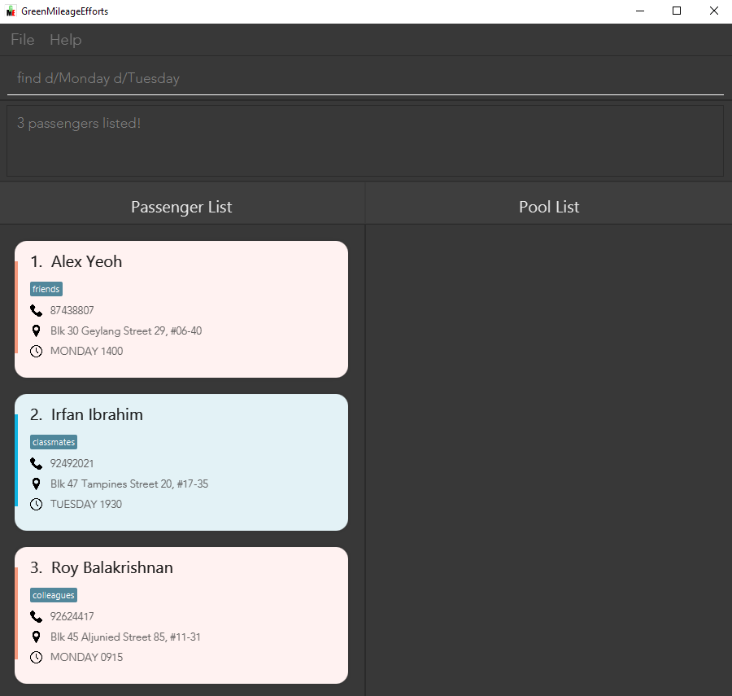

GreenMileageEfforts (GME) is a platform that helps the HR executive of any company quickly arrange carpooling among its employees in order to lower the carbon footprint of the company.
* Table of Contents
{:toc}

--------------------------------------------------------------------------------------------------------------------

# 1. Introduction

## 1.1 About Green Mileage Efforts
Green Mileage Efforts(GME) is an efficient carpooling management solution designed to help corporations reduce their carbon footprint. The GME system allows for the simple creation and management of weekly carpooling groups of employees looking to carpool to and from their office. These [pools](#6-glossary) of employees can then carpool from the office regularly on the specified days and times every week. Through the GME system, users can find employees based on their carpooling preferences and quickly group them with drivers. The system also maintains a database of the arranged carpooling groups for easy management.

GME is a platform that follows a [Command-Line Interface (CLI)](#6-glossary) such that power users that are familiar can efficiently navigate the program.

## 1.2 Navigating the User Guide
For help regarding the set up of GME, refer to the [“Quick Start"](#2-quick-start-) section.

For a full list and more information about GME's features and commands, use the [“Features”](#3-features-) section.

For a quick overview of GME’s commands, refer to the [“Command Summary”](#5-command-summary-) section.

Please note the following symbols used in the User Guide which may serve as points of interests:

* `command`: The grey highlight indicates commands that can be executed by GME.

* :information_source: : This symbol indicates noteworthy information.

* :warning: : This symbol indicates information that may irrevesibly corrupt data.

--------------------------------------------------------------------------------------------------------------------

# 2. Quick start 

1. Ensure you have Java 11 or above installed in your computer.
2. Download the latest GreenMileageEfforts.jar from [here](https://github.com/AY2021S2-CS2103T-W10-1/tp/releases).
3. Copy the file to the folder you want to use as the [home folder](#6-glossary) for your **GreenMileageEfforts**.
4. Double click the file to start the aplication.
5. Type the command in the command box and press the Enter key to execute it. Some examples of commands you could try are:
   * `list`: Lists all [passengers](#6-glossary) currently stored in the GME system.
   * `pool n/Doctor Iver p/92385810 d/MONDAY t/0930 c/1 c/2 c/3`: adds the employees shown at indexes 1, 2, and 3 as passengers to a new [pool](#6-glossary) with Dr. Iver as the driver.
   * `listPool`: Lists all [pools](#6-glossary) currently stored in the GME system.
   * `unpool 2`: Removes the pool at index 2.
   * `exit`: closes the GME application.

6. Refer to the [Features](#3-features-) below for the details on each command.

--------------------------------------------------------------------------------------------------------------------

# 3. Features 

**:information_source: Notes about the command format:** 

* Words in `UPPER_CASE` are the parameters to be supplied by the user. 
  e.g. in `add n/NAME`, `NAME` is a parameter which can be used as `add n/John Doe`.

* Items in square brackets are optional. 
  e.g `n/NAME [tag/TAG]` can be used as `n/John Doe tag/finance` or as `n/John Doe`.

* Items with `…`​ after them can be used multiple times including zero times. 
  e.g. `[tag/TAG]…​` can be used as ` ` (i.e. 0 times), `tag/finance`, `tag/finance tag/management` etc.

* Parameters can be in any order. 
  e.g. if the command specifies `n/NAME p/PHONE_NUMBER`, `p/PHONE_NUMBER n/NAME` is also acceptable.

* If a parameter is expected only once in the command but you specified it multiple times, only the last occurrence of the parameter will be taken. 
  e.g. if you specify `p/12341234 p/56785678`, only `p/56785678` will be taken.

* Extraneous parameters for commands that do not take in parameters (such as `help`, `list`, `exit` and `clear`) will be ignored. 
  e.g. if the command specifies `help 123`, it will be interpreted as `help`.

## 3.1 General Purpose Features

### 3.1.1 Viewing help : `help`

Shows a message explaining how to access the help page.

**Format:** `help`

### 3.1.2 Clearing all entries : `clear`

Clears all entries from the passenger list and pool list.

**Format:** `clear`

### 3.1.3 Exiting the program : `exit`

Exits the program.

**Format:** `exit`

### 3.1.4 Saving the data

GME data is saved in the hard disk automatically after any command that changes the data. There is no need to save manually.

### 3.1.5 Editing the data file

GME data is saved as a JSON file `[JAR file location]/data/GMEdata.json`. Advanced users are welcome to update data directly by editing that data file.

**:warning: GME will replace the JSON file with a new one if it cannot read the file**  
* Make a backup before any changes
* Edit at your own risk

## 3.2 Passenger Features

### 3.2.1 Adding passengers: `add`

Adds a new passenger in the GME terminal.

**Format:** `add n/NAME p/PHONE a/ADDRESS d/TRIPDAY t/TRIPTIME [pr/PRICE] [tag/TAG tag/TAG ...]`

**:information_source: Notes about the add command:** 
* [TripDay](#6-glossary) is required to be a valid day of the week. e.g. `SUNDAY` or `FRIDAY`
* [TripTime](#6-glossary) is required to be in the 24-hour format. e.g. `0530` or `2359` 
* [Tag](#6-glossary) is required to be an alphanumeric input and can only have a maximum of 30 characters in length.
* [Price](#6-glossary) is an optional amount that the passenger can include that describes how much they are willing to pay for a carpooling trip. It is required to be a positive whole number or a positive decimal number rounded to 2 decimal places.
* The tripday and triptime specified are intended as weekly specifications for the day and time that the passenger intends to carpool every week.
* As the current iteration of GME(`v1.4`) is only a minimum viable product, each passenger can only specify one day and time a week for their carpooling time.

**Examples:**
* `add n/Ben Dover p/91234567 a/Geylang d/FRIDAY t/1800`
* `add n/Jenny Talia p/98765432 a/Yishun Avenue 4 d/SATURDAY t/0830 tag/female`
* `add n/Jane Wong p/97654321 a/Create Way d/MONDAY t/1200 tag/female tag/finance tag/management`

### 3.2.2 Listing all passengers : `list`

Lists the passengers currently stored in the GME terminal.

**Format:** `list`

### 3.2.3 Editing a person : `edit`

Edits an existing person in the GME terminal.

**Format:** `edit INDEX [n/NAME] [p/PHONE] [a/ADDRESS] [d/DAY] [t/TIME] [tag/TAG tag/TAG ...]​`

**:information_source: Notes about the edit command:** 

* [Tag](#6-glossary) is required to be an alphanumeric input and can only have a maximum of 30 characters in length.
* Edits the person at the specified `INDEX`. The index refers to the index number shown in the displayed person list. The index **must be a positive integer** 1, 2, 3, …​
* At least one of the optional fields must be provided.
* Existing values will be updated to the input values.
* When editing tags, the existing tags of the person will be removed i.e adding of tags is not cumulative.
* You can remove all the person’s tags by typing `tag/` without
  specifying any tags after it.

**Examples:**
* `edit 1 p/91234567` Edits the phone number of the 1st person to be `91234567` respectively.
* `edit 2 n/Betsy Crower tag/` Edits the name of the 2nd person to be `Betsy Crower` and clears all existing tags.

### 3.2.4 Locating passengers by prefixes: `find`

Finds passengers whose names contain any of the given keywords.

**Format:** `find PREFIX/KEYWORD` where PREFIX is one of the following: `n`, `a`, `p`, `tag`, `pr`, `all`, `d`, `t`

**:information_source: Notes about the find command:** 

* The search is case-insensitive. e.g `hans` will match `Hans`.
* Only full words will be matched e.g. `Han` will not match `Hans`.
* Only **one type of prefix** can be specified.
* More than 1 keyword can be specified for a single prefix.
* Keywords separated by space will require both keywords to be matched in whole and cannot be broken apart.
  e.g. `Hans Yang` will only return `Gruber Hans Yang` instead of `Bo Yang` and `Hans Gruber Yang`.
* Prefixes for searching name `n/`, address `a/`, tag `tag/`, phone number `p/`, price `pr/`, day `d/` and time `t/`.
* Searching with prefixes such as `n/` and `a/` which are anticipated to have multiple words separated by spaces will have multiple spaces shortened to one. e.g. searching `n/alex   yeoh` will return both `Alex Yeoh` and `Alex   Yeoh`
* `all` prefix for searching across names, addresses, tags and phone numbers quickly.
* However, if any or all of the words are invalid arguments, searching with `all` will not tell you it is invalid. It will only show that no passengers with those arguments are found.

**Examples:**
* `find n/John` returns `john` and `John Doe`.
* `find a/serangoon` returns `Bernice Yu`, `David Li`. 
  
* `find d/Monday d/Tuesday` returns `Alex Yeoh`, `Irfan Ibrahim` and `Roy Balakrishnan`.
  

### 3.2.5 Deleting passengers: `delete`

Deletes the specific passenger from the GME terminal.

**Format:** <code>delete INDEX [<a title="These extra parameters are optional.">INDEX INDEX...</a>]</code>

**:information_source: Notes about the delete command:** 

* Deletes the passenger at the specified `INDEX`.
* Multiple passengers can be deleted by including additional indexes after the first. 
* The index refers to the index number shown in the displayed passenger list.
* The index **must be a positive integer** 1, 2, 3, …​
* `search female` followed by `delete 3` deletes the *1st* passenger in the results of `search female` command.
* Passengers with a carpool arrangement cannot be deleted, `unpool` must first be done on the pools they are in before deletion.

**Examples:**
* `list` followed by `delete 3` deletes the *3rd* person in the passenger list.
* `delete 1 2 5` deletes the 1st, 2nd and 5th person in the passenger list. 

## 3.3 Pool features

### 3.3.1 Selecting passengers to arrange a carpool: `pool`

Selects passengers from the current view in the bottom left pane of the GME terminal to arrange a carpool. 

**Format:** <code>pool n/DRIVER_NAME p/DRIVER_PHONE d/TRIPDAY t/TRIPTIME c/INDEX [<a title="These extra parameters are optional.">c/INDEX c/INDEX ...</a>] [tag/TAG]</code>

**:information_source: Notes about the pool command:** 

* [TripDay](#6-glossary) is required to be a valid day of the week. e.g. `SUNDAY` or `FRIDAY`.
* [TripTime](#6-glossary) is required to be in the 24-hour format. e.g. `0530` or `2359`.
* Here, c/ stands for commuter, i.e. someone to be pooled with a driver.
* GME will not allow you to `delete` a passenger that is assigned to a Pool.
* The index refers to the index number shown in the displayed person list.
* The index **must be a positive integer** 1, 2, 3, …​.
* The order of the passengers' index does not matter.
* You must select at least 1 person to pool with one command.

**Examples**:
* `find tag/female` followed by `pool n/Alice p/91234567 d/MONDAY t/1930 c/2 c/3` selects the *2nd* and *3rd* person in the
  results of `find tag/female` command, and assigns *Alice* with number *91234567* to be the driver of the passengers specified by the indices.

### 3.3.2 Removing pools: `unpool`

Removes the [pool](#6-glossary) specified by an index from the GME terminal.

**Format:** `unpool INDEX`

**:information_source: Notes about the unpool command:** 

* Removes the [pool](#6-glossary) at the specified `INDEX`.
* The index refers to the index number shown in the current displayed [pool](#6-glossary) list.
* The index **must be a positive integer** 1, 2, 3, …​

**Examples:**
* `findPool n/Aileen` followed by `unpool 3` removes the *3rd* pool listed in the results of `findPool n/Aileen` command.

### 3.3.3 Filtering pools: `findPool`

Filtering pools where the name of the pool's passengers contain any of the given keywords.

**Format:** <code>findPool n/KEYWORD [<a title="These extra parameters are optional.">n/KEYWORD n/KEYWORD ...</a>]</code>

**:information_source: Notes about the findPool command:** 

* The search is case-insensitive. e.g `alex` will match `Alex`.
* Only full words will be matched e.g. `alex` will not match `Alexis`.

**Examples:**
* `findPool n/alex` returns `Alex`

### 3.3.4 Listing all passengers : `listPool`

Lists the pools currently stored in the GME terminal.

**Format:** `listPool`

--------------------------------------------------------------------------------------------------------------------

# 4. FAQ 

**Q:** Where can I find the data stored by GME terminal?

**A:** The json file containing the data stored is named `GMEdata.json` and can be found in the `data` folder in the same directory where `GreenMileageEfforts.jar` file is saved.

--------------------------------------------------------------------------------------------------------------------

# 5. Command summary 

Action | Format, Examples
--------|------------------
**help** | `help`
**add** | `add n/NAME p/PHONE a/ADDRESS d/TRIPDAY t/TRIPTIME [tag/TAG tag/TAG ...]`   e.g., `add n/Jenny Talia p/91234567 a/Yishun Avenue 4 d/FRIDAY t/1800 tag/female`
**list** | `list` 
**edit** | `edit INDEX [n/NAME] [p/PHONE] [a/ADDRESS] [d/DAY] [t/TIME] [tag/TAG tag/TAG ...]`   e.g., `edit 8 a/Changi Airport d/SATURDAY`
**delete** | `delete INDEX [INDEX INDEX...]`  e.g.`delete 1 3`
**pool** | `pool n/DRIVER_NAME p/DRIVER_PHONE d/TRIPDAY t/TRIPTIME c/INDEX [c/INDEX c/INDEX ...]`  e.g., `pool n/Alice p/91234567 d/MONDAY t/1930 c/2 c/3`
**unpool** | `unpool INDEX`  e.g, `unpool 3`
**listpool** | `listPool`
**find** | `find a/ADDRESS [a/ADDRESS a/ADDRESS ...]` or `find n/NAME [n/NAME n/NAME ...]` or `find p/PHONE NUMBER [p/PHONE NUMBER p/PHONE NUMBER ...]` or `find tag/TAG [tag/TAG tag/TAG ...]` or `find all/KEYWORD [all/KEYWORD all/KEYWORD ...]` or `find d/DAY [d/DAY d/DAY ...]` or `find t/TIME [t/TIME t/TIME ...]`   e.g., `find tag/female`
**findPool** | `findPool n/PASSENGER_NAME`   eg., `findpool n/Alex`
**clear** | `clear`
**exit** | `exit`

--------------------------------------------------------------------------------------------------------------------

# 6. Glossary

Term used | Meaning
--------|------------------
Pool | A group of employees carpooling together. Consists of one driver and at least one passenger. The pools generated for a specifc day and time are the same every week unless reorganised by the user. Passenger | An employee carpooling with at least one driver.
TripDay | Day of the intended carpooling trip.
TripTime | Time of the intended carpooling trip.
Tag | A miscellaneous piece of information about the pool, passenger, or driver that isn't captured by the other fields but is good to have.
Price | The amount of money a passenger is willing to pay for the carpooling trip.
Alphanumeric | A combination of letters and numbers only.
Home Folder | The folder where the app's data will be stored
Command Line Interface (CLI) | An interface that relies primarily on text input and little to no point and click UI elements exist.
