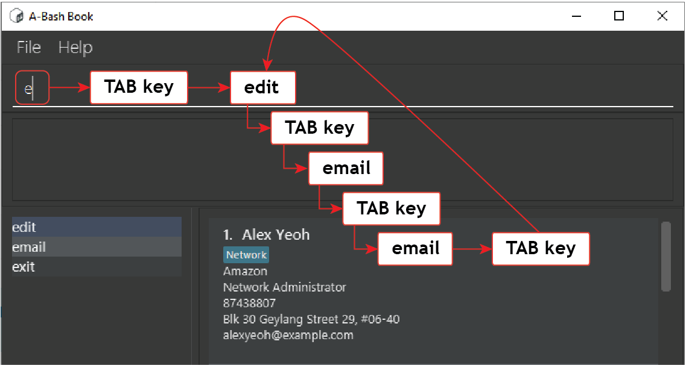

# Table of Contents

* Table of Contents
{:toc}

--------------------------------------------------------------------------------------------------------------------

# What is A-Bash Book?

A-Bash Book (ABB) is a powerful Employee and Business Contact Management System.

A contact management system serves as a centralised platform for organizations to store contacts important to the 
company.

A-Bash Book comes with features that facilitate quick access and bulk operations to super charge your organization's 
work flow.

A-Bash Book also uses a [Command Line Interface (CLI)](#glossary) and is fully operable by keyboard. Not only is the interface 
optimized for fast typists, but intuitive and welcoming for new users.

As employees come and go, their business contacts can be lost with them. Besides serving as a centralised platform, 
A-Bash Book was built to solve this problem by ensuring all the necessary contacts still remain in the system.

# User Interface


A-Bash Book's user interface can be categorized into 4 components.
- Command Box
- Result Display
- Command List Panel
- Person List Panel

You may begin by typing in your command in the **Command Box** and hitting <kbd>Enter</kbd> to execute the command. A status message of the command will be displayed in the **Result Display**.

On the left side, you may reference the available commands in the **Command List Panel**.

Lastly, all persons will be displayed on the right side in the **Person List Panel**.

## Person List Panel


Each person in the **Person List Panel** can have data.

This data is stored in their respective fields and can be identified by referring to the image above.

For more information on fields, you may refer to the [Field Summary](#field-summary).

--------------------------------------------------------------------------------------------------------------------

# How to Use the User Guide

You can use the [Table of Contents](#table-of-contents) to quickly navigate around the User Guide.

Before you continue reading the rest of the User Guide, take note of the following typographic conventions which are used to place emphasis on certain texts:

| Style                                                              | Description                         |
| ------------------------------------------------------------------------ | ------------------------------- |
| `Code`                                                                   | Command text                    |
| <kbd>Keyboard</kbd>                                                | Keyboard shortcut                |
| **Bolded Text**                                                          | Important words to take note of |
| <div markdown="span" class="alert alert-info">:information_source: **Note** </div> | Useful information.                           |
| <div markdown="span" class="alert alert-warning">:bulb: **Tip** </div>            | Helpful information that can enhance your experience.      |
| <div markdown="span" class="alert alert-danger">:exclamation: **Warning** </div>      | Potentially dangerous action that might cause data loss.                 |

--------------------------------------------------------------------------------------------------------------------

# Quickstart Guide

1. Ensure that you **Java 11** or above is installed in your computer.

1. Download the latest **abashbook.jar** from [here](https://github.com/AY2021S2-CS2103T-T12-3/tp/releases).

1. Copy the **abashbook.jar** to your preferred target folder to use as the _home folder_ to contain the A-Bash Book data.
   See [FAQ: What is the Home Folder?](#what-is-the-home-folder) to understand more.

1. Double-click the **abashbook.jar** to start the app. The program window should appear in a few seconds.
   Note that the app contains some sample data, as seen in the picture below. <br>

1. Type the command in the command box and press <kbd>Enter</kbd> to execute it. e.g. typing **`help`** and pressing <kbd>Enter</kbd> will open the help window.<br>
   Some example commands to try:

    * **`help`**: Opens the [Command Summary](#command-summary) in the app.

    * **`list`**: Lists all persons.

    * **`add`**: `-n John Doe -p 98765432 -e johnd@example.com -c Google -j HR Manager -a John street` : Adds a person named `John Doe` to the address book.

    * **`delete`**`3`: Deletes the 3rd person shown in the current list.

    * **`clear`**: Deletes all persons.

    * **`exit`**: Exits the app.

1. Refer to the [Features](#features) below for details of each command.

--------------------------------------------------------------------------------------------------------------------

# CLI Syntax

<div markdown="block" class="alert alert-info">

**:information_source: Note**<br>

For seasoned CLI users, this section is intended for users who are unfamiliar with CLI and the syntax.
Feel free to skip to [Features](#features).

</div>

Command Line Interface (CLI) is a text-based interface in which commands are entered. A-Bash Book is
CLI-based and will only interpret commands that are structured properly. This is called the
**syntax** where a specific arrangement of words and parameters form a command that A-Bash Book can
understand.

## Examples of Command

Here are some examples of how a command is documented in A-Bash Book:

- `select { clear | shown | show | INDEX... }`
- `edit { shown | selected | INDEX... } [-n NAME] [-r REMARK] [-t TAG]...`
- `tag delete { shown | selected | INDEX... } -t TAG [-t TAG]...`

## Command Flags

Command flags are specific options that can be specified to add more information in a command.

E.g `add -n John Doe -p 94326543 -e john@doe.com -a 45 Address #06-90`

Command: `add`

Command flags: `-n` , `-p`, `-e`, `-a`

Command flags might also take an argument, for example, `-n John Doe` or `-n -a -c`.

## Uppercase Words

Words in `UPPER_CASE` are the parameters that you can specify.

e.g. in `add -n NAME`, `NAME` is a parameter which can be used as `add -n John Doe`.

## Optional Parameters

Square brackets `[ ]` are used around an optional parameter.

If there are multiple optional parameters, each optional parameter is enclosed in its own set of square
brackets.

e.g `-n NAME [-t TAG]` can be used as `-n John Doe -t friend` or as `-n John Doe` but
not `-t friend`.

## Parameters That Can Repeat

Ellipsis (`...`) indicates the option to use a parameter multiple times, including zero times.

e.g. `[-t TAG]...` can be used as `""` (i.e. 0 times), `-t friend` (i.e. 1 time), `-t friend -t family` (i.e. 2 times) etc.

e.g. `-t TAG [-t TAG]...` specifies that there must be **at least one** tag and can be used
as `-t family` and `-t family -t cousin -t child`.

## Mutually Exclusive Parameters

Braces (`{ }`) are used around arguments where you must choose **only one** of the items inside the braces.

Vertical bars (`|`) are used to separate the items. There can be more than two
mutually exclusive parameters.

e.g. `select { clear | shown | show | INDEX...}` can be used as:

- `select clear`
- `select shown`
- `select show`
- `select 1`
- `select 1 2 3`

Invalid examples are:

- `select clear show`
- `select clear 1 2 3`

## Miscellaneous Information

- If a parameter is expected only once in the command, but is specified multiple times, only the
  last occurrence of the parameter will be taken.<br>
  e.g. `-p 12341234 -p 56785678`, only `-p 56785678` will be taken.

- Extraneous parameters for commands that do not take in parameters (such as `help`, `list`, `exit`
  and `clear`) will be ignored.<br>
  e.g. if the command specifies `help 123`, it will be interpreted as `help`.

- `shown` is a special index that refers to all persons that are visible in the filtered person
  list. e.g. `find surname` shows 10 persons. Executing `select shown` will select all 10 of the
  persons.

--------------------------------------------------------------------------------------------------------------------

# Features

<div markdown="block" class="alert alert-info">

**:information_source: Note**<br>

If you are not familiar with CLI and the syntax, please refer to the [CLI Syntax](#cli-syntax)
before proceeding.

</div>

## Adding a Person: `add`

Adds a person to the address book.

**Format**: `add -n NAME -p PHONE_NUMBER -e EMAIL -c COMPANY -j JOB_TITLE -a ADDRESS [-r REMARK] [-t TAG]...`

<div markdown="block" class="alert alert-info">

**:information_source: Note**<br>

* A person can have no remark.
* A person can have any number of tags (including 0).

</div>


**Examples**:

| Example                                                                                                                                | Description                                                                                                                                                                                                                                                                  |
| -------------------------------------------------------------------------------------------------------------------------------------- | ---------------------------------------------------------------------------------------------------------------------------------------------------------------------------------------------------------------------------------------------------------------------------- |
| `add -n John Doe -p 98765432 -e johnd@example.com -c Google -j HR Manager -a John street`                                              | Adds a person named `John Doe`, with phone number `91234567`, email address `johndoe@example.com`, company `Google`, job title `HR Manager`, and address `John street`.                                                                                                       |
| `add -n Betsy Crowe -p 1234567 -e betsycrowe@example.com -c Amazon -j Manager -a Betsy Avenue -t Recruiter -t Manager`                 | Adds a person named `Betsy Crowe`, with phone number `1234567`, email address `betsycrowe@example.com`, company `Amazon`, job title `Manager`, and address `Betsy Avenue`. This person is also tagged with the following tags: `Recruiter` and `Manager`.                     |
| `add -n Charlie -p 7654321 -e charlie@example.com -c Facebook -j Software Engineer -a Charlie Road -t IT -r Emergency contact`         | Adds a person named `Charlie`, with phone number `7654321`, email address `charlie@example.com`, company `Facebook`, job title `Software Engineer`, and address `Charlie Road`. This person is also tagged with the tag `IT`, and has the remark `Emergency contact`.         |

## Editing Person(s) : `edit`

Allows you to edit one or more person in the address book.

**Format**: `edit { shown | selected | INDEX... } [-n NAME] [-p PHONE] [-c COMPANY] [-j JOB_TITLE] [-e EMAIL] [-a ADDRESS] [-r REMARK] [-t TAG]...`

<div markdown="block" class="alert alert-info">

**:information_source: Note**<br>

* Edits the person at the specified `INDEX`. The index refers to the index number shown in the displayed person list. The index **must be a positive integer**, i.e 1, 2, 3, ...
* At least one of the optional fields must be provided.
* Existing values will be updated to the input values.
* When editing remark, the existing remark of the person will be removed, i.e adding of remark is not cumulative.
* When editing tags, the existing tags of the person will be removed, i.e adding of tags is not cumulative.
* To remove the person’s remark, type `-r` without specifying any remark after it.
* To remove all the person’s tags, type `-t` without specifying any tags after it.
* To edit all the shown person, type `edit shown`
* To edit all the selected person, type `edit selected` followed by the parameters

</div>


**Examples**:

| Example                                     | Description                                                                                                         |
| ------------------------------------------- | ------------------------------------------------------------------------------------------------------------------- |
| `edit 1 -p 91234567 -e johndoe@example.com` | Edits the phone number and email address of the 1st person to be `91234567` and `johndoe@example.com` respectively. |
| `edit 2 -n Betsy Crower -t `                | Edits the name of the 2nd person to be `Betsy Crower` and clears all of her existing tags.                          |
| `edit 3 -r `                                | Clears any existing remark of the 3rd person.                                                                       |
| `edit shown -r `                            | Clears any existing remark of all the displayed persons in person list.                                             |
| `edit selected -r `                         | Clears any existing remark of all the selected persons.                                                             |

<div markdown="block" class="alert alert-warning">

**:bulb: Tip**<br>

You can do bulk edit with:
* `edit 1 2 3` to edit persons at indexes 1, 2 and 3
* `edit shown` to edit all the shown persons
* `edit selected` to edit all the selected persons

</div>

## Deleting Persons : `delete`

Deletes the specified person(s) from the address book.

**Format**: `delete { shown | selected | INDEX... }`

<div markdown="block" class="alert alert-info">

**:information_source: Note**<br>

* Deletes the person at the specified `INDEX`/`INDEX...` or shown person list or selected list.
* The command **operates on the shown list** that may be modified by an earlier command.
* The index refers to the index number shown in the displayed person list.
* The index **must be a positive integer**, i.e 1, 2, 3, ...
* To delete all the shown person, type `delete shown`
* To delete all the selected person, type `delete selected`

</div>


**Examples**:

| Example                                      | Description                                                                                                           |
| -------------------------------------------- | --------------------------------------------------------------------------------------------------------------------- |
| `list`<br>`delete 2`                         | `list` displays all entries.<br>`delete 2` deletes the second entry in the list shown.                                |
| `find Betsy`<br>`delete 1`                   | `find Betsy` filters entries to the find result.<br> `delete 1` deletes the first entry in the filtered results list. |
| `select 1 2 3`   <br>      `delete selected` | Deletes selected entries 1, 2 and 3                                                                                   |
| `delete shown`                               | Deletes all the displayed persons in the person list                                                                  |

<div markdown="block" class="alert alert-warning">

**:bulb: Tip**<br>

You can do bulk delete with either `delete 1 2 3` to delete indexes 1, 2 and 3
or `delete shown` to delete all the shown persons.

</div>

## Listing All Person(s) : `list`

Lists all persons in the address book.

**Format**: `list`

## Locating Persons: `find`

Finds person(s) whose field(s) contain any of the given keywords.

<div markdown="block" class="alert alert-info">

**:information_source: Note**<br>

* Currently searchable fields: Name, Email, Tag, Remark
* The search is case-insensitive. e.g `hans` will match `Hans`
* The order of the keywords does not matter. e.g. `Hans Bo` will match `Bo Hans`
* Words are partially matched. e.g `sam` will match `Samantha`
* Similar words are matched. e.g `Shawn` with match `Shaun`
* Partially similar words will also be matched as a result of the above. e.g `Ben` will match `Elizabeth`
    * `bet` in `Elizabeth` is 1 character away from `Ben`
* Persons matching at least one keyword will be returned (i.e. `OR` search).
  e.g. `Hans Bo` will return `Hans Gruber`, `Bo Yang`

</div>


### Searching All Searchable Fields

The `find` command will execute for all searchable fields if no command flags are specified.

**Format**: `find KEYWORD [MORE_KEYWORDS]`

**Examples**:

| Example           | Description                                                                                                                                       |
| ----------------- | ------------------------------------------------------------------------------------------------------------------------------------------------- |
| `find Jon`        | Returns any person that matches `jon` partially in any of the searchable fields<br> e.g. a person tagged as `Janitor` (`Jon` is similar to `Jan`) |
| `find alex david` | Returns any person that matches `alex` or`david` partially in any of the searchable fields<br> e.g. persons named `Alex Yeoh`, `David Li`         |

### Searching by Specific Fields

The `find` command will execute for specific fields if you specify command flags.

**Format**: `find FIELD_PREFIX KEYWORD [MORE_KEYWORDS]`

<div markdown="block" class="alert alert-info">

**:information_source: Note**<br>

* Refer to [Field Summary](#field-summary) for the full list of fields and their corresponding command flags.
* Currently searchable fields: Name, Email, Tag, Remark
* You can only search 1 field at a time. e.g. `find -n Alice -t HR` is an invalid command

</div>

**Examples**:

| Example             | Description                                                                                                |
| ------------------- | ---------------------------------------------------------------------------------------------------------- |
| `find -n Alice Ben` | Returns persons named `Alicia Yen` (Similar) and `Benjamin Koh` (Partial)                                  |
| `find -t Market`    | Returns persons tagged with `Marketing` (Partial)                                                          |
| `find -r Manager`   | Returns persons with `Management Intern` (Similar) and `Human Resource Manager` (Partial) in their remarks |

## Filter Field Visibility: `filter`

Filter command allows you to toggle the visibility of person fields to allow you to hide fields that
you are not interested in.

**Format**: `filter [-FLAG]...`


These are the available flags:

- Name : `-n`
- Email : `-e`
- Company : `-c`
- Job Title : `-j`
- Address : `-a`
- Phone Number : `-p`
- Tag : `-t`
- Remark : `-r`

Flags in the filter command **do not need an argument** and **flags that are indicated will be
visible**.

**Examples**:

| example        | description                                              |
| -------------- | -------------------------------------------------------- |
| `filter`       | Shows all fields.                                        |
| `filter -a`    | Shows the person's name and address only.                |
| `filter -a -p` | Shows the person's name, address and phone number only.  |

## Selecting Person(s) : `select`

Allows you to incrementally select multiple person objects to apply actions on.

**Format**: `select { clear | shown | show | INDEX... }`

Sub Command Format:
* `select show`
* `select clear`
* `select shown`
* `select INDEX...`

The selected person(s) will have a highlighted index number to indicate selection status.


Examples:

| Example        | Description                                                                                                                        |
| -------------- | ---------------------------------------------------------------------------------------------------------------------------------- |
| `select show`  | Shows the selected person(s)                                                                                                       |
| `select shown` | Selects all the person in the visible person list (visible person list refers to the list of persons that are currently displayed) |
| `select clear` | Clears the current selection                                                                                                       |
| `select 1`     | Select the person with index 1 (incremental selection)                                                                             |
| `select 1 2`   | Select persons with index 1 and 2 (incremental selection)                                                                          |

<div markdown="block" class="alert alert-info">

**:information_source: Note**<br>

Incremental Selection and `shown`:

- Incremental selection means that selected items are "stacked" together. e.g. Executing `select 1`
  followed by `select 2` will result in person with index number 1 and 2 being selected.

- `shown` refers to all the person objects in the current visible person list (visible person list
  refers to the list of persons that are currently displayed).

</div>

<div markdown="block" class="alert alert-warning">

**:bulb: Tip**<br>

`select` command is best used with the following commands:

- [`edit` command](#editing-persons--edit)
- [`delete` command](#deleting-persons--delete)
- [`tag` command](#tagging-persons-tag)
- [`email` command](#email-persons-email)

</div>

## Email Person(s): `email`

Email command allows you to email selected persons using the operating system's default email
client. Email client must be configured to allow command separated email values.

<div markdown="block" class="alert alert-info">

**:information_source: Note**<br>

It is a known issue that Outlook for Windows do not have "Commas to Separate
Multiple Email Recipients" feature turned on. Follow the guide here to enable
it: <https://www.lifewire.com/commas-to-separate-email-recipients-1173680>

It is not possible for A-Bash Book to detect if the email client is opened. If
executing `email` command does not trigger the email client to appear, please check that an email
client is installed and configured properly.

</div>

**Format**: `email { shown | selected | INDEX... }`


**Examples**:

| Example          | Description                               |
| ---------------- | ----------------------------------------- |
| `email shown`    | Email all persons show in the person list |
| `email selected` | Email selected persons                    |
| `email 1`        | Email person at index 1                   |
| `email 1 2`      | Email person at index 1 and 2             |

## Tagging Person(s): `tag`

The tag command allows you to add and delete specific tags of persons.

* Tags are [case-insensitive](#glossary). e.g. `Photoshop` tag and `photoshop` tag are treated as the same tag.
* Same tags cannot be added to a person. e.g. A person cannot have both `Photoshop` and `photoshop` tags.

### Add Tags to Person(s): `tag add`

Add tags to persons in address book.

* A `tag add` command adding the same `photoshop` tag to a person with `Photoshop` tag will be executed successfully.
* When adding a same tag to a person, the command will be executed successfully, but the same tag will not be added to the person.
* The command result will display the total number of persons the command have successfully executed on and not the total number of persons the tags are added to.

**Format**: `tag add { shown | selected | INDEX ... } -t TAG...`


**Examples**:

| Example                                     | Description                                                                  |
| ------------------------------------------- | ---------------------------------------------------------------------------- |
| `tag add shown -t Photoshop`                | Adds `Photoshop` tag to the persons shown in the UI.                          |
| `tag add selected -t Illustrator`           | Adds `Illustrator` tag to the persons selected.                               |
| `tag add 1 2 3 -t Photoshop -t Illustrator` | Adds `Photoshop` and `Illustrator` tags to persons at index `1`, `2` and `3`. |

<div markdown="block" class="alert alert-warning">

**:bulb: Tip**<br>

You can bulk add tag by either doing:
* `tag add 1 2 3` to add tags to persons at indexes 1, 2 and 3 or,
* `tag add shown` to add tags to all the shown persons or,
* `tag add selected` to add tags to all the selected persons

</div>

### Delete Tags From Person(s): `tag delete`

Delete tags from persons in address book.

* A `tag delete` command deleting the `Photoshop` tag from a person without `Photoshop` tag will be executed successfully.
* When deleting a tag from a person without the tag, the command will be executed successfully, but no tags will be deleted from the person.
* The command result will display the total number of persons the command have successfully executed on and not the total number of persons the tags are deleted from.

**Format**: `tag delete { shown | selected | INDEX... } -t TAG...`


**Examples**:

| Example                                        | Description                                                                        |
| ---------------------------------------------- | ---------------------------------------------------------------------------------- |
| `tag delete shown -t Photoshop`                | Deletes `Photoshop` tag from the persons shown in the UI.                          |
| `tag delete selected -t Illustrator`           | Deletes `Illustrator` tag from the persons selected.                               |
| `tag delete 1 2 3 -t Photoshop -t Illustrator` | Deletes `Photoshop` and `Illustrator` tags from persons at index `1`, `2` and `3`. |

<div markdown="block" class="alert alert-warning">

**:bulb: Tip**<br>

You can bulk delete tag by either doing:
* `tag delete 1 2 3` to delete tags to persons at indexes 1, 2 and 3 or,
* `tag delete shown` to delete tags to all the shown persons or,
* `tag delete selected` to delete tags to all the selected persons

</div>

## Aliasing Commands : `alias`

The alias command allows you to create shortcut command (also known as command alias) to the actual command.

### Add an Alias: `alias add`

Adds an alias to address book.

**Format**: `alias add ALIAS COMMAND`


**Examples**:

| Example                             | Description                                                                                                                                                                                |
| ----------------------------------- | ------------------------------------------------------------------------------------------------------------------------------------------------------------------------------------------ |
| `alias add ls list`                 | Associates a new `ls` command to list, such that the `ls` command will behave identically to the list command (i.e `ls` will now generate the list of all persons).                           |
| `alias add ls list -n  -p  -e  -t` | Associates a new `ls` command to list, such that the `ls` command will behave identically to the list command with the options (i.e `list -n  -p  -e  -t`).                                |
| `alias add f find`                  | Associates a new `f` command to `find`, such that the `f` command will behave identically to the `find` command (i.e `f Alex Yeoh` will now return persons equal to or similar to Alex Yeoh). |

### Delete an Alias: `alias delete`

Deletes an existing alias from address book.

**Format**: `alias delete ALIAS`


**Examples**:

| Example           | Description            |
| ----------------- | ---------------------- |
| `alias delete ls` | Removes the alias `ls` |
| `alias delete f`  | Removes the alias `f`  |

### List All Aliases: `alias list`

Lists all alias(es) in the address book.

**Format**: `alias list`

<div markdown="span" class="alert alert-info">

**:information_source: Note** <br>

The Command List Panel will show a list of your aliases when you execute the `alias list`. On your next
keyboard action, the list of your aliases will disappear and show the list of existing commands again.

</div>


## Autocomplete

### Commands



Commands in the command box can be autocompleted by pressing the <kbd>Tab</kbd> key.

**Examples**:

To execute the command `delete`,

Typing `del` followed by <kbd>Tab</kbd> will auto complete `del` to `delete`.

| Current text in command box | Key Press | Result |
| ------------------------------ | -------------| ----|
| `ad` | <kbd>Tab</kbd> | `add` |
| `edi` | <kbd>Tab</kbd> | `edit` |
| `ex` | <kbd>Tab</kbd> | `exit` |
| `he` | <kbd>Tab</kbd> | `help` |
| `li` | <kbd>Tab</kbd> | `list` |
| `s` | <kbd>Tab</kbd> | `select` |


<div markdown="block" class="alert alert-info">

**:information_source: Note**<br>

In the command box, it is also possible to cycle through **existing** commands with <kbd>Tab</kbd>.

</div>

### Flags

Command flags can be autocompleted at the end of your command text by pressing the <kbd>Tab</kbd> key.

<div markdown="block" class="alert alert-info">

**:information_source: Note**<br>

- If your flag has no content, the next available flag will be replaced and cycled.
- If your flag has content, the next available flag will be appended to your command text.

</div>

| Supported Commands                        | Available command flags|
| ------------------------------ | ----------------------------------------------------------------------------------------------------------------------------------------------------- |
| `add`                       | `-n` , `-p`, `-e`, `-a`, `-r`, `-t` |
| `edit`                       | `-n` , `-p`, `-e`, `-a`, `-r`, `-t` |

<div markdown="block" class="alert alert-info">

**:information_source: Note**<br>

For `add` command, a space character should follow the add command for flags to begin
autocompletion.

</div>

| Current text in command box | Key Press | Result |
| ------------------------------ | -------------| ----|
| `add␣` | <kbd>Tab</kbd> | `add -n` |
| `add -n` | <kbd>Tab</kbd> | `add -p` |
| `add -n John Doe` | <kbd>Tab</kbd> | `add -n John Doe -p` |
| `add -n John Doe -p 94326543 -e john@doe.com` | <kbd>Tab</kbd> | `add -n John Doe -p 94326543 -e john@doe.com -a ` |
| `edit 1` | <kbd>Tab</kbd> | `edit 1 -n` |
| `edit 1 -n` | <kbd>Tab</kbd> | `edit 1 -p` |
| `edit 1 -n John Dow` | <kbd>Tab</kbd> | `edit 1 -n John Dow -p` |

### Index

<div markdown="block" class="alert alert-info">

**:information_source: Note**<br>

Autocomplete index only works for the `Edit` and `Delete` commands.

</div>

Index can be autocompleted by pressing the <kbd>Up/Down</kbd> keys when the supported commands are fully typed out.

**Examples**

| Current text in command box | Key Press | Result |
| ------------------------------ | -------------| ----|
| `edit` | <kbd>Up/Down</kbd> | `edit 1` |
| `edit 1` | <kbd>Down</kbd> | `edit 2` |
| `edit 2` | <kbd>Up</kbd> | `edit 1` |
| `delete` | <kbd>Up/Down</kbd> | `delete 1` |
| `delete 1` | <kbd>Down</kbd> | `delete 2` |
| `delete 2` | <kbd>Up</kbd> | `delete 1` |

## Viewing Help : `help`

Displays a pop up window with a summary of the commands available for use in A-Bash Book.

**Format**: `help`


## Clearing All Entries : `clear`

Clears all entries from the address book.

<div markdown="span" class="alert alert-danger">

**:exclamation: Warning**<br>

This action is irreversible. Do not run this command with actual data unless you want to delete all entries.

</div>


**Format**: `clear`

## Exiting A-Bash Book : `exit`

Saves and exits A-Bash Book.

**Format**: `exit`

## Saving the Data

A-Bash Book data is saved in the hard disk automatically after any command that changes the data. There is no need to save manually.

## Editing the Data File

A-Bash Book data is saved as a JSON file `[JAR file location]/data/abashbook.json`. Advanced users
are welcome to update data directly by editing that data file.

<div markdown="span" class="alert alert-danger">

**:exclamation: Warning**<br>

If changes to the data file renders its format invalid, A-Bash Book will discard all data and start with an empty data file at the next run.

</div>

--------------------------------------------------------------------------------------------------------------------

# FAQ

## What Is the Home Folder?

The home folder is the file system folder on your computer where A-Bash Book stores your data.

```
foldername (Home Folder)
├── abashbook.jar
├── abashbook.log.0
├── config.json
├── data
│   ├── abashbook.json
│   └── alias.json
├── preferences.json
```

## How Do I Transfer My Data to Another Computer?

Install the app in the other computer and overwrite the empty data file it creates with the file that contains the data of your previous A-Bash Book home folder.

--------------------------------------------------------------------------------------------------------------------

# Command Summary

| Action           | Format, Examples                                                                                                                                                                                                                             |
| ---------------- | -------------------------------------------------------------------------------------------------------------------------------------------------------------------------------------------------------------------------------------------- |
| **Add**          | `add -n NAME -p PHONE_NUMBER -e EMAIL -c COMPANY -j JOB_TITLE -a ADDRESS [-r REMARK] [-t TAG]...` <br> e.g. `add -n John Doe -p 98765432 -e johnd@example.com -c Google -j HR Manager -a John street -r Likes ramen -t friend -t colleague` |
| **Clear**        | `clear`                                                                                                                                                                                                                                      |
| **Delete**       | `delete { shown | selected | INDEX... }` <br> e.g. `delete 3`                                                                                                                                                                               |
| **Edit**         | `edit { shown | selected | INDEX... } [-n NAME] [-p PHONE] [-c COMPANY] [-j JOB_TITLE] [-e EMAIL] [-a ADDRESS] [-r REMARK] [-t TAG]...` <br> e.g.,`edit 2 -n James Lee -e jameslee@example.com`                                              |
| **Find**         | `find KEYWORD [MORE_KEYWORDS]` <br> e.g. `find James Jake`                                                                                                                                                                                  |
| **Filter**       | `filter [-OPTION]...` <br> e.g. `filter -p -a` to see only the phone number and address                                                                                                                                                     |
| **Select**       | `select { clear | shown | show | INDEX... }`                                                                                                                                                                                                 |
| **Email**        | `email { shown | selected | INDEX... }`                                                                                                                                                                                                      |
| **List**         | `list`                                                                                                                                                                                                                                       |
| **Help**         | `help`                                                                                                                                                                                                                                       |
| **Add Alias**    | `alias add [ALIAS] [COMMAND]`<br> e.g. `alias add ls list`                                                                                                                                                                                   |
| **Delete Alias** | `alias delete [ALIAS]`<br> e.g. `alias delete ls`                                                                                                                                                                                            |
| **List Alias**   | `alias list`                                                                                                                                                                                                                                 |
| **Add Tag**      | `tag add { shown | selected | INDEX... } -t TAG...` <br> e.g. `tag add shown -t Illustrator`                                                                                                                                   |
| **Delete Tag**   | `tag delete { shown | selected | INDEX... } -t TAG...` <br> e.g. `tag delete 1 2 3 -t Photoshop -t Illustrator`                                                                                                                                         |

# Field Summary

| Mandatory | Field        | Command Flag | Restrictions                                                                                                                                                                                                                                                                                                                                                                                                                |
| --------- | ------------ | ------------ | --------------------------------------------------------------------------------------------------------------------------------------------------------------------------------------------------------------------------------------------------------------------------------------------------------------------------------------------------------------------------------------------------------------------------- |
| Yes       | Name         | `-n`         | Names should only contain alphanumeric characters and spaces, and should not be blank                                                                                                                                                                                                                                                                                                                                       |
| Yes       | Email        | `-e`         | Emails should be of the format local-part@domain and adhere to the following constraints:<br>1. The local-part should only contain alphanumeric characters and the following special characters enclosed in parentheses (`!#$%&'*+/=?``{|}~^.-`). <br>2. This is followed by a '@' and then a domain name. The domain name must:<br>    - be at least 2 characters long<br>    - start and end with alphanumeric characters   |
| Yes       | Company      | `-c`         | Company can contain any character, and it should not be blank                                                                                                                                                                                                                                                                                                                                                               |
| Yes       | Job Title    | `-j`         | Job Title can contain any character, and it should not be blank                                                                                                                                                                                                                                                                                                                                                             |
| Yes       | Address      | `-a`         | Addresses can contain any character, and it should not be blank                                                                                                                                                                                                                                                                                                                                                             |
| Yes       | Phone Number | `-p`         | Phone numbers should only contain numbers, and be at least 3 digits long                                                                                                                                                                                                                                                                                                                                                    |
| No        | Tag          | `-t`         | Tags names should only alphanumeric characters, and should not contain spaces or symbols                                                                                                                                                                                                                                                                                                                                    |
| No        | Remark       | `-r`         | Remark can contain any character                                                                                                                                                                                                                                                                                                                                                                                            |

# Glossary

| Term             | Explanation                                                                                                                                                                                        |
| ---------------- | -------------------------------------------------------------------------------------------------------------------------------------------------------------------------------------------------- |
| Bash             | The well known terminal interpreter                                                                                                                                                                |
| CLI              | Command Line Interface. A text-based interface in which commands can be entered.                                                                                                                   |
| GUI              | Graphical User Interface                                                                                                                                                                           |
| JSON             | JavaScript Object Notation, data storage format                                                                                                                                                    |
| Terminal         | The Command Line Interface where text-based commands are entered.                                                                                                                                  |
| Case-insensitive | Uppercase `ABC` and lowercase `abc` letters are treated as being the same. <br> - `Alex Yeoh` and `alex yeoh` are treated as the same. <br> - `Photoshop` and `photoshop` are treated as the same. | 
