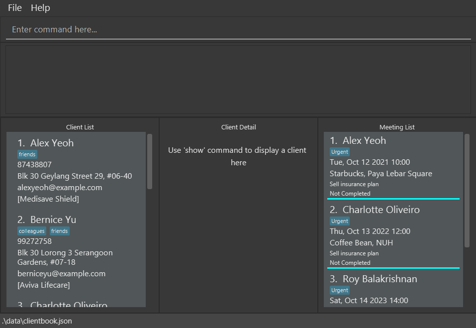
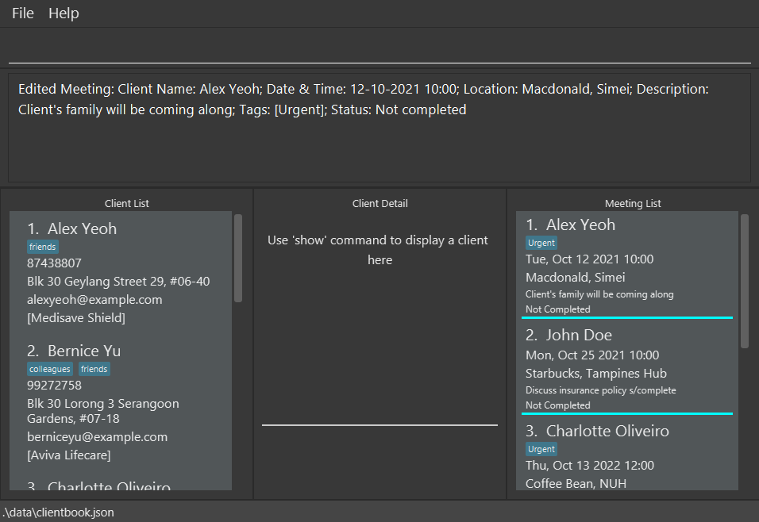
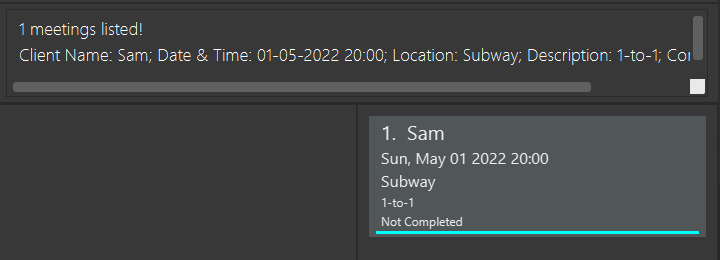

iScam is a **desktop app for insurance agents to manage clients and meetings, optimized for use via a Command Line Interface** (CLI) while still having the benefits of a Graphical User Interface (GUI). If you can type fast, iScam can get your client management tasks done faster than traditional GUI apps.

* Table of Contents
{:toc}

--------------------------------------------------------------------------------------------------------------------

## Quick start

1. Ensure you have Java `11` or above installed in your Computer.

1. Download the latest `iScam.jar` from [here](https://github.com/AY2021S2-CS2103-W17-4/tp/releases).

1. Copy the file to the folder you want to use as the _home folder_ for your iScam.

1. Double-click the file to start the app. The GUI similar to the below should appear in a few seconds. Note how the app contains some sample data. 
   

1. Type the command in the command box and press Enter to execute it. e.g. typing **`help`** and pressing Enter will open the help window. 
   Some example commands you can try:

   * **`list`** : Lists all clients.

   * **`add`**`n/John Doe p/98765432 e/johnd@example.com l/John street, block 123, #01-01 ip/MediShield Life i/john_doe.png t/friends` : Adds a client named `John Doe` to iScam.

   * **`edit`**`1 p/98765432`: Change the phone number of the 1st client shown in the current list to `98765432`

   * **`find`**`John`: Find a client named `John`

   * **`findplan`**`MediShield Life`: Find a client with `MediShield Life` insurance plan

   * **`show`**`2` : Shows the 2nd client shown in the list in the bottom right detail panel

   * **`delete`**`3` : Deletes the 3rd client shown in the current list.

   * **`listmeet`** : Lists all meetings.

   * **`addmeet`**`c/John Doe on/21-10-2021 10:00 l/Starbucks d/Catch up t/friend` : Adds a meeting with a client named `John Doe` to iScam.

   * **`editmeet`**`1 d/Discuss insurance plan`: Change the description of the 1st meeting shown in the current list to `Discuss insurance plan`

   * **`findmeet`**`John`: Find a meeting with the keyword `John`

   * **`deletemeet`**`3` : Deletes the 3rd meeting shown in the current list.

   * **`clear`** : Deletes all clients and meetings.

   * **`exit`** : Exits the app.

1. Refer to the [Features](#features) below for details of each command.

:bulb: **Tip:**
If you are facing issues launching the application, go to the `data` folder in `[JAR file location]/data` and delete both the `clientbook.json` and `meetingbook.json` files and try launching again.

--------------------------------------------------------------------------------------------------------------------

## Features

**:information_source: Notes about the command format:** 

* Words in `UPPER_CASE` are the parameters to be supplied by the user. 
  e.g. in `add n/NAME`, `NAME` is a parameter which can be used as `add n/John Doe`.

* Items in square brackets are optional. 
  e.g `n/NAME [t/TAG]` can be used as `n/John Doe t/friend` or as `n/John Doe`.

* Items with `(s)`​ after them can be used multiple times including zero times. 
  e.g. `[t/TAG(s)]​` can be used as ` ` (i.e. 0 times), `t/friend`, `t/friend t/family` etc.

* Parameters can be in any order. 
  e.g. if the command specifies `n/NAME p/PHONE_NUMBER`, `p/PHONE_NUMBER n/NAME` is also acceptable.

* If a parameter is expected only once in the command, but you specified it multiple times, only the last occurrence of the parameter will be taken. 
  e.g. if you specify `p/82341234 p/86785678`, only `p/86785678` will be taken.

* Extraneous parameters for commands that do not take in parameters (such as `help`, `list`, `listmeet`, `exit` and `clear`) will be ignored. 
  e.g. if the command specifies `help 123`, it will be interpreted as `help`.

### Client Management
#### Adding a client: `add`
Adds a client to iScam.

Format: `add n/NAME p/PHONE e/EMAIL l/LOCATION [ip/INSURANCE_PLAN] [i/IMAGE_FILE] [t/TAG(s)]​`

**:information_source: Notes about the limit for inputs:** 

* NAME in `n/NAME` should not be than 50 alphanumeric characters.  
  e.g `n/John Doe 123` is acceptable 
  
* PHONE in `p/PHONE` can only consist of 8 digits and start with `6`, `8` or `9`. It should **not** contain spaces between numbers.  
  e.g `p/81234567` is acceptable  
  Additional info: Singapore numbers are only 8 digits long. Should you need to add a foreign number, you can always add it as a `tag`

* EMAIL in `e/EMAIL` should not be longer than 254 characters. It should also be of the format local-part@domain  
  e.g `e/someone@email.com` is acceptable

* LOCATION in `l/LOCATION` should not be blank or longer than 100 characters.  
  e.g `l/Starbucks @ Frontier` is acceptable
  
* IMAGE_FILE in `i/IMAGE_FILE` should be a single file name with no whitespaces and must end with
  a file extension either `.jpg, .jpeg or .png`.  
  e.g. `john_doe.png` is a acceptable   

* INSURANCE_PLAN in `ip/INSURANCE_PLAN` should not be longer than 50 alphanumeric characters.  
  e.g `ip/Premium Savings Plan 2` is acceptable

* Individual TAG(s) in `t/TAG(s)` should not be longer than 50 alphanumeric characters and cannot contain spaces.  
  e.g `t/friend` is acceptable
  

  

:exclamation: **Caution:**
The above limits apply for all [client commands](#client-management)

  

:bulb: **Tip:**
A client can have any number of tags (including 0). For optimal usage of the app, try to keep less than 10 tags per client

:bulb: **Tip:**
A client can have any number of insurance plans (including 0). For optimal usage of the app, try to keep less than 10 insurance plans per client

:bulb: **Tip:**
You can add a profile picture for your client by first adding the picture file into [JAR file location]/data/[picture file].
Then, include the file name under the i/ prefix when adding client. The image should not be corrupted as the image would not be displayed if so.

 

Examples:
* `add n/John Doe p/98765432 e/johnd@example.com l/01 Singapore Street, #23-45 ip/MediShield Life i/john_doe.png t/friends t/owesMoney`
    > Output: `New client added: John Doe; Phone: 98765432; Email: johnd@example.com; Location: 01 Singapore Street, #23-45; Insurance Plan: MediShield Life; Tags: [owesMoney][friends]; Image: john_doe.png`
* `add n/Betsy Crowe e/betsycrowe@example.com l/Newgate Prison p/12345678 t/criminal i/criminal.jpeg`
    > Output: `New client added: Betsy Crowe; Phone: 12345678; Email: betsycrowe@example.com; Location: Newgate Prison; Tags: [criminal]; Image: criminal.jpeg`

#### Listing all clients : `list`

Displays the list of clients and client details.

Format: `list`

#### Showing a particular client : `show`

Displays client details on the right panel of the Ui.

Format: `show INDEX`

* Shows the client at the specified `INDEX`. The index refers to the index number shown in the displayed client list. The index **must be a positive integer** 1, 2, 3, …​

Example:
* `show 1` Shows the details (such as name, phone number, profile picture, insurance, etc) of the first Client on the right panel of the UI

#### Editing a client : `edit`

Edits an existing client in iScam.

Format: `edit INDEX [n/NAME] [p/PHONE] [e/EMAIL] [l/LOCATION] [ip/INSURANCE_PLAN] [i/IMAGE_FILE] [t/TAG(s)]​`

* Edits the client at the specified `INDEX`. The index refers to the index number shown in the displayed client list. The index **must be a positive integer** 1, 2, 3, …​
* At least one of the optional fields must be provided.
* Existing values will be updated to the input values.
* When editing tags, the existing tags of the client will be removed i.e adding of tags is not cumulative.
* You can remove all the client’s tags by typing `t/` without
    specifying any tags after it.
* You can also remove the client's existing insurance plan by typing `ip/` without specifying any insurance plan after it.
* When specifying which `IMAGE_FILE` to use, the file extension must be included in the `IMAGE_FILE` name 
  and must not contain whitespaces.

Examples:
*  `edit 1 p/91234567 e/johndoe@example.com` Edits the phone number and email location of the 1st client to be `91234567` and `johndoe@example.com` respectively
*  `edit 2 n/Betsy Crower t/ ip/` Edits the name of the 2nd client to be `Betsy Crower` and clears all existing tags and insurance plans

#### Finding clients by name: `find`

Finds clients whose names contain any of the given keywords.

Format: `find KEYWORD [MORE_KEYWORDS]`

* The search is case-insensitive. e.g `hans` will match `Hans`
* The order of the keywords does not matter. e.g. `Hans Bo` will match `Bo Hans`
* Only the name is searched.
* Only full words will be matched e.g. `Han` will not match `Hans`
* Clients matching at least one keyword will be returned (i.e. `OR` search).
  e.g. `Hans Bo` will return `Hans Gruber`, `Bo Yang`

Examples:
* `find John` returns `john` and `John Doe`
* `find alex david` returns `Alex Yeoh`, `David Li` 
  

#### Finding clients by insurance plan: `findplan`

Finds clients whose insurance plan contains any of the given keywords.

Format: `findplan KEYWORD [MORE_KEYWORDS]`

* The search is case-insensitive. e.g `medishield` will match `MediShield`
* The order of the keywords does not matter. e.g. `Life MediShield` will match `MediShield Life`
* Only the insurance plan is searched.
* Only full words will be matched e.g. `Medi` will not match `MediShield`
* Clients matching at least one keyword will be returned (i.e. `OR` search).
  e.g. `MediShield Life` will return `MediShield Pro`, `Life Protection`

Examples:
* `findplan MediShield Life` returns `medishield` and `MediShield Life`
* `findplan medishield eldershield` returns `MediShield Life`, `ElderShield`

#### Deleting a client : `delete`

Deletes the specified client from iScam.

Format: `delete INDEX`

* Deletes the client at the specified `INDEX`.
* The index refers to the index number shown in the displayed client list.
* The index **must be a positive integer** 1, 2, 3, …​

Examples:
* `list` followed by `delete 2` deletes the 2nd client in iScam
* `find Betsy` followed by `delete 1` deletes the 1st client in the results of the `find` command

### Meeting Management

**:information_source: Notes about the special fields of a Meeting:** 

* Any date-time field `DATE_TIME` follows the format of `dd-MM-yyyy HH:mm` where:
  * `dd` is the day of the month in double digits.
  * `MM` is the month in double digits.
  * `yyyy` is the year.
  * `HH:mm` is the time in 24:00 format.

#### Adding a meeting: `addmeet`

Adds a meeting to iScam.

Format: `addmeet c/CLIENT_NAME on/DATE_TIME l/LOCATION d/DESCRIPTION [t/TAG(s)]`

**:information_source: Notes about the limit for inputs:** 

* CLIENT_NAME in `c/CLIENT_NAME` should not be longer than 50 alphanumeric characters.  
  e.g `c/John Doe 123` is acceptable

* DATE_TIME in `on/DATE_TIME` should be in the format of `dd-MM-yyyy HH:mm`  
  e.g `on/25-10-2021 10:00` is acceptable  
  Additional info: `DATE_TIME` **cannot be in the past** as of the moment when this command is called.
  Additional info: There can only be 1 meeting happening at the date and time specified in `DATE_TIME`.

* LOCATION in `l/LOCATION` should not be blank or longer than 100 characters.  
  e.g `l/Starbucks @ Frontier` is acceptable

* DESCRIPTION in `d/DESCRIPTION` should not be blank or longer than 1000 characters.  
  e.g `d/Plan expiring soon.` is acceptable

* Individual TAG(s) in `t/TAG(s)` should not be longer than 50 alphanumeric characters and cannot contain spaces.  
  e.g `t/friend` is acceptable

  

:exclamation: **Caution:**
The above limits apply for all [meeting commands](#meeting-management)

  

:bulb: **Tip:**
A client can have any number of meetings (including 0). For optimal usage of the app, try to keep less than 10 meetings per client

Example:
* `addmeet c/John Smith on/20-02-2022 15:00 l/Starbucks, Serangoon d/Discuss on insurance plans t/VIP`
    > Output: `New meeting added: Client Name: John Smith; Date & Time: 20-02-2022 15:00; Location: Starbucks, Serangoon; Description: Discuss on insurance plans; Tags: [VIP]; Status: Not completed`

#### Listing all meetings: `listmeet`

Displays the full meeting list without any filtering applied via `findmeet`.

Format: `listmeet`
* The meetings are grouped by its completion status (Incomplete / Complete) with the incomplete meetings at the top of
  the list.
* Within each group, the meetings are sorted by their chronological order with the most upcoming meeting at the top of
  the group.

#### Editing a meeting: `editmeet`

Edits an existing meeting in iScam.

Format: `editmeet INDEX [c/CLIENT_NAME] [on/DATE_TIME] [l/LOCATION] [d/DESCRIPTION] [t/TAG(s)] [s/COMPLETION_STATUS]`

* `INDEX` refers to the meeting's index number shown in the displayed meeting list. The index **must be a positive
  integer 1, 2, 3, …**.
* At least one of the optional fields must be provided.
* If the field already has an existing value, it will be replaced by the input value.
* `DATE_TIME` **cannot be in the past** as of the moment when this command is called.
* `DATE_TIME` **cannot be in conflict** with the date and time of any existing meeting.
* When `TAG`s are given, the existing tags will be removed and replaced with the new given tags. (i.e adding of tags is
  not cumulative)
* `COMPLETION_STATUS` **only accepts `complete` or `incomplete`**.
* If the meeting's status is already `complete`, no fields can be edited unless the status field is also being set to
  `incomplete`.

Example:
* `editmeet 1 l/Macdonald, Simei d/Client's family will be coming along`
  

#### Relocating a meeting: `relocate`

Modifies the location of an existing meeting in iScam.

Format: `relocate INDEX l/LOCATION`

* `INDEX` refer to the meeting's index number shown in the displayed meeting list. The index **must be a positive
  integer 1, 2, 3, …**.
* If the meeting specified by `INDEX` is already `complete`, this meeting cannot be relocated.
* `LOCATION` cannot be blank and can have at most 100 characters.

Example:
* `relocate 1 l/KFC, Block 556 Bugis`

#### Rescheduling a meeting: `reschedule`

Modifies the date and time of an existing meeting in iScam.

Format: `reschedule INDEX on/DATE_TIME`

* `INDEX` refer to the meeting's index number shown in the displayed meeting list. The index **must be a positive
  integer 1, 2, 3, …**.
* If the meeting specified by `INDEX` is already `complete`, this meeting cannot be rescheduled.
* `DATE_TIME` **cannot be in the past** as of the moment when this command is called.
* `DATE_TIME` **cannot be in conflict** with the date and time of any existing meeting.

Example:
* `reschedule 3 on/08-10-2021 20:00`

#### Finding meetings by keywords: `findmeet`
Displays the meetings which has its fields matched by any given keywords.

Format: `findmeet KEYWORD [MORE_KEYWORDS]`

* The search is case-insensitive. e.g `john` will match `John`
* The order of the keywords does not matter. e.g. `plans discussion` will match `discuss plans`
* Both full and partial keywords can match. e.g. `insurance` and `sur` will both match `insurance`
* The keywords will be match against all parameters of a meeting.
    * To find by the status of a meeting, use keyword `complete` to find completed meetings and keyword `incomplete`
    to find incomplete meetings.
    * To find by the date and time of a meeting, the keyword can be a partial date, a full date or a day of the week
      (e.g. `10-02`, `10-02-2022`, `sat` or `saturday`) .
* Meeting matching all keywords will be returned (i.e. `AND` search). e.g. `Johnson Smith` will not return
  `Sam Smith` and `Johnson Drake` but will return `Johnson Shawn Smith`.
* `findmeet johnson 2020` can return a meeting with Johnson on 2020
* `findmeet complete` returns completed meetings
* Both `findmeet tue` and `findmeet tuesday` returns meetings that take place on Tuesday
* `findmeet 05-2022` returns meetings that take place on May 2022
* `findmeet 01-05-2022 Sam` can return a meeting with Sam on 1 May 2022
  

#### Completing a meeting: `donemeet`
Marks a specified existing meeting from iScam as completed.

Format: `donemeet INDEX`

* `INDEX` refer to the meeting's index number shown in the displayed meeting list. The index **must be a positive
  integer 1, 2, 3, …**.

#### Deleting a meeting: `deletemeet`
Deletes a specified existing meeting from iScam.

Format: `deletemeet INDEX`

* `INDEX` refer to the meeting's index number shown in the displayed meeting list. The index **must be a positive
  integer 1, 2, 3, …**.

### General
#### Viewing help : `help`

Shows a message explaining how to access the help page.

Format: `help`

#### Clearing all entries : `clear`

Clears all clients and meeting entries from iScam.

Format: `clear`

#### Exiting the program : `exit`

Exits the program.

Format: `exit`

### Customisation
#### Adding images for clients

Images for clients can be added by placing an image in the `/data` folder, with the
`clientbook.json` and `meetingbook.json` files. Any `IMAGE_FILE` used must be of file
type `.jpg`, `.jpeg` or `.png` and the name of the file must not contain whitespaces.

### Managing Data Files
#### Saving the data

iScam data are saved in the hard disk automatically after any command that changes the data. There is no need to save manually.

#### Editing the data files

iScam data are saved as JSON files. Advanced users are welcome to update data directly by editing those data files.
Client data are saved in `[JAR file location]/data/clientbook.json`.
Meeting data are saved in `[JAR file location]/data/meetingbook.json`.

:exclamation: **Caution:**
If your changes to the data file makes its format invalid, iScam will discard all data and start with an empty data file at the next run.

--------------------------------------------------------------------------------------------------------------------

## FAQ

**Q**: How do I transfer my data to another Computer? 
**A**: Install the app in the other computer and overwrite the empty data file it creates with the file that contains the data of your previous iScam home folder.

--------------------------------------------------------------------------------------------------------------------

## Command summary

Action | Format, Examples
--------|------------------
**Help** | `help`
**Add Client** | `add n/NAME p/PHONE e/EMAIL l/LOCATION [ip/INSURANCE_PLAN] [i/IMAGE_FILE] [t/TAG(s)]​`   e.g., `add n/John Doe p/98765432 e/johnd@example.com l/01 Singapore Street, #23-45 ip/MediShield Life i/john_doe.png t/friends t/owesMoney`
**List Clients** | `list`
**Show Client** | `show INDEX`   e.g., `show 1`
**Edit Client** | `edit INDEX [n/NAME] [p/PHONE] [e/EMAIL] [l/LOCATION] [ip/INSURANCE_PLAN] [i/IMAGE_FILE] [t/TAG(s)]​`  e.g.,`edit 2 n/James Lee e/jameslee@example.com`
**Find Client by Name** | `find KEYWORD [MORE_KEYWORDS]`  e.g., `find James Jake`
**Find Client by Insurance Plan** | `findplan KEYWORD [MORE_KEYWORDS]`   e.g., `findplan MediShield`
**Delete Client** | `delete INDEX`  e.g., `delete 3`
**Add Meeting** | `addmeet c/CLIENT_NAME on/DATE_TIME l/LOCATION d/DESCRIPTION [t/TAG(s)]`   e.g., `addmeet c/John Doe on/21-10-2021 10:00 l/Starbucks, Tampines Hub d/Discuss insurance policy t/Urgent t/Premium`
**List Meetings** | `listmeet`
**Edit Meeting** | `editmeet INDEX [c/CLIENT_NAME] [on/DATE_TIME] [l/LOCATION] [d/DESCRIPTION] [t/TAG(s)] [s/COMPLETION_STATUS]​`  e.g.,`editmeet 2 c/James Lee s/complete`
**Relocate Meeting** | `relocate INDEX l/LOCATION`   e.g., `relocate 1 l/KFC, Blk 556 Bugis`
**Reschedule Meeting** | `reschedule INDEX on/DATE_TIME`   e.g., `reschedule 2 on/20-10-2021 10:00`
**Find Meeting** | `findmeet KEYWORD [MORE_KEYWORDS]`  e.g., `findmeet 05-2022 Sam`
**Delete Meeting** | `deletemeet INDEX`  e.g., `deletemeet 3`
**Complete Meeting** | `donemeet INDEX`   e.g., `donemeet 3`
**Clear All** | `clear`
**Exit** | `exit`
