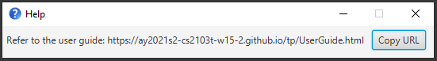
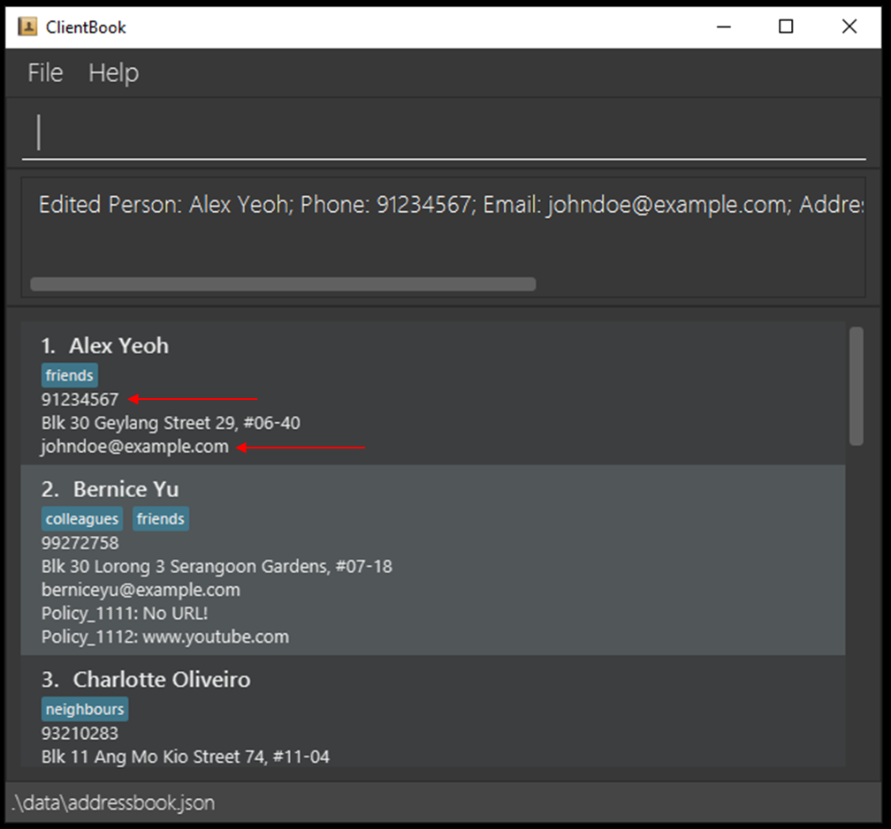
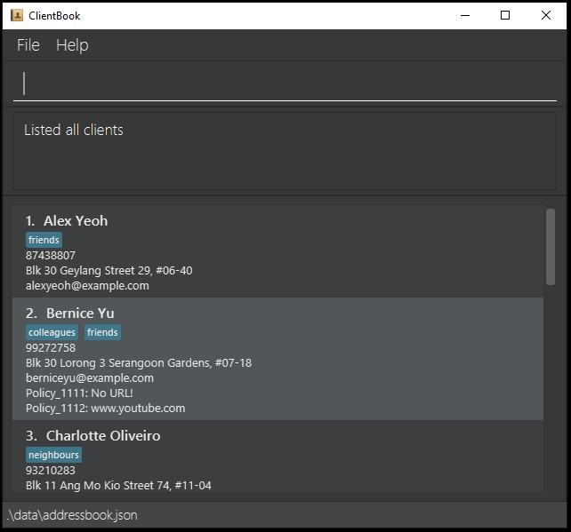
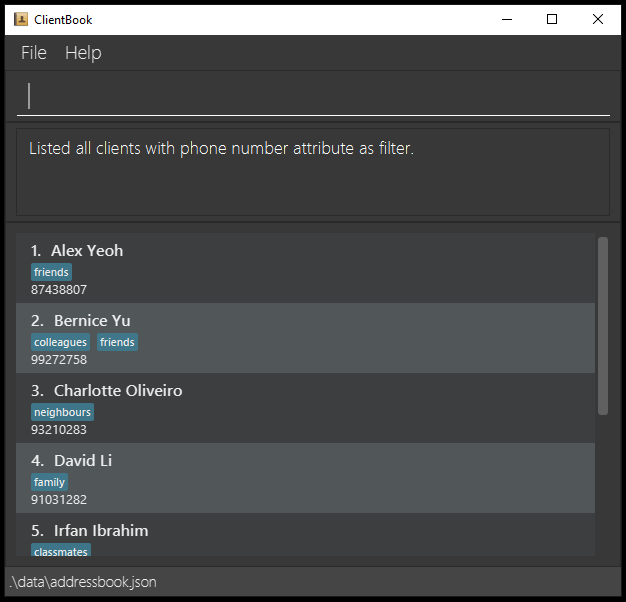
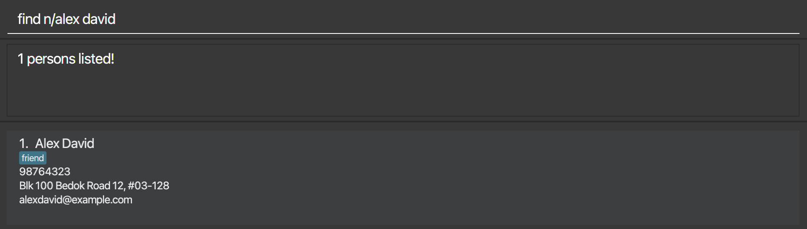
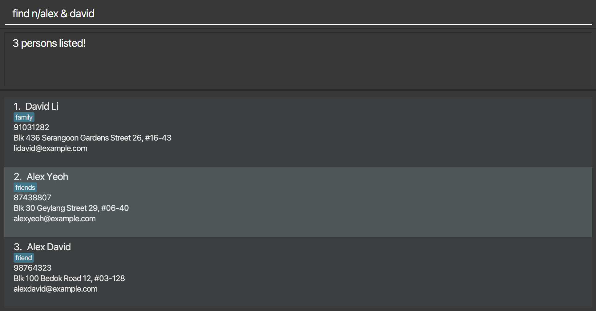
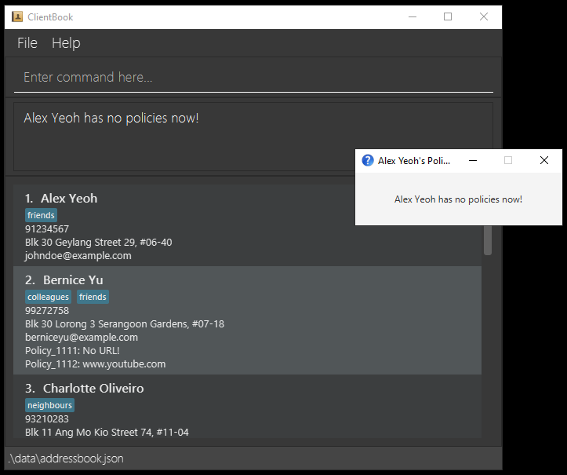
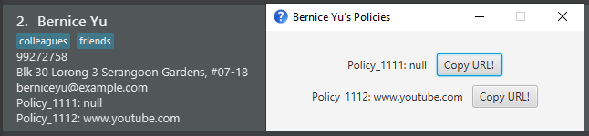
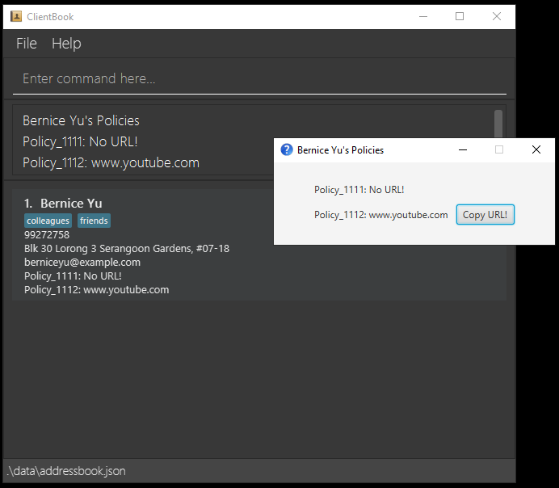

# ClientBook

ClientBook is an application for managing client contacts, optimized for use via a Command Line Interface (CLI) while still having the benefits of a Graphical User Interface (GUI). 
If you are and insurance agent who can type fast, ClientBook can help _you_ accomplish your client management tasks done faster than traditional GUI apps.

## Why ClientBook?

ClientBook is designed for insurance agents who are always on the go. We understand the **pain** and **inconvenience** of having to **navigate around 
your screen without a mouse** while you are out meeting a client, as well as the **limitations of a laptop's battery life**. 

Thus, ClientBook is born! 

Requiring **minimal interactions with your cursor**, ClientBook still allows you to complete essential contact management 
tasks with our minimal yet essential set of contact management features.  

Consisting of only the **most necessary features** any good insurance agent will need while on the go, ClientBook is hence extremely easy on your laptop's battery!

## Quick Start

1. Ensure you have Java `11` or above installed in your Computer.
   * To check if you have this installed or for instructions on how to install, refer to our FAQ [here](#FAQ).

1. Download the latest `clientbook.jar` [here](https://github.com/AY2021S2-CS2103T-W15-2/tp/releases/tag/v1.2).
1. Copy the file to the folder you want to use as the _home folder_ for your ClientBook.

1. Double-click the jar file to start the app. The GUI similar to the below should appear in a few seconds. 
   * Alternatively, for those who are tech-savvy, you can launch the application via Command Prompt in Windows or Terminal in Mac OS/Linux using the following command: `java -jar clientbook.jar`. 
   * Note how the app contains some sample data.
     
     

1. Type the command in the command box and press Enter to execute it. e.g. typing **`help`** and pressing Enter will open the help window. 
   * Some example commands you can try:

   | Command | Purpose |
   | ----------- | ----------- |
   | `list` | Lists all contacts |
   | `add n/John Doe p/98765432 e/johnd@example.com a/Orchard Street, Block 123, #01-01 i/Policy_1022` | Adds a client named `John Doe` to the ClientBook |
   | `delete 3` | Deletes the 3rd contact in the list (i.e. deletes `Charlotte Oliveiro`) |
   | `exit` | Exits the application |

1. Refer to the [Features](#features) section below for the full list of commands and their descriptions.

--------------------------------------------------------------------------------------------------------------------
## Here's what we can offer you!

| Feature | Description |
| ----------- | ----------- |
| [`help`](#viewing-help--help) | Viewing help |
| [`add`](#add-client-contact-add) | Add client contact |
| [`edit`](#edit-client-contact-edit) | Edit client contact |
| [`list`](#list-all-clients--list) | List all clients |
| [`find`](#search-for-client-contact-based-on-keywords-find) | Search for client contact based on keywords |
| [`policy`](#display-policies-associated-with-selected-client-policy) | Display policies associated with a selected client |
| [`delete`](#delete-client-delete) | Delete client |
| [`sort`](#sort-list-of-clients-sort) | Sort list of clients |
| [`lock`](#lock-clientbook-with-a-user-selected-password-lock) | Lock ClientBook with a user-selected password |
| [`unlock`](#unlock-clientbook--unlock) | Unlock ClientBook |
| [`exit`](#exiting-the-program--exit) | Exit ClientBook |
| [Saving data](#saving-data) | Save the data to a file in the home folder |
| [Editing data file](#editing-data-file) | Edit the data stored in the file in the home folder|

[comment]: <> (- Viewing help : `help`)

[comment]: <> (- Adding a client: `add`)

[comment]: <> (- List all clients: `list`)

[comment]: <> (- Locating clients by name: `find`)

[comment]: <> (- Deleting a client : `delete`)

[comment]: <> (- Sorting the list of clients : `sort`)

[comment]: <> (- Exiting the program : `exit`)

[comment]: <> (- Locking ClientBook: `lock`)

[comment]: <> (- Unlocking ClientBook: `unlock`)

[comment]: <> (- Saving the data)

--------------------------------------------------------------------------------------------------------------------

**:information_source: Notes about the command format:** 

* **Words in UPPER_CASE are the parameters** to be supplied by the user.
 e.g. in `add n/NAME`, NAME is a parameter which can be used as `add n/John Doe`.

* **Items in square brackets are optional**.
 e.g. `n/NAME [t/TAG]` can be used as `n/John Doe t/friend` or as `n/John Doe`.

* **Items with …​ after them can be used multiple times**.
 e.g. `[t/TAG]…​` can be used as   (i.e. 0 times), `t/basic`, `t/basic t/lifeinsurance` etc.

* **Parameters can be in any order**.
 e.g. if the command specifies `n/NAME p/PHONE_NUMBER`, `p/PHONE_NUMBER n/NAME` is also acceptable.

* If a parameter is expected only once in the command, but you specified it multiple times, **only the last occurrence** of the parameter will be taken.
 e.g. if you specify `p/12341234 p/56785678`, only `p/56785678` will be taken.

* **Extraneous parameters for commands that do not take in parameters** (such as `help`, `exit` and `clear`) **will be ignored**.
 e.g. if the command specifies `help 123`, it will be interpreted as `help`.

## Feature Description

### Viewing help : `help`

**Purpose**: Shows a message explaining how to access this help page.

**Format**: `help`

### Add client contact: `add`

**Purpose**: Adds a client as contact to ClientBook.

**Format**: `add n/NAME p/PHONE_NUMBER e/EMAIL a/ADDRESS [i/POLICY_ID[>POLICY_URL]] [t/TAG]…​`

:bulb: 
**Tip**:
A person can have any number of tags and insurance policies (including 0)

* It is perfectly fine to not include the URL to the insurance policy document!
* To include the URL, remember to use '>' to indicate that a particular insurance policy is linked to a URL, as shown in the second example below.

**Examples**:
* Example of a client with insurance policy but no URL associated with insurance policy
    * `add n/John Doe p/98765432 e/johnd@email.com a/Orchard i/Pol_#123456 t/basic`
* Example of a client with insurance policy and URL associated with insurance policy
    * `add n/Tom Tan p/91234567 e/tomt@email.com a/Orchard i/Policy_1274>www.myinsurancecompany.com/policy_1274 t/basic`
* Example with no insurance policy and no tag
    * `add n/Betsy Crowe e/betsycrowe@email.com a/Kent Ridge`

### Edit client contact: `edit`

**Purpose**: Edits an existing client contact in the ClientBook.

**Format**: `edit INDEX [n/NAME] [p/PHONE] [e/EMAIL] [a/ADDRESS] [i/POLICY_NUMBER] [t/TAG]…​`

* Edits the client at the specified `INDEX`.
    * The index refers to the index number shown in the displayed client list.
    * The index must be a positive integer 1, 2, 3, …​
* At least one of the optional fields must be provided.

:exclamation: **Caution**: Existing values will be **replaced** with the input values.

**Examples**:
*  Edit the phone number and email address of the 1st person to be `91234567` and `johndoe@example.com` respectively.
    * `edit 1 p/91234567 e/johndoe@example.com`
      
      
    
*  Edit the name of the 2nd person to be `Betsy Crower`.
    * `edit 2 n/Betsy Crower`
    

### List all clients : `list`

**Purpose**: Shows a list of all clients in ClientBook. An optional attribute option can be added to show a list with only the specified attribute.

**Format**: `list [-ATTRIBUTE]`

**Examples**: 
* Shows a list of all clients and all their information.
  * `list`
    
    
    
*  Shows a list of all clients and their policy number.
   * `list -policy`

[comment]: <> (  insert screenshot)
*  Shows a list of all clients and their phone number.
   * `list -phone`
    
     

  
### Search for client contact based on keywords: `find`

**Purpose**: Finds and displays all clients whose field (name, phone, email, address, tags, insurance policy) contains any of the given keywords.

**Format**: `find FLAG/KEYWORD [& MORE_KEYWORDS] [-ATTRIBUTES]…​`

* The search is **case-insensitive**. 
  * E.g. hans will match Hans.
* The **order of the keywords does not matter**.
* Only one `FLAG` can be used in each find command.
* The `FLAG` can only be from: `n`, `p`, `e`, `a`, `t` and `i`, representing name, phone, email, address, tags and insurance policies respectively.
* The delimiter `&` between keywords is used to search using multiple keywords. 
  * E.g. `Aaron & Tan` will return all persons with either `Aaron` or `Tan` in their names.
* Without the use of delimiter `&`, all keywords following the `FLAG` will be used in the search. 
  * E.g. `Aaron Tan` will only return persons with `Aaron Tan` in their names.
* Clients with matching keywords in the chosen field will be returned (i.e. OR search). 
  * E.g. `Hans & Bo` will return person `Hans Sum` and `Bo Yang`.
* Filter options are set by typing the attribute name after a dash.
  * E.g. `-phone` filters phone number information of the listed clients.
    
**Examples**:
* `find n/John` returns `John` and `John Doe`.
* `find n/alex david` returns `Alex David`.
* `find n/alex & david` returns persons `Alex Yeoh` and `David Li`.
* `find a/orchard` returns `Alex Yeoh` whose address is `Orchard Road`.

### Display policies associated with selected client: `policy`

**Purpose**: Launches a popup window to show all the policies associated with the selected contact, if the selected contact has any policies.

**Format**: `policy INDEX`

* Selects the client at the specified `INDEX`.
* The index refers to the index number shown in the displayed client list.
* The index **must be a positive integer** 1, 2, 3, …​
* Policy ID cannot contain the `>` character!
* Note that your URLs with should not contain `>` characters either! They are not valid URLs by the Internet's definition.

**Examples**:
* `list` followed by `policy 2` displays the policies associated with the 2nd person in the address book.
  
  
  
* `find n/Bernice` followed by `policy 1` displays the policies associated with the 1st person in the results of the `find` command.
  
  

### Delete client: `delete`

**Purpose**: Deletes the specified client from ClientBook after listing or finding contacts.

**Format**: `delete INDEX`

* Deletes the client at the specified `INDEX`.
* The index refers to the index number shown in the displayed client list.
* The index **must be a positive integer** 1, 2, 3, …​

**Examples**:
* `list` followed by `delete 2` deletes the 2nd person in the address book.
* `find n/Bernice` followed by `delete 1` deletes the 1st person in the results of the `find` command.

### Sort list of clients: `sort`

**Purpose**: Sorts the current list of clients in ClientBook.

**Format**: `sort -ATTRIBUTE -DIRECTION`

* Sorts the list of clients according to the specified `ATTRIBUTE` and `DIRECTION`.
* The specified `ATTRIBUTE` can be `-n` to sort by name or `-p` to sort by policy.
* The specified `DIRECTION` can be `-a` for ascending order or `-d` for descending order.

**Examples**:
* Sort the current list of clients by name in ascending order.
  * `sort -n -a`

### Lock ClientBook with a user-selected password: `lock`

**Purpose**: Locks ClientBook with a user-selected password.

**Format**: `lock [CURRENT_PASSWORD] [NEW_PASSWORD]`

* Verifies the current password before locking ClientBook with the new password.
* The `CURRENT_PASSWORD` field can be omitted if ClientBook is not yet locked.
* When `CURRENT_PASSWORD` and `NEW_PASSWORD` fields are both omitted, ClientBook will attempt to lock itself using the last used password that is safely stored on your device.

:exclaimation: **Note**: After setting a password, application can only be launched through Command Prompt or Terminal.
  * Refer to [Quick Start](#quick-start) on how to launch the application through Command Prompt or Terminal.

**Examples**:
* Lock ClientBook with password `123`.
  * `lock 123`
* Change ClientBook password from `123` to `456`.
  * `lock 123 456`

### Unlock ClientBook : `unlock`

**Purpose**: Unlocks ClientBook.

**Format**: `unlock CURRENT_PASSWORD`

* Verifies the current password before unlocking ClientBook.
* Password is removed after executing this command. There is no need for to enter the password to launch the application.

### Exiting the program : `exit`

**Purpose**: Exits the program.

**Format**: `exit`

### Saving data

**Purpose**: ClientBook saves its data to a file in the home folder automatically after any command that changes the data. There is no need to save manually!

### Editing data file

**Purpose**: ClientBook saves its data as a JSON file `[JAR file location]/data/clientbook.json`. Advanced users are welcome to update data directly by editing that data file.

:exclamation: **Caution:**
If your changes to the data file makes its format invalid, **all your data will be lost** at the next run.

### Archiving data files `[coming in v2.0]`

_Details coming soon ..._

--------------------------------------------------------------------------------------------------------------------
## FAQ

### Setting Up
**Q**: How do I check that Java is installed on my laptop? 
**A**: Launch Command Prompt (for Windows) or Terminal (for Mac OS/Linux) and enter the following command: `java -version`.
If you get an error message (`Java command not found`), it means that Java is not installed on your laptop. 

**Q**: How do I install Java? 
**A**: Head over to the official Java website [here](https://www.oracle.com/sg/java/technologies/javase-jdk11-downloads.html), and download the appropriate file for your system!

**Q**: How do I transfer my data to another laptop? 
**A**: Copy the entire home folder (with all the files inside) over to the other laptop! It's as simple as that!

--------------------------------------------------------------------------------------------------------------------

## Command summary

Action | Format, Examples
--------|------------------
**Help** | `help`
**Add** | `add n/NAME p/PHONE_NUMBER e/EMAIL a/ADDRESS [i/POLICY_ID] [t/TAG]…​`   e.g., `add n/James Ho p/22224444 e/jamesho@example.com a/123, Clementi Rd, 1234665 i/Policy_1023 t/premium t/lifeinsurance`
**Edit** | `edit INDEX [n/NAME] [p/PHONE_NUMBER] [e/EMAIL] [a/ADDRESS] [i/POLICY_NUMBER] [t/TAG]…​`  e.g.,`edit 2 n/James Lee e/jameslee@example.com`
**List** | `list [-ATTRIBUTE]`  e.g., `list -policy`
**Find** | `find FLAG/KEYWORD [& MORE_KEYWORDS] [-ATTRIBUTES]…​`  e.g., `find a/Bedok & Clementi -phone`
**Policy** | `policy INDEX`  e.g., `policy 4`
**Delete** | `delete INDEX`  e.g., `delete 3`
**Sort** | `sort -ATTRIBUTE -DIRECTION`  e.g. `sort -n -d`
**Lock** | `lock [CURRENT_PASSWORD] NEW_PASSWORD`
**Unlock** | `unlock [CURRENT_PASSWORD]`
**Exit** | `exit`
