# ClientBook

ClientBook is an application for managing client contacts, optimized for use via a Command Line Interface (CLI) while still having the benefits of a Graphical User Interface (GUI). 
If you are an insurance agent who can type fast, ClientBook can help _you_ accomplish your client management tasks faster than traditional GUI apps.

### Table of Contents 

* [Why ClientBook?](#why-clientbook)
* [Quick Start](#quick-start)
* [Overview](#Overview)
  * [Feature Summary](#feature-summary)
  * [What information can we store for each client contact?](#what-information-can-we-store-for-each-client-contact)
* [Feature Description](#feature-description)
  * [`help`: Viewing help](#help-viewing-help)
  * [`add`: Add client contact](#add-add-client-contact)
  * [`edit`: Edit client contact](#edit-edit-client-contact)
  * [`list`: List all clients](#list-list-all-clients)
  * [`find`: Search for client contact based on keywords](#find-search-for-client-contact-based-on-keywords)
  * [`policy`: Display policies associated with a client](#policy-display-policies-associated-with-a-client)
  * [`delete`Delete client contact](#delete-delete-client-contact)
  * [`sort`: Sort list of clients](#sort-sort-list-of-clients)
  * [`meet`: Schedule meeting with client](#meet-schedule-a-meeting-with-a-client)
  * [`lock`: Lock ClientBook with a user-selected password](#lock-lock-clientbook-with-a-user-selected-password)
  * [`unlock`: Unlock ClientBook](#unlock-unlock-clientbook)
  * [`exit`: Exiting the program](#exit-exiting-the-program)
  * [Saving data](#saving-data)
  * [Editing data file](#editing-data-file)
  * [Upcoming features!](#upcoming-features-v20-and-beyond)
* [Frequently Asked Questions](#frequently-asked-questions)
  * [Setting Up](#setting-up)
* [Summary of Commands](#summary-of-commands)
* [Contact Us](#contact-us)

## Why ClientBook?

ClientBook is designed for insurance agents who are always on the go. We understand the **pain** and **inconvenience** of having to **navigate around 
your screen without a mouse** while you are out meeting a client, as well as the **limitations of a laptop's battery life**. 

Thus, ClientBook is born! 

Requiring **minimal interactions with your cursor**, ClientBook still allows you to complete essential contact management 
tasks with our minimal yet essential set of contact management features.  

Consisting of only the **most necessary features** any good insurance agent will need while on the go, ClientBook is extremely easy on your laptop's battery!

If you are a new user, you can start with the [Quick Start](#quick-start) section. 
If you are an experienced user, we have provided a convenient [Summary of Commands](#summary-of-commands) at the end of this user guide.

## Quick Start

1. Ensure you have Java `11` or above installed in your Computer.
   * To check if you have this installed or for instructions on how to install, refer to our FAQ [here](#FAQ).

1. Download the latest `clientbook.jar` [here](https://github.com/AY2021S2-CS2103T-W15-2/tp/releases/tag/v1.2).
1. Copy the file to the folder (we will be referring to this folder as the _home folder_) where you want to store the ClientBook application and your client information.

1. Double-click the downloaded `clientbook.jar` file in your home folder to start the app. The GUI similar to the below should appear in a few seconds. 
   * Alternatively, for those who are tech-savvy, you can launch the application via Command Prompt in Windows or Terminal in Mac OS/Linux using the following command: `java -jar clientbook.jar`. 
   * Note how the app contains some sample data.
     
     

1. Type the command in the command box and press Enter to execute it.
   * Some example commands you can try:

   | Command | Purpose |
   | ----------- | ----------- |
   | `help` | Opens the help window with a URL to this User Guide |
   | `list` | Lists all contacts |
   | `add n/John Doe p/98765432 e/johnd@example.com a/Orchard Street, Block 123, #01-01 i/Policy_1022` | Adds a client named `John Doe` and his information to the ClientBook |
   | `delete 3` | Deletes the 3rd contact in the list (i.e. deletes `Charlotte Oliveiro`) |
   | `exit` | Exits the application |

1. Refer to the [Features](#features) section below for the full list of commands and their descriptions.

[Return to Table of Contents](#table-of-contents)

--------------------------------------------------------------------------------------------------------------------

## Overview

### Feature Summary 

| Feature | Description |
| ----------- | ----------- |
| [`help`](#help-viewing-help) | Viewing help |
| [`add`](#add-add-client-contact) | Add client contact |
| [`edit`](#edit-edit-client-contact) | Edit client contact |
| [`list`](#list-list-all-clients) | List all clients |
| [`find`](#find-search-for-client-contact-based-on-keywords) | Search for client contact based on keywords |
| [`policy`](#policy-display-policies-associated-with-a-client) | Display policies associated with a selected client |
| [`delete`](#delete-delete-client-contact) | Delete client |
| [`sort`](#sort-sort-list-of-clients) | Sort list of clients |
| [`meet`](#meet-schedule-a-meeting-with-a-client) | Schedule a meeting with a client |
| [`lock`](#lock-lock-clientbook-with-a-user-selected-password) | Lock ClientBook with a user-selected password |
| [`unlock`](#unlock-unlock-clientbook) | Unlock ClientBook |
| [`exit`](#exit-exiting-the-program) | Exit ClientBook |
| [Saving data](#saving-data) | Save the data to a file in the home folder |
| [Editing data file](#editing-data-file) | Edit the data stored in the file in the home folder|

### What information can we store for each client contact?

<table>
  <tr>
    <td> <b>Attribute</b> </td>
    <td> <b>Identifier(s)</b> </td>
    <td> <b>Restriction(s) (if any)</b> </td>
  </tr>
  <tr>
    <td> Name </td>
    <td> <code>n</code> </td>
    <td> NA </td>
  </tr>
  <tr>
    <td> Phone number </td>
    <td> <code>p</code> </td>
    <td> 
         <ul><li>Should only contain numbers</li></ul>
         <ul><li>Must contain at least 3 digits</li></ul> 
    </td>
  </tr>
  <tr>
    <td> Address </td>
    <td> <code>a</code> </td>
    <td> NA </td>
  </tr>
  <tr>
    <td> Email </td>
    <td> <code>e</code> </td>
    <td> <ul><li>Should be of the form <code>name@email.com</code></li></ul>
         <ul><li><code>name</code> part of email should not contain the following characters <code>!#$%&'*+/=?\`{&#x7c;}~^.-</code></li></ul>
         <ul><li> <code>email</code> part of email should: 
             <ul><li>Be at least 2 characters long</li></ul>
             <ul><li>Start and end with either alphabets or numbers</li></ul>
             <ul><li>Consist only of alphabets and/or numbers, hyphens, or periods between characters</li></ul>
         </li></ul>
    </td>
  </tr>
  <tr>
    <td> Tag </td>
    <td> <code>t</code> </td>
    <td> <ul><li>Optional</li></ul> </td>
  </tr>
  <tr>
    <td> Insurance Policies </td>
    <td> <code>i</code> </td>
    <td> <ul><li>Optional</li></ul> 
         <ul><li>Should be of the form <code>PolicyId>URL</code> or <code>PolicyId</code></li></ul> 
         <ul><li><code>PolicyId</code> part should not contain the <code>></code> character</li></ul>
         <ul><li><code>URL</code> part should not contain the <code>></code> character (not a valid website link if it contains <code>></code>)</li></ul> 
    </td>
  </tr>
</table>

[Return to Table of Contents](#table-of-contents)

--------------------------------------------------------------------------------------------------------------------

**:information_source: Notes about the command format:** 

* **Words in UPPER_CASE are the parameters** to be supplied by the user. 
  * e.g. in `add n/NAME`, NAME is a parameter which can be used as `add n/John Doe`.

* **Items in square brackets are optional**. 
  * e.g. `n/NAME [t/TAG]` can be used as `n/John Doe t/friend` or as `n/John Doe`.

* **Items with …​ after them can be used multiple times**. 
  * e.g. `[t/TAG]…​` can be used 0 or more times, `t/basic`, `t/basic t/lifeinsurance` etc.

* **Parameters can be in any order**. 
  * e.g. if the command specifies `n/NAME p/PHONE_NUMBER`, `p/PHONE_NUMBER n/NAME` is also acceptable.

* If a parameter is expected only once in the command, but you specified it multiple times, **only the last occurrence** of the parameter will be taken. 
  * e.g. if you specify `p/12341234 p/56785678`, only `p/56785678` will be taken.

* **Extraneous parameters for commands that do not take in parameters** (such as `help`, `exit` and `clear`) **will be ignored**. 
  * e.g. if the command specifies `help 123`, it will be interpreted as `help`.
  

* Attributes in the form `-identifier` will be referred to as flags, while attributes in the form `identifier/` will be referred to as prefixes.
  * e.g. for the `name` attribute, its flag would be `-n`, while its prefix would be `n/`.

--------------------------------------------------------------------------------------------------------------------

## Feature Description

### `help`: Viewing help 

**Purpose**: Shows a message explaining how to access this help page.

**Format**: `help`

[Return to Table of Contents](#table-of-contents)
  

### `add`: Add client contact

**Purpose**: Adds a client as contact to ClientBook.

**Format**: `add n/NAME p/PHONE_NUMBER e/EMAIL a/ADDRESS [i/POLICY_ID[>POLICY_URL]] [t/TAG]…​`

:bulb: 
**Tip**:
A person can have any number of tags and insurance policies (including 0).

* It is optional to include the `POLICY_URL` for the specified `POLICY_ID`.
* To include the URL, remember to use '>' to indicate that a particular insurance policy is linked to a URL, as shown in the second example below.

**Examples**:
* Example of a client with insurance policy but no URL associated with insurance policy
    * `add n/John Doe p/98765432 e/johnd@email.com a/Orchard i/Pol_#123456 t/basic`
* Example of a client with insurance policy and URL associated with insurance policy
    * `add n/Tom Tan p/91234567 e/tomt@email.com a/Orchard i/Policy_1274>www.myinsurancecompany.com/policy_1274 t/basic`
* Example with no insurance policy and no tag
    * `add n/Betsy Crowe e/betsycrowe@email.com a/Kent Ridge`

[Return to Table of Contents](#table-of-contents)
  

### `edit`: Edit client contact 

**Purpose**: Edits an existing client contact in the ClientBook.

**Format**: `edit INDEX [n/NAME] [p/PHONE] [e/EMAIL] [a/ADDRESS] [i/POLICY_NUMBER] [t/TAG]…​`

* Edits the client at the specified `INDEX`.
    * `INDEX` refers to the index number shown in the displayed client list.
    * `INDEX` must be more than 1, and less than or equal to the index of the last item in the displayed list.
* At least one of the optional fields must be provided.

:exclamation: **Caution**: Existing values will be **replaced** with the input values.

**Examples**:
*  Edit the phone number and email address of the 1st person to be `91234567` and `johndoe@example.com` respectively.
    * `edit 1 p/91234567 e/johndoe@example.com`
      
      
    
*  Edit the name of the 2nd person to be `Betsy Crower`.
    * `edit 2 n/Betsy Crower`

[Return to Table of Contents](#table-of-contents)
  

### `list`: List all clients 

**Purpose**: Shows a list of all clients in ClientBook. Optional flags can be added to show a list with only the specified attributes.

**Format**: `list [-n] [-p] [-e] [-a] [-i] [-t]`

**Examples**: 
* Shows a list of all clients and all their information.
  * `list`
    
    
    
*  Shows a list of all clients and their insurance policy number.
   * `list -i`

     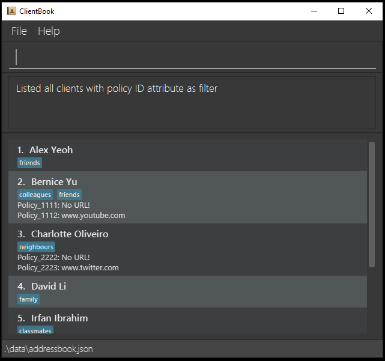

*  Shows a list of all clients and their phone number and insurance policy number.
   * `list -p -i`
    
     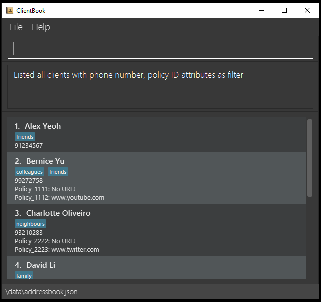

[Return to Table of Contents](#table-of-contents)
  

  
### `find`: Search for client contact based on keywords

**Purpose**: Finds and displays all clients whose field (name, phone, email, address, tags, insurance policy) contains any of the given keywords.
Optional flags can be added to show the list of matched clients with only the specified attributes.

**Format**: `find FLAG/KEYWORD [& MORE_KEYWORDS] [-ATTRIBUTES]…​`

* The search is **case-insensitive**. 
  * E.g. hans will match Hans.
* The **order of the keywords does not matter**.
* Only one `FLAG` can be used in each find command.
  * `FLAG` uses the identifier of each attribute to help the program identify which attribute you are referring to.
  * For more information about the identifiers for each attribute, refer to [What information can we store for each client contact?](#what-information-can-we-store-for-each-client-contact).
* The delimiter `&` between keywords allows you to search for Clients using multiple keywords.
  * E.g. `Aaron & Tan` will return all persons with either `Aaron` or `Tan` in their names.
* Without the use of delimiter `&`, all keywords following the `FLAG` will be used in the search. 
  * E.g. `Aaron Tan` will only return persons with `Aaron Tan` in their names.
* Clients with matching keywords in the chosen field will be returned. 
  * E.g. `Hans & Bo` will return person `Hans Sum` and `Bo Yang`.
* Similar to the [`list`](#list-list-all-clients) command, optional attributes can be added to show only certain attributes in the search result.
  * E.g. `-p` filters phone number information of the listed clients.
    
**Examples**:
* Find `Alex David` and `Alex Yeoh`.
  * `find n/alex`

    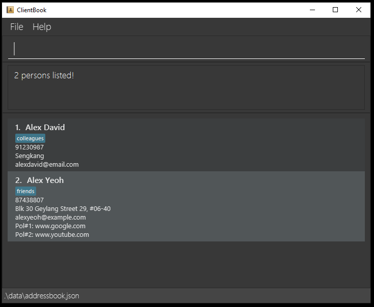

* Find `Alex David`.
  * `find n/alex david`
  
    
  
* Find `Alex David`, `Alex Yeoh` and `David Li`.
  * `find n/alex & david`
  
    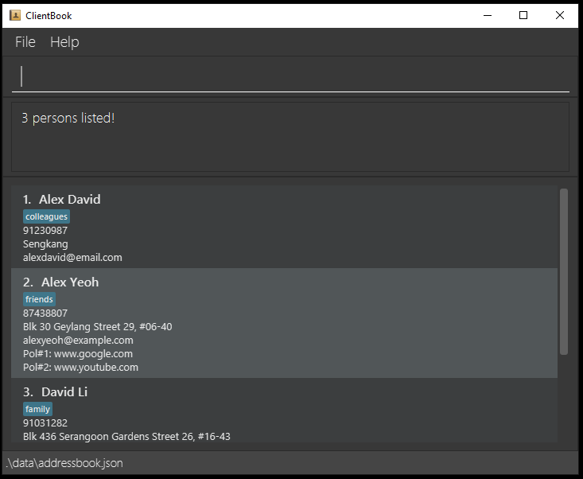

* Find all persons whose address contains `geylang`.
  * `find a/geylang` - returns `Alex Yeoh` whose address is `Blk 30 Geylang Street 29, #06-40`

    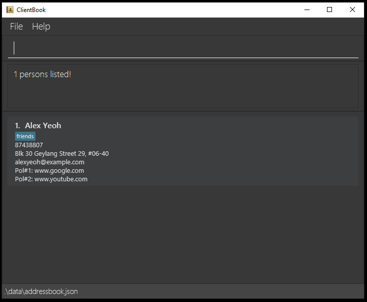

* Find the email and phone number of all persons whose names contain `alex` and `david`.
  * `find n/alex & david -e -p`
    
    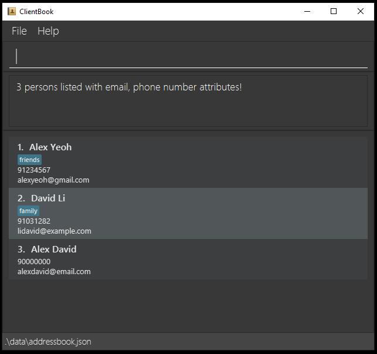

[Return to Table of Contents](#table-of-contents)
  

### `policy`: Display policies associated with a client 

**Purpose**: Launches a popup window to show all the policies associated with the selected contact, if the selected contact has any policies.

**Format**: `policy INDEX`

* Selects the client at the specified `INDEX`.
* The index refers to the index number shown in the displayed client list.
* The index must be more than 1, and less than or equal to the index of the last item in the displayed list.

**Examples**:
* `list` followed by `policy 2` displays the policies associated with the 2nd person in the address book.
  
  
  
* `find n/Bernice` followed by `policy 1` displays the policies associated with the 1st person in the results of the `find` command.
  
  

[Return to Table of Contents](#table-of-contents)
  

### `delete`: Delete client contact

**Purpose**: Deletes the specified client from ClientBook after listing or finding contacts.

**Format**: `delete INDEX`

* Deletes the client at the specified `INDEX`.
* The index refers to the index number shown in the displayed client list.
* The index must be more than 1, and less than or equal to the index of the last item in the displayed list.

**Examples**:
* `list` followed by `delete 2` deletes the 2nd person in the address book.

  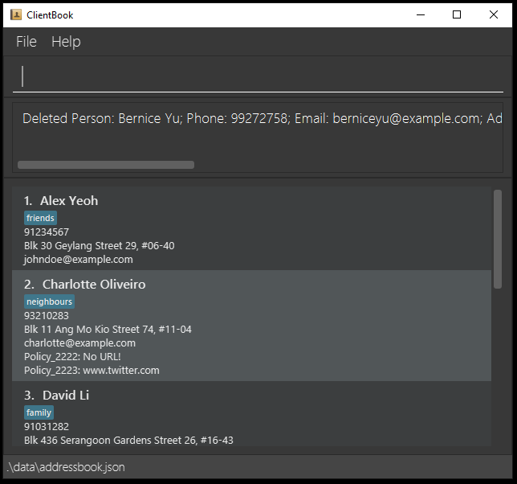

* `find n/Charlotte` followed by `delete 1` deletes the 1st person in the results of the `find` command.

  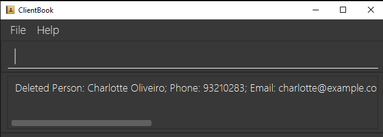

[Return to Table of Contents](#table-of-contents)
  

### `sort`: Sort list of clients

**Purpose**: Sorts the current list of clients in ClientBook.

**Format**: `sort -ATTRIBUTE -DIRECTION`

* Sorts the list of clients according to the specified `ATTRIBUTE` and `DIRECTION`.
* The specified `ATTRIBUTE` can be `-n` to sort by name alphabetically or `-i` to sort by number of insurance policies, but not both.
* The specified `DIRECTION` can be `-asc` for ascending order or `-des` for descending order, but not both.

**Examples**:
* Sort the current list of clients by name in **descending** number of insurance policies.
    * `sort -i -des`

      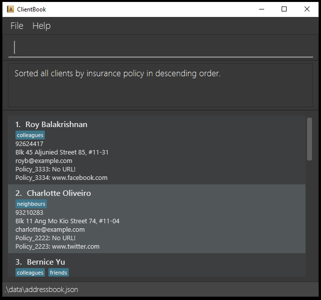

* Sort the current list of clients by name in **descending** alphabetical order.
    * `sort -n -des`

      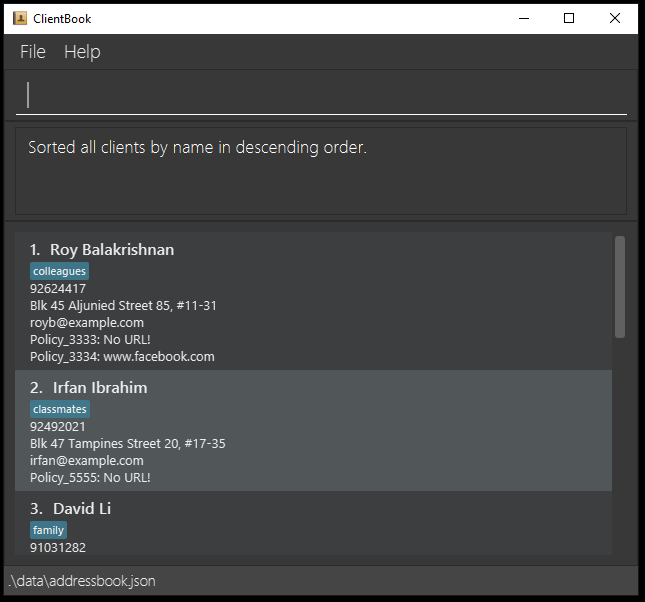

[Return to Table of Contents](#table-of-contents)
      

### `meet`: Schedule a meeting with a client

**Purpose**: Schedules a meeting with a client in the ClientBook

**Format**: `meet INDEX ACTION PLACE;DATE;TIME`

* Schedules a meeting with the client at the specified `INDEX`.
* The index refers to the index number shown in the displayed client list.
* The index **must be a positive integer** 1, 2, 3, …​
* The meeting will be scheduled according to the specified `ACTION`.
* The `ACTION` can be `-check` to check for clashes, `-ignore` to ignore clashes, `-delete` to delete the meeting.
* The meeting with the client will be at the specified `PLACE;DATE;TIME`.
* The `DATE` must be in the `DD:MM:YYYY` format.
* The `TIME` must be in the `HH:MM` format.

**Examples**:
* Check for clashes and then schedules a meeting at MRT 12/08/2021 14:30 if there are no clashes.
    *`meet 3 -check MRT;12:08:2021;14:30`

[Return to Table of Contents](#table-of-contents)
  

### `lock`: Lock ClientBook with a user-selected password 

**Purpose**: Locks ClientBook with a user-selected password.

**Format**: `lock [CURRENT_PASSWORD] [NEW_PASSWORD]`

* Verifies the current password before locking ClientBook with the new password.
* The `CURRENT_PASSWORD` field can be omitted if ClientBook is not yet locked.
* When `CURRENT_PASSWORD` and `NEW_PASSWORD` fields are both omitted, ClientBook will attempt to lock itself using the last used password that is safely stored on your device.

:exclamation: **Note**: After setting a password, ClientBook can only be launched through Command Prompt or Terminal.
  * Refer to [Quick Start](#quick-start) on how to launch the application through Command Prompt or Terminal.

**Examples**:
* Lock ClientBook with password `123`.
  * `lock 123`

    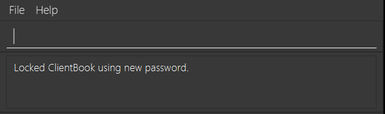

* Change ClientBook's password from `123` to `456`.
  * `lock 123 456`

    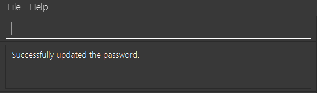    

[Return to Table of Contents](#table-of-contents)
  

### `unlock`: Unlock ClientBook 

**Purpose**: Unlocks ClientBook.

**Format**: `unlock CURRENT_PASSWORD`

* Verifies the current password before unlocking ClientBook.
* ClientBook's password is removed after executing this command. After executing this command, future launches of ClientBook will not require a password.

**Examples**:
* Unlock ClientBook with wrong password `123`.
    * `unlock 123`

      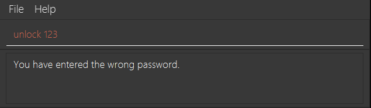

* Unlock ClientBook with correct password `456`.
    * `unlock 456`

      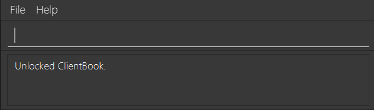

[Return to Table of Contents](#table-of-contents)
  

### `exit`: Exiting the program 

**Purpose**: Exits the program.

**Format**: `exit`

[Return to Table of Contents](#table-of-contents)
  

### Saving data

**Purpose**: ClientBook saves its data to a file in the home folder automatically after any command that changes the data. There is no need to save manually.

[Return to Table of Contents](#table-of-contents)
  

### Editing data file

**Purpose**: ClientBook saves its data as a JSON file `[JAR file location]/data/clientbook.json`. Advanced users are welcome to update data directly by editing that data file.

* The data file is stored in a zip file inside the `data` folder in the same folder. 
* If you previously set a `lock` for ClientBook, the zip folder can be unzipped with that same password.

:exclamation: **Caution**:
If your changes to the data file makes its format invalid, **all your data will be lost** at the next run.

[Return to Table of Contents](#table-of-contents)
  

### Upcoming features (v2.0 and beyond!)

* Archiving data files
* Customisable user interface
* Login interface
* And more!

[Return to Table of Contents](#table-of-contents)

--------------------------------------------------------------------------------------------------------------------
## Frequently Asked Questions

### Setting Up
**Q**: How do I check that Java is installed on my laptop? 
**A**: Launch Command Prompt (for Windows) or Terminal (for Mac OS/Linux) and enter the following command: `java -version`.
If you get an error message (`Java command not found`), it means that Java is not installed on your laptop. 

**Q**: How do I install Java? 
**A**: Head over to the official Java website [here](https://www.oracle.com/sg/java/technologies/javase-jdk11-downloads.html), and download the appropriate file for your system!

**Q**: How do I transfer my data to another laptop? 
**A**: Copy the entire home folder (with all the files inside) over to the other laptop! It's as simple as that!

[Return to Table of Contents](#table-of-contents)

--------------------------------------------------------------------------------------------------------------------

## Summary of Commands

| Action | Format | Example |
| --------|------------------ | --- |
[**Help**](#viewing-help--help) | `help` | `help` |
[**Add**](#add-client-contact-add) | `add n/NAME p/PHONE_NUMBER e/EMAIL a/ADDRESS [i/POLICY_ID] [t/TAG]…​` | `add n/James Ho p/22224444 e/jamesho@example.com a/123, Clementi Rd, 1234665 i/Policy_1023 t/premium t/lifeinsurance` |
[**Edit**](#edit-client-contact-edit) | `edit INDEX [n/NAME] [p/PHONE_NUMBER] [e/EMAIL] [a/ADDRESS] [i/POLICY_NUMBER]…​ [t/TAG]…​` | `edit 2 n/James Lee e/jameslee@example.com` |
[**List**](#list-all-clients--list) | `list [-ATTRIBUTE]` | `list -i` |
[**Find**](#search-for-client-contact-based-on-keywords-find) | `find FLAG/KEYWORD [& MORE_KEYWORDS] [-ATTRIBUTES]…​` | `find a/Bedok & Clementi -p` |
[**Policy**](#display-policies-associated-with-selected-client-policy) | `policy INDEX` | `policy 4` |
[**Delete**](#delete-client-delete) | `delete INDEX` | `delete 3` |
[**Sort**](#sort-list-of-clients-sort) | `sort -ATTRIBUTE -DIRECTION` | `sort -n -d` |
[**Meet**](#schedule-a-meeting-with-a-client-meet) | `meet INDEX ACTION PLACE;DATE;TIME` | `meet 5 -check Mall;28:06:2021;17:00` |
[**Lock**](#lock-clientbook-with-a-user-selected-password-lock) | `lock [CURRENT_PASSWORD] NEW_PASSWORD` | `lock 123 456` |
[**Unlock**](#unlock-clientbook--unlock) | `unlock [CURRENT_PASSWORD]` | `unlock 456` |
[**Exit**](#exiting-the-program--exit) | `exit` | `exit` |

[Return to Table of Contents](#table-of-contents)

--------------------------------------------------------------------------------------------------------------------

## Contact Us

Didn't find what you were looking for? Contact us at [clientbook@email.com](clientbook@email.com).

ClientBook is still a work in progress and we hope to be able to further improve ClientBook to suit your needs. 
Should you have any suggestions, feel free to drop us an email! 
We would love to hear from you insurance agents who are actively out and about, providing us with the best services.

[Return to Table of Contents](#table-of-contents)
