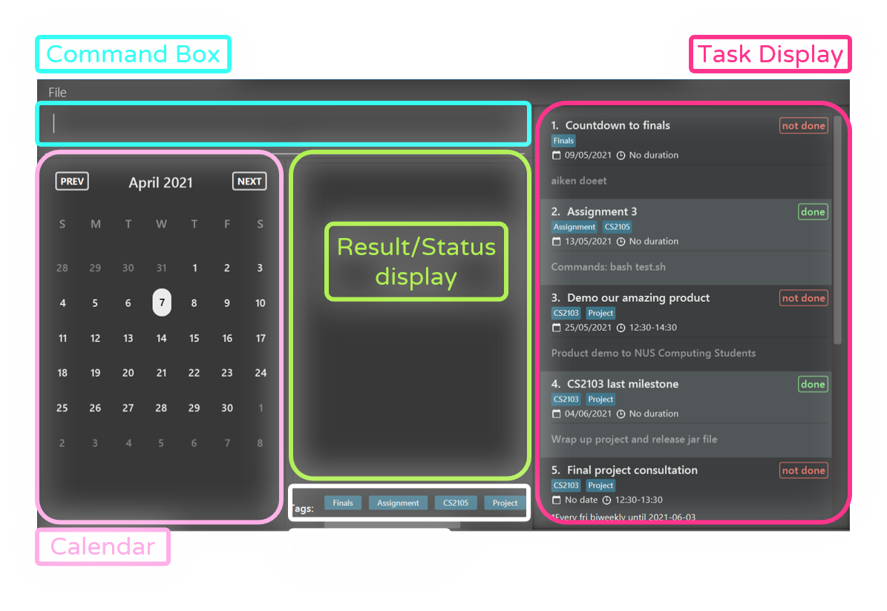
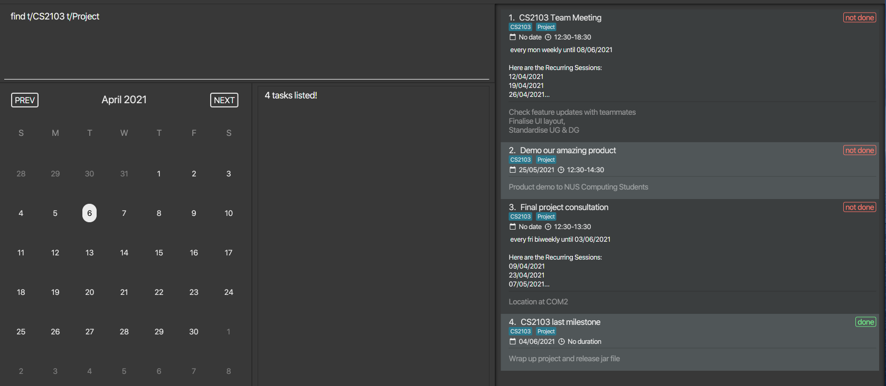
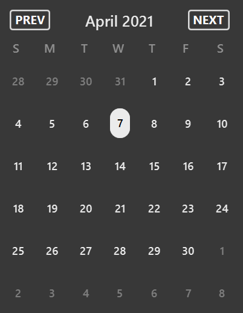

**PlanIT** is a task managing application made specially for NUS computing students. PlanIT
gives you the confidence that your busy schedule is organized and accounted for. Quickly and efficiently make and edit
various tasks, mark dates, take note of remaining tasks, and more.

PlanIT also includes a calendar and a countdown feature to better manage your deadlines. It is even optimised for people who prefer typing, so that bookkeeping can be done faster. Now you can make progress on the things that are
more important to you.

**Objective:**

PlanIT's objective is to improve productivity for students with features and tools to help
students manage their workload. These features significantly reduce the trouble of having to keep track of tasks,
especially those that are essential yet repetitive. Features such as recurring schedule and date allow students to
keep track of weekly tasks and due dates for tutorial homework, projects and much more. More importantly, the functionalities
of PlanIt's simple overview allows students to see upcoming deadlines or events.

Let's dive deeper into these features to see how these features can assist students
in workload management.

* Table of Contents
{:toc}

--------------------------------------------------------------------------------------------------------------------

# Quick start

1. Ensure you have Java `11` or above installed in your Computer.

2. Download the latest `planit.jar` from [here](https://github.com/AY2021S2-CS2103T-T10-2/tp/releases).

3. Copy the file to the folder you want to use as the _home folder_ for your planner.

4. Double-click the file to start the app. The Graphical User Interface (GUI) 
   similar to the below illustration should appear in a few seconds.
   

   Note how the app contains some sample data.<br>
   

   Here is a layout guide to the app.<br>
   

    * Command Box : This is where you can enter the relevant commands in PlanIT.
    * Result/ Status display : This displays feedback and useful information after you have entered the commands.
    * Calendar : This displays the current dates and future dates for you to easily plan your tasks ahead of time.
    * Tag Display : This shows all the available tags that the tasks have been categorised within PlanIT.
    * Task Display : This shows all the tasks currently saved within the PlanIT app.

5. Type the command in the command box and press Enter to execute it. e.g. typing **`help`** and
   pressing Enter will display a list of commonly used commands for first time users.<br>
   Some example commands you can try:

   * **`ls`** : Lists all tasks.

   * `mk n/eat dinner` : Makes a task titled `eat dinner` to the planner.

   * `rmt 3` : Removes the 3rd task shown in the current planner.

6. Refer to the [Features](#features) below for details of each command.

--------------------------------------------------------------------------------------------------------------------

# How to use this guide

Here are some symbols you might need to know:
 * :information_source: : Helpful information you should take note of.
 * :bulb: : Useful tips that might help you.
 * :exclamation: : Important information that might affect your usage of PlanIT.
 
--------------------------------------------------------------------------------------------------------------------

# Features
## Glossary of attributes
PlanIT contains a list of tasks.
Tasks can have the following attributes:

| Attribute | Prefix | Description |
|---|---|---|
| Title | `t/` | A short description or name for the task. {::nomarkdown}<ul><li>Titles can only contain alphanumeric values and have at most 40 characters.</li><li>Leading and trailing whitespaces or line breaks are trimmed.</li></ul>{:/} <br> <div markdown="span" class="alert alert-info">:information_source:  Every task must have a title. </div>|
| Date | `set/` | A date to represent the deadline of a task or to represent the day that the task will be carried out. {::nomarkdown}<ul><li> Dates should be of the format dd/mm/yyyy e.g 02/06/2021</li><li>Leading and trailing whitespaces or line breaks are trimmed.</li></ul>{:/}|
| Duration | `s/` | The start and end time of a task. You should specify start time and end time in the 24-hour clock format. {::nomarkdown}<ul><li>Duration should be of the format hh:mm-hh:mm e.g 12:30-13:30</li><li>Leading and trailing whitespaces or line breaks are trimmed.</li></ul>{:/}|
| Recurring Schedule | `r/` | Represents a task that might repeat weekly or biweekly. <div markdown="span" class="alert alert-primary">:bulb: You can use this to quickly add weekly tutorials or biweekly lab session for the entire semester. </div><br>:exclamation: **Recurring Schedule should be of the format [END DATE][DAY][FREQUENCY] <br> e.g [23/10/2021][mon][weekly]**<br><br>{::nomarkdown}<ul><li>END DATE should be in the format dd/mm/yyyy, any date that is 6 months after the current date will be considered invalid.</li><li>DAY should be either: mon, tue, wed, thu, fri, sat, sun and is case-insensitive.</li> <li>FREQUENCY should be either: weekly or biweekly and is also case-insensitive.</li><li>Leading and trailing whitespaces or line breaks are trimmed.</li></ul>{:/}<br>:information_source: **Recurring dates that is of the upcoming day of week up till the [END DATE] will be generated for the task.** <br><br>**Suppose today is 06/04/2021 which falls on a Tuesday, user enters [30/06/2021][tue][weekly] for the recurring schedule field. The date of 06/04/2021 will not be included in the recurring dates and only recurring dates from the following tuesday will be included up till 30th June 2021 on a weekly basis.** <br><br>:information_source: **Existing recurring dates that has passed the current date will be removed automatically from the existing task upon application startup.**|
| Description | `d/` | A text description of the task. Your description can be any value.{::nomarkdown}<ul><li>Leading and trailing whitespaces or line breaks are trimmed unless otherwise stated in the command description.</li></ul>{:/}|
| Tag | `t/` | A label attached to a task for easy grouping and searching of tasks. Your tag should only contain alphanumeric values.{::nomarkdown}<ul><li>Leading and trailing whitespaces or line breaks are trimmed unless otherwise stated in the command description.</li></ul> <br><div markdown="span" class="alert alert-primary">:bulb: You can use this to group tasks by modules e.g adding a `CS2103` tag to a task. </div> {:/}|
| Status | `st/` | Reflects the current status of your task. Status can only be either 'done' or 'not done'.{::nomarkdown}<ul><li>Leading and trailing whitespaces or line breaks are trimmed.</li></ul> <br><div markdown="block" class="alert alert-info"><br>:information_source:   Your task's status will be set to 'not done' by default. Status cannot be removed. </div> {:/}|


## Constraints
In order to maximise the efficiency of adding tasks and ensuring that there are no unnecessary attributes, there are
two constraints to the attributes that can exist on the tasks that you create or edit.
1. Tasks cannot have Date and Recurring Schedule at the same time.
2. Tasks cannot have Duration on its own without a Date or Recurring Schedule.

When it comes to Dates and Recurring Schedules, the main purpose of a Date attribute is to give a task a deadline or
a single day to carry out the task itself. This should not co-exist with a Recurring Schedule, which can also indicate
a task's deadline or day to carry out the event, except it is being repeated on a weekly or biweekly basis.

As for the Duration of a task, it will be confusing to you as a user when you have multiple tasks with durations but no
date specified. As such, this might cause you to miss your task or lower the efficiency of utilizing PlanIT when 
searching for tasks.

## List of Commands

<div markdown="block" class="alert alert-info">

**:information_source: Notes about the command format:**<br>

* Words in `UPPER_CASE` are the parameters to be supplied by the user. Type in the prefixes along with the 
  parameters.<br>
  e.g. in `mk n/TITLE`, `n/TITLE` is a parameter which can be used as `n/eat dinner`.
  
* Some commands might not require prefixes as written in their formats.<br>
  e.g. in `rmt INDEX`, it can be used as `rmt 4`.

* Items in square brackets are optional.<br>
  e.g `n/TITLE [t/TAG]` can be used as `n/Join Dance t/leisure` or as `n/Join Dance`.

* Items with `…`​ after them can be used multiple times including zero times.<br>
  e.g. `[t/TAG]…​` can be used as ` ` (i.e. 0 times), etc.

* Parameters can be in any order.<br>
  e.g. if the command specifies `n/TITLE set/DATE`, `set/DATE n/TITLE` is also acceptable.

* If a parameter is expected only once in the command but you specified it multiple times, only the last
  occurrence of the parameter will be taken.<br>
  e.g. if you specify `n/first task n/second task`, only `n/second task` will be taken.

* Extraneous parameters for commands that do not take in parameters (such as `help`, `exit` and `clear`)
  will be ignored.<br>
  e.g. if the command specifies `help 123`, it will be interpreted as `help`.

</div>

### View Commands : `help` ----- Max

Displays a list of commonly used possible commands along with each of their formats respectively 
so that you can refer to commands conveniently whenever you forget about them.
  * Only a few main commands will be displayed to avoid information overload for first-time and forgetful users.
  * Users can read the User Guide for detailed information on all the commands.

Format: `help`

### Making a task: `mk` ----- Jun Xue

Adds a task to the planner. <br>
Tasks with the same title cannot be added to the planner
so that you do not have to worry about adding duplicate tasks by accident. Calendar will be reset.

Format: `mk n/TITLE [set/DATE] [s/DURATION] [d/DESCRIPTION]
[r/RECURRING SCHEDULE] [st/STATUS] [t/TAG]…`

* Only title is compulsory.
* Date should be in the format dd/mm/yyyy. For example, 1 July 2021
  should be expressed as `01/07/2021`, not 1/7/2021.
* Duration should be numeric, contain 2 timings, and should be in 24 hours format with a colon, like `22:30-22:45`.
  Duration can only exist when there is date or recurring schedule. 
* Description can have multiple lines by adding a line break using <kbd>shift</kbd>+<kbd>enter</kbd>.
* Recurring schedule should have 3 conditions which consist of:
    * An end date when the task stops recurring.
    * A day of the week that the task recurs on.
    * Frequency of the recurring task.
    * E.g. `[23/10/2021][Mon][weekly]`
* Status can only be `done` or `not done`, and is by default `not done`.

<div markdown="span" class="alert alert-primary">:bulb: **Tip:**
A task can have any number of tags (including 0)
</div>

Examples:
* `mk n/eat dinner`<br>Makes a task titled 'eat dinner'.
* `mk n/do project r/[29/06/2021][thu][Biweekly]` <br>Makes a task titled 'do project' and will 
  generate recurring dates that is on thursday, biweekly until 29th Jun 2021. Only the upcoming 3 recurring dates will be shown on the task display:
  

Example of making a task with multiple lines of description:
```
mk n/take a break d/
- do 1
- do 2 t/trying
```

### Editing a task : `edit` ----- Han Bin

Edits an existing task in the planner
so that you can have the flexibility in making changes to a certain task
if there is a change in your task or schedule. Calendar will be reset.

Format: `edit INDEX [n/TITLE] [set/DATE] [s/DURATION] [d/DESCRIPTION]
[r/RECURRING SCHEDULE] [st/STATUS] [t/TAG]…​`

* Edits the task at the specified `INDEX`. The index refers to the index number shown in the displayed task list.
  The index **must be a positive integer** 1, 2, 3, …​
* At least one of the optional fields must be provided.
* Existing values will be updated to the input values.
* When editing tags, the existing tags of the task will be removed i.e adding of tags is not cumulative.

Examples:
*  `edit 1 set/10/10/2021 d/Remember to update User Guide` Edits the date and description of the 1st task to be
   `10/10/2021` and `Remember to update User Guide` respectively.
*  `edit 2 n/Buy textbook t/ set/` Edits the title of the 2nd task to be `Buy textbook` and clears all existing tags
   and the date.
   
### Postpone a task's date : `snooze` ----- Max

Postpones your task's date by a specified number of days so that you have the flexibility
to push back the deadline of task when necessary. Calendar will be reset.

Format: `snooze INDEX [DAYS]`
* Edits the task at the specified `INDEX`. The index refers to the index number shown in the displayed list.
 The index **must be a positive integer** e.g 1, 2, 3, …​
* DAYS must be a positive integer and at most 365 (1 year).
* The DAYS is optional and it's default value will be 1 if no number is specified in your command.
* The snooze command will only successfully update the date of the task if the task contains a date.

Examples:
* `snooze 2` Postpones the date of the task at index 2 in the list by 1 day.
* `snooze 3 4 ` Postpones the date of the task at index 3 in the list by 4 days.

### Marking a task as done: `done` ----- Max


Sets a task's status to 'done' so that you can track the tasks that have completed easily.
 Calendar will be reset.


Format: `done INDEX`
* Sets the task at the specified `INDEX` to be done. The index refers to the index number shown in the displayed list.
* If the task's status is already 'done', the planner will give a warning.

Example:
* `done 2` Sets the status of a task at index 2 in the list to be done.


### Listing all tasks : `ls` ----- Kai Xiang

Shows a list of all tasks in the planner
so that you can view all the tasks easily in one place. Calendar will be reset.

Format: `ls`

### Listing all uncompleted tasks : `ls not done` ----- Kai Xiang

Shows a list of all uncompleted tasks in the planner
so that you can view all the uncompleted tasks easily. Calendar will be reset.

Format: `ls not done`

**Note: The keyword `not done` is case-insensitive.**

### Sort task by date: `sort by a` or `sort by d` ----- Han Bin

Sort tasks in the displayed list either in ascending dates or descending dates so that users would
be able to see the task or event nearest to current date or furthest away from current date.

Format: `sort by a` or `sort by d`

* Sorts the displayed list. If `find` command is used before sorting, `sort by a` or `sort by d`
  will sort the displayed list only. To sort the entire list, make sure to use `ls` before sorting.
* If `sort by a`, task with no dates would appear last, 
    subsequently task will be ordered in increasing dates. 
* If `sort by d`, task with no dates would appear first, 
    subsequently task will be ordered in decreasing dates.
* If two tasks have the same dates, they will be ordered in equal priority.


### Searching a task by title: `find` ----- Kai Xiang

Find matching tasks based on the title keyword(s) provided 
so that you can find matching tasks quickly when only certain words from the title of the task can be remembered. Calendar will be reset.

Format: `find KEYWORD [MORE_KEYWORDS]`

* The search is **case-insensitive**. e.g `project` will match `Project`
* The order of the keywords does not matter. e.g. `CS2103 Project` will match `Project CS2103`
* Only full keywords will be matched. e.g. `proj` will not match `projects`
* No prefix (i.e.`t/`, `d/`)  should be in the search task by title query.

Examples:
* `find CS2103 team project` returns matching tasks with title of following words `CS2103`, `team`, `project`


### Searching a task by description: `find d/` ----- Kai Xiang

Find matching tasks based on the description keywords provided
so that you can find matching tasks quickly when only certain words from the multi-line description can be remembered. Calendar will be reset.

Format: `find d/KEYWORD [MORE_KEYWORDS]`

* The search is **case-insensitive**. e.g `project` will match `Project`
* The order of the keywords does not matter. e.g. `CS2103 Project` will match `Project CS2103`
* Only full keywords will be matched. e.g. `proj` will not match `projects`
* Only a single `d/` description prefix should be allowed.
* No `t/` tag prefix should be in the search task by description query.
* No whitespace should be allowed right after the `find d/` command like `find d/   `
  but will be allowed between the keywords in the command like `find d/Project          CS2103`.

Examples:
* `find d/write user guide` returns matching tasks with description of following words `user`, `guide`, `write`


### Searching a task by tag: `find t/` ----- Kai Xiang

Find matching tasks based on the tag keyword provided 
so that you can find matching tasks from the same category quickly when only the tag(s) can be remembered. Calendar will be reset.

Format: `find t/KEYWORD`

* The search is **case-insensitive**. e.g `cs2103t` will match `CS2103T`
* Only full keyword will be matched. e.g. `cs2103` will not match `cs2103t`
* No `d/` description prefix should be in the search by tag query.
* Multiple `t/` tag prefixes are allowed in the search task by tag query.
* For each tag, the keyword must be **single, alphanumeric** unless searching task by keyword from multiple tags. 
  e.g. `projectCS2103` will be a single tag keyword and `project CS2103` will be recognised as keywords for 2 tags.
* No whitespace should be allowed right after the `find t/` command like `find t/   `
  but will be allowed between the keywords in the command like `find t/Project          CS2103`.  
* Suppose a task with **multiple tags** of `cs2103` and `cs2105`, it will be returned as a matching task
  if the user inputs falls under the following cases:
  1. `find t/cs2103` only
  2. `find t/cs2105` only
  3. `find t/cs2103 t/cs2105` 
  4.  `find t/cs2103 cs2105`
      
:bulb: Suppose you want to find a task with **multiple tags** of `cs2103` and `cs2105` 
but entered `find t/cs2103 Project`, the task you want will not be found since it will be detected 
as a find a task by tag with `cs2103` and `Project`. 
So, it is best to be more general than specific here by putting lesser tag keywords when unsure.     


Examples:
* `find t/CS2103` returns matching tasks with tag of `CS2103` or `cs2103`
* Below is an illustration of how to search matching tasks based on multiple tags:




:information_source: It is optional to keep putting tag prefix`t/` for searching task with multiple tags

### Removing a task : `rmt` ----- Chloe

Removes an existing task from the planner
so that you can reduce clutter from the planner or remove a mistakenly added task easily.

Format: `rmt INDEX`

* Removes the task at the specified `INDEX`.
* The index refers to the index number shown in the displayed planner.
* The index **must be a positive integer** 1, 2, 3, …​

Examples:
* `ls` followed by `rmt 2` removes the 2nd task in the planner.
* `find Work` followed by `rmt 1` removes the 1st task in the result of the `find` command.

### Removing a field from a task : `rmf` ----- Chloe

Removes an existing field from a task in the planner
so that you can remove certain details from the task directly
without having to go through the hassle of removing the task and adding the same task with lesser fields again.

Format: `rmf INDEX FIELD`

* Removes the specified field of task at `INDEX`.
* The index refers to the index number shown in the displayed planner.
* The index **must be a positive integer** 1, 2, 3, …​
* Fields are specified in the format their respective attributes: `set/`, `s/`, `r/`, `d/`, `t/`.
* Exactly one field must be specified.
* Title and status fields cannot be removed.

Examples:
* `ls` followed by `rmf 2 d/` removes the description from the 2nd task in the planner.
* `find Cat` followed by `rmf 1 t/` removes all the tags from the 1st task in the result of the
  `find` command.
  
### Counting down to a task : `count` ----- Chloe

Displays the number of days left to a task's date if it exists
so that you know how much time you have left to work on the task.

Format: `count INDEX`

* Counts the number of days until the date of the task at `INDEX`.
* The index refers to the index number shown in the displayed planner.
* The index **must be a positive integer** 1, 2, 3, …​
* The task at the index must have a date, otherwise countdown cannot be done.

Examples: 
* `ls` followed by `count 4` displays the number of days left to the 4th task in the planner.
* `find Wool` followed by `count 1` displays the number of days left to the 1st task in the result
of the `find` command.

### Displaying statistics : `stat` ----- Chloe

Displays the statistics of the planner 
so that you can check the current task progression and determine your own work efficiency conveniently. 

Statistics include:
1) The total number of tasks in the planner.
   
2) The percentage of tasks completed (marked as done).
   
3) The number of tasks due in the next 7 days from the system's current time.

Format: `stat`

* Planner must consist of at least one task.

### View tasks on a date : `view` ----- Jun Xue

Displays the tasks happening on a particular date, including recurring tasks,
and brings the calendar to the date specified
so that you may find free time on the day to schedule new activities.

Format: `view DATE`

* Date should be in the format of dd/mm/yyyy like 12/12/2021.
* Date cannot be before the year 1900 or after the year 2099.

Examples:
* `view 03/07/2021`<br>Lists all tasks with dates or recurring dates on 03/07/2021, and brings the calendar to July
2021.


### Clearing all entries : `clear`

Clears all entries from the planner so that you can remove all tasks within the planner at once.
Calendar will be reset.

Format: `clear`

### Exiting the program : `exit`

Exits the program.

Format: `exit`

## Saving the data

PlanIT data are saved in the hard disk automatically after any command that changes the data.
There is no need to save manually.

## Editing the data file

PlanIT data are saved as a JSON file `[JAR file location]/data/planit.json`.
Advanced users are welcome to update data directly by editing that data file.

<div markdown="span" class="alert alert-warning">:exclamation: **Caution:**
If your changes to the data file makes its format invalid, PlanIT will discard all data and
start with an empty data file at the next run.
</div>

--------------------------------------------------------------------------------------------------------------------

## Calendar Specifications ----- Jun Xue



You can click on the `prev` and `next` buttons on the calendar shown above, to move to the previous and next months respectively,
or you can simply type in the following commands, if you are more inclined to using the command line interface.

Action | Format
---|---
**Navigate to the previous month on the calendar** | `prev`
**Navigate to the next month on the calendar** | `next`

* These 2 commands do not take in parameters. Extraneous parameters will be ignored.
    
    E.g. if the command specifies `prev 987`, it will be interpreted as `prev`.
* `next` and `prev` operates on the currently displayed month.
* The displayed date and month will revert to the current date and month upon starting up the app.
* Month displayed can go beyond `date` limits.

--------------------------------------------------------------------------------------------------------------------

## FAQ

**Q**: How do I transfer my data to another Computer?<br>
**A**: Install the app in the other computer and overwrite the empty data file it creates with the file
that contains the data of your previous PlanIT home folder.

**Q**: Does PlanIT requires an Internet connection for the app to run?<br>
**A**: PlanIT does not require Internet connection and can run locally on your computer.

**Q**: How do I remove my data without starting up the PlanIT app?<br>
**A**: Delete the data folder from the PlanIT home folder.

**Q**: How do I backup my data in PlanIT app?<br>
**A**: Copy the data folder from PlanIT and saved it in a external hard disk. cloud storage such as Google Drive
        or to the internal hard disk of your computer.


--------------------------------------------------------------------------------------------------------------------

## Command summary ----- Kai Xiang, Max, Jun Xue, Chloe, HanBin

Action | Format, Examples
---|---
**Make** | `mk n/TITLE [set/DATE] [s/DURATION] [d/DESCRIPTION] [r/RECURRING SCHEDULE] [st/STATUS] [t/TAG]…​`<br> e.g.,`mk n/eat dinner t/important`
**Clear** | `clear`
**Mark Done** | `done INDEX`
**Remove Task** | `rmt INDEX`<br> e.g., `rmt 3`
**Remove Field** | `rmf INDEX FIELD`<br> e.g., `rmf 1 d/`
**Postpone** | `snooze INDEX [DAYS]`
**Edit** | `edit INDEX [n/TITLE] [set/DATE] [s/DURATION] [d/DESCRIPTION] [r/RECURRING SCHEDULE] [st/STATUS] [t/TAG]…​`<br>e.g.,`edit 2 n/James Lee`
**Find** | `find KEYWORD [MORE_KEYWORDS]`<br>e.g., `find CS2103 team project` <br><br>`find [t/TAG] `<br>  e.g., `find t/CS2103` <br><br> `find [d/DESCRIPTION] ` <br> e.g., `find d/CS2103 milestone postmortem`
**Countdown** | `count INDEX` <br> e.g., `count 2`
**Statistics** | `stat`
**View** | `view DATE`<br> e.g., `view 10/10/2021`
**List** | `ls`<br> `ls not done`
**Help** | `help`
**Calendar Navigation** | `next` `prev`

