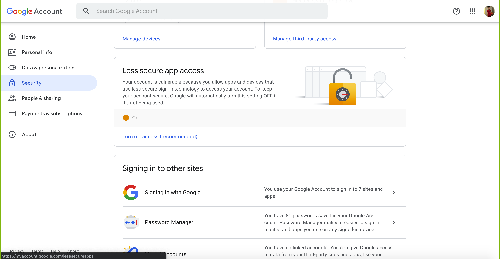

# Welcome to Car@leads
Car@leads is a **desktop app for a car salesperson to manage customer contacts** (CLI).
  Users can add new customer contacts which include details such as customer's car brand and car type preferences along with other personal information.
  Users can filter through the customer data using specific filters, such as filtering out customers who prefer a specific car brand and follow up with them for sales opportunities.
  Car@leads is optimized for use via a Command Line Interface, while still having the benefits of a Graphical User Interface (GUI).
  If you can type fast, Car@leads can get your contact management tasks done faster than traditional GUI apps.

* Table of Contents
{:toc}

--------------------------------------------------------------------------------------------------------------------

## Quick start

1. Ensure you have Java `11` or above installed in your Computer.
1. Double-click the file to start the app. The GUI similar to the below should appear in a few seconds.
    Note how the app contains some sample data to provide a example of how app usage.
    Remember to clear these sample data using the clear command before use.  
   
1. Type the command in the command box and press Enter to execute it. e.g. typing **`help`** and pressing Enter will open the help window. 
   Some example commands you can try:

    * **`add`**`n/Bob Ang p/88765432 e/bobhnd@example.com a/John street, block 123, #01-01 b/1998 07 10  c/BMW+Coupe|2030 01 01 c/Porsche+SUV|2030 01 01 cp/MercedesBenz+SUV`
      : Adds a contact named `Bob Ang`

    * **`find`**`n/Bob Ang cp/BMW+Coupe`
      : Finds a contact named `Bob Ang` whose preferred car is a BMW Coupe.

    * **`delete`**`John Doe` : Deletes 'John Doe' contact from contact list .

    * **`list`** : Lists all contacts.

    * **`clear`** : Deletes all contacts.

    * **`exit`** : Exits the app.

    * **`help`** : Get a legend of commands.

1. Refer to the [Features](#features) below for details of each command.

--------------------------------------------------------------------------------------------------------------------

## Features

**:information_source: Notes about the command format:** 

* Words in `UPPER_CASE` are the parameters to be supplied by the user. 
  e.g. in `add n/NAME`, `NAME` is a parameter which can be used as `add n/John Doe`.

* Items in square brackets are optional. 
  e.g `n/NAME [t/TAG]` can be used as `n/John Doe t/friend` or as `n/John Doe`.

* Items with `…`​ after them can be used multiple times including zero times. 
  e.g. `[t/TAG]…​` can be used as ` ` (i.e. 0 times), `t/friend`, `t/friend t/family` etc.

* Parameters can be in any order. 
  e.g. if the command specifies `n/NAME p/PHONE_NUMBER`, `p/PHONE_NUMBER n/NAME` is also acceptable.

* If a parameter is expected only once in the command but you specified it multiple times, only the last occurrence of the parameter will be taken. 
  e.g. if you specify `p/12341234 p/56785678`, only `p/56785678` will be taken.

* Extraneous parameters for commands that do not take in parameters (such as `help`, `list`, `exit` and `clear`) will be ignored. 
  e.g. if the command specifies `help 123`, it will be interpreted as `help`.

* `COE_EXPIRY_DATE` input order: YYYY{space}MM{space}DD
  * Example: `2013 12 31`
  * This is the same input format as `DATE_OF_BIRTH`
* `|` joins car with COE expiry date
* `+` joins car brand and car type

## Command summary

Action | Format, Examples
--------|------------------
**add** | `add n/NAME p/PHONE_NUMBER e/EMAIL a/ADDRESS b/DATE_OF_BIRTH [t/TAG]…​ [c/CAR_BRAND_OWNED+CAR_TYPE_OWNED|COE_EXPIRY_DATE] [cp/CAR_BRAND_PREFERRED+CAR_TYPE_PREFERRED]`  e.g., `n/add n/Bob Ang p/88765432 e/bobhnd@example.com a/John street, block 123, #01-01 c/BMW Coupe|2030 01 01 c/Porsche|2030 01 01`
**find** | `find [e/bob /AND p/98761234] /OR b/1999 10 11`
**delete** | `delete NAME`  e.g., `delete John doe`
**list** | `list` Generates a default list of unfiltered contacts saved in the contact book.
**clear** | `clear` Clears the contact list, erasing all saved data.
**exit** | `exit` The GUI Button at the top of the status bar. Clicking on it closes the application safely.
**help** | `help` The GUI Button at the top of the status bar. Clicking on it opens a help window.
**email** | `email`The GUI Button at the top of the status bar. Clicking on it opens a simplified MailBox interface allowing user to send email.
**up** | `/up{X}`, meaning any command starting with `/up`. Eg: `/up delete John Doe`

### Adding a customer: `add`

Adds a customer to the contact list.

Format: `add n/NAME p/PHONE_NUMBER e/EMAIL a/ADDRESS b/DATE_OF_BIRTH [t/TAG]…​ [c/CAR_BRAND_OWNED+CAR_TYPE_OWNED|COE_EXPIRY_DATE] [cp/CAR_BRAND_PREFERRED+CAR_TYPE_PREFERRED]`
 `n/add n/Bob Ang p/88765432 e/bobhnd@example.com a/John street, block 123, #01-01 c/BMW+Coupe|2030 01 01 c/Porsche+SUV|2030 01 01 cp/MercedesBenz+SUV`

:bulb: **Tip:**
A customer can have any number of tags, carsOwned, carPreferred (including 0)

Examples:
* `add n/John Doe p/98765432 e/johnd@example.com a/John street, block 123, #01-01 c/Honda City`
* `add n/Betsy Crowe c/Honda City t/friend e/betsycrowe@example.com x/2011 03 27 a/Newgate Prison p/1234567 t/criminal`

### Finding a customer: `find` 

Find customers from the contact list that matches specified filters.

Format: `find  n/NAME p/PHONE_NUMBER e/EMAIL a/ADDRESS c/OWNED_CARBRAND+OWNED_CARTYPE coe/COE_EXPIRY_DATE t/TAGs 
cp/PREFERRED_CARBRAND+PREFERRED_CARTYPE b/DATE_OF_BIRTH`

**IMP** : All arguments are optional. In particular:
- for `c/OWNED_CARBRAND+OWNED_CARTYPE`, user can either give brand or type information, or both using the `+`sign to 
  separate.
  
- for `cp/PREFERRED_CARBRAND+PREFERRED_CARTYPE` user can either give brand or type information, or both using the 
  `+` sign to separate.
  
- for `n/NAME` giving a partial name is also okay - all names which have the given parameter as a subsequence (Note 
  that `abc` is a subsequence of `addbddc`) will be matched. Note that this is the only field for which we match 
  a subsequence instead of a simple substring.
  
- for `e/EMAIL`, all email containing the given parameter will be valid, but note that domain name is not checked.
    - eg `find e/abc` will return profiles with the following emails:
        -  `abcd@gmail.com`
        -  `bbabc@gmail.com`
    - It will _not_ return:
        - `xxx@abc.com`
        - `axbyc@hhh.com`

Further details about the search options are as follows:

- For `coe/COE_EXPIRY_DATE`, using `coe/exp` will search for all customers with an expired COE on any of the cars they own.
  it is a special case alias for the search `coe/0`, where `coe/NON_NEGATIVE_NUMBER` will search for any customers with
  at least one car that will expire in `NON_NEGATIVE_NUMBER` years *or less*.
  
- for `a/ADDRESS` partial addresses are also acceptable

- for `b/DATE_OF_BIRTH` partial dates also work. Note that `find b/1999` is a more generic search than `find b/1999 
  02` and hence will return more items.
  
- for `t/TAGS` all customers satisfying _any_ tag will be returned. In particular, `find t/TAG_A TAG_B TAG_C` is a more 
  generic 
  query than `find t/TAG_A` 
  

**COMBINING FIND PARAMETERS**

We can combine in the following way : 
-   `find a/Orchard /AND n/John /AND /NOT t/CRIMINAL`
-   `find a/Orchard /AND n/John /AND [ t/RICH /OR /NOT t/CRIMINAL ]`

Note that for `find A /AND B /OR C /OR D /AND E` , the implicit bracketing considered is `find A /AND [B /OR [C /OR [D 
/AND E]]]`

:bulb: **Tip:**
A customer can have any number of tags (including 0)

## Deleting a customer : `delete`

Deletes the specified customer from the contact list.

Format: `delete name`

* Deletes the customer with the specified `name`.
* The name refers to the customer name shown in the displayed customer contact list.
* The name **must be valid** does not contain special characters  …​

## Listing all customers : `list`

Shows a list of all customers in the system

Format: `list`

## Clear all customers : `clear`
* **`clear`** : Deletes all customers in the system.

## Repeat last Command : `/up`
* **`/up{X}`** : Loads in the previous command. `{X}` can be any string of characters, usually the previous command.
* Examples: `/updelete John Doe`

:bulb: **Tip:**
There does not need to be a space after /up, so long as it is the first part of the 'command'

eg: The command Box is as follows

    - find e/Apple
    - find e/AppleChain
    - /up
    - /up
Result:  
    - `find e/Apple`

## Exiting app: `exit`
* **`exit`** : Exits the app.

## Quick help: `help`
* **`help`** : Overview of commands and input syntax.

## Email Contact person: `email`
* **`email`** : Opens a simplified mailbox interface enabling user to email to the desired contact persons with a prefilled text field.
  Currently, it only supports sending through Gmail accounts and requires enabling less secure app access on google security.
  This feature is **only** avaliable through the menu bar currently.
  
  Url: https://myaccount.google.com/security
--------------------------------------------------------------------------------------------------------------------
