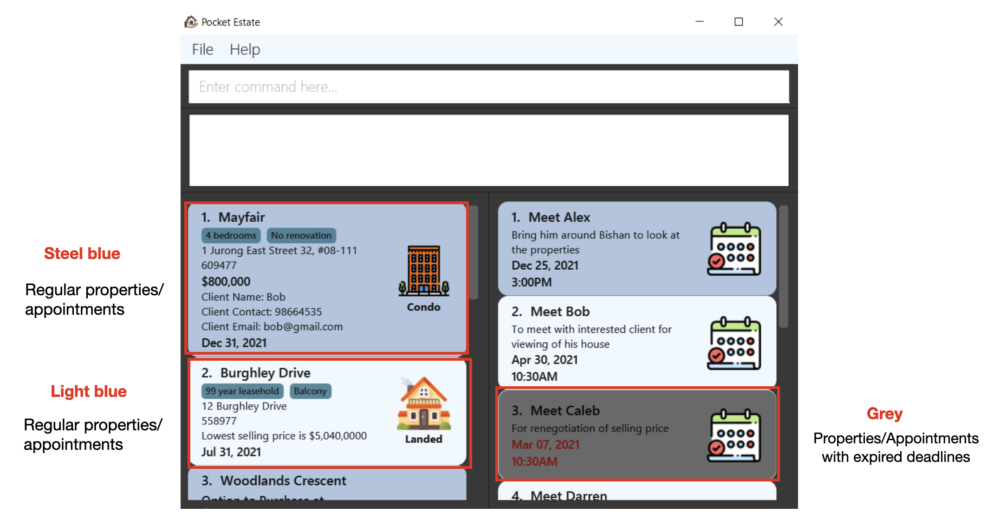
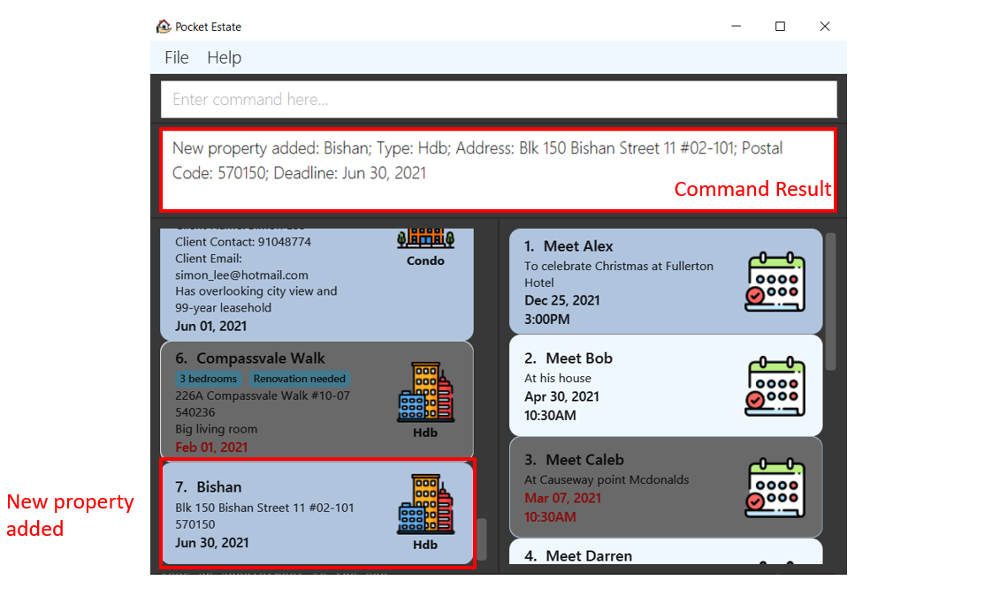
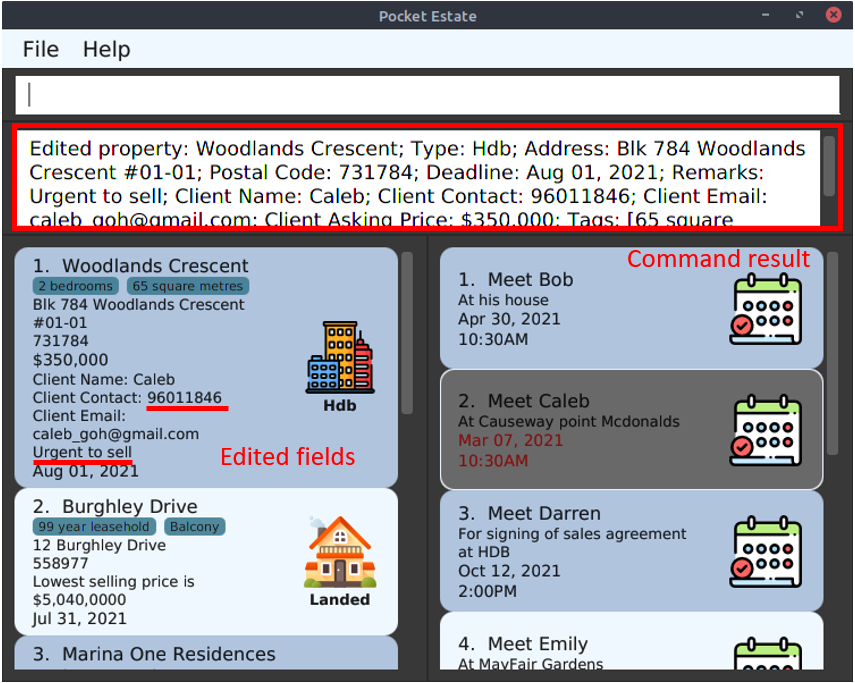
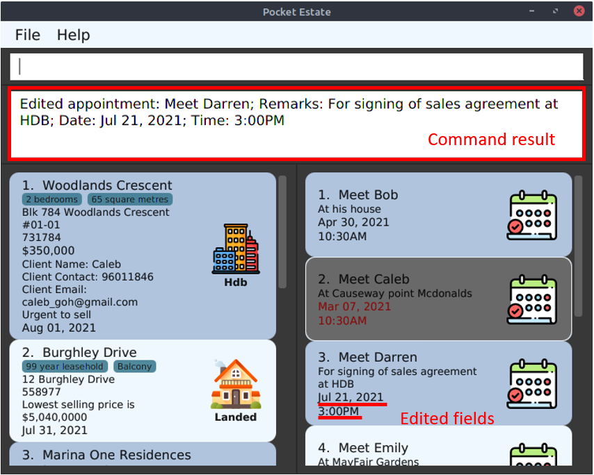
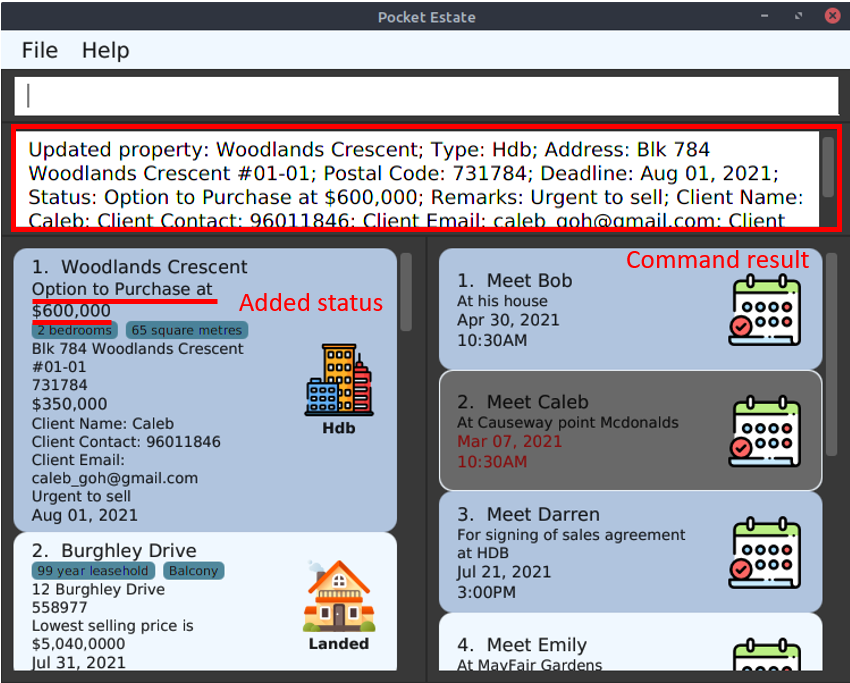
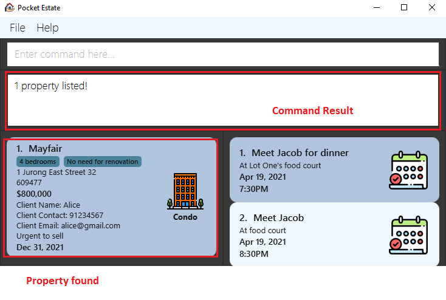
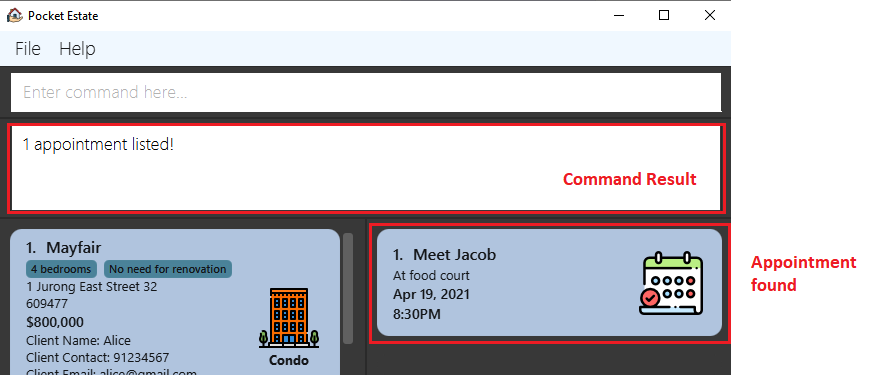
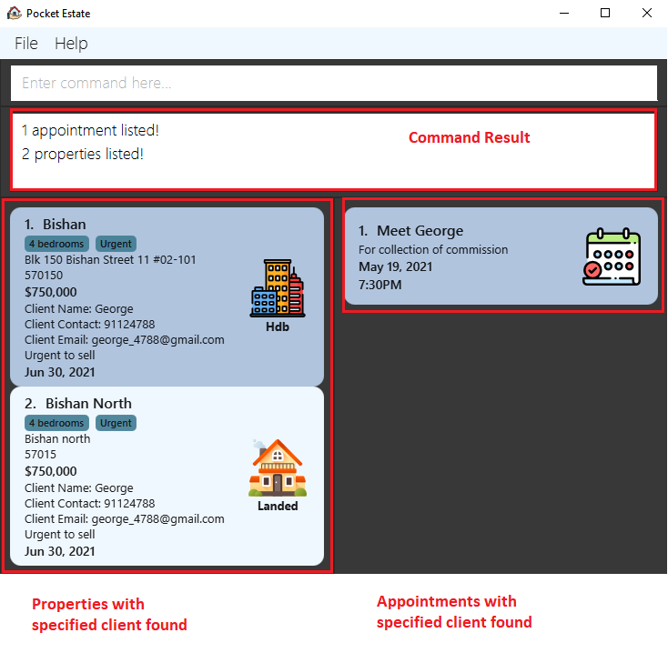
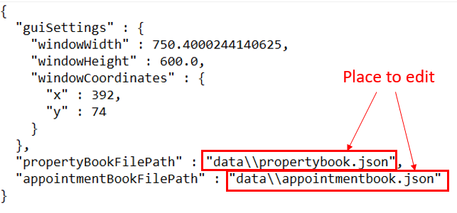

Welcome to the PocketEstate User Guide! Learn how to use PocketEstate to efficiently organize property data, manage clientele information and keep track of your upcoming appointments.

## Table of Contents
{: .no_toc}

* Table of Contents
{:toc}

## 1. Introduction

### 1.1 What is PocketEstate?

PocketEstate is a desktop application for property agents to efficiently and effectively manage property data and appointment schedules. With PocketEstate, you can easily organize your property and clientele information, as well as keep track of your schedules and deadlines.

PocketEstate is also highly optimized for users who can type fast and prefer typing over other means of input, allowing fast completion of most tasks solely via Command Line Interface (CLI).

### 1.2 Using this User Guide

This user guide uses various formatting styles to facilitate reading and to communicate ideas more effectively. Here are some important conventions to take note of when reading this user guide:

| Conventions               | Meaning                                                      |
|---------------------------|--------------------------------------------------------------|
| **Bold**                  | Important information                                        |
| :information_source: Note | Additional information                                       |
| :bulb: Tip                | Helpful tips                                                 |
| :exclamation: Caution     | Things to watch out for                                      |
| <kbd>Keyboard</kbd>       | Keyboard buttons                                             |
| `Code`                    | Examples                                                     |
| [SQUARE_BRACKETS]         | Optional parameters of a command                             |
| UPPER_CASE                | Parameters of a command to be supplied by the user           |
| ...                       | Parameters of a command that can be used multiple times      |

## 2. Quick start

### 2.1 Download and Launch

1. Ensure you have **Java 11 or above** installed in your Computer.

1. Download the latest `pocketestate.jar` from [here](https://github.com/AY2021S2-CS2103T-T13-4/tp/releases).

1. Copy the file to the folder you want to use as the **home folder** for PocketEstate.

1. **Double-click** the file to start the app. A Graphical User Interface (GUI) similar to the below should appear in a few seconds. Note how the app contains some sample data.  

   

### 2.2 Trying out

1. Let's try out your first command by adding a new property! Type  `add property n/Bishan t/Hdb a/Blk 150 Bishan Street 11 #02-101 p/570150 d/30-06-2021` into the command box and press <kbd>Enter</kbd> to execute it. After that, scroll down to the bottom of the property list to see your newly added property.
1. Want to view the properties in order of their asking price? Type the command  `sort property o/desc k/price` and press <kbd>Enter</kbd>. The property list will now be in descending order based on price, with the property having the highest asking price at the top.
1. Now let's try adding a new appointment. Type  `add appointment n/Meet Jacob r/For collection of commission d/19-05-2021 t/1930` and hit the <kbd>Enter</kbd> button. Scroll down to the bottom of the appointment list to see your newly added appointment.
1. Forgot when you are supposed to meet Simon again? Let's try finding out! Type  `find appointment n/simon` and press <kbd>Enter</kbd>. There it is! Your appointment with Simon is on Sep 20, 2021, at 12:00PM.

:bulb: **Tip:**
 Some other example commands you can try:

{::nomarkdown}
<ul>
  <li>{:/}`list all`{::nomarkdown} : Lists all properties and appointments in the app.</li>
  <li>{:/}`delete property 2`{::nomarkdown} : Deletes the 2nd property shown in the current list of properties.</li>
  <li>{:/}`clear appointment`{::nomarkdown} : Clears all existing appointment data from the app.</li>
  <li>{:/}`exit`{::nomarkdown} : Exits the app.</li>
</ul>
{:/}

For a quick reference of the available commands and their syntax, refer to the [Command Summary](#7-command-summary) section.

## 3. User Interface

### 3.1 Design

PocketEstate boasts a minimalist design with alternating steel blue and light blue colours for regular properties/ appointments as its main design scheme. We also feature a grey background for property and appointment listings with an expired deadline to allow users to better focus on current properties/ appointments.

### 3.2 Property Icons

We also use the following symbols for easier identification of different property types in the app:

{::nomarkdown}
{:/} Property Types | {::nomarkdown}
{:/} Symbols
--------|------------------
{::nomarkdown}
{:/} Hdb | {::nomarkdown}
{:/} 
{::nomarkdown}
{:/} Condo | {::nomarkdown}
{:/} 
{::nomarkdown}
{:/} Landed | {::nomarkdown}
{:/} 

## 4. Commands

**:information_source: Notes about the command format:** 

* Words in `UPPER_CASE` are the parameters to be supplied by the user. 
  e.g. in `add property n/NAME`, `NAME` is a parameter which can be used as  `add property n/Bishan`.

* Items in square brackets are optional. 
  e.g `add property n/NAME t/PROPERTY_TYPE a/ADDRESS p/POSTAL_CODE d/DEADLINE [r/REMARKS] [cn/CLIENT_NAME] [cc/CLIENT_CONTACT_NUMBER] [ce/CLIENT_EMAIL] [ca/CLIENT_ASKING_PRICE] [tags/TAGS_SEPARATED_BY_COMMAS]` can be used as  `add property n/Bishan t/Hdb a/Blk 150 Bishan Street 11 #02-101 p/570150 d/30-06-2021`   or as  `add property n/Bishan t/Hdb a/Blk 150 Bishan Street 11 #02-101 p/570150 d/30-06-2021 r/Urgent to sell cn/George cc/91124788 ce/george_4788@gmail.com ca/$750,000 tags/Urgent, 4 bedrooms`.

* Items with `…` after them should be used at least once. 
  e.g. `[KEYWORD]...` can be used as `george`, `george jacob` etc.

* Parameters can be in any order. 
  e.g. if the command specifies `n/NAME r/REMARKS`, `r/REMARKS n/NAME` is also acceptable.

* If a parameter is expected only once in the command but you specified it multiple times, only the last occurrence of the parameter will be taken. 
  e.g. if you specify `n/The Mayfair n/Mayfair`, only `n/Mayfair` will be taken.

* Extraneous parameters for commands that do not take in parameters (such as `help`, and `exit`) will be ignored. 
  e.g. if the command specifies `help 123`, it will be interpreted as `help`.

### 4.1 General

#### 4.1.1 Viewing help : `help`

Shows a message explaining how to access the help page. A link to the user guide will be provided.

Format: `help`

#### 4.1.2 Exiting the program : `exit`

Exits the program.

Format: `exit`

### 4.2 Adding

#### 4.2.1 Adding a property: `add property`

Adds a property to the app.

Format: `add property n/NAME t/PROPERTY_TYPE a/ADDRESS p/POSTAL_CODE d/DEADLINE [r/REMARKS] [cn/CLIENT_NAME] [cc/CLIENT_CONTACT_NUMBER] [ce/CLIENT_EMAIL] [ca/CLIENT_ASKING_PRICE] [tags/TAGS_SEPARATED_BY_COMMAS]​`

Description:
* Each property has a **unique pair of address and postal code**.
  * No two properties with the exact same pair of address and postal code can exist in the app at the same time.
* Property types can be either Hdb , Condo  or Landed 
* The format for specifying a deadline date is **`DD-MM-YYYY`**.
* Postal codes should have a **minimum of 5 digits** and a **maximum of 10 digits**.
* Client's contact number should have a **minimum of 7 digits** and a **maximum of 15 digits**.
* There can be multiple tags but different tags should be **separated with a comma**.   e.g. `tags/TAGS_SEPARATED_BY_COMMAS` can be used as `tags/Freehold`, `tags/Freehold, 5 bedrooms`, `tags/Freehold, 5 bedrooms, Near MRT` etc.
* The property to be added **cannot have a deadline that is already passed**.

Examples:
* `add property n/Bishan t/Hdb a/Blk 150 Bishan Street 11 #02-101 p/570150 d/30-06-2021`

* `add property n/The Estuary t/Condo a/97 Yishun Ave 1 p/769138 d/01-01-2022 r/Owner is up for negotiation of selling price cn/Sam cc/87553781 ce/sam_goh@gmail.com ca/$1,200,000 tags/99 year leasehold, Reservoir view`

#### 4.2.2 Adding an appointment: `add appointment`

Adds an appointment to the app.

Format: `add appointment n/NAME r/REMARKS d/DATE t/TIME​`

Description:
* Each appointment has a **unique pair of date and time**.
  * No two appointments with the exact same pair of meeting date and time can exist in the app at the same time.
* The format for specifying a date is **`DD-MM-YYYY`**.
* The format for specifying a time is **`HHMM`** (in 24-hour clock).
* The appointment to be added **cannot have a meeting date and time that is already passed**.

Examples:
* `add appointment n/Meet Jacob r/For collection of commission d/19-05-2021 t/1930`

* `add appointment n/Meeting at agency r/Company is setting new sales target for the month d/01-06-2021 t/1300`

### 4.3 Editing

#### 4.3.1 Editing a property : `edit property`

Overwrites the information of the property according to the user input provided.

Format: `edit property INDEX [n/NAME] [t/PROPERTY_TYPE] [a/ADDRESS] [p/POSTAL_CODE] [d/DEADLINE] [r/REMARKS] [cn/CLIENT_NAME] [cc/CLIENT_CONTACT_NUMBER] [ce/CLIENT_EMAIL] [ca/CLIENT_ASKING_PRICE] [tags/TAGS_SEPARATED_BY_COMMAS]​`

:bulb: **Tip:**

There can be multiple tags but different tags should be separated with a comma.   e.g. `tags/TAGS_SEPARATED_BY_COMMAS` can be used as `tags/Freehold`, `tags/Freehold, 5 bedrooms`, `tags/Freehold, 5 bedrooms, Near MRT` etc.

Description:
* Edits the entry at the specified `INDEX`. The index refers to the index number shown in the displayed list. The index **must be a positive integer** 1, 2, 3, …​
* At least one of the optional fields must be provided.
* Existing values will be updated to the input values.
* The edited property **cannot have a deadline that is already passed**.

 

:bulb: **Tip:**

To remove tags from a property, you can use the command `edit property INDEX tags/`.   e.g. `edit property 1 tags/` can be used to remove all the tags from the property at index 1.

Examples:
*  `edit property 1 r/Urgent to sell cc/96011846` Edits the remark and client's contact number of the 1st property to be `Urgent to sell` and `96011846` respectively.

#### 4.3.2 Editing an appointment : `edit appointment`

Overwrites the information of the appointment according to the user input provided.

Format: `edit appointment INDEX [n/NAME] [r/REMARKS] [d/DATE] [t/TIME]`

Description:
* Edits the entry at the specified `INDEX`. The index refers to the index number shown in the displayed list. The index **must be a positive integer** 1, 2, 3, …​
* At least one of the optional fields must be provided.
* Existing values will be updated to the input values.
* The edited appointment **cannot have a meeting date and time that is already passed**.

Examples:
*  `edit appointment 3 d/21-07-2021 t/1500` Edits the date and time of the 3rd appointment to be `21-07-2021` and `1500` respectively.

### 4.4 Deleting

#### 4.4.1 Removing a property : `delete property`

Deletes the property at the specified index from the app.

Format:
* `delete property INDEX`

Description:
* Deletes the property at the specified `INDEX`. The index refers to the index number shown in the displayed list. The index **must be a positive integer** 1, 2, 3, …
* The field INDEX must be provided.

Examples:
*  `delete property 7` deletes the property at index `7`.

#### 4.4.2 Removing an appointment : `delete appointment`

Deletes the appointment at the specified index from the app.

Format:
* `delete appointment INDEX`

Description:
* Deletes the appointment at the specified `INDEX`. The index refers to the index number shown in the displayed list. The index **must be a positive integer** 1, 2, 3, …
* The field INDEX must be provided.

Examples:
*  `delete appointment 7` deletes the appointment at index `7`.

### 4.5 Listing

#### 4.5.1 Listing all properties and appointments : `list all`

Shows a list of all properties and appointments in the app.

Format:
* `list all`

#### 4.5.2 Listing all properties : `list property`

Shows a list of all properties in the app.

Format:
* `list property`

#### 4.5.3 Listing all appointments : `list appointment`

Shows a list of all appointments in the app.

Format:
* `list appointment`

### 4.6 Updating status

#### 4.6.1 Updating the status of a property : `update`

Updates the status of a property from Option to Purchase, to Sales and Purchase Agreement to Completion

Format:
* `update INDEX OPTION`

Description:
* Updates the status of the property at the specified `INDEX`. The index refers to the index number shown in the displayed list. The index **must be a positive integer** 1, 2, 3, …​

Options:
* `u/new AMOUNT`

    `u/new` can only be used on a property without an existing status. `AMOUNT` is the amount of money that is offered in the Option to Purchase

* `u/proceed`

    Can only be used on a property with an existing status. `u/proceed` would move the status on to the next one. e.g. `Option` to `SalesAgreement` or `SalesAgreement` to `Completion`.

* `u/cancel`

  Can only be used on a property with an existing status. `u/cancel` would remove the status of the property

Status Types:

* `Option` represents the state when the Option to Purchase has been exercised for the property
* `SalesAgreement` represents the state when the Sales and Purchase Agreement has been issued
* `Completion` represents the state when the sales of the property has completed

Examples:
*  `update 1 u/new 600000` Creates a new status with amount 600000 for the 1st property.
*  `update 3 u/proceed` Moves the status of the 3rd property to next one.

### 4.7 Sorting

#### 4.7.1 Sorting properties: `sort property`

Sorts and shows a list of properties that are sorted by the specified sorting key in the specified sorting order.

Format:
* `sort property o/SORTING_ORDER k/SORTING_KEY`

Description:
* Sorts properties by the specified sorting key in ascending or descending order.
* The sorting key and sorting order fields must be specified.
* The `SORTING_ORDER` can only take values of `asc` and `desc`.
* The `SORTING_KEY` can take values of `name`, `price`, `postalcode`, `address`, or `deadline`, and it should not be any other values.

Examples:
*  `sort property o/asc k/name` Sorts `property` by `name` in ascending order.

#### 4.7.2 Sorting appointments: `sort appointment`

Sorts and shows a list of appointments that are sorted by the specified sorting key in the specified sorting order.

Format:
* `sort appointment o/SORTING_ORDER k/SORTING_KEY`

Description:
* Sorts appointments by the specified sorting key in ascending or descending order.
* The sorting key and sorting order fields must be specified.
* The `SORTING_ORDER` can only take values of `asc` and `desc`.
* The `SORTING_KEY` can take values of either `datetime` or `name`, and it should not be any other values.

Examples:
*  `sort appointment o/asc k/datetime` Sorts `appointment` by `datetime` in ascending order.

### 4.8 Undoing

#### 4.8.1 Undoing : `undo`

Undoes the last add, delete, edit or clear commands in the command history.

Format:
* `undo`

Description:
* Undoes the last add, delete, edit, or clear commands in the command history.

Examples:
*  `undo` after command `delete appointment 1` adds the deleted appointment back to the app.

### 4.9 Searching

#### 4.9.1 Searching properties: `find property`

Finds all properties containing any of the specified keywords (case-insensitive) and/or with the given options. 

Format:
* `find property [n/NAME] [pl/UPPER_PRICE_LIMIT] [pm/LOWER_PRICE_LIMIT] [t/PROPERTY_TYPE] [a/ADDRESS] 
[p/POSTAL_CODE] [d/DEADLINE] [r/REMARKS] [cn/CLIENT_NAME] [cc/CLIENT_CONTACT] 
[ce/CLIENT_EMAIL] [tags/TAGS_SEPARATED_BY_COMMAS]`

Description:
* There can be 1 or more parameters. 
* If a same option is used multiple times, entries matching **either** will be returned as results. 
    * For example: `find property n/jurong n/woodlands` will match all properties containing either "jurong" or "woodlands" in their names, i.e. both "Jurong BLK123" and "Woodlands Condo" will be matched. 
* All text are case insensitive.

Options:
* `[n/NAME]`

    Searches for properties with names that contain the keywords in `NAME`, i.e. "Mayfair" matches `find property n/mayfair` but not `find property n/may`. 

* `[pl/PRICE_UPPER_LIMIT]`

    Searches for properties with prices less than `[PRICE_UPPER_LIMIT]`.

* `[pm/PRICE_LOWER_LIMIT]`

    Searches for properties with prices more than `[PRICE_LOWER_LIMIT]`.
    
* `[t/PROPERTY_TYPE]`

    Searches for properties whose property type field contain patterns specified in `[t/PROPERTY_TYPE]`.

    The following property types are supported: 
    Hdb, Condo, Landed
    
* `[a/ADDRESS]`
    
    Searches for properties containing `[ADDRESS]` in address. 
        
* `[p/POSTAL_CODE]`
    
    Searches for properties containing `[POSTAL_CODE]` in postal code. 
        
* `[d/DEADLINE]`
    
    Searches for properties containing `[DEADLINE]` in deadline. 
        
* `[r/REMARKS]` 

    Searches for properties containing `[REMARKS]` in their remarks. 

* `[cn/CLIENT_NAME]` 

    Searches for properties whose clients contain `[CLIENT_NAME]` in their names. 
     
* `[cc/CLIENT_CONTACT]`

    Searches for properties whose clients' contact numbers contains `[CLIENT_CONTACT]`. 

* `[ce/CLIENT_EMAIL]` 

    Searches for properties whose clients' emails contains `[CLIENT_EMAIL]`. 

* `[tags/TAGS_SEPARATED_BY_COMMAS]`

    Searches for properties whose tags contains tags in `[TAGS_SEPARATED_BY_COMMAS]`. `TAGS_SEPARATED_BY_COMMAS` consists of all tags you wish to search for, all separated with comma. 

Examples:
* `find property n/mayfair`
* `find property n/bishan north t/hdb pl/$1,000,000`
* `find property pl/1000000 t/hdb a/1 Jurong East Street 32, #08-111 tags/3 bedrooms, need renovation cc/91234567`

#### 4.9.2 Searching appointments: `find appointment`

Finds all appointments containing any of the specified keywords (case-insensitive) and/or with the given parameters. 

Format:
* `find appointment [n/NAME] [r/REMARKS] [d/DATE] [t/TIME]`

Description:
* There can be 1 or more options. 
* If a same option is used multiple times, entries matching **either** will be returned as results. 
    * For example: `find appointment n/john n/alex` will match all appointments containing either "alex" or "john" in their names, i.e. both "Meet Alex" and "Meet John" will be matched. 
* All text are case insensitive.

Options: 
* `[n/NAME]`
    
    Searches for appointments that contain the keywords `[NAME]` in their names, i.e. "Meet Alex" matches `find appointment n/alex` but not `find appointment n/al`. 
    
* `[r/REMARKS]` 

    Searches for appointments containing `[REMARKS]` in their remarks. 
    
* `[d/DATE]`
    
    Searches for properties with `[DATE]` as date. 
        
* `[t/TIME]`
    
    Searches for properties with `[TIME]` as time.

Examples:
* `find appointment n/bob`
* `find appointment n/alex d/25-12-2021`
* `find appointment t/2030`

#### 4.9.3 Searching clients: `find client`

Finds appointments that matches the keywords and properties whose clients matches the same keywords. Both are done at the same time.

Format:
* `find client [KEYWORD]...`

Description:
* There can be 1 or more keywords. Keywords are case insensitive.

Examples: 
* `find client jacob`
* `find client george`

### 4.10 Clearing

#### 4.10.1 Clearing all entries : `clear all`

Clears all properties and appointments from the app.

Format:
* `clear all`

#### 4.10.2 Clearing all properties : `clear property`

Clears all properties from the app.

Format:
* `clear property`

#### 4.10.3 Clearing all appointments : `clear appointment`

Clears all appointments from the app.

Format:
* `clear appointment`

## 5. Storage

#### 5.1 Saving the data

PocketEstate data are saved in the hard disk automatically after any command that changes the data. There is no need to save manually. PocketEstate data are saved as a JSON file after any command that modifies the data of the app.

The default storage data file paths used are:

* Property storage data file: `[JAR file location]/data/propertybook.json`.
* Appointment storage data file: `[JAR file location]/data/appointmentbook.json`.

#### 5.2 Editing the data files

Advanced users are welcome to update data directly by editing the data files.

:exclamation: **Caution:**
If your changes to the data file makes its format invalid, PocketEstate will discard all data and start with an empty data file at the next run. For example, if the property storage data file is corrupted but the appointment storage data file is in the correct format, PocketEstate will start with an empty data file for properties and use the original data file for appointments.

#### 5.3 Specifying the data files

It is also possible to specify your own property and/or appointment storage data files. In the `preferences.json` file that is generated when you first launch the app, you may edit the values of `propertyBookFilePath` and/or `appointmentBookFilePath` to your own property and appointment storage file paths respectively.

:bulb: **Tip:** For advanced users, it is also possible to specify your own configuration file, which contains your preferred preference file path. Refer to <a href="#81-launching-application-via-command-line">Appendix: Launching application via command line</a> for more information.

--------------------------------------------------------------------------------------------------------------------

## 6. FAQ

**Q**: How do I transfer my data to another Computer? 
**A**: Install the app in the other computer and overwrite the empty data file it creates with the file that contains the data of your previous PocketEstate home folder.

--------------------------------------------------------------------------------------------------------------------

## 7. Command summary

Action | Format, Examples
--------|------------------
**Help** | `help`
**Exit** | `exit`
**Add property** | `add property n/NAME t/PROPERTY_TYPE a/ADDRESS p/POSTAL_CODE d/DEADLINE [r/REMARKS] [cn/CLIENT_NAME] [cc/CLIENT_CONTACT_NUMBER] [ce/CLIENT_EMAIL] [ca/CLIENT_ASKING_PRICE] [tags/TAGS_SEPARATED_BY_COMMAS]`    e.g., `add property n/Bishan t/Hdb a/Blk 150 Bishan Street 11 #02-101 p/570150 d/30-06-2021 r/Urgent to sell cn/George cc/91124788 ce/george_4788@gmail.com ca/$750,000 tags/Urgent, 4 bedrooms`
**Add appointment** | `add appointment n/NAME r/REMARKS d/DATE t/TIME`    e.g., `add appointment n/Meet Jacob r/For collection of commission d/19-05-2021 t/1930`
**Edit property** | `edit property INDEX [n/NAME] [t/PROPERTY_TYPE] [a/ADDRESS] [p/POSTAL_CODE] [d/DEADLINE] [r/REMARKS] [cn/CLIENT_NAME] [cc/CLIENT_CONTACT_NUMBER] [ce/CLIENT_EMAIL] [ca/CLIENT_ASKING_PRICE] [tags/TAGS_SEPARATED_BY_COMMAS]`   e.g.,`edit property 1 r/Urgent to sell cc/96011846`
**Edit appointment** | `edit appointment INDEX [n/NAME] [r/REMARKS] [d/DATE] [t/TIME]`   e.g.,`edit appointment 3 d/21-07-2021 t/1500`
**Delete property** | `delete property INDEX`   e.g.,`delete property 7`
**Delete appointment** | `delete appointment INDEX`   e.g.,`delete appointment 7`
**List all properties and appointments** | `list all`
**List property** | `list property`
**List appointment** | `list appointment`
**Update status** | `update INDEX OPTION`    Options:  {::nomarkdown}<ul> <li>{:/}`u/new AMOUNT`{::nomarkdown}</li> <li>{:/}`u/proceed`{::nomarkdown}</li> <li>{:/}`u/cancel`{::nomarkdown}</li> </ul>{:/} e.g.,`update 1 u/new 600000`
**Sort property** | `sort property o/SORTING_ORDER k/SORTING_KEY `   e.g., `sort property o/asc k/price`
**Sort appointment** | `sort appointment o/SORTING_ORDER k/SORTING_KEY `   e.g., `sort appointment o/asc k/datetime`
**Find property** | `find property [n/NAME] [pl/UPPER_PRICE_LIMIT] [pm/LOWER_PRICE_LIMIT] [t/PROPERTY_TYPE] [a/ADDRESS] [p/POSTAL_CODE] [d/DEADLINE] [r/REMARKS] [cn/CLIENT_NAME] [cc/CLIENT_CONTACT] [ce/CLIENT_EMAIL] [tags/TAGS_SEPARATED_BY_COMMAS]`    e.g. `find property n/bishan north t/hdb pl/$1,000,000`
**Find appointment** | `find appointment [n/NAME] [r/REMARKS] [d/DATE] [t/TIME]`    e.g., `find appointment n/bob d/23-12-2021`
**Find client** | `find client [KEYWORD]...`    e.g., `find client alice`
**Clear all properties and appointments** | `clear all`
**Clear property** | `clear property`
**Clear appointment** | `clear appointment`
**Undo** | `undo`

## 8. Appendix

### 8.1 Launching application via command line

For advanced users, it is also possible to launch the app via the command line. Doing so will allow you the option of specifying your own configuration file.  The configuration file can be used to specify the location of the preferences file, which contains the preferred storage file paths for both property and appointment data.

The default file paths used are:

* Configuration file: `[JAR file location]/config.json`
* Preferences file: `[JAR file location]/preferences.json`

:information_source: **Note:** However, if the specified configuration file or the preferences file is in an incorrect format, the default file paths will be used.

To launch PocketEstate via the command line,

1. First, open up your command prompt or terminal.
1. Then, `cd` into the base directory containing the `pocketestate.jar` file.
1. Run `java -jar pocketestate.jar --config={path_to_config_file.json}`, replacing `{path_to_config_file.json}` with your own JSON configuration file. 
E.g. `java -jar pocketestate.jar --config=myConfigFile.json`
