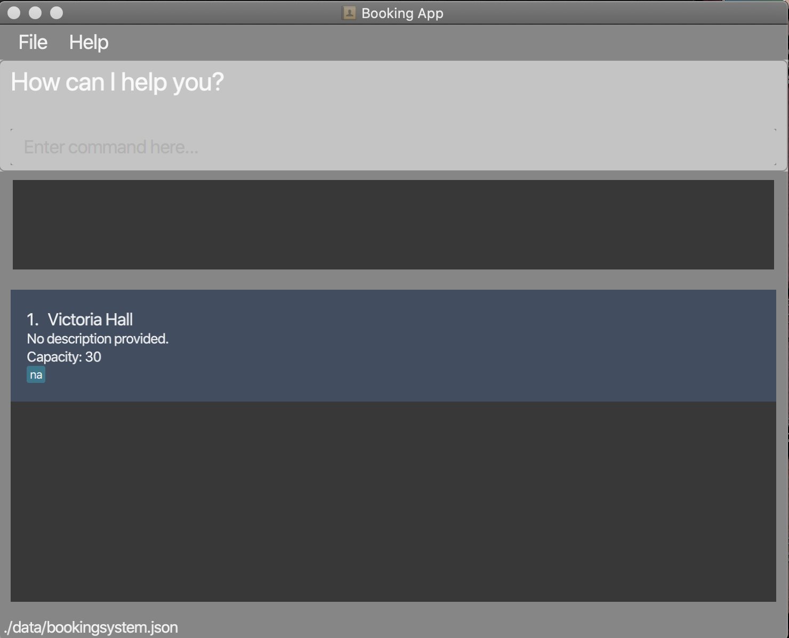

* Table of Contents
{:toc}

--------------------------------------------------------------------------------------------------------------------

## **1. About BookCoin**
BookCoin (to the Moon) is a **desktop app for managing bookings that presents users with a structured and detailed information on facility availability via a Command Line Interface** (CLI) while still having the benefits of a Graphical User Interface (GUI). BookCoin is designed for administrative personnels of schools or organisations who need to manage bookings across a large number of facilities. If you can type fast, BookCoin can get your facility management tasks done faster than traditional GUI apps. Enjoy!

## **2. Quick start**

1. Ensure you have Java `11` or above installed in your Computer.

1. Download the latest `bookingapp.jar` [here](https://github.com/AY2021S2-CS2103-W17-3/tp/releases).

1. Copy the file to the folder that you want to use as the _home folder_ for BookCoin.

1. Run `java -jar bookingapp.jar via your terminal` (preferred). As a second alternative, double-click the file to start the app. The GUI similar to the below should appear in a few seconds.  

      
   Note how the app contains some sample data. This is for you to test out the commands first, and you may delete them using the `clear` command when you are ready to use the app for your own purposes.  

1. Type the command in the command box and press <kbd>Enter</kbd> to execute it. e.g. typing **`help`** and pressing <kbd>Enter</kbd> will open the help window. 
   Some example commands you can try:

   * **`list_venue`** : Lists all venues.

   * **`add_venue v/Chua Thian Poh Hall`** : Starts a multi-step command to create a venue named `Chua Thian Poh Hall`. Fill in the prompts as directed.

   * **`exit`** : Exits the app.

1. Refer to the [Features](#3-features) below for details of each command.

**:information_source: Using BookCoin:** 

This section gives an overview of BookCoin’s layout so that you can get started quickly.

**There are four main segments in BookCoin:**
* Tabs that allow you to navigate between Persons, Venues and Bookings

* A command box as well as a result display box at the top left of the application

* A bookmark list on the left of the screen

* A main viewing area that would display complete information about a person, venue or booking

--------------------------------------------------------------------------------------------------------------------

## **3. Features**

**:information_source: Notes about the command format:** 

* Words in `UPPER_CASE` are the parameters to be supplied by the user. 
  e.g. in `find_venue v/VENUE_NAME`, `VENUE_NAME` is a parameter which can be used as `find_venue v/Victoria Hall`.

* Items in square brackets are optional. 
  e.g. `add_venue v/VENUE_NAME [max/MAXIMUM_OCCUPANCY]` can be used as `v/Chua Thian Poh Hall max/40` or as `v/Chua Thian Poh Hall`.
* If a parameter is expected only once in the command, but you specified it multiple times, only the last occurrence of the parameter will be taken. 
  e.g. if you specify `p/12341234 p/56785678`, only `p/56785678` will be taken.

* Extraneous parameters for commands that do not take in parameters (such as `exit`) will be ignored. 
  e.g. if the command specifies `exit 123`, it will be interpreted as `exit`.

### 3.1. General features and commands

#### 3.1.1. Viewing all available commands : `help`

Displays the link to the user guide.

Format: `help`

#### 3.1.2. Deletes all records : `clear`

Deletes all records in the booking system.

Format: `clear`

**:information_source: Warning about clear command:** 

* The clear command is especially useful for first time users because the app would first launch with sample data for new users
  to have greater convenience when testing app functionalities. Users can then use the clear command to
  clear the database of sample data after familiarising themselves with the app.

* To prevent indiscriminate or accidental use of the clear command which could be potentially disastrous, we have included an
  inbuilt confirmation message that users would need to affirm.

#### 3.1.3. Saving data

BookCoin data is saved in the hard disk automatically after any command which results in changes the data. There is no need to save manually.

#### 3.1.4. Exiting the program : `exit`

Exits the program.

Format: `exit`

### 3.2. Commands specific to multi-step commands

**:information_source: More information about multi-step commands:** 

* Some commands require multiple input information which can be very tedious to type in one go.
Multi-step commands therefore allow such commands to be used with greater ease by users as the system will prompt them to input items one at a time. To skip input for optional fields, you can just press the <kbd>Enter</kbd> key without typing anything when prompted to enter an optional field.
* The multi-step commands currently supported in v1.4 are `add_person`, `add_venue` and `add_booking`.
* The commands listed in this section are specific to multi-step commands and are only applicable when the user is in the middle of a multi-step command.

#### 3.2.1. Undo previous input : `undo`

Brings the prompt of the multi-step command back to the previous step if users made a typo and wish to re-enter their input for the previous field.

Format: `undo`

#### 3.2.2. Exiting prompting : `exit_prompt`

Exits the multi-step prompting for multi-step commands. After exiting prompting, you would be able to give command
inputs again. Other commands would not work if you do not exit the multi-step command.

Format: `exit_prompt`

### 3.3. Person

**:information_source: About persons:** 

* BookCoin stores information about venue bookers which is important for scheduling/ contacting purposes. When bookers are stored, their information can be used for multiple bookings in the future which allows you to access their details easily without having to repeat the same booker details multiple times across bookings.
* For your convenience, we use the term "person" in the app instead of "booker" to make a distinction between "booker" and "booking", which can be confusing.
* Persons are identified by their emails, hence all email inputs between persons must be unique. Phone inputs must also be unique between persons, but persons with the same name are allowed.

#### 3.3.1. Adding a person : `add_person` (Multi step command)

Adds a new person for the booking app. `add_person` is a multi-step command that will prompt you for additional input. Inputting 
`add_person n/NAME` will start the command and the app will guide you through the command through prompts for each field. As with other multi step commands, you can exit the command by entering `exit_prompt` at any point. Optional fields can be skipped by pressing the <kbd>Enter</kbd> key when you are prompted to input an optional field.

After keying in a valid initial input, the multi-step prompting will prompt you to enter details for the field email, phone and tags.
Email and phone number must be unique. Tags are optional.
Emails should be of the format local-part@domain. Phone numbers should only contain numbers, and it should be between 7 to 15 digits long (inclusive).  
Format: `add_person n/NAME`

#### 3.3.2. Editing a person : `edit_person`

Edits an existing person in the booking system. 

Format: `edit_person eo/EMAIL [n/NAME] [p/PHONE] [e/EMAIL] [t/TAG]`
* Edits the person with the specified `EMAIL` indicated in `eo/EMAIL` (case-insensitive).  
* At least one of the optional fields must be provided. The field(s) provided will replace the data in the existing field(s) of the specified person. 

Example:
* `edit_person eo/amy@example.com p/83984029 n/Jane` edits the person who currently has the email `amy@example.com`. The person's phone number is edited to `83984029` and name is edited to `Jane`.

#### 3.3.3. Deleting a person : `delete_person`

Deletes the specified person from the booking system.

Format: `delete_person e/EMAIL`
* Deletes the person with the specified `EMAIL` (case-insensitive).

Example:
* `delete_person e/johndoe@gmail.com` deletes the person with email `johndoe@gmail.com` from the system.

#### 3.3.4. Listing all persons : `list_person`

Shows a list of all persons in the booking app.

Format: `list_person`

#### 3.3.5. Finding a person : `find_person`

Shows a list of persons who match the specified field(s).

Format: `find_person [n/NAME] [p/PHONE] [e/EMAIL] [t/TAG]`
* The fields that can be specified include the person's `NAME`, `PHONE`, `EMAIL`, and `TAG`. At least one field must be provided.
* Matching is case-insensitive, and partial matching on a keyword is not accepted to reduce the number of unrelated search results for greater convenience in searching.
* Only for the `NAME` field, multiple keywords can be provided and must be separated by whitespace. Matching is successful as long as a person's name contains words that fully matches any of the specified keywords.

Example:
* `find_person n/John Doe t/Student` shows a list of persons whose name contains words that fully matches any of the two specified name keywords `John` and `Doe`, and is tagged with `Student`.

### 3.4. Venue

**:information_source: About venues:** 

* BookCoin stores information about venues which is important for scheduling/ contacting purposes. When bookers are stored, their information can be used for multiple bookings in the future which allows you to access their details easily without having to repeat the same venue details multiple times across bookings.
* Venues are identified by their venue names, hence all venue names between venues must be unique.

#### 3.4.1. Adding a venue : `add_venue` (Multi step command)

Adds a new venue for the booking app. `add_venue` is a multi-step command that will prompt you for additional input. Inputting 
`add_venue v/VENUE_NAME` will start the command and the app will guide you through the command through prompts for each field. As with other multi step commands, you can exit the command by entering `exit_prompt` at any point. Optional fields can be skipped by pressing the <kbd>Enter</kbd> key when you are prompted to input an optional field.

After keying in a valid initial input, the multi-step prompting will prompt you to enter details for the following optional fields in the order stated, which can be skipped by pressing the <kbd>Enter</kbd> key:
* Venue capacity, which should be entered as a digit, with the maximum limit being 50000. Default capacity is set to 10.
* Venue description
* Tags, where multiple tags are required to be separated by commas. Tags should be alphanumeric without spaces, and consecutive commas without a tag in between are not allowed.

Format: `add_venue v/VENUE_NAME`

Example:
* `add_venue v/Chua Thian Poh Hall` adds a venue with venue name Chua Thian Poh Hall and a maximum capacity of 40.

#### 3.4.2. Editing a venue : `edit_venue`

Edits an existing venue in the booking system.

Format: `edit_venue vo/VENUE_NAME [v/VENUE_NAME] [max/MAXIMUM_OCCUPANCY] [d/DESCRIPTION] [t/TAG]`
* Edits the venue with the specified `VENUE_NAME` indicated in `vo/VENUE_NAME`(case-insensitive).
* At least one of the optional fields must be provided. The field(s) provided will replace the data in the existing field(s) of the specified venue.
* The provision of an empty `DESCRIPTION` field is accepted.

Examples:
* `edit_venue vo/Lab max/30 d/Used for experiments` edits the venue that currently has the venue name `Lab`. The venue's maximum capacity is edited to `30`.
* `edit_venue vo/Victoria Hall d/` edits the venue that currently has the venue name `Victoria Hall`. The venue's description, if any, is made empty.  

#### 3.4.3. Deleting a venue : `delete_venue`

Deletes the specified venue from the booking system.

Format: `delete_venue v/VENUE_NAME`
* Deletes the venue with the specified `VENUE_NAME` (case-insensitive).

Example:
* `delete_venue v/Volleyball Court` deletes the venue with the venue name `Volleyball Court` from the system.

#### 3.4.4. Listing all venues : `list_venue`

Shows a list of all venues in the booking app.

Format: `list_venue`

#### 3.4.5. Finding a venue : `find_venue`

Shows a list of venues that match the specified field(s).

Format: `find_venue [v/VENUE_NAME] [max/CAPACITY] [d/DESCRIPTION] [t/TAG]`
* The fields that can be specified include the venue's `VENUE_NAME`, `CAPACITY`, `DESCRIPTION`, and `TAG`. At least one field must be provided.
* Matching is case-insensitive, and partial matching on a keyword is not accepted to reduce the number of unrelated search results for greater convenience in searching.
* Only for the `NAME` and `DESCRIPTION` fields, multiple keywords can be provided and must be separated by whitespace. Matching is successful as long as a person's name contains words that fully matches any of the specified keywords.
* The provision of an empty `DESCRIPTION` field is accepted.

Example:
* `find_venue v/Victoria Hall max/50` shows a list of venues whose name contains words that fully matches any of the two specified venue name keywords `Victoria` and `Hall`. The venue must also have a maximum capacity of at least `50`.
* `find_venue d/` shows a list of venues that do not have description.

### 3.5. Booking

**:information_source: About venues:** 

* BookCoin stores information about bookings for scheduling/ contacting purposes. 
* Bookings are identified by their , hence all  between bookings must be unique.

#### 3.5.1. Adding a booking : `add_booking` (Multi step command)

Adds a new booking into the booking app. `add_booking` is a multi-step command that will prompt you for additional input. Inputting 
`add_booking` will start the command and the app will guide you through the command through prompts for each field. As with other multi step commands, you can exit the command by entering `exit_prompt` at any point. Optional fields can be skipped by pressing the <kbd>Enter</kbd> key when you are prompted to input an optional field.

The system will ask for and store the email of the booker, the venue booked, the start and end time of your booking (in the format YYYY-MM-DD HH:MM). You may also choose to add an optional description or tags for your booking.

Format: `add_booking`

#### 3.5.2. Editing a booking : `edit_booking`

Edits an existing booking in the booking system with the specified booking ID.

Format: `edit_booking INDEX [b/BOOKER_EMAIL] [v/VENUE_NAME] [d/DESCRIPTION] [bs/DATETIME] [be/DATETIME] [t/TAG]`

Examples:
* `edit_booking bid/8937936578 b/janetan@gmail.com` 
* `edit_booking bid/9384720480 v/Field`

#### 3.5.3. Deleting a booking : `delete_booking`

Deletes booking corresponding to the booking ID specified.

Format: `delete_booking INDEX`

Example:
* `delete_booking bid/232138762134`

#### 3.5.4. Listing all bookings : `list_booking`

Shows a list of all bookings and their corresponding IDs in the booking app.

Format: `list_booking`

#### 3.5.5. Finding a booking : `find_booking` 

Shows a list of bookings that match the specified field(s).

Format: `find_booking [e/BOOKER_EMAIL] [date/DATE] [v/VENUE_NAME] [d/DESCRIPTION] [t/TAG]`
* The fields that can be specified include the booking's `BOOKER_EMAIL`, `DATE`, ,`VENUE_NAME`, `DESCRIPTION`, and `TAG`. At least one field must be provided.
* Matching is case-insensitive, and partial matching on a keyword is not accepted to reduce the number of unrelated search results for greater convenience in searching.
* Only for the `VENUE_NAME` and `DESCRIPTION` fields, multiple keywords can be provided and must be separated by whitespace. Matching is successful as long as a person's name contains words that fully matches any of the specified keywords.
* The provision of an empty `DESCRIPTION` field is accepted.

Example:
* `find_booking e/johnd@gmail.com date/2020-02-12` shows a list of bookings booked by a person with the email `johnd@gmail.com`. The booking duration must also contain the date `2020-02-12`.
* `find_booking d/` shows a list of bookings that do not have descriptions.

### 3.6. Upcoming

#### 3.6.1. Undo command for all actions `[coming in v2.0]`
Undos the effect of a previous command if the command changes the data stored in the system (i.e. adds/ updates/ deletes any data)

Format: `undo`

#### 3.6.2. Generate file of booking schedule `[coming in v2.0]`
Generates an .ics file containing a timetable of the bookings for the particular venue given in a command.

Format `generate v/Victoria Hall`

--------------------------------------------------------------------------------------------------------------------

## **FAQ**

**Q**: How do I transfer my data to another Computer? 
**A**: Install the app in the other computer and overwrite the empty data file it creates with the file that 
contains the data of your previous BookCoin home folder.

--------------------------------------------------------------------------------------------------------------------

## **Command summary**

Action | Format, Example
--------|------------------
**add person** | `add_person n/NAME`   (Note: add_person is a multi-step command)
**delete person** | `delete_person e/EMAIL`   e.g. `delete_person e/jane@gmail.com`
**edit person** | `edit_person eo/EMAIL [n/NAME] [p/PHONE] [e/EMAIL] [t/TAG]`   e.g., `edit_person eo/jane@example.com p/94857267`
**find person** | `find_person e/EMAIL`   e.g., `find_person e/jane@example.com` 
**list person** | `list_person`
**add venue** | `add_venue v/VENUE_NAME`   (Note: add_venue is a multi-step command)
**delete venue** | `delete_venue v/VENUE_NAME`   e.g. `delete_venue v/Field`
**edit venue** | `edit_venue vo/VENUE_NAME [v/VENUE_NAME] [max/CAPACITY] [d/DESCRIPTION] [t/TAG]`   e.g., `edit_venue vo/Field v/Sports Field`
**find venue** | `find_venue v/VENUE_NAME`   e.g., `find_venue v/Field`
**list venue** | `list_venue`
**add booking** | `add_booking`   (Note: add_booking is a multi-step command)
**delete booking** | `delete_booking INDEX`   e.g. `delete_booking 1`
**edit booking** | `edit_booking INDEX [b/BOOKER_EMAIL] [v/VENUE_NAME] [d/DESCRIPTION] [bs/DATETIME] [be/DATETIME] [t/TAG]`   e.g., `edit_booking 1 e/doe@gmail.com`
**find person** | `find_booking INDEX`   e.g., `find_booking 1`
**list booking** | `list_booking`
**help** | `help`
**clear** | `clear`
**exit** | `exit`
