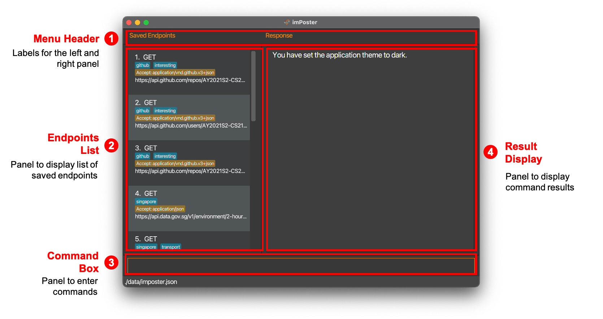

 

## Table of Contents

* Table of Contents 
{:toc}

## Welcome to imPoster

Are you an aspiring API developer? Or would you like a peek into the world of how applications communicate with one another? Then **imPoster** is the app just for you! But hold on, what is imPoster?

imPoster is a desktop application for beginners of API development to quickly grasp the basics. Whether you are looking to **explore**, **test**, or **build** your very own APIs, the simple and minimalistic style of imPoster will quickly get you up and going.

This user guide assumes its users to have a basic understanding of APIs. An appendix has been provided for users who may be unfamiliar with the concept, but it is highly recommended for users to refer to proper tutorial contents for the basics of APIs prior to using the application.

For fast typists, imPoster is also highly optimised for the command line and can be fully operated through keyboard commands. Users who are familiar with **CURL** will also be happy to know that we share a very similar command line syntax. If you have yet to do so, be sure to download our [latest releases](https://imposter-dev.tk) from our main website and give us a try!

## Navigating the User Guide

Before diving into the rest of the contents in our user guide, the following are some important syntaxes to take note of to facilitate your reading:

| Syntax              | Description                                    |
| -----------------   | ---------------------------------------------- |
| **Bold**            | Key words                                      |
| `Markdown`          | User commands                                  |
| UPPER_CASE          | Parameters of a user command                   |
| [Square Brackets]   | Optional parameters of a user command          |
| <kbd>Keyboard</kbd> | Keyboard actions                               |
| 
:bulb: Tips
 | Useful tips |
| 
:exclamation: Caution
 | Things to watch out for |
|  | Annotations |

## Quickstart

1. Ensure you have **Java 11 or above** installed in your Computer.

1. Download the latest **imposter.jar** from
   [here](https://github.com/AY2021S2-CS2103T-T12-4/tp/releases).

1. Move the file to the folder you wish to use as the **home folder** for
   imPoster.

1. Double-click the file to start the application. A graphical user interface (GUI) similar to the one
   below should appear after a few seconds. Note the layout of the application: 

  

1. Try making your first API call through our application by typing `send 1` in the **command box** and then pressing <kbd>Enter</kbd>!
2. For a quick overview of all available commands, please refer to our [Command Summary](#command-summary).
3. For the details of each command, please proceed to the section on [Commands](#commands).

---

## Commands

### <ins>General Commands</ins>

#### View help: `help`

Description: Get the link to the user guide to the application in the form of a pop up window.

Format: `help`

#### Toggle theme: `toggle`

Description: Toggle the theme for the application.

Format: `toggle THEME`

Example:
- `toggle light`

#### Exit program: `exit`

Description: Exit the application.

Format: `exit`

### <ins>Endpoint Commands</ins>

#### Add an API endpoint: `add`

Description: Add an API endpoint to the API endpoint list.

Format: `add -x METHOD -u URL [-d DATA] [-h HEADER]… [-t TAG]…`

`DATA` must be in **JSON** format and `HEADER` must be enclosed in `" "` else an error message will be shown.

Examples:
- `add -x GET -u http://localhost:3000/ -d {"some": "data"} -h "key1: value1" -h "key2: value2" -t local -t data`
- `add -x GET -u https://api.data.gov.sg/v1/environment/pm25`

**Tip:** An endpoint can have any number of **unique** tags and headers (including 0).

**Tip 2:** An endpoint can only have 0 or 1 data.

#### Edit an API endpoint: `edit`

Description: Edit the API endpoint at the specified index shown in the API endpoint list (at least one optional argument must be provided).

Format: `edit INDEX [-x METHOD] [-u URL] [-d DATA] [-h HEADER]… [-t TAG]…`

Examples:
- `edit 1 -x GET -u http://localhost:3000/ -d {"some": "data"} -h "key: value" -h "key: value" -t local -t data`
- `edit 2 -x POST`
- `edit 3 -x GET -t fresh -t food`

**Tip:** Multiple tags must be unique and duplicates will be ignored.

#### Show an API endpoint: `show`

Description: Show the details of the API endpoint at the specified index shown in the API endpoint list (index must 
be a positive integer).

Format: `show INDEX`

Examples:
- `show 1`
- `show 3`

#### Remove an API endpoint: `remove`

Description: Remove the API endpoint at the specified index showin in the API endpoint list.

Format: `remove INDEX`

Examples:
- `remove 1`

#### Find a saved API endpoint: `find`

Description: Find API routes containing the search word in any of its fields. (First Format)

Format: `find KEYWORD [MORE_KEYWORDS]…`

Examples:

- `find pm25`
- `find singapore pm25`

Description: Find API routes containing the search word in a specific field. (Second Format)

Format: `find -x KEYWORD [MORE_KEYWORDS]…`, `find -t KEYWORD [MORE_KEYWORDS]…` (able to use any prefix)

Examples:

- `find -x get`
- `find -t singapore pm25`

#### List all saved API endpoints: `list`

Description: Show a list of all API endpoints in the API endpoint list.

Format: `list`

#### Clear all saved API endpoints: `clear`

Description: Clear all API endpoints in the API endpoint list.

Format: `clear`

#### Call a saved API endpoint: `send`

Description: Call an API endpoint from the API endpoint list.

Format: `send INDEX`

Examples:

- `send 1`

**Tip:** You may cancel an API call with <kbd>ctrl</kbd> + <kbd>d</kbd>.

#### Call an API endpoint directly without saving: `run`

Description: Call an API endpoint on the fly (without saving). Two command formats are available. The first format performs a standard call to an API endpoint. (First Format)

Format: `run -x METHOD -u URL [-d DATA] [-h HEADER]…`

Examples:

- `run -x GET -u https://api.data.gov.sg/v1/environment/pm25`
- `run -x GET -u https://api.data.gov.sg/v1/environment/uv-index -d {"some": "data"} -h "key: value"`

Description: Performs a GET request to a valid API URL address, without specifying any prefixes or any other parts of an API endpoint. (Second Format)

Format: `run URL`

Examples:

- `run https://api.data.gov.sg/v1/environment/pm25`
- `run https://api.data.gov.sg/v1/environment/uv-index"`

:bulb: **Tip:**
You may cancel an API call with <kbd>ctrl</kbd> + <kbd>d</kbd>

### Miscellaneous Information

#### Autosave

imposter data are saved in the hard disk automatically after any command that
changes the data. There is no need to save manually.

#### Data file

imPoster data are saved as a JSON file `[JAR file location]/data/imposter.json`.
Advanced users are welcome to update data directly by editing that data file.

:exclamation: **Caution:**
imPoster will start with an empty file if a modification to it results causes existing data to be in an invalid format.

#### Archiving data files `[coming in v2.0]`

_Details coming soon ..._

---

## FAQ

**Q**: How do I transfer my data to another Computer?  **A**: Install the
application in the other computer and overwrite the empty data file it creates
with the file that contains the data of your previous imPoster home folder.

---

## Command summary

### <ins>General Commands</ins>

| Action     | Format                                | Example                                |
| ---------- | ------------------------------------- | -------------------------------------- |
| **Help**   | `help`                                | `help`                                 |
| **Toggle** | `toggle`                              | `toggle light`                         |
| **Exit**   | `exit`                                | `exit`                                 |

### <ins>Endpoint Commands</ins>

| Action     | Format                                | Example                                |
| ---------- | ------------------------------------- | -------------------------------------- |
| **Add**    | `add -x METHOD -u URL [-d DATA] [-h HEADER]… [-t TAG]…`    | `add -x GET -u http://localhost:3000/ -d {"some": "data"} -h "key: value1" -h "key: value2" -t local -t data` |
| **Edit**   | `edit INDEX [-x METHOD] [-u URL] [-d DATA] [-h HEADER]… [-t TAG]…`  | `edit 1 -x GET -u http://localhost:3000/ -d {"some": "data"} -h "key: value" -h "key: value" -t local -t data` |
| **Show**   | `show INDEX`                       | `show 1`                             |
| **Remove** | `remove INDEX`                     | `remove 3`                             |
| **Find**   | `find KEYWORD [MORE_KEYWORDS]…`  OR  `find -x KEYWORD [MORE_KEYWORDS]…`  | `find maps`  `find -x get`                            |
| **List**   | `list`                                | `list`                                 |
| **Clear**  | `clear`                               | `clear`                                |
| **Send**   | `send INDEX`                       | `send 1`                               |
| **Run**    | `run -x METHOD -u URL [-d DATA] [-h HEADER]…`   OR  `run URL`  | `run -x GET -u https://api.data.gov.sg/v1/environment/uv-index -d {"some": "data"} -h "key: value"`   `run https://api.data.gov.sg/v1/environment/uv-index` |

## Glossary
- **API (Application Programming Interface):** An interface for two systems to interact with each other
- **Endpoint:** The point of entry in a communication channel for two systems to interact with each other

## Appendix

### What is an API?

### Why are APIs important?

### Where are APIs used?

### Types of API Request
