Welcome to the User Guide for ParentPal! This guide aims to help users in navigating and using ParentPal.

Are you a parent whose phone's contact book is filling up with the contacts of teachers? Do you have trouble
remembering who exactly that contact in your address book is referring to? Do you have multiple children and want
a centralised place to keep track of all their activities? Then ParentPal could be the app for you!

ParentPal is a **desktop application that helps busy parents manage their children's contacts and related appointments**, 
optimized for use via a Command Line Interface (CLI) while still having the benefits of a Graphical User Interface (GUI). 
If you can type fast, ParentPal can get your contact management tasks done faster than traditional GUI apps.

Want to get started with ParentPal? Jump right into the Quick Start guide [here](#quick-start).

--------------------------------------------------------------------------------------------------------------------

<h2> Table of Contents </h2>
* Table of Contents
{:toc}

## Using this Guide

:bulb: **Tip:**
If you see a blue box with a light-bulb like this, it contains a tip to help you use ParentPal better.

:exclamation: **Caution:**
If you see a yellow box with an exclamation mark like this, it contains a warning that you should take note of.

`COMMAND` : If you see words formatted in monospace like this, it represents a command or part of a command.

*Interface* : If you see italicized words, it represents a part of the ParentPal GUI. See [Interface of ParentPal](#interface-of-parentpal)
for more information.

--------------------------------------------------------------------------------------------------------------------

## Quick start

1. Ensure you have **Java 11** or above installed on your computer. To install **Java**, you can view the guide [here](https://docs.oracle.com/en/java/javase/11/install/).

2. Download the latest **parentpal.jar** from [here](https://github.com/AY2021S2-CS2103T-W13-3/tp/releases).

3. Copy the **parentpal.jar** file to the folder you want to use as the **home folder** for your ParentPal.

4. Double-click the file to start the app. The GUI similar to the below image should appear in a few seconds. Note how the app contains some sample data.
   
    
   
    

   
5. Type a command in the command box and press Enter to execute it. e.g. typing `help` and pressing Enter will open the help window. 
   Some example commands you can try:

   * `list` : Lists all contacts.

   * `add n/John Doe p/98765432 e/johnd@example.com a/Smith Street, Block 123, #01-01` : Adds a contact named `John Doe` to the *Contact List*.

   * `delete 3` : Deletes the 3rd contact shown in the *Contact List*.

   * `clear` : Deletes all contacts.

   * `exit` : Exits ParentPal.

6. Refer to the [Features](#features) section for details of each command.

--------------------------------------------------------------------------------------------------------------------

## Interface of ParentPal
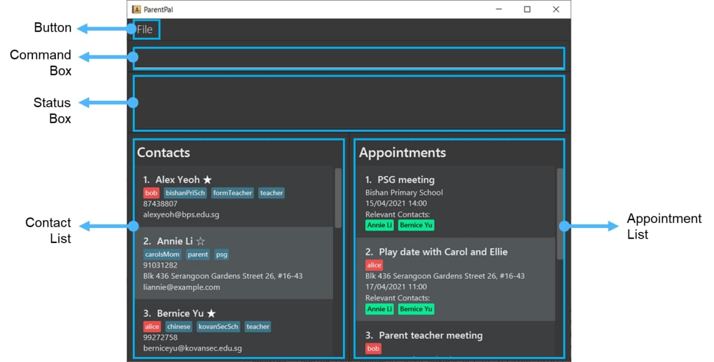

1. **Menu Button**
    * Click to see an option to exit.
1. **Command Box**
    * ParentPal makes it easy for you to manage your contacts and appointments with a single command.
    * Type the command into the command box, and press Enter to execute it.
    * Should an error occur, an error message will be displayed in the status box.
1. **Status Box**
    * Displays success message or error message.
1. **Contact List**
    * Scroll to view all of your contacts.
    * By default, the Contact List is sorted by the order in which they were added. See [`sort`](#sorting-all-contacts--sort)
    for how you can change the order of the contacts.
1. **Appointment List**
    * Scroll to view all of your appointments.
    * By default, the Appointment List is sorted chronologically, ie. by the date and time of the appointment, see [Appointments](#appointments) below. 
    ParentPal currently does not support sorting appointments in other ways.

### Contacts

1. **Index**
    * The index is mutable, and it changes depending on the settings for the *Contact List*.
    * For example, the *Contact List* can be filtered by different commands, see [`find`](#finding-contacts-find). And it can be sorted in different ways, see [`sort`](#sorting-all-contacts--sort).
1. **Name**
1. **Favourite Icon**
    * The star will be filled if the contact is favourited as shown above. 
      It will be empty if the contact is not favourited. See [`fav`](#favourite-a-contact--fav) for how you can favourite and unfavourite contacts.
1. **Child Tag** 
1. **Tag**
1. **Phone Number**
1. **Email**

### Appointments

1. **Index**
    * The index is mutable, and it changes depending on the settings for the *Appointment List*.
    * For example, the *Appointment List* can be filtered by different commands, see [`findAppt`](#finding-appointments-findappt).
1. **Name**
1. **Child Tag**
1. **Address**
1. **Date and Time**
1. **Contacts**

### Expired appointments
ParentPal helps you to manage your expired appointments by colouring them red, once expired. 

:bulb: **Tip:**
Should the appointment not appear red despite it having expired, click on the appointment box to refresh it.

--------------------------------------------------------------------------------------------------------------------

## Command Parameters

The table below provides descriptions for all the parameters used by ParentPal commands.

Parameter | Description | Example
-------- |------------------ | --------
`OPTION` | Specifies the options to be applied to a command | You can type `name` as an option to the [`find`](#finding-contacts-find) command to specify you wish to filter the *Contact List* by name.
`INDEX` | The index number of a contact or appointment shown in the *Contact List* or *Appointment List*.    It must be a positive number. | You can type `1` to refer to the first contact in the *Contact List* or first appointment in the *Appointment List*.
`COMMAND` | The name of a command. | You can type `add` as a command name to use with [`help`](#viewing-help--help).    See [Command Summary](#command-summary) for a full list of command names.
`NAME`  | The name of a contact or appointment. | You can type `Betsy Crowe` as the name for a contact or `Parent Teacher Meeting` as the name for an appointment.
`ADDRESS` | The address or location of a contact or appointment. | You can use `ABC Primary School` to represent the address of a contact or an appointment.
`PHONE` | The contact number of a contact.    It should contain only numbers and be at least 3 digits long.| You can type `91234567` to represent the phone number of a contact.
`EMAIL` | The email address of a contact.    It must be a valid email.| You can type `betsycrowe@example.com` to represent the email of a contact.
`TAG` | The tag you want to attach to a contact. | You can type `form teacher` to tag this additional information to a contact.
`CHILD_TAG` | The child tag you want to attach to a contact or appointment. | You can tag a contact or appointment with `Alice` to signify it is related to you child Alice.
`KEYWORD` | A keyword you want to search for. | You can type `betsy` as a keyword to search for the word 'betsy'.    See [`find`](#finding-contacts-find) and [`findAppt`](#finding-appointments-findappt) for more information.
`CONTACT_INDEX` | The index number of a contact in the *Contact List*.    It must be a positive number. | You can type `1` to refer to the first contact in the *Contact List*.

--------------------------------------------------------------------------------------------------------------------

## Features

**:information_source: Notes about the command format:** 

* Words in `UPPER_CASE` are the parameters to be supplied by the user. See <a href="#command-parameters">Command Parameters</a> above. 
  e.g. in `add n/NAME`, `NAME` is a parameter which can be used as `add n/John Doe`.

* Items in square brackets are optional. 
  e.g `n/NAME [t/TAG]` can be used as `n/John Doe t/friend` or as `n/John Doe`.

* Items with `…`​ after them can be used multiple times including zero times. 
  e.g. `[t/TAG]…​` can be used as ` ` (i.e. 0 times), `t/friend`, `t/friend t/family` etc.

* Parameters can be in any order. 
  e.g. if the command specifies `n/NAME p/PHONE`, `p/PHONE n/NAME` is also acceptable.

* If a parameter is expected only once in the command but you specified it multiple times, only the last occurrence of the parameter will be taken. 
  e.g. if you specify `p/12341234 p/56785678`, only `p/56785678` will be taken.

* Extraneous parameters for commands that do not take in parameters (such as `exit`) will be ignored. 
  e.g. if the command specifies `exit 123`, it will be interpreted as `exit`.

This section is separated into the following sub-sections:
* [General Commands](#general-commands): Commands related to managing ParentPal itself
* [Address Book Commands](#address-book-commands): Commands related to managing contacts
* [Appointment Book Commands](#appointment-book-commands): Commands related to managing appointments

The command summary table can also be accessed [here](#command-summary).

### General Commands

#### Viewing help : **`help`**

Shows information about available commands and how they can be used.

Format: `help [COMMAND]`

* If command is not specified, a summary of all available commands will be displayed, along with a link to access the full user guide.
* Click the **'OPEN URL'** button to open the full user guide.
* If command is specified, detailed information about the command will be displayed.
* If multiple commands are specified, only the last command will be taken.

**Example 1**
 
Let's say you are unsure about the commands that ParentPal offers.
You can follow the steps below to view a help window.

Steps:
1. Type `help` in the *Command Box*.
2. Press Enter to execute.
 
Outcome: 
1. The *Status Box* will show a success message.
2. A help window with details of all commands will open.

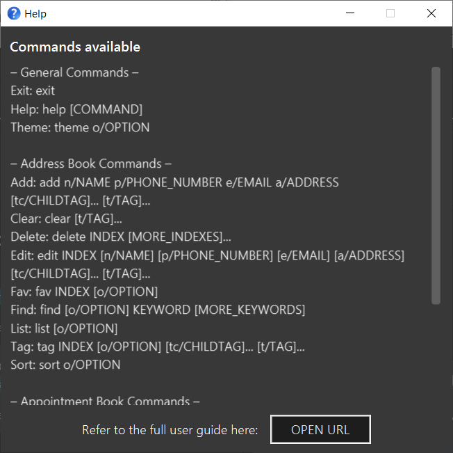

   

**Example 2**

Let's say that you want to view more details about the `add` command.
You can follow the steps below to view a help window for the `add` command.

Steps:
1. Type `help add` in the *Command Box*.
2. Press Enter to execute.

Outcome:
1. The *Status Box* will show a success message.
2. A help window with details of the `add` command will open.
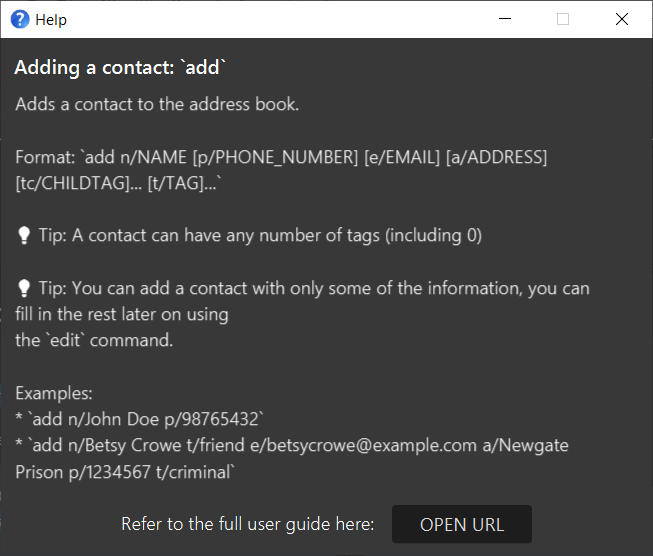
   

#### Exiting the program : **`exit`**

Exits the program.

Format: `exit`

**Example 1**

Let's say you are done with ParentPal and would like to close the application.
You can follow the steps below to close ParentPal.

Steps:
1. Type `exit` in the *Command Box*.
2. Press Enter to execute.

Outcome:
1. ParentPal closes.

#### Changing ParentPal's theme : **`theme`**

Changes the theme of ParentPal.

Format: `theme o/OPTION`

Current available options for the `OPTION` field include: 

Option  | Description
-------- | ------------------
`light` | Sets ParentPal to light theme
`dark` | Sets ParentPal to dark theme

Light theme:
  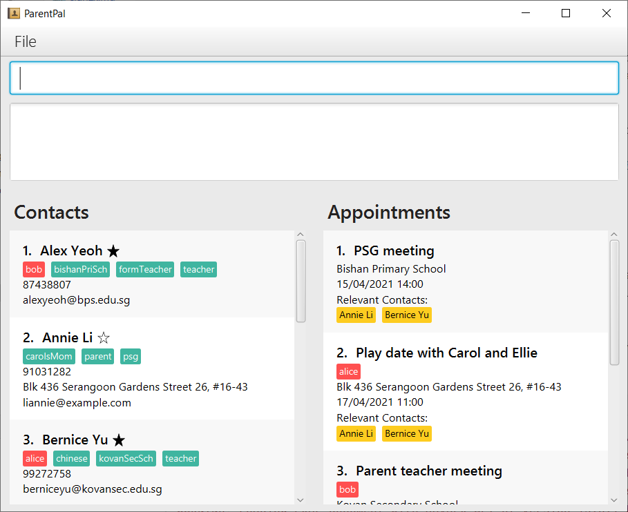

Dark theme:
  

:bulb: **Tip:**
ParentPal's theme is set to dark by default.

**Example 1**

Let's say you would like to try ParentPal's light theme.
You can follow the steps below to change ParentPal to the light theme.

Steps:
1. Type `theme o/light` in the *Command Box*.
2. Press Enter to execute.

Outcome:
1. The *Status Box* will show a success message.
2. ParentPal will change to the light theme.
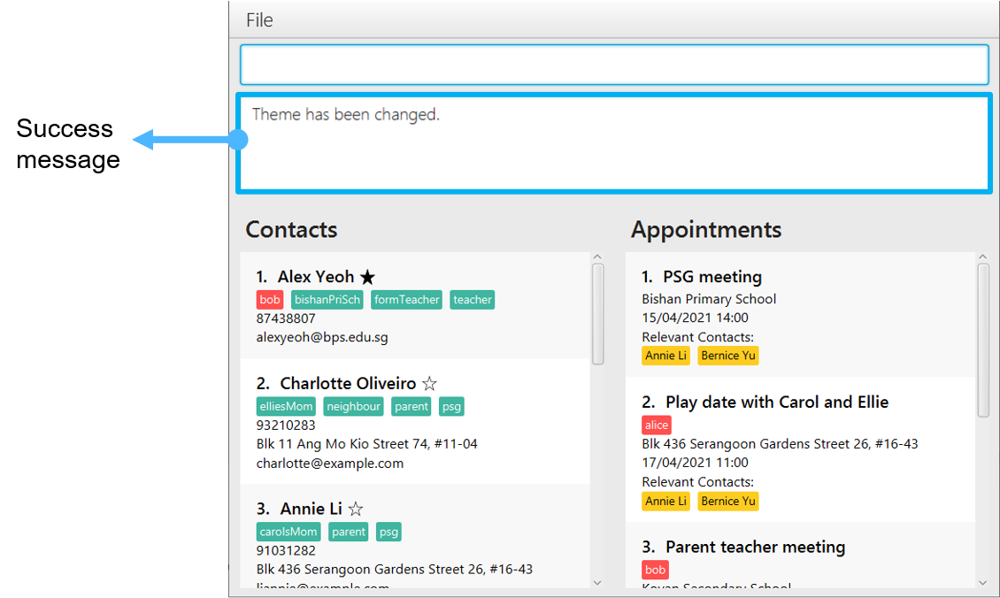
   

   
### Address Book Commands

#### Adding a contact: **`add`**

Adds a contact to the address book.

Format: `add n/NAME [p/PHONE] [e/EMAIL] [a/ADDRESS] [tc/CHILD_TAG]…​ [t/TAG]…​`

:bulb: **Tip:**
A contact can have any number of tags (including 0)

:bulb: **Tip:**
You can add a contact with only some of the information, you can fill in the rest later on using
the <a href="#editing-a-contact--edit">edit</a> command.

**Example 1**

Let's say you want to add a contact, but you only know his phone number.
You can follow the steps below to add the contact with incomplete fields.

Steps:
1. Type `add n/John Doe p/98765432` in the *Command Box*.
2. Press Enter to execute.

Outcome:
1. The *Status Box* will show a success message.
1. John Doe's contact will appear in the *Contact List*.
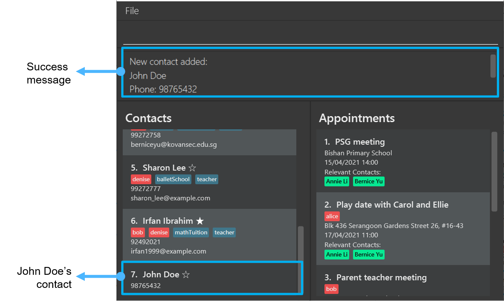
   

**Example 2**
 
Let's say you want to add contact of your child's math teacher, and you have all her details.
You can follow the steps below to add the contact with complete fields.
 
Steps:
1. Type `add n/Betsy Crowe e/betsycrowe@example.com a/ABC Primary School p/1234567 t/teacher t/math tc/Alice` in the *Command Box*.
2. Press Enter to execute.
 
Outcome:
1. The *Status Box* will show a success message.
1. Betsy Crowe's contact will appear in the *Contact List*.
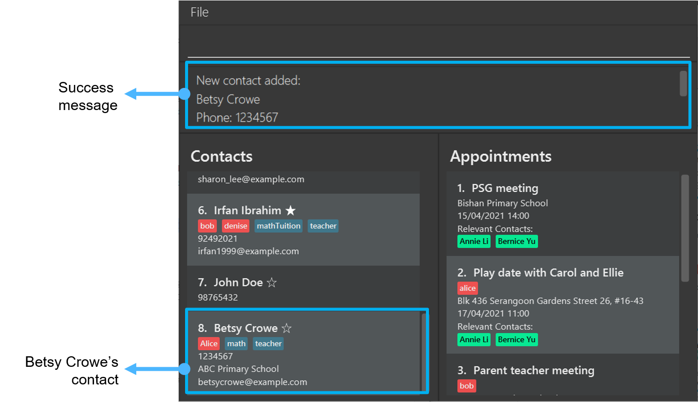
   

#### Deleting a contact : **`delete`**

Deletes the specified contact(s) from the address book.

Format: `delete INDEX [MORE_INDEXES]…​`

* Deletes the contact at the specified `INDEX` or multiple `INDEXES`.
* The index refers to the index number shown in the displayed *Contact List*.
* Indexes **must be positive integers**: ie. 1, 2, 3, …​
* If deleting multiple contacts by multiple indexes, the indexes *must* be separated by a whitespace and must all be valid.

:exclamation: **Caution:**
Contacts that are involved with appointments cannot be deleted.

 

**Example 1**

Let's say you want to delete the fifth contact in the *Contact List*.
You can follow the steps below to do so.

Steps:
1. Type `delete 5` in the *Command Box*.
2. Press Enter to execute.
 
Outcome:
1. The *Status Box* will show a success message.
1. The fifth contact will disappear from the *Contact List*.
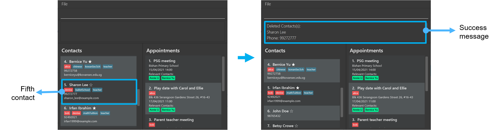
   

**Example 2**

Let's say you want to delete multiple contacts at once (for example, the first three contacts), 
you can follow the steps below to do so.

Steps:
1. Type `delete 1 2 3` in the *Command Box*.
2. Press enter to execute.

Outcome:
1. The *Status Box* will show a success message. 
   If any of the contacts you are trying to delete is involved in an appointment, 
   the *Status Box* will show an error message to notify you on which contacts were successfully deleted, and which failed to delete.
1. The successfully deleted contacts will disappear from the *Contact List*, but contacts with appointments will remain in the *Contact List*.
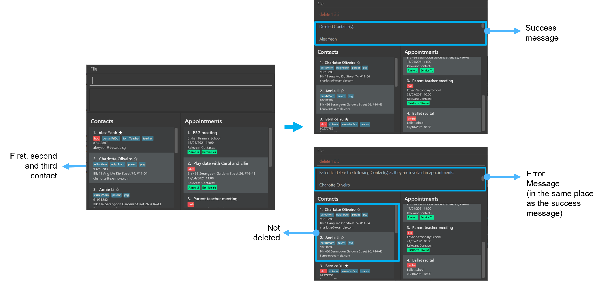

#### Editing a contact : **`edit`**

Edits an existing contact in the address book.

Format: `edit INDEX [n/NAME] [p/PHONE] [e/EMAIL] [a/ADDRESS] [tc/CHILD_TAG]…​ [t/TAG]…​`

* Edits the contact at the specified `INDEX`.
* The index refers to the index number shown in the displayed *Contact List*.
* The index **must be a positive integer** 1, 2, 3, …​
* At least one of the optional fields must be provided.
* Existing values will be updated to the input values.
* You can remove the optional fields (phone, email and address) by typing `p/`, `e/` or `a/` without specifying any phone, email or address after it.
* You can remove all the contact’s tags by typing `t/` or `tc/` without specifying any tags after it. Note: both regular tags and child tags will be removed in both situations.

:exclamation: **Caution:**
When editing tags, the existing tags of the contact will be replaced i.e. adding of tags is not cumulative. For cumulative addition of tags,
see the <a href = "#addingreplacing-tags-to-a-contact-tag"><code>tag</code></a> command.

 

**Example 1**

Let's say you want to edit the name of the second contact.
You can follow the steps below to do so.

Steps:
1. Type `edit 2 n/Betsy` in the *Command Box*.
2. Press Enter to execute.

Outcome:
1. The *Status Box* will show a success message.
2. The name of the second contact has been replaced with 'Betsy'.
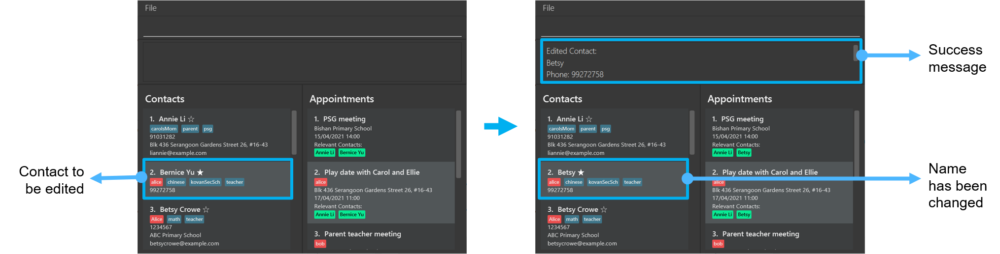

**Example 2**

Let's say you have added the second contact, but you did not include any email during the adding process.
You can follow the steps below to add an email to the first contact. 

Steps:
1. Type `edit 2 e/betsy@example.com` in the *Command Box*.
2. Press Enter to execute.

Outcome:
1. The *Status Box* will show a success message.
2. The email of the second contact has been added as 'betsy@example.com'.
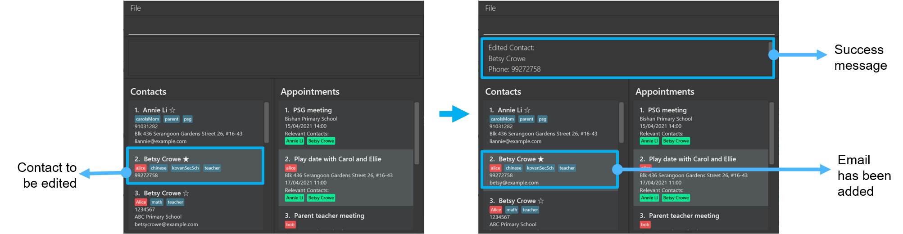

**Example 3**

Let's say you want to remove some fields like the email and tags of the first contact.
You can follow the steps below to do so.

Steps:
1. Type `edit 1 t/ e/` in the *Command Box*.
2. Press Enter to execute.

Outcome:
1. The *Status Box* will show a success message.
2. The email and tags field of the first contact has been removed, and you can no longer see it in the contact details of the first contact.
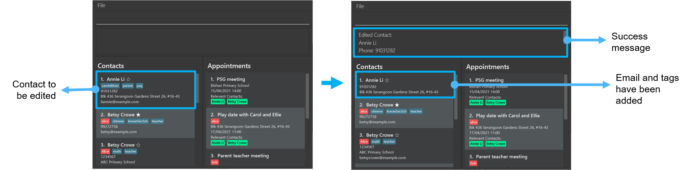
   

   
#### Finding contacts: **`find`**

Find contacts based on the given option.

**If no options are specified**, all of a contact's
fields will be searched and any keyword matches in any one of the fields will display that contact.

Format: `find [o/OPTION] KEYWORD [MORE_KEYWORDS]…​`

Current available options for the `[OPTION]` field include:

Option | Description
-------- |----------------
`name`  | Finds by the name of the contact
`address` | Finds by the address of the contact 
`phone` | Finds by the phone number of the contact 
`email` | Finds by the email of the contact 
`tag` | Finds by the tags of the contact (only exact tags will be matched) 

:exclamation: **Caution:**
When using the <code>tag</code> option <code>t/</code> needs to be placed in front of the tag 
you are searching for. Also, note that only exact matches will be returned for find by tag. 
Example: <code>find o/tag t/first t/second</code>

* The search is case-insensitive. e.g `alex` will match `ALEX`.
* The order of the keywords does not matter. e.g. `john doe` will match `doe john`.
* Incomplete words will also be matched e.g. `Ale` will match `Alex`.
* Contacts with any field matching at least one keyword will be returned (i.e. `OR` search)
  e.g. `Alex David` will return `Alex Yeoh`, `David Li`.
* If *n* contacts can be found, message “*n* Contact(s) listed!” will be displayed
  e.g. when 0 results are found, "0 Contact(s) listed!" is displayed.
  

**Example 1**

Let's say you want to find all the contacts in your address book named John. 
You can follow the steps below to do so.

Steps:
1. Type `find o/name John` in the *Command Box*.
2. Press Enter to execute.

Outcome:
1. The *Status Box* will show a success message.
2. All the contacts whose name contains the word 'john' will be displayed in the *Contact List*.
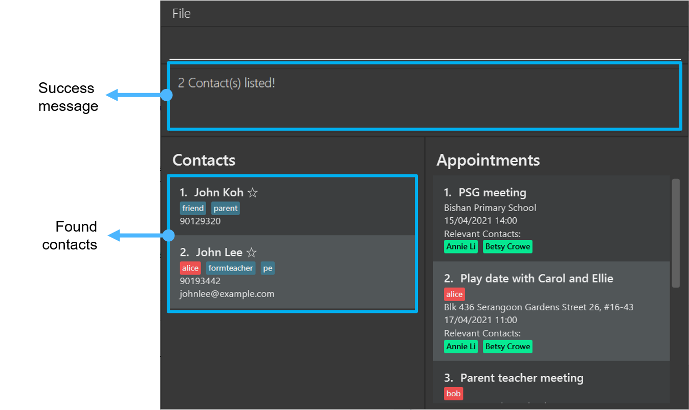
   

**Example 2**

Let's say you only remember that a contact has the word 'lee' in his name or email. 
You find contacts with any of their fields containing the word 'lee' by following the steps below.

Steps:
1. Type `find lee` in the *Command Box*.
2. Press Enter to execute.

Outcome:
1. The *Status Box* will show a success message.
2. All the contacts with any of their fields containing the word 'lee' will be displayed in the *Contact List*.
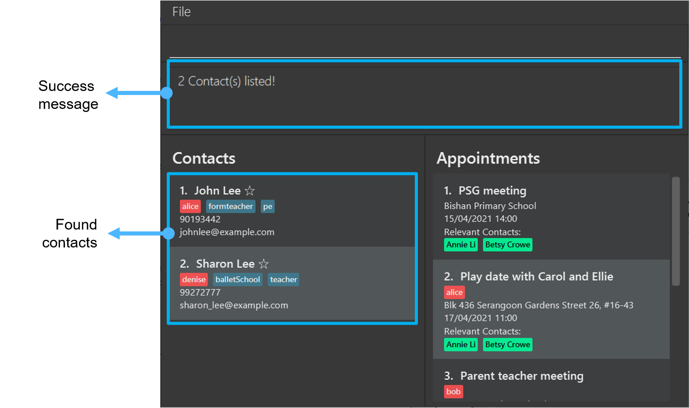
   

#### Listing all contacts : **`list`**

Display all contacts from the address book in the *Contact List*.

Format: `list [o/OPTION]`

Current available options for the `[OPTION]` field include:

Option  | Description
-------- | ------------------
`fav` | Displays all favourited contacts in the *Contact List*

:bulb: **Tip:**
To favourite a contact, use the <a href = "#favourite-a-contact--fav"><code>fav</code></a> command.

**Example 1**

Let's say you want to view all your contacts again, as you have just filtered the contacts by some keywords.
You can follow the steps below to view all your contacts.

Steps:
1. Type `list` in the *Command Box*.
2. Press Enter to execute.

Outcome:
1. The *Status Box* will show a success message.
2. All contacts are now displayed in the *Contact List*.
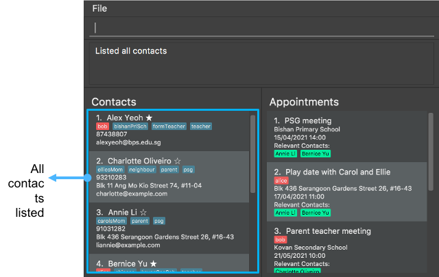
   

**Example 2**

Let's say you want to view all of your favourite contacts.
You can follow the steps below to view all of your favourite contacts.

Steps:
1. Type `list o/fav` in the *Command Box*.
2. Press Enter to execute.

Outcome:
1. The *Status Box* will show a success message.
2. All favourite contacts are now displayed in the *Contact List*.
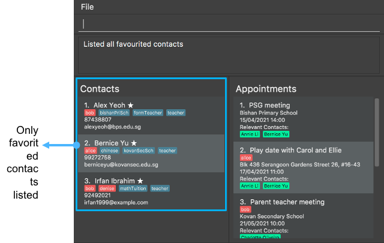
   

#### Adding/replacing tags to a contact: **`tag`**

Adds or replaces tags to the specified contact.

Format: `tag INDEX [o/OPTION] [tc/CHILD_TAG]…​ [t/TAG]…​`

* Tags the contact at the specified `INDEX`. 
* The index refers to the index number shown in the displayed *Contact List*. 
* The index **must be a positive integer** 1, 2, 3, …​

Current available options for the `[OPTION]` field include:

Option  | Description
-------- | ------------------
`replace` | Replaces the currently existing tags with the given new set of tags 

 

**Example 1**

Let's say that the first contact has some tags, and you would like to add more tags to the existing tags of the first contact.
You can follow the steps below to append more tags.

Steps:
1. Type `tag 1 t/School t/English` in the *Command Box*.
2. Press Enter to execute.

Outcome:
1. The *Status Box* will show a success message.
2. The tags 'School' and 'English' are now added to the existing tags of the first contact.
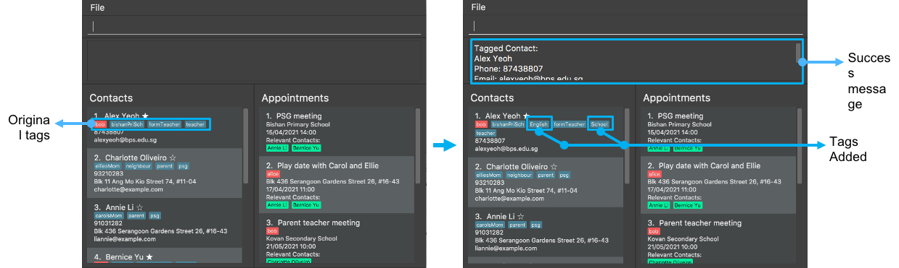
   

**Example 2**

Let's say that you want to replace all the tags of the first contact.
You can follow the steps below to do so.

Steps:
1. Type `tag 1 o/replace tc/Alexa t/English` in the *Command Box*.
2. Press Enter to execute.

Outcome:
1. The *Status Box* will show a success message.
2. The child tags for the first contact have been replaced with the child tag 'Alexa'. 
3. The tags for the first contact have been replaced with the tag 'English'.

   

   
#### Favourite a contact : **`fav`**

Format: `fav INDEX [o/OPTION]`

* Favourite the contact at the specified `INDEX`.
* The index refers to the index number shown in the displayed *Contact List*.
* The index **must be a positive integer** 1, 2, 3, …​

Current available options for the `[OPTION]` field include:

Option  | Description
-------- | ------------------
`remove` | Unfavourites the specified contact

:bulb: **Tip:**
When a contact is favourited, the star next to their name will become filled.
When a contact is unfavourited, the star will turn empty.

**Example 1**

Let's say that you want to highlight the first contact as it is an important contact, you can do this by favouriting the first contact.
You can follow the steps below to favourite a contact.

Steps:
1. Type `fav 1` in the *Command Box*.
2. Press Enter to execute.

Outcome:
1. The *Status Box* will show a success message.
2. The first contact is now favourited, and the star in the contact is filled.
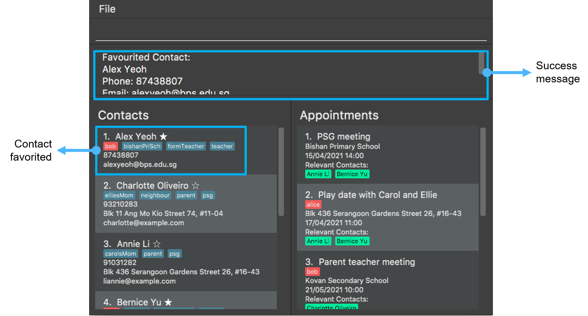
   

**Example 2**

Let's say that you want to unfavourite the first contact.
You can follow the steps below to unfavourite the contact.

Steps:
1. Type `fav 1 o/remove` in the *Command Box*.
2. Press Enter to execute.

Outcome:
1. The *Status Box* will show a success message.
2. The first contact is now unfavourited and the star in the contact is not filled.
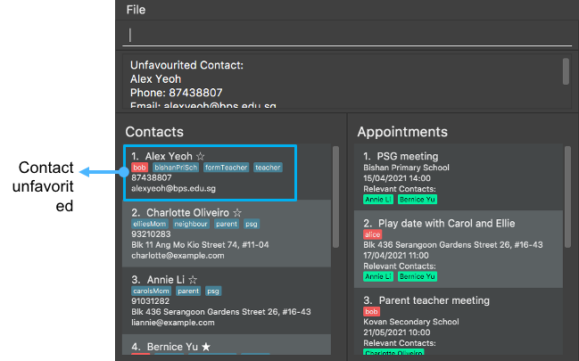
   

#### Sorting all contacts : **`sort`**

Sorts the address book in the order based on the given option.

Format: `sort o/OPTION`

Current available options for the `[OPTION]` field include:

Option  | Description
-------- | ------------------
`name` | Sorts by name (alphabetical order)
`date` | Sorts by date added (chronological order)

:bulb: **Tip:**
The sorting order is saved across different use sessions.
The default order is by the date the contact was added.

:bulb: **Tip:**
If sort is entered after executing find, a sorted found list will be displayed as explained in the 3rd example above. 
The sort order will also be saved and the full address book will be sorted.

**Example 1**

Let's say you want to sort the address book by the date the contacts were added.
You can follow the steps below to do so.

Steps:
1. Type `sort o/date` in the *Command Box*.
2. Press Enter to execute.

Outcome:
1. The *Status Box* will show a success message.
2. The *Contact List* is now sorted by the date the contacts were added.
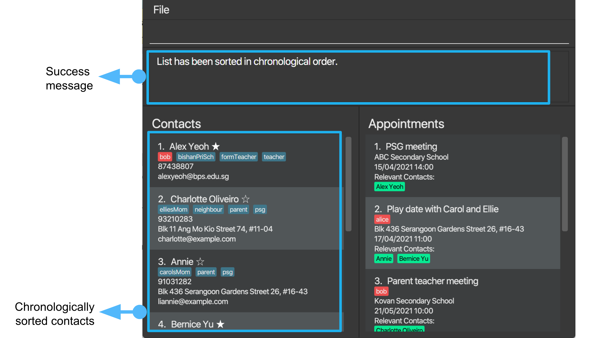
   

**Example 2**

Let's say you searched for contacts tagged with 'teacher' and want to sort the contacts found by alphabetical order.
You can follow the steps below to do so.

Steps:
1. Type `sort o/name` in the *Command Box*.
2. Press Enter to execute.

Outcome:
1. The *Status Box* will show a success message.
2. The *Contact List* is now in alphabetical order.

   

#### Clearing all entries : **`clear`**

Clears all entries from the address book or clears all contacts with the specified tags.

Format: `clear [t/TAG]…​`

:exclamation: **Caution:**
The <code>TAG</code> here does not differentiate between child tags and regular tags. 
This command will delete all entries that match **any** of the given tags.

 

**Example 1**

Let's say you want to clear all contacts from ParentPal.
You can follow the steps below to do so.

Steps:
1. Type `clear` in the *Command Box*.
2. Press Enter to execute.

Outcome:
1. The *Status Box* will show a success message.
2. The *Contact List* is now empty.
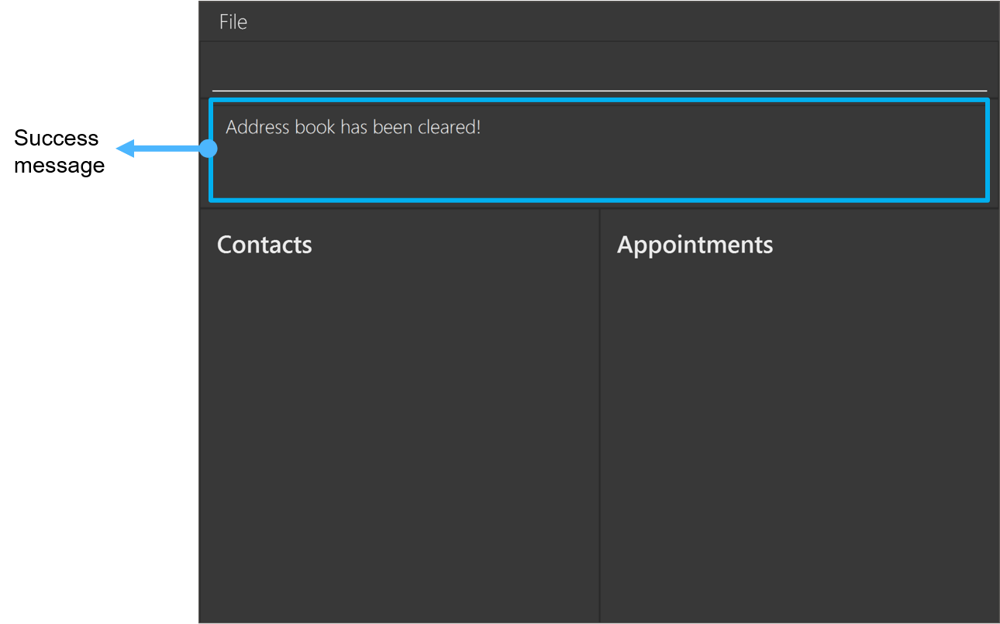

**Example 2**

Let's say you want to clear all contacts tagged with 'teacher'.
You can follow the steps below to do so.

Steps:
1. Type `clear t/teacher` in the *Command Box*.
2. Press Enter to execute.

Outcome:
1. The *Status Box* will show a success message.
2. All contacts tagged with 'teacher' are removed from the *Contact List* if none of them are involved in appointments.
   Otherwise, an error message will be shown.
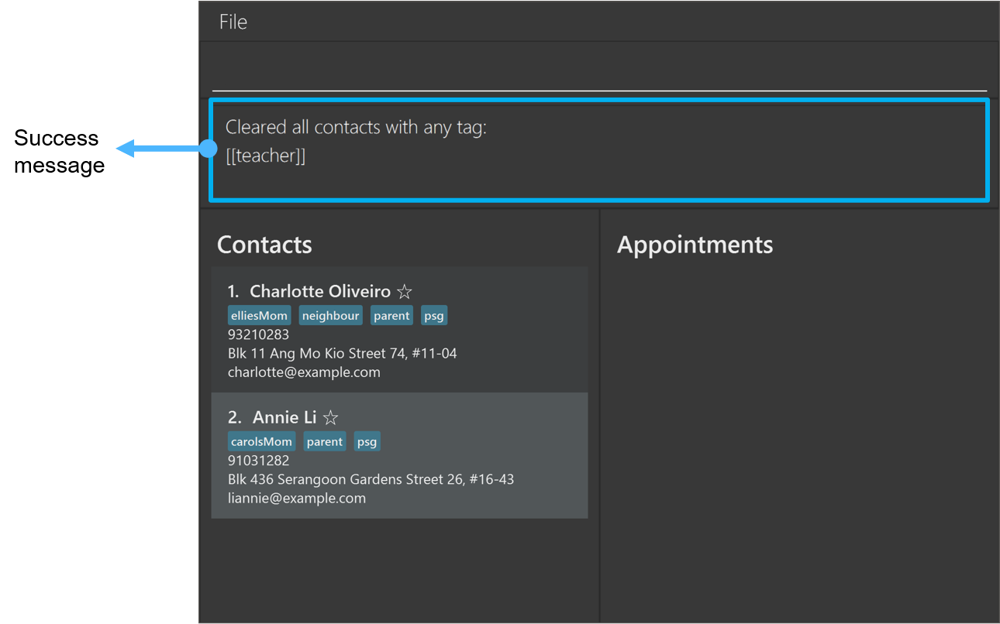
   

### Appointment Book Commands

#### Adding an appointment : **`addAppt`**

Adds an appointment to the appointment book.

Format: `addAppt n/NAME a/ADDRESS d/DATE [c/CONTACT_INDEX]…​ [tc/CHILD_TAG]…​`

* The contact in the *Contact List* at the specified `CONTACT_INDEX` is added to the appointment.
* The index refers to the index number shown in the displayed *Contact List*.
* The index **must be a positive integer** 1, 2, 3, …​ 
* `DATE` has to be in the format '`dd/MM/yyyy` `HH:mm`'.

:exclamation: **Caution:**
An appointment with the exact same name, date, time and address as an appointment that already exists in the <i>Appointment List</i> cannot be added.

:exclamation: **Caution:**
ParentPal currently does not support checking for clashing appointments. Please make sure to check your availability before adding new appointments. This can be done with the help of findAppt by date.

**Example 1**

Let's say you just received the details of the annual parent-teacher meeting at Alice's school.
You can follow the steps below to add the appointment to ParentPal.

Steps:
1. Type `addAppt n/PTM a/ABC Primary School d/21/03/2021 10:00 c/2 tc/alice` in the *Command Box*.
2. Press Enter to execute.

Outcome:
1. The *Status Box* will show a success message. 
2. The appointment appears in the *Appointment List*.
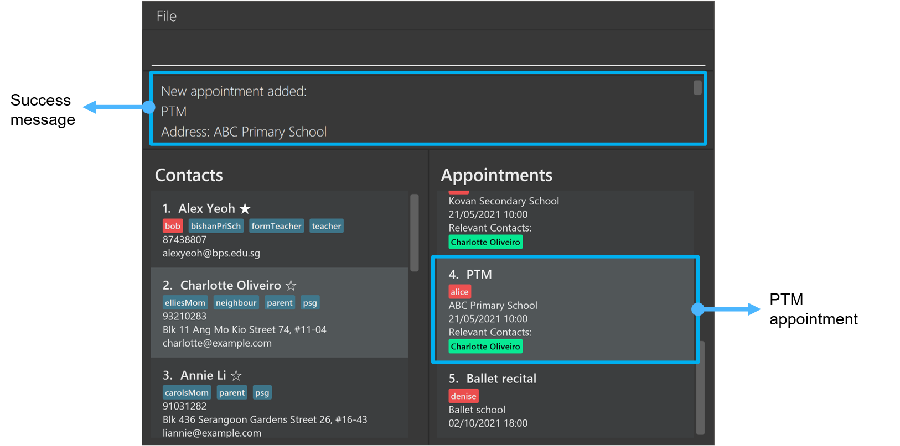
   

#### Deleting an appointment : **`deleteAppt`**

Deletes the specified appointment from the appointment book.

Format: `deleteAppt INDEX`

* Deletes the appointment at the specified `INDEX`.
* The index refers to the index number shown in the displayed appointment list.
* The index **must be a positive integer** 1, 2, 3, …​

 
  
**Example 1**

Let's say you are viewing the full list of appointments, and you want to delete the 2nd appointment in the appointment list.
You can follow the steps below to do so.

Steps:
1. Type `deleteAppt 2` in the *Command Box*.
2. Press Enter to execute.

Outcome:
1. The *Status Box* will show a success message.
2. The 2nd appointment in the *Appointment List* is removed.
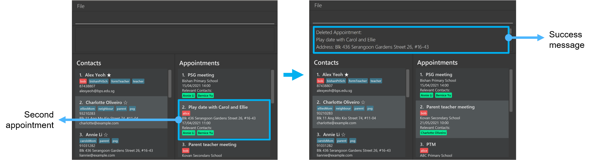
   

**Example 2**

Let's say you want to delete an appointment named 'PTM'.
You can follow the steps below to find all appointments named 'PTM', then delete one of them.

Steps:
1. Type `findAppt o/name ptm` in the *Command Box*.
2. Press Enter to execute.
3. Only appointments with 'ptm' in their name will be listed in the *Appointment List*.
4. Say the first appointment is the one you want to delete. Type `deleteAppt 1` in the *Command Box*.
5. Press Enter to execute.

Outcome:
1. The *Status Box* will show a success message.
2. The 1st appointment in the *Appointment List* is removed.
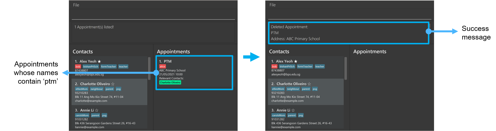
   

#### Editing an appointment : **`editAppt`**

Edits an existing appointment in the appointment book.

Format: `editAppt INDEX [n/NAME] [a/ADDRESS] [d/DATE] [c/CONTACT_INDEX]…​ [tc/CHILD_TAG]…​`

* Contacts in the *Contact List* at the specified `CONTACT_INDEX` is added to the appointment.
* Edits the appointment at the specified `INDEX`.
* The index refers to the index number shown in the displayed *Appointment Book*.
* The index **must be a positive integer** 1, 2, 3, …​
* `DATE` has to be in the format '`dd/MM/yyyy` `HH:mm`'.
* At least one of the optional fields must be provided.
* Existing values will be updated to the input values.
* When editing tags and contacts, the existing tags and contacts of the contact will be removed 
  i.e the operation is not cumulative.
  

**Example 1**

Let's say you want to edit the first appointment in the full *Appointment List* so that the name and address is changed to
'PSG meeting' and 'ABC Secondary School' respectively and replace all related contacts with the 1st contact
on the *Contact List*.
You can follow the steps below to do so.

Steps:
1. Type `editAppt 1 n/PSG meeting a/ABC Secondary School c/1` in the *Command Box*.
2. Press Enter to execute.

Outcome:
1. The *Status Box* will show a success message.
2. The first appointment's name, address and related contacts are updated.
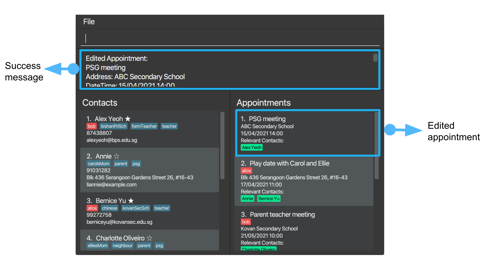
   

#### Finding appointments: **`findAppt`**

Find appointments based on the given option.

**If no options are specified**, all of an appointment's 
fields will be searched and any keyword matches in any one of the fields will return that appointment.

Format: `findAppt [o/OPTION] KEYWORD [MORE_KEYWORDS]…​`

* The search is case-insensitive. e.g `ptm` will match `PTM`.
* The order of the keywords does not matter. e.g. `Teacher meeting` will match `Meeting teacher`.
* Incomplete words will also be matched e.g. `PT` will match `PTM`.
* Appointments with any field matching at least one keyword will be returned (i.e. `OR` search)
  e.g. `Teacher meeting` will return `Speak to ballet teacher`, `PSG meeting`.
* If *n* appointments can be found, message “*n* Appointment(s) listed!” will be displayed
  e.g. when 0 results are found, "0 Appointment(s) listed!" is displayed.
  
Current available options for the `[OPTION]` field include:

Option | Description
-------- |------------------
`name`  | Finds by the name of the appointment
`child` | Finds by the child that the appointment is tagged to
`address` | Finds by the address of the appointment
`date` | Finds by the date of appointment
`contact` | Finds by the name of the contacts involved in the appointment

**Example 1**

Let's say you want to search for all appointments with any fields containing 'psg'.
You can follow the steps below to do so.

Steps:
1. Type `findAppt psg` in the *Command Box*.
2. Press Enter to execute.

Outcome:
1. The *Status Box* will show a success message.
2. All appointments with 'ptm' in any of their fields will be listed in the *Appointment List*.
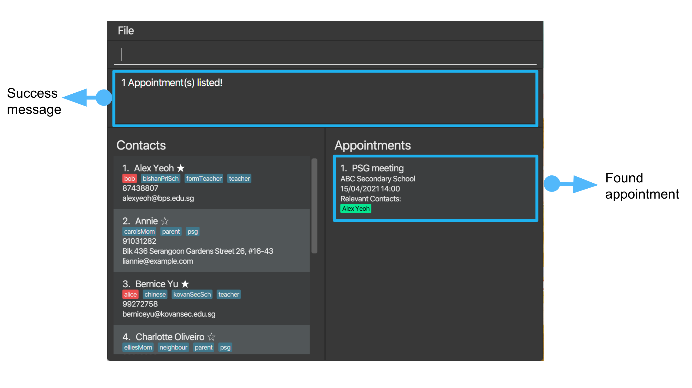
   

**Example 2**

Let's say you want to search for all appointments related to a contact named Annie.
You can follow the steps below to do so.

Steps:
1. Type `findAppt o/contact annie` in the *Command Box*.
2. Press Enter to execute.

Outcome:
1. The *Status Box* will show a success message.
2. All appointments with Annie as a related contact will be listed in the *Appointment List*.
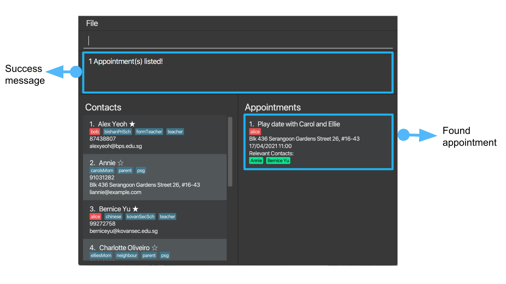
   

#### Listing all appointments : **`listAppt`**

Displays all appointments in the appointment book in the *Appointment List*.

List of appointments is always sorted in chronological order.

Format: `listAppt`

 

**Example 1**

Let's say you want to view the full list of appointments.
You can follow the steps below to do so.

Steps:
1. Type `listAppt` in the *Command Box*.
2. Press Enter to execute.

Outcome:
1. The *Status Box* will show a success message.
2. All the appointments will be listed in the *Appointment List*.
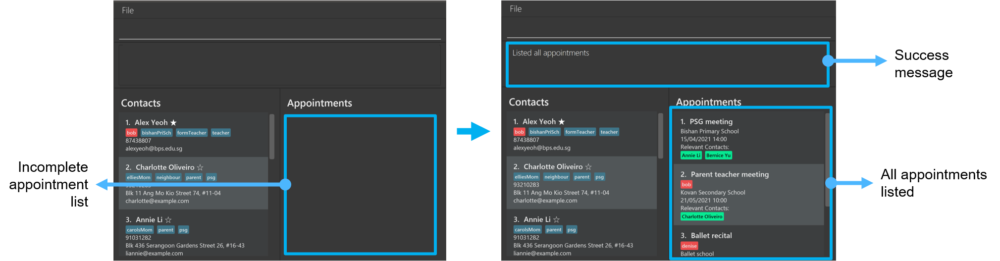
   
--------------------------------------------------------------------------------------------------------------------

## Managing ParentPal Data

### Saving your data

ParentPal data is saved in the hard disk automatically after any command that changes the data. There is no need to save manually.

### Editing data files

ParentPal data is saved as two JSON files in the **data** directory at **[JAR file location]/data** as
**addressbook.json** and **appointmentbook.json**. 
Advanced users are welcome to update data directly by editing that data file.

:exclamation: **Caution:**
If your changes to the data file makes its format invalid, ParentPal will discard all data and start with an empty data file at the next run.

:exclamation: **Caution:**
Changes to the data files may cause ParentPal to behave unexpectedly, edit the files at your own risk.

### Transferring your data to another device
<h5> Exporting your data </h5>
1. Locate the **data** folder on your device which can be found in the same folder as your **parentpal.jar** file. 
2. Transfer this **data** folder to your other device.

<h5> Importing your data </h5>
1. Install ParentPal on your new device and run it once, exit the program before proceeding.
2. Copy the **data** folder from your old device to the new device to the same folder as where you installed the **parentpal.jar** file.
3. Override the files on your new device if prompted.

Congratulations! You have successfully transferred your data to a new device.

--------------------------------------------------------------------------------------------------------------------
## FAQ

**Q**: What's the difference between a child tag and a regular tag?  
**A**: ChildTags are meant to represent your children, useful especially 
if you have multiple children. Child tags will always appear at the front of the list of tags
for each contact and are displayed in a different color to differentiate them. Any command
that works with regular tags such as `find` will also work with child tags.

**Q**: What's the difference between address book and contact list? What's the difference between appointment book and appointment list?  
**A**: The address book refers to all the contacts currently stored by ParentPal, including what is not currently displayed in the interface. The contact list refers
to what is currently displayed on screen. Similarly, the appointment book refers to all appointments stored by ParentPal
while the appointment list only refers to what is currently displayed on screen, see [Interface of ParentPal](#interface-of-parentpal).

**Q**: Why is your application named *ParentPal*?  
**A**: It is named *ParentPal* because it aims to be a 'pal' to the busy parents who need help with managing their kids' schedules and important contacts.

## Command Summary

Action | Format | Examples
--------|------------------ | -----
​ | **General Commands** | 
**Exit** | `exit` |
**Help** | `help [COMMAND]` | `help find`
**Theme** | `theme o/OPTION` | `theme o/light`
​ | **Address Book Commands**
**Add** | `add n/NAME p/PHONE_NUMBER e/EMAIL a/ADDRESS [tc/CHILD_TAG]…​ [t/TAG]…​` | `add n/James Ho p/22224444 e/jamesho@example.com a/123, Clementi Rd, 1234665 t/friend t/colleague`
**Delete** | `delete INDEX` | `delete 3`
**Edit** | `edit INDEX [n/NAME] [p/PHONE_NUMBER] [e/EMAIL] [a/ADDRESS] [tc/CHILD_TAG]…​ [t/TAG]…​`|`edit 2 n/James Lee e/jameslee@example.com`
**Find** | `find [o/OPTION] KEYWORD [MORE_KEYWORDS]`| `find John`
**List** | `list [o/OPTION]`
**Tag** | `tag INDEX [o/OPTION] [tc/CHILD_TAG]…​ [t/TAG]…​`| `tag 4 t/School t/English`
**Favourite** | `fav INDEX [o/OPTION]` | `fav 3 o/remove`
**Sort** | `sort o/OPTION` | `sort o/name`
**Clear** | `clear [t/TAG]…​`
​ | **Appointment Book Commands**
**Add** | `addAppt n/NAME a/ADDRESS d/DATE [c/CONTACT_INDEX]…​ [tc/CHILD_TAG]…​` | `addAppt n/PTM a/ABC Primary School d/21/03/2021 10:00 c/2`
**Delete** | `deleteAppt INDEX` | `deleteAppt 2`
**Edit** | `editAppt INDEX [n/NAME] [a/ADDRESS] [d/DATE] [c/CONTACT_INDEX]…​ [tc/CHILD_TAG]…​` | `editAppt 1 n/PSG meeting a/ABC Secondary School c/1`
**Find** | `findAppt [o/OPTION] KEYWORD [MORE_KEYWORDS]…​` | `findAppt PTM`
**List** | `listAppt`

--------------------------------------------------------------------------------------------------------------------

## Glossary

* **Action**: Executed command
* **Address book**: Section of the application that stores and manages contact data
* **Appointment**: Entry in the appointment book containing an appointment's information
* **Appointment list**: List of appointments displayed, see [Interface of ParentPal](#interface-of-parentpal)
* **Appointment book**: Section of the application that stores and manages appointment data
* **CLI**: Application where you perform actions by typing commands into a command box
* **Command**: The input the user enters into the *Command Box* to perform an action
* **Contact**: Entry in the address book containing a contact's information
* **Contact list**: List of contacts displayed, see [Interface of ParentPal](#interface-of-parentpal)
* **GUI**: Application where you interact with it via graphical icons such as buttons
* **Home folder**: The folder containing all the files needed to run ParentPal
* **Index**: Index number shown in the displayed contact/appointment list
