TutorsPet is a **desktop app designed for private tutors in Singapore to manage students’ information, optimized for use via a Command Line Interface** (CLI) while still having the benefits of a Graphical User Interface (GUI). TutorsPet helps improve the efficiency and effectiveness of student management by categorizing relevant contact information and keeping track of both lesson schedules and important dates.

## How to Navigate User Guide
* To get an overview of this user guide, head to [1. About](#1-about).
* To start your journey with TutorsPet, head to [2. Quick Start](#2-quick-start).
* To learn about all our features, head to [3. Features](#3-features).
* To see some exciting features in our future version, head to [4. Coming soon](#4-coming-soon).
* To see our answers to some frequently asked questions by users, head to [5. FAQ](#5-faq).
* To learn about the field formats of a student contact, head to [6.1 Field Format Summary](#61-field-format-summary).
* To get an overview of all our commands, head to [6.2 Command summary](#62-command-summary).

Feel free to check out our [Table of Contents](#table-of-contents), to get familiar with TutorsPet step by step. 

You can return to Table of Contents by clicking this button <a href="#table-of-contents"> <button>Back to Table of Contents </button></a> below each session.

## Table of Contents
* Table of Contents 
{:toc}
--------------------------------------------------------------------------------------------------------------------
## 1. About
This document can be thought of as a manual, and a reference guide for TutorsPet. It will guide you on how to use TutorsPet and will provide complete information on each available command.
Furthermore, the guide gives information on the User Interface (UI) and the other useful features of TutorsPet. Each section of the guide can be read independently.
You can view the full list of content using the Table of Contents above. You can also use your document viewer’s Find function to quickly navigate to the content you want to know more about.

It is generally advised for new users to at least read through the [Quick Start](#2-quick-start) section to familiarise themselves with TutorsPet.

Note the following symbols and formatting used in this document:

* Mark-up: `list`   
  Text with this formatting indicates that it can be **typed** into the command line and executed by the application or it
  can be **results** of the command.
* Bolded: **important**   
  Text with this formatting indicates that it is important information, and should be taken note of.

:information_source: **Notes:** 

* This block is used for detailing information about formatting, handling exceptional cases or special keywords used in the corresponding section.

:bulb: **Tips:**

* This block is used to provide you extra details about the feature that will enable you to use it more effectively.

:exclamation: **Caution:** This block is used to point out any dangerous actions that may result in the loss of data or the app crashing.

<a href="#table-of-contents"> <button>Back to Table of Contents </button></a>

--------------------------------------------------------------------------------------------------------------------

## 2. Quick start

1. Ensure you have Java **11** or above installed in your Computer.

1. Download the latest **tutorspet.jar** from [here](https://github.com/AY2021S2-CS2103T-T11-3/tp/releases).

1. Copy the file to the folder you want to use as the **home folder** for your TutorsPet.

1. Double-click the file to start the app. If that does not work, open command prompt and type in 
   `java -jar /path/to/jar/file`, replacing the path with the absolute or relative file paths.
   The GUI similar to the below should appear in a few seconds. Note how the app contains some sample data. 
   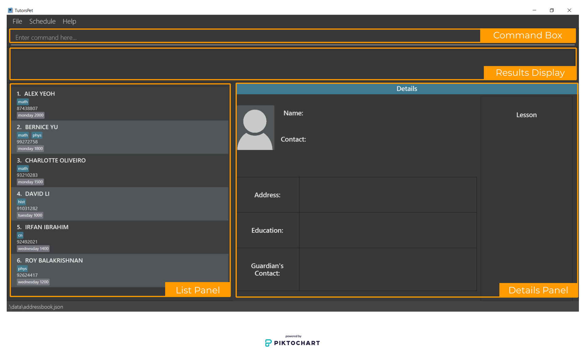

1. Type the command in the command box and press Enter to execute it. e.g. typing **`help`** and pressing Enter will open the help window. 
   Some example commands you can try:

   * **`list`** : Lists all contacts.
     
   * **`schedule`** : Opens a window that shows the weekly schedule.

   * **`add`**`n/Alice Tan p/98765432 s/Abc Secondary School e/alicet@example.com a/John street, block 123, #01-01 
     gn/Mary Tan gp/23456789` : Adds a student's contact named `Alice Tan` to TutorsPet.

   * **`delete`**`3` : Deletes the 3rd contact shown in the current list.

   * **`clear`** : Deletes all contacts and important dates.

   * **`exit`** : Exits the app.

1. Refer to the [Features](#3-features) below for details of each command.

1. All sample data in TutorsPet can be cleared at once using the `clear` command.

<a href="#table-of-contents"> <button>Back to Table of Contents </button></a>

--------------------------------------------------------------------------------------------------------------------

## 3. Features

**:information_source: Notes about the command format:** 

* Words in **UPPER_CASE** are the parameters to be supplied by the user. 
  e.g. in `add n/NAME`, `NAME` is a parameter which can be used as `add n/John Doe`.

* Items in square brackets are optional. 
  e.g `n/NAME [t/SUBJECT]` can be used as `n/John Doe t/econ` or as `n/John Doe`.

* Items with `…` after them can be used multiple times including **zero times**. 
  e.g. `[t/SUBJECT]…​` can be used as ` ` (i.e. 0 times), `t/chem`, `t/phys t/math` etc.
  
* Parameters can be in any order. 
  e.g. if the command specifies `n/NAME p/PHONE_NUMBER`, `p/PHONE_NUMBER n/NAME` is also acceptable.

* If a parameter is expected only once in the command but you specified it multiple times, only the **last occurrence** of the parameter will be taken. 
  e.g. if you specify `p/12341234 p/56785678`, only `p/56785678` will be taken.

* **Extra keywords** input for commands that do not require parameters (such as `help`, `list`, `exit` and `clear`) will be **ignored**. 
  e.g. if the command specifies `help 123`, it will be interpreted as `help`.

<a href="#table-of-contents"> <button>Back to Table of Contents </button></a>

### 3.1 General

#### 3.1.1 Clearing all entries : `clear`

Clears all entries from TutorsPet.

Format: `clear`

<a href="#table-of-contents"> <button>Back to Table of Contents </button></a>

#### 3.1.2 Exiting the program : `exit`

Exits the program.

Format: `exit`

<a href="#table-of-contents"> <button>Back to Table of Contents </button></a>

#### 3.1.3 Viewing help : `help`

Shows a message explaining how to access the help page.

Format: `help`

<a href="#table-of-contents"> <button>Back to Table of Contents </button></a>

### 3.2 Student Management

#### 3.2.1 Adding a contact : `add`

Adds a student’s contact to TutorsPet.

Format: `add n/NAME p/PHONE [s/SCHOOL] [e/EMAIL] [a/ADDRESS] [gn/GUARDIAN_NAME] [gp/GUARDIAN_PHONE] [lv/LEVEL] [t/SUBJECT]…​ [le/LESSON]…​`

* `n/NAME p/PHONE` are compulsory fields that must be provided. **Phone can uniquely identify a student.** i.e. Students cannot share the same phone number, while duplicate names are allowed. 
  Note that names are **case-insensitive** in TutorsPet,  e.g. `john`, `JOHN`, `John` are read as the same name.
  
* `s/SCHOOL e/EMAIL a/ADDRESS gn/GUARDIAN_NAME gp/GUARDIAN_PHONE lv/LEVEL [t/SUBJECT]…​ [le/LESSON]…​` are optional which can be added now with `add` command or later with `edit` command.

* Education levels are represented abbreviated names. Valid education levels are `pri1`, `pri2`, `pri3`, `pri4`, `pri5`, `pri6`, 
  `sec1`, `sec2`, `sec3`, `sec4`, `sec5`, `jc1`, `jc2`, `grad`. Levels are are case-insensitive, e.g. `jc1`, `JC1`, `Jc1` are equivalent.
  For more details, see the [Field Format Summary](#61-field-format-summary) below.

* Subjects are represented by abbreviated names. Valid names are `bio`, `chem`, `cn`, `econ`, `eng`, `geo`, `hist`, `lit`, `mal`, `math`, `phys`, `sci`, `tam`, 
  which are case-insensitive, e.g. `bio`, `BIO`, `Bio` are equivalent.
  For more details, see the [Field Format Summary](#61-field-format-summary) below.

* A student’s contact can have any number of subjects (including 0). 
  
* A student’s contact can have any number of lessons (including 0).

* Lessons should only consist of the lesson day and time e.g. `monday 1300`
  
* Lesson day must take on one of the values: **monday, tuesday, wednesday, thursday, friday, saturday, sunday**.

* Lesson time must be in **HHmm** format e.g. **1300**

* If the student **name** or **lesson** to be added already exists in TutorsPet, a warning prompting user's input will be shown.
  If `y` is entered, the contact will be added.
  If `n` is entered, the contact would not be added.
  
* Student's phone number is allowed to be the same as the guardian's number.

:bulb:**Tips:**  
Education levels and subjects available cover the usual students who are more likely to need private tuition. More options 
will explored in [Coming Soon](4-coming-soon).

:exclamation: **Caution:** 
If TutorsPet detects a conflicting lesson being added, a confirmation message will be shown. You
will need to type in either y/n for confirmation to add conflicted schedule.

TutorsPet does not corroborate the school, education level, subject and lesson fields of the student contacts
input in the app. For more details, see the [Field Format Summary](#61-field-format-summary) below.

Example:

`add n/John Doe p/98612341`

* Before `add` command is entered

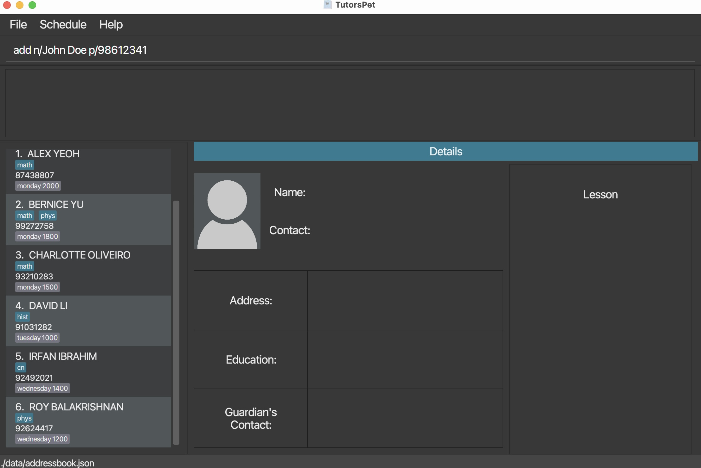

* After `add` command is entered

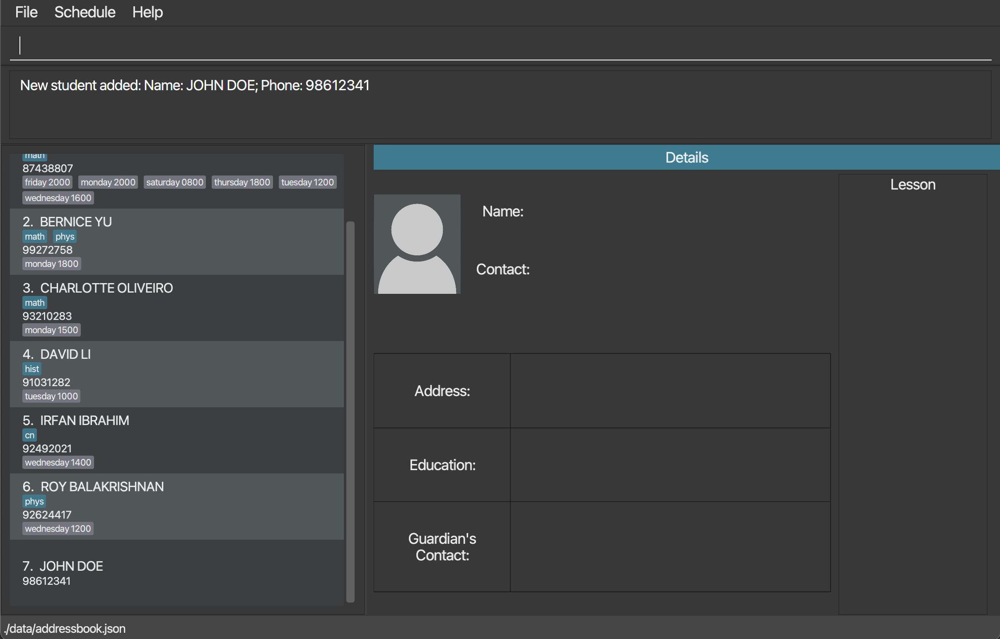

More Examples:

Command     | Result
----------- |---------------------------------------------------
`add n/Alice Tan p/98765432 s/Abc Secondary School e/alicet@example.com a/John street, block 123, #01-01 gn/Mary Tan gp/23456789`|adds a new student Alice Tan's details in TutorsPet
`add n/Bob Lee p/87654321 s/Def Secondary School e/bobl@example.com a/Bob street, block 321, #01-02 gn/John Lee gp/12345678 t/math le/monday 1300`| adds a new student Bob Lee's details in TutorsPet

<a href="#table-of-contents"> <button>Back to Table of Contents </button></a>

#### 3.2.2 Editing a contact : `edit`

Edits an existing student in TutorsPet.

Format: `edit INDEX [n/NAME] [p/PHONE] [s/SCHOOL] [e/EMAIL] [a/ADDRESS] [gn/GUARDIAN_NAME] [gp/GUARDIAN_PHONE] [lv/LEVEL] [t/SUBJECT]…​ [le/LESSON]…​`

* Edits the student at the specified `INDEX`.
  
* The index refers to the index number shown in the displayed student list.

* The index **must be a positive integer** ranging from 1 to 2147483647.

* At least one of the optional fields must be provided.
  
* Existing values will be updated to the input values.

* Optional fields which were not available when a student's contact was initially saved in TutorsPet can be added in.

* Education levels are represented abbreviated names. Valid education levels are `pri1`, `pri2`, `pri3`, `pri4`, `pri5`, `pri6`,
  `sec1`, `sec2`, `sec3`, `sec4`, `sec5`, `jc1`, `jc2`, `grad`. Levels are are case-insensitive, e.g. `jc1`, `JC1`, `Jc1` are equivalent.
  For more details, see the [Field Format Summary](#61-field-format-summary) below.

* When editing subjects or lessons, the existing subjects or lessons of the student will be removed i.e adding of subjects or lessons are not cumulative.
  
* You can remove all the student’s subjects by typing `t/` without specifying any subject names after it.
  
* You can remove all the student’s lessons by typing `le/` without specifying any lesson details after it.

* Subjects are represented by abbreviated names. Valid names are `bio`, `chem`, `cn`, `econ`, `eng`, `geo`, `hist`, `lit`, `mal`, `math`, `phys`, `sci`, `tam`,
  which are case-insensitive, e.g. `bio`, `BIO`, `Bio` are equivalent.
  For more details, see the [Field Format Summary](#61-field-format-summary) below.

* If the student **name** or **lesson** to be edited already exists in TutorsPet, a warning prompting user's input will be shown.
  If `y` is entered, the contact will be edited.
  If `n` is entered, the contact would not be edited.

:bulb:**Tips:**  
Edited information can be displayed on the Contact details panel by retyping
`detail INDEX` command.

:exclamation: **Caution:**
TutorsPet does not corroborate the school, education level, subject and lesson fields of the student contacts
input in the app. For more details, see the [Field Format Summary](#61-field-format-summary) below.

Example:

`edit 1 p/91234567 e/johndoe@example.com` Edits the phone number and email address of the 1st student to be `91234567` and `johndoe@example.com` respectively.

* After [`detail 1`](#323-viewing-a-contact-details--detail) is successfully executed and all details of Alex Yeoh are displayed

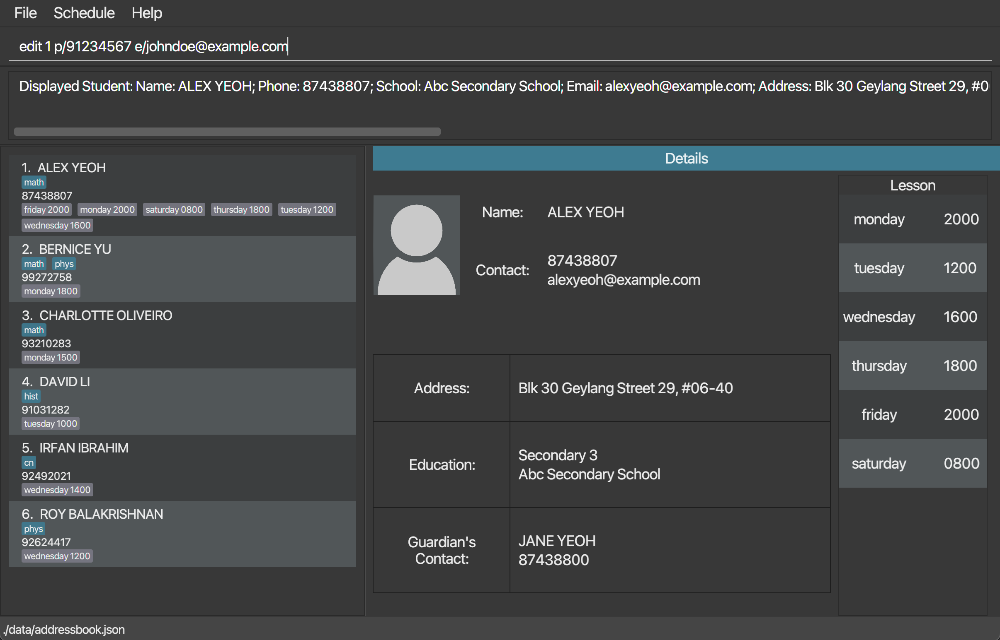

* Then `edit` command is entered. Changes are displayed immediately.

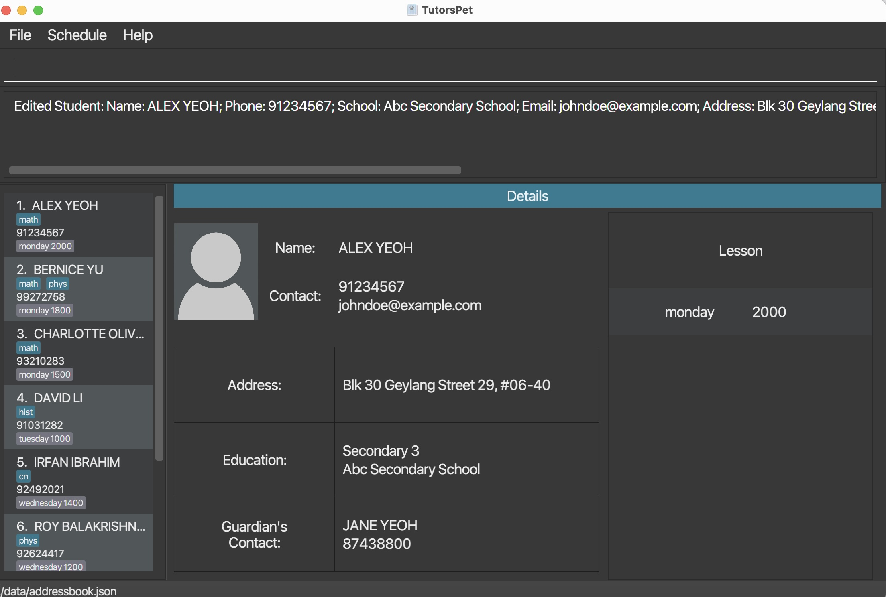
   
More Examples:

Command     | Result
----------- |---------------------------------------------------
`edit 2 n/Betsy Crower t/`|edits the name of the 2nd student to be `Betsy Crower` and clears all existing subjects.
`edit 1 le/monday 1300 le/tuesday 1400` | edits the 1st student's contact to add 2 lesson details, `monday 1300` and `tuesday 1400`

<a href="#table-of-contents"> <button>Back to Table of Contents </button></a>

#### 3.2.3 Viewing a contact details : `detail`

View the full details of the specified student's contact from TutorsPet.
The specified student's name, phone number, school, email, address, guardian name, guardian's phone number, 
education level and lessons will be displayed.

Format: `detail INDEX`

* Student details of a searched list can be displayed using this command.
* Contains a lesson panel on the right to view your schedule with the specified student.

:bulb:**Tips:**  

If student details are cut off, the windows can be resized to view more. Otherwise, the student's complete details
will also be in the results display.

Example:  

`detail 2` display the details of the 2nd student in the List.

Command     | Result                   
----------- |---------------------------------------------------
detail 2    | displays the details of the 1st student in the list

<a href="#table-of-contents"> <button>Back to Table of Contents </button></a>

#### 3.2.4 Deleting a contact : `delete`

Permanently deletes the specified student's contact from TutorsPet.

Format: `delete INDEX`

:bulb:**Tips:**  

* Deletes the contact at the specified `INDEX`.

* The index refers to the index number shown in the displayed student list.

* The index **must be a positive integer** ranging from 1 to 2147483647.

Example:  

`list` followed by `delete 2` deletes the 2nd student in TutorsPet.

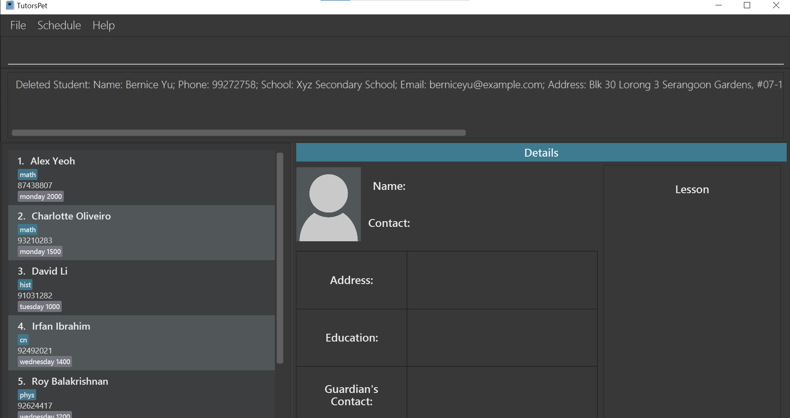

Other examples:  

Command     | Result
----------- |---------------------------------------------------
`search n/Betsy` followed by `delete 1`| deletes the 1st student in the results of the `search` command

<a href="#table-of-contents"> <button>Back to Table of Contents </button></a>

#### 3.2.5 Searching for a contact : `search`

Searches for a student’s contact whose details contain any of the given keywords.

Format: `search [n/KEYWORDS] [s/KEYWORDS] [t/KEYWORDS]`

Prefix | Searching Criteria
------ | -----------------
`n/`   | Name
`s/`   | School
`t/`   | Subject

:bulb:**Tips:**  

* **At least one** prefix must be used.
   
* All 3 types of prefix can be used **concurrently**.
  
* The search is case-insensitive.
  
* The order of the keywords does not matter. E.g. `n/Tan Alice` will match `Alice Tan`.
   
* Only full words will be matched. E.g. `Ta` will not match `Tan`.
  
* Contacts matching at least one keyword will be returned. 

* Subjects are represented by abbreviated names. Available names are `bio`, `chem`, `cn`, `econ`, `eng`, `geo`, `hist`, `math`, `phys`, `sci`, which are case-insensitive, e.g. `bio`, `BIO`, `Bio` are equivalent.

  For more details, see the [Field Format Summary](#61-field-format-summary) below.
  

Example:
`search n/yeoh alex s/xyz t/cn` displays a list of students who has the name `yeoh alex`, order does not matter, or with
the school `xyz` or with subjects `cn`.

Other examples:

Command     | Result
----------- |---------------------------------------------------
`search n/eliza s/woodlands t/math`| displays a list of students whose name is `Eliza`, students who are studying in `woodlands primary school`, and students with `math` subject
`search n/Patrick Lim` | displays a list of students whose names are `patrick lim` and `Lim Zi Ying`
`search s/woodlands` | displays a list of students studying in `woodlands primary school` and `woodlands secondary school`
`search s/raffles hwa` | displays a list of students studying in `Raffles Institution` and `Hwa chong institution`
`search t/CHEM`  `search t/chem`  `search t/Chem` | displays a list of students with the subject `chem`
`search t/chem math` | displays a list of students with the subject `chem` or with the subject `math` or with both.

<a class="md-btn md-btn-outline" href="#table-of-contents"> Back to Table of Contents </a>

#### 3.2.6 Sorting contacts : `sort`
Sorts the student contacts list by name, school, subjects or lessons.

Format: `sort PREFIX`
  
Prefix | Sorting Criteria | Details
------ | -----------------|--------
`n/`   | Name             |Alphabetical order
`s/`   | School           |Alphabetical order
`t/`   | Subject          |Alphabetical order of the first subjects in their lists
`le/`  | Lesson           |Chronological order of the first lessons in their lists

:bulb:**Tips:**  

* There are four sorting criteria available, represented by the prefixes `n/`, `s/`, `t/`, and 
  `le/`. They represent sorting by name, school, subjects or lessons respectively.
  
* If multiple sorting prefixes are listed out, the list will be sorted by the **last** prefix listed.
  
* Any extra words typed will be ignored.

Example:
`sort t/` sorts students based on the alphabetical order of their first subject.

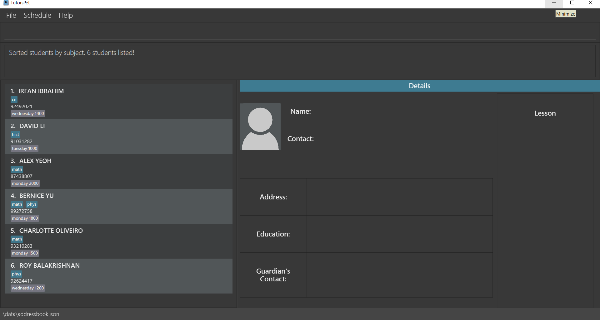

Other examples:

Command     | Result
----------- |---------------------------------------------------
`sort le/`  | sorts students based on the chronological order of their respective earliest lesson of the week
`sort n/ s/`| sorts students by the alphabetical orders of their schools, ignoring the name prefix

<a href="#table-of-contents"> <button>Back to Table of Contents </button></a>

#### 3.2.7 Listing all contacts : `list`

Shows a list of all student contacts in TutorsPet. Each student's name, phone number, subjects and lessons are displayed.

Format: `list`

<a href="#table-of-contents"> <button>Back to Table of Contents </button></a>

#### 3.2.8 Increasing level of all students : `levelup`

Advances the education level of all the student contacts by one grade by default, unless the student is excluded.
This feature can be used to do a mass update all the student's levels at the start of the school year.

If only some students' levels need to be changed, [edit](#322-editing-a-contact--edit) can be used instead.

Format: `levelup ex/[INDEX]...`

:bulb:**Tips:**  

* Students who are `sec4` will automatically advance to `sec5` when `levelup` is applied. If students 
  are part of the express course, `levelup` can be applied again to advance them to `jc1`.

* Students who are `jc2` will advance to `grad` when `levelup` is applied. Students will not 
  advance any further if they are `grad`.
  
* If the `ex/` prefix is not used, all students will advance by one education level (unless they have `grad`).
Once `ex/` prefix is used, the index field cannot be left blank.
  
* The index refers to the index number shown in the displayed student list. Indexes are used to 
  indicate students who are to be excluded from the advancement.

* The index **must be a positive integer** ranging from 1 to 2147483647.

* Multiple indexes can be taken in. Indexes must be separated by spaces.

Example:
`levelup ex/1` advances all students by one level, excluding the 1st student in the list 
(and `grad` students).

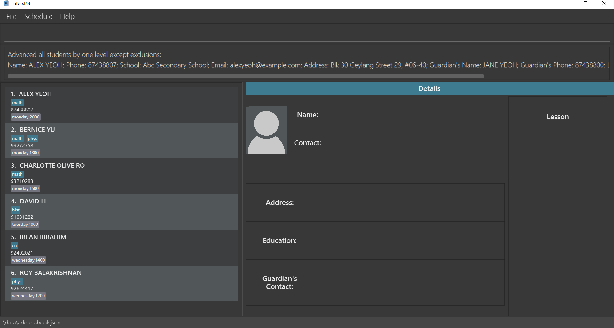

Other examples:

Command     | Result
----------- |---------------------------------------------------
`levelup`   | advances all students (except `grad` students) by one level
`levelup ex/3 4`| advances all students by one level, excluding the 3rd and 4th student in the list (and `grad` students)

<a href="#table-of-contents"> <button>Back to Table of Contents </button></a>

#### 3.2.9 Decreasing level of all students : `leveldown`

Demotes the education level of all the student contacts by one grade by default, unless the student is excluded.
This feature can be used to do a mass undo of `levelup` or indicate retainees. 

If only some students' levels need to be changed, [edit](#322-editing-a-contact--edit) can be used instead.

Format: `leveldown ex/[INDEX]...`

:bulb:**Tips:**  

* Students who are `jc1` will automatically demote to `sec5` when `leveldown` is applied. If students
  are part of the express course, `leveldown` can be applied again to demote them to `sec4`.

* Students who are `pri1` will not demote any further.

* If the `ex/` prefix is not used, all students will advance by one education level (unless they have `grad`).
  Once `ex/` prefix is used, the index field cannot be left blank.
  
* The index refers to the index number shown in the displayed student list. Indexes are used to
  indicate students who are to be excluded from the demotion.

* The index **must be a positive integer** ranging from 1 to 2147483647.

* Multiple indexes can be taken in. Indexes must be separated by spaces.

Example:
`leveldown ex/5` demotes all students by one level, excluding the 5th student in the list
(and `grad` students).

Other examples:

Command     | Result
----------- |---------------------------------------------------
`leveldown`   | demotes all students (except `pri` students) by one level
`leveldown ex/1 2`| demotes all students by one level, excluding the 2nd and 4th student in the list (and `pri1` students)

<a href="#table-of-contents"> <button>Back to Table of Contents </button></a>

### 3.3 Important Date Management

#### 3.3.1 Adding an important date : `add-date`

Adds an important date to TutorsPet.

Format: `add-date d/DESCRIPTION dt/DETAILS`

:bulb:**Tips:**  

* `DETAILS` must be in the **yyyy-mm-dd HHmm format** e.g. `2021-11-03 0800`
* Dates with the **exact same description and details** will be considered a duplicate and will not be added into TutorsPet
* To avoid confusion, dates with the same description will also not be added into TutorsPet.
* All dates would be accepted, including past dates. e.g. `2019-01-20`

Example:  

Command     | Result
----------- |---------------------------------------------------
`add-date d/math exam dt/2021-11-03 0800`  | adds an important date with description `math exam` and details `2021-11-03 0800`

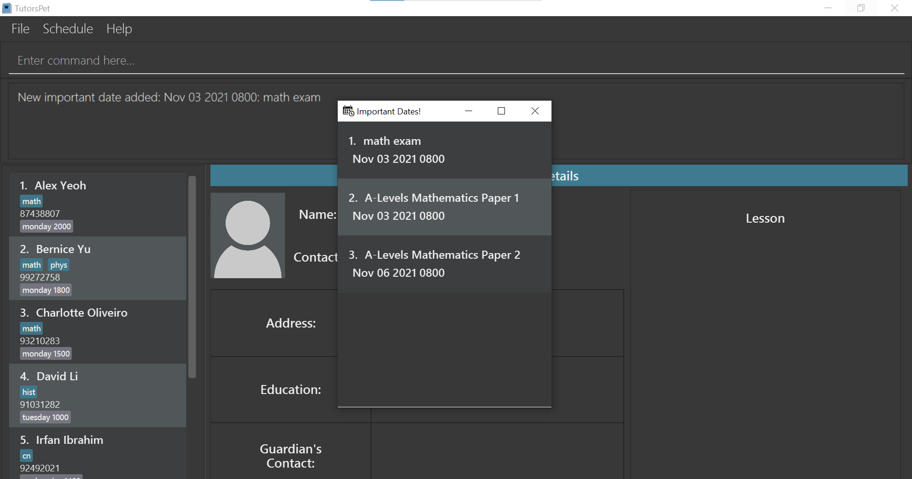

<a href="#table-of-contents"> <button>Back to Table of Contents </button></a>

#### 3.3.2 Listing all important dates : `list-date`

Shows a list of all important dates in TutorsPet.

Format: `list-date`

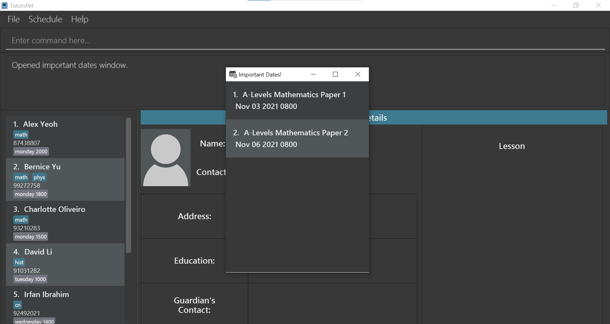

<a href="#table-of-contents"> <button>Back to Table of Contents </button></a>

#### 3.3.3 Deleting an important date : `delete-date`

Permanently deletes the specified important date from TutorsPet.

Format: `delete-date INDEX`

:bulb:**Tips:**  

* Deletes the important date at the specified `INDEX`.
  
* The index refers to the index number shown in the displayed important dates list.

* The index **must be a positive integer** ranging from 1 to 2147483647.

Example:  

Command     | Result
----------- |---------------------------------------------------
`list-date` followed by `delete-date 2` |  deletes the 2nd important date in TutorsPet

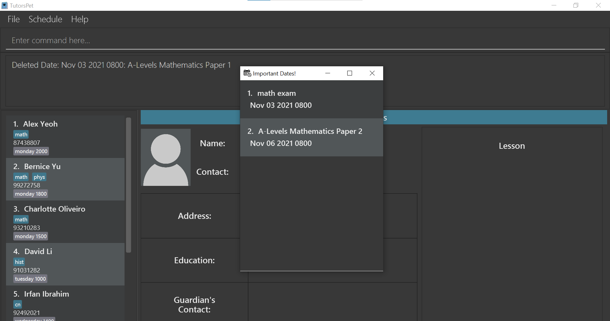

<a href="#table-of-contents"> <button>Back to Table of Contents </button></a>

### 3.4 Lesson Planning

#### 3.4.1 Viewing schedule : `schedule`

Shows a weekly schedule that displays lessons for the week.

Format: `schedule`

<a href="#table-of-contents"> <button>Back to Table of Contents </button></a>

### 3.5 Data Management

#### 3.5.1 Saving the data

TutorsPet data are saved in the hard disk automatically after any command that changes the data. There is no need to save manually.

#### 3.5.2 Editing the data file

TutorsPet data are saved into three different JSON files:  
1. **\[JAR file location]/data/addressbook.json** for storing contact details. 
2. **\[JAR file location]/data/datesbook.json** for storing important exam dates.
3. **\[JAR file location]/data/lessonbook.json** for storing student lesson dates.

Advanced users are welcome to update data directly by editing that data file.

:exclamation: **Caution:**

* You are strongly discouraged from editing the files due to syncing of information between the three files.
* If your changes to the data file makes its format invalid, TutorsPet will discard all data and start with an empty data file at the next run.

<a href="#table-of-contents"> <button>Back to Table of Contents </button></a>

## 4. Coming soon

### 4.1 Add a subject to teach **[coming in v2.0]**

_Format: `add-subject SUBJECT_NAME`   Currently, there is a fixed list of subjects that is available to teach and can be tagged in TutorsPet, 
while in v2.0, more personalised subjects can be added in._

### 4.2 Add profile picture for each contact **[coming in v2.0]**
_Format: `add-profile INDEX FILE_PATH`   Add a profile picture to the contact of the specified index
by providing the file path to the picture._
--------------------------------------------------------------------------------------------------------------------

<a href="#table-of-contents"> <button>Back to Table of Contents </button></a>

## 5. FAQ

**Q**: How do I transfer my data to another Computer? 
**A**: Install the app in the other computer and overwrite the empty data file it creates with the file that contains the data of your previous TutorsPet home folder.

--------------------------------------------------------------------------------------------------------------------

## 6. Summary

### 6.1 Field Format Summary

Student Contact Field   | Prefix | Optional?|Format
------------------------| -------|--------- |------------------------------------
Name                    | `n/`   | N        | Contains alphanumeric characters and spaces only
Phone number            | `p/`   | N        | Contains numbers only; at least 3 digits long
Email                   | `e/`   | Y        | Should be in the format of **local-part@domain** e.g. `alexyeoh@gmail.com`
Address                 | `a/`   | Y        | Any format
Guardian's name         | `gn/`  | Y        | Contains alphanumeric characters and spaces only
Guardian's phone number | `gp/`  | Y        | Contains numbers only; at least 3 digits long
Education level         | `lv/`  | Y        | Fixed format:  Primary School: `pri1`, `pri2`, `pri3`, `pri4`, `pri5`, `pri6`  Secondary School: `sec1`, `sec2`, `sec3`, `sec4`, `sec5` Junior College: `jc1`, `jc2` Post Junior College: `grad`
Subject                 | `t/`   | Y        | Can have any number of inputs (including 0)  Fixed format:   Languages: `cn`, `eng`, `mal`, `tam` Mathematics & Sciences: `bio`, `chem`, `math`, `phys`, `sci` Humanities: `econ`, `geo`, `hist`, `lit`  Represents subjects Chinese, English, Malay, Tamil, Biology, Chemistry, Mathematics, Physics, Science, Economics, Geography, History, Literature in order of the above listing.
Lesson                  | `le/`  | Y        | Can have any number of inputs (including 0)  Consist of lesson day and lesson time: Lesson day: `monday`, `tuesday`, `wednesday`, `thursday`, `friday`, `saturday`, `sunday` Lesson time: In **HHmm** format e.g. `1300`

:exclamation: **Caution:**
TutorsPet does not corroborate the school, education level, subject and lesson fields of the student contacts
input in the app. Users will have to ensure the information they enter for these fields match up accordingly,
e.g. A student contact in ABC Primary School will probably not be in sec3, or take subjects
like chem and bio.

<a href="#table-of-contents"> <button>Back to Table of Contents </button></a>

### 6.2 Command summary

Action | Format, Examples
--------|------------------
**[Clear](#311-clearing-all-entries--clear)** | `clear`
**[Exit](#312-exiting-the-program--exit)** | `exit`
**[Help](#313-viewing-help--help)** | `help`
**[Add](#321-adding-a-contact--add)** | `add n/NAME p/PHONE [s/SCHOOL] [e/EMAIL] [a/ADDRESS] [gn/GUARDIAN_NAME] [gp/GUARDIAN_PHONE] [lv/LEVEL] [t/SUBJECT]…​ [le/LESSON]…​`   e.g., `add n/Bob Lee p/87654321 s/Def Secondary School a/Bob street, block 321, #01-02 gn/John Lee gp/12345678 t/geo`
**[Edit](#322-editing-a-contact--edit)** | `edit INDEX [n/NAME] [s/SCHOOL] [p/PHONE] [e/EMAIL] [a/ADDRESS] [gn/GUARDIAN_NAME] [gp/GUARDIAN_PHONE] [lv/LEVEL] [t/SUBJECT]…​ [le/LESSON]…​`  e.g.,`edit 2 n/James Lee e/jameslee@example.com`
**[Detail](#323-viewing-a-contact-details--detail)** | `detail INDEX`   e.g., `detail 1`
**[Delete](#324-deleting-a-contact--delete)** | `delete INDEX`  e.g., `delete 3`
**[Search](#325-searching-for-a-contact--search)** | `search [n/KEYWORDS] [s/KEYWORDS] [t/KEYWORDS]`  e.g., `search n/James Jake s/woodlands t/eng`
**[Sort](#326-sorting-contacts--sort)** | `sort PREFIX`   e.g., `sort [n/]`, `sort [s/]`
**[List](#327-listing-all-contacts--list)** | `list`
**[Level Up](#328-advancing-all-students--levelup)** | `levelup [ex/INDEX]`   e.g., `levelup`, `levelup ex/3 4`
**[Level Down](#329-demoting-all-students--leveldown)** | `leveldown [ex/INDEX]`   e.g., `leveldown`, `leveldown ex/1 2`
**[Add dates](#331-adding-an-important-date--add-date)** | `add-date d/DESCRIPTION dt/DETAILS`  e.g, `add-date d/math exam dt/2021-11-05 1300`
**[Delete dates](#333-deleting-an-important-date--delete-date)** | `delete-date INDEX`  e.g., `delete-date 3`
**[List dates](#332-listing-all-important-dates--list-date)** | `list-date`
**[Schedule](#341-viewing-schedule--schedule)** | `schedule`

<a href="#table-of-contents"> <button>Back to Table of Contents </button></a>

### 7. Glossary 

**Parameters:** Inputs keyed in after the command word that specify the behaviour of the command

**Prefix**: Expressions that signal a certain field HELP e.g. n/, dt/ 

<a href="#table-of-contents"> <button>Back to Table of Contents </button></a>
