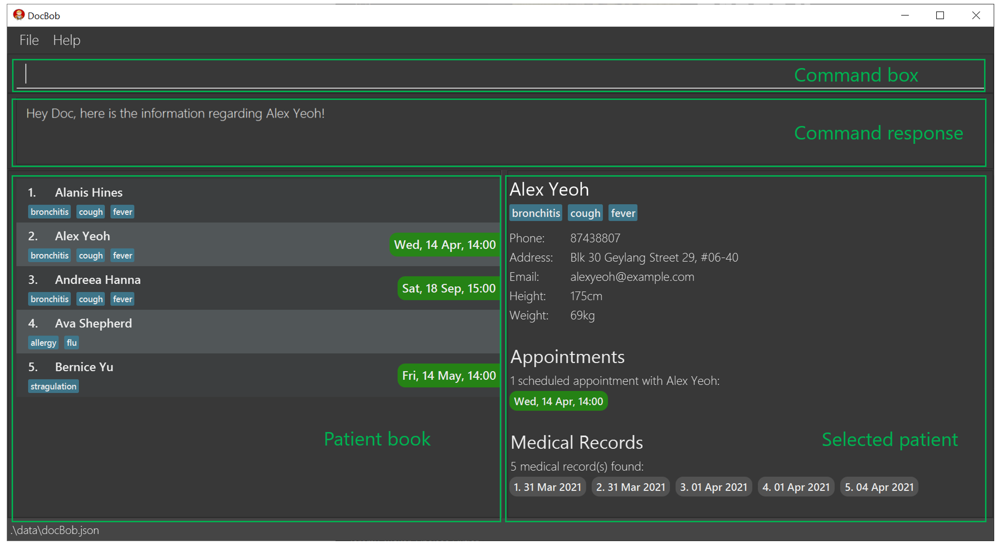

**DocBob** is a lightweight patient management system built to help small clinics better manage the appointments & medical information of their beloved patients. With DocBob, you will never have to go through the hassle of manually keeping track of your patients' medical information and appointments ever again. Leave the pen and paper in the past and let Bob take you to an automated future. In the event of any issues, please feel free to contact the team via the email provided below under the **Issues** section

* Table of Contents
{:toc}

--------------------------------------------------------------------------------------------------------------------

## Quick start

1. Ensure you have Java `11` or above installed on your computer.

1. Download the latest `docbob.jar` from [here](https://github.com/AY2021S2-CS2103T-W12-1/tp/releases).

1. Double-click the file to start the app. 
   > **First Startup**: DocBob comes with some sample patient data. Try out the example commands below with the sample data and when you are ready, use the `clear` command to remove all sample data and start adding your own patients!

1. Execute commands by typing them in the command box and pressing **Enter** to execute them. See [Features](#features) for details of each command. 
   Example commands:
   * **`list`** : List out all patients in DocBob's contact list.

   * **`add n/Breanna Frye p/97890525 e/example@gmail.com a/4340 Monroe Street h/163cm w/54kg`** : Adds a patient named `Breanna Frye` with the given information to the patient book.

   * **`appt 1 d/010120301200`** : Adds a scheduled appointment with the patient at index 1 in DocBob's contact list, on 1st January 2030 12pm.
> **Quick tip**: typing **`help`** and pressing Enter will list out all available commands!

--------------------------------------------------------------------------------------------------------------------

## Features

**:information_source: Notes about the command format:** 

* Words in `UPPER_CASE` are the parameters to be supplied by the user. 
  e.g. in `add n/NAME`, `NAME` is a parameter which can be used as `add n/John Doe`.

* Items in square brackets are optional. 
  e.g `n/NAME [t/TAG]` can be used as `n/John Doe t/cough` or as `n/John Doe`.

* Items with `…`​ after them can be used multiple times including zero times. 
  e.g. `[t/TAG]…​` can be used as ` ` (i.e. 0 times), `t/friend`, `t/friend t/family` etc.

* Parameters can be in any order. 
  e.g. if the command specifies `n/NAME p/PHONE_NUMBER`, `p/PHONE_NUMBER n/NAME` is also acceptable.

* If a parameter is expected only once in the command but you specified it multiple times, only the last occurrence of the parameter will be taken. 
  e.g. if you specify `p/12341234 p/56785678`, only `p/56785678` will be taken.

* Certain commands (such as `help`, `list`, `exit` and `clear`) cannot take in parameters.  In cases like this, the extra input parameters will be ignored. 
  e.g. if the command specifies `help 123`, it will be interpreted as `help`.

### Adding a patients' contact: `add`

Adds a patient to DocBob's patient list.  A patient has multiple types of information like name, phone number etc. The format below shows what information a patient can have. The information in square brackets ( [] ) are optional.

Format: `add n/Name p/phoneNumber e/Email a/Address h/Height w/Weight [t/TAG]`

Example:
* `add n/Shrek p/66666666 e/shrek@swampmail.com a/Swamp h/243cm w/94kg t/smelly`

Output:

`New patient added: Shrek; Phone: 66666666; Email: shrek@swampmail.com; Address: Swamp; Height: 243cm; Weight: 94kg; Tags: [smelly]`

> **Tip**: You can always change these information later on using the `edit` command!

### Listing out all patients : `list`

Shows a list of all your patients, with their next scheduled appointment beside their name.

Format: `list`

Example: `list`

Output:

### Deleting a patients' contact : `delete`

Deletes a patient from DocBob's patient list, identified by the index number shown in the displayed patient list.

Format : `delete INDEX`
where INDEX must be a positive integer (1,2,3,...)

Example:
* `delete 1`

Output:

`Deleted Person: Shrek; Phone: 66666666; Email: shrek@swampmail.com; Address: Swamp; Height: 243cm; Weight: 94kg; Tags: [smelly]`

### View all information regarding a patient : `view`

Shows an overview of all contact information, tags, appointments and medical records of a patient, identified by the index number shown in the displayed patient list.

Format : `view INDEX`
where INDEX must be a positive integer (1,2,3,...)

Examples:
* `view 6`

Output: 

### Locating patient by name : `find`

Finds patients whose names contain any of the given keywords, and displays an overview of information of the first patient found.

Format: `find KEYWORD [MORE_KEYWORDS]`

* The search is case-insensitive. e.g `hans` will match `Hans`
* The order of the keywords does not matter. e.g. `Hans Bo` will match `Bo Hans`
* Only the name is searched.
* Only full words will be matched e.g. `Han` will not match `Hans`
* Persons matching at least one keyword will be returned (i.e. `OR` search).
  e.g. `Hans Bo` will return `Hans Gruber`, `Bo Yang`

Examples:
* `find John` returns `john` and `John Doe`
* `find alex david` returns `Alex Yeoh`, `David Li` 

### Editing a patient information : `edit`

Edits the information of an existing patient in DocBob's patient list.

Format: `edit INDEX [n/NAME] [p/PHONE] [e/EMAIL] [a/ADDRESS] [h/HEIGHT] [w/WEIGHT] [t/TAG]…​`

* Edits the patient at the specified `INDEX`. The index refers to the index number shown in the displayed patient list. The index **must be a positive integer** 1, 2, 3, …​
* At least one of the optional fields must be provided.
* Existing values will be updated to the input values.
* When editing tags, the existing tags of the patient will be removed i.e adding of tags is not cumulative.
* You can remove all the patient’s tags by typing `t/` without
    specifying any tags after it.

Examples:
*  `edit 1 p/91234567 e/johndoe@example.com` Edits the phone number and email address of the 1st patient to be `91234567` and `johndoe@example.com` respectively.
*  `edit 2 n/Betsy Crower t/` Edits the name of the 2nd patient to be `Betsy Crower` and clears all existing tags.

### Adding an appointment to a patient : `appt`

Adds a scheduled upcoming appointment to a patient in DocBob's list. The appointment is specified by its date and time, where the year is optional(assumed to be the current year if not specified). The patient is identified by their index number shown in the display patient's list.

Format: `appt INDEX d/DATE`
where INDEX must be a positive integer (1,2,3,...)
and DATE is DDMMYYYYhhmm or DDMMhhmm

Examples:
* `appt 3 d/25120800`

Output:

`Appointment added: Sat, 25 Dec, 08:00`

### Listing out your upcoming appointments : `listappt`

Shows all your patients with appointments, how many appointments you have, and a list of all your upcoming appointments sorted by nearest date and time.

Format: `listappt`

Example: `listappt`

Output: 

### Create a new medical record for a patient : `mrec`

Opens an editor for you to write a custom medical report for the patient, identified by the index number shown in the displayed patient list. You can add multiple sections using the **New Section** button. Once done, click the **Save Record** button to save it for future viewing with the `vrec` command.

Format : `mrec INDEX`
where INDEX must be a positive integer (1,2,3,...)

Examples:
* `mrec 3`

Output:

> **Tip**: You can still edit a medical record with `vrec` within a day of the creation of the record, should you need to change some details.

### View a patient's preexisting medical record : `vrec`

Views a past medical report of a patient identified by the index number of the medical record of the currently selected patient via the `view` command. A medical report is editable for a day after creation.

Format : `vrec INDEX`
where INDEX must be a positive integer (1,2,3,...)

Examples:
* `vrec 4`

Output:

> **Tip**: Make sure you have selected the patient whose medical record you want to view first, using `view`. If the selected patient has no medical records to view, you can create a new one using `mrec`!

### Archiving a patient : `archive`

Archives a patient from DocBob's patient list, identified by the index number shown in the displayed patient list. The patient is then added to the archive list.

Format : `archive INDEX`
where INDEX must be a positive integer (1,2,3,...)

* Remember to be on the main list when archiving a patient using the `list` command.

Example:
* `archive 1`

Output:

### Listing out all archived patients : `archivelist`

Shows the list of all your archived patients information, with their next scheduled appointment beside their name.

Format: `archivelist`

### Unarchiving a patient : `unarchive`

Unarchives a patient from DocBob's archived patient list, identified by the index number shown in the displayed archived patient list. The patient is added back to DocBob's main patient list.

Format : `unarchive INDEX`
where INDEX must be a positive integer (1,2,3,...)

Example:
* `unarchive 3`

Output:

> **Tip**: Make sure you are on the archive list(using the `archivelist` command) before trying to unarchiving a patient!

### Clearing all entries : `clear`

Clears all patients from DocBob.

Format: `clear`

### Exiting the program : `exit`

Exits the program.

Format: `exit`

### List out all available commands : `help`

Opens a help window containing a link to this User Guide and a list of all available commands for use in the app, with format example.

Format: `help`

Example: `help`

Output:

DocBob will open up a help window with command information.

### Saving the data

Client contact data is saved in the hard disk automatically after any command that changes the data. There is no need to save manually.

### Editing the data file

Client contact data is saved as a JSON file `[JAR file location]/data/docBob.json`. Advanced users are welcome to update data directly by editing that data file.

:exclamation: **Caution:**
If your changes to the data file makes its format invalid, docBob will discard all data and start with an empty data file at the next run.

--------------------------------------------------------------------------------------------------------------------

## FAQ

**Q**: How do I transfer my data to another Computer? 
**A**: Install the app in the other computer and overwrite the empty data file it creates with the file that contains the data of your previous DocBob home folder. 

--------------------------------------------------------------------------------------------------------------------

## Glossary 

Terminology | Definition | Examples
------------|------------|----------
**parameter(s)** | Any characteristic that can help in defining or classifying a particular system | How fast a car can go is a parameter for us to judge how good that car is.  In this case (DocBob), the words in UPPER_CASE are what we should key in 
**index** | Index refers to the position of the patient in the patient list | If the patient list is {Alice,Bob,Charlie} then Alice's index is 1, Bob's is 2 and Charlie's is 3

--------------------------------------------------------------------------------------------------------------------

## Command summary

Action | Format, Examples
--------|------------------
**add** | `add n/Name p/phoneNumber e/Email a/Address h/Height w/Weight [t/TAGS]`   e.g., `add n/Shrek p/66666666 e/shrek@swampmail.com a/Swamp h/243cm w/94kg`
**list** | `list`
**delete** | `delete INDEX`   e.g., `delete 1`
**find** | `find KEYWORD [MORE_KEYWORDS]`   e.g., `find john`
**edit** | `edit INDEX [n/NAME] [p/PHONE] [e/EMAIL] [a/ADDRESS] [h/HEIGHT] [w/WEIGHT] [t/TAG]…​`   e.g., `edit 1 p/91234567 e/johndoe@example.com`
**view** | `view INDEX`   e.g., `view 6`
**appt** | `appt INDEX /dDATE`   e.g., `appt 1 d/010120211200`
**listappt** | `listappt`
**mrec** | `mrec INDEX`   e.g., `mrec 3`
**vrec** | `vrec INDEX`   e.g., `vrec 4`
**archive** | `archive INDEX`   e.g., `archive 2`
**archivelist** | `archivelist`
**unarchive** | `unarchive INDEX`   e.g., `unarchive 2`
**clear** | `clear`
**exit** | `exit`
**help** | `help`

## Issues
In the event of any issues while using the app and or UG, please contact the team at the emails below  
e0406660@u.nus.edu.com 
e0407819@u.nus.edu.com 
e0407867@u.nus.edu.com 
e0415569@u.nus.edu.com 
