Cheese Inventory Management (CHIM) is a desktop app for managing the contacts, inventory, and orders of a home-based
cheese making business.

The app is optimized for use via a Command Line Interface (CLI) while still having the
benefits of a Graphical User Interface (GUI). If you can type fast, CHIM can get your management tasks done
faster than traditional GUI apps.

* Table of Contents
{:toc}

--------------------------------------------------------------------------------------------------------------------

## Quick start

1. Ensure you have Java `11` or above installed in your computer. This check can be done with the command:

> java --version

2. Download the latest release from the [GitHub repository](https://github.com/AY2021S2-CS2103-W16-2/tp/releases).

3. Navigate to the folder that contains the downloaded .jar file and run the application. For example,

> ### Unix
> cd ~/Downloads
>
> java -jar chim.jar

> ### Windows
> cd C:\Downloads
>
> java -jar chim.jar

--------------------------------------------------------------------------------------------------------------------

## Features

**:information_source: Notes about the command format:** 

* Words in `UPPER_CASE` are the parameters to be supplied by the user. 
  e.g. in `addcustomer n/CUSTOMER_NAME`, `CUSTOMER_NAME` is a parameter that is to be used
  as `addcustomer n/John Doe`.

* Items in square brackets are optional. 
  e.g. `addcheese t/CHEESE_TYPE q/QUANTITY [d/MANUFACTURE_DATE] [e/EXPIRY_DATE]` can be used as `addcheese t/Brie q/3 d/2021-01-12` or as `addcheese t/Brie q/3`.

* Parameters with trailing dots allows for inputting of multiple items. 
  e.g. `[t/TAG…]` means multiple tags can be specified.

* Parameters can be in any order. 
  e.g. if the command specifies `n/CUSTOMER_NAME p/PHONE_NUMBER`, `p/PHONE_NUMBER n/CUSTOMER_NAME` is also acceptable.

* If a parameter is expected only once in the command, but you specified it multiple times, only the last occurrence of
  the parameter will be taken. 
  e.g. if you specify `p/12341234 p/56785678`, only `p/56785678` will be taken.

* Extraneous parameters for commands that do not take in parameters (such as `listcustomers`) will be
  ignored. 
  e.g. if the command specifies `listcustomers 123`, it will be interpreted as `listcustomers`.

* Parameters expecting dates must be given in these formats: `DD/MM/YYYY` or `YYYY-MM-DD` or `MMM DD YYYY`, 
  e.g. `31/03/2021` or `2021-03-31` or `Mar 31 2021` where `Mar` is case-sensitive.

* Parameters for dates will accept any day given in the range [1..31].
  If the day is invalid for the month you have chosen, it will be trimmed to the latest valid day, 
  e.g. `31/02/2021` will be edited to `28/02/2021` by CHIM.

### Viewing help : `help`

Shows a message explaning how to access the help page.

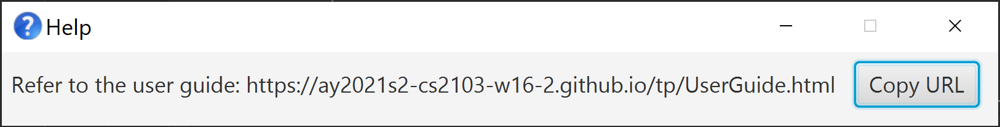

Format: `help`

### Features for Customers

#### Listing customers: `listcustomers`

Displays the customers in CHIM.

Format: `listcustomers`

Example:

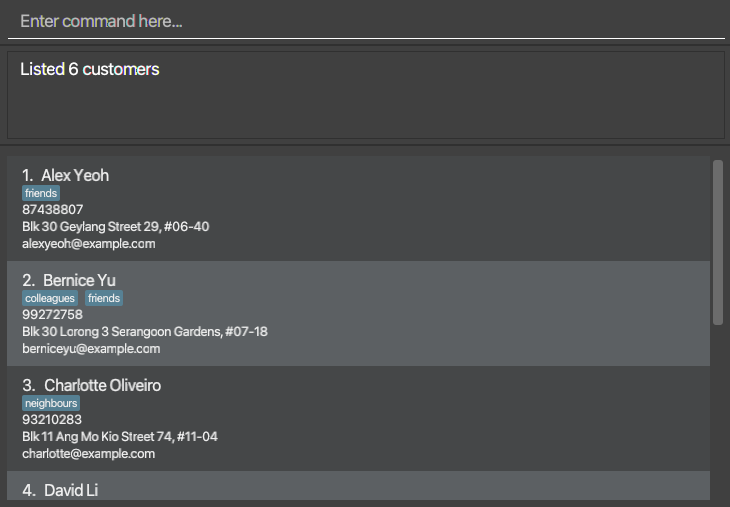

#### Adding a customer: `addcustomer`

Adds a customer to CHIM.

Format: `addcustomer n/CUSTOMER_NAME p/PHONE_NUMBER e/EMAIL a/ADDRESS [t/TAG…]​`

Example: `addcustomer n/John Doe p/61234567 e/johndoe@gmail.com a/Blk 436 Serangoon Gardens St 26 #01-01`

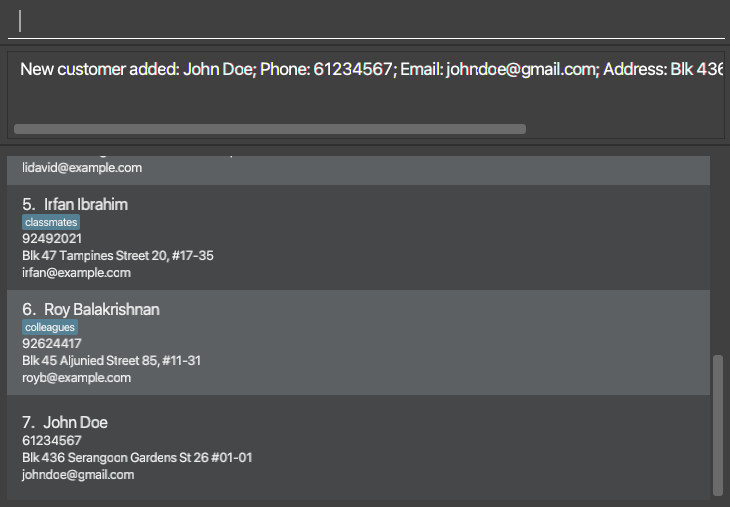

#### Editing a customer: `editcustomer`

Edits an existing customer in CHIM.

Format: `editcustomer INDEX [n/CUSTOMER_NAME] [p/PHONE_NUMBER] [e/EMAIL] [a/ADDRESS] [t/TAG…]`
* At least one of the optional fields must be provided to edit the customer.
* The `INDEX` refers to the index number of the customer shown in `listcustomers`.

Example: `editcustomer 4 n/Jane Lim p/65558888`

Before:  

After:  
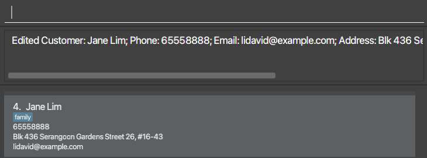

#### Deleting a customer: `deletecustomer`

Deletes a customer from the list of customers, using their phone number as an identifier.

If the customer has orders, their orders will be deleted by CHIM. Any cheeses assigned to those orders will also be deleted.

Format: `deletecustomer p/PHONE_NUMBER`

Example: `deletecustomer p/61234567`

Before:  
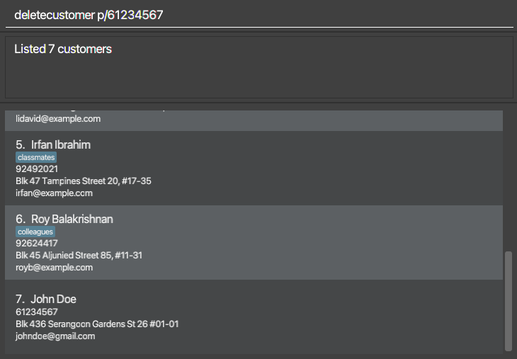

After:  
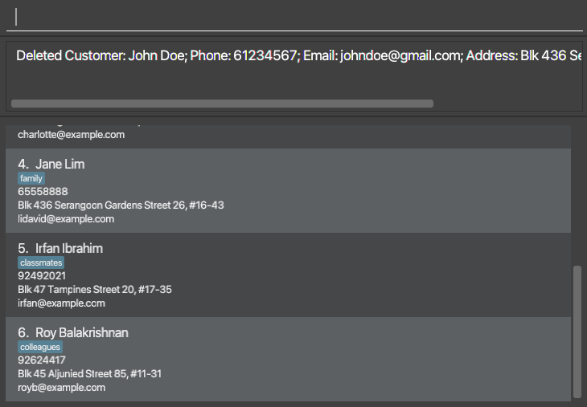

#### Finding customers: `findcustomer`

Searches for a customer in CHIM.

Format: `findcustomer [n/NAME_KEYWORDS…] [p/PHONE_KEYWORDS…] [e/EMAIL_KEYWORDS…] [a/ADDRESS_KEYWORDS…] `
* At least one of the optional fields must be provided to find a customer.
* Search is case-insensitive, e.g. Betty will match betty.
* Search will search by given keywords as prefix, e.g. Bet will match Betty as well as Amy Beth.
* Search will find any customers which match **all** of the given fields,
e.g. `findcustomer n/Betty Yu p/9123 81` will find customers with name that contains a prefix of `Betty` or `Yu` **and** a phone number with prefix `9123` or `81`.

Examples:

* `findcustomer n/char p/9321`

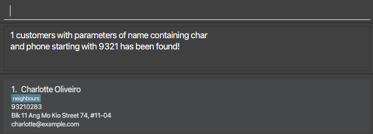

* `findcustomer a/Geylang Serangoon`

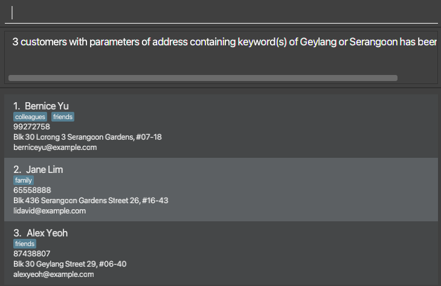

### Features for Cheeses

#### Listing cheese: `listcheeses`

Displays all cheeses in CHIM.

Format: `listcheeses`

Example:

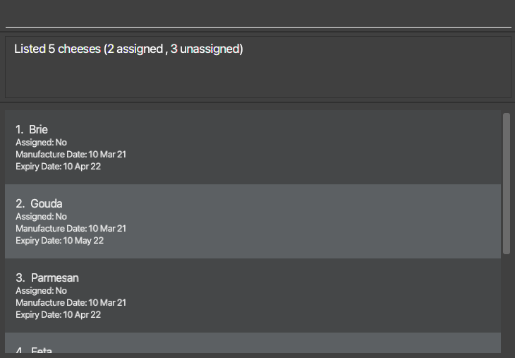

#### Adding a cheese: `addcheese`

Adds a cheese to CHIM.

Format: `addcheese t/CHEESE_TYPE q/QUANTITY [d/MANUFACTURE_DATE] [e/EXPIRY_DATE]`
* The specified `QUANTITY` must be a positive integer and less than 1000.
* All dates must be given in these formats: `DD/MM/YYYY` or `YYYY-MM-DD` or `MMM DD YYYY`.
* The specified `MANUFACTURE_DATE` must be any date up to the current date, and not in the future.
If `MANUFACTURE_DATE` is not specified, it will default to the current date.
* The `EXPIRY_DATE` specified must occur after the `MANUFACTURE_DATE`.

Examples:

* `addcheese t/Gouda q/3`

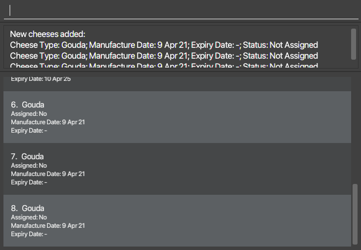

* `addcheese t/Parmesan q/2 d/2021-03-12 e/2021-05-12`

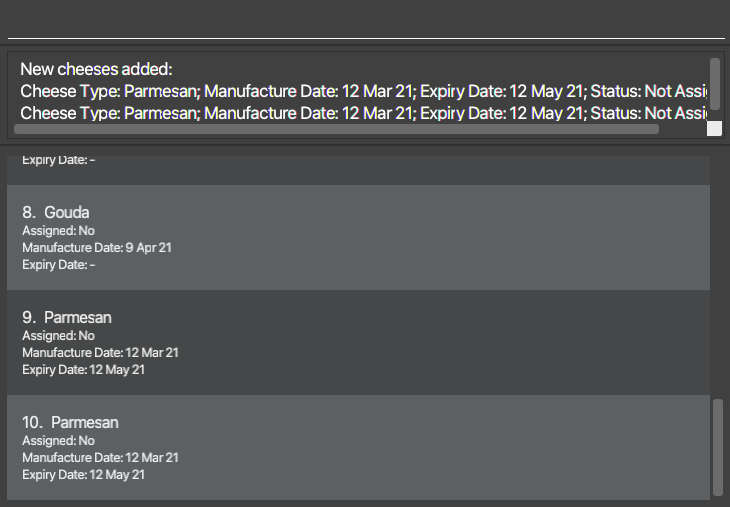

#### Editing a cheese: `editcheese`

Edits an existing unassigned cheese in CHIM.

Format: `editcheese INDEX [t/CHEESE_TYPE] [d/MANUFACTURE_DATE] [e/EXPIRY_DATE]`
* At least one of the optional fields must be provided to edit a cheese.
* The specified `INDEX` must be a positive integer.
* The `INDEX` refers to the index number of the cheese shown in `listcheeses`.
* All dates must be given in these formats: `DD/MM/YYYY` or `YYYY-MM-DD` or `MMM DD YYYY`.
* The specified `MANUFACTURE_DATE` must be any date up to the current date, and not in the future.
* The specified `EXPIRY_DATE` must occur after the `MANUFACTURE_DATE`.

Example: `editcheese 1 t/Parmesan d/2021-03-12`

Before:  

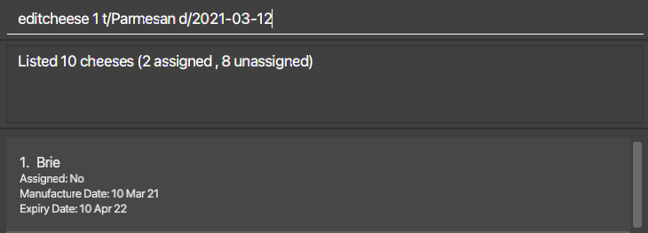

After:  

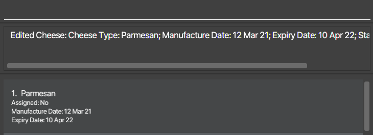

#### Deleting a cheese from inventory: `deletecheese`

Deletes a specified unassigned cheese from the inventory, identified by its index.

Format: `deletecheese CHEESE_INDEX`
* The `CHEESE_INDEX` must be a positive integer.
* The `CHEESE_INDEX` refers to the index number of the cheese shown in `listcheeses`.

Example: `deletecheese 2`

Before:  

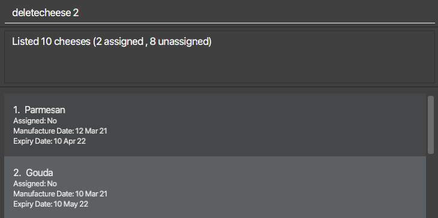

After:  

#### Finding cheeses: `findcheese`

Searches for particular cheeses in CHIM.

Format: `findcheese [t/CHEESE_TYPE_KEYWORDS…] [s/ASSIGNMENT_STATUS]`
* At least one of the optional fields must be provided to find a cheese.
* Search is case-insensitive, e.g. Brie will match brie and Blue Brie.
* Assignment status parameter must be either `assigned` or `unassigned`.
* Search will find any cheeses which match **all** of the given fields,
e.g. `findcheese t/Gouda Cam s/assigned` will find a cheese with type containing prefix of `Gouda` or `Cam` **and** an `assigned` status.

Examples:

* `findcheese t/Brie Feta`

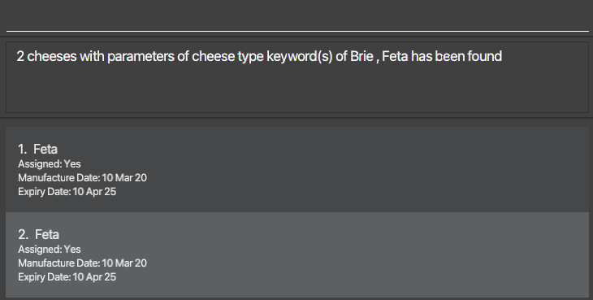

* `findcheese s/unassigned`

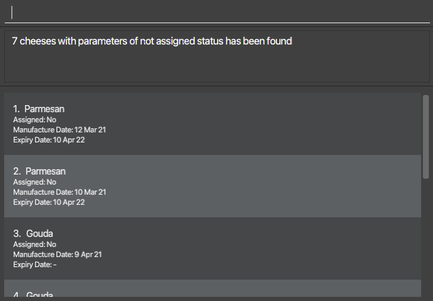

* `findcheese t/Gouda s/unassigned`

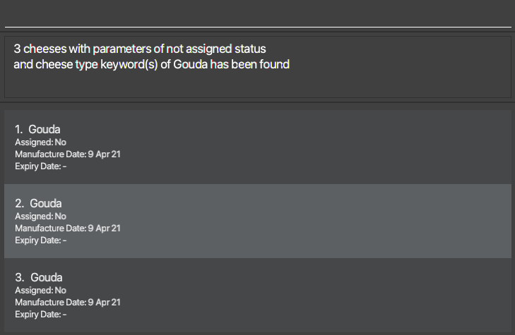

### Features for Orders

#### Listing orders: `listorders`

Displays all orders in CHIM.

Format: `listorders`

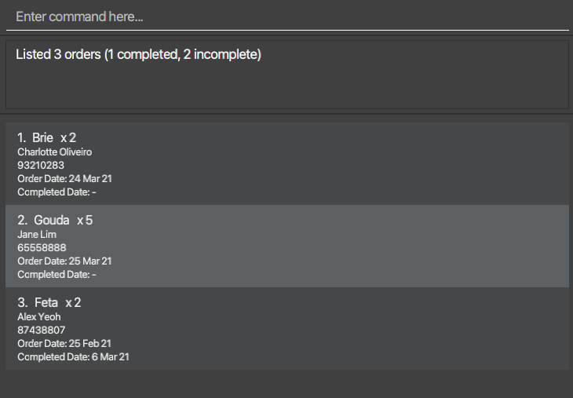

#### Adding an order: `addorder`

Adds an order to CHIM.

Format: `addorder t/CHEESE_TYPE q/QUANTITY p/PHONE_NUMBER [d/ORDER_DATE]`
* The specified `CHEESE_TYPE` need not belong to an existing cheese in CHIM.
* The specified `QUANTITY` must be a positive integer.
* The specified `PHONE_NUMBER` must belong to an existing user.
* The specified `ORDER_DATE` must be given in these formats: `DD/MM/YYYY` or `YYYY-MM-DD` or `MMM DD YYYY`.
* The specified `ORDER_DATE` must be any date up to the current date, and not in the future.
If an `ORDER_DATE` is not specified, it will default to the current date.
* Duplicate orders can be created as the user may want to fulfil similar orders separately.

Examples:

* `addorder t/Parmesan q/2 p/99272758`

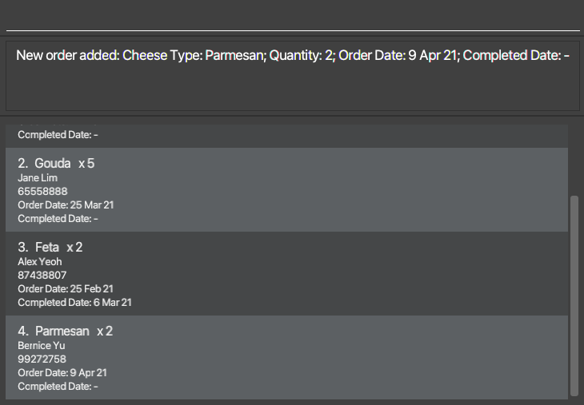

* `addorder t/Feta q/3 p/87438807 d/2021-01-15`

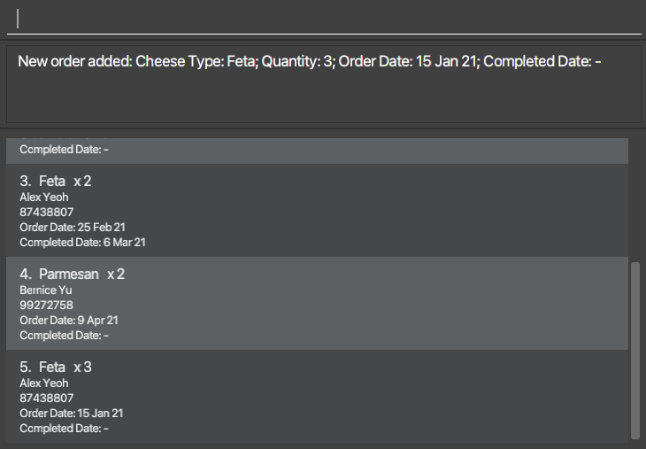

#### Editing an order: `editorder`

Edits an existing uncompleted order in CHIM.

Format: `editorder INDEX [t/CHEESE_TYPE] [q/QUANTITY] [p/PHONE_NUMBER] [d/ORDER_DATE]`
* At least one of the optional fields must be provided to edit an order.
* The specified `INDEX` and `QUANTITY` must be a positive integer.
* The `INDEX` refers to the index number of the order shown in `listorders`.
* The specified `CHEESE_TYPE` need not belong to an existing cheese type in CHIM.
* The specified `PHONE_NUMBER` must belong to an existing user.
* The specified `ORDER_DATE` must be given in these formats: `DD/MM/YYYY` or `YYYY-MM-DD` or `MMM DD YYYY`.
* The specified `ORDER_DATE` must be any date up to the current date, and not in the future.

Example: `editorder 2 t/Parmesan q/2 p/61234567`

Before:  

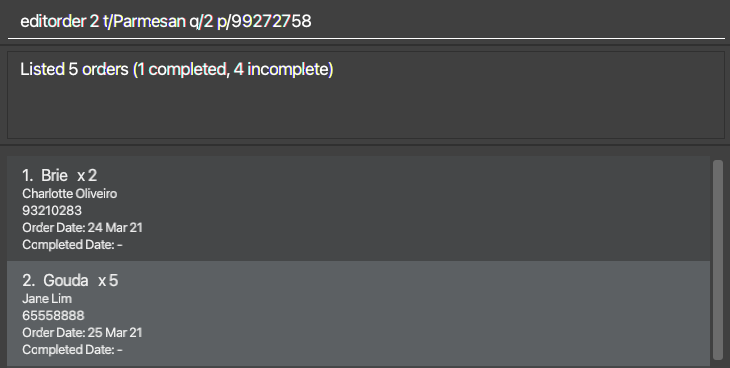

After:  

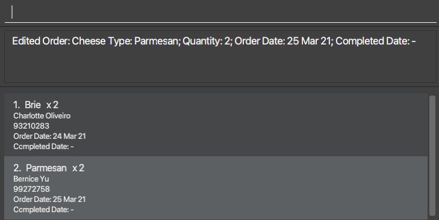

#### Marking an order as complete: `done`

Marks an incomplete order as complete from CHIM, identified by its index.

This assigns cheeses to the order.

Format: `done ORDER_INDEX`
* The `ORDER_INDEX` provided must be a positive integer.
* The `ORDER_INDEX` refers to the index number of the order shown in `listorders`.

Example: `done 2` - marks the second order in the list of orders as complete.

Before:  

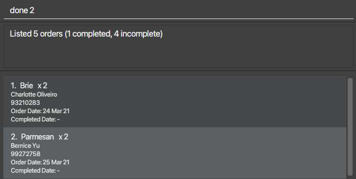

After:  

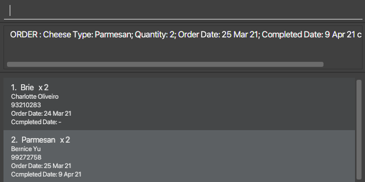

#### Deleting an order: `deleteorder`

Deletes a specific order from CHIM, identified by its index.

If the order is marked as complete and has cheeses assigned to it, those cheeses will be deleted by CHIM.

Format: `deleteorder ORDER_INDEX`
* The `ORDER_INDEX` provided must be a positive integer.
* The `ORDER_INDEX` refers to the index number of the order shown in `listorders`.

Example: `deleteorder 2`

Before:  

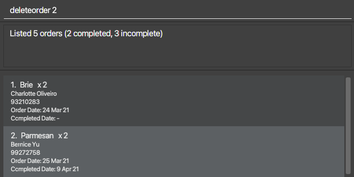

After:  

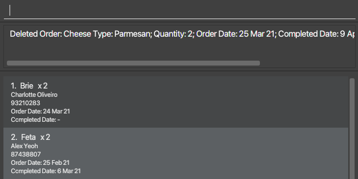

#### Finding orders: `findorder`

Searches for particular orders in CHIM.

Format: `findorder [t/CHEESE_TYPE_KEYWORDS…] [n/CUSTOMER_NAME_KEYWORDS…] [p/CUSTOMER_PHONE_KEYWORDS…] [s/COMPLETION_STATUS]`
* At least one of the optional fields must be provided to find an order.
* Search is case-insensitive, e.g. Brie will match brie.
* Assignment status parameter must be either `complete` or `incomplete`.
* Search will find an order which matches **all** of the given fields,
e.g. `findorder t/Brie s/incomplete` will find an order with cheese type Brie and is incomplete.

Examples:

* `findorder t/Brie Feta s/incomplete`

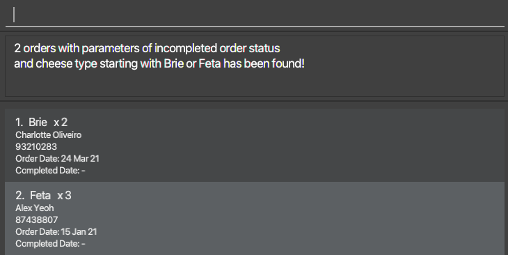

* `findorder n/bernice s/incomplete`

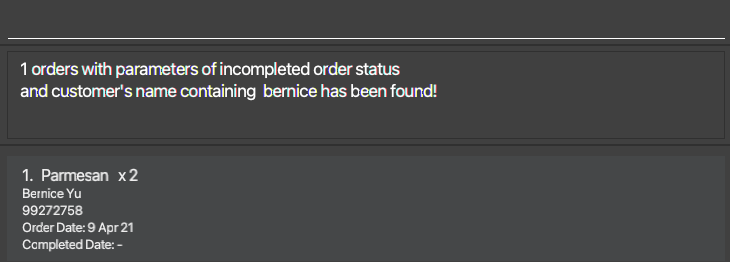
  
* `findorder p/93210283`

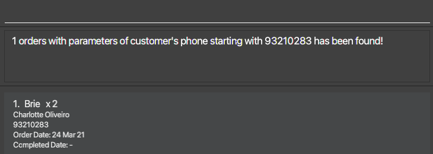

### Clearing all data in CHIM: `clear`

Clears all data in CHIM and save files.

Format: `clear`

Before:  

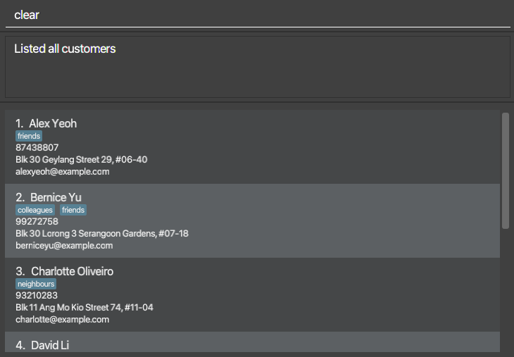

After:  

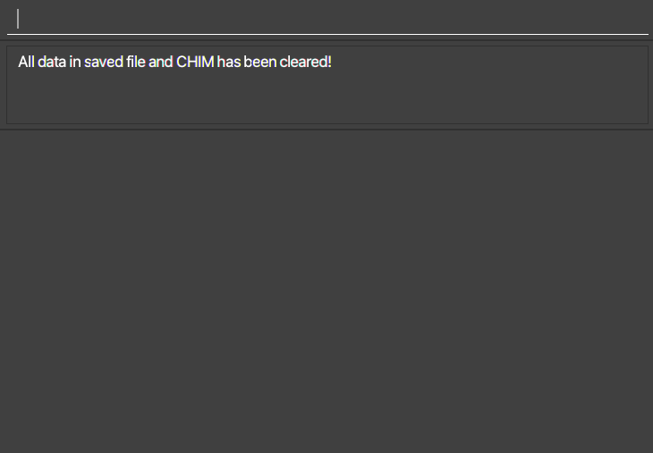

### Exiting the program: `exit`

Exits the program.

Format: `exit`

### Saving the data

CHIM data are saved in the hard disk automatically after any command that changes the data. There is no need to save manually.

### Editing the data file

CHIM data are saved as a JSON file `[JAR file location]/data/chim.json`. Advanced users are welcome to update data directly by editing that data file.

:exclamation: **Caution:**
If your changes to the data file makes its format invalid, CHIM will discard all data and start with an empty data file at the next run.

--------------------------------------------------------------------------------------------------------------------

## FAQ

**Q**: How do I transfer my data to another Computer? 
**A**: Install the app in the other computer and overwrite the empty data file it creates with the file that contains the data of your previous CHIM home folder.

**Q**: My result display turns white if the text is too long, how do I resolve it? 
**A**: You may scroll down to view the content of the text. If it still does not appear correctly, you may consider using a shorter string.

**Q**: Will my app work properly if it changes a timezone? 
**A**: The app may not work as intended if the timezone changes. For example, cheeses may be allowed to be created at a future date when the timezone changes.
       Hence, do ensure that the time on your computer running the application is consistent and does not change suddenly.

--------------------------------------------------------------------------------------------------------------------

## Command summary

Action | Format, Examples
--------|------------------
**List Customers** | `listcustomers`
**Add Customer** | `addcustomer n/CUSTOMER_NAME p/PHONE_NUMBER e/EMAIL a/ADDRESS [t/TAG…]`   e.g. `addcustomer n/John Doe p/61234567 e/johndoe@gmail.com a/Blk 436 Serangoon Gardens St 26 #01-01`
**Edit Customer** | `editcustomer INDEX [n/CUSTOMER_NAME] [p/PHONE_NUMBER] [e/EMAIL] [a/ADDRESS] [t/TAG]…`   e.g. `editcustomer 4 n/Jane Lim p/65558888`
**Delete Customer**| `deletecustomer p/PHONE_NUMBER`   e.g. `deletecustomer p/61234567`
**Find Customer** | `findcustomer [n/NAME_KEYWORDS…] [p/PHONE_KEYWORDS…] [e/EMAIL_KEYWORDS…] [a/ADDRESS_KEYWORDS…]`   e.g. `findcustomer n/char p/9321`
**List Cheeses** | `listcheeses`
**Add Cheese** | `addcheese t/CHEESE_TYPE q/QUANTITY [d/MANUFACTURE_DATE] [e/EXPIRY_DATE]`   e.g. `addcheese t/gouda q/1 d/2021-05-01 e/2025-12-31`
**Edit Cheese** | `editcheese INDEX [t/CHEESE_TYPE] [d/MANUFACTURE_DATE] [e/EXPIRY_DATE]`   e.g. `editcheese 1 t/Parmesan d/2021-03-12`
**Delete Cheese** | `deletecheese CHEESE_INDEX`   e.g. `deletecheese 5`
**Find Cheese** | `findcheese [t/CHEESE_TYPE_KEYWORDS…] [s/ASSIGNMENT_STATUS]`   e.g. `findcheese t/Brie Feta s/unassigned`
**List Orders** | `listorders`
**Add Order** | `addorder t/CHEESE_TYPE q/QUANTITY p/PHONE_NUMBER`   e.g. `addorder t/Parmesan q/2 p/61234567`
**Edit Order** | `editorder INDEX [t/CHEESE_TYPE] [q/QUANTITY] [p/PHONE_NUMBER] [d/ORDER_DATE]`   e.g. `editorder 2 t/Parmesan q/2 p/61234567`
**Mark Order As Done** | `done INDEX`   e.g. `done 2`
**Delete Order** | `deleteorder ORDER_INDEX`   e.g. `deleteorder 2`
**Find Order** | `findorder [t/CHEESE_TYPE_KEYWORDS…] [n/CUSTOMER_NAME_KEYWORDS…] [p/CUSTOMER_PHONE_KEYWORDS…] [s/COMPLETION_STATUS]`    e.g. `findorder t/gouda s/complete`
**Clear** | `clear`
**Exit** | `exit`
