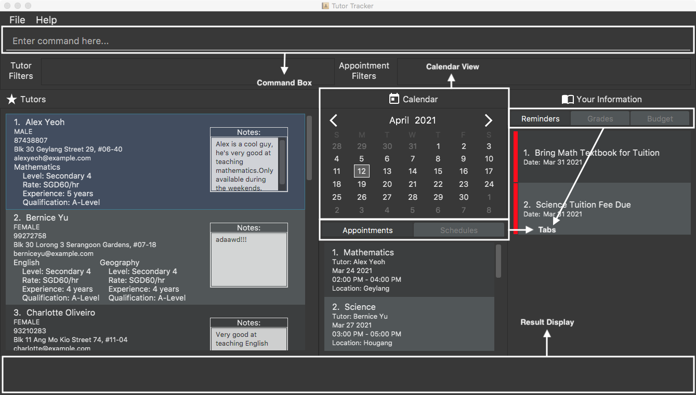
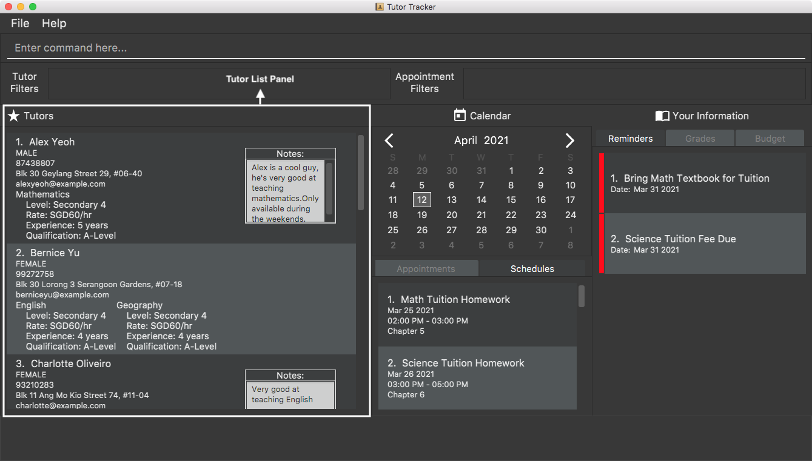
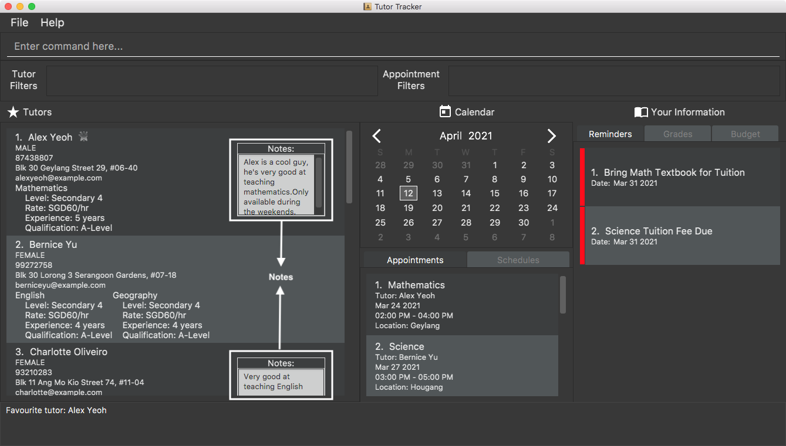
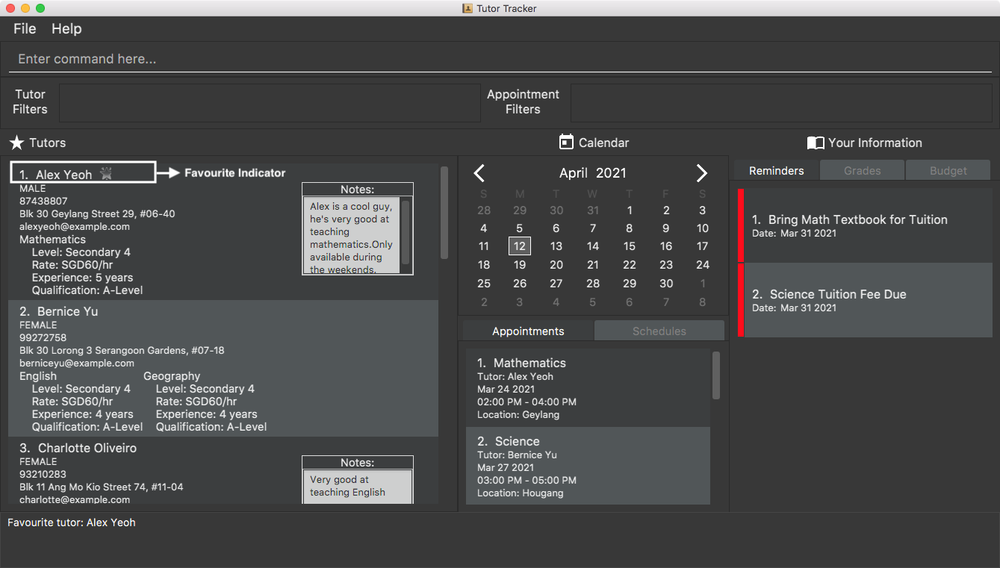
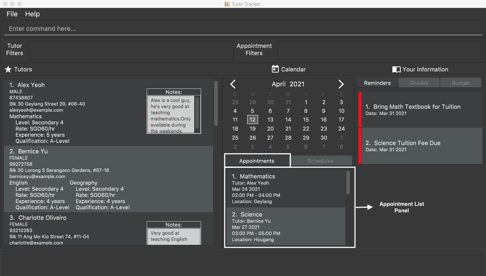
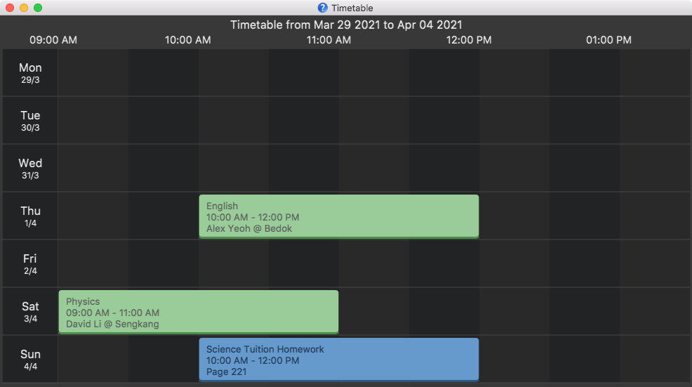
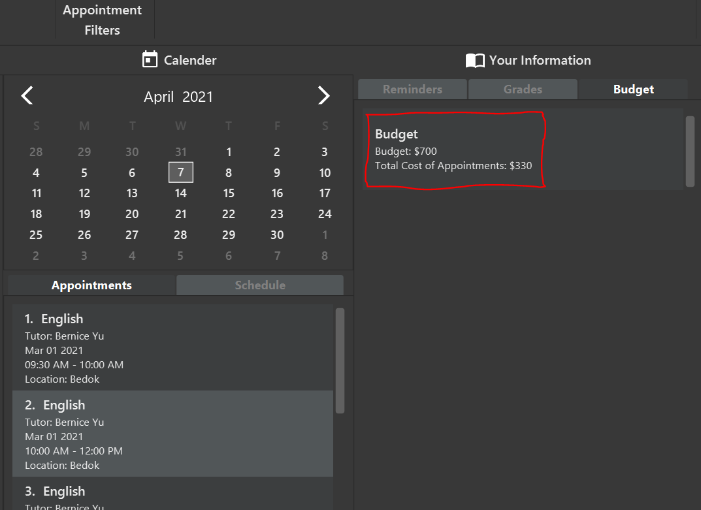
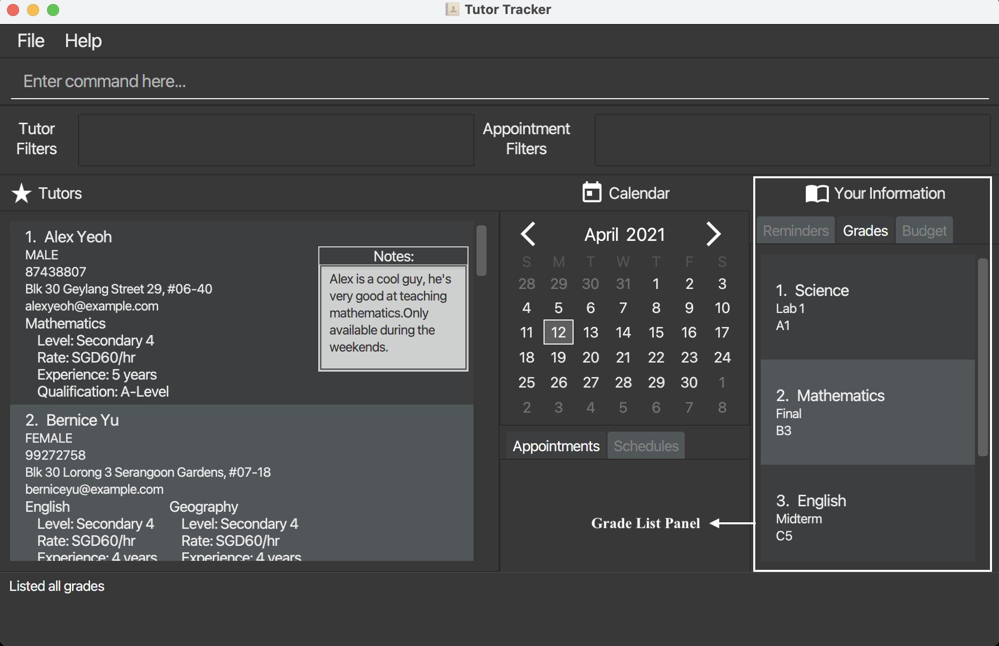
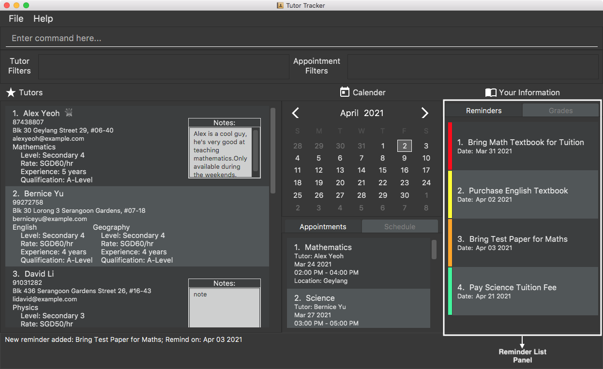
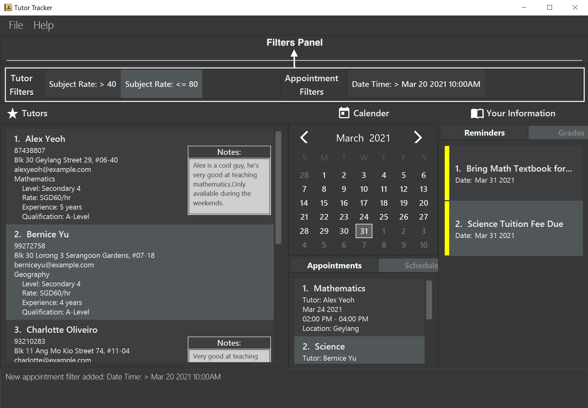

* Table of Contents
{:toc}

--------------------------------------------------------------------------------------------------------------------

## Introduction

_**Tutor Tracker**_ is a **desktop app designed to help secondary school students manage tutors and tuition appointments, optimised for use via a Command Line Interface** (CLI) for a fast and streamlined experience while still having the benefits of a Graphical User Interface (GUI). If you can type fast, Tutor Tracker can get your tuition contact management tasks done faster than traditional GUI apps.

## Quick Start

1. Ensure you have Java `11` or above installed in your Computer.

1. Download the latest `tutortracker.jar` from [here](https://github.com/AY2021S2-CS2103-T14-3/tp/releases).

1. Copy the file to the folder you want to use as the _home folder_ for your TutorTracker.

1. Double-click the file to start the app. The GUI similar to the below should appear in a few seconds. Note how the app contains some sample data.<br>
   

1. Type the command in the command box and press Enter to execute it. e.g. typing **`help`** and pressing Enter will open the help window.

1. Refer to the [Features](#features) below for details of each command.

--------------------------------------------------------------------------------------------------------------------

## Application Layout

The figure below shows the GUI of Tutor Tracker, annotated with a description of each GUI component.



## Features

This section contains all the information about features of TutorTracker. You may enter a command into the Command Box to use each feature or sub-feature.

<div markdown="block" class="alert alert-info">

**:information_source: Notes about the command format:**<br>

* Words in `UPPER_CASE` are the parameters to be supplied by the user.<br>
  e.g. in `add_tutor n/NAME`, `NAME` is a parameter which can be used as `add_tutor n/John Doe`.

* Items in square brackets are optional.<br>
  e.g `n/NAME [l/LOCATION]` can be used as `n/John Doe l/Clementi` or as `n/John Doe`.

* Items with `…`​ after them can be used multiple times including zero times.<br>
  e.g. `[l/LOCATION]…​` can be used as ` ` (i.e. 0 times), `l/Bedok`.

* Items that have date as a parameter must strictly follow `YYYY-MM-DD` format.<br> 
  e.g. `2021-03-01`and `2021-04-20`.

* Items that have time as parameter must strictly follow `HH:MM AM/PM` format.<br>
  e.g. `9:01 AM` and `10:30 PM`.

* Parameters can be in any order.<br>
  e.g. if the command specifies `n/NAME s/SUBJECT`, `s/SUBJECT n/NAME` is also acceptable.

* If a parameter is expected only once in the command but you specified it multiple times, only the last occurrence of the parameter will be taken.<br>
  e.g. if you specify `l/Bedok l/Clementi`, only `l/Clementi` will be taken.

* Extraneous parameters for commands that do not take in parameters (such as `help` and `exit`) will be ignored.<br>
  e.g. if the command specifies `help 123`, it will be interpreted as `help`.

* Parameters in angle brackets (`<`, `>`) must be supplied together as a group. eg. with `<s/SUBJECT_NAME r/RATE>`, both subject name and rate must be supplied.

</div>

### Tutor Book
This feature allows tutees to maintain and keep track of the list of tuition tutors.



**Attributes / Parameters**:
* Name
* Gender
* Phone Number
* Email
* Address
* Subjects (multiple allowed)
    * Subject Name
    * Subject Hourly Rate
    * Subject Education Level
    * Subject Years of Experience
    * Subject Qualifications
* Note

#### Add a new tutor: `add_tutor`

Add a new tutor and enter their basic details as well as an optional note.

Multiple subjects may be provided, and all subject attributes must be present when providing a subject.

Format:
`add_tutor n/NAME g/GENDER p/PHONE_NUMBER e/EMAIL  a/ADDRESS <s/SUBJECT_NAME r/SUBJECT_RATE l/SUBJECT_EDUCATION_LEVEL y/SUBJECT_YEARS_EXPERIENCE q/SUBJECT_QUALIFICATIONS>... notes/NOTE`

Example Input:
`add_tutor n/John Doe g/Male p/98765432 e/johnd@example.com a/John street, block 123, #01-01 s/English r/50 l/Secondary 3 y/5 q/A-Level s/Mathematics r/60 l/Secondary 4 y/6 q/A-Level notes/Patient`

#### List tutors: `list_tutors`

View a list of all tutors known. Will ignore all input(s) after `list_tutors`.

Example Output:
```
1. John Doe
98765432
John street, block 123, #01-01
johnd@example.com
Subjects:
English
    Level: Sec 3
    Rate: SGD60/hr
    Experience: 6 years
    Qualification: Bachelor of English Literature
    
2. Jane Doe 
98765433
Jane street, block 123, #01-01
janed@example.com
Subjects:
Maths
    Level: Sec 4
    Rate: SGD30/hr
    Experience: 5 years
    Qualification: Bachelor of Mechanical Engineering
```

#### Delete a tutor: `delete_tutor`

Delete the tutor at the specified index. Deletion cannot occur if there is at least one existing appointment booked with the tutor in question.

Format: `delete_tutor INDEX`

Example: `delete_tutor 1` deletes the first tutor.

#### Edit a tutor: `edit_tutor`

Edit a tutor's information by index. Only the attributes present can be changed in the tutor, including notes.

All subjects taught by the tutor will be overwritten by subjects provided to
this command. Furthermore, all subject attributes must be present when providing
a subject.

Format: `edit_tutor INDEX [n/NAME] [g/GENDER] [p/PHONE_NUMBER] [e/EMAIL] [a/ADDRESS] [<s/SUBJECT_NAME r/SUBJECT_RATE l/SUBJECT_EDUCATION_LEVEL y/SUBJECT_YEARS_EXPERIENCE q/SUBJECT_QUALIFICATIONS>]... notes/NOTES`

Example: `edit_tutor 1 p/99824314 s/English r/50 l/Secondary 5 y/9 q/A-Level notes/Impatient`

#### View tutor details: `view_tutor`

Views a tutor's personal information.

Format: `view_tutor INDEX`

Example: `view_tutor 1`

Example Output:<br>
```
1. John Doe
98765432
John street, block 123, #01-01
johnd@example.com
Subjects:
English
    Level: Sec 3
    Rate: SGD60/hr
    Experience: 6 years
    Qualification: Bachelor of English Literature
```

#### Notes
This feature allows tutees to track and manages notes that are tagged to a tutor.



##### Add note to a tutor: `add_note`

Shortcut for adding note to tutor at a particular index. One tutor can only have one note added.

Format: `add_note INDEX NOTE`

Example: `add_note 1 patient tutor` adds note of `patient tutor` to the first tutor displayed.

Example Output:
on the right of ,<br>
```
1. John Doe 
98765432
John street, block 123, #01-01
johnd@example.com
Subjects:
English
    Level: Sec 3                     
    Rate: SGD60/hr
    Experience: 6 years
    Qualification: Bachelor of English Literature
```
```
Notes:
patient tutor
```

##### Edit note of a tutor: `edit_note`

Shortcut for editing note to tutor at a particular index. The tutor must have a note in order to edit.

Format: `edit_note INDEX NOTE`

Example: `edit_note 1 not patient` edits existing note of tutor 1 to `not patient`

Example Output:
on the right of ,<br>
```
1. John Doe 
98765432
John street, block 123, #01-01
johnd@example.com
Subjects:
English
    Level: Sec 3                     
    Rate: SGD60/hr
    Experience: 6 years
    Qualification: Bachelor of English Literature
```

```
Notes:
not patient
```
##### Delete note of a tutor: `delete_note`

Deletes solely the note to tutor at a particular index that was added previously.

Format: `delete_note INDEX NOTE`

Example: `delete_note 1` deletes the existing note from the first tutor displayed.

##### List tutors with note `list_note`
Lists all the tutor with note. Will ignore all input after `list_note`.

Format:`list_note`

##### Export the tutor details: `export`
Export the tutor details of that index together with the notes and subject list into a text file in the directory you saved the 
TutorTracker jar under the export folder, with the tutor's name as file name. 

Format:`export INDEX`

Example: `export 1` If the jar is saved in C:\Users\user\Downloads, and first tutor name is Alex Yeoh,
text file Alex_Yeoh.txt will be saved under the export folder. Full path in this case would be C:\Users\user\Downloads\export\Alex_Yeoh.txt

#### Favourites
This feature allows users to track and manage their favourite tutors.



##### Favourite a tutor: `favourite`

Label a tutor as a favourite.

Format: `favourite INDEX`

Example: `favourite 1`

Example Output:<br>
```
1. John Doe *
98765432
John street, block 123, #01-01
johnd@example.com
Subjects:
English
    Level: Sec 3
    Rate: SGD60/hr
    Experience: 6 years
    Qualification: Bachelor of English Literature
```

##### Unfavourite a tutor: `unfavourite`

Removes favourite status of a particular tutor that had been previously added as a favourite by using the index.

Format: `unfavourite INDEX`

Example: `unfavourite 1` removes the first tutor as a favourite.

##### List favourites: `list_favourites`

View list of tutor(s) that had been added as favourite.

Format: `list_favourites`

Example: `list_favourites`

### Appointment Tracker
This feature allows tutees to manage and track their tuition appointments.



**Attributes / Parameters**:
* Name of the tutor
* Subject Name
* Appointment Date
* Time From
* Time To
* Location

<div markdown="block" class="alert alert-info">

**:information_source: Note:**<br>

* The date format `yyyy-mm-dd` must be strictly followed. e.g. `2021-3-1`and `2021-03-01`.
* The time format `hh:mm a` must be strictly followed. e.g. `9:01 am` and `10:30 pm`.
* `TIME_FROM` and `TIME_TO` must be a valid time range (`TIME_FROM` must be before `TIME_TO`).
* The earliest possible `TIME_FROM` is 06:00 AM and latest possible `TIME_TO` is 11:00 PM.
* The shortest possible appointment is **1 hour**, and the longest possible appointment is **8 hours**.
* The appointment timeslot must be in blocks of **30 minutes** or **1 hour**, i.e., 10:00 AM to 11:00 AM and 12:30 PM to 2:00 PM.
* No appointments can clash or overlap with existing appointments or schedules, i.e., same day, 10:00am - 11:00am and 10:30am - 12:00pm.

</div>


#### Add a new appointment: `add_appointment`

Adds an appointment with a specific tutor to the timetable.<br>

Format: `add_appointment n/NAME s/SUBJECT d/DATE fr/TIME_FROM to/TIME_TO l/LOCATION`

* The new appointment `DATE`, `TIME_FROM` and `TIME_TO` must be in the future.
* Refer to [Appointment Tracker Section](#appointment-tracker) for other date related constraints.

Examples:<br>
* `add_appointment n/David Li s/Mathematics d/2021-03-01 fr/10:00 AM to/12:00 PM l/Bedok`
* `add_appointment n/Alex Yeoh s/English d/2021-04-20 fr/2:00 PM to/4:00 PM l/Bedok`

#### List tuition appointments: `list_appointments`

Shows a list of all upcoming tuition appointments in the personal tuition appointment list. Appointments are automatically sorted by ascending order (oldest to newest).

Format: `list_appointments`

Result Display Example Output:
```
Listed all appointments (1 displayed)
```

Appointment List Example Output:
```
1. Mathematics
Tutor: Alex Yeoh
Mar 24 2021
02:00 PM - 04:00 PM
Location: Geylang

2. Science
Tutor: Bernice Yu
Mar 27 2021
03:00 PM - 05:00 PM
Location: Hougang
```

#### View tuition appointments: `view_appointment`

View the list of tuition appointment happening on a particular date.

Format:
`view_appointment DATE`

Example:
`view_appointment 2021-03-24`

Result Display Example Output:
```
Viewing appointment(s) on Mar 24 2021 (1 displayed)
```

Appointment List Example Output:
```
1. Mathematics
Tutor: Alex Yeoh
Mar 24 2021
02:00 PM - 04:00 PM
Location: Geylang
```

Alternatively, users can press the desired date on the calendar panel instead to achieve the same output.

#### Find tuition appointments: `find_appointment`

Find list of tuition appointments based on tutor's name.

Format:
`find_appointment NAME...`

Example:
`find_appointment Alex Yeoh`

Result Display Example Output:
```
1 appointments listed!
```

Appointment List Display Output:
```
1. Mathematics
Tutor: Alex Yeoh
Mar 24 2021
02:00 PM - 04:00 PM
Location: Geylang
```

#### Delete a tuition appointment: `delete_appointment`

Format: `delete_appointment INDEX`

Deletes the specific appointment at the specified INDEX.
The index refers to the index number shown in the displayed person list.
The index must be a positive integer e.g. `1, 2, 3, …​`

Example:
`delete_appointment 1`

Result Display Example Output:
```
Deleted Appointment: Appointment with Tutor (Alex Poon) from 
Mar 10 2021 05:00PM to Mar 10 2021 07:00PM
```

#### Editing a tuition appointment: `edit_appointment`

Edits an appointment with a specific index. Only the attributes present are changed in the appointment.

Format: `edit_appointment INDEX [n/NAME] [s/SUBJECT_NAME] [d/DATE] [fr/TIME_FROM] 
[to/TIME_TO] [l/LOCATION]`

* Past appointments cannot be edited. Please add a new appointment if there's a need to.
* If any one of the following fields (`DATE`, `TIME_FROM`, `TIME_TO`) are edited, then all three
  fields are required to be present together.
* The modified `DATE`, `TIME_FROM` and `TIME_TO` must be in the future.
* Refer to [Appointment Tracker Section](#appointment-tracker) for other date related constraints.
 
Example: `edit_appointment 1 s/English l/Clementi`

### Schedule Tracker
This feature allows tutees to track and manage their tuition-related schedules, i.e., allocating time to do their tuition homework.


**Attributes / Parameters**:
* Title
* Schedule Date
* Time From
* Time To
* Description

<div markdown="block" class="alert alert-info">

**:information_source: Note:**<br>

* The date format `yyyy-mm-dd` must be strictly followed. e.g. `2021-3-1`and `2021-03-01`.
* The time format `hh:mm a` must be strictly followed. e.g. `9:01 am` and `10:30 pm`.
* `TIME_FROM` and `TIME_TO` must be a valid time range (`TIME_FROM` must be before `TIME_TO`).
* The earliest possible `TIME_FROM` is 06:00 AM and latest possible `TIME_TO` is 11:00 PM.
* The shortest possible schedule is **1 hour**, and the longest possible schedule is **8 hours**.
* The schedule timeslot must be in blocks of **30 minutes** or **1 hour**, i.e., 10:00 AM to 11:00 AM and 12:30 PM to 2:00 PM.
* No schedules can clash or overlap with existing appointments or schedules, i.e., same day, 10:00am - 11:00am and 10:30am - 12:00pm.

</div>

#### Adding a schedule : `add_schedule`

Adds a schedule that is related to tuition.<br>

Format: `add_schedule t/TITLE d/DATE fr/TIME_FROM to/TIME_TO ds/DESCRIPTION`

* The new appointment `DATE`, `TIME_FROM` and `TIME_TO` must be in the future.
* Refer to [Schedule Tracker Section](#schedule-tracker) for other date related constraints.

Examples:<br>
* `add_schedule t/Maths Tuition Homework d/2021-6-2 fr/5:00pm to/7:00pm ds/Calculus Topic`
* `add_schedule t/Science Tuition Homework d/2021-6-31 fr/6:00pm to/7:00pm ds/Chapter 5 to 6`

Result Display Example Output:
```
New schedule added: Maths Tuition Homework from Jun 02 2021 05:00 PM to Jun 02 2021 07:00 PM
```
```
New schedule added: Science Tuition Homework from Jun 30 2021 06:00 PM to Jun 30 2021 07:00 PM
```

Schedule List Panel Example Output:
```
1. Maths Tuition Homework
Jun 02 2021
5:00 PM - 7:00 PM
Calculus Topic

2. Science Tuition Homework
Jun 30 2021
6:00 PM - 7:00 PM
Chapter 5 to 6
```

#### Listing all schedules : `list_schedules`

This feature shows a list of the tutees's personal schedule. Schedules are automatically sorted by ascending order (oldest to newest).

Format: `list_schedules`

Result Display Example Output:
```
Listed all schedule(s) (2 displayed)
```

Schedule List Panel Example Output:
```
1. Maths Tuition Homework
Jun 02 2021
5:00 PM - 7:00 PM
Calculus Topic

2. Science Tuition Homework
Jun 30 2021
6:00 PM - 7:00 PM
Chapter 5 to 6
```

#### View schedules: `view_schedule`

View the list of schedules happening on a particular date.

Format:
`view_schedule DATE`

Example:
`view_schedule 2021-6-2`

Result Display Example Output:
```
Viewing schedule(s) on Jun 02 2021 (1 displayed)
```

Schedule List Panel Example Output:
```
1. Maths Tuition Homework
Jun 02 2021
5:00 PM - 7:00 PM
Calculus Topic
```

Alternatively, users can press the desired date on the calendar panel instead to achieve the same output.

#### Delete a schedule: `delete_schedule`

Deletes the specific schedule at the specified INDEX.

Format: `delete_schedule INDEX`

* The index refers to the index number shown in the displayed schedule list. <br>
* The index must be a positive integer e.g. `1, 2, 3, …​`

Example:
`delete_schedule 1`

Referencing to the example output from `list_schedules`,

Result Display Example Output:
```
Deleted Schedule: Maths Tuition Homework from Jun 02 2021 05:00 PM to Jun 02 2021 07:00 PM
```

Schedule List Panel Example Output:
```
1. Science Tuition Homework
Jun 30 2021
6:00 PM - 7:00 PM
Chapter 5 to 6
```

#### Editing a schedule : `edit_schedule`

Edits a schedule with a specific index. Only the attributes present are changed in the schedule.

Format: `edit_schedule INDEX [t/TITLE] [d/DATE] [fr/TIME_FROM] [to/TIME_TO] [ds/DESCRIPTION]`

* Past schedules cannot be edited. Please add a new schedule if there's a need to.
* If any one of the following fields (`DATE`, `TIME_FROM`, `TIME_TO`) are edited, then all three
  fields are required to be present together.
* The modified `DATE`, `TIME_FROM` and `TIME_TO` must be in the future.
* Refer to [Schedule Tracker Section](#schedule-tracker) for other date related constraints.

Example: `edit_schedule 1 t/English Tuition Homework`

Result Display Example Output:
```
Edited Schedule: English Tuition Homework from Jun 02 2021 05:00 PM to Jun 02 2021 07:00 PM
```

Schedule List Panel Example Output:
```
1. English Tuition Homework
Jun 02 2021
5:00 PM - 7:00 PM
Calculus Topic

2. Science Tuition Homework
Jun 30 2021
6:00 PM - 7:00 PM
Chapter 5 to 6
```

### Event Tracker
Events represent a timetable, which comprises both `Appointment` and `Schedule`.
This feature allows tutee to track and view their timetable easily.



* Green slots represent `Appointment` and blue slots represent `Schedule`.

#### Opening timetable window : `timetable`

Launch a timetable graphical representation of the tutee's appointment and schedule.

Format: `timetable [DATE]`

<div markdown="block" class="alert alert-info">

**:information_source: Note:**<br>

* The date is an optional parameter. If there is no date entered, it will display the timetable of the current week. Otherwise, by typing `2021-3-28`, it will show the week's timetable that contains 28 March 2021.
* The date format `yyyy-mm-dd` must be strictly followed. e.g. `2021-3-1` or `2021-03-01`.
* Only one timetable can be opened at a time.

</div>

Result Display Example Output:
```
Opened timetable window.
```

#### View events: `view_event`

View all appointments and schedules that are happening on a particular date.

Format: `view_event DATE`

* The date format `yyyy-mm-dd` must be strictly followed. e.g. `2021-3-1` or `2021-03-01`.

Alternatively, users can press the desired date on the calendar panel instead to achieve the same output.

Example: `view_event 2021-6-2`

Result Display Example Output:
```
Viewing events on Jun 02 2021 (0 appointment(s) and 1 schedule(s) displayed)
```

### Budget Tracker
This feature allows tutees to track and manage his/her budget allocated to tuitions.



**Attributes / Parameters**:
* Budget Amount

#### Add a budget: `add_budget`

Adds a budget with an amount specified by user. Stores budget in user system.
Budget must not already exist in user system, otherwise use edit_budget instead.

* If no budget is present, the default budget value is 0.

Format: `add_budget b/BUDGET`

Example:
`add_budget b/500`

Result Display Example Output:
```
Budget of 500 is sucessfully added
```

* BUDGET must be a positive integer inclusive of zero

#### Edit a budget: `edit_budget`

Edits an already existing budget with an amount specified by user.

Format : `edit_budget b/BUDGET`

Example:
`edit_budget b/600`

Result Display Example Output:
```
Budget of 600 is sucessfully updated.
```

* BUDGET must be a positive integer inclusive of zero

#### Delete a budget: `delete_budget`

Deletes an already existing budget.

Format : `delete_budget`

Example:
`delete_budget`

Result Display Example Output:
```
Budget of 600 is sucessfully deleted.
```

#### View a budget: `view_budget`

Views an already existing budget.

Format : `view_budget`

Example:
`view_budget`

Result Display Example Output:
```
1) Budget does not already exist. Please ensure there is a budget. You can use the 
add_budget function to add a budget.

2) Here is your budget.
Budget: 600
Total Cost of Appointments: 100.
```

### Grade Book
This feature allows tutees to track and manage their grades obtained of different tests and different subjects.



**Attributes / Parameters**:
* Subject Name
* Graded Item
* Grade Letter

**:information_source: Note:**<br>
* Valid `GRADE_LETTER` must follow the Singapore-GCE O'Level grading system:
  ```  
  A1, A2, B3, B4, C5, C6, D7, E8, F9
  ```
* `SUBJECT_NAME` and `GRADED_ITEM` are case-insensitive. (e.g "s/English" is considered the same as "s/english")
* `GRADE_LETTER` must be in uppercase.
* Maximum number of characters for `SUBJECT_NAME` is limited to 20.
* Maximum number of characters for `GRADED_ITEM` is limited to 29.

#### Add a grade: `add_grade`

Adds a grade with a subject, a graded item and a grade alphabet specified by user. Stores in user system.

Format: `add_grade s/SUBJECT_NAME gi/GRADED_ITEM gr/GRADE_LETTER`

Example: `add_grade s/English gi/Final gr/A1`

Result Display Example Output:
```
New grade added: English (Final): A1
```

#### Edit a grade: `edit_grade`

Edits an already existing grade at the specified index. Only the attributes present are changed in the grade.

Format: `edit_grade INDEX [s/SUBJECT_NAME] [gi/GRADED_ITEM] [gr/GRADE_LETTER]`

* At least one optional field to edit must be provided.

Example: `edit_grade 1 gr/B3`

Result Display Example Output:
```
Edited Grade: Science (Lab 1): B3
```

#### Delete a grade: `delete_grade`

Deletes an already existing grade at the specified index.

Format: `delete_grade INDEX`

Example: `delete_grade 1`

Result Display Example Output:
```
Deleted Grade: Science (Lab 1): B3
```

#### List grades: `list_grades`

Views a list of all already existing grades in storage.

Format: `list_grades`

Example: `list_grades`

Result Display Example Output:
```
Listed all grades
```

### Reminder Tracker
This feature allows tutees to track and manage reminders daily. This is exceptionally helpful if the reminders are related to the tuition or the tutor itself, i.e. setting a reminder to pay a particular tutor's tuition fee.



* Red reminder card sidebar represent past reminders.
* Yellow reminder card sidebar represent ongoing reminders.
* Orange reminder card sidebar represent upcoming reminders (less or equal to 3 days).
* Green reminder card sidebar represent upcoming reminders.

**Attributes / Parameters**:
* Description
* Reminder Date

<div markdown="block" class="alert alert-info">

**:information_source: Note:**<br>

* The date format `yyyy-mm-dd` must be strictly followed. e.g. `2021-3-1`and `2021-03-01`.

</div>

#### Adding a reminder : `add_reminder`

Adds a reminder with description and reminder date specified by the user.<br>

Format: `add_reminder ds/DESCRIPTION d/REMINDER_DATE`

* The new reminder's `DATE` must be in the future.
* Refer to [Reminder Tracker Section](#reminder-tracker) for other date related constraints.

Examples:<br>
* `add_reminder ds/Science Tuition Payment Due d/2021-6-2`
* `add_reminder ds/Maths Tuition Payment Due d/2021-6-21`

Result Display Example Output:
```
New reminder added: Science Tuition Payment Due (Remind on: Jun 02 2021)
```
```
New reminder added: Maths Tuition Payment Due (Remind on: Jun 21 2021)
```

Reminder List Panel Example Output:
```
1. Science Tuition Payment Due
Date: Jun 02 2021

2. Maths Tuition Payment Due
Date: Jun 21 2021
```

#### Listing all reminders : `list_reminders`

Shows a list of all personal reminders. Reminders are automatically sorted by ascending order (oldest to newest).

Format: `list_reminders`

Result Display Example Output:
```
Listed all reminders
```

Reminder List Panel Example Output:
```
1. Science Tuition Payment Due
Date: Jun 02 2021

2. Maths Tuition Payment Due
Date: Jun 21 2021
```

#### Delete a reminder: `delete_reminder`

Deletes the specific reminder at the specified INDEX.

Format: `delete_reminder INDEX`

The index refers to the index number shown in the displayed reminder list. <br>
The index must be a positive integer e.g. `1, 2, 3, …​`

Example: `delete_reminder 1`

Referencing to the example output from `list_reminders`,

Result Display Example Output:
```
Deleted Reminder: Science Tuition Payment Due (Remind on: Jun 02 2021)
```

Reminder List Panel Example Output:
```
1. Maths Tuition Payment Due
Date: Apr 21 2021
```

#### Editing a reminder : `edit_reminder`

Edits a reminder with a specific index. Only the attributes present are changed in the reminder.

Format: `edit_reminder INDEX [ds/DESCRIPTION] [d/REMINDER_DATE]`

* Past reminders cannot be edited. Please add a new reminder if there's a need to do so.
* The modified `DATE` must be in the future.
* Refer to [Reminder Tracker Section](#reminder-tracker) for other date related constraints.

Example: `edit_reminder 1 ds/English Tuition Payment Due`

Result Display Example Output:
```
Edited Reminder: English Tuition Payment Due (Remind on: Jun 02 2021)
```

Reminder List Panel Example Output:
```
1. English Tuition Payment Due
Date: Jun 02 2021

2. Maths Tuition Payment Due
Date: Jun 21 2021
```

### Tutor and Appointment Filters 
This feature enhances the tutee's viewing experiences by allowing the tutees to filter tutors or appointments based on attributes.



#### Add a Tutor Filter: `add_tutor_filter`

Adds Tutor Filter(s) to the Tutor Filter list, filtering the tutors that are shown in the
tutor list. Note that tutor filters **are not persistent (are not saved)**. The following tutor
attributes and subject attributes in each tutor are filterable:

Inclusive Filters:
* Name
* Gender
* Phone Number
* Email
* Address
* Subject Name
* Subject Education Level
* Subject Qualifications

Exclusive Filters:
* Subject Hourly Rate
* Subject Years of Experience

Multiples of each attribute are allowed, with the composed filter following these rules:

1. Filters are case-insensitive.
2. An inclusive filter means that a tutor can match any of the filters within that attribute filter.
3. An exclusive filter means that a tutor must match all of the filters within that attribute filter.
4. Inclusive filters match as long as the tutor attirbute contains the filter. eg. The tutor `Peter` matches the filter `pete`.
5. Exclusive filters support the following inequalities: `>, <, >=, <=, =`.
6. Only tutors that match all the attribute filters are displayed.

Format: `add_tutor_filter [n/NAME]... [g/GENDER]... [p/PHONE_NUMBER]... [e/EMAIL]... [a/ADDRESS]... [s/SUBJECT_NAME]... [r/SUBJECT_RATE]... [l/SUBJECT_EDUCATION_LEVEL]... [y/SUBJECT_YEARS_EXPERIENCE]... [q/SUBJECT_QUALIFICATIONS]...`

Example: `add_tutor_filter r/>=40 r/<60 l/Secondary`

Example_Output: `New tutor filter added: Subject Level: secondary, Subject Rate: >= 40, Subject Rate: < 60`

#### Delete a Tutor Filter: `delete_tutor_filter`

Deletes Tutor Filter(s) from the Tutor Filter list, supporting the same attributes as `add_tutor_filter`.

Format: `delete_tutor_filter [n/NAME]... [g/GENDER]... [p/PHONE_NUMBER]... [e/EMAIL]... [a/ADDRESS]... [s/SUBJECT_NAME]... [r/SUBJECT_RATE]... [l/SUBJECT_EDUCATION_LEVEL]... [y/SUBJECT_YEARS_EXPERIENCE]... [q/SUBJECT_QUALIFICATIONS]...`

Example: `delete_tutor_filter r/<60 l/Secondary`

Example_Output: `Tutor filters deleted: Subject Level: secondary, Subject Rate: < 60`

#### Add an Appointment Filter: `add_appointment_filter`

Adds Appointment Filter(s) to the Appointment Filter list, filtering the appointments that are shown
in the appointment list. Note that appointment filters **are not persistent (are not saved)**. The
following appointment attributes are filterable:

Inclusive Filters:
* Name
* Subject Name
* Location

Exclusive Filters:
* From Date Time
* To Date Time

Multiples of each attribute are allowed, with the composed filter following these rules:

1. Filters are case-insensitive.
2. An inclusive filter means that an appointment can match any of the filters within that attribute filter.
3. An exclusive filter means that an appointment must match all of the filters within that attribute filter.
4. Inclusive filters match as long as the appointment attirbute contains the filter. eg. The appointment with tutor name `Peter` matches the filter `pete`.
5. Exclusive filters support the following inequalities: `>, <, >=, <=, =`.
6. The date time format `YYYY-MM-DD HH:MM AM/PM` must be strictly followed. e.g. `2021-03-25 10:00 AM`.
7. Only appointments that match all the attribute filters are displayed.

Format: `add_appointment_filter [n/NAME]... [s/SUBJECT_NAME]... [fr/FROM_DATE_TIME]... [to/TO_DATE_TIME]... [l/LOCATION]...`

Example: `add_appointment_filter to/>2021-03-25 10:00 AM`

Example_Output: `New appointment filter added: Date Time: > Mar 25 2021 10:00AM`

#### Delete an Appointment Filter: `delete_appointment_filter`

Deletes Appointment Filter(s) from the Appointment Filter list, supporting the same attributes as `add_appointment_filter`.

Format: `delete_appointment_filter [n/NAME]... [s/SUBJECT_NAME]... [fr/FROM_DATE_TIME]... [to/TO_DATE_TIME]... [l/LOCATION]...`

Example: `delete_appointment_filter to/>2021-03-25 10:00 AM`

Example_Output: `Appointment filters deleted: Date Time: > Mar 25 2021 10:00AM`

### Exit App: `exit`

Closes the app.

--------------------------------------------------------------------------------------------------------------------

## FAQ

**Q**: How do I transfer my data to another Computer?<br>
**A**: Install the app in the other computer and overwrite the empty data file it creates with the file that contains the data of your previous Tutor Tracker home folder.

--------------------------------------------------------------------------------------------------------------------

## Command Summary

Action | Format | Examples
--------|--------|----------
**Add a new tutor** | `add_tutor n/NAME g/GENDER p/PHONE_NUMBER e/EMAIL  a/ADDRESS <s/SUBJECT_NAME r/SUBJECT_RATE l/SUBJECT_EDUCATION_LEVEL y/SUBJECT_YEARS_EXPERIENCE q/SUBJECT_QUALIFICATIONS>... notes/NOTE` | `add_tutor n/John Doe g/Male p/98765432 e/johnd@example.com a/John street, block 123, #01-01 s/English r/50 l/Secondary 3 y/5 q/A-Level s/Mathematics r/60 l/Secondary 4 y/6 q/A-Level notes/Patient`
**List tutors** | `list_tutors` | `list_tutors`
**Delete a tutor** | `delete_tutor INDEX` | `delete_tutor 1`
**Edit a tutor** | `edit_tutor INDEX [n/NAME] [g/GENDER] [p/PHONE_NUMBER] [e/EMAIL] [a/ADDRESS] [<s/SUBJECT_NAME r/SUBJECT_RATE l/SUBJECT_EDUCATION_LEVEL y/SUBJECT_YEARS_EXPERIENCE q/SUBJECT_QUALIFICATIONS>]... notes/NOTES` | `edit_tutor 1 p/99824314 s/English r/50 l/Secondary 5 y/9 q/A-Level notes/Impatient`
**View tutor details** | `view_tutor INDEX` | `view_tutor 1`
**Add note to a tutor** | `add_note INDEX NOTE` | `add_note 1 patient tutor`
**Edit note of a tutor** | `edit_note INDEX NOTE` | `edit_note 1 not patient`
**Delete note of a tutor** | `delete_note INDEX` | `delete_note 1`
**List tutors with note** | `list_note` | `list_note`
**Export the tutor details**| `export INDEX` | `export 1`
**Favourite a tutor** | `favourite INDEX`, | `favourite 1`
**Unfavourite a tutor** | `unfavourite INDEX` | `unfavourite 1`
**List favourites** | `list_favourites` | `list_favourites`
**Add a new tuition appointment** | `add_appointment n/NAME s/SUBJECT d/DATE fr/TIME_FROM to/TIME_TO l/LOCATION` | `add_appointment n/David Li s/Mathematics d/2021-03-01 fr/10:00 AM to/12:00 PM l/Bedok`
**List tuition appointments** | `list_appointments` | `list_appointments`
**View tuition appointments** | `view_appointment DATE` | `view_appointment 2021-03-24`
**Find tuition appointments** | `find_appointment NAME...` | `find_appointment Alex Yeoh`
**Delete a tuition appointment** | `delete_appointment INDEX` | `delete_appointment 1`
**Edit a tuition appointment** | `edit_appointment INDEX [n/NAME] [s/SUBJECT_NAME] [d/DATE] [fr/TIME_FROM] [to/TIME_TO] [l/LOCATION]` | `edit_appointment 1 s/English l/Clementi`
**Add a new schedule** | `add_schedule t/TITLE d/DATE fr/TIME_FROM to/TIME_TO ds/DESCRIPTION` | `add_schedule n/Science Tuition Homework d/2021-03-31 fr/6:00pm to/7:00pm ds/Chapter 5 to 6`
**List schedules** | `list_schedules` | `list_schedules`
**View schedules** | `view_schedule DATE` | `view_schedule 2021-03-24`
**Delete a schedule** | `delete_schedule INDEX` | `delete_schedule 1`
**Edit a schedule** | `edit_schedule INDEX [t/TITLE] [d/DATE] [fr/TIME_FROM] [to/TIME_TO] [ds/DESCRIPTION]` | `edit_schedule 1 t/Science Tuition Homework`
**View timetable** | `timetable [DATE]` | `timetable 2021-03-28`
**View events** | `view_event DATE` | `view_event 2021-03-24`
**Add a budget** | `add_budget b/BUDGET` |`add_budget b/500`
**Edit a budget** | `edit_budget b/BUDGET` | `edit_budget b/600`
**Delete a budget** | `delete_budget` | `delete_budget`
**View a budget** | `view_budget` | `view_budget`
**Add a grade** | `add_grade s/SUBJECT_NAME gi/GRADED_ITEM gr/GRADE_LETTER`, | `add_grade s/English gi/Final gr/A` 
**Edit a grade** | `edit_grade INDEX [s/SUBJECT_NAME] [gi/GRADED_ITEM] [gr/GRADE_LETTER]`, | `edit_grade 1 gr/B`
**Delete a grade** | `delete_grade INDEX`, | `delete_grade 1`
**List grades** | `list_grades` | `list_grades`
**Add a new reminder** | `add_reminder ds/DESCRIPTION d/REMINDER_DATE` | `add_reminder ds/Science Tuition Payment Due d/2021-4-2`
**List reminders** | `list_reminders` | `list_reminders`
**Delete a reminder** | `delete_reminder INDEX` | `delete_reminder 1`
**Edit a reminder** | `edit_reminder INDEX [ds/DESCRIPTION] [d/REMINDER_DATE]` | `edit_reminder 1 ds/Science Tuition Payment Due`
**Add a Tutor Filter** | `add_tutor_filter [n/NAME]... [g/GENDER]... [p/PHONE_NUMBER]... [e/EMAIL]... [a/ADDRESS]... [s/SUBJECT_NAME]... [r/SUBJECT_RATE]... [l/SUBJECT_EDUCATION_LEVEL]... [y/SUBJECT_YEARS_EXPERIENCE]... [q/SUBJECT_QUALIFICATIONS]...` | `add_tutor_filter r/>=40 r/<60 l/Secondary`
**Delete a Tutor Filter** | `delete_tutor_filter [n/NAME]... [g/GENDER]... [p/PHONE_NUMBER]... [e/EMAIL]... [a/ADDRESS]... [s/SUBJECT_NAME]... [r/SUBJECT_RATE]... [l/SUBJECT_EDUCATION_LEVEL]... [y/SUBJECT_YEARS_EXPERIENCE]... [q/SUBJECT_QUALIFICATIONS]...` | `delete_tutor_filter r/<60 l/Secondary`
**Add an Appointment Filter** | `add_appointment_filter [n/NAME]... [s/SUBJECT_NAME]... [fr/FROM_DATE_TIME]... [to/TO_DATE_TIME]... [l/LOCATION]...` | `add_appointment_filter to/>2021-03-25 10:00 AM`
**Delete an Appointment Filter** | `delete_appointment_filter [n/NAME]... [s/SUBJECT_NAME]... [fr/FROM_DATE_TIME]... [to/TO_DATE_TIME]... [l/LOCATION]...` | `delete_appointment_filter to/>2021-03-25 10:00 AM`
**Exit App** | `exit` | `exit`
