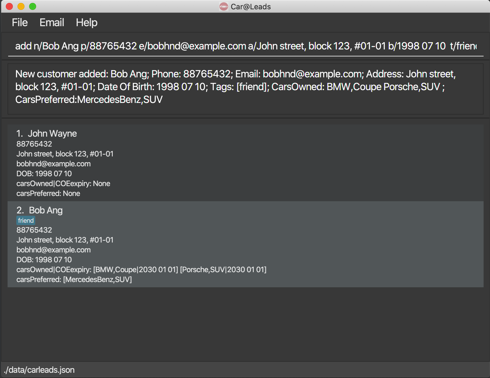
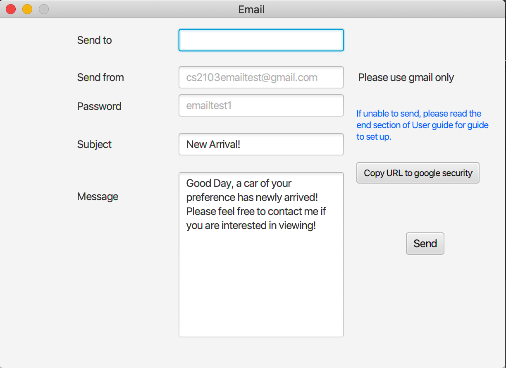
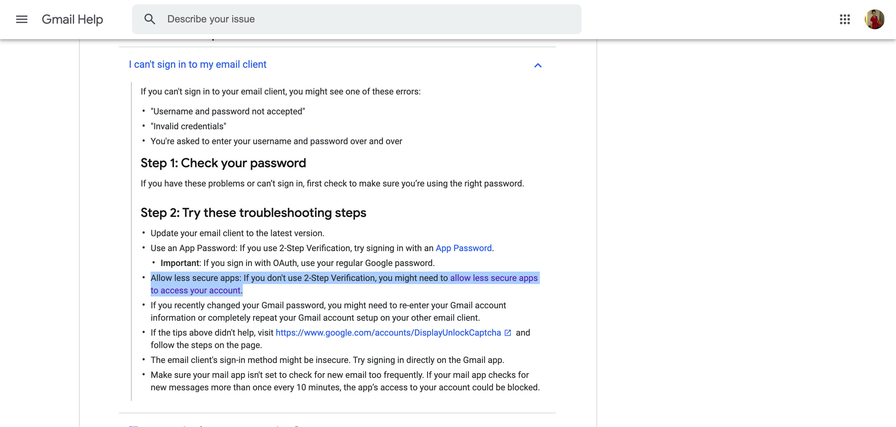
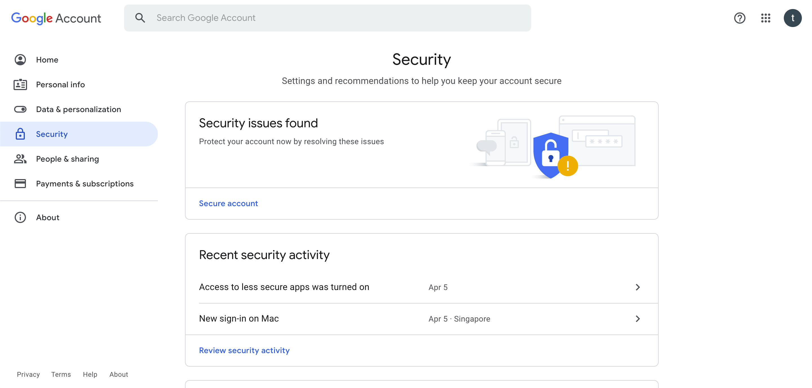
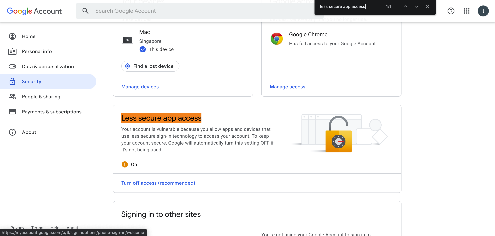
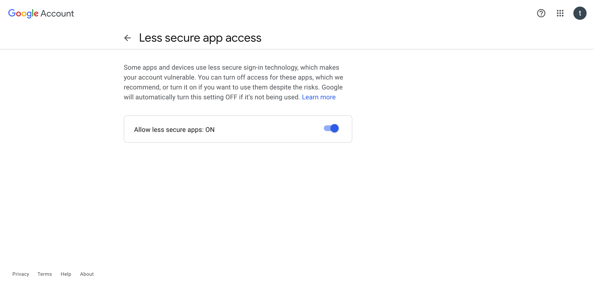
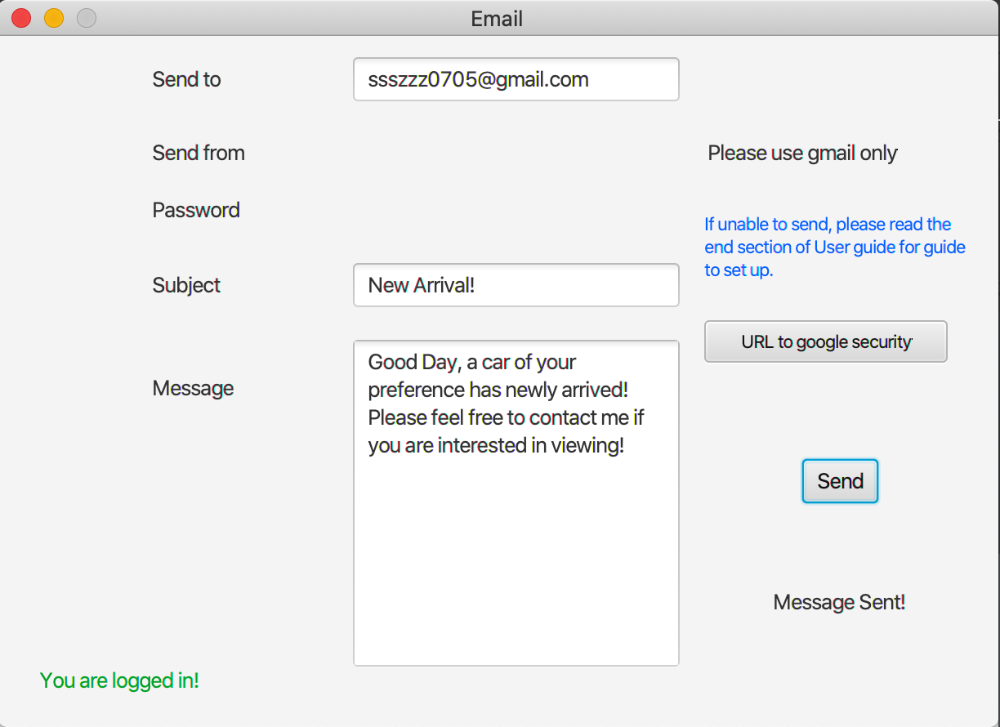
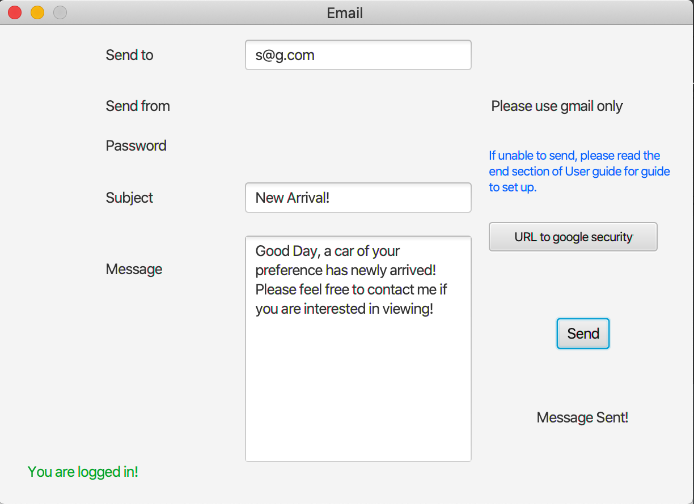
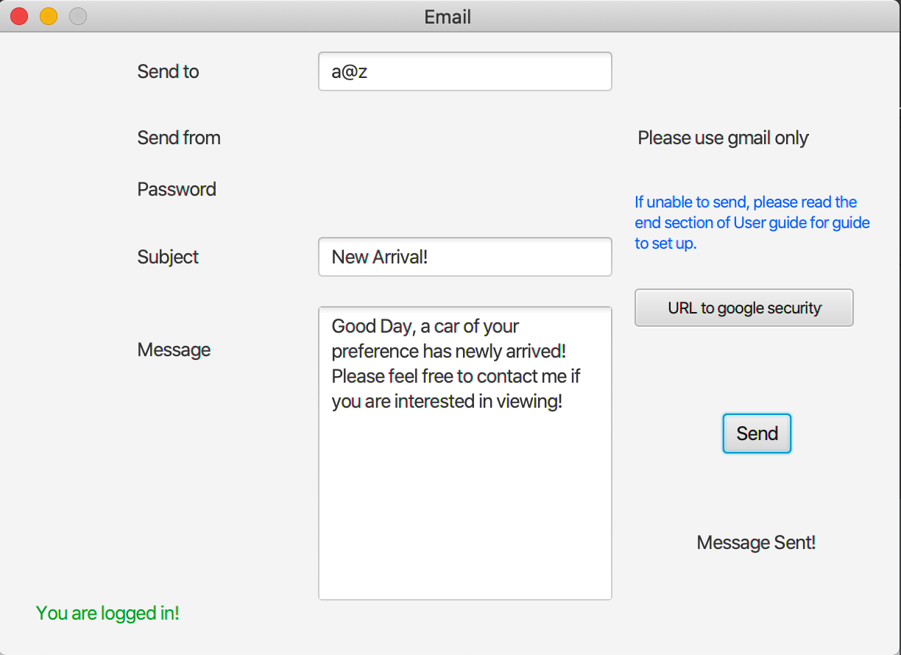
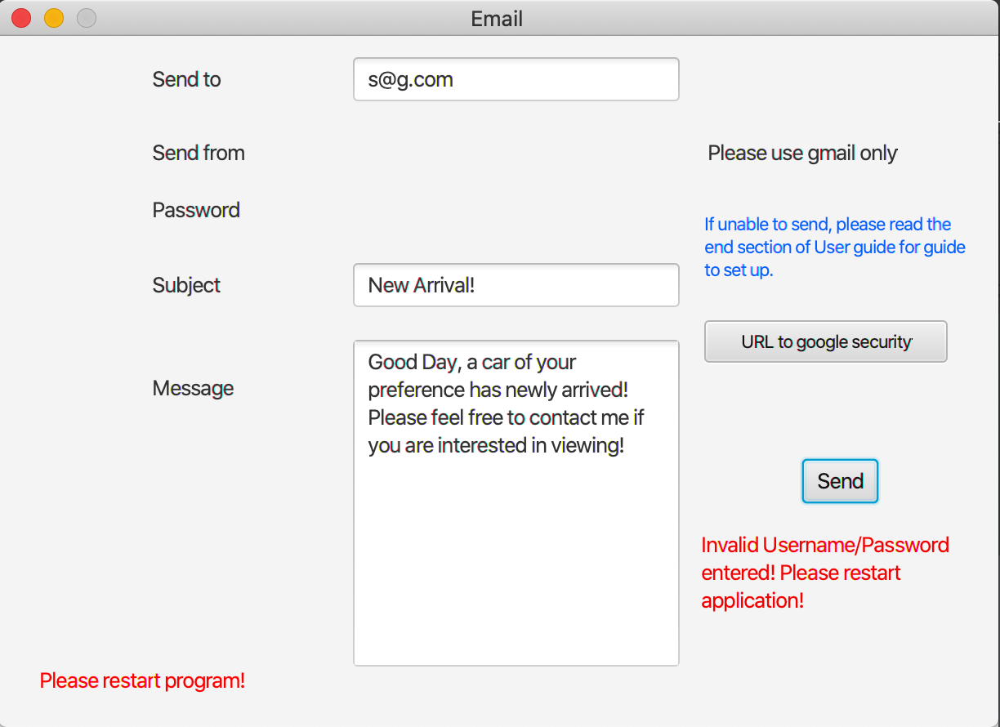

# Welcome to Car@leads
Car@leads is a **desktop app for a car salesperson to manage customer contacts** (CLI).
  Users can add new customer contacts which include details such as customer's car brand and car type preferences along with other personal information.
  Users can filter through the customer data using specific filters, such as filtering out customers who prefer a specific car brand and follow up with them for sales opportunities.
  Car@leads is optimized for use via a Command Line Interface, while still having the benefits of a Graphical User Interface (GUI).
  If you can type fast, Car@leads can get your contact management tasks done faster than traditional GUI apps.

* Table of Contents
{:toc}

--------------------------------------------------------------------------------------------------------------------

## Quick start

1. Ensure you have Java `11` or above installed in your Computer.
1. Double-click the file to start the app. The GUI similar to the below should appear in a few seconds.
    Note how the app contains some sample data to provide a example of how app usage.
    Remember to clear these sample data using the clear command before use.  
   
1. Type the command in the command box and press Enter to execute it. e.g. typing **`help`** and pressing Enter will open the help window. 
   Some example commands you can try:

    * `add n/Bob Ang p/88765432 e/bobhnd@example.com a/John street, block 123, #01-01 b/1998 07 10  
      c/BMW+Coupe|2030 01 01 c/Porsche+SUV|2030 01 01 cp/MercedesBenz+SUV`
      : Adds a contact named `Bob Ang`

    * `find n/Bob Ang cp/BMW+Coupe`
      : Finds a contact named `Bob Ang` whose preferred car is a BMW Coupe.

    * `delete John Doe` : Deletes 'John Doe' contact from contact list .

    * **`list`** : Lists all contacts.

    * **`clear`** : Deletes all contacts.

    * **`exit`** : Exits the app.

    * **`help`** : Opens the help window.
    
    * **`email`**: Opens the email interface.

1. Refer to the [Features](#features) below for details of each command.

--------------------------------------------------------------------------------------------------------------------

## Features

**:information_source: Notes about the command format:** 

* Words in `UPPER_CASE` are the parameters to be supplied by the user. 
  e.g. in `add n/NAME`, `NAME` is a parameter which can be used as `add n/John Doe`.

* Items in square brackets are optional. 
  e.g `n/NAME [t/TAG]` can be used as `n/John Doe t/friend` or as `n/John Doe`.

* Items with `…`​ after them can be used multiple times including zero times. 
  e.g. `[t/TAG]…​` can be used as ` ` (i.e. 0 times), `t/friend`, `t/friend t/family` etc.

* Parameters can be in any order. 
  e.g. if the command specifies `n/NAME p/PHONE_NUMBER`, `p/PHONE_NUMBER n/NAME` is also acceptable.

* If a parameter is expected only once in the command but you specified it multiple times, only the last occurrence of the parameter will be taken. 
  e.g. if you specify `p/12341234 p/56785678`, only `p/56785678` will be taken.

* Extraneous parameters for commands that do not take in parameters (such as `help`, `list`, `exit` and `clear`) will be ignored. 
  e.g. if the command specifies `help 123`, it will be interpreted as `help`.

* `COE_EXPIRY_DATE` input order: YYYY{space}MM{space}DD
  * Example: `2013 12 31`
  * This is the same input format as `DATE_OF_BIRTH`
* `|` joins car with COE expiry date
* `+` joins car brand and car type

## Command summary

**Note** : (pipe_char) means `|` below.  

Action | Format, Examples
--------|------------------
**add** | `add n/NAME p/PHONE_NUMBER e/EMAIL a/ADDRESS b/DATE_OF_BIRTH [t/TAG] [c/CAR_BRAND_OWNED+CAR_TYPE_OWNED (pipe_char) COE_EXPIRY_DATE] [cp/CAR_BRAND_PREFERRED+CAR_TYPE_PREFERRED]`   e.g., `add n/Bob Ang p/88765432 e/bobhnd@example.com a/John street, block 123, #01-01 b/1998 07 10  c/BMW+Coupe(pipe_char)2030 01 01 c/Porsche+SUV(pipe_char)2030 01 01 cp/MercedesBenz+SUV`
**find** | `find [e/bob /and p/98761234] /or b/1999 10 11`
**delete** | `delete NAME`  e.g., `delete John doe`
**list** | `list` Generates a default list of unfiltered contacts saved in the contact book.
**clear** | `clear` Clears the contact list, erasing all saved data.
**exit** | `exit` Exits the app. Ignores all texts type after 'exit' e.g. exit 12345.
**help** | `help` Opens the help window. Ignores all texts type after 'help' e.g. help 12345.
**email** | `email` Opens the email interface. Ignores all texts type after 'email' e.g. email 12345.
**up** | `/up{X}`, meaning any command starting with `/up`. Eg: `/up delete John Doe`

Prefix | Format
--------|------------------
**n/** | `n/NAME`
**p/** | `p/PHONE_NUMBER`
**e/** | `e/EMAIL`
**a/** | `a/ADDRESS`
**b/** | `b/DATE_OF_BIRTH` 
**t/** | `t/TAG`
**c/** | `c/CAR_BRAND_OWNED+CAR_TYPE_OWNED (pipe_char) COE_EXPIRY_DATE`
**cp/** | `cp/CAR_BRAND_PREFERRED+CAR_TYPE_PREFERRED`
**ex/** | `ex/COE_EXPIRY_DATE`
**/and** | `n/NAME /and a/ADDRESS`
**/or** | `n/NAME /or a/ADDRESS`
**/not** | `/not n/NAME`
**+** | `CAR_BRAND_PREFERRED+CAR_TYPE_PREFERRED` `CAR_BRAND_OWNED+CAR_TYPE_OWNED`   Joins car brand and car type
**(pipe_char)** | `c/CAR_BRAND_OWNED+CAR_TYPE_OWNED(pipe_char)COE_EXPIRY_DATE`   joins car with COE expiry date

### Adding a customer: `add`

Adds a customer to the contact list.

Format: `add n/NAME p/PHONE_NUMBER e/EMAIL a/ADDRESS b/DATE_OF_BIRTH [t/TAG]…​ [c/CAR_BRAND_OWNED+CAR_TYPE_OWNED|COE_EXPIRY_DATE] [cp/CAR_BRAND_PREFERRED+CAR_TYPE_PREFERRED]`

:bulb: **Tip:**
A customer can have any number of tags, carsOwned, carPreferred (including 0)

Examples:
* `add n/John Wayne p/88765432 e/bobhnd@example.com a/John street, block 123, #01-01 b/1998 07 10`
* `add n/Bob Ang p/88765432 e/bobhnd@example.com a/John street, block 123, #01-01 b/1998 07 10  t/friend c/BMW+Coupe|2030 01 01 c/Porsche+SUV|2030 01 01 cp/MercedesBenz+SUV` 

### Finding a customer: `find` 

Find customers from the contact list that matches specified filters.

Format: `find  [n/NAME] [p/PHONE_NUMBER] [e/EMAIL a/ADDRESS] [c/OWNED_CARBRAND+OWNED_CARTYPE] [coe/COE_EXPIRY_DATE] [t/TAGs] 
[cp/PREFERRED_CARBRAND+PREFERRED_CARTYPE] [b/DATE_OF_BIRTH]` 

**IMP** : All arguments are optional. In particular:
- for `c/OWNED_CARBRAND+OWNED_CARTYPE`, user can either give brand or type information, or both using the `+`sign to 
  separate.
- for `p/PHONE` any phone number containing the given parameter string will be returned. 
  - `98776` will be matched with both `77` and `786` for example.
- for `cp/PREFERRED_CARBRAND+PREFERRED_CARTYPE` user can either give brand or type information, or both using the 
  `+` sign to separate.
  
- for `n/NAME` giving a partial name is also okay - all names which have the given parameter as a subsequence (Note 
  that `abc` is a subsequence of `addbddc`) will be matched. Note that this is the only field for which we match 
  a subsequence instead of a simple substring.
  
- for `e/EMAIL`, all email containing the given parameter will be valid.
    - eg `find e/abc` will return profiles with the following emails:
        -  `abcd@gmail.com`
        -  `bbabc@gmail.com`

- for `ex/COE_EXPIRY_DATE`, using `ex/exp` will search for all customers with an expired COE on any of the cars they 
  own.
  it is a special case alias for the search `ex/0`, where `ex/NON_NEGATIVE_NUMBER` will search for any customers with
  at least one car that will expire in `NON_NEGATIVE_NUMBER` years *or less*.
  
- for `a/ADDRESS` partial addresses are also acceptable

- for `b/DATE_OF_BIRTH` partial dates also work. Note that `find b/1999` is a more generic search than `find b/1999 
  02` and hence will return more items.
  
- for `t/TAGS` all customers satisfying _any_ tag will be returned. In particular, `find t/TAG_A TAG_B TAG_C` is a more 
  generic 
  query than `find t/TAG_A` 
  

**COMBINING FIND PARAMETERS**

We can combine in the following way : 
-   `find a/orchard /and n/John /and /not t/CRIMINAL`
-   `find a/orchard /and n/John /and [ t/RICH /or /not t/CRIMINAL ]`

Note that for `find A /and B /or C /or D /and E` , the implicit bracketing considered is `find A /and [B /or [C /or [D 
/and E]]]`
Further, the bracketing order is not dependent on `/and` or `/or` -- we treat them as the same.

## Deleting a customer : `delete`

Deletes the specified customer from the contact list.

Format: `delete name`

* Deletes the customer with the specified `name`.
* The name refers to the customer name shown in the displayed customer contact list.
* The name **must be valid** does not contain special characters  …​

## Listing all customers : `list`

Shows a list of all customers in the system

Format: `list`

## Clear all customers : `clear`
* **`clear`** : Deletes all customers in the system.

## Repeat last Command : `/up`
* **`/up{X}`** : Loads in the previous command. `{X}` can be any string of characters, usually the previous command.
* Examples: 
    - `/updelete John Doe`
    - `/up/up`
    - `/upfind n/K`
    - `/upfghsdgdsfg`
        - All of the above examples have the same effect.
        - Importantly note that `/up` and `/up/up` are the same, we do not go back twice.

:bulb: **Tip:**
There does not need to be a space after /up, so long as it is the first part of the 'command'

eg: The command Box is as follows

    - find e/Apple
    - find e/AppleChain
    - /up
    - /up
Result:  
    - `find e/Apple`

## Exiting app: `exit`
* **`exit`** : Exits the app safely.

## Quick help: `help`
* **`help`** : Overview of commands and input syntax.

## Email Contact person: `email`
* **`email`** : Opens a simplified mailbox interface as shown below, enabling user to send email through Simple Mail Transfer Protocol(SMTP).
  Please ensure that you enable google to allow for less secure access - this is the term by google, which means an action
  to disable 2-step verification for logging in.
  You may use the following dummy email provided for testing:
  **username**: cs2103emailtest@gmail.com  
  **password**: emailtest1  
  
  
  Note: This feature only allows for out going SMTP server access, the application do not have access to your incoming mails
  as it is on a different server.
  
  
  
  If you face any difficulty enabling access, please follow through below guide, or check out the help window for steps
  in setting up.
  1. Go to google security(URL: https://myaccount.google.com/security)
  
  2. Scroll down or use the search function and type in 'Less secure app access' without quotation marks.
  
  3. Turn on the feature and this grants application access to only the Mail sending server. This feature disables the 
  feature for 2-Step Authentication. 
    
     
  After set up:
  You will be required to fill in the respective fields, please note that current version does not support multiple 
  authentication attempts, hence you will be required to restart the application if your email or password details are
  filled incorrectly.
  
  
  
  **Successful Login**  
  You will receive a confirmation message 'Message Sent' when email is successfully sent out. 
  Please note that in this we have blocked multiple log in and authentication, the email and password box will be disabled 
  after successful authentication. If you have been successfully authenticated, a green text will be shown in the bottom 
  left corner of the interface 'You are logged in'.
  You may continue to send email to other receiver addresses without having to re-enter the password.
  
  
 
  Please note that if you input a non-existing receiver email, message will still mark as sent. You will however receive a 
  sending fail message at your gmail inbox, but since this application does not have access to this information, we
  are unable to check validity of email.
  

  Please note that this version does not support identification of invalid domain name, but only absence of domain. Hence
  your email will still be mark as sent. However you will be receiving a failed message in your email inbox.
  

  **Failed Login**  

  If you have failed the authentication, either due to mismatching email and password, you will be required to restart
  the application, as support for multiple logins are blocked. The password you entered will be cleared, together with the 
  email and password fields removed. You will see a red text appearing at the bottom left of the interface 'Please restart
  the program'.
  
  
  For more info : https://support.google.com/mail/answer/7126229?hl=en&authuser=6
--------------------------------------------------------------------------------------------------------------------
