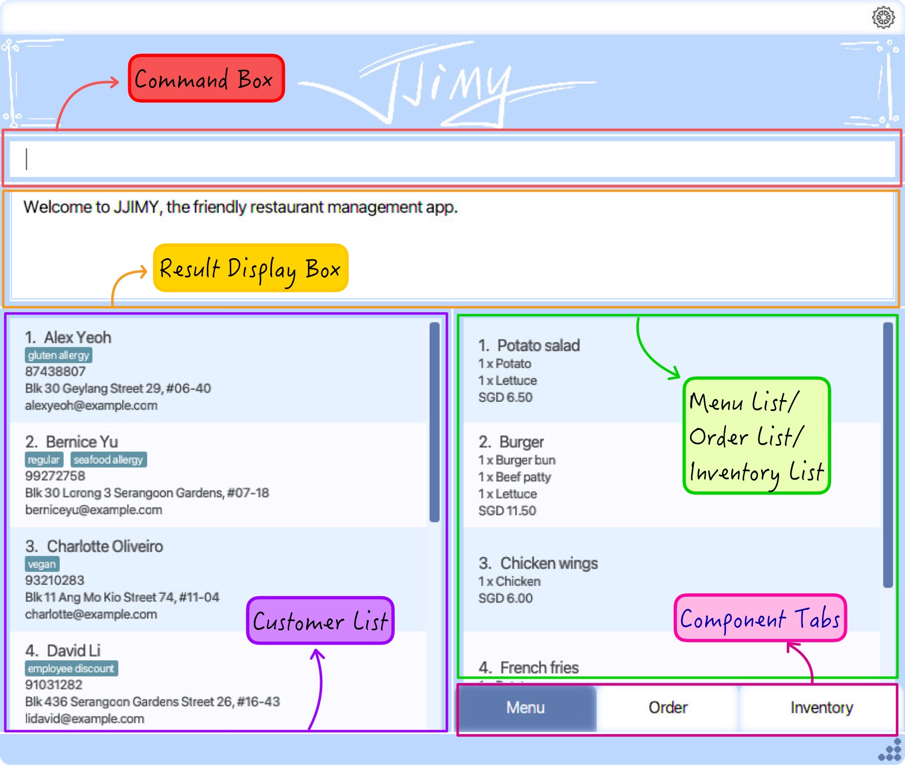
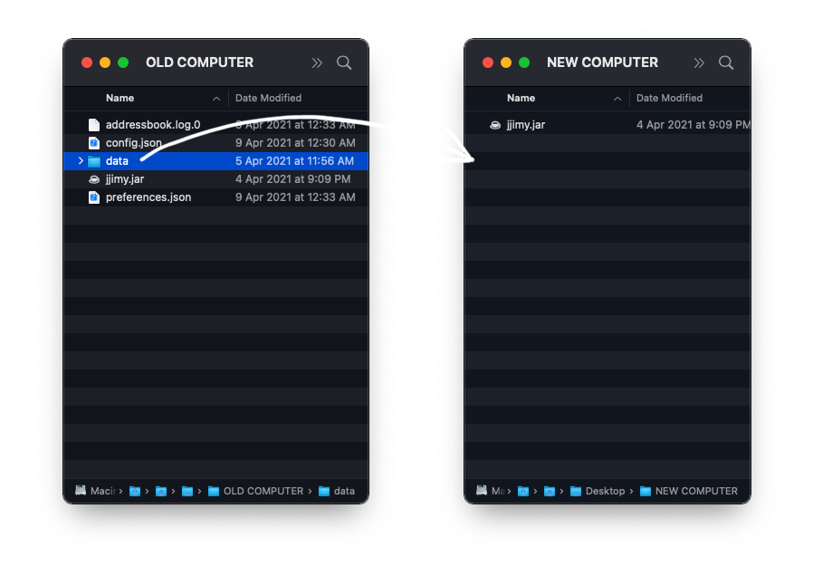

JJIMY is a **desktop app for managing your restaurant, optimized for use via a Command Line Interface** (CLI)[<sup>1</sup>](#glossary) while still having the benefits of a Graphical User Interface (GUI)[<sup>3</sup>](#glossary). If you can type fast, JJIMY can get your restaurant management tasks done faster than traditional GUI[<sup>3</sup>](#glossary) apps.

<details open>
<summary>Table of Contents</summary>

- [Quick start](#quick-start)
- [Features](#features)
  * [`General`](#general)
    + [Access help page](#help)
    + [Exit application ](#exit)
  * <span class="customer">[`Customer`](#customer)
    + [List all customers](#customer-list)
    + [Add a customers](#customer-add)
    + [Delete customer](#customer-delete)
    + [Edit customer information](#customer-edit)
    + [Find contact](#customer-find)
      </span>
  * <span class="menu">[`Menu`](#menu)
    + [List all dishes](#menu-list)
    + [Add a dish](#menu-add)
    + [Delete a dish from the menu](#menu-delete)
    + [Edit dish information](#menu-delete)
    + [Find dish](#menu-find)
      </span>
  * <span class="order">[`Order`](#order)
    + [List all orders](#order-list)
    + [Add an order](#order-add)
    + [Delete an order](#order-delete)
    + [Edit order information](#order-edit)
    + [Find an order](#order-find)
    + [Mark order as completed](#order-complete)
    + [List all completed and cancelled orders](#order-history)
      </span>
  * <span class="inventory">[`Inventory`](#inventory)
    + [List all ingredients](#inventory-list)
    + [Add an ingredient](#inventory-add)
    + [Decrease quantity of ingredient](#inventory-decrease)
    + [Delete an ingredient](#inventory-delete)
    + [Edit ingredient information](#inventory-edit)
    + [Find an ingredient](#inventory-find)
      </span>
- [FAQ](#faq)
- [Glossary](#glossary)

</details>

--------------------------------------------------------------------------------------------------------------------

<a name="quick-start"></a>
<details open>
<summary class="dropdown-1">Quick start</summary>

1. Ensure you have [Java 11](https://www.oracle.com/sg/java/technologies/javase-jdk11-downloads.html) [<sup>2</sup>](#glossary) or above installed in your Computer.

2. Download the latest `JJIMY.jar` from [here](https://github.com/AY2021S2-CS2103T-W15-3/tp/releases).

3. Copy the file to the folder you want to use as the _home folder_ for JJIMY.

4. Double-click the file to start the app. The GUI[<sup>3</sup>](#glossary) similar to the below should appear in a few seconds. Note how the app contains some sample data.<br>
   

5. Type in command in the `command box` and press Enter to execute it.

6. Refer to the [Features](#features) below for command details.
</details>

--------------------------------------------------------------------------------------------------------------------

<a name="features"></a>
<details open>
<summary class="dropdown-1">Features</summary>

### Usage

Commands have this general format:
```
component command prefix/[INPUT] -flag
```

- `component` - Component to apply the command to. (e.g. `customer`, `menu`)  
  
- `command` - Command to run. (e.g. `list`, `add`)  
  
- `prefix/[INPUT]` - Item in `[ ]` are the input to be supplied by the user. (e.g. `n/Thomas`)  
  
- `-flag` - change behavior. (e.g. `-f`, `-a`)
  
>   <b><u>Things to note</u></b>  
>   - Items with `...` after them can be used multiple times including zero times.<br>
>   Example:
>       ```
>       menu add n/[NAME] p/[PRICE] i/[INGREDIENT_ID]... q/[INGREDIENT_QUANTITY]...
>       ```
>       `i/[INGREDIENT_ID]... q/[INGREDIENT_QUANTITY]...` can be used as ` ` (i.e. 0 times) or `i/2 q/3 i/3 q/4`.
>   <p>&nbsp;</p>
>
>   - Item in round brackets are optional.<br>
>   Example:
>       ```
>       customer add n/[NAME] (t/[TAG])
>       ```
>       `n/[NAME] (t/[TAG])` can be used as `n/Thomas t/Friend` or as `n/Thomas Tan`
>   <p>&nbsp;</p>
>
>   - Only one command can be executed at a time and any words after a valid command is entered will be ignored.  
>   Example:
>       ```
>       customer list JJIMY is the best!
>       ```
>       The command above will execute `customer list` and ignore `JJIMY is the best!`
>   <p>&nbsp;</p>
>
>   - Items that have DATETIME as a parameter has `DD-MM-YYYY HH:MM` format.  
>   Example:
>       ```
>       dt/07-05-2021
>       ```
>       The example shown above is a valid DATETIME parameter input.
>   <p>&nbsp;</p>
>
>   - Parameters can be in any order.  
>   Example:  
>   If the command specifies `n/NAME s/SUBJECT`, `s/SUBJECT n/NAME` is also acceptable.
>   <p>&nbsp;</p>
>
>   - Only the latest input for any duplicated prefixes will be taken, any input for previous duplicated prefixes will be ignored.  
>   Example:
>       ```
>       menu edit 5 n/Fries1 n/Fries2 p/5 p/6
>       ```
>       The command above will only take in `n/Fries2` and `p/6`, any other input for the same prefixes will be ignored.
<p>&nbsp;</p>

<a name="general"></a>
- <details open>
    <summary class="dropdown-2">General</summary>

    <a name="help"></a>
    - <details open>
        <summary class="dropdown-3">Access help page - <code>help</code></summary>

        To access the help page, input:
        ```
        help
        ```
        Alternatively, you can click on the  icon > `help` or simply press `F1` on your keyboard.
        Shortly it will open up the `User Guide` in your default browser.
        
        <p>&nbsp;</p>
      
        ---
      
        </details>

        <a name="exit"></a>
    - <details open>
        <summary class="dropdown-3">Exit application - <code>exit</code></summary>

        To exit the application, input:
        ```
        exit
        ```
        Alternatively, you can click on the  icons > `exit` or simply press `F2` on your keyboard.
        
        <p>&nbsp;</p>
      
        ---
      
        </details>
    
    </details>


<a name="customer"></a>
- <details open class="customer">
    <summary class="dropdown-2">Customer</summary>

    <a name="customer-list"></a>
    - <details open>
        <summary class="dropdown-3">List all customers - <code>list</code></summary>

        Format:
         ```
         customer list
         ```

         The above command would list all the customers in the left column of the GUI[<sup>3</sup>](#glossary) in the sequence that they were added, with the most recent being at the top.
        
        <p>&nbsp;</p>
      
        ---
        
        </details>

        <a name="customer-add"></a>
    - <details open>
        <summary class="dropdown-3">Add a customer - <code>add</code></summary>

        Format:
         ```
         customer add n/[NAME] p/[PHONE] e/[EMAIL] a/[ADDRESS] (t/[TAG])
         ```

        Example:
         ```
         customer add n/Alan Tan p/81236789 e/alantan@nus.edu.sg a/21 Lower Kent Ridge Road, Singapore 119077 t/Gluten Allergy
         ```

        The above command would add a new contact named "Alan Tan" with phone number 81236789, email address "alantan@nus.edu.sg",
        address "Lower Kent Ridge Road, Singapore 119077" and tagged with "Gluten Allergy".
        > Note: A known limitation of add is that customers with different names but exactly the same details (phone number, email, address) will not be marked as a duplicate.
        
        <p>&nbsp;</p>
        
        ---
        
        </details>

        <a name="customer-delete"></a>
    - <details open>
        <summary class="dropdown-3">Delete customer - <code>delete</code></summary>

        Format:
        ```
        customer delete [INDEX] (-f)
        ```

        In the event that there are uncompleted orders by the contact that is being attempted to be deleted, a `-f` flag has to be added to the end of the command to confirm the command. This is to prevent you from accidentally deleting orders unknowingly and leading to unhappy customers!

        Examples:
        ```
        customer delete 2
        ```

        The above command would delete the second customer on the customer information pane.

        ```
        customer delete 2 -f
        ```

        In the event that there are pending orders that have not been fulfilled that belong to customer 2, then deletion of the customer will not be allowed since we do not want to unknowingly delete orders that are still pending.
        If deleting all orders, even pending ones, is desired, then adding the `-f` at the end of the command acknowledges and confirms the deletion behavior. Orders associated with the customer will be deleted and will no longer be shown in the order list or order history.
        
        <p>&nbsp;</p>
        
        ---
        
        </details>

        <a name="customer-edit"></a>
    - <details open>
        <summary class="dropdown-3">Edit customer information - <code>edit</code></summary>

        Format:
        ```
        customer edit [INDEX] (n/[NAME]) (p/[PHONE]) (e/[EMAIL]) (a/[ADDRESS]) (t/[TAG])
        ```

        At least one of the fields in brackets must be present in the edit command.

        Examples:

        ```
        customer edit 2 n/George Tan
        ```

        The above command changes the name of the second customer on the contacts pane to "George Tan".

        ```
        customer edit 2 n/George Tan p/80009999
        ```

        The above command changes both the name and phone number of the second customer.

        From the examples above, more than one field can be edited at a time but at least 1 field must be specified for it to be a valid command.
        
        <p>&nbsp;</p>
        
        ---
        
        </details>

        <a name="customer-find"></a>
    - <details open>
        <summary class="dropdown-3">Find customer - <code>find</code></summary>

        Format:
        ```
        customer find n/[KEYWORD] (MORE_KEYWORDS)...
        ```

        - `n/` - Finds all customers whose names contain any of the keywords (case-insensitive). Keywords are space separated.

        Example:
        ```
        customer find n/George Michael Lim
        ```

        The above command would display all contacts with names that contain either "George", "Michael", or "Lim". Note that at least 1 keyword must be specified, `customer find n/Thomas` is a valid command too with only 1 keyword ("Thomas").
        
        <p>&nbsp;</p>
        
        ---
        
        </details>

    </details>

<a name="menu"></a>
- <details open class="menu">
    <summary class="dropdown-2">Menu</summary>

    <a name="menu-list"></a>
    - <details open>
        <summary class="dropdown-3">List all dishes - <code>list</code></summary>

        Format:
        ```
        menu list (-a)
        ```
        To list the current available dishes only, a `-a` flag has to be added to the end of the command. The above command would list all the available/all dishes in the      right column of  the GUI[<sup>3</sup>](#glossary) in the sequence that they were added, with the most recent being at the top.
        Examples:
        ```
        menu list
        ```

        The above command would display all dishes disregard the availability of the dish.

        ```
        menu list -a
        ```
        The above command will only display the dishes that are currently available based on the available ingredients.
        
        <p>&nbsp;</p>
        
        ---
        
        </details>

        <a name="menu-add"></a>
    - <details open>
        <summary class="dropdown-3">Add a dish - <code>add</code></summary>

        Format:
        ```
        menu add n/[NAME] p/[PRICE] i/[INGREDIENT_ID]... q/[INGREDIENT_QUANTITY]...
        ```

        Ingredient ID and quantity must come in pairs. At least one pair must be specified, but more can be added.

        <p>&nbsp;</p>
        
        ---
        
        </details>

        <a name="menu-delete"></a>
    - <details open>
        <summary class="dropdown-3">Delete a dish from menu - <code>delete</code></summary>

        Format:
        ```
        menu delete [INDEX] (-f)
        ```

        In the event that there are uncompleted orders by the dishes that is being attempted to be deleted, a `-f` flag
        has to be added to the end of the command to confirm the command. This is to prevent you from accidentally
        deleting orders unknowingly and leading to unhappy customers!

        Examples:
        ```
        menu delete 2
        ```

        The above command would delete the second dishes on the menu information pane.

        ```
        menu delete 2 -f
        ```

        In the event that there are pending orders that have not been fulfilled that contains dish id 2, then deletion
        of the dish will not be allowed since we do not want to unknowingly delete orders that are still pending.
        If deleting any dishes that belongs to any uncompleted order is desired, then adding the `-f` at the
        end of the command acknowledges and confirms the deletion behavior. Orders associated with the menu dish will 
        be marked as cancelled and will no longer be shown in the order list but can be viewed in the order history.
        
        <p>&nbsp;</p>
        
        ---
        
        </details>

        <a name="menu-edit"></a>
    - <details open>
        <summary class="dropdown-3">Edit dish information - <code>edit</code></summary>

        Format:
        ```
        menu edit [INDEX] (n/[NAME]) (p/[PRICE]) (i/[INGREDIENT_ID]... q/[INGREDIENT_QUANTITY]...)
        ```

        At least one of the fields in round brackets must be specified.
        
        <p>&nbsp;</p>
      
        ---
        
        </details>

        <a name="menu-find"></a>
    - <details open>
        <summary class="dropdown-3">Find dish - <code>find</code></summary>

        Format:
        ```
        menu find n/[KEYWORD] (MORE KEYWORDS) i/[KEYWORD]
        ```

        At least one prefix must be specified. If both are specified, both conditions will be checked.

        - `n/` - Finds all dishes with names that contain any of the keywords (case-insensitive). Keywords are space separated.
        - `i/` - Finds all dishes with ingredient names that contain keyword (case-insensitive).
        
        <p>&nbsp;</p>
      
        ---
        
        </details>

    </details>

<a name="order"></a>
- <details open class="order">
    <summary class="dropdown-2">Order</summary>

    <a name="order-list"></a>
    - <details open>
        <summary class="dropdown-3">List all orders - <code>list</code></summary>

        Displays the list of upcoming orders.
        Format:
        ```
        order list
        ```
        The above command would list all the order in the right column of the GUI[<sup>3</sup>](#glossary). The list is in chronological sequence based on the order's date and time.

        <p>&nbsp;</p>
        
        ---
        
        </details>

        <a name="order-add"></a>
    - <details open>
        <summary class="dropdown-3">Add an order - <code>add</code></summary>

        Creates an order and adds it to the order list.
        Format:
        ```
        order add n/[CUSTOMER_ID] dt/[DELIVERY_DATETIME] d/[DISH_ID]... q/[QUANTITY]...
        ```
        Example:
        
        `Bernice Yu` has ordered a `burger` and 2 `chicken wings` on `14th Feb 2021 6:30pm`.
        You can see on the customer list (right column) that `Bernice Yu` has an id of `2`.
        While a `burger` has an id of `2`, `Chicken Wings` has an id of `3` on the menu list (right column).
        The command to be inputted will be:
        ```
        order add n/2 dt/14-02-2021 18:30 d/1 q/1 d/3 q/1
        ```
        
        <p>&nbsp;</p>
        
        ---
        
        </details>

        <a name="order-delete"></a>
    - <details open>
        <summary class="dropdown-3">Delete an order - <code>delete</code></summary>

        Format:
        ```
        order delete [INDEX]
        ```
        The above command deletes the order based with that index.
      
        <p>&nbsp;</p>
        
        ---
        
        </details>

        <a name="order-edit"></a>
    - <details open>
        <summary class="dropdown-3">Edit an order - <code>edit</code></summary>

        Format:
        ```
        order edit [INDEX] (n/[CUSTOMER_ID]) (dt/[DELIVERY_DATETIME]) (d/[DISH_ID]... q/[QUANTITY]...)
        ```

        At least one of the fields in round brackets must be present in the edit command Only uncompleted orders can be edited. Uncompleted orders can be viewed with the `order list` command.
      
        <p>&nbsp;</p>
        
        ---
        
        </details>

        <a name="order-find"></a>
    - <details open>
        <summary class="dropdown-3">Find an order - <code>find</code></summary>

        Format:
        ```
        order find n/[KEYWORD] (MORE KEYWORDS) d/[KEYWORD]
        ```

        At least one prefix must be specified. If both are specified, both conditions will be checked.

        - `n/` - Finds all orders with customer names that contain any of the keywords (case-insensitive). Keywords are space separated.
        - `d/` - Finds all orders with dish names that contain keyword (case-insensitive).

        <p>&nbsp;</p>
        
        ---
        
        </details>

        <a name="order-complete"></a>
    - <details open>
        <summary class="dropdown-3">Mark an order as complete - <code>complete</code></summary>

        Format:
        ```
        order complete [INDEX]
        ```
        The above command would mark the order of that index as complete. Only uncompleted orders can be completed. Uncompleted orders can be viewed with the `order list` command. The order will no longer be in the order list. Instead, it will be in order history.        
        <p>&nbsp;</p>
        
        ---
        
        </details>

        <a name="order-history"></a>
    - <details open>
        <summary class="dropdown-3">List all completed and cancelled orders - <code>history</code></summary>

        Format:
        ```
        order history
        ```
 
        The above command displays the history of completed and cancelled orders in the right column of the GUI[<sup>3</sup>](#glossary). The list is in chronological sequence based on the order's date and time.
        
        <p>&nbsp;</p>
        
        ---
        
        </details>

    </details>

<a name="inventory"></a>
- <details open class="inventory">
    <summary class="dropdown-2">Inventory</summary>

    <a name="inventory-list"></a>
    - <details open>
        <summary class="dropdown-3">List all ingredients - <code>list</code></summary>

        Format:
        ```
        inventory list
        ```
        
        The above command would list all the ingredients in the inventory in the right column of the GUI[<sup>3</sup>](#glossary) in the sequence that they were added, with the most recent being at the top.
        
        <p>&nbsp;</p>
        
        ---
        
        </details>

        <a name="inventory-add"></a>
    - <details open>
        <summary class="dropdown-3">Add an ingredient - <code>add</code></summary>

        Note:
        If the ingredient already exists, its listed quantity will be incremented.

        Format:
        ```
        inventory add n/[INGREDIENT_NAME] q/[QUANTITY]
        ```
        
        <p>&nbsp;</p>
        
        ---
        
        </details>

        <a name="inventory-decrease"></a>
    - <details open>
        <summary class="dropdown-3">Decrease quantity of ingredient - <code>decrease</code></summary>

        Format:
        ```
        inventory decrease [INDEX] [QUANTITY]
        ```
        
        <p>&nbsp;</p>
        
        ---
        
        </details>

        <a name="inventory-delete"></a>
    - <details open>
        <summary class="dropdown-3">Delete an ingredient - <code>delete</code></summary>

        Format:
        ```
        inventory delete [INDEX] (-f)
        ```

        In the event that there are ingredients that is needed by certain dishes that is being attempted to be deleted,
        a `-f` flag has to be added to the end of the command to confirm the command. This is to prevent you from
        accidentally deleting dishes unknowingly and leads to invalid orders! Orders that use the dishes will hence be cancelled!

        Examples:
        ```
        inventory delete 2
        ```

        The above command would delete the second ingredient on the inventory information pane.

        ```
        inventory delete 2 -f
        ```

        In the event that there are dishes that needs ingredient id 2, then deletion
        of the dish will not be allowed since we do not want to unknowingly delete dishes that needs the ingredient.
        If deleting any ingredient that is needed to any dishes is desired, then adding the `-f` at the
        end of the command acknowledges and confirms the deletion behavior. 
        Orders associated with the ingredient will be marked as cancelled and will no longer be shown in the order list but can be viewed in the order history.
        
        <p>&nbsp;</p>
        
        ---
        
        </details>

        <a name="inventory-edit"></a>
    - <details open>
        <summary class="dropdown-3">Edit an ingredient - <code>edit</code></summary>

        Format:
        ```
        inventory edit [INDEX] (n/[INGREDIENT_NAME]) (q/[QUANTITY])
        ```

        At least one of the fields in brackets must be present in the edit command.
        
        <p>&nbsp;</p>
        
        ---
        
        </details>

        <a name="inventory-find"></a>
    - <details open>
        <summary class="dropdown-3">Find an ingredient - <code>find</code></summary>

        Format:
        ```
        inventory find n/[KEYWORD] (MORE KEYWORDS) q/[LESS THAN QUANTITY]
        ```

        At least one prefix must be specified. If both are specified, both conditions will be checked.

        - `n/` - Finds all ingredients with names that contain any of the keywords (case-insensitive). Keywords are space separated.
        - `q/` - Finds all ingredients with less than specified quantity. Must be a non-negative whole number (>= 0).

        <p>&nbsp;</p>
        
        </details>

    </details>

</details>

--------------------------------------------------------------------------------------------------------------------

<a name="faq"></a>
<details open>
<summary class="dropdown-1">FAQ</summary>

**Q**: How do I transfer my data to another Computer?<br>
**A**: Install the app in the other computer and overwrite the empty data file it creates with the file that contains the data of your previous JJIMY home folder.


**Q**: The window for JJIMY is too small, is there a way for me to resize the window?<br>
**A**: Hover over the bottom right corner  of JJIMY, you will see  icon. Drag it to resize the window.

</details>

--------------------------------------------------------------------------------------------------------------------

<a name="glossary"></a>
<details open>
<summary class="dropdown-1">Glossary</summary>

1. **CLI** - Command Line Interface. A CLI processess commands to a computer program in the form of lines of text.
2. **Java** - Java is a class-based, object-oriented programming language that is designed to have as few implementation dependencies as possible.
3. **GUI** - Graphical User Interface. GUI is a form of user interface that allows user to interact an application through graphical icons and audio indicator such as primary notation.

</details>


--------------------------------------------------------------------------------------------------------------------

<a href="#" class="float">
   
</a>
