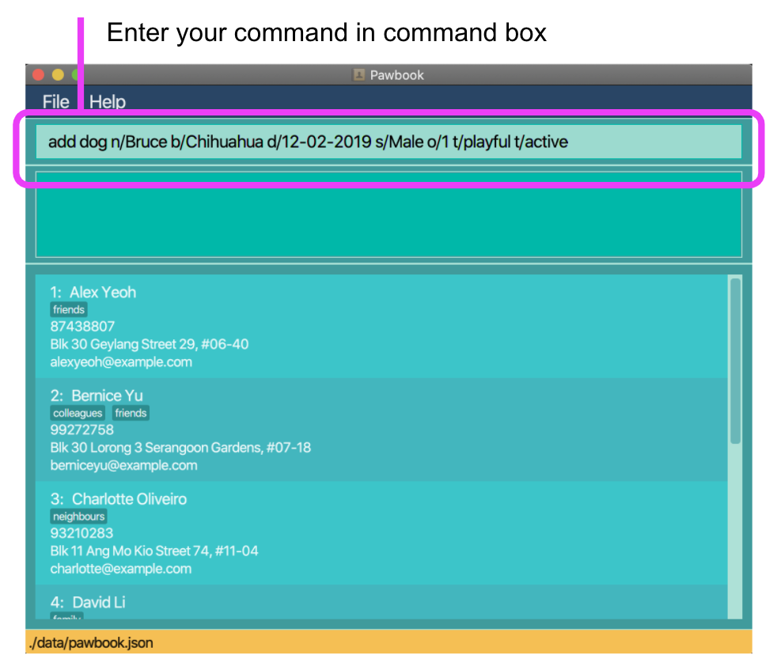
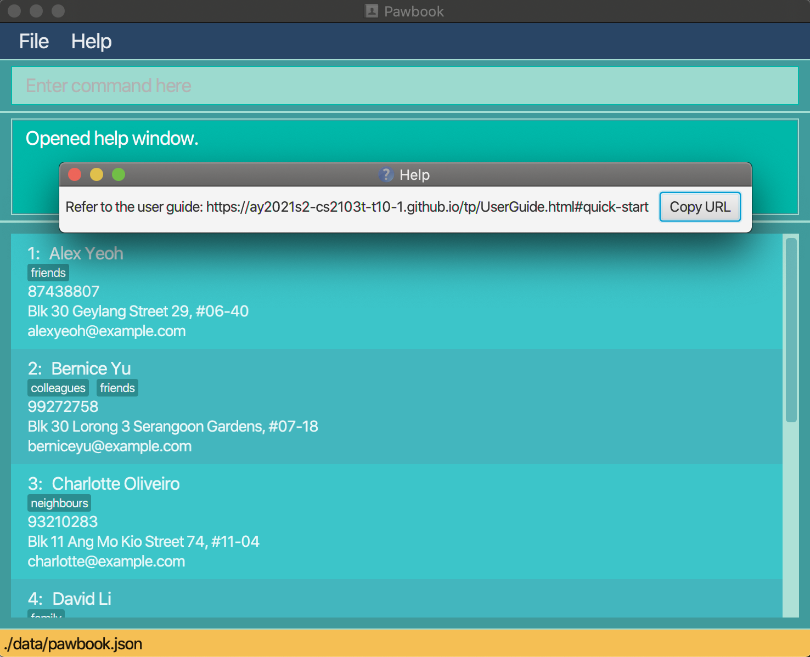

* Table of Contents
{:toc}

# Overview

Welcome to the Pawbook User Guide! 
In this section, you will be given a brief overview of what Pawbook is all about and what you can takeaway from this document. 
We will guide you from a user's perspective as to how to use Pawbook. 

This user guide contains (but not limited to) a [quick start guide](#quick-start), a [features walkthrough](#commands) and a [command summary table](#command-summary) for easy reference. 
In each feature or functionality, we further provide command formats and command examples to ensure that users can become proficient in using Pawbook.

## Introduction

Managing a business is definitely not easy, so imagine if your business includes taking care of countless energetic 
furpals. That's right! We are talking about the job of dog school managers. <br> 

As dog schools and dog day cares rise in popularity due to the hectic work life of dog owners, the operations of dog schools can get out of hand. But no worries, 
we have Pawbook to save the day!

With Pawbook, you can add and delete owner and dog profiles alike, to easily keep track of dogs and their respective owners.
Pawbook also allows the managing of the various canine-training programs to cater to your furry customers.
With the many programs taking place in the school, Pawbook helps to condense your hectic schedule for you. 
By viewing your schedule, you are able to better plan for the day ahead.

Pawbook is a desktop application for dog school managers to facilitate their bookkeeping of puppies and dogs in the 
school, optimized for use via a **Command Line Interface (CLI)** which caters to fast-typers who prefer to use a keyboard. 
You can navigate the application with ease and execute instructions by typing text-based commands in the command box provided.

Pawbook also has the benefits of a **Graphical User Interface (GUI)** to provide you with a visually appealing view, thus bringing you the best user experience.

## Purpose

The aim of this user guide is to guide novel users on how to get started with Pawbook. 
It also aids more experienced users by providing a detailed explanation on the different features and components of Pawbook. 
This allows old and new users alike to easily use the various features and functionalities provided by Pawbook. 

# About the User Guide 
In this section, we will teach you everything you need to know to effectively use this user guide. 

## Contributors

This user guide is created by **CS2103T-T10-Group1**.
* Charles Lee Lin Ta
* John Alec Mendoza Branzuela
* Kou Yong Kang
* Lam Xuan Yi, Shaelyn
* Wei Yutong
* Zhang Anli

## Navigating the User Guide

This user guide provides you with all the information you need to utilise Pawbook. We understand the 
pains of using a Command Line Interface (CLI) program and have bested our efforts into ensuring a very readable guide
on how to use our program <br>

If you need help setting up Pawbook, you can go to the _[Quick Start](#quick-start)_ section. <br>

If you want to find out more about Pawbook's features and commands, you can go to the _[Commands](#commands)_ section. <br>

If you need an overview regarding the usage of Pawbook's commands, head on to the _[Command Summary](#command-summary)_ section. <br>

Here are some important syntax to take note of to facilitate your reading before continuing.

| **Symbol/Format** | **Meaning** |
| :------------------:|:-------------|
|<kbd>Enter</kbd> | Indicates the enter button on the user's keyboard |
| `Markdown` | Example of what to type in the command textbox |
| **Bold** | Note-worthy keywords |
| :bulb: | Indicates there is something important to take note of
| :heavy_exclamation_mark: | Indicates something that the user should take caution of. |

## Syntax Format

Syntax | Meaning  | Example
--------|------------------|----------
**`lower_case/`** |  Prefix | `n/`, `p/`, `t/`
**`[UPPER_CASE]`** |  Parameter | [keyword] [entity ID]

## GUI Layout

In this section, you will be given an introduction to the layout of Pawbook's Graphical User Interface (GUI). This will 
help you better understand what each component that you observe on-screen represents. <br>

There are a total of two pages that you can navigate to when using Pawbook:
* Main Page
* Help Page

### Main Page View

You will be directed to the main page upon launching Pawbook. On this page, you can see the list of owners, dogs and programs
that are currently stored in Pawbook. <br>

Here is how the main page looks like:


Component | Purpose
--------|-----------------
**Menu Bar** | A menu bar that allows users to click on shortcuts. 
**Dashboard** (Coming soon...) | A dashboard that shows the user the status of Pawbook. 
**Main Display** | The main display that shows the results of each command.
**Response Display** | A display that shows the response message from Pawbook after a command has been executed.
**Card Component** | Each card component represents one entity profile (i.e. Dog, Owner, Program). 
**Command Box** | A text field for the user to enter his/her command.

### Help Page View

This help page provides a short summary list of commands that you can use, as well as a link to this main user guide page.


----

## Quick Start

If this is your first time using Pawbook, follow these simple steps to jump straight into the action:

1. Ensure you have **Java 11 or above** installed in your Computer.
2. Download the **latest** pawbook.jar [here][insertlinkhere].
3. Copy the _pawbook.jar_ file to the folder you want to use as the root directory for Pawbook.
4. Double-click the file to start the app. The GUI should appear in a few seconds.
5. Congratulations, you have successfully launched Pawbook! For new users, type `help` in the command box to view the instruction list
6. Type the command in the command box and press <kbd>Enter</kbd> to execute it. e.g.
   typing `add` and pressing <kbd>Enter</kbd>  will allow you to start adding information to
   the database.

:bulb: Please refer to the features below for details of each command. <br>
:heavy_exclamation_mark: Ensure that the pawbook.json file is not corrupted. If corrupted, Pawbook 
will not be able to use the data from JSON to build the list for usage. 

----

# Commands 

In this section, you will learn about the commands available in Pawbook and how to use them.

### Add Command

**Function**: Adds a **dog/owner/program** to Pawbook.<br>
**Usage**: When you want to add an entity into Pawbook, you can simply use the add command. The add command adds the new entity at the end of the current list. 
For instance, when a new dog arrives at the school with its owner, you will need to add the owner profile and the dog profile and store it in Pawbook. 

Note: 

- Date-time format used for sessions is d-M-yyyy HH:mm. Same applies to the day format of date of birth which follows d-M-yyyy.<br>
  d -> Day: From 1-31 (Please take note that months like February does not have 29 days in certain years)<br>
  M -> Month: From 1-12<br>
  yyyy -> Valid year<br>
  HH -> From 1-12<br>
  mm -> From 0-59<br>
  
Format:

```
add dog n/[DOGNAME] b/[BREED] d/[DATEOFBIRTH] s/[SEX] o/[OWNERID] t/[TAG]
add owner n/[OWNERNAME] p/[PHONE_NUMBER] e/[EMAIL] a/[ADDRESS]
add program n/[PROGRAMNAME] s/[TIMEANDDATEOFSESSION] t/[TAG]
```

Note:
- Different prefixes should be used for the respective entities to specify details.
- Tags are optional.

Examples:

1. Adds an owner named John with the details provided in Pawbook. <br>
   Command: `add owner n/John Doe p/98765432 e/johnd@example.com a/311, Clementi Ave 2, #02-25 t/friends t/owesMoney`
2. Adds a dog named BRUCE belonging to owner with ID 1 in Pawbook. <br>
   Command: `add dog n/Bruce b/Chihuahua d/12-02-2019 s/Male o/1 t/playful t/active`
3. Creates a program with program name Obedience Training. <br>
   Command: `add program n/Obedience Training s/02-02-2020 18:00 t/puppies`
   
:bulb: The order of the prefixes do not matter, feel free to add your information in any order that is convenient for you!

 

### Delete Command

**Function**: Deletes an entity (dog/owner/program) from Pawbook. <br>
**Usage**: When you want to delete an entity, you can use the delete command and delete the entity that you want via the ID number. 
For instance, when a dog is no longer under your care, you can delete the dog's profile using this command. 

:heavy_exclamation_mark: Take note that deleting an owner will automatically delete all the dogs that belong to that owner as well. 
We do not allow dogs in Pawbook to not have an owner tagged to it!

Format:

```
delete dog [DOG ID]
delete owner [OWNER ID]
delete program [PROGRAM ID]
```

Note: 

- The ID must be a positive integer 1, 2, 3 etc

Examples:

1. Deletes the owner with ID 1 in Pawbook.<br>
   Command: `delete owner 1`
2. Deletes the dog with ID 2 in Pawbook.<br>
   Command: `delete dog 2`
3. Deletes the program with ID 3 in Pawbook.<br>
   Command: `delete program 3`
   
:bulb: Deleting using ID instead of name? Yes, all commands other than `add` and `find` uses the entity's ID. 
When a new entity is added to Pawbook, the system assigns a unique ID to each entity and is given by the first number
of each entity in the list.

 

### Edit Command

**Function**: Edits a dog/owner/program from Pawbook.<br>
**Usage**: This command allows you to edit the information of the entity (dog/owner/program) in your Pawbook. Let's say 
you just added an entry for a dog but you realised that you filled in the owner information wrongly. The edit command 
allows you to quickly correct that mistake. More details about the formatting of date of birth and session available _[here](#add-command)_

Format:

```
edit dog [DOG ID] n/[NAME] b/[BREED] d/[DATEOFBIRTH] s/[SEX] o/[OWNERID] [t/TAGS]...
edit owner [OWNER ID] n/[NAME] p/[PHONE] e/[EMAIL] a/[ADDRESS] [t/TAGS]...
edit program [PROGRAM ID] n/[NAME] [s/SESSION]... [t/TAGS]...
```

Note: 

- The ID must be a positive integer 1, 2, 3, ...
- Only include the variables that need to be edited after the integer

Examples:

1. Edits the owner with ID 1 in Pawbook.<br>
   Command: `edit owner 1 p/12345678`
2. Edits the dog with ID 2 in Pawbook.<br>
   Command: `edit dog 2 n/Bruce t/playful`
3. Edits the program with ID 3 in Pawbook.<br>
   Command: `edit program 3 t/learn`

 

   
### Enrol Command

**Function**: Adds a specified dog to a specified program that the dog was previously not enrolled in. <br>
**Usage**: When you want to enrol a dog into a specific program, you can use this command. One instance is when after 
a new dog Bruce has just joined the school and is enrolled for Obedience Training. You can then enrol Bruce into the 
Obedience training program after you have added Bruce into the system. 

Format:

```
enrol d/[DOG ID] p/[PROGRAM ID]
```

Note: 

- The dog and program must both be valid.

Examples:

1. Enrol dog with Dog ID 2 into program with Program ID 3, assuming that Dog ID 2 was previously not enrolled in 
   Program ID 3. <br> 
   Command: `enrol d/2 p/3`
   
 

### Drop Command

**Function**: Removes a specified dog from a specified program that the dog was previously enrolled in. <br>
**Usage**: After a dog has finished a program or has dropped out of the program, you can drop him from the program using
this command. After a dog has been dropped from the program, the program will no longer have that dog ID stored. 

Format:
```
drop d/[DOG ID] p/[PROGRAM ID]
```

Note:
- The dog and program must both be valid.
- Dog must be enrolled in the program.

Examples:
1. Remove dog with Dog ID 2 from program with Program ID 3, assuming that Dog ID 2 was previously enrolled in 
   Program ID 3. <br> 
   Command: `drop d/2 p/3`
   
 

### Schedule Command 

**Function**: Display all programs happenings on the current day or any specified date. <br>
**Usage**: As a busy dog school manager, this allows you to view at one glance what are the programs that are 
lined up on any given day. 

Format:
```
schedule [date]
```
Note: 
- Date has to be specified in the `d-M-yyyy` format.
- If no date is provided, the schedule command will display all programs that occur on the current day.

Examples:

1. Display the schedule for today:
   Command: `schedule`
2. Display the schedule for 1st April 2021:
   Command: `schedule 1-4-2021`


### List Command

**Function**: Display entities filtered by type.
**Usage**: To see the three different types of entities (dog/owner/program), you can simply use this command. Let's say
you want to see all the dogs that you are in-charge of. Simply list them and this command will provide you the full list. 

Format:
```
list [dog/owner/program]
```

Note:

- At most one keyword needs to be provided
- If no keyword is provided, i.e. `list`, then all dogs/owner/program will be displayed

Examples:

1. List all dogs.<br>
   Command: `list dog`
2. List all owners.<br>
   Command: `list owner`
  
 

### Find Command 

**Function**: Shows the list of search results based on one/many keywords. 
**Usage**: When you want to find a particular entity (dog/owner/program), you can simply find them by their name. You
can also find multiple entities by providing multiple keywords. This may be helpful when you want to see just one specific entity profile. 

Format: 

```
find [KEYWORD1] 
find [KEYWORD1] [KEYWORD2] 
find [KEYWORD1] [KEYWORD2] [KEYWORD3] 
```

Note: 
- At least one keyword is needed. 

Examples: 

1. Find all entities with the name 'Alice'. <br>
   Command: `find alice`
2. Find all entities with the name 'Alice' or 'Bob' or 'Charlie'.<br>
   Command: `find alice bob charlie`
   
:bulb: Find is able to take in multiple keywords and returns all results as long as the name contains any one of the keywords. 

 

### View Command 

**Function**: Views the list of all entities related to the searched entity. <br>
**Usage**: When you want to have a more detailed view of a particular entity (dog/owner/program), you can use this command
to see more details. At the top entry, it will be the profile of the entity you want to view. This is followed by the 
all its related entities. For instance, when you view Bruce the dog, you will first see the his profile, followed by his 
owner's profile and finally all the programs that Bruce is enrolled in. 

```
view [ENTITY ID] 
```

You can use this command to have a quick overview of the entities related to each other.

Examples: 

1. If entity 1 is an owner, a list of the owner with Owner ID 1 and all his dogs will be displayed. <br>
   Command: `view 1` 
2. If entity 2 is a dog, a list containing the dog with Dog ID 2 and its respective owner will be displayed. <br>
   Command: `view 2` 
3. If entity 3 is a program, a list of the program with Program ID 3 and all the dogs enrolled in this program will be displayed. <br>
   Command: `view 3`

 

### Help Command

**Function**: Shows the help page. <br>
**Usage**: If you are unsure about how to use Pawbook, execute this help command to view a complete list of application 
instructions.

Format: 
```
help
```

  


### Exit Command

**Function**: Exit Program. <br>
**Usage**: It's the end of the day and you want to close Pawbook. Simply use this command to exit. The data will be 
automatically saved upon exit and will be ready for use the next time you reopen Pawbook. 

Pawbook automatically saves the existing information of the dogs and will close the program.

Format: 
```
exit
```


-----

## FAQ

Q: How do I transfer my data to another computer? <br>
A: Install the app in the other computer and overwrite the empty data file it creates with the file that contains the 
data of your previous Pawbook home folder.

Q: Where is my data saved? <br>
A: They are stored in the <kbd>data</kbd> folder where the Pawbook application can be found.

Q: How can I make backups of my data in Pawbook? <br>
A: Copy and paste the <kbd>data</kbd> folder located in the Pawbook home folder to somewhere safe and 
easy to remember. 
In order to restore the backup, copy the entire folder back into the same home folder and rewrite the existing folder.

Q: How do I delete all my data in Pawbook? <br>
A: Delete the <kbd>data</kbd> folder in the Pawbook home folder.

Q: Will my data be compromised? <br>
A: Fret not! All your data on Pawbook is stored in your local device and will not be transferred over the Internet.

Q: Does Pawbook require an internet connection to function? <br>
A: Pawbook does not access any web services and can be run completely offline.

-----

## Command Summary

Action | Format
--------|------------------
**Add** | 1. `add dog n/[DOGNAME] b/[BREED] d/[DATE OF BIRTH] s/[SEX] o/[OWNERID] t/[TAG]`<br> 2. `add owner n/[OWNERNAME] p/[PHONE] e/[EMAIL] a/[ADDRESS] [t/TAG]...`<br> 3. `add  program n/[NAME] [s/DATE OF SESSION]... [t/tag]...`
**Delete** | 1. `delete dog d/[DOGID]`<br> 2. `delete owner o/[OWNERID]`<br> 3. `delete program p/[PROGRAMID]`
**Edit** | 1. `edit dog d/[DOG ID] n/[NAME] b/[BREED] d/[DATEOFBIRTH] s/[SEX] o/[OWNERID] [t/TAGS]...`<br> 2. `edit owner o/[OWNER ID] n/[NAME] p/[PHONE] e/[EMAIL] a/[ADDRESS] [t/TAGS]...`<br> 3. `edit program o/[PROGRAM ID] n/[NAME] [s/SESSION]... [t/TAGS]...`
**Enrol** | `enrol d/[DOG ID] p/[PROGRAM ID]`
**Drop** | `drop d/[DOG ID] p/[PROGRAM ID]`
**List** | `list [dog/owner/program]`
**Find** | `find [keyword1] [keyword2] [keyword3] ...`
**View** | `view [ID number]`
**Schedule** | `schedule [DATE]`
**Help** | `help`
**Exit** | `exit`

-----

## Glossary 

Term  | Explanation
-----|------------------
CLI | Short for Command Line Interface. CLI-based applications are primarily used through processing text commands. 
GUI | Short for Graphical User Interface. GUIs work as the tangible user interface between program and user. Users interact with Pawbook through the GUI on their devices.
Entity | Refers to either an owner, a dog or a program
