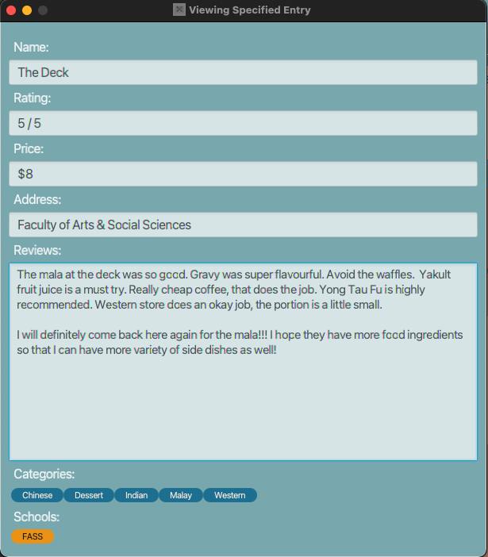

###  Done by (CS2103-T14-2):
Donavan Lim, Marcus Lee Eugene, Chong Sidney, Dinesh S/O Magesvaran, Prabhakaran Gokul

---

* Table of Contents
{:toc}
--------------------------------------------------------------------------------------------------------------------

## Description

The Food Diary is a desktop app for managing food diary entries, optimized with a Command Line Interface (CLI) and packaged with a Graphical User Interface (GUI).

The Food Diary caters to food-passionate NUS students who would ideally benefit from keeping records of food options tasted in the vicinity of NUS.

The Food Diary will allow students to save time and effort when finding places to eat around the NUS vicinity. The Food Diary especially caters to students mainly on 4 aspects:

1. The ability for users to save food diary entries for future reference.
2. The ability for users to find entries based on specific fields.
3. The ability for users to have multiple food reviews for a food place.
4. The option for users to use Commands / UI to perform some tasks quickly.

--------------------------------------------------------------------------------------------------------------------
## Quick Start
1. Ensure you have Java 11 or above installed in your Computer.

2. Download the latest jar file from [here](https://github.com/AY2021S2-CS2103-T14-2/tp/releases).

3. Copy the file to the folder you want to use as the home folder for The Food Diary app.

4. Open your terminal at where the home folder is, and run java -jar [file name].jar without the
   [ ] brackets to start the app.

5. You should now see The Food Diary’s home page.

## User Interface

This section discusses the main semantics and purpose of the design of The Food Diary.

**Notes about the User Interface:** 

On start up of The Food Diary, users are greeted with the main window display.
 The main window displays all entries of the in The Food Diary on start up,
 in the order that the entries were added in.

### Main Window

* The main window features 5 components. From top to bottom, they are:
    1. A menu bar
    2. A command box text field
    3. A result display
    4. A list of entries
    5. A status bar

### Menu Bar
* The menu bar features 2 buttons: File, and Help.

* The File menu contains Exit, which when pressed, exits the app.

* The Help menu contains Help, which when pressed, opens a new Help window displaying all the a help guide for users.

### Command Box
* The command box is the text field users will type their commands in their in to use The Food Diary.

### Result Display
* The result display displays necessary logging information to the user.

* Information shown generally include the status of whether the command was written correctly syntactically,
 which would then allow for the app to perform the user's desired request.

* If the command cannot be interpreted by the app, the appropriate error message and corresponding rectification
 is displayed for the user to rectify their input command.

* The text field is also text-selectable.

### List of Entries
* This component features a list of entries currently stored in The Food Diary.

* A list of entries is auto-populated on start up, or when there is no existing data. To start afresh, use the `clear`
 function as stated below.

* Each entry displayed contains 5 compulsory fields, and 2 optional fields:
    1. Name of Restaurant
    2. Rating of Restaurant
    3. Price (an estimate) of the Restaurant's Food
    4. Address of Restaurant
    5. User's Review of the Restaurant
    6. (Optional) Food Categories (i.e. Cuisine, Restaurant/Food Characteristic etc.)
    7. (Optional) NUS School Location Categories

#### Consolidation of Entries
* Users need not add an extra entry if they wish to add on an extra review, or price pertaining to the same restaurant
 and location. A common situation involves users wanting to document their experience visiting the same restaurant
 more than once.

* As such, multiple reviews and prices pertaining to an entry can be added using the `addon` command. Refer to the
`addon` feature below for more information.

* An entry with multiple reviews only shows the first review, truncated with an ellipsis (...).

* This is done to keep each entry's window height short for the user to view more entries
 in within the main window.

* To view all the reviews pertaining to that entry, use the `view` command. Refer to the `view` feature below for
 more information.

* An entry with multiple prices shows a price range, ranging from the minimum to the maximum price
 among the prices added for the corresponding entry.

### Status Bar
* Displays the path directory information for the local storage file of The Food Diary.

### Help Window
* The help window shows a help guide for users on a separate window.

* The help guide has 3 main sections:
    1. A list of Commands
    2. A list of Food Categories
    3. A list of School Location Categories

* A list of commands gives a succint, convenient overview of all the commands executable
 in The Food Diary for the user.

* The Food and School Location categories aid users in learning what possible options they can tag their
 entries as in their commands.

* Users can copy the link with the `Copy URL` button, and view this User Guide for more information.

* Refer to the `help` feature below for more information.

### View & Revise Window
* These windows are described in detail in the `view` and `revise` features below respectively.

--------------------------------------------------------------------------------------------------------------------

## Features

**Notes about the Command Format:** 

Words in UPPER_CASE are the parameters to be supplied by the user.
e.g. in add n/NAME, NAME is a parameter which can be used as add n/Frontier.

* Items in angle brackets `<...>` are compulsory.

* Items in square brackets `[...]` are optional.
  e.g `<n/NAME> [s/SCHOOL LOCATION]` can be used as `n/Subway t/UTOWN` or as `n/Subway` only.
  
* Items with `…​` (i.e an ellipsis) after them can be used multiple times including zero times.
  e.g. `[c/CATEGORY] …​` can be used as `c/Fastfood c/Western c/Fastfood`, or 0 times etc.
  e.g. `<KEYWORD> ...` means that there must be one keyword present in the command, and each keyword can take on
  any part of the entry as specified by the command (i.e. price, review etc.). See features for more understanding.
  
* Parameters can be in any order.
  e.g. if the command specifies `<n/NAME> <p/PRICE>`, then `<p/PRICE> <n/NAME>` is also acceptable.
  
* If a parameter is expected only once in the command but you specified it multiple times, only the last occurrence of the parameter will be taken.
  e.g. if you specify `p/5 p/6`, only `p/6` will be taken.
  
* Extraneous parameters for commands that do not take in parameters (such as `help`, `list`, `exit` and `clear`) will be ignored.
  e.g. if the command specifies `help 123`, it will be interpreted as `help`.
  
* `[c/CATEGORY]`needs to be titled-cased, `[s/SCHOOL]` can be lower or upper-cased.

### Add a FoodDiary entry: `add`

Adds an entry to the Food Diary.

Format: `add <n/RESTAURANT NAME> <ra/RATING> <p/PRICE> <re/REVIEW> <a/ADDRESS> [c/CATEGORY]... [s/SCHOOL LOCATION]...`

Parameters:

In any order:
1. Restaurant name: `<n/RESTAURANT NAME>`
2. Rating of restaurant experience: `<ra/RATING>`
3. Price (estimate) of restaurant's foood: `<p/PRICE>`
3. Address of restuarant: `<a/ADDRESS>`
4. Review of restaurant: `<re/REVIEW>`
5. Food category: `[c/CATEGORY] ...`
6. NUS School location category: `[s/SCHOOL LOCATION] ...`

Schools are limited to the following NUS locations:
    `BIZ`, `CLB`, `DENT`, `FASS`, `FOE`,`MED`, `NUSS`, `PGP`, `SCIENCE`, `SDE`, `SOC`,
`USC`, `UTOWN`, `UHALL`, `VENTUS`, `YIH`

Categories are limited to the following:
    `Chinese`, `Dessert`, `Fastfood`, `Fruits`, `Fusion`, `Halal`, `Indian`, `Japanese`, `Korean`, `Malay`,
`Vegan`, `Vegetarian` ,`Western`, `Others`

Note:
- Names can only be alphanumeric characters. We justify that the sole use of alphanumeric characters suffices –
 users will still be able to know which restaurant the entry is referring to despite
 not using non-alphanumeric characters, such as apostrophe(') etc.
- Raing should be an integer between 0 and 5.
- Price range: $0 - 999.
- Address will not be checked if it is a valid location, this is left for the user to input any address they deem
 as legitimate.
- Multiple entries can exist with the same name but different locations, and vice versa.
- A FoodDiary entry can have any number of categories or schools.
- Food Diary can contain up to 1,000,000 entries, beyond which it will not be possible to
add more entries until one or more existing entries have been deleted.

Example:

    add n/Al Amaan Restaurant ra/5 p/8 re/best for Butter Chicken a/12 Clementi Rd, Singapore 129742 c/Indian s/FOE
    add n/7 Eleven ra/3 p/4 re/Mac and cheese there is amazing a/NUS c/Halal s/YIH s/SOC

### Addon a review or a price to a FoodDiary entry: `addon`
Adds-on additional review and/or a price to a FoodDiary entry of the Food Diary quickly.

Format: `addon <INDEX> <KEYWORD> ...`

Parameters:

KEYWORD(s) of any number and sequence:
1. To add on a review: `[re/REVIEW] ...`
2. To add on a price: `[p/PRICE]`

Note:
- Adds on review(s) and/or a price to a FoodDiary entry at the specified `INDEX`.
- Multiple reviews with one price can be added on.
- Index refers to the index number shown in the displayed FoodDiary entry list. The index must be a
  positive integer (e.g. 1,2,3,...).
- At least one of the optional fields must be provided.
- Existing reviews in the FoodDiary entry (at the specified `INDEX`) will be added on to the input reviews.
- Existing price in the FoodDiary entry (at the specified `INDEX`) will be updated according to the
input price only if price added is beyond current range (e.g. Price range $5-10 will not be updated when a price of 
  $6 is added on)

Examples:

    addon 1 re/I like the way the rice is cooked p/6
    addon 2 re/I like the way the rice is cooked
    addon 3 p/6
    addon 3 p/6 re/I like the way the rice is cooked re/I also liked the way the chicken was marinated

### Delete a FoodDiary entry: `delete`

Deletes a FoodDiary entry from the Food Diary.

Format: `delete <INDEX>`

Parameters:

1. `Index of FoodDiary entry`

Example:

    delete 1

### Find FoodDiary entries by keywords: `find`

Finds FoodDiary entries whose names, ratings, price, address, categories and schools match any of the provided keywords.

Format: `find <KEYWORD> ...`

Parameters:

KEYWORD(s) of any number and sequence:
1. To search by food place name: `[NAME]`
2. To search by rating: `[RATING/5]`
3. To search by price: `[$PRICE]`
4. To search by price range: `[$PRICE-PRICE]`
5. To search by address: `[ADDRESS]`
6. To search by categories: `[CATEGORY] ...`
7. To search by schools: `[SCHOOL LOCATION] ...`

Note:
- More than one keyword per entry field can be accepted as a parameter.
- Different entry fields can also be simultaneously accepted as parameters.
- Keywords need to match a full word from the entry fields to return the corresponding entry as a result
  (Example: Keyword 'Clem' will not match with 'Clementi' but keyword Techno will match with 'Techno Edge')
- Rating should be an integer between 0 and 5. Note the syntax.
- For the price field, a price range can also be accepted as a parameter, and any
  FoodDiary entry that contains at least one of the prices within the specified range
  will be returned as a search result. Note the syntax.
- When finding by price, the entries are assumed to contain every single price within its own price range.
  (Example: An entry with price field '$4-8' is assumed to contain '$4', '$5', '$6', '$7' and '$8'
  even if the only prices added previously to this entry were '$4' and '$8')
- Note the syntax, especially for `rating` and `price` parameters.

Example:

    find techno
    find science fass
    find fastfood indian $6
    find clementi 5/5 $8-15 western

### Find specific FoodDiary entries by keywords: `findall`

Finds FoodDiary entries whose names, ratings, price, address, categories and schools matches all of the provided keywords.

Format: `find <KEYWORD> ...`

Parameters:

KEYWORD(s) of any number and sequence:
1. To search by food place name: `[NAME]`
2. To search by rating: `[RATING/5]`
3. To search by price: `[$PRICE]`
4. To search by price range: `[$PRICE-PRICE]`
5. To search by address: `[ADDRESS]`
6. To search by categories: `[CATEGORY] ...`
7. To search by schools: `[SCHOOL LOCATION] ...`

Note:
- More than one keyword per entry field can be accepted as parameters.
- Different entry fields can also be simultaneously accepted as parameters.
- Keywords need to match a full word from the entry fields to return the corresponding entry as a result
  (Example: Keyword 'Clem' will not match with 'Clementi' but keyword Techno will match with 'Techno Edge')
- For the price field, a price range can also be accepted as a parameter, and any FoodDiary entry that contains at least
  one of the prices within the specified range will be returned as a search result.
- When finding by price, the entries are assumed to contain every single price within its own price range.
  (Example: An entry with price field '$4-8' is assumed to contain '$4', '$5', '$6', '$7' and '$8'
  even if the only prices added previously to this entry were '$4' and '$8')
- **Unlike the find feature, the findall feature only returns search results of FoodDiary entries that contain all of
 the provided keywords.**
- Note the syntax, especially for `rating` and `price` parameters.

Example:

    findall clementi fastfood 5/5 $9

### View a specific FoodDiary entry: `view`

Opens up a window, showing the details of a specified FoodDiary entry in a full expanded view. Allows the user to read through
 reviews that are too lengthy to be shown in the main UI window.

Format: `view <INDEX>`

Parameter:

1. The index of The Food Diary entry: `<INDEX>`

Example:

    view 1

### List all the FoodDiary entries : `list`

Shows a list of all FoodDiary entries.

Format: `list`

Parameters: none

Example:

    list

### Open Help Window : `help`
Opens up a window to show a condensed form of all the different commands,
 and parameters of the commands,
 that can be typed by the user in The Food Diary.

Format: `help`

Parameters: none

Example:

    help

### Revise a specific FoodDiary entry `revise`

Opens up a window, showing the existing details of a FoodDiary entry and allows for quick corrections and updates without
requiring the use of prefixes and command syntax in the UI. Mainly used to revise entry with many existing reviews as compared
to using the `edit` command.

Format: `revise <INDEX>`

Parameter:

1. The index of FoodDiary entry: `<INDEX>`

Available Shortcut keys for fast typists:
- `TAB` key to iterate through fields.
- `Ctrl + S` (Windows) or `Command + S` (Mac) to save.
- `ESC` key to quickly exit the revise window.

Note:
- Price can be a value or a range e.g. `5` or `5-9`.
- Leave a white-space between categories to separate them.
- Leave a white-space between schools to separate them.
- Leave a blank line to differentiate between each review.

Expected behaviour: Revise window will close, showing successful edit of entry in Main Window's command box.

Unexpected behaviour: Revise window will close, showing an error message in Main Window's command box.

Example:

    revise 1

### Editing a specific FoodDiary entry `edit`

Edits the details of the FoodDiary entry specified. Existing values will be overwritten by the new values.
Mainly used if previous entry values do not matter in new edit.

Format: `edit <INDEX> <KEYWORD> ...`

Parameters:

KEYWORD(s) of any number and sequence:
1. To edit food place name: `[n/RESTAURANT NAME]`
2. To edit rating: `[ra/RATING]`
3. To edit price: `[p/PRICE]`
4. To edit review: `[re/REVIEW]`
5. To edit address: `[ra/ADDRESS]`
6. To edit categories: `[c/CATEGORIES] ...`
7. To edit school location catgeoris `[s/SCHOOL LOCATIONS] ...`

Note:
- Rating should be an integer between 0 and 5.
- Price can be a value or a range e.g. `5` or `5-9`.
- Address will not be checked if it is a valid location.
- Categories and schools tags are stated in `add` command.
- Note the syntax before each keyword.

Example:

    edit 1 ra/5 p/7 re/I like this food a lot! a/Science c/Indian c/Halal s/Ventus
    edit 1 re/I like the chicken. re/ I like the rice.

### Clear all entries `clear`
Clearing all entries from food diary.

Format: `clear`

Parameters: none

### Exiting food diary `exit`
Close and exit the program.

Format: `exit`

Parameters: none

------------------------------------------------------------------------------------
## FAQ

Q: How do I transfer my data to another Computer?

A: Download the latest version of The Food Diary app in the other computer,
and overwrite the empty data file it creates with the file that
contains the data of your previous Food Diary home folder. The image below shows the file directory to get the 
`foodDiary.json` file, and where you should add it to if you would like the app to
read from the new data. 

-------------------------------------------------------------------------------------

## Command summary

Action | Format, Examples
--------|------------------
**Add**     | `add <n/RESTAURANT NAME> <ra/RATING> <p/PRICE> <re/REVIEW> <a/ADDRESS> [c/CATEGORY]... [s/SCHOOL LOCATION]...`   e.g. `add n/Al Amaan Restaurant ra/4 p/6 re/best for Butter Chicken a/12 Clementi Rd, Singapore 129742 c/Indian Muslim`
**AddOn**   | `addon <INDEX> <KEYWORD> ...`  e.g.`addon 1 re/I like this food a lot p/5`
**Delete**  | `delete <INDEX>`   e.g. `delete 1`
**List**    | `list`   e.g. `list`
**Find**    | `find <KEYWORD> ...`   e.g. `find kfc`
**FindAll** | `findall <KEYWORD> ...`   e.g. `findall clementi fastfood 5/5 $5-10`
**Help**    | `help`   e.g. `help`
**View**    | `view <INDEX>`   e.g. `view 1`
**Revise**  | `revise <INDEX>`   e.g. `revise 1`
**Edit**    | `edit <INDEX> <KEYWORD> ...`   e.g. `edit 1 ra/5 p/7 re/I like this food a lot! a/Science c/Indian c/Halal s/Ventus`
**Clear**   | `clear`   e.g. `clear`
**Exit**    | `exit`   e.g. `exit`

## Keyboard Shortcuts Summary

Action | Keyboard Shortcut| Windows where Keyboard shortcut is available
:--------------------------------------------:|:------------------------------------------------:|:-------------:
**Exit/Close Window**                         | `ESC`   | Main Window, View Window, Revise Window, Help Window
**Open Help Window**                          | `F1`                                             | Main Window
**Skip through text fields in Revise Window** | `TAB`                                            | Revise Window
**Save Changes in Revise Window**             | `Ctrl + S (Windows OS)` or `Command + S (macOS)` | Revise Window

## Glossary

- **Main Window:** The Window that appears when the application starts up
- **View Window:** The Window that appears when viewing a FoodDiary entry through the `view` command
- **Revise Window** The Window that appears when revising a FoodDairy entry through the `revise` command
