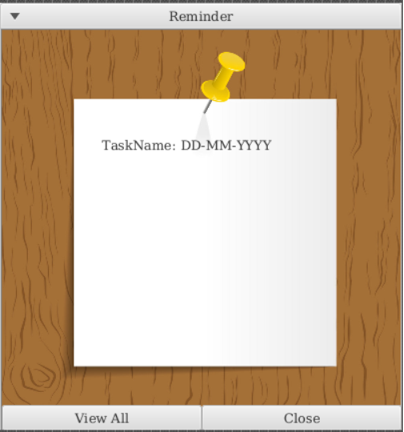

RemindMe User Guide v1.1
---
This user guide provide [start-up](#start--up) instructions as well as detailed descriptions and usage of
all the [features](#features) in the RemindMe app. You can also access the product website via this [link.](https://ay2021s2-cs2103t-w15-1.github.io/tp/)

## Table of Contents

* **[Introduction](#introduction)**
* **[Start-up](#Start--up)**
* **[Features](#features)**
    * **[1. Show Help Page : `help`](#Show-Help-Page)**
    * **[2. Turn On/Off Reminder: `remind`](#Turn-On/Off-Reminder)**
    * **[3. Add an Assignment/Event/Exam: `event/exam/assignment`](#Add-an-Assignment/Event/Exam)**
    * **[4. Delete an Assignment/Event/Exam: `delete (INDEX)`](#Deleteing-an-Assignment/Event)**
    * **[5. List Entries: `list`](#List-Entries)**
      * [5.1 List Assignments: `list assignments`](#List-Assignments)
      * [5.2 List Events: `list events`](#List-Events)
      * [5.3 List Exams: `list exams`](#List-Exams)
    * **[4. Edit an Entry: `edit`](#Edit-an-Entry)**
    * **[5. Locate Entries: `find`](#Locate-Entries)**
    * **[6. Calendar View: `calendar`](#Calendar-View)**
    * **[7. Clear Entries: `clear`](#Clear-Entries)**
    * **[8. Save the data](#Save-the-data)**
    * **[9. Edit the data file](#Edit-the-data-file)**
    * **[10. Exit the program: `exit`](#EXit-the-program)**
   
* **[Glossary](#glossary)**
* **[Command summary](#command-summary-(RemindMe))**

--------------------------------------------------------------------------------------------------------------------

## Introduction
RemindMe is a desktop app for keeping track of user events and deadlines,
optimized for use via Command Line Interface(CLI) while still having the benefits of a Graphic User Interface(GUI).

Objectives of RemindMe:
1. Allow students to be aware of deadlines of school events and exams.
2. Allow students to have a calendar view of their school curriculums/schedules. 

--------------------------------------------------------------------------------------------------------------------

## Start-up

1. Ensure you have Java 11 or above installed on your computer. You can download Java 11 via this [link.](https://www.oracle.com/sg/java/technologies/javase-jdk11-downloads.html)
   * If you are a Windows user, [here](https://java.tutorials24x7.com/blog/how-to-install-java-11-on-windows) is a tutorial on how to set up Java 11:

2. Download the latest RemindMe.jar from our GitHub release page.
Copy the file to the folder you want to use as the home folder for your RemindMe.
Double click the file to start the app. 
   

3. Alternatively, you can run the command line java -jar RemindMe.jar in your terminal to start the application.
Type the command in the command box and press Enter to execute it.
The GUI similar to the below should appear in a few seconds. Note how the app contains some sample data. 
      

4. Refer to the Features below for details of each command.

   * **`deadline`** `description by DD/MM/YYYY TIME`: Adds a task with a deadline.
     
   * **`ordered list`**: Displays an order list of items.
     
   * **`calendar`**: Dsiplays the calendar with the tasks' deadlines and friends' birthdays.
     
   * **`exit`** : Exits the app.

--------------------------------------------------------------------------------------------------------------------

## Features

**Notes about the command format:** 

* Words in `UPPER_CASE` are the parameters to be supplied by the user. 
  e.g. in `exam m/MODULE`, `MODULE` is a parameter which can be used as `add m/CS2103`.

* Items in square brackets are optional. 
  e.g `m/MODULE [t/TAG]` can be used as `m/CS21O3 t/final` or as `m/CS2103`.
  

* Extraneous parameters for commands that do not take in parameters (such as `help`, `list`, `exit` and `clear`) will be ignored. 
  e.g. if the command specifies `help 123`, it will be interpreted as `help`.

### Show Help Page : `help`

Shows a help page

Format: `help`

### Turn On/Off Reminder: `remind`

Turns on and off the reminder system. If remind is on,
a reminder would pop out when starting the app RemindMe regarding
the upcoming tasks.

Format: `remind`

Outcome:

* `reminder is turned on!`
* `reminder is turned off!`

### Add an Assignment/Event/Exam: `event/deadline`

Adds an assignment/event/exam with deadlines or/and module to the calendar.

Format: 

* `assignment m/MODULE /by DD/MM/YYYY TIME`
* `event d/DESCRIPTION /from DD/MM/YYYY TIME /to DD/MM/YYYY TIME`
* `exam m/MODULE /from DD/MM/YYYY TIME /to DD/MM/YYYY TIME`

Examples:
* `assignment CS2103 /by 03/03/2021 2359`
* `event Christmas Party /from 25/12/2021 1800 /to 25/12/2021 2300`
* `exam CS2103 /from 21/01/2021 1400 /to 21/01/2021/1600`

### Delete an Assignment/Event/Exam: `delete`

Deletes an assignment/event/exam from the calendar.

Format: 

* `delete /on (DD/MM/YYYY) /index (INDEX)`

Examples:
* `delete /on 25/12/2021 /index 1`

### List Entries : `list`

Shows a list of all assignments/events/exam deadlines sorted by date.

Format: `list`

### List Assignments : `list assignments`

Shows a list of all assignments sorted by date.

Format: `list assignments`

### List Events : `list events`
Shows a list of all events sorted by date.

Format: `list events`

### List Exams : `list exams`
Shows a list of all exams sorted by date.

Format: `list exams`

### Edit an Entry : `edit`

Edits an existing exam/event/assignment's date/module/tag in the RemindMe.

Format: `edit INDEX [m/MODULE] [d/DATE] [dd/deadline] [from/TIME to/TIME] [t/TAG]…​`

* Edits the exam/event/assignment's deadline at the specified `INDEX`. The index refers to the index number shown in the displayed person list. The index **must be a positive integer** 1, 2, 3, …​
* At least one of the optional fields must be provided.
* Existing values will be updated to the input values.
* When editing tags, the existing tags of the exam/event/assignment will be removed i.e adding of tags is not cumulative.
* You can remove all the person’s tags by typing `t/` without
    specifying any tags after it.

Examples:
*  `edit 1 p/exam d/2021-01-22` Edits the phone number and email address of the 1st person to be `91234567` and `johndoe@example.com` respectively.
*  `edit 2 p/assignment t/` Edits the name of the 2nd person to be `Betsy Crower` and clears all existing tags.

### Locate Entries: `find`

Finds entries whose contents contain any of the given keywords.

Format: `find KEYWORD [MORE_KEYWORDS]`

* The search is case-insensitive. e.g `math` will match `MATH`
* Only full words will be matched e.g. `math` will not match `maths`

Examples:
* `find math` returns `math exams` and `math assignment`

### Calendar View : `calendar`
Shows an image of the calendar with your reminders (e.g. tasks, assignments datelines, and friends’ birthday) for each specific dates.  
  
Format: `calendar`

### Clear Entries : `clear`

Clears all entries from the address book.

Format: `clear``

### Save the data

RemindMe save your data in the hard disk automatically after every command that changes the data. There is no need for you to save manually.

### Edit the data file

RemindME data are saved as a JSON file `[JAR file location]/data/remindme.json`. Advanced users are welcome to update data directly by editing that data file.

:exclamation: **Caution:**
If your changes to the data file makes its format invalid, RemindMe will discard all data and start with an empty data file at the next run.

### Exit the program : `exit`

Exits the program.

Format: `exit

## Glossary
* Module: Consists of a module ID and name.
* Assignment: Consists of a deadline, and the module involved.
* Exam: Consists of a start time, end time, date which it occurs on and the module involved.
* Event: Consists of a start time, end time and the date which it occurs on.

## Command Summary (RemindMe) 

Action | Format, Examples
--------|----------------
Add assignment | `(assignment type) (assignment description) (assignment details)`
Delete assignment | `delete (assignment description)`
View assignments | `view A`
View events | `view E`
Turn on/off reminder | `remind`
See commands available | `help`
View calendar | `calendar`
Save data | `save`
Edit data | `edit`

