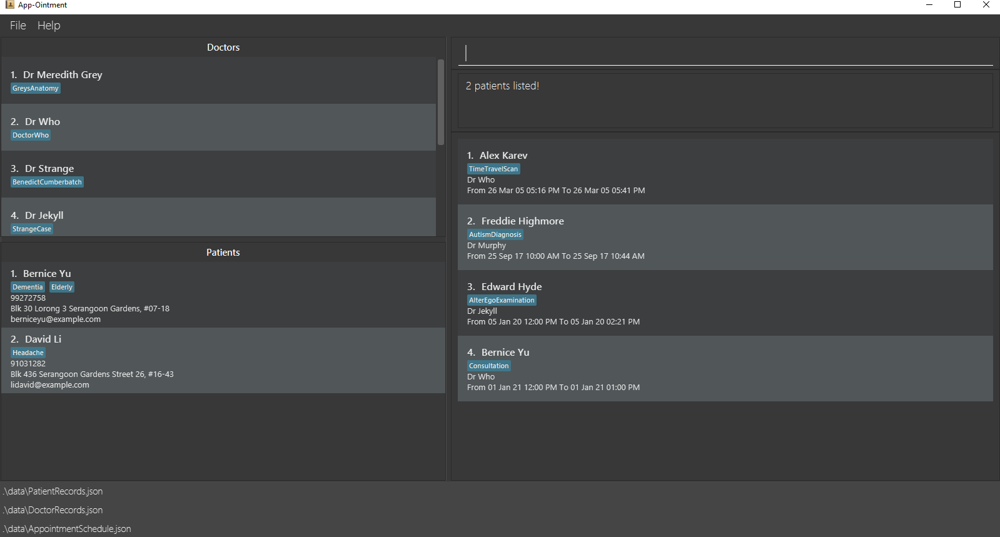
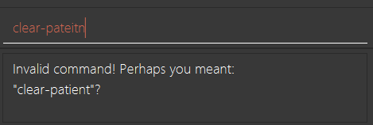

App-Ointment is a **desktop app for managing and scheduling patient appointments, optimized for use via a Command Line Interface (CLI)**, while still having the benefits of a Graphical User Interface (GUI). If you can type fast, App-Ointment can get your contact management tasks done faster than traditional GUI apps.

* Table of Contents
{:toc}

--------------------------------------------------------------------------------------------------------------------

## Quick start

1. Ensure you have Java `11` or above installed in your Computer.

2. Download the latest `App-Ointment.jar` from [here](https://github.com/AY2021S2-CS2103-W17-2/tp/releases).

3. Copy the file to the folder you want to use as the _home folder_ for your App-Ointment App.

4. Double-click the file to start the app. The GUI, similar to the image shown below, should appear in a few seconds. Note how the app contains some sample data. 
   

5. Type the command in the command box and press Enter to execute it. e.g. typing **`help`** and pressing Enter will open the help window. 
   Some example commands you can try:

   * **`list-appt`** : Lists all the appointments in the appointment schedule.

   * <code><b>add-patient</b> n/John Doe p/98765432 e/johnd@example.com a/John street, block 123, #01-01</code> : Adds a patient to the patient records.

   * <code><b>delete-appt</b> 3</code> : Deletes the 3rd appointment from the displayed appointment schedule.

   * **`clear-appt`** : Clears all appointments in the appointment schedule

   * **`exit`** : Exits the app.

6. Refer to the [Features](#features) below for details of each command.

--------------------------------------------------------------------------------------------------------------------

## Features

**:information_source: Notes about the command format:** 

* Words in `UPPER_CASE` are the parameters to be supplied by the user. 
  e.g. in `add n/NAME`, `NAME` is a parameter which can be used as `add n/John Doe`.

* Parameters in square brackets are optional. 
  e.g. `n/NAME [t/TAG]` can be used as `n/John Doe t/friend` or as `n/John Doe`.

* Parameters with `…`​ after them can be used multiple times (including zero times). 
  e.g. `[t/TAG]…​` can be used as ` ` (i.e. 0 times), `t/friend`, `t/friend t/family` etc.

* Parameters with prefixes (e.g. `n/`, `p/`, `t/`) can be in any order. 
  e.g. if the command format specifies `n/NAME p/PHONE_NUMBER`, `p/PHONE_NUMBER n/NAME` is also acceptable.

* If a parameter is expected only once in the command, and you specified it multiple times instead, only the last occurrence of the parameter will be taken. 
  e.g. if you specify `p/12341234 p/56785678`, only `p/56785678` will be taken.

* Where a parameter is not expected in the command, and you specified it, it will either be ignored, or included as part of the previous parameter. 
  e.g. if you specify `n/Doctor Who p/12341234` in `add-doctor` where the phone parameter is not expected, the app will interpret it as adding a doctor with name `Doctor Who p/12341234`, which is not allowed.

* Extraneous parameters for commands that do not take in parameters (such as `clear-appt`, `clear-doctor`, `clear-patient`, `exit`, `help`, `list-appt`, `list-doctor` and `list-patient`) will be ignored. 
  e.g. if the command specifies `help 123`, it will be interpreted as `help`.

 

### *Patient Commands*:

### Adding a patient: `add-patient`

Adds a patient to the patient records. 

Format: `add-patient n/NAME p/PHONE e/EMAIL a/ADDRESS [t/TAG]…​`

:bulb: <b>Tip:</b>

* The patient can have any number of tags (including 0). 

:bulb: <b>Tip:</b>

* When a tag is too long, an ellipsis will be automatically added to prevent overflow. 
It is recommended that tags not be too long to avoid this. 

* Emails without Top Level Domains(TLDs) eg. `a@b` without `.com` are valid emails, and will be regarded as such in the app.

* Phone numbers must contain only numbers, and should be at least 3 digits long. It has no maximum length. 

* Tags must be alphanumeric, i.e. no spaces. the same applies for all other commands which use Tags.

 

Examples:
* `add-patient n/John Doe p/98765432 e/johnd@example.com a/John street, block 123, #01-01`

### Clearing all entries in patient records: `clear-patient`
Clears all entries from the patient records.  

Format: `clear-patient`

* Entries in the patient records can only be cleared if there are no existing appointments in the appointment schedule.  
* Otherwise, `clear-appt` will have to be called first.  
* The above-mentioned requirements are similarly applicable to [`clear-doctor`](#clearing-all-entries-in-doctor-records-clear-doctor)

### Deleting a patient : `delete-patient`
Deletes the specified patient from the patient records. 

Format: `delete-patient [--force] INDEX`

* Deletes the patient at the specified `INDEX`.
* The index refers to the index number shown in the displayed patient records.
* The index **must be a positive integer** 1, 2, 3, …​
* The specified patient can only be deleted if there are no existing appointments associated with him/her in the appointment schedule.
  Otherwise, `--force` must be included before `INDEX` to force delete the specified patient, along with all associated appointments in the appointment schedule.
* The above-mentioned requirements are similarly applicable to [`delete-doctor`](#deleting-a-doctor--delete-doctor)

Examples:
* `list-patient` followed by `delete-patient 3` deletes the 3rd patient in the patient records.
* `list-patient` followed by `delete-patient --force 1` force deletes the 1st patient in the patient records and all associated appointments in the appointment schedule.
* `find-patient David` followed by `delete-patient 1` deletes the 1st patient in the results of the `find-patient` command.

### Editing a patient : `edit-patient`
Edits an existing patient in the patient records. 

Format: `edit-patient INDEX [n/NAME] [p/PHONE] [e/EMAIL] [a/ADDRESS] [t/TAG]…​`

* Edits the patient at the specified `INDEX`. The index refers to the index number shown in the displayed patient records. The index **must be a positive integer** 1, 2, 3, …​ 
* At least one of the optional fields must be provided. 
* Existing values will be updated to the input values. 
* When editing tags, the existing tags of the patient will be removed i.e. adding of tags is not cumulative. 
* You can remove all the patient’s tags by typing `t/` without specifying any tags after it. 
* Raises an exception if there are conflicts in the new appointment schedule for the patient and the doctor. 
* An `edit-patient` command that results in the patient having the same details as the original will still result in a success.

Examples:
* `edit 1 p/91234567 e/newEmail@example.com` Edits the phone umber and email address of the 1st patient to `91234567` and `newEmail@example.com` respectively.
* `edit-patient 2 n/Betsy Crower t/` Edits the name of the 2nd patient to be `Betsy Crower` and clears all existing tags.

### Locating patients by name: `find-patient`
Find patients whose names contain any of the given keywords. 

Format: `find-patient KEYWORD [MORE_KEYWORDS]`

* The search is case-insensitive. e.g. `edward` will match `Edward`.
* The order of the keywords does not matter. e.g. `Edward Charlotte` will match `Charlotte Edward`.
* Only the name is searched.
* Only full words will be matched e.g. `Edwar` will not match `Edward`.
* Patients matching at least one keyword will be returned (i.e. `OR` search).
  e.g. `Edward Charlotte` will return `Edward Hyde` and `Charlotte Oliveiro`.
* The above-mentioned requirements are similarly applicable to [`find-doctor`](#locating-doctors-by-name-find-doctor)

Examples:
* `find-patient John` returns `john` and `John Doe` 
* `find-patient bernice david` returns `Bernice Yu` and `David Li` 
  

### Listing all patients : `list-patient`
Changes the displayed patient records to show all patients in the patient records. 

Format: `list-patient`

 

### *Doctor Commands*:

### Adding a doctor: `add-doctor`

Adds a doctor to the doctor records. 

Format: `add-doctor n/NAME [t/TAG]…​`

:bulb: <b>Tip:</b>

* The doctor can have any number of tags (including 0). 

:bulb: <b>Tip:</b>

* When a tag is too long, an ellipsis will be automatically added to prevent overflow. 
It is recommended that tags not be too long to avoid this. 

 

Examples:
* `add-doctor n/Dr Meredith Grey`
* `add-doctor n/Dr Strange t/Dormammu t/IveComeToBargain`

### Clearing all entries in doctor records: `clear-doctor`
Clears all entries from the doctor records.  

Format: `clear-doctor`  

Similar requirements as [`clear-patient`](#clearing-all-entries-in-patient-records-clear-patient)  

### Deleting a doctor : `delete-doctor`
Deletes the specified doctor from the doctor records. 

Format: `delete-doctor [--force] INDEX`  

Similar requirements as [`delete-patient`](#deleting-a-patient--delete-patient)  

Examples:
* `list-doctor` followed by `delete-doctor 3` deletes the 3rd doctor in the doctor records.
* `list-doctor` followed by 'delete-doctor --force 1' force deletes the 1st doctor in the doctor records, along with all associated appointments in the appointment schedule.
* `find-doctor Drake` followed by `delete-doctor 1` deletes the 1st doctor in the results of the `find-doctor` command.

### Editing a doctor : `edit-doctor`
Edits an existing doctor in the doctor records. 

Format: `edit-doctor INDEX [n/NAME] [t/TAG]…​`

* Edits the doctor at the specified `INDEX`. The index refers to the index number shown in the displayed doctor records. The index must be a **positive integer** 1, 2, 3, …​ 
* At least one of the optional fields must be provided. 
* Existing values will be updated to the input values. 
* When editing tags, the existing tags of the doctor will be removed i.e. adding of tags is not cumulative. 
* You can remove all the doctor’s tags by typing `t/` without specifying any tags after it. 
* Raises an exception if there are conflicts in the new appointment schedule for the patient and the doctor. 
* An `edit-doctor` command that results in the doctor having the same details as the original will still result in a success.

Examples:
* `edit-doctor 1 n/Dr Amy` Edits the 1st doctor's name to Dr Amy.
* `edit-doctor 2 n/Dr Betsy Crower t/` Edits the name of doctor under the 2nd displayed doctor record to be Betsy Crower and clears all existing tags.

### Locating doctors by name: `find-doctor`
Find doctors in the doctor records whose names contain any of the given keywords. 

Format: `find-doctor KEYWORD [MORE_KEYWORDS]`

Similar requirements as [`find-patient`](#locating-patients-by-name-find-patient)  

Examples:
* `find-doctor murphy who` returns `Dr Murphy` and `Dr Who` 

### Listing all doctors : `list-doctor`
Changes the displayed doctor records to show all doctors in the doctor records. 

Format: `list-doctor`

 

### *Appointment Commands*:

### Adding an appointment: `add-appt`

Adds an appointment to the schedule. 

Format: `add-appt pt/PATIENT_INDEX dr/DOCTOR_INDEX at/TIMESLOT_START [to/TIMESLOT_END] [dur/TIMESLOT_DURATION] [t/TAG]…​`

* The `PATIENT_INDEX` corresponds to the patient at the index number in the current displayed patient records. 

* The `DOCTOR_INDEX` corresponds to the doctor at the index number in the current displayed doctor records. 

* The `PATIENT_INDEX` and `DOCTOR_INDEX` must be a <strong>positive integer</strong> 1, 2, 3, …​ 

* The `TIMESLOT_START` and `TIMESLOT_END` must be either in an [acceptable datetime format](#Acceptable DateTime Formats) or prefixed with keyword `NEXT` followed by a datetime unit (DAY, MONTH, YEAR) or weekday (MONDAY, TUESDAY …​) 

* Where both fields `TIMESLOT_END` and `TIMESLOT_DURATION` are provided, priority is granted to `TIMESLOT_END`. 

* Raises an exception if there are conflicts in schedule for the patient or the doctor. 

:bulb: <b>Tip:</b>

* The appointment can have any number of tags (including 0). It is recommended to use the tags to define the purpose of the appointment. 

:bulb: <b>Tip:</b>

* When a tag is too long, an ellipsis will be automatically added to prevent overflow. 
It is recommended that tags not be too long to avoid this. 

 

Examples:

* `add-appt pt/1 dr/3 at/2021-01-01 00:00 to/2021-01-01 01:30 t/severe t/brainDamage`

* `add-appt pt/2 dr/2 at/2021-01-01 00:00 dur/1H 30M t/exhaustion`

* `add-appt pt/3 dr/1 at/NEXT MONDAY dur/1H 30M`

### Clearing all entries in appointment schedule: `clear-appt`
Clears all entries from the appointment schedule. 

Format: `clear-appt`

### Deleting an appointment : `delete-appt`
Deletes the specified appointment from the schedule.

Format: `delete-appt INDEX`
* Deletes the appointment at the specified `INDEX`.
* The index refers to the index number shown in the displayed appointment list.
* The index **must be a positive integer** 1, 2, 3, …​

Examples:
* `list-appt` followed by `delete-appt 2` deletes the 2nd appointment in the entire appointment schedule.
* `find-appt n/Alex` followed by `delete-appt 1` deletes the 1st appointment in the results of the `find-appt` command.

### Editing an appointment : `edit-appt`

Edits an existing appointment in the appointment schedule. 

Format: `edit-appt APPOINTMENT_INDEX [pt/PATIENT_INDEX] [dr/DOCTOR_INDEX] [at/TIMESLOT START] [to/TIMESLOT END] [dur/TIMESLOT DURATION] [t/TAG]…​`

* Edits the appointment for the patient specified by the `APPOINTMENT_INDEX`. The `APPOINTMENT_INDEX` refers to the index number shown in the displayed appointment schedule. The index **must be a positive integer** 1, 2, 3, …​ 

* At least one of the optional fields must be provided  

* Existing values will be updated to the input values. 

* When editing tags, the existing tags of the appointment will be removed i.e. adding of tags is not cumulative. 

* You can remove all the person’s tags by typing t/ without specifying any tags after it. 

* Raises an exception if there are conflicts in the new appointment with the existing appointments. 

* An `edit-appt` command that results in the appointment having the same details as the original will still result in a success.

* The starting time of an appointment can be updated by command `edit-appt INDEX at/`  
  
* The duration of an appointment can be updated by command `edit-appt INDEX dur/`  

* The end time of an appointment can be updated by command `edit-appt INDEX to/`  

Examples:

* `edit-appt 1 pt/1 dr/2` Edits the appointment at index 1 to assign the patient at index 1 and doctor at index 2.

* `edit-appt 2 at/2021-05-08 09:00 dur/1H t/severe t/fever` Edits the appointment at index 2 to assign a timeslot at 8 May 2021 9AM for a duration of 1 hour and tag the appointment with severe and fever tags.

### Locating appointments by fields : `find-appt`
Find appointments with details that contain any of the given keywords.  

Format: `find-appt [pt/PATIENT_NAME] [MORE_KEYWORDS] [dr/DOCTOR_NAME] [MORE_KEYWORDS] [at/TIMESLOT_START] [MORE_KEYWORDS] [t/TAG] [MORE_KEYWORDS]`

* At least one of the optional fields must be provided. 

* The search is case-insensitive. e.g `pt/alex` will match `pt/Alex` 

* Only full words will be matched. e.g. `pt/freddi` will not match `pt/freddie` 

* Search fields require at least one keyword to be matched in the field description for the search condition of that field to be satisfied. e.g. `find-appt pt/Alex Edward` will match both appointments with patients `Alex Karev` and `Edward Hyde`.

* Where `at/TIMESLOT_START` field is specified, the search is conditioned on the satisfaction of either or both the date and time elements. e.g.:
  * `find-appt at/05-08-2021 12:00pm` will match appointments that satisfy both the date and time elements.
  * `find-appt at/12:00pm` will match all appointments that occur at time `12:00pm`
  * `find-appt at/05-08-2021` will match all appointments that occur on date `05-08-2021`
* Where multiple search fields are specified, the search is conditioned on the satisfaction of <strong>all</strong> of the search fields' subconditions. e.g. `find-appt n/Alex Edward Bo dr/Jekyll` will match appointments that satisfy both:
  - Jekyll in the assigned doctor's name; and
  - Either Alex or Edward in the patient's name.

Examples:
* `find-appt pt/john alex` returns appointments with patients `john`, `John`, `John Doe`, `alex`, `Alex` and `Alex Anderson`.

* `find-appt dr/Grey Who t/BrainSurgery` returns appointments with doctors `grey` or `who` and are tagged as `BrainSurgery`.

### Listing all appointments : `list-appt`

Changes the displayed appointment list to show all appointments in the appointment schedule. 

Format: `list-appt`

### *Overall Commands*:

### Exiting the program : `exit`

Exits the program.

Format: `exit`

### Viewing help: `help`
Shows a message with an url to this User Guide webpage.

Format: `help`  

### Entering an Invalid Command:
Entering an invalid command will result in the app throwing an exception, and prompting the user the closest known command, based on the smallest `minimum edit distance` (minimum amount of additions, deletions, and replacements). 

This feature is meant for identifying typographical errors, and as such, no other form of Natural Language Processing (NLP) is used. If the edit distance is too much (above 10 edits), `Unknown command` will be displayed.

Examples:
* `delete-appppt` prompts `delete-appt`
* `list` prompts `exit`
* `too-long-command` returns `Unknown command`

### Toggle User Inputs: <kbd>&uarr;</kbd>/<kbd>&darr;</kbd>
Format: <kbd>&uarr;</kbd>/<kbd>&darr;</kbd>

Toggles between previous inputs keyed into the Command Box previously. Returns user to a *blank* Command Box upon keying <kbd>&darr;</kbd> on the most recent input.

### Saving the data

App-Ointment data are saved in the hard disk automatically after any command that changes the data. There is no need to save manually.

### Editing the data file

App-Ointment data are saved as 3 JSON files:
`[JAR file location]/data/PatientRecords.json`
`[JAR file location]/data/DoctorRecords.json`
`[JAR file location]/data/AppointmentSchedule.json`
Advanced users are welcome to update data directly by editing the data files.
Do note that adding entries into the patient and doctor records will require a UUID Version 4 generator.

:exclamation: <b>Caution:</b>
If your changes to the data files makes its format invalid, App-Ointment will discard the data file that is invalid and start with an empty data file at the next run.

 

--------------------------------------------------------------------------------------------------------------------

## Acceptable DateTime Formats
Must be any of:
### Date:
+ DD-MM-YYYY
+ DD-MM-YY
+ YYYY-MM-DD
+ DD/MM/YYYY
+ DD/MM/YY
+ next DAY [MONDAY, TUESDAY, ...]
+ next month
+ next year

### Time:

+ hh:mm (In 24-Hour format)
+ hh:mmam/pm
  
### Valid Examples:
+ 12/12/21 01:15pm
+ 12-12-21 13:15
+ next monday 13:12
+ next monday
+ next month 14:00

:bulb: <b>Tip:</b>

* Inputs with the `next` keywords **without a user-specified time** will reflect the current time when the command is entered. For example, `add-appt pt/1 dr/1 at/next monday` when entered on *07/04/2021 12:00* will result in an appointment added on *12/04/2021 12:00*.
* `next DAY` inputs must be spelt correctly and fully. Inputs such as`at/next MONDAYXX` or `at/next MON` is restricted.  

 

--------------------------------------------------------------------------------------------------------------------

## FAQ

**Q**: How do I transfer my data to another Computer? 
**A**: Install the app in the other computer and overwrite the empty data file it creates with the file that contains the data of your previous App-Ointment home folder.

--------------------------------------------------------------------------------------------------------------------

## Command summary

| Action            | Format                                  | Examples                                           |
|-------------------|-----------------------------------------|----------------------------------------------------|
| **add-patient** | `add-patient n/NAME p/PHONE e/EMAIL a/ADDRESS [t/TAG]…​` | `add-patient n/John Doe p/98765432 e/johnd@example.com a/John street, block 123, #01-01` |
| **clear-patient** | `clear-patient` | |
| **delete-patient** | `delete-patient INDEX` | `delete-patient 2` |
| **edit-patient** | `edit-patient INDEX [n/NAME] [p/PHONE] [e/EMAIL] [a/ADDRESS] [t/TAG]…​` | `edit-patient 1 e/newEmail@example.com`  `edit-patient 2 n/Betsy Crower t/` |
| **find-patient** | `find KEYWORD [MORE_KEYWORDS]` | `find John` `find bernice david` |
| **list-patient** | `list-patient` | |
| **add-doctor** | `add-doctor n/NAME [t/TAG]…​` | `add-doctor n/Dr John Doe` |
| **clear-doctor** | `clear-doctor` | |
| **delete-doctor** | `delete-doctor INDEX` | `delete-doctor 2` |
| **edit-doctor** | `edit-doctor INDEX [n/NAME] [t/TAG]…​` | `edit-doctor 1 n/Dr Amy` `edit-doctor 2 n/Dr Betsy Crower t/` |
| **find-doctor** | `find-doctor KEYWORD [MORE_KEYWORDS]` | `find Amy` `find Amy Betsy` |
| **list-doctor** | `list-doctor` | |
| **add-appt** | `add-appt pt/PATIENT_INDEX dr/DOCTOR_INDEX at/TIMESLOT_START [to/TIMESLOT_END] [dur/TIMESLOT_DURATION] [t/TAG]…​` | `add-appt pt/1 dr/1 at/2021-01-01 00:00 to/2021-01-01 01:30 t/severe t/brainDamage` `add-appt pt/2 dr/2 at/2021-01-01 00:00 dur/1H 30M t/exhaustion` `add-appt pt/3 dr/3 at/NEXT MONDAY dur/1H 30M` |
| **clear-appt** | `clear-appt` | |
| **delete-appt** | `delete-appt INDEX` | `delete-appt 2` |
| **edit-appt** | `edit-appt APPOINTMENT_INDEX [pt/PATIENT_INDEX] [dr/DOCTOR_INDEX] [at/TIMESLOT_START] [to/TIMESLOT_END] [dur/TIMESLOT_DURATION] [t/TAG]…​` | `edit-appt 1 pt/1 dr/1` `edit-appt 2 at/2021-05-08 09:00 dur/1H t/severe t/fever` |
| **find-appt** | `find [n/PATIENT KEYWORDS] [dr/DOCTOR_KEYWORDS] [d/DATETIME] [p/PHONE] [e/EMAIL] [a/ADDRESS_KEYWORDS] [t/TAG KEYWORDS]` | `find n/john alex` `find dr/Grey Who t/BrainSurgery` |
| **list-appt** | `list-appt` | |
| **exit** | `exit` | |
| **help** | `help` | |
