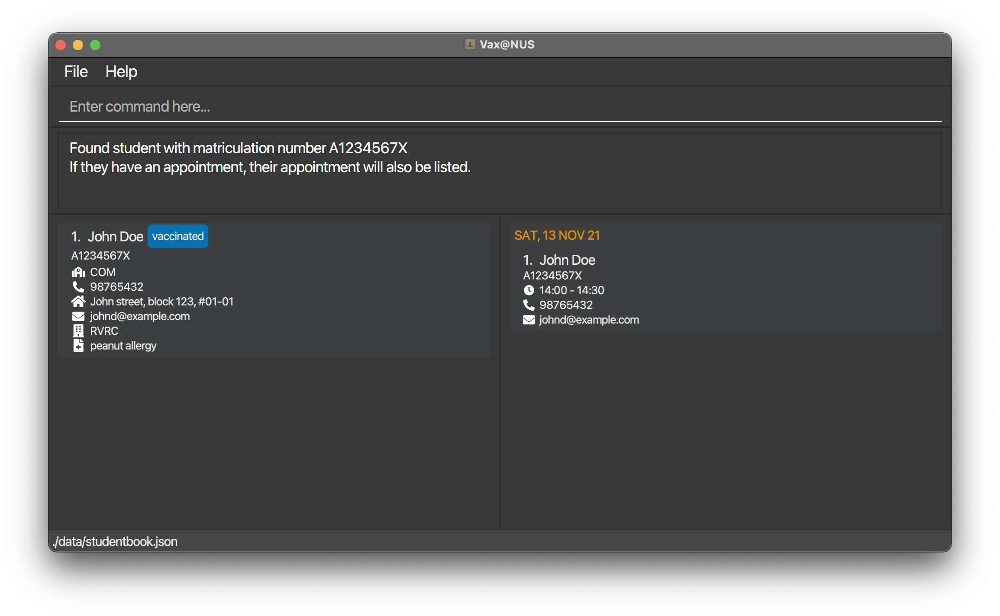

Vax@NUS is a **one stop management app to efficiently track and schedule COVID-19 vaccinations for NUS students.** It is a desktop app **optimized for use via a Command Line Interface (CLI)** while still having the benefits of a Graphical User Interface (GUI). If you can type fast, Vax@NUS can get your appointment management tasks done faster than traditional GUI apps.

* Table of Contents
{:toc}

:information_source: This icon indicates helpful notes 

--------------------------------------------------------------------------------------------------------------------

## Quick start

1. Ensure you have Java `11` or above installed in your Computer.

1. Download the latest `VaxAtNUS.jar` from [here](https://github.com/AY2021S2-CS2103T-W10-4/tp/releases).

1. Copy the file to the folder you want to use as the _home folder_ for your Vax@NUS application.

1. Double-click the file to start the app. The GUI similar to the below should appear in a few seconds. Note how the app contains some sample data. 
   

1. Type the command in the command box and press Enter to execute it. e.g. typing **`help`** and pressing Enter will open the help window. 
   Some example commands you can try:

   * **`list`** : Lists all data.
   * **`exit`** : Exits the app.

1. Refer to the [Features](#features) below for details of each command.

--------------------------------------------------------------------------------------------------------------------

## Parameter Formats

**:information_source: NOTE: The following parameter formats must be followed:**
> The `MATRICULATION_NUMBER` of a student is a unique 9-character alphanumeric sequence that begins with A, followed by
> 7 numbers and ends with an alphabet.

> The `FACULTY` of a student must be one of the following:
> * FASS (for Faculty of Arts and Social Sciences)
> * BIZ (for NUS Business School)
> * COM (for School of Computing)
> * SCALE (for School of Continuing and Lifelong Education)
> * DEN (for Faculty of Dentistry)
> * SDE (for School of Design and Environment)
> * DNUS (for Duke-NUS Medical School)
> * ENG (for Faculty of Engineering)
> * ISEP (for Integrative Sciences and Engineering)
> * LAW (for Faculty of Law)
> * MED (for Yong Loo Lin School of Medicine)
> * MUSIC (for Yong Siew Toh Conservatory of Music)
> * SPH (for Saw Swee Hock School of Public Health)
> * SPP (for Lee Kuan Yew School of Public Policy)
> * SCI (for Faculty of Science)
> * USP (for University Scholars Programme)
> * YNC (for Yale-NUS College)

> The `VACCINATION_STATUS` of a student must only be `vaccinated` or `not vaccinated`

> The `[SCHOOL_RESIDENCE]` of a student must be one of the following:
> * PGPH (for Prince George's Park House)
> * PGPR (for Prince George's Park Residences)
> * KE7H (for King Edward VII Hall)
> * SH (for Sheares Hall)
> * KRH (for Kent Ridge Hall)
> * TH (for Temasek Hall)
> * EH (for Eusoff Hall)
> * RH (for Raffles Hall)
> * RVRC (for Ridge View Residential College)
> * YNC (for Yale-NUS College)
> * TC (for Tembusu College)
> * CAPT (for College of Alice and Peter Tan)
> * RC4 (for Residential College 4)
> * USP (for University Scholars Programme)
> * UTR (for Utown Residences)

----------------------------------------------------------------------

## Features

**:information_source: NOTE ABOUT THE COMMAND FORMAT :** 

* Words in `UPPER_CASE` are the parameters to be supplied by the user. 
  e.g. in `add n/NAME`, `NAME` is a parameter which can be used as `add n/John Doe`.

* Items in square brackets are optional. 
  e.g `n/NAME [r/SCHOOL RESIDENCE]` can be used as `n/John Doe r/RC4` or as `n/John Doe`.
  
* Parameters can be in any order. 
  e.g. if the command specifies `n/NAME p/PHONE_NUMBER`, `p/PHONE_NUMBER n/NAME` is also acceptable.

* If a parameter is expected only once in the command but you specified it multiple times, only the last occurrence of the parameter will be taken. 
  e.g. if you specify `p/12341234 p/56785678`, only `p/56785678` will be taken.

* Extraneous parameters for commands that do not take in parameters (such as `help`, `list`, `exit` and `clear`) will be ignored. 
  e.g. if the command specifies `help 123`, it will be interpreted as `help`.
  

### Adding a student record: `add`

Adds a student to Vax@NUS records.

Format: `add n/NAME i/MATRICULATION_NUMBER f/FACULTY p/PHONE_NUMBER e/EMAIL a/ADDRESS s/VACCINATION_STATUS m/MEDICAL_DETAILS r/SCHOOL_RESIDENCE[optional]`

Examples:
* `add n/John Doe i/A1234567X f/COM p/98765432 e/johnd@example.com a/John street, block 123, #01-01 s/vaccinated m/peanut allergy r/RVRC`
* `add n/Betsy Crowe f/ENG i/A7654321J p/91119222 e/betsycrowe@example.com a/212 Orchard Road, #18-08 s/not vaccinated m/nose lift surgery in 2012`

| Before        | 
| ------------- |
|

| After        | 
| ------------- |
||

### Editing a student record: `edit`

Edits a student in Vax@NUS records.

Format: `edit INDEX [n/NAME] [i/MATRICULATION_NUMBER] [f/FACULTY] [p/PHONE] [e/EMAIL] [a/ADDRESS] [s/VACCINATION_STATUS] [m/MEDICAL_DETAILS] [r/SCHOOL_RESIDENCE]`

* Edits the student at the specified INDEX. The index refers to the index number shown in the displayed student list. The index must be a positive integer 1, 2, 3, …​
* At least one of the optional fields must be provided.
* Existing values will be updated to the input values.

Examples:

* `edit 1 p/91234567 f/MED` Edits the phone number and faculty of the first student to be 91234567 and MED respectively.

* `edit 2 r/KRH`  Edits the school residence of the second student to be KRH.

### Deleting a student record: `delete`

Deletes the student specified by his/her matriculation number from Vax@NUS records.

Format: `delete MATRICULATION NUMBER`

* If the matriculation number does not exist in the records, a message will be shown to inform users that 
  the matriculation number is not found.
  

Examples:
* `delete A7654321J` deletes Betsy Crowe from the records.

### Filtering all student records: `filter`

Shows all student records in Vax@NUS that matches the specified vaccination status, faculty or school residence.

Format:  
`filter VACCINATION_STATUS`
`filter FACULTY`
`filter SCHOOL_RESIDENCE`

* Please refer to the parameter formats for a list of valid vaccination status, faculty and school residence input. 

Examples:
* `filter vaccinated` or `filter not vaccinated`
* `filter COM` 
* `filter RVRC` 

### Viewing statistics for student population: `stats`

Displays the statistics in terms of percentage of student vaccinated for the requested faculty/school residence or whole of NUS. 

Format:  
`stats FACULTY`
`stats SCHOOL_RESIDENCE`
`stats NUS`
`stats all`

* If there is no available data for the requested faculty or school residence, a message will be displayed to inform
  users that the requested faculty or School Residence has no available data.

Examples:
* `stats COM` displays the percentage of vaccinated students in School of Computing.
* `stats RC4` displays the percentage of vaccinated students in RC4.
* `stats DOES_NOT_LIVE_ON_CAMPUS` displays the percentage of vaccinated students not living on campus.
* `stats NUS` displays the percentage of vaccinated students in NUS.
* `stats all` displays the list of percentages of vaccinated students in every Faculty and School Residence.

Sample Output for `stats All`:

Sample Output for `stats PGPH`:

### Adding an appointment: `addAppt`

Adds an appointment to Vax@NUS' records. 

Format: `addAppt i/MATRICULATION_NUMBER d/DATE ts/START_TIME`

* Date must be of the format `YYYY-MM-DD`
* Time must be of the format `HH:00` or `HH:30`
* The student that the appointment is for must exist in the records before the appointment can be created.

Examples:
* `addAppt i/A1234567X d/2021-12-13 ts/13:00`
* `addAppt i/A7654321J d/2021-12-13 ts/14:00`

| Before        | 
| ------------- |
|

| After        | 
| ------------- |
||

### Editing an appointment: `editAppt`

Edits an appointment present in Vax@NUS records by referencing the student's matriculation number.

Format: `editAppt MATRICULATION_NUMBER d/DATE_YYYY-MM-DD ts/START_TIME_HH:MM`

* The edited appointment must not clash with an existing appointment.
* If two matriculation numbers dates or start time are provided, the first one will be taken.
  
  **i.e.** if `A1234567X A7654321J` is provided, then `A1234567X` will be used. 
* If two dates or times are provided, the first of each will be taken 
 
  **i.e.** if `d/2021-12-13 d/2021-12-14 ts/14:00 ts/15:00` is provided, `2021-12-13` and `14:00` will be used. 

Examples:
* `editAppt A1234567X d/2021-12-13 ts/14:00`
* `editAppt A7654321J d/2021-12-13 ts/14:00`

### Deleting an appointment: `deleteAppt`

Deletes the appointment of the student with the specified matriculation number from Vax@NUS' records. 

Format: `deleteAppt MATRICULATION_NUMBER`

* If the matriculation number or appointment does not exist in the records, a message will be displayed to inform users that
  the matriculation number or appointment is not found.

Examples:
* `deleteAppt A7654321J` deletes Betsy Crowe's appointments from the records, provided she had an appointment scheduled previously.

### Viewing statistics for appointments: `statsAppt`
Displays the number of upcoming and previous appointments within 6 days from the current day and includes the day itself.

Format:  
`statsAppt`

### Listing all data : `list`

Shows a list of all students and all appointments in Vax@NUS records.

Format: `list`

### Finding a student and their appointment : `find`

Shows personal information, including appointment details if present, of the student that matches the specified matriculation number.

Format: `find MATRICULATION_NUMBER`

* If the matriculation number does not exist in the records, a message will be shown to inform users that 
  the matriculation number is not found.
* If the student found does not have an appointment, the appointment list will appear as empty.
  
Examples:
* `find A0175678U` shows Bernice Yu's personal information, and her appointment details if it is present.

### Viewing help : `help`

Display a pop-up window showing a list of commonly used commands in Vax@NUS and a link to our User Guide. 

Format: `help`

### Clearing all data : `clear`

Clearing all the data from Vax@NUS.

Format: `clear`

### Exiting the program : `exit`

Exits the program.

Format: `exit`

### Saving the data

Vax@NUS saves your current date in the hard disk automatically after any command. There is no need to save manually.

--------------------------------------------------------------------------------------------------------------------

## FAQ

**Q**: What do I do if I accidentally deleted a student? 
 
**A**: We regret to inform you that deletion is permanent. You will have to manually re-add the student.

**Q**: What can be included in medical details?
 
**A**: Allergies and past medical history.

**Q** : Will I be able to add other types of appointments besides vaccination appointments?
 
**A** : No, the current version only allows you to add vaccination appointments and not any other type of appointments. 

**Q** : Am I able to reassign an appointment to another student?
 
**A** : No, you will need to add a new appointment for the new student. 

--------------------------------------------------------------------------------------------------------------------

## Command Summary

Action | Format, Examples
--------|------------------
**Add Student** | `add n/NAME i/MATRICULATION_NUMBER f/FACULTY p/PHONE_NUMBER e/EMAIL a/ADDRESS s/VACCINATION_STATUS m/MEDICAL_DETAILS r/SCHOOL_RESIDENCE[optional]`   e.g., `add n/John Doe i/A1234567X f/COM p/98765432 e/johnd@example.com a/John street, block 123, #01-01 s/vaccinated m/peanut allergy r/RVRC`
**Edit Student** | `edit INDEX [n/NAME] [i/MATRICULATION_NUMBER] [f/FACULTY] [p/PHONE] [e/EMAIL] [a/ADDRESS] [s/VACCINATION_STATUS] [m/MEDICAL_DETAILS] [r/SCHOOL_RESIDENCE]`   e.g., `edit 1 p/91234567 f/MED`
**Delete Student** | `delete MATRICULATION_NUMBER` e.g., `delete A1234567X`
**Filter Students** | `filter VACCINATION_STATUS`  e.g., `filter vaccinated`, `filter not vaccinated`,   `filter FACULTY ` e.g., `filter COM`   `filter SCHOOL_RESIDENCE` e.g., `filter RVRC` 
**View Student Statistics** | `stats FACULTY` e.g., `stats COM`   `stats SCHOOL_RESIDENCE` e.g., `stats RC4`   `stats NUS`   `stats all` 
**Add Appointment** | `addAppt i/MATRICULATION_NUMBER d/DATE ts/START_TIME` e.g., `addAppt i/A1234567X d/2021-12-13 ts/13:00`
**Edit Appointment** | `editAppt MATRICULATION_NUMBER d/DATE_YYYY-MM-DD ts/START_TIME_HH:MM` e.g.,` editAppt A1234567X d/2021-12-13 ts/14:00`
**Delete Appointment** | `deleteAppt MATRICULATION_NUMBER` e.g., `deleteAppt A1234567X`
**View Appointment Statistics** | `statsAppt`
**List All Data** | `list`
**Find Student and Appointment** | `find MATRICULATION_NUMBER` e.g., `find A1234567X`
**View Help** | `help` 
**Clear All Data** | `clear` 
**Exit Program** | `exit`

