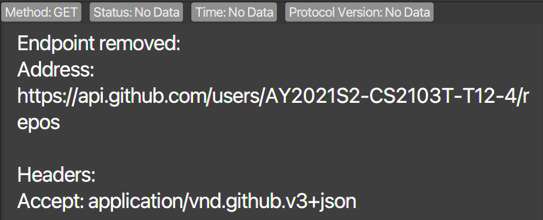
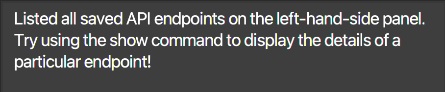
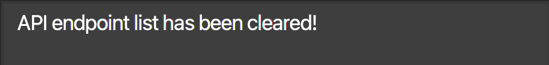
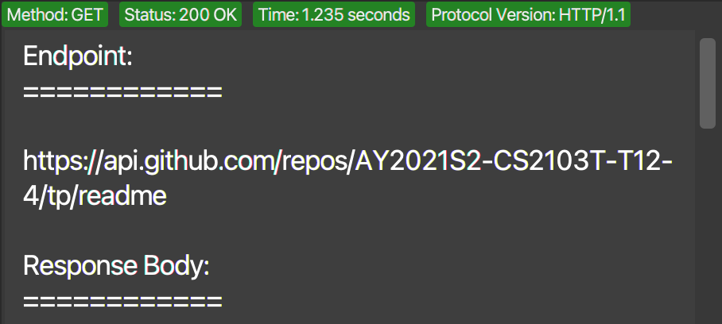
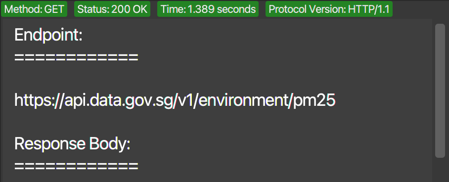

  

<h1 class="post-title">{{ page.title | escape }}</h1>
<h3 class="post-subtitle">v1.2b</h3>

 

## Table of Contents
{:.no_toc}

* Table of Contents 
{:toc}

## 1. Welcome to imPoster

Are you an aspiring API developer? Or would you like a peek into the world of how applications communicate with one another? Then **imPoster** is the app just for you! But hold on, what is imPoster?

imPoster is a desktop application for beginners of API development to quickly grasp the basics. Whether you are looking to **explore**, **test**, or **build** your very own APIs, the simple and minimalistic style of imPoster will quickly get you up and going.

This user guide assumes its users to have a **basic understanding** of APIs. If you are wondering [what an API is](#81-what-is-an-api), an appendix has been provided for users who may be unfamiliar with the concept. However, it is highly recommended for users to refer to proper tutorial contents for the basics of APIs prior to using the application.

For fast typists, imPoster is also highly optimised for the command line and can be fully operated through keyboard commands. Users who are familiar with **CURL** will also be happy to know that we share a very similar command line syntax. If you have yet to do so, be sure to download our [latest releases](https://imposter-dev.tk) from our main website and give us a try!

## 2. Navigating the User Guide

Before diving into the rest of the contents in our user guide, the following are some important syntaxes to take note of to facilitate your reading:

| Syntax              | Description                                    |
| ------------------- | ---------------------------------------------- |
| **Bold**            | Important words to note                        |
| <kbd>Keyboard</kbd> | Keyboard actions                               |
| 
:bulb: Tips
 | Useful tips |
| 
:exclamation: Caution
 | Things to watch out for |
|  | Annotations |
| `Markdown`          | Indicates full or part of a user command       |
| UPPER_CASE          | Parameters of a user command                   |
| [Square Brackets]   | Optional parameters of a user command          |
| ...                 | Parameters that may be added multiple times    |

## 3. Quickstart

1. Ensure you have **Java 11 or above** installed in your Computer.

1. Download the latest **imposter.jar** from
   [here](https://github.com/AY2021S2-CS2103T-T12-4/tp/releases).

1. Move the file to the folder you wish to use as the **home folder** for
   imPoster.

1. **Double-click** the file to start the application. A graphical user interface (GUI) similar to the one
   below should appear after a few seconds. Note the **4 main components** in the layout of the application: 

  

1. Try making your first API call through our application with the first endpoint shown in the **Endpoint List**. Type `send 1` in the **Command Box** and then press <kbd>Enter</kbd>.
2. After which, try scrolling through the responses shown in the **Result Display** as well!
3. For a quick **overview** of all available commands, please refer to our [Command Summary](#6-command-summary).
4. For the **details** of each command, please proceed to the next section on [Commands](#4-commands).

**Note:** imPoster data are saved automatically into a JSON file `[JAR file location]/data/imposter.json` after any command that changes the data. Advanced users are welcome to update data directly by editing that data file.

:exclamation: **Caution:**
imPoster will start with an empty file if a modification to it causes the data to be invalid.

## 4. Commands

Commands are classified into 2 categories, namely **general** and **endpoint**. Before diving into the details, let us first look at what makes up a command:

| Component    | Description                                                           |
| ------------ | --------------------------------------------------------------------- |
| Command Word | The keyword representing the action of the command                    |
| Prefix       | The keyword to recognise command parameters                           |
| Parameters   | Follows directly behind a prefix and contains the corresponding value |

As an example, a basic command to add an endpoint could look like the following:

`add -x GET -u https://google.com`

In the above example, `add` is the command word, `-x` and `-u` are the prefixes while `GET` and `https://google.com` are the parameters. Note that the parameters allowed differ for each command and may be optional. For your convenience, a list of all parameters along with their prefixes and descriptions have been included in the following table:

| Parameter    | Prefix | Description                                                           |
| ------------ | ------ | --------------------------------------------------------------------- |
| INDEX        |  None  | The index of the endpoint as shown in the endpoint panel list         |
| THEME        |  None  | The theme for the application                                         |
| METHOD       |   -x   | The [request method](#83-request-methods) to use for an endpoint      |
| ADDRESS      |   -u   | The URL to use for an endpoint                                        |
| HEADER       |   -h   | The header to use for an endpoint **(must be enclosed with "")**      |
| DATA         |   -d   | The data to use for an endpoint **(must be in JSON format)**          |
| TAG          |   -t   | The tag to label an endpoint                 |

:bulb: **Tip:**
Being familiar with the <a href="#2-navigating-the-user-guide"> syntaxes </a> will allow you to navigate the user guide even more easily

### 4.1 General

General commands are typically basic commands that are unrelated to API endpoints.

#### 4.1.1 View help: `help`

**Description:** Get the link to the user guide to the application in the form of a pop up window.

**Format:** `help`

**Example:** `help`

#### 4.1.2 Toggle theme: `toggle`

**Description:** Toggle the theme for the application.

**Format:** `toggle THEME`

**Example:** `toggle light`

  

#### 4.1.3 Exit program: `exit`

**Description:** Exit the application.

**Format:** `exit`

**Example:** `exit`

### 4.2 Endpoint

Endpoint commands, as the name suggest, deals with API endpoints.

#### 4.2.1 Add an API endpoint: `add`

**Description:** Add an API endpoint to the API endpoint list.

**Format:** `add -x METHOD -u URL [-d DATA] [-h HEADER]… [-t TAG]…`

**Examples:** `add -x GET -u https://api.data.gov.sg/v1/environment/pm25`

  

:bulb: **Tip:**
An endpoint can have any number of **unique** tags and headers but only a maximum of 1 data field

#### 4.2.2 Edit an API endpoint: `edit`

**Description:** Edit the API endpoint at the specified index shown in the API endpoint list (at least one optional argument must be provided).

**Format:** `edit INDEX [-x METHOD] [-u URL] [-d DATA] [-h HEADER]… [-t TAG]…`

**Examples:** `edit 1 -x POST -u https://reqres.in/api/users -d {"name": "john doe", "job": "developer"}`

  

:bulb: **Tip:**
Multiple tags must be unique and duplicates will be ignored

#### 4.2.3 Show an API endpoint: `show`

**Description:** Show the details of the API endpoint at the specified index shown in the API endpoint list (index must 
be a positive integer).

**Format:** `show INDEX`

**Examples:** `show 1`

  

#### 4.2.4 Remove an API endpoint: `remove`

**Description:** Remove the API endpoint at the specified index showin in the API endpoint list.

**Format:** `remove INDEX`

**Examples:** `remove 1`

  

#### 4.2.5 Find a saved API endpoint: `find`

**Description:** Find API routes containing the search word in any of its fields (**defaults to all** if not specified).

**Format:** `find KEYWORD [MORE_KEYWORDS]…`

**Examples:** `find github transport`

  

:bulb: **Tip:**
You may include prefixes (e.g. `-x`, `-u`, `-t` etc) to scope your search terms!

#### 4.2.6 List all saved API endpoints: `list`

**Description:** Show a list of all API endpoints in the API endpoint list.

**Format:** `list`

**Example:** `list`

  

#### 4.2.7 Clear all saved API endpoints: `clear`

**Description:** Clear all API endpoints in the API endpoint list.

**Format:** `clear`

**Example:** `clear`

  

#### 4.2.8 Call a saved API endpoint: `send`

**Description:** Call an API endpoint from the API endpoint list.

**Format** `send INDEX`

**Examples:** `send 1`

  

:bulb: **Tip:**
You may cancel an API call with <kbd>ctrl</kbd> + <kbd>d</kbd>

#### 4.2.9 Call an API endpoint directly without saving: `run`

**Description:** Call an API endpoint on the fly (without saving). Two command formats are available. The first format performs a standard call to an API endpoint. (First Format)

**Format:** `run -x METHOD -u URL [-d DATA] [-h HEADER]…`

**Examples:** `run -x GET -u https://api.data.gov.sg/v1/environment/pm25`

  

:bulb: **Tip:**
You may cancel an API call with <kbd>ctrl</kbd> + <kbd>d</kbd>

:bulb: **Tip:**
A shorthand for `GET` requests can be done without specifying `-x` and `-u` (for example: `run https://api.data.gov.sg/v1/environment/pm25`).

## 5. FAQ

**Q**: How do I transfer my data to another Computer?  **A**: Install the
application in the other computer and overwrite the empty data file it creates
with the file that contains the data of your previous imPoster home folder.

---

## 6. Command summary

A quick overview of all supported commands, their formats and examples are given below:

### 6.1 General

| Action     | Format                                | Example                                |
| ---------- | ------------------------------------- | -------------------------------------- |
| **Help**   | `help`                                | `help`                                 |
| **Toggle** | `toggle`                              | `toggle light`                         |
| **Exit**   | `exit`                                | `exit`                                 |

### 6.2 Endpoint

| Action     | Format                                | 
| ---------- | ------------------------------------- |
| **Add**    | `add -x METHOD -u URL [-d DATA] [-h HEADER]… [-t TAG]…`    |
| **Edit**   | `edit INDEX [-x METHOD] [-u URL] [-d DATA] [-h HEADER]… [-t TAG]…`  |
| **Show**   | `show INDEX`                       |
| **Remove** | `remove INDEX`                     |
| **Find (Specific)**   | `find -x KEYWORD [MORE_KEYWORDS]…`  |
| **Find (General)**   | `find KEYWORD [MORE_KEYWORDS]…`  |
| **List**   | `list`                                |
| **Clear**  | `clear`                               |
| **Send**   | `send INDEX`                       |
| **Run (Quick)**    | `run URL`  |
| **Run (Detailed)**    | `run -x METHOD -u URL [-d DATA] [-h HEADER]…`   |

## 7. Glossary
- **API (Application Programming Interface):** An interface for two systems to interact with each other
- **Endpoint:** The point of entry in a communication channel for two systems to interact with each other
- **JSON (JavaScript Object Notation):** A lightweight format for data storage. A more detailed explanation can be found [here](#84-json-format)

## 8. Appendix

### 8.1 What is an API?

Broadly speaking, an **API** is an interface that enables and defines how **two systems** interact with one another. In a classic analogy, the interaction above is usually likened to a **waiter** communicating a **customer** order to the restaurant **kitchen**. In this analogy, the **customer** and **kitchen** represents the **two systems** and the **waiter** represents the **API** allowing them to communicate. The **order** and **food** delivered then corresponds to the terms **request** and **response** associated with an API call. The annotated diagrams below capture these interactions and may aid in providing a better understanding:

  

### 8.2 Why learn about APIs?

You may be surprised to know that APIs are not only widely used in our daily lives, it is also likely that you have been using them frequently without actually noticing them! For example, the simple act of visiting a website involves an API request which is responsible for bringing back a response to you in the form of a webpage. Even a simple text message to your friend relies on an API to reliably deliver your message! The use of APIs is extensive in today’s highly connected world so even if they are completely unrelated to your job, it helps to have some basic understanding of them!

### 8.3 Request Methods
Officially, there are 39 HTTP methods but for the latest version of our application, only the 7 most common methods are supported. We recommend individuals who are interested to learn more about the request types to refer to official documentation even though a brief explanation for the 7 supported requests have been provided below:

| Method      | Description                                                                                                 |
| ----------- | ----------------------------------------------------------------------------------------------------------- |
| **GET**     | Retrieves information from a server through a specified URI (unable to modify server data)                  |
| **POST**    | Sends data to a server, commonly in JSON/html form format. (able to modify server data - create)            |
| **PUT**     | Sends data to a server, commonly in JSON/html form format. (able to modify server data - overwrite)         |
| **DELETE**  | Removes information from a server through a specified URI (able to modify server data - delete)             |
| **HEAD**    | Similar to GET, but returns only the header section of the response                                         |
| **PATCH**   | Sends data to a server, commonly in JSON/html form format. (able to modify server data - partial overwrite) |
| **OPTIONS** | Retrieves the allowed communication options (methods) for a specified URI                                   |

### 8.4 JSON Format
JSON is short for JavaScript Object Notation and is a common lightweight format for data storage. In an API call, the JSON format is also commonly used to send data between two systems. For the current version of our application, JSON is the only format supported for sending data. The following are some examples of data in JSON format:
- `{}`
- `{"name": "john doe"}`
- `{"persons": {"name": "john doe"}}`
