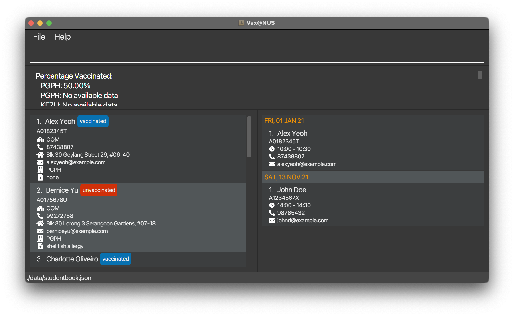
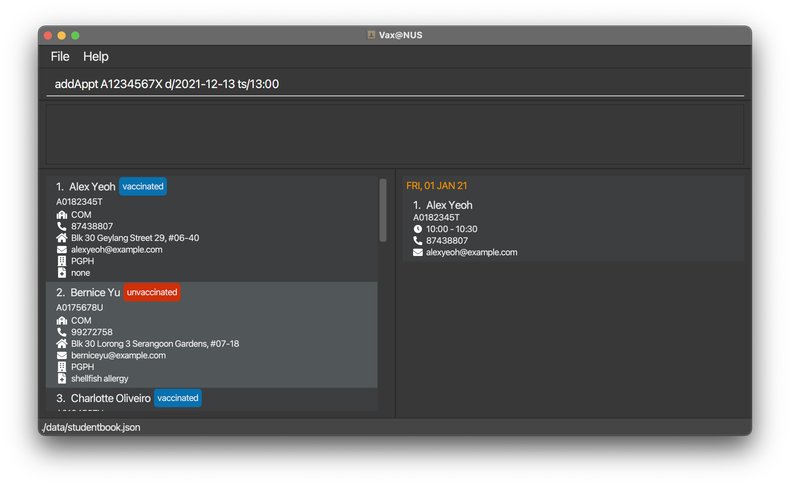

Vax@NUS is a **one stop management app to efficiently track and schedule COVID-19 vaccinations for NUS students.** It is a desktop app **optimized for use via a Command Line Interface (CLI)** while still having the benefits of a Graphical User Interface (GUI). If you can type fast, Vax@NUS can get your appointment management tasks done faster than traditional GUI apps.

* Table of Contents
{:toc}

:information_source: This icon indicates helpful notes 

--------------------------------------------------------------------------------------------------------------------

## Quick start

1. Ensure you have Java `11` or above installed in your Computer.

1. Download the latest `VaxAtNUS.jar` from [here](https://github.com/AY2021S2-CS2103T-W10-4/tp/releases).

1. Copy the file to the folder you want to use as the _home folder_ for your Vax@NUS application.

1. Double-click the file to start the app. The GUI similar to the below should appear in a few seconds. Note how the app contains some sample data. 
   

1. Type the command in the command box and press Enter to execute it. e.g. typing **`help`** and pressing Enter will open the help window. 
   Some example commands you can try:

   * **`list`** : Lists all data.
   * **`exit`** : Exits the app.

1. Refer to the [Features](#features) below for details of each command.

--------------------------------------------------------------------------------------------------------------------

## Features

**:information_source: NOTE ABOUT THE COMMAND FORMAT :** 

* Words in `UPPER_CASE` are the parameters to be supplied by the user. 
  e.g. in `add n/NAME`, `NAME` is a parameter which can be used as `add n/John Doe`.

* Items in square brackets are optional. 
  e.g `n/NAME [r/SCHOOL RESIDENCE]` can be used as `n/John Doe r/RC4` or as `n/John Doe`.

* Extraneous parameters for commands that do not take in parameters (such as `help`, `list`, `exit` and `clear`) will be ignored. 
  e.g. if the command specifies `help 123`, it will be interpreted as `help`.
    
* Prefixed parameters can be in any order. 
  e.g. if the command specifies `n/NAME p/PHONE_NUMBER`, `p/PHONE_NUMBER n/NAME` is also acceptable.
  
* If a prefixed parameter is expected only once in the command but you specify it multiple times, only the last occurrence of the parameter will be taken. 
  e.g. if you specify `p/12341234 p/56785678`, only `p/56785678` will be taken.
   
* Parameters without prefix must strictly adhere to the order shown in the command. 

  

### Adding a student record: `add`

Adds the details of a student to Vax@NUS records. 

:information_source: **NOTE** The default School Residence is `DOES_NOT_LIVE_ON_CAMPUS` if it is not specified. 

> For a smooth user experience, please refer to the [Input Formats](#input-formats) section below for more information regarding the input accepted by the add student command.

Format: `add MATRICULATION_NUMBER n/NAME f/FACULTY p/PHONE_NUMBER e/EMAIL a/ADDRESS s/VACCINATION_STATUS m/MEDICAL_DETAILS [r/SCHOOL_RESIDENCE]`

Examples:
* `add A1234567X n/John Doe f/COM p/98765432 e/johnd@example.com a/John street, block 123, #01-01 s/vaccinated m/peanut allergy r/RVRC`
* `add A7654321J n/Betsy Crowe f/ENG p/91119222 e/betsycrowe@example.com a/212 Orchard Road, #18-08 s/unvaccinated m/nose lift surgery in 2012`

| Before        | 
| ------------- |
|

| After        | 
| ------------- |
||

### Editing a student record: `edit`

Edits a student in Vax@NUS records at the specified INDEX. The index refers to the index number shown in the displayed student list. The index must be a positive integer 1, 2, 3, …

All inputs specified are optional, but at least one of them must be provided. After execution of the `edit` command, the existing value specified will be updated to the input value.  

 :information_source: **NOTE:** Every field except the student's matriculation number can be edited. Should you wish to edit the matriculation number of a student, you must first delete the student entry and add a new one with the updated matriculation number. 

> For a smooth user experience, please refer to the [Input Formats](#input-formats) section below for more information regarding the input accepted by the edit student command.

Format: `edit INDEX [n/NAME] [f/FACULTY] [p/PHONE] [e/EMAIL] [a/ADDRESS] [s/VACCINATION_STATUS] [m/MEDICAL_DETAILS] [r/SCHOOL_RESIDENCE]`

Examples:

* `edit 1 p/91234567 f/MED` Edits the phone number and faculty of the first student to be 91234567 and MED respectively.

* `edit 2 r/KRH`  Edits the school residence of the second student to be KRH.

| Before        | 
| ------------- |
|

| After        | 
| ------------- |
||

### Deleting a student record: `delete`

Deletes the student specified by his/her matriculation number from Vax@NUS records.

Format: `delete MATRICULATION NUMBER`

* If the matriculation number does not exist in the records, a message will be shown to inform users that 
  no student with the specified matriculation number can be found in the records.
* If the student to be deleted has an appointment, the student's appointment will be deleted as well.
  

Examples:
* `delete A1234567X` deletes John Doe from the records. If John Doe has an appointment, his appointment will be deleted as well.

| Before        | 
| ------------- |
|

| After        | 
| ------------- |
||

### Filtering all student records: `filter`

Shows all student records in Vax@NUS that matches the specified vaccination status, faculty or school residence.

:information_source: NOTE: The filter command only changes the view of the student list and not the view of the appointment list.

Format:  
`filter VACCINATION_STATUS`
  `filter FACULTY`
  `filter SCHOOL_RESIDENCE`

* Only one filter condition should be specified at a time. 

> For a smooth user experience, please refer to the [Input Formats](#input-formats) section below for more information regarding the input accepted by the filter command.

Examples:
* `filter vaccinated` or `filter unvaccinated`
* `filter COM` 
* `filter RVRC` 

### Viewing statistics for student population: `stats`

Displays percentage of vaccinated students in the specified faculty/school residence, whole of NUS, or a list of percentages of vaccinated students in every Faculty and School Residence. 

Format:  
`stats FACULTY`
  `stats SCHOOL_RESIDENCE`
  `stats NUS`
  `stats all`

* Only one condition should be specified at a time. 
* If there is no available data for the specified faculty or school residence, a message will be displayed to inform
  users that the specified faculty or school residence has no available data.

> For a smooth user experience, please refer to the [Input Formats](#input-formats) section below for more information regarding the input accepted by the stats command.

Examples:
* `stats COM` displays the percentage of vaccinated students in School of Computing.
* `stats RC4` displays the percentage of vaccinated students in RC4.
* `stats DOES_NOT_LIVE_ON_CAMPUS` displays the percentage of vaccinated students not living on campus.
* `stats NUS` displays the percentage of vaccinated students in NUS.
* `stats all` displays the list of percentages of vaccinated students in every Faculty and School Residence.

Sample Output for `stats all`:

Sample Output for `stats PGPH`:

### Adding an appointment: `addAppt`

Adds an appointment to Vax@NUS' records. 

Appointments can be added for both unvaccinated and vaccinated students, as appointments can also entail follow-ups or check-ups in addition to vaccinations.

Format: `addAppt MATRICULATION_NUMBER d/DATE ts/START_TIME`

> For a smooth user experience, please refer to the [conditions for valid appointments](#conditions-for-valid-appointments) section below for more information regarding the details of an appointment accepted by Vax@NUS.

Examples:
* `addAppt A1234567X d/2021-12-13 ts/13:00`
* `addAppt A7654321J d/2021-12-13 ts/14:00`

| Before        | 
| ------------- |
|

| After        | 
| ------------- |
||

### Editing an appointment: `editAppt`

Edits an appointment present in Vax@NUS records by referencing the student's matriculation number. 

Format: `editAppt MATRICULATION_NUMBER d/DATE ts/START_TIME`

> For a smooth user experience, please refer to the [conditions for valid appointments](#conditions-for-valid-appointments) section below for more information regarding what the details of an appointment accepted by Vax@NUS.

Examples:
* `editAppt A1234567X d/2021-11-13 ts/14:00`
* `editAppt A7654321J d/2021-12-13 ts/10:00`

| Before        | 
| ------------- |
|

| After        | 
| ------------- |
||

### Deleting an appointment: `deleteAppt`

Deletes the appointment of the student with the specified matriculation number from Vax@NUS' records. 

Format: `deleteAppt MATRICULATION_NUMBER`

* If the matriculation number or appointment does not exist in the records, a message will be displayed to inform users that
  the matriculation number or appointment is not found.

Examples:
* `deleteAppt A1234567X` deletes John Doe's appointments from the records, provided he had an appointment scheduled previously.

| Before        | 
| ------------- |
|

| After        | 
| ------------- |
||

### Viewing statistics for appointments: `statsAppt`
Displays the number of upcoming and previous appointments within 1 week from the current day, including the current day.
E.g., if today is Monday, `statsAppt` will count upcoming appointments from Monday(Today) - Sunday and past appointments from last Tuesday - Monday(Today).

Format:  
`statsAppt`

Sample Output for `statsAppt`:

> Remark: Screenshot was taken on 9 April 2021.

### Listing all data : `list`

Shows a list of all students and all appointments in Vax@NUS records.

Format: `list`

### Finding a student and their appointment : `find`

Shows personal information, including appointment details if present, of the student that matches the specified matriculation number.

Format: `find MATRICULATION_NUMBER`

* If the matriculation number does not exist in the records, a message will be shown to inform users that 
  the matriculation number is not found.
* If the student found does not have an appointment, the appointment list will appear as empty.
  
Examples:
* `find A1234567X` shows John Doe's personal information, and his appointment details if it is present.

### Viewing help : `help`

Display a pop-up window showing a list of commonly used commands in Vax@NUS and a link to our User Guide. 
Format: `help`

### Clearing all data : `clear`

Clearing all the data from Vax@NUS.

Format: `clear`

### Exiting the program : `exit`

Exits the program.

Format: `exit`

### Saving the data

Vax@NUS saves your current data into your computer automatically after any command. There is no need to save manually.
 
 :information_source: **NOTE:**  VAX@NUS will display our sample data file if no data file is found from your computer.

### Editing the data

VAX@NUS data is saved as a JSON file [JAR file location]/data/studentbook.json. Advanced users are welcome to update data directly by editing that data file.

> Please refer to the [Input Formats](#input-formats) section when editing the data file to conform to the required format.

Editing a student's matriculation number through the JSON file is allowed, however, extra care must be taken to ensure data integrity. 

If you change a student's matriculation number, you must also update the matriculation number for the corresponding student's appointment. 
Failure to do so will result in an invalid data file format as the appointment does not belong to any student. 

> :warning: **If your changes to the data file makes it an invalid format, VAX@NUS will discard all data and start with an empty data file at the next run**: Be very careful!

--------------------------------------------------------------------------------------------------------------------

## Input Formats

The following parameter formats must be followed:

### Matriculation Number
 The `MATRICULATION_NUMBER` of a student is a unique 9-character alphanumeric sequence that begins with A, followed by
 7 numbers and ends with an alphabet.

### Faculty

 The `FACULTY` of a student must be one of the following(case-sensitive):
 * FASS (for Faculty of Arts and Social Sciences)
 * BIZ (for NUS Business School)
 * COM (for School of Computing)
 * SCALE (for School of Continuing and Lifelong Education)
 * DEN (for Faculty of Dentistry)
 * SDE (for School of Design and Environment)
 * DNUS (for Duke-NUS Medical School)
 * ENG (for Faculty of Engineering)
 * ISEP (for Integrative Sciences and Engineering)
 * LAW (for Faculty of Law)
 * MED (for Yong Loo Lin School of Medicine)
 * MUSIC (for Yong Siew Toh Conservatory of Music)
 * SPH (for Saw Swee Hock School of Public Health)
 * SPP (for Lee Kuan Yew School of Public Policy)
 * SCI (for Faculty of Science)
 * USP (for University Scholars Programme)
 * YNC (for Yale-NUS College)

### Vaccination Status

 The `VACCINATION_STATUS` of a student must only be `vaccinated` or `unvaccinated`. It is not case-sensitive. 

### School Residence

 The `[SCHOOL_RESIDENCE]` of a student must be one of the following(case-sensitive):
 * PGPH (for Prince George's Park House)
 * PGPR (for Prince George's Park Residences)
 * KE7H (for King Edward VII Hall)
 * SH (for Sheares Hall)
 * KRH (for Kent Ridge Hall)
 * TH (for Temasek Hall)
 * EH (for Eusoff Hall)
 * RH (for Raffles Hall)
 * RVRC (for Ridge View Residential College)
 * YNC (for Yale-NUS College)
 * TC (for Tembusu College)
 * CAPT (for College of Alice and Peter Tan)
 * RC4 (for Residential College 4)
 * USP (for University Scholars Programme)
 * UTR (for Utown Residences)
 * DOES_NOT_LIVE_ON_CAMPUS

If unindicated, the `School Residence` field will default to `DOES NOT LIVE ON CAMPUS`

### Conditions for valid appointments
* `DATE` must be of the format `YYYY-MM-DD`
* `START_TIME` must be of the format `HH:00` or `HH:30`.
* The duration of each appointment is fixed at 30 minutes.
* No appointment should clash with any other appointments.
* The student that the appointment is for must exist in the records.

--------------------------------------------------------------------------------------------------------------------

## FAQ

**Q**: What do I do if I accidentally delete a student? 
 
**A**: Unfortunately, the deletion is permanent. You will have to manually re-add the student.

**Q**: What can be included in medical details?
 
**A**: Allergies and past medical history.

**Q** : Am I able to reassign an appointment to another student?
 
**A** : No, you will need to add a new appointment for the new student. 

**Q**: Why are vaccinated students able to receive new appointments?
 
**A**: Beyond the two shots currently required for the approved Pfizer-BioNTech and Moderna vaccines in Singapore, booster shots could be required in the future to prolong immunity and provide protection against fast-emerging COVID-19 variants. 

**Q**: How long is a vaccination appointment?
 
**A**: Each vaccination appointment lasts 30 minutes, which includes registration, administering the vaccine and observation. 

-----------------------------------------------------------------------------------------------------------------
## Command Summary

Action | Format, Examples
--------|------------------
**Add Student** | `add MATRICULATION_NUMBER n/NAME f/FACULTY p/PHONE_NUMBER e/EMAIL a/ADDRESS s/VACCINATION_STATUS m/MEDICAL_DETAILS [r/SCHOOL_RESIDENCE]`   e.g., `add A1234567X n/John Doe f/COM p/98765432 e/johnd@example.com a/John street, block 123, #01-01 s/vaccinated m/peanut allergy r/RVRC`
**Edit Student** | `edit INDEX [n/NAME] [f/FACULTY] [p/PHONE] [e/EMAIL] [a/ADDRESS] [s/VACCINATION_STATUS] [m/MEDICAL_DETAILS] [r/SCHOOL_RESIDENCE]`   e.g., `edit 1 p/91234567 f/MED`
**Delete Student** | `delete MATRICULATION_NUMBER` e.g., `delete A1234567X`
**Filter Students** | `filter VACCINATION_STATUS` e.g., `filter vaccinated`   `filter FACULTY ` e.g., `filter COM`   `filter SCHOOL_RESIDENCE` e.g., `filter RVRC` 
**View Student Statistics** | `stats FACULTY` e.g., `stats COM`   `stats SCHOOL_RESIDENCE` e.g., `stats RC4`   `stats NUS`   `stats all` 
**Add Appointment** | `addAppt MATRICULATION_NUMBER d/DATE ts/START_TIME`   e.g., `addAppt A1234567X d/2021-12-13 ts/13:00`
**Edit Appointment** | `editAppt MATRICULATION_NUMBER d/DATE ts/START_TIME`   e.g.,`editAppt A1234567X d/2021-12-13 ts/14:00`
**Delete Appointment** | `deleteAppt MATRICULATION_NUMBER`   e.g., `deleteAppt A1234567X`
**View Appointment Statistics** | `statsAppt`
**List All Data** | `list`
**Find Student And Appointment** | `find MATRICULATION_NUMBER` e.g., `find A1234567X`
**View Help** | `help` 
**Clear All Data** | `clear` 
**Exit Program** | `exit`

