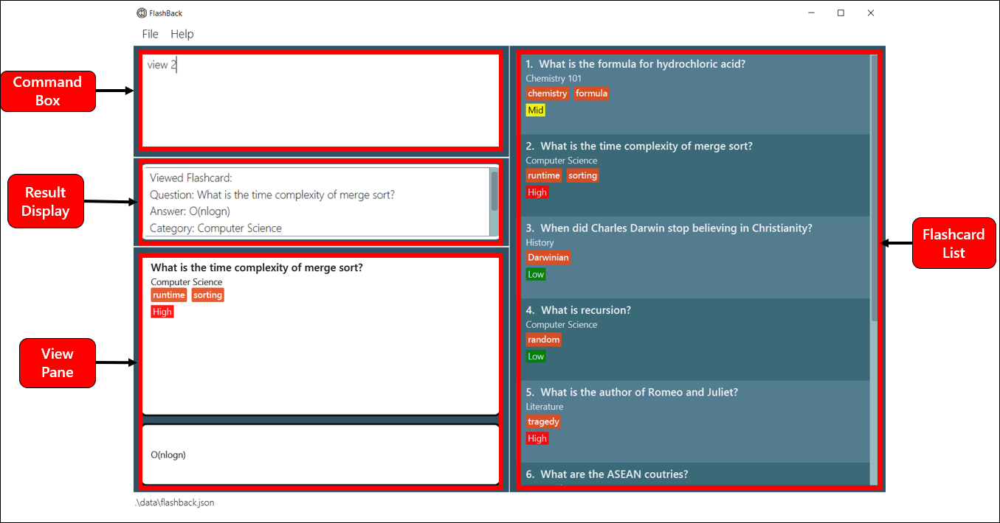
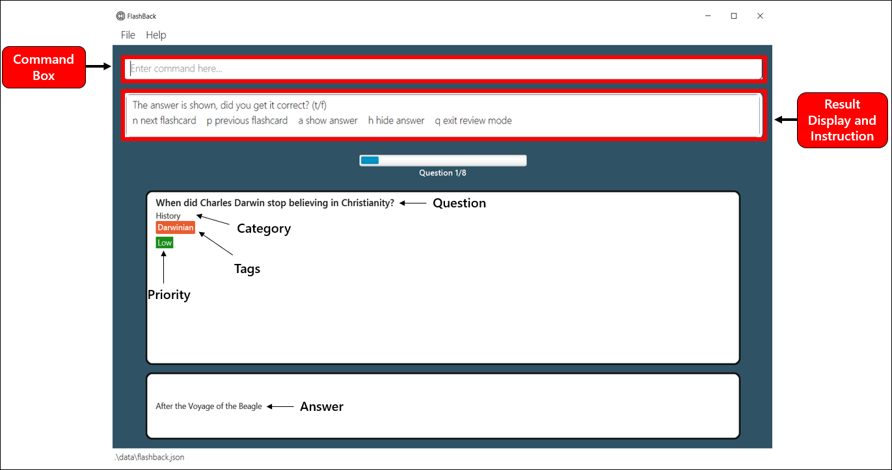
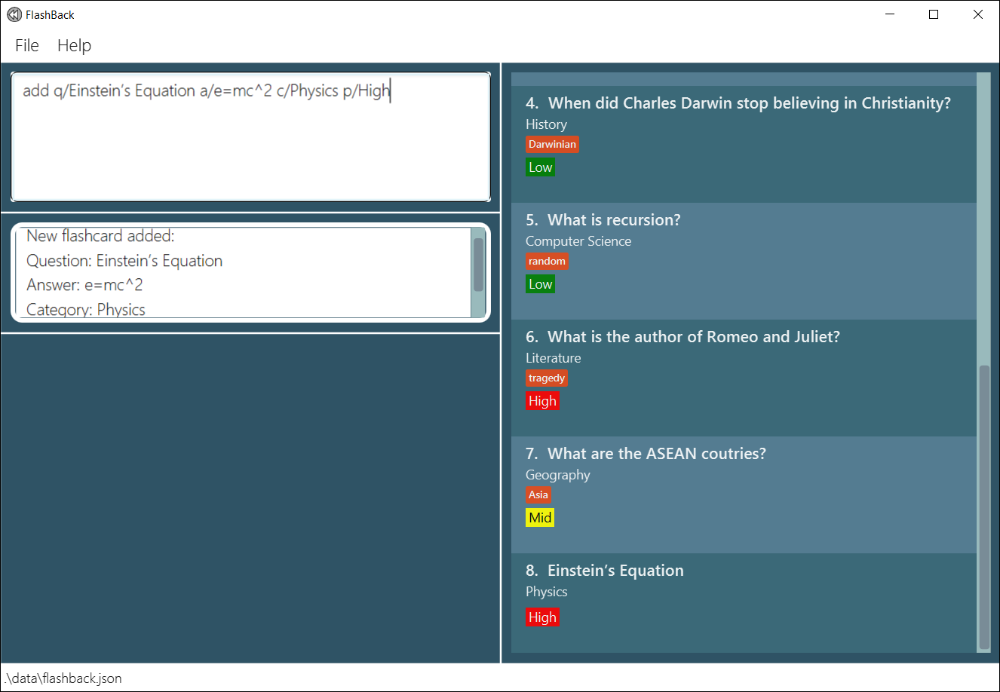
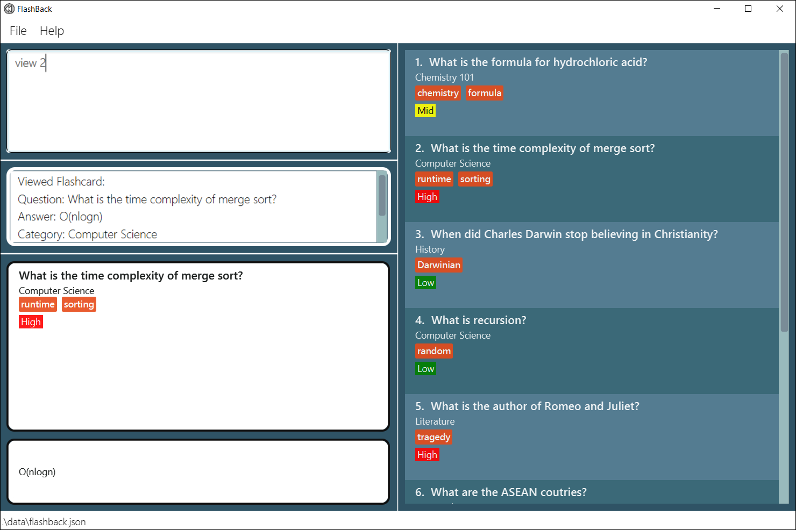
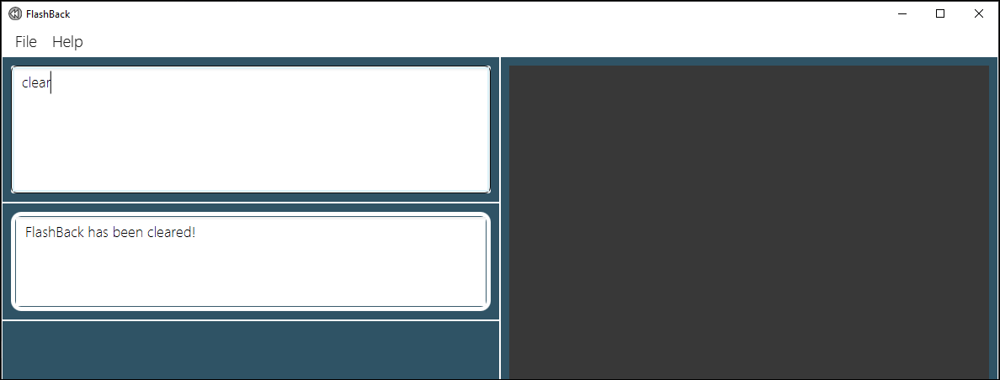
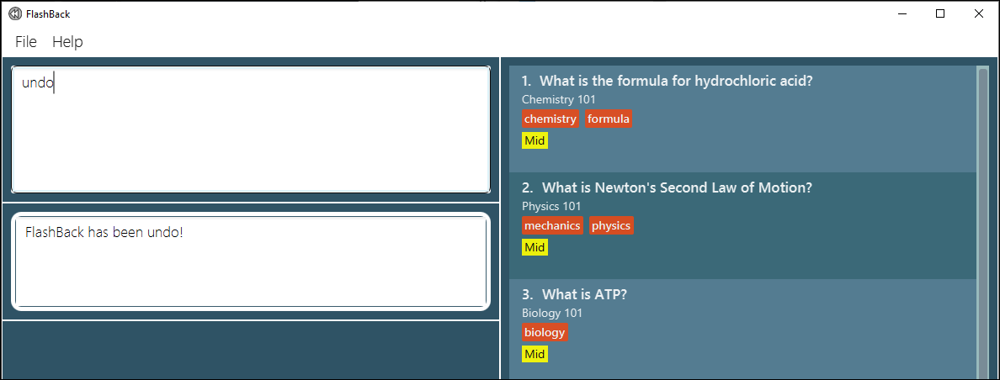
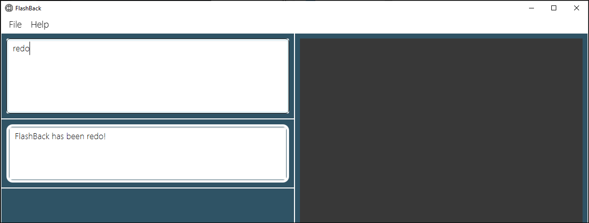
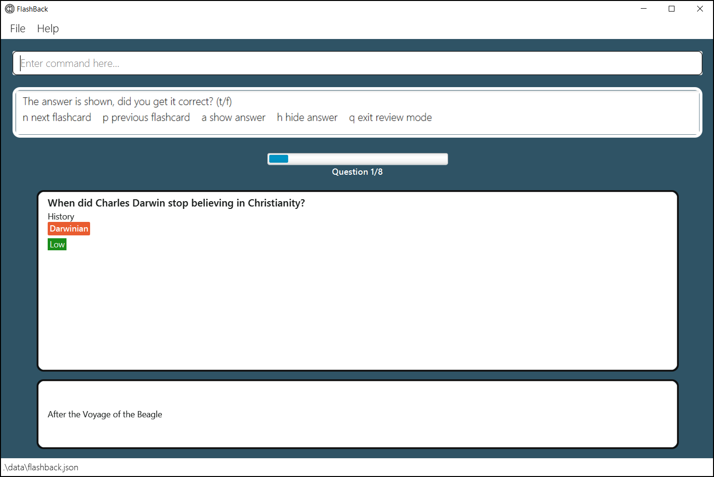

FlashBack is a **desktop application for managing notes, optimized for use via a Command Line Interface** (CLI) while still having the benefits of a Graphical User Interface (GUI). This application allows the improvement of student performance via improved accessibility and organisation of notes, together with interactive sessions that enhance memory retention.

## Table of Contents

* [Quick start](#quick-start)
* [Application layout](#application-layout)
* [Features](#features)
    * [Main mode](#main-mode)
        * [Viewing help](#viewing-help-help): `help`
        * [Adding a new flashcard](#adding-a-new-flashcard-add): `add`
        * [Editing a flashcard](#editing-a-flashcard-edit): `edit`
        * [Listing all flashcards](#listing-all-flashcards--list): `list`
        * [Deleting a flashcard](#deleting-a-flashcard--delete): `delete`
        * [Viewing a flashcard](#viewing-a-flashcard--view): `view`
        * [Finding flashcards](#finding-flashcards--find): `find`
        * [Filtering flashcards](#filtering-flashcards-filter): `filter`
        * [Clearing all flashcards](#clearing-all-entries--clear): `clear`
        * [Undoing a command](#undoing-a-command--undo): `undo`
        * [Redoing a command](#redoing-a-command--redo): `redo`
        * [Sorting all flashcards](#sorting-all-flashcards-sort): `sort`
        * [Entering review mode](#entering-review-mode-review): `review`
        * [Viewing statistics of flashcards](#viewing-statistics-of-flashcards-stats): `stats`
        * [Adding an alias](#adding-an-alias-alias): `alias`
        * [Exiting the program](#exiting-the-program--exit): `exit`
        * [Saving data](#saving-the-data)
        * [Editing the data file](#editing-the-data-file)
        * [Editing the preferences file](#editing-the-preferences-file)
    * [Review mode](#review-mode)
        * [Showing next flashcard](#showing-next-flashcard--n): `n`
        * [Showing previous flashcard](#showing-previous-flashcard--p): `p`
        * [Showing answer](#showing-answer--a): `a`
        * [Hiding answer](#hiding-answer--h): `h`
        * [Reviewing a flashcard as correct](#reviewing-a-flashcard-as-correct-t): `t`
        * [Reviewing a flashcard as wrong](#reviewing-a-flashcard-as-wrong--f): `f` 
        * [Quitting review mode](#quitting-review-mode--q): `q`
* [FAQ](#faq)
* [Command Summary](#command-summary)
    * [Main mode command](#main-mode-command)
    * [Review mode command](#review-mode-command)

--------------------------------------------------------------------------------------------------------------------

## Quick start

1. Ensure you have Java `11` or above installed in your Computer.
1. Download the latest `FlashBack.jar` from [here](https://github.com/AY2021S2-CS2103T-T13-3/tp/releases).
1. Copy the file to the folder you want to use as the home folder for your FlashBack.
1. Double-click the file to start the app. The GUI should appear in a few seconds.   
      
1. Below are some commands you can try, type the command in the command box and press Enter to execute it:
    * **`help`** : Opens the help window.
    * **`add`**`q/ What is the Einstein’s Equation? a/e=mc^2 c/Physics p/High t/ModernPhysics`: Adds a new flashcard
      named `What is the Einstein's Equation?` to FlashBack.
    * **`view`**`2`: Views the 2nd flashcard shown in the current list.
    * **`delete`**`1`: Deletes the 1st flashcard shown in the current list.
    * **`clear`**: Deletes all flashcards.
    * **`exit`**: Exits the application.
1. Refer to the Features below for details of each command.

--------------------------------------------------------------------------------------------------------------------

## Application layout

The figures below explain the different components in FlashBack.  
Main window 
   
Review mode  
   
Brief explanation of each component:

Components      | Explanation
----------------|------------------
Command Box | This is where you type all the commands.
Result Display | This is where the result of your input to the command box is displayed.
View Pane | This is where the output for `view` and `stats` command is displayed.
Flashcard List | This is where all the flashcards are displayed to user.
Main mode | This is the first window when you open the app. Most of the commands are executed here.
Review mode | This is where you can review all your flashcards. You can enter this mode by typing `review` in the Command Box of the Main mode.

--------------------------------------------------------------------------------------------------------------------

## Features

**:information_source: Notes about the command format:** 

* Words in UPPER_CASE are the parameters to be supplied by the user.  
  e.g. In `add q/QUESTION`, `QUESTION` is a parameter which can be used as `add q/What is Fermat's Last Theorem?`. 

* Items in square brackets are optional.  
  e.g. `q/QUESTION [t/TAG]` can be used as `q/What is Singapore Independence Day?` or
  as `q/What is Singapore Independence Day? t/Singapore` 

* Items with `…​` after them can be used multiple times including zero times.  
  e.g. `[t/TAG]…`​ can be used as `t/vocabulary`, `t/vocabulary t/SAT` etc.

* Parameters can be in any order.  
  e.g. If the command specifies `q/QUESTION a/ANSWER`, `a/ANSWER q/QUESTION` is also acceptable. 

* Extraneous parameters for commands that do not take in parameters (such as `help`, `list`, `undo`, `redo`, `exit` and `clear`)
  will be ignored.  
  e.g. If the command specifies `help 123`, it will be interpreted as `help`.

* Prefixes are case-sensitive.  
  e.g. `q/` is not the same as `Q/`.

* If a parameter is expected only once in the command, but you specified it multiple times, only the last occurrence of the parameter will be taken.  
  e.g. If you specify `c/Geography c/History`, only `c/History` will be taken.  
  e.g. If you specify `-a -d`, only `-d` will be taken.
  
* For commands that accepts `INDEX` parameter (e.g. `edit`, `view`, `delete`, and `stats`):
    * The index refers to the index number shown in the displayed flashcard list.
    * The index **must be a positive integer** 1, 2, 3, …​ but not above 2147483647.

## Main mode

### Viewing help: `help`

Shows a message explaining how to access the help page.  
   
Format: `help`

### Adding a new flashcard: `add`

Adds a new flashcard to the flashcard list. 
Format: `add q/QUESTION a/ANSWER c/CATEGORY p/PRIORITY [t/TAG]...`  

:information_source: **Note:**  
The `TAG` is optional when adding a new flashcard. 
Tag(s) should be alphanumeric, and there should not be any spacing between characters. 
Priority can only take 1 out of 3 values: `High`, `Mid` or `Low`, case-sensitive.

Examples:

* `add q/Einstein’s Equation a/e=mc^2 c/Physics p/High`   
     
* `add q/Independence day of Singapore a/August 9th 1965 c/History p/Mid t/Singapore`

### Editing a flashcard: `edit`

Edits an existing flashcard in the flashcard list.

Format: `edit INDEX [q/NEW QUESTION] [a/NEW ANSWER] [c/NEW CATEGORY] [p/NEW PRIORITY] [t/TAG]...`

* Edits the flashcard at the specified `INDEX`.
* At least 1 updated card field must be provided for modification.
* If the tag field is specified in the command, all existing tag(s) will be removed and replaced by the new tag(s).
* New tag(s) should be alphanumeric, and there should not be any spacing between characters.
* New priority can only be `Low`, `Mid` or `High`, case-sensitive.

Examples:

* `edit 1 p/Low`   
     
* `edit 3 q/What is the time complexity for Quick Sort? t/Algorithms`

### Listing all flashcards : `list`

Shows all flashcards in the flashcard list.

Format: `list`

### Deleting a flashcard : `delete`

Deletes the specified flashcard from the flashcard list.  
Format: `delete INDEX`

* Deletes the flashcard at the specified `INDEX`.

Examples:

* `list` followed by `delete 2` deletes the 2nd flashcard in the flashcard list.   
  Before executing command `delete 2`:   
    
  

  
  After executing command `delete 2`:   
  

### Viewing a flashcard : `view`

Views a specific flashcard from the flashcard list.  

Format: `view INDEX`

* Views the flashcard at the specified `INDEX`.

Examples:
* `view 2` shows the 2nd flashcard (in the displayed flashcard list).   
  

### Finding flashcards : `find`

Finds flashcards containing any of the given keywords in FlashBack.

Format: `find KEYWORD [MORE_KEYWORDS]`

* The search is case-insensitive. e.g. `equation` will match `Equation`
* The order of the keywords does not matter. e.g. `Newton Equation` will match `Equation Newton`
* Partial words can be matched when searching. e.g. `Wh` will match `What?` but `What?` will not match `What`
* Any flashcard's fields (e.g. question, answer, category, priority, and tag) matching any keyword will be returned.

:bulb: **Tip:** You can list all flashcards again by using `list` command

Examples:
* `find computer` will return cards with `computer` in any of its fields.  
   
* `find computer formula` will return cards with `computer` or `formula` in any of its fields.  
  

* `find phy` will return cards with `phy` contained in any of the words in any of its fields.  
  

### Filtering flashcards: `filter`

Filter flashcards based on specified field input in FlashBack.

:information_source: **Note:** You can only filter by `question`, `category`, `priority`, and `tag`.

Format: `filter [q/QUESTION] [c/CATEGORY] [p/PRIORITY] [t/TAG]`

* The filter is case-insensitive. e.g. `equation` will match `Equation`
* Must filter by at least 1 field, but not every field is required.
* Can filter by multiple keywords for each field. e.g. `filter q/einstein math`
* The order of the keywords does not matter. e.g. `Newton Equation` will match `Equation Newton`
* The order of the field input does not matter. e.g. `filter q/QUESTION c/CATEGORY` is same as `filter c/CATEGORY q/QUESTION`
* Filtered flashcards must match all field inputs. e.g. `filter q/einstein p/mid` will only display flashcards with question containing `einstein` and `mid` priority.
* Partial words can be matched when filtering. e.g. `Wh` will match `What?` but `What?` will not match `What`

:bulb: **Tip:** You can list all flashcards again by using `list` command.

Examples:
* `filter q/charles recursion` will return cards with `charles` or `recursion` contained in its question.  
     
* `filter p/mid q/formula` will return cards with `formula` contained in its question and `mid` priority.  
    
  

 

* `filter c/com t/ran` will return cards with `com` contained in its category and `ran`contained in any of its tags.  
    

### Clearing all entries : `clear`

Clears all entries from FlashBack.

Format: `clear`

### Undoing a command : `undo`

Restores FlashBack to the state before the most recent undoable command was executed.

:information_source:
**Note:**  Only commands that modify FlashBack's content can be reversed. (`add`, `delete`, `edit` and `clear`).

Format: `undo`

Examples:
`delete 3`   
   
`clear`    
  

`undo` will reverse the `clear` command.   
   
`undo` will reverse the `delete 3` command.   
  

### Redoing a command : `redo`

Redoes the most recent action that was undone (reverses the `undo` command).

Format: `redo`

Examples:
`clear`   
   
`undo` will reverse the `clear` command.   
  

`redo` will reverse the `undo` command.   
  

### Sorting all flashcards: `sort`
Sorts all flashcards in display according to a given option.

:information_source: **Note:** You can only sort by `priority` or `question`.

Format: `sort OPTION ORDER`  
Examples:

`sort priority -a` will sort the flashcards by ascending priority (Low to High).  
`sort priority -d` will sort the flashcards by descending priority (High to Low).  
`sort question -a` will sort the flashcards by question in ascending alphabetical order.  
`sort question -d` will sort the flashcards by question in descending alphabetical order.  

Before sort command is executed.   
   
After `sort priority -a` command is executed.   

### Entering review mode: `review`
Reviews list of flashcards that is in display. 
When the user enters `review` in the command box, this new window will appear.   
   
Format: `review`

:information_source: **Note:** The flashcards in Review Mode are appeared in random order.

### Viewing statistics of flashcards: `stats`
Shows the statistics of an individual flashcard, or the statistics of all flashcards.

The following statistics are displayed:
* Number of times the user reviewed the flashcard(s).
* Number of times the user reviewed the flashcard(s) and got the correct answers.
* The correct rate of the flashcard(s). i.e The number of correct answer reviews over the total number of reviews.
* The wrong rate of the flashcard(s). i.e The number of wrong answer reviews over the total number of reviews.

Format: `stats [INDEX]`  

:information_source: **Note:**
If a valid `INDEX` is provided, the statistics of the flashcard identified by the provided index is shown.
If the `INDEX` is omitted, FlashBack will display overall statistics for all flashcards in the current list.

Examples:

`stats 2` shows the statistics of the 2nd flashcard in the list.

   

`stats` shows the overall statistics of the current flashcard list.

  

### Adding an alias: `alias`
Defines an alias for a command in FlashBack.

:information_source: **Note:** You can only add alias for Main mode commands. The alias should also not have the same name as commands in both the main and review modes.

Format: `alias cmd/COMMAND al/ALIAS`  

Examples:

`alias cmd/delete al/d` creates an alias `d` for command `delete`.

  

`d 1` shows the usage of alias `d`.

  

### Exiting the program : `exit`

Exits the program.

Format: `exit`

### Saving the data

FlashBack data are saved in the hard disk automatically after any command that changes the data. There is no need to save manually.

### Editing the data file

FlashBack data are saved as a JSON file `[JAR file location]/data/flashback.json`. Advanced users are welcome to update data directly by editing that data file.

:exclamation: **Caution:**
If your changes to the data file makes its format invalid, FlashBack will discard all data and start with an empty data file at the next run.

### Editing the preferences file
The user preferences are saved as a JSON file  `[JAR file location]/preferences.json`. Similar to the data file, advanced users are welcome to update the preferences and alias mapping directly by editing that data file.

:exclamation: **Caution:**
If your changes to the preferences file makes its format invalid, FlashBack will discard all preferences and start with an empty data file at the next run.
Also, if your changes to the alias mapping is invalid, for example mapping `add` to `delete`, FlashBack will deem the entire alias mapping corrupted and will start with an empty alias mapping.

## Review mode

### Showing next flashcard : `n`

Moves on to the next flashcard. 
Format: `n`  
Example:   

### Showing previous flashcard : `p`

Moves back to the previous flashcard.  
Format: `p`  
Example:   

### Showing answer : `a`

Displays the answer of the current flashcard.  
Format: `a`  
Example:   

### Hiding answer : `h`

Hides the answer of the current flashcard.  
Format: `h`  
Example:   

### Reviewing a flashcard as correct: `t`

Marks that the user got the answer correct for the current flashcard.  

:information_source: **Note:** This command can only be executed if the answer of the current flashcard is shown.

Format: `t`  
Example:   

### Reviewing a flashcard as wrong : `f`

Marks that the user got the answer wrong for the current flashcard.  

:information_source: **Note:** This command can only be executed if the answer of the current flashcard is shown.

Format: `f`  
Example:   

### Quitting review mode : `q`

Quits the review mode and goes back to the main window.  
Format: `q`  
Example:   

--------------------------------------------------------------------------------------------------------------------

## FAQ

**Q**: How do I transfer my data to another Computer? 
**A**: Install the app in the other computer and overwrite the empty data file it creates with the file that contains
the data of your previous FlashBack home folder.

--------------------------------------------------------------------------------------------------------------------

## Command summary

### Main mode command

Action | Format, Examples
--------|------------------
**Add** | `add q/QUESTION a/ANSWER c/CATEGORY p/PRIORITY [t/TAGS]...`   e.g. `add q/ What is the Einstein’s Equation? a/e=mc^2 c/Physics p/High t/ModernPhysics`
**Delete** | `delete INDEX`   e.g. `delete 1`
**Edit** | `edit INDEX [q/NEW QUESTION] [a/NEW ANSWER] [c/NEW CATEGORY] [p/NEW PRIORITY] [t/TAG]...`   e.g. `edit 1 a/sampleanswer p/Low`
**View** | `view INDEX`   e.g. `view 2`
**Find** | `find KEYWORD [MORE_KEYWORDS]`  e.g. `find equation`
**Filter** | `filter [q/QUESTION] [c/CATEGORY] [p/PRIORITY] [t/TAG]`  e.g. `filter q/einstein c/phy p/high t/modern`   or `filter p/low t/formula`
**Clear** | `clear`
**Undo** | `undo`
**Redo** | `redo`
**Sort** | `sort OPTION ORDER`   e.g. `sort priority -a`
**Review** | `review`
**Statistics** | `stats [INDEX]`   e.g. `stats 4`, `stats`
**Alias** | `alias cmd/COMMAND al/ALIAS`   e.g. `alias cmd/view al/v`, `alias cmd/delete al/d`
**List** | `list`
**Help** | `help`
**Exit** | `exit`

### Review mode command

Action          | Format
----------------|------------------
**Next flashcard**   | `n`
**Previous flashcard** | `p`
**Show answer** | `a`
**Review a flashcard as correct** | `t`
**Review a flashcard as wrong** | `f`
**Hide answer** | `h`
**Quit review** | `q`
