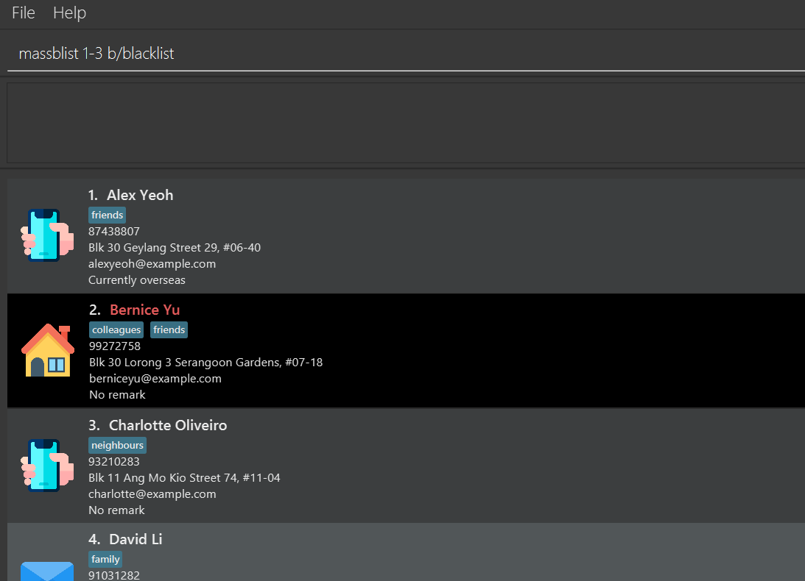

SpamEZ is a **desktop app for managing contacts, optimized for use via a Command Line Interface** (CLI) while still having the benefits of a Graphical User Interface (GUI).
For fast typists, SpamEZ can complete contact management tasks faster than traditional GUI apps.

---
## Contents
- [Quick start](#quick-start)
- [Features](#features)
  - [Viewing help: `help`](#viewing-help--help)
  - [Adding a person: `add`](#adding-a-person--add)
  - [Listing all persons: `list`](#listing-all-persons--list)
  - [Editing a person: `edit`](#editing-a-person--edit)
  - [Adding a remark: `remark`](#adding-a-remark--remark)
  - [Blacklisting or un-blacklisting a contact: `blist`](#blacklisting-or-un-blacklisting-a-contact--blist)
  - [Blacklisting or un-blacklisting multiple contacts: `massblist`](#blacklisting-or-un-blacklisting-multiple-contacts--massblist)
  - [Deleting a contact: `delete`](#deleting-a-contact--delete)
  - [Deleting multiple contacts: `massdelete`](#deleting-multiple-contacts--massdelete)
  - [Clearing all entries: `clear`](#clearing-all-entries--clear)
  - [Collecting details from contacts: `collect`](#collecting-details-from-contacts--collect)
  - [Sorting entries by name: `sort`](#sorting-entries-by-name--sort)
  - [Finding persons by details: `find`](#finding-persons-by-details-find)
  - [Changing view type to light mode: `light`](#changing-view-type-to-light-mode--light)
  - [Changing view type to dark mode: `dark`](#changing-view-type-to-dark-mode--dark)
  - [Undoing previous operations: `undo`](#undoing-previous-operations-undo)
  - [Exiting the program: `exit`](#exiting-the-program--exit)
  - [Reviewing previous commands](#reviewing-previous-commands)
  - [Saving the data](#saving-the-data)
  - [Editing the data file](#editing-the-data-file)
- [FAQ](#faq)
- [Command summary](#command-summary)

--------------------------------------------------------------------------------------------------------------------

## Quick start

1. Ensure you have Java `11` or above installed in your Computer.

1. Download the latest `spamez.jar` from [here](https://github.com/AY2021S2-CS2103-T16-1/tp/releases).

1. Copy the file to the folder you want to use as the _home folder_ for SpamEZ.

1. Double-click the file to start the app. The GUI similar to the below should appear in a few seconds. Note how the app contains some sample data. 
   

1. Type the command in the command box and press Enter to execute it. e.g. typing **`help`** and pressing Enter will open the help window. 
   Some example commands you can try:

   * **`list`** : Lists all contacts.

   * **`add`**`n/John Doe p/98765432 e/johnd@example.com a/John street, block 123, #01-01 m/email` : Adds a contact named `John Doe` to the contacts list.

   * **`delete`**`3` : Deletes the 3rd contact shown in the current list.

   * **`clear`** : Deletes all contacts.
   
   * **`blist`** `2` : Blacklists the 2nd contact shown in the current list.

   * **`exit`** : Exits the app.
  
1. Refer to the [Features](#features) below for details of each command.

--------------------------------------------------------------------------------------------------------------------

## Features

**:information_source: Notes about the command format:** 

* Words in `UPPER_CASE` are the parameters to be supplied by the user. 
  e.g. in `add n/NAME`, `NAME` is a parameter which can be used as `add n/John Doe`.

* Items in square brackets are optional. 
  e.g `n/NAME [t/TAG]` can be used as `n/John Doe t/friend` or as `n/John Doe`.

* Items with `…`​ after them can be used multiple times including zero times. 
  e.g. `[t/TAG]…​` can be used as ` ` (i.e. 0 times), `t/friend`, `t/friend t/family` etc.

* Parameters can be in any order. 
  e.g. if the command specifies `n/NAME p/PHONE_NUMBER`, `p/PHONE_NUMBER n/NAME` is also acceptable.

* If a parameter is expected only once in the command but you specified it multiple times, only the last occurrence of the parameter will be taken. 
  e.g. if you specify `p/12341234 p/56785678`, only `p/56785678` will be taken.

* Extraneous parameters for commands that do not take in parameters (such as `help`, `list`, `exit`, `dark`, `light` and `clear`) will be ignored. 
  e.g. if the command specifies `help 123`, it will be interpreted as `help`.

* Commands will only handle `INDEX` values from 1 to 2147483647 (inclusive). This number represents the largest possible number of contacts
  that can be stored using the current implementation of SpamEZ.
  Values out of this valid integer range will be treated as invalid inputs.
  
* The following images represent email, phone and address respectively.

    

### Viewing help : `help`

Shows a message explaining how to access the help page.

Format: `help`

### Adding a person : `add`

Adds a person to the contacts list.

Format: `add n/NAME p/PHONE_NUMBER e/EMAIL a/ADDRESS m/MODE_OF_CONTACT [t/TAG]…​`

:bulb: **Tip:**
A person can have any number of tags (including 0)

Examples:
* `add n/John Doe p/98765432 e/johnd@example.com a/John street, block 123, #01-01 m/email`
* `add n/Betsy Crowe t/friend e/betsycrowe@example.com a/Newgate Prison p/1234567 m/phone t/criminal`

### Listing all persons : `list`

Shows a list of all contacts.

Format: `list`

### Editing a person : `edit`

Edits an existing person in the contacts list.

Format: `edit INDEX [n/NAME] [p/PHONE] [e/EMAIL] [a/ADDRESS] [m/MODE_OF_CONTACT] [t/TAG]…​`

* Edits the person at the specified `INDEX`. The index refers to the index number shown in the displayed person list. 
  The index **must be a valid positive integer** 1, 2, 3, …​
* At least one of the optional fields must be provided.
* Existing values will be updated to the input values.
* When editing tags, the existing tags of the person will be removed i.e adding of tags is not cumulative.
* You can remove all the person’s tags by typing `t/` without
    specifying any tags after it.

Examples:
*  `edit 1 p/91234567 e/johndoe@example.com` Edits the phone number and email address of the 1st person to be `91234567` and `johndoe@example.com` respectively.
*  `edit 2 n/Betsy Crower t/` Edits the name of the 2nd person to be `Betsy Crower` and clears all existing tags.

### Adding a remark : `remark`

Adds an optional remark to a person in the address book.
If the person already has a remark, the existing remark will be replaced.

Format: `remark INDEX r/REMARK`

* Adds or replaces the remark of the person at the specified `INDEX`. The index
  refers to the index number shown in the displayed person list. The index **must be a valid positive integer** 1, 2, 3, …​
* By default, all newly added contacts will be displayed as having 'No remark'.
* You can remove a person's remark by typing `r/` without specifying any remark after it. This will cause the person
  to be displayed as having 'No remark' again.

Example:

`remark 3 r/Currently on Stay Home Notice`

### Blacklisting or un-blacklisting a contact : `blist`

Blocks specific contacts, to specify that they do not want to be contacted.
If the contact is already blacklisted, they will be un-blacklisted. Blacklisted contacts are
displayed with a black background, as shown below.

Format: `blist INDEX`

* Changes the blacklist status of the person at the specified `INDEX`. The index 
  refers to the index number shown in the displayed person list. The index **must be a valid positive integer** 1, 2, 3, …​
* By default, all newly added contacts will be displayed as un-blacklisted.

### Blacklisting or un-blacklisting multiple contacts : `massblist`

Blacklist or un-blacklist all contacts within the specified index range (inclusive).

Format: `massblist START-END b/BLACKLIST_OR_UNBLACKLIST`

* Changes the blacklist status of all contacts whose `INDEX` lies between the specified index range
  to either 'blacklist' or 'unblacklist' depending on the input parameter.
* The keyword (`blacklist` and `unblacklist`) must be in lower case. 
* The index refers to the index number shown in the displayed person list. Both the 
  start index and end index **must be valid positive integers** 1, 2, 3, …​
* Start index must be strictly smaller than the end index and the end index cannot be larger than the number of contacts
  currently displayed in the list.
* The index range must be specified before the keyword.  
  e.g. `massblist b/blacklist 4-5` is treated as an invalid input.

Examples:
* Suppose you start with the following contact list:
  
  Executing `massblist 1-3 b/blacklist` will blacklist the first three contacts. Since the second contact is already
  blacklisted, it remains the same.  
  

### Deleting a contact : `delete`

Deletes the specified person from the contacts list.

Format: `delete INDEX`

* Deletes the person at the specified `INDEX`.
* The index refers to the index number shown in the displayed person list.
* The index **must be a valid positive integer** 1, 2, 3, …​

Examples:
* `list` followed by `delete 2` deletes the 2nd person in the contacts list.
* `find Betsy` followed by `delete 1` deletes the 1st person in the results of the `find` command.

### Deleting multiple contacts : `massdelete`

Deletes all contacts within the specified index range (inclusive).

Format: `massdelete START-END`
* Deletes all contacts whose `INDEX` lies between the specified index range.
* The index refers to the number shown in the displayed person list. Both the start index and end index **must be valid
  positive integers** 1, 2, 3, …​
* Start index must be strictly smaller than the end index and the end index cannot be larger than the
  number of contacts currently displayed in the list.

Example:
`massdelete 5-12`

### Clearing all entries : `clear`

Clears all entries from the contacts list.

Format: `clear`

### Collecting details from contacts : `collect`

Collects the specified details of all contacts in the displayed person list. This
is for ease of copying contact details into recipient lists.
The type of detail is specified by the prefix provided. Details will be separated
by the given separator, or by a semicolon if unspecified.
Collected details end with the separator to allow further manual addition of details.

Format: `collect [n/] or [p/] or [e/] or [a/] [s/SEPARATOR]`

* Exactly one of the type of detail prefix must be provided.
  The corresponding fields are as follows.
    * `n/`: Name
    * `p/`: Phone
    * `e/`: Email
    * `a/`: Address
* The separator will ignore leading and trailing spaces.
  As such, it is not possible to start or end the separator with a space.
* Words following any prefix other than `s/` will be ignored.
* Unrelated prefixes will be ignored.

### Sorting entries by name : `sort`

Sorts the contacts in the entire address book by name in alphabetical order.

Format: `sort ASCENDING_OR_DESCENDING`
* `ascending` sorts the list in ascending alphabetical order and `descending` sorts the list in
  descending alphabetical order.
* The keyword (`ascending` or `descending`) must be in lower case.
* Both the currently displayed list and the entire contact list will be sorted.

Examples:

* `sort ascending`
* `sort descending`

### Finding persons by details: `find`

Finds persons whose attributes (except remark) contain any of the given keywords.

Format: `find [n/NAME_KEYWORDS] [t/TAG_KEYWORDS] [a/ADDRESS_KEYWORDS] [e/EMAIL_KEYWORDS] [p/PHONE_NUMBERS] [b/IS_BLACKLISTED] [m/MODE_OF_CONTACT]`

* At least one of the parameters must be included as the parameters.
* Parameters, if provided, may not be empty. In other words, commands such as `find n/` or `find n/abc t/` are invalid.
* The search is case-insensitive. e.g `hans` will match `Hans`.
* The order of the keywords does not matter. e.g. `Hans Bo` will match `Bo Hans`.
* For name, tag and address parameters, only full words will be matched e.g. `Han` will not match `Hans`.
* For email and phone parameters, partial matches are allowed, e.g. for phone number, `8123` will match `81234567`.
* Persons matching at least one keyword of each provided attribute will be returned.
  e.g. `n/Hans Bo` will return `Hans Gruber`, `Bo Yang`, `Bo Hans`, while `n/Hans Bo t/friends` will only return `Hans Gruber` and `Bo Yang` if only `Hans Gruber` and `Bo Yang` are tagged with `friends`.
* Blacklist parameter (`b/`) only accepts `true` or `false`.
* Mode of contact parameter (`m/`) only accepts `phone`, `email` or `address`.
* Blacklist and mode of contact parameters only take in the first keyword. For example, if `b/true blah blah` is inputted, it will be interpreted as `b/true`.

Examples:
* `find n/John` returns `john` and `John Doe`
* `find n/alex david` returns `Alex Yeoh`, `David Li` 
  
* `find n/alex david t/family` returns `David Li`
* `find n/bernice b/true` returns `Bernice Yu` 
  

### Changing view type to light mode : `light`

Changes the color theme to a light theme.

Format: `light`

### Changing view type to dark mode : `dark`

Changes the color theme to a dark theme.

Format: `dark`

### Undoing previous operations: `undo`
Undo the changes done to the list of contacts.

Format: `undo`
* This command only applies to the commands that make changes to the list of contacts, e.g. `add`, `edit`, `delete` etc.

### Exiting the program : `exit`

Exits the program.

Format: `exit`

### Reviewing previous commands
Users can view the commands they have inserted previously using up and down arrow keys.
To re-execute the command, users simply need to press enter.

### Saving the data

SpamEZ data are saved in the hard disk automatically after any command that changes the data. There is no need to save manually.

### Editing the data file

SpamEZ data are saved as a JSON file `[JAR file location]/data/addressbook.json`.
Advanced users are welcome to update data directly by editing that data file.

:exclamation: **Caution:**
If your changes to the data file makes its format invalid, SpamEZ will discard all data and start with an empty data file at the next run.

--------------------------------------------------------------------------------------------------------------------

## FAQ

**Q**: How do I transfer my data to another Computer? 
**A**: Install the app in the other computer and overwrite the empty data file it creates with the file that contains the data of your previous SpamEZ home folder.

--------------------------------------------------------------------------------------------------------------------

## Command summary

Action | Format, Examples
--------|------------------
**Add** | `add n/NAME p/PHONE_NUMBER e/EMAIL a/ADDRESS m/MODE_OF_CONTACT [t/TAG]…​`   e.g., `add n/James Ho p/22224444 e/jamesho@example.com a/123, Clementi Rd, 1234665 m/email t/friend t/colleague`
**Blacklist** | `blist INDEX`  e.g., `blist 2`
**Mass Blacklist** | `massblist START-END b/BLACKLIST_OR_UNBLACKLIST`  e.g., `massblist 3-10 b/blacklist`
**Clear** | `clear`
**Collect** | `collect [n/] or [p/] or [e/] or [a/] [s/SEPARATOR]`  e.g., `collect e/ s/,`
**Delete** | `delete INDEX`  e.g., `delete 3`
**Mass Delete** | `massdelete START-END`   e.g., `massdelete 4-12`
**Edit** | `edit INDEX [n/NAME] [p/PHONE_NUMBER] [e/EMAIL] [a/ADDRESS] [t/TAG]…​`  e.g.,`edit 2 n/James Lee e/jameslee@example.com`
**Find** | `find [n/NAME_KEYWORDS] [t/TAG_KEYWORDS] [a/ADDRESS_KEYWORDS]`  e.g., `find n/James Jake t/classmates a/Singapore`
**Help** | `help`
**List** | `list`
**Remark** | `remark INDEX r/REMARK`  e.g., `remark 5 r/Currently on leave of absence`
**Sort** | `sort ASCENDING_OR_DESCENDING`  e.g., `sort ascending`
**Light** | `light`
**Dark** | `dark`
**Undo** | `undo`
**Exit** | `exit`
