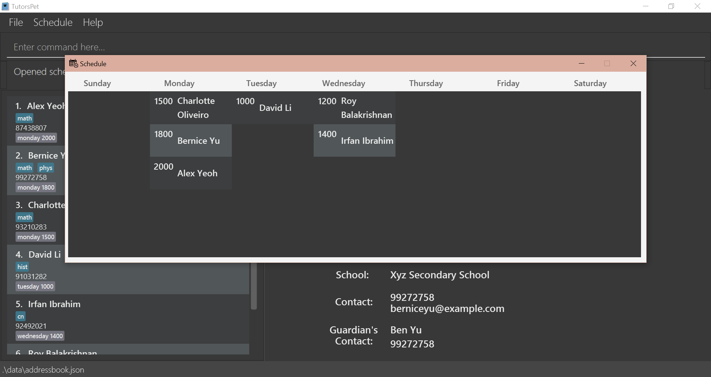

TutorsPet is a **desktop app designed for private tutors to manage students’ information, optimized for use via a Command Line Interface** (CLI) while still having the benefits of a Graphical User Interface (GUI). TutorsPet helps improve the efficiency and effectiveness of student management by categorizing relevant contact information and keeping track of lesson schedules.

* Table of Contents
{:toc}

--------------------------------------------------------------------------------------------------------------------

## Quick start

1. Ensure you have Java `11` or above installed in your Computer.

1. Download the latest `tutorspet.jar` from [here](https://github.com/AY2021S2-CS2103T-T11-3/tp/releases).

1. Copy the file to the folder you want to use as the _home folder_ for your TutorsPet.

1. Double-click the file to start the app. The GUI similar to the below should appear in a few seconds. Note how the app contains some sample data. 
   

1. Type the command in the command box and press Enter to execute it. e.g. typing **`help`** and pressing Enter will open the help window. 
   Some example commands you can try:

   * **`list`** : Lists all contacts.
     
   * **`schedule`** : Opens a window that shows the weekly schedule.

   * **`add`**`n/Alice Tan p/98765432 s/Abc Secondary School e/alicet@example.com a/John street, block 123, #01-01 gn/Mary Tan gp/23456789` : Adds a student's contact named `Alice Tan` to TutorsPet.

   * **`delete`**`3` : Deletes the 3rd contact shown in the current list.

   * **`clear`** : Deletes all contacts.

   * **`exit`** : Exits the app.

1. Refer to the [Features](#features) below for details of each command.

--------------------------------------------------------------------------------------------------------------------

## Features

**:information_source: Notes about the command format:** 

* Words in `UPPER_CASE` are the parameters to be supplied by the user. 
  e.g. in `add n/NAME`, `NAME` is a parameter which can be used as `add n/John Doe`.

* Items in square brackets are optional. 
  e.g `n/NAME [t/SUBJECT]` can be used as `n/John Doe t/econ` or as `n/John Doe`.

* Items with `…`​ after them can be used multiple times including zero times. 
  e.g. `[t/SUBJECT]…​` can be used as ` ` (i.e. 0 times), `t/chem`, `t/phys t/math` etc.
  
* Subjects are represented by abbreviated name. Available names are `bio`, `chem`, `cn`, `econ`, `eng`, `geo`, `hist`, `math`, `phys`.
They represent subjects Biology, Chemistry, Chinese, Economics, English, Geography, History, Mathematics and Physics respectively.
  
* Parameters can be in any order. 
  e.g. if the command specifies `n/NAME p/PHONE_NUMBER`, `p/PHONE_NUMBER n/NAME` is also acceptable.

* If a parameter is expected only once in the command but you specified it multiple times, only the last occurrence of the parameter will be taken. 
  e.g. if you specify `p/12341234 p/56785678`, only `p/56785678` will be taken.

* Extraneous parameters for commands that do not take in parameters (such as `help`, `list`, `exit` and `clear`) will be ignored. 
  e.g. if the command specifies `help 123`, it will be interpreted as `help`.

### Viewing help : `help`

Shows a message explaining how to access the help page.

Format: `help`

### Viewing schedule : `schedule`

Shows a weekly schedule that displays lessons for the week.

Format: `schedule`

### Adding a contact: `add`

Adds a student’s contact to TutorsPet.

Format: `add n/NAME p/PHONE [s/SCHOOL] [e/EMAIL] [a/ADDRESS] [gn/GUARDIAN_NAME] [gp/GUARDIAN_PHONE] [t/SUBJECT]…​ [l/LESSON]…​`

:bulb:**Tip:** 

* `n/NAME p/PHONE` are compulsory fields that must be provided, while `s/SCHOOL e/EMAIL a/ADDRESS gn/GUARDIAN_NAME gp/GUARDIAN_PHONE [t/SUBJECT]…​ [l/LESSON]…​` are optional.
  
* A student’s contact can have any number of subjects (including 0)
  
* A student’s contact can have any number of lessons (including 0)

Examples:
* `add n/John Doe p/98612341`
* `add n/Alice Tan p/98765432 s/Abc Secondary School e/alicet@example.com a/John street, block 123, #01-01 gn/Mary Tan gp/23456789`
* `add n/Bob Lee t/sec3 p/87654321 s/Def Secondary School e/bobl@example.com a/Bob street, block 321, #01-02 gn/John Lee gp/12345678 t/maths l/monday 1300`

### Listing all contacts : `list`

Shows a list of all student contacts in TutorsPet. Each student's name, phone number, subjects and lessons are displayed. 

Format: `list`

### Editing a contact : `edit`

Edits an existing student in TutorsPet.

Format: `edit INDEX [n/NAME] [p/PHONE] [s/SCHOOL] [e/EMAIL] [a/ADDRESS] [gn/GUARDIAN_NAME] [gp/GUARDIAN_PHONE] [t/SUBJECT] [l/LESSON]…​`

* Edits the student at the specified `INDEX`.
* The index refers to the index number shown in the displayed student list.
* The index **must be a positive integer** 1, 2, 3, …​
* At least one of the optional fields must be provided.
* Existing values will be updated to the input values.
* When editing subjects or lessons, the existing subjects or lessons of the student will be removed i.e adding of subjects or lessons are not cumulative.
* You can remove all the student’s subjects by typing `t/` without specifying any subject names after it.
* You can remove all the student’s lessons by typing `l/` without specifying any lesson details after it.

Examples:
*  `edit 1 p/91234567 e/johndoe@example.com` Edits the phone number and email address of the 1st student to be `91234567` and `johndoe@example.com` respectively.
*  `edit 2 n/Betsy Crower t/` Edits the name of the 2nd student to be `Betsy Crower` and clears all existing subjects.
*  `edit 1 l/monday 1300 l/tuesday 1400` Edits the 1st student's contact to add 2 lesson details, `monday 1300` and `tuesday 1400`

### Searching for a contact: `search`

Searches for a student’s contact whose details contain any of the given keywords.

Format: `search [n/KEYWORDS] [s/KEYWORDS] [t/KEYWORDS] [MORE_KEYWORDS]`

* At least one prefix must be used.
* Any number of prefixes can be used concurrently.
* The search is case-insensitive. E.g. `TAN` will match `Tan` .
* The order of the keywords does not matter. E.g. `Tan Alice` will match `Alice Tan`.
* Name, school and subjects can be searched according to the prefix.
* Only full words will be matched e.g. `Ta` will not match `Tan`
* Contacts matching at least one keyword will be returned. 
  E.g. `Alice Tan` will return `Alice Ng` and `Bob Tan`.

Examples:
* `search n/eliza s/woodlands t/math` returns student whose name is `Eliza`, students who are studying in `woodlands primary school`, and students with `math` subject
* `search n/Patrick Lim` returns `patrick lim` and `Lim Zi Ying`
* `search s/woodlands` returns students studying in `woodlands primary school` and `woodlands secondary school`
* `search s/raffles hwa` returns students studying in `Raffles Institution` and `Hwa chong institution`

### Searching for a contact by name: `search n/...`
Searches for a student’s contact whose contact name contains any of the given keywords.

Format: `search n/KEYWORD [MORE_KEYWORDS]`

* The search is case-insensitive.  
  E.g. `TAN` will match `Tan`
* The order of the keywords does not matter.  
  E.g. `Tan Alice` will match `Alice Tan`
* Only the name is searched.
* Only full words will be matched.  
  E.g. `Ta` will not match `Tan`
* Contacts matching at least one keyword will be returned.  
  E.g. `Alice Tan` will return `Alice Ng` and `Bob Tan`

Examples:
* `search n/eliza` returns `Eliza` and `Eliza Ng`
* `search n/Patrick Lim` returns `patrick lim` and `Lim Zi Ying`

### Searching for a contact by school: `search s/...`
Searches for a student's contact from a specific school using keywords

Format: `search s/KEYWORD [MORE_KEYWORDS]`

* The search is case-insensitive.  
  e.g `RAFFLES JUNIOR COLLEGE` will match students studying in `Raffles junior college`
* The order of the keywords does not matter. 
  e.g. `Chong Hwa` will match students studying in `Hwa Chong Institution`
* Only the stated keyword is searched.
* Only full words will be matched e.g. `Raffle` will not match `Raffles`
* The contact matching at least one keyword will be returned (i.e. OR search).  
  e.g. `Raffles Hwa` will return students studying in `Raffles Junior College`or `Hwa Chong Institution`

Examples:
* `search s/woodlands` returns students studying in `woodlands primary school` and `woodlands secondary school`
* `search s/raffles hwa` returns students studying in `Raffles Institution` and `Hwa chong institution`

### Searching for a contact by subject: `search t/...`
Searches for a student's contact with a specific subject using keywords

Format: `search t/KEYWORD [MORE_KEYWORDS]`

* The search is case-insensitive.  
  e.g `MATH` will match students with subject `math`
* Only the stated keyword is searched.
* Only full words will be matched e.g. `Math` will not match `Maths`

Examples:
* `search t/CHEM`, `search t/chem`, and `search t/Chem` can all return students with the subject `chem`

### Sorting contacts: `sort`
Sorting for student’s contacts by name, school, subjects or lessons.

Format: `search n/`, `search s/`, `search t/` or `search l/`

### Viewing a contact details: `detail`

View the full details of the specified student's contact from TutorsPet.
The specified student's name, school, phone number, email, address, guardian name and guardian's phone number will
be displayed. 

Format: `detail INDEX`

* Views the contact at the specified `INDEX`.
* The index refers to the index number shown in the displayed student list.
* The index **must be a positive integer** 1, 2, 3, …​

Examples:
* `list` followed by `detail 2` views the details of the 2nd student in TutorsPet.
* `search n/Betsy` followed by `detail 1` views the details of the 1st student in the results of the `search` command.

### Deleting a contact : `delete`

Permanently deletes the specified student's contact from the address book.

Format: `delete INDEX`

* Deletes the contact at the specified `INDEX`.
* The index refers to the index number shown in the displayed student list.
* The index **must be a positive integer** 1, 2, 3, …​

Examples:
* `list` followed by `delete 2` deletes the 2nd student in TutorsPet.
* `search n/Betsy` followed by `delete 1` deletes the 1st student in the results of the `search` command.

### Adding an important date: `add-date`

Adds an important date to TutorsPet.

Format: `add-date d/DESCRIPTION dt/DETAILS`

* `DETAILS` must be in the **yyyy-mm-dd HHmm format** e.g. `2021-11-03 0800`

Examples:
* `add-date d/math exam dt/2021-11-03 0800`

### Listing all important dates : `list-date`

Shows a list of all important dates in TutorsPet.

Format: `list-date`

### Deleting an important date : `delete-date`

Permanently deletes the specified important date from TutorsPet.

Format: `delete-date INDEX`

* Deletes the important date at the specified `INDEX`.
* The index refers to the index number shown in the displayed important dates list.
* The index **must be a positive integer** 1, 2, 3, …​

Examples:
* `list-date` followed by `delete-date 2` deletes the 2nd important date in TutorsPet.

### Clearing all entries : `clear`

Clears all entries from TutorsPet.

Format: `clear`

### Exiting the program : `exit`

Exits the program.

Format: `exit`

### Saving the data

TutorsPet data are saved in the hard disk automatically after any command that changes the data. There is no need to save manually.

### Editing the data file

TutorsPet data are saved as a JSON file `[JAR file location]/data/addressbook.json`. Advanced users are welcome to update data directly by editing that data file.

:exclamation: **Caution:**
If your changes to the data file makes its format invalid, TutorsPet will discard all data and start with an empty data file at the next run.

##Coming soon

### Add a subject to teach`[coming in v2.0]`

_Format: `add-subject SUBJECT_NAME`   In v1.3, there is a fixed list of subjects that is available to teach and can be tagged in TutorsPet, 
while in v1.4, more personalised subjects can be added in._

### Undo/Redo `[coming in v2.0]`

_Details coming soon ..._

### Archiving data files `[coming in v2.0]`

_Details coming soon ..._

--------------------------------------------------------------------------------------------------------------------

## FAQ

**Q**: How do I transfer my data to another Computer? 
**A**: Install the app in the other computer and overwrite the empty data file it creates with the file that contains the data of your previous TutorsPet home folder.

--------------------------------------------------------------------------------------------------------------------

## Command summary

Action | Format, Examples
--------|------------------
**Add** | `add n/NAME p/PHONE [s/SCHOOL] [e/EMAIL] [a/ADDRESS] [gn/GUARDIAN_NAME] [gp/GUARDIAN_PHONE] [t/SUBJECT]…​ [l/LESSON]…​`   e.g., `add n/Bob Lee p/87654321 s/Def Secondary School a/Bob street, block 321, #01-02 gn/John Lee gp/12345678 t/sec3`
**Clear** | `clear`
**Delete** | `delete INDEX`  e.g., `delete 3`
**Edit** | `edit INDEX [n/NAME] [s/SCHOOL] [p/PHONE] [e/EMAIL] [a/ADDRESS] [gn/GUARDIAN_NAME] [gp/GUARDIAN_PHONE] [t/SUBJECT]…​ [l/LESSON]…​`  e.g.,`edit 2 n/James Lee e/jameslee@example.com`
**Search** | `search [n/KEYWORDS] [s/KEYWORDS] [t/KEYWORDS] [MORE_KEYWORDS]`  e.g., `search n/James Jake s/woodlands t/science`
**Schedule** | `schedule`
**Detail** | `detail INDEX`   e.g., `detail 1`
**List** | `list`
**Add dates** | `add-date d/DESCRIPTION dt/DETAILS`  e.g, `add-date d/math exam dt/2021-11-05 1300`
**Delete dates** | `delete-date INDEX`  e.g., `delete-date 3`
**List dates** | `list-date`
**Help** | `help`
