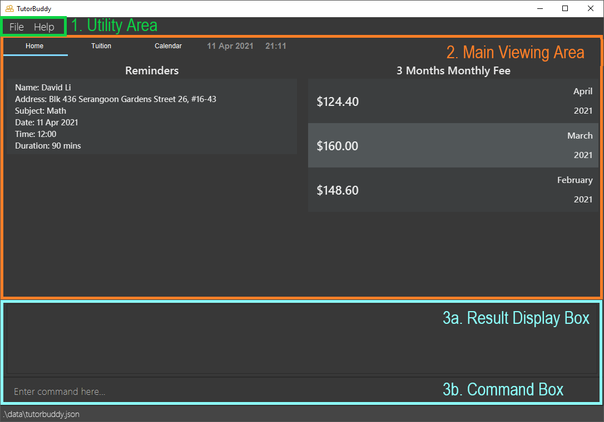

  

# TutorBuddy - User Guide

**Table of Contents**
* [Introduction](#introduction)
* [About](#about)
* [Quick start](#quick-start)
* [Commands](#commands)
  * [Open help panel: `help`](#viewing-help--help)
  * [Listing all students: `list_student`](#listing-all-students-list_student)
  * [Locating student profile by name: `find_student`](#locating-student-profile-by-name-find_student)
  * [Adding a student: `add_student`](#adding-a-student-add_student)
  * [Deleting a student: `delete_student`](#deleting-a-student-delete_student)
  * [Listing students' emails based on current list: `emails`](#listing-students-emails-based-on-current-list-emails)
  * [Listing all tuition sessions: `list_session`](#listing-all-tuition-sessions-list_session)
  <!--* [Locating tuition session by student name / date: `find_session`](#locating-tuition-session-by-student-name--date-find_session)-->
  * [Adding a tuition session: `add_session`](#adding-a-single-tuition-session-add_session)
  * [Adding a recurring tuition session: `add_rec_session`](#adding-a-recurring-tuition-session-add_rec_session)
  * [Deleting a tuition session: `delete_session`](#deleting-a-tuition-session-delete_session)
  * [Getting monthly fee for a particular student: `fee`](#getting-monthly-fee-for-a-particular-student-fee)
  * [Clears all entries in the program: `clear`](#clearing-all-entries--clear)
  * [Exit the program: `exit`](#exit-the-program-exit)
* [FAQ](#faq)
* [Command Summary](#command-summary)

--------------------------------------------------------------------------------------------------------------------
## Introduction
TutorBuddy is a desktop application made for freelance tutors to efficiently manage their students' contacts,
provide a quick overview of scheduled tuition sessions at a glance, and handle monthly tuition fees calculation.
TutorBuddy is also optimized for fast typing users to handle their day-to-day administrative responsibilities
effectively.

--------------------------------------------------------------------------------------------------------------------
## About
This user guide provides documentation on the installation and usage of TutorBuddy.
It also provides a comprehensive description of features available to you and
includes a [quick-start](#quick-start) section that helps you get started.

This guide uses the following features to make it easier for you to navigate around:

* Words that look like [this](#about) can be clicked to jump to the related section.
* Words that look like `this` refer to keywords used as part of commands or responses from TutorBuddy.
* Words that look like <kbd>this</kbd> refer to keyboard keys that you can press.

Boxes with the :information_source: icon contain additional useful information.

Boxes with the :bulb: icon contain additional tips and tricks to help you get the most out of TutorBuddy.

--------------------------------------------------------------------------------------------------------------------
## Quick start
This section provides information on how to quickly start using TutorBuddy.

### Installation
Here are a few steps to get you started on TutorBuddy:

1. Ensure you have **Java 11** or above installed in your computer.

1. Download the latest version of TutorBuddy [here](https://github.com/AY2021S2-CS2103T-T11-1/tp/releases).

1. Move the downloaded TutorBuddy to a folder of your choice. This will be known as the home folder of TutorBuddy.

1. Double-click the file to start the application. An application similar to the one below should appear in a few
   seconds. 

### Using TutorBuddy

This section offers an overview of the layout in TutorBuddy.

There are three main areas in TutorBuddy:

1. the utility area,

1. the main viewing area,

1. the result display box and command box

1. The utility area consists of 2 tabs: **File**, and **Help**.
* The **File** tab consists of an exit button. To exit TutorBuddy, click on the exit button. Alternatively, use the `exit` command to exit the application.
* The **Help** tab consists of a help button. If you require any assistance, click on the help button, copy the link
  displayed and paste it into any web browser. Alternatively, press <kbd>F1</kbd> to bring up the help window.

2. The main viewing area consists of 3 tabs: **Home**, **Tuition** and **Calendar**.
* The **Home** tab gives tutors a quick overview of important matters. This includes their upcoming tuition lessons, as well as tuition fees receivable for the past 3 months.
* The **Tuition** tab allow tutors to view and manage their students and lessons.
* The **Calendar** tab allow tutors to have a weekly view of all sessions.

3. The command box is the area for you to enter your commands. The result of each command will be shown in the result
   display box, which is located directly above the command box.

* Type a command in the command box and press <kbd>Enter</kbd> to execute it. 

  Here are some example commands you can try:

  * **`list`** : Lists all students and sessions.

  * **`add_student`**`n/John Doe p/98765432 e/johnd@example.com a/John street, block 123, #01-01 l/Sec2 g/95421323 r/Mother` : Adds a student named `John Doe`
    to TutorBuddy.

  * **`delete_student`**`3` : Deletes the 3rd student shown in the Student section.

  * **`add_session`**`n/John Doe d/2021-01-01 t/13:00 k/120 s/Biology f/80`: Adds a single tuition session for John Doe happening on 2021-01-01

  * **`add_recurring_session`**`n/John Doe d/2021-01-01 t/18:00 k/120 s/Biology f/80 b/7 e/2021-01-15`: Adds a 7-day recurring session for John Doe happening from 2021-01-01 to 2021-01-15

  * **`exit`** : Exits the application.

* Refer to the [Features](#features) below for details of each command.

--------------------------------------------------------------------------------------------------------------------

## Commands

Commands are the main way you interact with TutorBuddy.

This section provides information about all commands that is available in TutorBuddy.

### Command Format

**:information_source: Notes about the command format:** 

This section details the format of the commands available in Tutor's Pet. We will adhere to the following:

* Words in `UPPER_CASE` are the parameters to be supplied by the user. 
  e.g. in `add_student n/NAME`, `NAME` is a parameter which can be used as `add n/John Doe`.

* Items in square brackets are optional. 
  e.g `find_student KEYWORD [MORE_KEYWORDS]` can be used as `find_student John Samuel` or as `find_student John`.

* Parameters can be in any order. 
  e.g. if the command specifies `n/NAME p/PHONE_NUMBER`, `p/PHONE_NUMBER n/NAME` is also acceptable.

* If a parameter is expected only once in the command but you specified it multiple times, only the last occurrence of the parameter will be taken. 
  e.g. if you specify `p/12341234 p/56785678`, only `p/56785678` will be taken.

* Extraneous parameters for commands that do not take in parameters (such as `emails`, `help`, `exit`, `clear` and `list_student`) will be ignored. 
  e.g. if the command specifies `help 123`, it will be interpreted as `help`.

* Indexes **must be positive whole numbers** 1, 2, 3, …

* The `STUDENT_INDEX` refers to the index number shown in the [displayed student list](#application-overview).

* The `SESSION_INDEX` refers to the index number shown in the [displayed session list](#application-overview).

* Time must be input in the format, `hh:mm`.
  e.g. `13:00` is allowed, but not `1300`.
  
* Date must be input in the format, `yyyy-mm-dd`.
  e.g. `2021-01-01` is allowed, but not `01-01-2021`.
  

### General

#### Viewing help : `help`

Shows a message explaining how to access the help page.

Format: `help`

#### Listing all students: `list_student`

Displays list of all students in TutorBuddy.

Format: `list_student`  

### Locating student profile by name: `find_student`

Finds students whose names contain any of the given keywords.

Format: `find_student KEYWORD [MORE_KEYWORDS]`
* The search will be case-insensitive. e.g. searching `stonks` will match `STONKS`
* Only the student’s name will be searched
* The order of the keywords does not matter. e.g. `Hans Bo` will match `Bo Hans`
* Only full words will be matched e.g. `Han` will not match `Hans`
* Students matching at least one keyword will be returned (i.e. `OR` search)
  e.g. `Hans Bo` will return `Hans Gruber`, `Bo Yang`

Examples:

\# | Student Name
---- |---------
1 | John Lee
2 | Johnz Tan
3 | Jon Koh
4 | Samuel Lee

*Figure 1: Current State of Student List*

Example command usages from the current student list shown in Figure 1:

* `find_student John` returns John Lee
* `find_student Sam` returns nothing
* `find_student Lee` returns "John Lee" and "Samuel Lee"
* `find_student Johnz Lee` returns "Johnz Tan", "John Lee" and "Samuel Lee"

### Adding a student: `add_student`

Adds a student to the TutorBuddy

Format: `add_student n/NAME p/STUDENT_PHONE_NUMBER e/EMAIL a/ADDRESS l/STUDY_LEVEL g/GUARDIAN_PHONE_NUMBER r/RELATIONSHIP_WITH_GUARDIAN`  
* `STUDENT_PHONE_NUMBER`, `GUARDIAN_PHONE_NUMBER` should be in Singapore's phone formatting (i.e. starting with either 6, 8 or 9 and 8 digits)

Examples:
* `add_student n/John Doe p/98765432 e/johnd@example.com a/John street, block 123, #01-01 l/Sec2 g/95421323 r/Mother`

### Deleting a student: `delete_student`

Deletes the specified student from TutorBuddy

Format: `delete_student INDEX`  

:bulb: **Tip:**
You could use `find_student` first to filter the list of students you want. 
The INDEX would then be based on the current list instead. 
(E.g. If John Doe is the 500th student, instead of delete_student 500, you can use find_student John Doe and
delete_student 1 if the John Doe you would like to delete is the 1st in the list)

Examples:
* `delete_student 2` deletes the 2nd student based on the current list of students

### Listing students' emails based on current list: `emails`
Displays concatenated string of students' emails based on current list, separated by `;`. Useful for sending mass emails to students.

Format: `emails`

Examples:

\# | Student Name | Email
---- |---------|------|
1 | John Lee | johnlee@gmail.com
2 | Johnz Tan | johnztan@gmail.com
3 | Jon Koh | jonkoh@gmail.com
4 | Samuel Lee | sam@gmail.com

*Figure 2.1 State of Student List After `list_student` command*

\# | Student Name | Email
---- |---------|------|
1 | John Lee | johnlee@gmail.com
2 | Jon Koh | jonkoh@gmail.com

*Figure 2.2 State of Student List After `find_student john jon` command*

* To get emails of all students (see Figure 2.1): `list_student` followed by `emails` returns `johnlee@gmail.com;johnztan@gmail.com;jonkoh@gmail.com;sam@gmail.com;`

* To get emails of specific students (see Figure 2.2): `find_student john jon` followed by  `emails` returns `johnlee@gmail.com;jonkoh@gmail.com;`

### Listing all tuition sessions: `list_session`

Shows a list of all tuition sessions in TutorBuddy

Format: `list_session`

<!-- COMMENT OUT FOR FIND SESSION -->
<!--### Locating tuition session by student name and session index: `find_session`

Find tuition sessions that match the keyword given

Format: `find_session s/STUDENT_NAME i/SESSION_INDEX`
* The search will be case-insensitive. e.g. searching “stonks” will match “STONKS”
* For student names:
  * Any word that a student’s name contains will be matched. For example, if a session student’s name is “moon”, searching “moo” will match it

Examples: 
The command `list_session` will show the following:

\# | Sessions
---- |---------
1 | John Lee 15/2/2021 13:00 2h $60/h Computer Science
2 | Johnz Lee 16/2/2021 14:00 1.5h $30/h Math
3 | John Dam 18/2/2021 15:00 2h $0.10/h Software Engineering
4 | Sammuel Bruce Lee 19/2/2021 18:00 2h $30/h Wing Chun

* `find_session John` returns all John in TutorBuddy
* `find_session Jo` returns all John in TutorBuddy
* `find_session John Lee` returns all John Lee in TutorBuddy
* `find_session Zach` returns nothing-->
<!-- END OF COMMENT OUT FOR FIND SESSION -->

### Adding a single tuition session: `add_session`

Adds a single tuition session to the TutorBuddy

Format: `add_session n/STUDENT_NAME d/DATE t/TIME k/DURATION s/SUBJECT f/FEE`

* `STUDENT_NAME` should match the exact student’s name in TutorBuddy
* `DATE` should be in YYYY-MM-DD format
* `TIME` should be in HH:MM 24-hr format
* `DURATION` should be in minutes
* `FEE` should be the total tuition fee for the total duration

:bulb: **Tip:**
TutorBuddy takes care of overlapping session for you by giving a gentle prompt, so you don't have to worry about it.

Examples:
* `add_session n/John Doe d/2021-01-01 t/18:00 k/120 s/Biology f/80`

### Adding a recurring tuition session: `add_rec_session`

Adds a recurring tuition session to the TutorBuddy

Format: `add_rec_session n/STUDENT_NAME d/DATE t/TIME k/DURATION s/SUBJECT f/FEE b/INTERVAL e/LASTDATE`

Similar to arguments for adding a single tuition session, except:
* `DATE` refers to the starting date of the session

Arguments additional to adding a single tuition session:  
* `INTERVAL` should be in days, including the date from and excluding the date to  
  e.g. `INTERVAL` = 7 for weekly sessions
* `ENDDATE` should be an ending date of the recurring session, consistent with `DATE` and `INTERVAL`

Examples:
* `add_session n/John Doe d/2021-01-01 t/18:00 k/120 s/Biology f/80 b/7 e/2021-01-29`
### Deleting a tuition session: `delete_session`

Deletes the specified tuition session from TutorBuddy

Format: `delete_session n/STUDENT_NAME i/SESSION_INDEX`

* Deletes the tuition session at the specified `SESSION_INDEX`
* `SESSION_INDEX` refers to the session index respective to the student specified under `STUDENT_NAME`
* The index must be a positive integer 1, 2, 3, …​

Examples:
* `delete_session n/John Lee i/1` deletes John Lee's **first** session

### Getting monthly fee for a particular student: `fee`

Get the monthly fee for a particular student for a particular month and year

Format: `fee n/STUDENT_NAME m/MONTH y/YEAR`

* `STUDENT_NAME` should match the exact student’s name in TutorBuddy
* `MONTH` should be a positive integer between 1 and 12
* `YEAR` should be a positive integer between 1970 and 2037

Examples:
* `fee n/John Lee m/1 y/2021` get John Lee monthly fee for January 2021

### Clearing all entries : `clear`

Clears all entries from the TutorBuddy application.

:bulb: **Tip:**
TutorBuddy gives you some sample data to work with at the start.  
After trying out the application, you can run the `clear` command to start working with a fresh piece of TutorBuddy in a split second.

Format: `clear`

### Exit the program: `exit`

Exits the program

Format: `exit`

--------------------------------------------------------------------------------------------------------------------

## FAQ

**Q**: How do I transfer my data to another Computer? 
**A**: Install the app in the other computer and overwrite the empty data file it creates with the file that contains the data of your previous TutorBuddy home folder.

--------------------------------------------------------------------------------------------------------------------

## Command summary

**Students**

Action | Format, Examples
--------|------------------
**List** | `list_student`
**Find** | `find_student KEYWORD [MORE_KEYWORDS]`  e.g. `find_student John Alex`
**Add** | `add_student n/NAME p/STUDENT_PHONE_NUMBER e/EMAIL a/ADDRESS l/STUDY_LEVEL g/GUARDIAN_PHONE_NUMBER r/RELATIONSHIP_WITH_GUARDIAN`   e.g., `add_student n/John Doe p/98765432 e/johnd@example.com a/John street, block 123, #01-01 l/Sec2 g/95421323 r/Mother`
**Delete** | `delete_student INDEX`  e.g. `delete_student 3`
**List students' emails based on current list** | `emails`

**Tuition Session**

Action | Format, Examples
--------|------------------
**List** | `list_session`
**Find** | `find_session KEYWORD`  e.g. `find_session John`
**Add Single** | `add_session n/STUDENT_NAME d/DATE t/TIME k/DURATION s/SUBJECT f/FEE`   e.g. `add_session n/John Doe d/2021-01-01 t/18:00 k/120 s/Biology f/80`
**Add Recurring** | `add_rec_session n/STUDENT_NAME d/DATE t/TIME k/DURATION s/SUBJECT f/FEE b/INTERVAL e/LASTDATE`   e.g. `add_rec_session n/John Doe d/2021-01-01 t/20:00 k/120 s/Geography f/80 b/7 e/2021-01-15`
**Delete** | `delete_session n/STUDENT_NAME i/SESSION_INDEX`  e.g. `delete_session n/John Lee i/1`

**Fees**

Action | Format, Examples
--------|------------------
**Fee** | `fee n/STUDENT_NAME m/MONTH y/YEAR`  e.g. `fee n/John Lee m/1 y/2021`

**Others**

Action | Format, Examples
--------|------------------
**Help** | `help`
**Clear** | `clear`
**Exit** | `exit`
