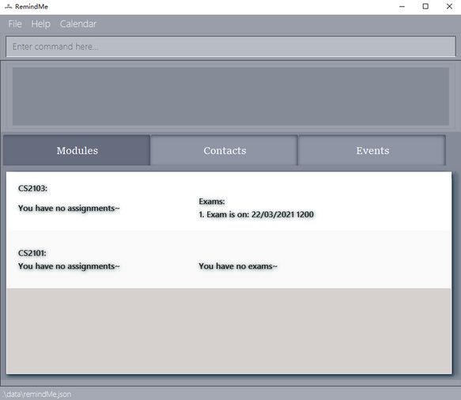
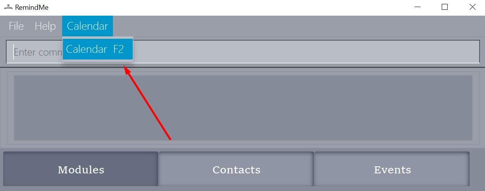
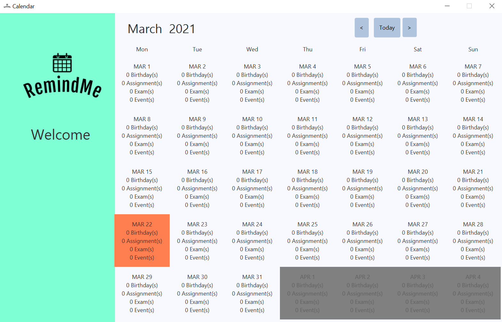
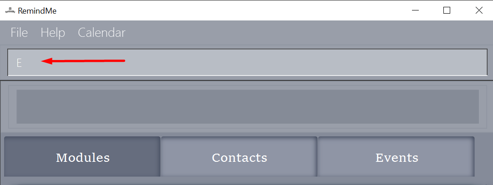

RemindMe User Guide v1.3
---
This user guide provides [start-up](#2-quick-start) instructions as well as detailed descriptions and usage of
all the [features](#3-features) in the RemindMe app. You can also access the product website via [link](https://ay2021s2-cs2103t-w15-1.github.io/tp/).

## Table of Contents

* **[1. Introduction](#1-introduction)**
* **[2. Quick Start](#2-quick-start)**
* **[3. Features](#3-features)**
    * **[3.1 Viewing Help : `help`](#viewing-help--help)**
    * **[3.2 Adding: `add`](#32-adding-add)**
      * [3.2.1 Adding a person](#321-adding-a-person)
      * [3.2.2 Adding a module](#322-adding-a-module)
      * [3.2.3 Adding an assignment](#323-adding-an-assignment)
      * [3.2.4 Adding an exam](#324-adding-an-exam)
      * [3.2.5 Adding a general event](#325-adding-a-general-event)
    * **[3.3 Editing: `edit`](#33-editing-edit)**
      * [3.3.1 Editing a person](#331-editing-a-person)
      * [3.3.2 Editing a module](#332-editing-a-module)
      * [3.3.3 Editing an assignment](#333-editing-an-assignment)
      * [3.3.4 Editing an exam](#334-editing-an-exam)
      * [3.3.5 Editing a general event](#335-editing-a-general-event)
    * **[3.4 Finding: `find`](#34-finding-find)**
      * [3.4.1 Finding persons](#341-finding-persons)
      * [3.4.2 Finding modules](#342-finding-modules)  
      * [3.4.3 Finding general events](#343-finding-general-events)
    * **[3.5 Marking as done `done`](#35-marking-as-done-done)**
    * **[3.6 Deleting: `delete`](#36-deleting-delete)**
      * [3.6.1 Deleting a person](#361-deleting-a-person)
      * [3.6.2 Deleting a module](#362-deleting-a-module)
      * [3.6.3 Deleting an assignment](#363-deleting-an-assignment)
      * [3.6.4 Deleting an exam](#364-deleting-an-exam)
      * [3.6.5 Deleting a general event](#365-deleting-a-general-event)  
    * **[3.7 Clearing: `clear`](#37-clearing-clear)**
      * [3.7.1 Clearing RemindMe](#371-clearing-remindme)
      * [3.7.2 Clearing all persons](#372-clearing-all-persons)
      * [3.7.3 Clearing all modules](#373-clearing-all-modules)
      * [3.7.4 Clearing all general events](#374-clearing-all-general-events)  
    * **[3.8 Viewing calendar: `calendar`](#38-viewing-calendar-calendar-c)**
    * **[3.9 Saving the data](#39-saving-the-data)**
    * **[3.10 Reminder window](#310-reminder-window)**
    * **[3.11 Exiting the program: `exit`](#311-exiting-the-program-exit-e)**
* **[FAQ](#4-faq)**
* **[Command summary](#5-command-summary)**

--------------------------------------------------------------------------------------------------------------------

## 1. Introduction
RemindMe is designed for students from the School of Computing(SOC) in Nation University of Singapore(NUS) to manage school modules and 
events meanwhile keep track of submission deadlines and friends' birthday. To better help the students with scheduling and visualization,
it even provides a calendar view of all the events. RemindMe is optimized for students who prefer to work with
a Command Line Interface(CLI) while still having the benefits of a Graphical User Interface(GUI). We believe the tech-savvy SOC students
can reap more benefits from our RemindMe app as compared to other traditional general scheduling apps. What are you waiting for?
Jump to [Section 2](#2-quick-start) to get started. Hope you enjoy our app.
 

--------------------------------------------------------------------------------------------------------------------

## 2. Quick Start

1. Ensure you have Java `11` or above installed on your computer. You can download Java 11 via this [link.](https://www.oracle.com/sg/java/technologies/javase-jdk11-downloads.html)
   * Set-up tutorial:
        * [Windows user](https://java.tutorials24x7.com/blog/how-to-install-java-11-on-windows)
        * [Mac user](https://docs.oracle.com/en/java/javase/11/install/installation-jdk-macos.html#GUID-2FE451B0-9572-4E38-A1A5-568B77B146DE)
        * [Linux user](https://docs.oracle.com/en/java/javase/11/install/installation-jdk-linux-platforms.html#GUID-737A84E4-2EFF-4D38-8E60-3E29D1B884B8)
   
2. Download the latest `remindMe.jar` from our [GitHub release page](https://github.com/AY2021S2-CS2103T-W15-1/tp/releases).
Copy the file to the folder you want to use as the home folder for your RemindMe.
Double click the file to start the app. 
   
3. Alternatively, you can run the command line java -jar RemindMe.jar in your terminal to start the application.
Type the command in the command box and press Enter to execute it.
The GUI similar to the below should appear in a few seconds. Note how the app contains some sample data. 
   

4. Press start to proceed to the main window.
         

5. Type the command in the command box and press enter on the keyboard to execute it.   eg. typing `help` and press enter will open the help window.

6. Some example commands you can try:
   * **`add m/CS2103`** : Adds a module name CS2103.
     
   * **`calendar`**: Dsiplays the calendar with the tasks' deadlines and friends' birthdays.
     
   * **`exit`** : Exits the app.
   
7. Refer to [Section 3: Features](#3-features) for details of each command.  

--------------------------------------------------------------------------------------------------------------------

## 3. Features

**Notes about the command format:** 

* Words in `UPPER_CASE` are the parameters to be supplied by the user. 
  e.g. in `add m/MODULE`, `MODULE` is a parameter which can be used as `add m/CS2103`.

* Items in square brackets are optional. 
  e.g `add n/Name [t/TAG]` can be used as `add n/Alice t/friends` or as `add n/Alice`.
  

* Extraneous parameters for commands that do not take in parameters (such as `help` and `exit`) will be ignored. 
  e.g. if the command specifies `help 123`, it will be interpreted as `help`.

### 3.1 Viewing Help : `help`

Shows a help page.

Format: `help`

### 3.2 Adding: `add`
This section show features that deals with the adding of entries in the RemindMe app.
 

**Note:** 

* Duplicate object is not allowed.
    * for eg. Module with same name, assignment with same module, description and date time, etc. 

* The adding of an assignment/exam requires the related module to be added first.

 
#### 3.2.1 Adding a person
Add a person with his/her birthday to the RemindMe app.

Format: `add n/NAME b/BIRTHDAY [t/TAG]`

Examples:
* `add n/Alice b/22/10/1999`
* `add n/Benson b/30/09/1997 t/friends`

Results expected:
* `New person added: Alice`   `Birthday: 22/10/1999`

#### 3.2.2 Adding a module
Add a module with the module description.

Format: `add m/MODULE`

Example:
* `add m/CS2101`

Result expected:

* `New module added: CS2101`

#### 3.2.3 Adding an assignment
Add an assignment under a module with the deadline provided.

Format: `add m/MODULE a/ASSIGNMENT by/dd/mm/yyyy HHmm`

Example:
* `add m/CS2101 a/Essay 1 by/01/01/2021 2359`

Result expected:

* `New assignment added: Essay 1 due: 01/01/2021 2359`

#### 3.2.4 Adding an exam
Add an exam under a module with the date time provided.

Format: `add m/MODULE e/dd/mm/yyyy HHmm`

Example:

* `add m/CS2101 e/01/01/2021 2359`

Result expected:
* `New exam added: Exam is on: 01/01/2021 2359`

#### 3.2.5 Adding a general event
Add a general event with the description and date time provided.

    
Format: `add g/GENERALEVENT on/dd/mm/yyyy HHmm`

Example:

* `add g/School contest on/10/10/2021 1200`

Result expected:
* `New event added: School contest on 10/10/2021 1200`

### 3.3 Editing: `edit`
This section show features that deals with the editing of entries in the RemindMe app.

**Note:** 

* Editing of a person/module/event should not result in duplicates. 

* The edit content must not be blank and cannot be the same as the original attribute.

#### 3.3.1 Editing a person
Edit a person in the RemindMe app to change his/her name/birthday/tag.

Format: `edit INDEX [n/NEW NAME b/NEW BIRTHDAY [t/NEW TAG]]`

Examples:
* `edit 1 n/Jason`
* `edit 2 b/30/09/1997`
* `edit 2 t/friend`

Results expected:
* `Edited Person: Jason`   `Birthday: 22/10/1999`

#### 3.3.2 Editing a module
Edit a module in the RemindMe app to change its title.

Format: `edit INDEX m/NEW MODULE TITLE`

Examples:
* `edit 1 m/CS2106`
* `edit 3 m/Software Engineering`

Results expected:
* `Module edited: CS2106`

#### 3.3.3 Editing an assignment
Edit an assignment in a module in the RemindMe app to change its description or deadline.

Format: `edit m/MODULE a/ASSIGNMENT INDEX [d/NEW DESCRIPTION by/NEW DEADLINE]`

Examples:
* `edit m/CS2103T a/2 d/Update UG`
* `edit m/CS2103T a/1 by/27/04/2021 1900`

Results expected:
* `Assignment edited: Update UG due: 23/03/2021 2359`

#### 3.3.4 Editing an exam
Edit an exam in a module in the RemindMe app to change its date.

Format: `edit m/MODULE a/EXAM INDEX on/NEW DATE`

Examples:
* `edit m/CS2103T e/1 on/04/05/2021 1400`

Results expected:
* `Exam edited: Exam is on: 04/05/2021 1400`

#### 3.3.5 Editing a general event
Edit a general event in the RemindMe app to change its date or description.

Format: `edit INDEX [g/NEW DESCRIPTION on/NEW DATE]`

Examples:
* `edit 2 g/FOC logs meeting`
* `edit 1 on/01/04/2021 0001`

Results expected:
* `Event edited: FOC logs meeting on: 10/06/2021 1630`

### 3.4 Finding: `find`
This section show features that deals with the locating of entries in the RemindMe app.

**Note:** 
* All find operations are case-insensitive
* Order of keywords used doesn't matter
* Only whole words are matched

#### 3.4.1 Finding persons
Finds person whose names contain any of the given keywords.  

**Note:** 
* Only the names are matched to the keywords
* Persons matching one keyword will be returned
     * Example: Alice Lim will return: `Alice Tan` & `Lim Bob`

Format: `find n/KEYWORD [MORE KEYWORDS]`  

Examples:
* `find n/Alice`  
    returns `alice` and `Alice Lim `
* `find n/Tom Dick Harry`  
    returns anyone with names containing `Tom`, `Dick` or `Harry`
  
#### 3.4.2 Finding modules
Finds modules with titles containing any of the given keywords.

**Note:** 

* Only the module titles are matched to the keywords
* Modules' titles matching one keyword will be returned
    

    
Format: `find m/KEYWORD [MORE_KEYWORDS]`  

Examples: 
* `find m/CS2101`  
    returns `cs2101`, `CS2101`, `Cs2101` and `cS2101 best mod`  
* `find m/cs2103 cs2101`  
    returns any modules with titles containing `cs2101` or `cs2103`
  
#### 3.4.3 Finding general events
Finds general events with descriptions containing any of the given keywords.  

**Note:** 
* Only the descriptions of the general events are matched to the keywords
* General events' descriptions matching one keyword will be returned
    

    

Format: `find g/KEYWORD [KEYWORDS]`  

Examples:
* `find g/doctor`  
  returns `doctor`, `Doctor` and `doctor Appointment`
* `find g/friend meetup`  
  returns any general events with descriptions containing `friend` or `meetup`

### 3.5 Marking as done: `done`
This section shows the feature that deals with marking an assignment as done. This feature only applies to assignments.
    
Format: `done m/MODULE a/INDEX`

Examples:
* `done m/cs2103 a/1`
    returns [D] Essay 1 due: 01/01/2021 2359

### 3.6 Deleting: `delete`
This section show features that deals with the deleting of entries in the RemindMe app.

**Note:**
* Deleting any item from RemindME requires an item to be present at the given index.
    

     

#### 3.6.1 Deleting a person
Format: `delete INDEX`  

Examples:
* `delete 1`  
  returns Deleted Person: TROY BOLTON
  Birthday: 22/12/1996

#### 3.6.2 Deleting a module
Format: `delete m/MODULE`

Example:
* `delete m/cs2103`  
  returns Deleted Module: cs2103

#### 3.6.3 Deleting an assignment
Format: `delete m/MODULE a/INDEX`

Example:
* `delete m/cs2103 a/1`  
  returns Deleted Assignment: assignment 1 due: 19/12/2021 2359

#### 3.6.4 Deleting an exam
Format: `delete m/MODULE e/EXAM`

Example:
    returns Deleted Assignment: Finals due: 19/12/2021 2359

#### 3.6.5 Deleting a general event
Format: `delete g/INDEX`

Example:
    returns Deleted General Event: event on 19/12/2021 2359
        

### 3.7 Clearing `clear`
This section show features that deals with the clearing of entries in the RemindMe app.
 

:exclamation: **Caution:**
All cleared data cannot be recover.

 
#### 3.7.1 Clearing RemindMe  
Clears all entries in RemindMe.  
Format: `clear`

#### 3.7.2 Clearing all persons
Clears all contacts in RemindMe.  
Format: `clear n/`

#### 3.7.3 Clearing all modules
Clears all modules in RemindMe.  
Format: `clear m/`

#### 3.7.4 Clearing all general events
Clears all general events in RemindMe.
Format: `clear g/`

### 3.8 Viewing calendar `calendar` `C`
There are 3 ways to check out the calendar.
 
1. you may type in the `calendar` in the command box as shown below.

 
2. you may type shortcut `C` in the command box as shown below.

 
3. Lastly, you may click on the calendar and click on the drop out calendar menu.

  
The calendar window which pops up will look like this as shown below.   

  
You may browse through the calendar over the months by clicking the 
left arrow button `<` and right arrow button `>` on the top right of the calendar window.
Additionally, you may click on `today` button to browse back to the month of current day's date.

### 3.9 Saving the data
Saving of data is automatic by the application whenever you 
update RemindMe.

### 3.10 Reminder window
Reminder will automatically pop up at the start of RemindMe.

 

### 3.11 Exiting the program `exit` `E`
There are 3 ways to exit the application. 
 
1. you may type in `exit` in the command box as shown below.

 
2. You may type in `E` in the command box as a shortcut as shown below.

 
3. Lastly, you may simply click the `X` button on the top right hand corner of the
application to exit the program.
   

## 4. FAQ

Q: Can I add assignment/exam first before the module? 
A: No, You need to add a module first.

Q: Can I add multiple modules with the same name?  
A: No, modules must have unique names to identify them.

Q: How do I clear away all my data?   
A: You can use the [`clear` command](#37-clearing-clear).

Q: When you close RemindMe main application, will other window close?  
A: Yes, do take note that if you close the main application, other windows will close as well

## 5. Command Summary
Action | Format
--------|------------------
**Add person** | `add n/NAME b/BIRTHDAY [T/TAG]`
**Add module** | `add m/MODULE`
**Add assignment** | `add m/MODULE a/ASSIGNMENT by/dd/mm/yyyy HHmm`
**Add exam** | `add m/MODULE e/dd/mm/yyyy HHmm`
**Add event** | `add g/GENERALEVENT on/dd/mm/yyyy HHmm`
**Edit person** | `edit INDEX n/NEW NAME b/NEW BIRTHDAY T/NEW TAG`
**Edit module** | `edit INDEX m/NEW MODULE TITLE`
**Edit assignment** | `edit m/MODULE a/INDEX d/NEW DESCRIPTION by/NEW DEADLINE`
**Edit exam** | `edit m/MODULE e/INDEX on/NEW DATE`
**Edit event** | `edit INDEX g/NEW DESCRIPTION on/NEW DATE`
**Find persons** | `find n/KEYWORD [MORE KEYWORDS]`
**Find modules** | `find m/KEYWORD [MORE KEYWORDS]`
**Find general events** | `find g/KEYWORD [MORE KEYWORDS]`
**Delete assignment** | `delete (assignment description)`
**Clear RemindMe** | `clear`
**Clear persons** | `clear n/`
**Clear modules** | `clear m/`
**Clear general events** | `clear g/`
**View assignments** | `view A`
**View events** | `view E`
**See commands available** | `help`
**View calendar** | `calendar` `C`
**Exit program** | `exit` `E`

