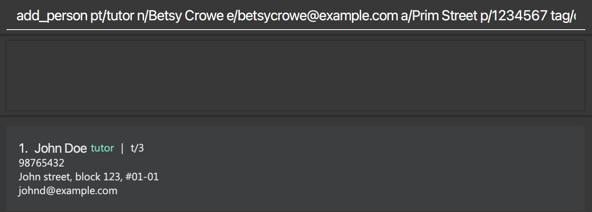
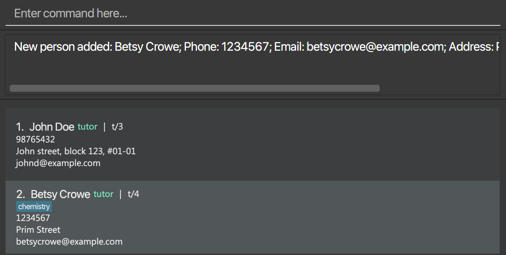

EzManage is a **desktop app for managing students, tutors and sessions, optimized for use via a Command Line Interface** (CLI) while still having the benefits of a Graphical User Interface (GUI). It is named as EzManage as it allows tuition centres managers to easily manage students, tutors and sessions all in one single web application.

- Table of Contents
  {:toc}

---

## Quick start

1. Ensure you have Java `11` or above installed in your Computer.

1. Download the latest `EzManage.jar` from [here](https://github.com/AY2021S2-CS2103-W16-4/tp/releases).

1. Copy the file to the folder you want to use as the _home folder_ for your EzManage.

1. Double-click the file to start the app. An example of the GUI is shown below. Note how the app contains some sample data. 
   

1. Type the command in the command box and press Enter to execute it. e.g. typing **`help`** and pressing Enter will open the help window. 
   Some example commands you can try:

   - **`list persons`** : Lists all students and tutors.

   - **`add_person`**`pt/student n/John Doe p/98765432 e/johnd@example.com a/John street, block 123, #01-01` : Adds a student named `John Doe` to the Contact List.

   * **`delete_person`**`t/1` : Deletes the tutor with the ID `t/1` from the Contact list.
     
   * **`assign`** `s/3 t/2 c/1` : Assigns student(s) or tutor to a specific session.

   * **`clear`** : Deletes all students, tutors and sessions.

   - **`exit`** : Exits the app.

1. Refer to the [Features](#features) below for details of each command.

---

## Features

**:information_source: Notes about the command format:** 

- Words in `UPPER_CASE` are the parameters to be supplied by the user. 
  e.g. in `add_person n/NAME`, `NAME` is a parameter which can be used as `add_person n/John Doe`.

- Items in square brackets are optional. 
  e.g `n/NAME [tag/TAG]` can be used as `n/John Doe tag/friend` or as `n/John Doe`.

- Items with `…`​ after them can be used multiple times including zero times. 
  e.g. `[tag/TAG]…​` can be used as ` ` (i.e. 0 times), `tag/friend`, `tag/friend tag/family` etc.

- Parameters can be in any order. 
  e.g. if the command specifies `n/NAME p/PHONE_NUMBER`, `p/PHONE_NUMBER n/NAME` is also acceptable.

- If a parameter is expected only once in the command but you specified it multiple times, only the last occurrence of the parameter will be taken. 
  e.g. if you specify `p/12341234 p/56785678`, only `p/56785678` will be taken.

- Extraneous parameters for commands that do not take in parameters (such as `help`, `exit` and `clear`) will be ignored. 
  e.g. if the command specifies `help 123`, it will be interpreted as `help`.

### Viewing help : `help`

Shows a message explaining how to access the help page.

Format: `help`

### Adding a person: `add_person`

User can add either a student, or a tutor

:bulb: **Tip:** If a person with the same name and phone number OR the same name and email as an existing person in EzManage is being added, it will be identified as adding a duplicate person.

#### Adding a Student to EzManage

Format: `add_person pt/student n/NAME p/PHONE_NUMBER e/EMAIL a/ADDRESS [tag/TAG]…​`

:bulb: **Tip:**
A Student can have any number of tags (including 0)

Examples:
* `add_person pt/student n/Connor Smith p/98765432 e/connors@example.com a/Green street, block 123, #01-01`
* `add_person pt/student n/Betsy Crowe e/betsycrowe@example.com a/Newgate Tower p/1234567 tag/Sec 3`

Before entering the command:

After entering the command:

#### Adding a Tutor to EzManage

Format: `add_person pt/tutor n/NAME p/PHONE_NUMBER e/EMAIL a/ADDRESS [tag/TAG]…​`

:bulb: **Tip:**
A Tutor can have any number of tags (including 0)

Examples:
* `add_person pt/tutor n/John Doe p/98765432 e/johnd@example.com a/John street, block 123, #01-01`
* `add_person pt/tutor n/Betsy Crowe e/betsycrowe@example.com a/Prim Street p/1234567 tag/chemistry`

Before entering the command:

After entering the command:

### Adding a session: `add_session`

Adds a session to EzManage.

Format: `add_session d/DAY t/TIMESLOT su/SUBJECT [tag/TAG] … `

:bulb: **Tip:**
A session can have any number of tags (including 0)

* A new session will have a unique session ID assigned after creation.
* DAY should match the format of a valid day in the week.
* TIMESLOT should be in the format `HH:MM to HH:MM` and the end time should only be after the start time.
* DAY and SUBJECT will be capitalised when displayed but do not have to be capitalised in the input
* Note that while persons added to EzManage must be unique, there can be duplicates of sessions to accomidate multiple sessions of the same subject occurring at once

Examples:
* `add_session d/Saturday ts/13:00 to 15:00 su/Math tag/Hard!`

Before entering the command:

After entering the command:

### Listing all persons/students/tutors/sessions : `list`

Shows a list of all persons/students/tutors/sessions in EzManage.

Format: `list persons` or `list students` or `list tutors` or `list sessions`

### Viewing a tutor/student : `view_person`

Views an existing tutor/student's details.

Format: `view_person t/ID` for tutor or `view_person s/ID` for student

* Views the tutor/student with the specified tutor ID.
* Tutor’s information such as name, contact number, address etc will be displayed on the left panel
* Sessions assigned to the tutor/student will be displayed on the right panel

Example:

* `view_person t/1` views the details of the tutor with tutor ID 1.

* `view_person s/1` views the details of the student with student ID 1.

### Viewing a session : `view_session`

Views an existing session's details.

Format: `view_session c/ID`

* Views the specified session with the specified session ID.
* Left Panel will show the session's information such as the session ID, day
  time slot, subject, tags and assigned tutor (if any).
* Right Panel will show the specifed session's list of assigned students (if any).

Example:

* `view_session c/1` views the details of the session with session ID c/1 on the Left Panel
  and views the list of assigned students (e.g. students s/1, s/2) on the Right Panel.

### Editing a person : `edit_person`

Edits an existing person in EzManage.

:bulb: **Tip:** If a person is being edited to have the same name and phone number OR the same name and email as an existing person in EzManage, it will be identified as a duplicate person and the user will be prevented from making such an edit.

#### Editing a Student in EzManage

Edits an existing student in EzManage.

Format: `edit_person s/ID [n/NAME] [p/PHONE] [e/EMAIL] [a/ADDRESS] [tag/TAG]…​`

* Edits the student at the specified student ID (in the format `s/ID`). The student ID can be found from the displayed student list.
* At least one of the optional fields must be provided.
* Existing values will be updated to the input values.
* When editing tags, the existing tags of the student will be removed i.e adding of tags is not cumulative.
* You can remove all the student’s tags by typing `tag/` without
  specifying any tags after it.

Examples:
*  `edit_person s/1 p/91234567 e/alexy@example.com` edits the phone number and email address of the student with the ID of `s/1` to be `91234567` and `e/alexy@example.com` respectively.
*  `edit_person s/2 n/Betsy Crower tag/` edits the name of the student with the ID of `s/2` to be `Betsy Crower` and clears all existing tags.

Before entering the command:

After entering the command:

#### Editing a Tutor in EzManage

Edits an existing tutor in EzManage.

Format: `edit_person t/ID [n/NAME] [p/PHONE] [e/EMAIL] [a/ADDRESS] [tag/TAG]…​`

* Edits the tutor at the specified tutor ID (in the format `t/ID`). The tutor ID can be found from the displayed tutor list.
* At least one of the optional fields must be provided.
* Existing values will be updated to the input values.
* When editing tags, the existing tags of the tutor will be removed i.e adding of tags is not cumulative.
* You can remove all the tutor's tags by typing `tag/` without
  specifying any tags after it.

Examples:
*  `edit_person t/1 p/88888888 e/irfanibrahim@example.com` Edits the phone number and email address of the tutor with the ID of `t/1` to be `88888888` and `irfanibrahim@example.com` respectively.
*  `edit_person t/2 n/Oliver Tan tag/` Edits the name of the tutor with the ID of `t/2` to be `Oliver Tan` and clears all existing tags.

Before entering the command:

After entering the command:

### Editing a session : `edit_session`

Edits an existing session in EzManage.

Format: `edit_session c/ID [d/DAY] [ts/TIMESLOT] [su/SUBJECT] [tag/TAG]…​`

* Edits the session with the specified session ID. The session ID can be found from the displayed session list.
* The session ID has to be a valid session ID i.e. the session has to exist in EzManage.
* At least one of the optional fields must be provided.
* Existing values will be updated to the input values.
* DAY should match the format of a valid day in the week.
* TIMESLOT should be in the format `HH:MM to HH:MM` and the end time should only be after the start time.
* When editing tags, the existing tags of the session will be removed i.e adding of tags is not cumulative.
* A user can *ONLY* edit a session’s day and time slot if the session does not have any assigned tutor and assigned students, to avoid potential timeslot clashes when session is edited.
* Unassign students/tutor should be called before editing any session’s timeslot or day.

Examples:
*  `edit_session c/1 d/Monday su/Biology` Edits the day and subject of the session c/1 to be `Monday` and `Biology` respectively.
*  `edit_session c/2 ts/12:00 to 13:00 tag/Hard` Edits the timeslot and tag of the session c/2 to be `12:00 to 13:00` and `Hard` respectively.

### Locating persons by name: `find`

Finds persons whose names contain any of the given keywords.

Format: `find KEYWORD [MORE_KEYWORDS]`

- The search is case-insensitive. e.g `hans` will match `Hans`
- The order of the keywords does not matter. e.g. `Hans Bo` will match `Bo Hans`
- Only the name is searched.
- Only full words will be matched e.g. `Han` will not match `Hans`
- Persons matching at least one keyword will be returned (i.e. `OR` search).
  e.g. `Hans Bo` will return `Hans Gruber`, `Bo Yang`

Examples:

- `find John` returns `john` and `John Doe`
- `find alex david` returns `Alex Yeoh`, `David Li` 
  

### Deleting a person : `delete_person`

Deletes the specified person from EzManage

#### Deleting a Student from EzManage

Deletes the specified student from EzManage.

Format: `delete_person s/ID`

* Deletes the student with the specified `s/ID`.
* The `s/ID` refers to the student ID shown in the displayed person list.

Examples:
* `delete_person s/2` deletes the student with student ID `s/2` in EzManage.

Before entering the command:

After entering the command:

#### Deleting a Tutor from EzManage

Deletes the specified tutor from EzManage.

Format: `delete_person t/ID`

* Deletes the tutor with the specified `t/ID`.
* The `t/ID` refers to the tutor ID shown in the displayed person list.

Examples:
* `delete_person t/1` deletes the tutor with tutor ID `t/1` in EzManage.

Before entering the command:

After entering the command:

### Deleting a session : `delete_session`

Deletes the specified session from EzManage.

Format: `delete_session c/ID`

- Deletes the session with the specified `c/ID`.
- The c/ID refers to the session ID shown in the displayed session list.

Examples:

- `delete_session c/1` deletes the session with session ID c/1 in the address book.

### Assigning student(s)/tutor to session : `assign`

Assigns a student or multiple student and/or a tutor to a specific session.

Formats: 

1. `assign s/ID…​ c/ID`

   - This assigns a student of `s/ID` or multiple students to a class of `c/ID`
   - Example : `assign s/2 s/1 c/1` This assigns students of `s/2` and `s/1` to class `c/1`

2. `assign t/ID c/ID`

   - This assign a tutor of `t/ID` to a class of `c/ID`
   - Example: `assign t/1 c/1` This assign a tutor of `t/1` to class of `c/1`

3. `assign s/ID…​ t/ID c/ID`
   - This assigns a student of `s/ID` or multiple students and a tutor of `t/ID` to a class of `c/ID`

* Assigns students with the specified `s/ID` to the session with the specified `c/ID`
* Assigns the tutor with the specified `t/ID` to the session with the specified `c/ID`

Examples:
* `assign s/2 s/1 c/1` assigns students of `s/2` and `s/1` to session `c/1`
* `assign t/1 c/1` assigns a tutor of `t/1` to session of `c/1`
* `assign s/1 t/1 c/1` assigns student of `s/1`, and tutor of `t/1` to the session `c/1`

`view_session c/1` before entering the command:

`view_session c/1` after entering the command:

### Unassigning people from a session : `unassign`

Unassigns the specified people from a session.

Format: `unassign [s/ID]… [t/ID] c/ID`

- Unassigns students with the specified `s/ID` from the session with the specified `c/ID`
- Unassigns the tutor with the specified `t/ID` from the session with the specified `c/ID`
- At least one of the optional fields must be provided.
- Any number of students can be unassigned at the same time (including 0)

Examples:

- `unassign s/1 c/1` unassigns the student with student ID s/1 from the session with session ID c/1.
- `unassign c/1 t/1` unassigns the tutor with tutor ID t/1 from the session with session ID c/1.
- `unassign s/1 s/2 t/1 c/1` unassigns students with student IDs s/1 and s/2, and the tutor with tutor ID t/1 from the session with session ID c/1.

`view_session c/1` before entering the command:

`view_session c/1` after entering the command:

### Clearing all entries : `clear`

Clears all entries from the list of students, tutors and sessions.

Format: `clear`

### Exiting the program : `exit`

Exits the program.

Format: `exit`

### Saving the data

EzManage data are saved in the hard disk automatically after any command that changes the data. There is no need to save manually.

### Editing the data file

EzManage data are saved as a JSON file `[JAR file location]/data/persons.json` and `[JAR file location]/data/session.json`. Advanced users are welcome to update data directly by editing that data file.

:exclamation: **Caution:**
If your changes to the data file makes its format invalid, EzManage will discard all data and start with an empty data file at the next run.

--------------------------------------------------------------------------------------------------------------------

## FAQ

**Q**: How do I transfer my data to another Computer? 
**A**: Install the app in the other computer and overwrite the empty data file it creates with the file that contains the data of your previous EzManage home folder.

---

## Command summary

Action | Format, Examples
--------|------------------
**Add** | For Person:`add_person pt/PERSON_TYPE n/NAME p/PHONE_NUMBER e/EMAIL a/ADDRESS [tag/TAG]…​`   e.g., `add_person pt/student n/Betsy Crowe e/betsycrowe@example.com a/Newgate Tower p/1234567 tag/Sec 3`   For Session: `add_session d/DAY ts/TIMESLOT su/SUBJECT [tag/TAG]…​`   e.g. `add_session d/Saturday ts/13:00 to 15:00 su/Math tag/Hard!`
**Clear** | `clear`
**Delete** | For Student:   `delete_person s/ID`  e.g., `delete_person s/2`    For Tutor:   `delete_person t/ID`  e.g., `delete_person t/1`   For Session: `delete_session c/ID`   e.g., `delete_session c/1`
**Edit** | For Student:   `edit_person s/ID [n/NAME] [p/PHONE] [e/EMAIL] [a/ADDRESS] [tag/TAG]…​`   e.g., `edit_person s/2 n/Betsy Crower tag/`    For Tutor:   `edit_person t/ID [n/NAME] [p/PHONE] [e/EMAIL] [a/ADDRESS] [tag/TAG]…​`   e.g., `edit_person t/1 p/88888888 e/irfanibrahim@example.com`    For Session:   `edit_session c/ID [d/DAY] [ts/TIMESLOT] [su/SUBJECT] [tag/TAG]…​`  e.g.,`edit_session c/1 d/Monday su/Biology`
**Assign** | `assign [s/ID]… [t/ID] c/ID`  e.g., `assign s/1 s/2 t/1 c/1`
**Unassign** | `unassign [s/ID]… [t/ID] c/ID`  e.g., `unassign s/1 s/2 t/1 c/1`
**Find** | `find KEYWORD [MORE_KEYWORDS]`  e.g., `find Alex David`
**List** | For All Persons:  `list persons`    For All Students:  `list students`    For All Tutors:  `list tutors`    For All Sessions:  `list sessions`
**View** | For Student:  `view_person s/ID`  e.g. `view_person s/1`     For Tutor:   `view_person t/ID`  e.g. `view_person t/1`      For Session:   `view_session c/ID`   e.g., `view_session c/1`
**Help** | `help`
