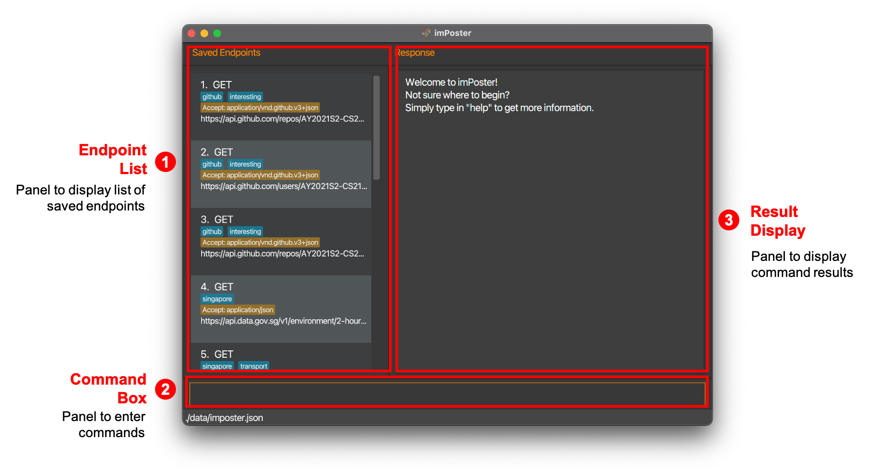
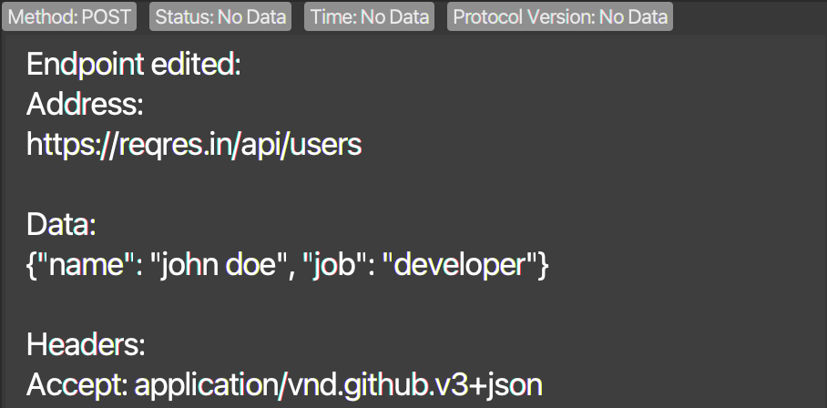
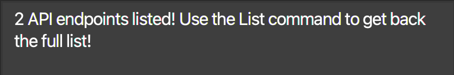
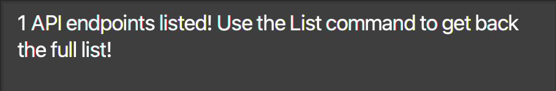
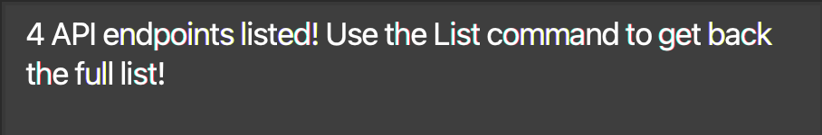

  

<h1 class="post-title">{{ page.title | escape }}</h1>
<h3 class="post-subtitle">v1.4b</h3>

 

## Table of Contents
{:.no_toc}

* Table of Contents 
{:toc}

## 1. Welcome to imPoster

Are you an aspiring [**Application Programming Interface (API)**](#glossary-api) developer? Or would you like a peek into the world of how applications communicate with one another? Then **imPoster** is the app just for you! But hold on, what is imPoster?

imPoster is a desktop application for beginners of API development to quickly go hands-on with the basics. Whether you are looking to **explore**, **test**, or **build** your very own APIs, the simple and minimalistic style of imPoster will quickly get you up and going.

This user guide assumes that users have a **basic understanding** of APIs. If you are wondering [what an API is](#81-what-is-an-api), an appendix has been provided for users who may be unfamiliar with the concept. However, it is highly recommended for users to refer to proper tutorial contents for the basics of APIs prior to using the application.

For fast typists, imPoster is also highly optimised for the command line and can be fully operated through keyboard commands. Users who are familiar with [**CURL**](#glossary-curl) will also be happy to know that we share a very similar command line syntax. If you have yet to do so, be sure to download our [latest releases](https://imposter-dev.tk) from our main website and give us a try!

## 2. Navigating the User Guide

Before diving into the rest of the contents in our user guide, the following are some important syntax to take note of to facilitate your reading:

| Syntax              | Description                                    |
| ------------------- | ---------------------------------------------- |
| **Bold**            | Important words to note                        |
| `Markdown`          | Important examples                             |
| <kbd>Keyboard</kbd> | Keyboard actions                               |
| 
:bulb: Tips
 | Useful tips |
| 
:exclamation: Caution
 | Things to watch out for |
| Main Command | Indicates the keyword describing the main action of a command |
| Compulsory Parameter | Indicates the compulsory parameters/prefixes of a command |
| Optional Parameter | Indicates the optional parameters/prefixes of a command |
| [Repeated Parameters]   | Indicates the parameters/prefixes that may be repeated multiple times, including zero times    |

## 3. Quickstart

1. Ensure you have **Java 11 or above** installed on your computer.

2. Download the latest **imPoster.jar** from
   [here](https://imposter-dev.tk) and move the file to the folder you wish to use as the **home folder** for imPoster.

3. **Double-click** the file to start the application. A graphical user interface (GUI) containing the annotated **3 main components** should show up as below: 

    

      
    

4. Try making your first API call through our application with the first [**endpoint**](#glossary-endpoint) shown in the default **Endpoint List**. Type send 1 in the **Command Box** and then press <kbd>Enter</kbd>.

5. After which, try scrolling through the responses shown in the **Result Display** as well!

6. For a quick **overview** of all available commands, please refer to our [Command Summary](#6-command-summary).

7. For the **details** of each command, please proceed to the next section on [Commands](#4-commands).

8. When you are ready to start testing your APIs, clear the default **Endpoint List** by typing clear in the **Command Box** and then pressing <kbd>Enter</kbd>.

9. If you are new and unsure of where to find an API endpoint to start, fret not! We have prepared an extensive list of [sample endpoints](#86-sample-endpoints) for you.

:exclamation: **Caution:**
imPoster will start with an empty file if a modification to the [data file](#data-file) causes the data to be invalid.

## 4. Commands

Commands are classified into 2 categories, namely **general** and **endpoint**. Before diving into the details, let us first look at what makes up a command:

| Component    | Description                                                           |
| ------------ | --------------------------------------------------------------------- |
| Command Word | The keyword representing the action of the command                    |
| Prefix       | The keyword to recognise command parameters                           |
| Parameters   | Follows directly behind a prefix and contains the corresponding value |

As an example, a basic command to add an endpoint could look like the following:

add -x GET -u https://google.com

In the example above, add is the command word while -x and -u are the prefixes of the GET and https://google.com parameters respectively. For your convenience, a list of all parameters along with their prefixes and descriptions have been included in the table below. An example usage of all the parameters are also demonstrated in the [add command](#421-add-an-api-endpoint-add).

| Parameter    | Prefix | Description                                                           |
| ------------ | ------ | --------------------------------------------------------------------- |
| INDEX        |  None  | The index of the endpoint as shown in the endpoint panel list         |
| THEME        |  None  | The theme for the application                                         |
| METHOD       |   -x   | The [request method](#84-request-methods) to use for an endpoint      |
| URL          |   -u   | The URL to use for an endpoint                                        |
| HEADER       |   -h   | The header to use for an endpoint **(must be enclosed with \"\")**      |
| DATA         |   -d   | The data to use for an endpoint **(must be in [JSON](#85-json-format) format)**          |
| TAG          |   -t   | The tag to label an endpoint                 |

Note that the fields **METHOD**, **URL**, **HEADER**, **DATA** and **TAG** are used to uniquely identify an endpoint.

Here are some general rules to follow when entering prefixes and parameters:

* A **whitespace** must be included before **every prefix**. 
  e.g. `-x METHOD -u URL` is acceptable but `-x METHOD-u URL` is not. 
  
* Parameters may be entered in **any order**. 
  e.g. Both `-x METHOD -u URL` and `-u URL -x METHOD` are acceptable. 
  
* If a parameter is expected only once in the command but you specified it multiple times, only the **last occurrence** of the parameter will be taken. 
  e.g. If you specify `-u https://github.com/ -u https://google.com/`, only `-u https://google.com/` will be taken. 

* **Extraneous parameters** for commands that do not take in parameters (such as **help**, **list**, **exit** and **clear**) will be ignored. 
  e.g. If the user input is `help 123`, it will be interpreted as `help`. 
  
* For **add**, **edit** and **run** commands, to add multiple parameters of the same prefix, add the prefix multiple times before each parameter. 
  e.g. To add 2 tags, enter `-t tagOne -t tagTwo`. 
  e.g. To add 3 headers, enter `-h "key1: 1" -h "key2: 2" -h "key3: 3"`. 
  
* All **headers/tags must be unique** and duplicates will be ignored. 
  e.g. `edit 1 -t tagA -t tagA` will only create one `tagA`.

* Modification of **headers/tags** is not cumulative (i.e previous values will be deleted) and if no values are given, all previous values will also be removed. 
  e.g. `edit 1 -t` will delete all tags for the first endpoint in the list.

* If no website [protocol](#glossary-protocol) is specified for the **URL**, we enforce a **HTTP protocol** as a 
  protocol is needed for an API request to be carried out. 
  e.g. If a user enters `google.com` as a URL, we will prepend the URL with `http://`, making it `http://google.com`.

* The **index** parameter provided should be a [non-zero unsigned integer](https://en.wikipedia.org/wiki/Integer_(computer_science)) within the allowed range of Java's [`int`](#glossary-int) data type. On top of that, the **index** should be within the bounds of the API endpoint list. 
  e.g If there are 3 endpoints saved in the endpoint list. The range of valid index is 1 to 3.

* For the **URL** parameter, as our application is focused on API testing, we have no plans to direct all our efforts in
  verifying every technically valid or invalid [**URL**](https://en.wikipedia.org/wiki/URL) against the 
  official [URL standard](https://url.spec.whatwg.org/#url-parsing). Hence, **minimal checks** are performed 
  for cases of **invalid URL** for which we will still display error messages. 

:bulb: **Tip:**
Every command explanation has a screenshot to give an idea of the expected message in the application's **Result Display** (screenshot may be partial to save space!)

### 4.1 General

#### 4.1.1 View help: help

**Description:** New or stuck with one of the commands? Get the relevant helpful information through a quick pop up window!

**Format:** help

**Example & Output:** help

  

#### 4.1.2 Toggle theme: toggle

**Description:** Seeking a more personal visual design? Choose from our themes consisting of **light, dark, material or imposter**!

**Format:** toggle THEME

**Example & Output:** toggle light

  

#### 4.1.3 Exit program: exit

**Description:** Looking to exit the application? A simple command does the job but do come back soon!

**Format:** exit

**Example:** exit

### 4.2 Endpoint

#### 4.2.1 Add an API endpoint: add

**Description:** Have a new endpoint in mind? Add an API endpoint to the API endpoint list!

**Format:** add -x METHOD -u URL -d DATA [-h HEADER] [-t TAG]

**Example & Output:** add -x POST -u https://reqres.in/api/users -d {\"name\": \"tarzan\", \"job\": \"the jungle man\"} -h \"Content-Type: application/json\" -t nature -t important

  

:bulb: **Tip:**
If you are only using an endpoint once, consider the convenient option of using the [run](#428-call-an-api-endpoint-directly-without-saving-run) command!

#### 4.2.2 Edit an API endpoint: edit

**Description:** Need to modify at endpoint? Edit an API endpoint at the specified index shown in the API endpoint list **(at least one optional argument must be provided!)**.

**Format:** edit INDEX -x METHOD -u URL -d DATA [-h HEADER] [-t TAG]

**Example & Output:** edit 1 -x POST -u https://reqres.in/api/users -d {\"name\": \"john doe\", \"job\": \"developer\"} -t common -t important

  

#### 4.2.3 Show an API endpoint: show

**Description:** Need more details on an endpoint? Peek at the details of an API endpoint at the specified index shown in the API endpoint list!

**Format:** show INDEX

**Example & Output:** show 1

  

#### 4.2.4 Remove an API endpoint: remove

**Description:** Looking to clear off unused endpoints? Remove the API endpoint at the specified index shown in the API endpoint list!

**Format:** remove INDEX

**Example & Output:** remove 1

  

#### 4.2.5 List all saved API endpoints: list

**Description:** Wish to admire all your endpoints? Display a list of all API endpoints in the API endpoint list!

**Format:** list

**Example & Output:** list

  

#### 4.2.6 Clear all saved API endpoints: clear

**Description:** Planning to start all over? Clear all API endpoints in the API endpoint list!

**Format:** clear

**Example & Output:** clear

  

:bulb: **Tip:**
If you wish to generate a set of sample endpoints, you may delete the **imposter.json** file inside the **data** folder!

#### 4.2.7 Find a saved API endpoint: find

**Description (General Search):** Looking for an endpoint across all parameters? Find endpoints containing the search words **(requires at least one keyword)**.

**Format (General Search):** find [KEYWORD]

**Example & Output:** find github transport

  

**Description (Precise Search):** Looking for an endpoint in specific parameters? Find endpoints containing the search words based on the [prefix](#prefix-table) **(requires at least one keyword)**.  Note the following 2 points:
- Searches done **within a single [prefix](#prefix-table)** will perform an **OR** search across the search terms and all endpoints matching either keywords will be returned.
- Searches done **across multiple [prefixes](#prefix-table)** will preform an **AND** search and only endpoints matching all keywords will be returned.

**Format (Precise Search):** find -x [METHOD] -u [URL] -d [DATA] -h [HEADER] -t [TAG]

**Example & Output:** find -x GET -u github (match **GET** in Method **and** **github** in URL)

  

**Example & Output:** find -x GET POST -u reqres (match **GET OR POST** in Method **and** **reqres** in URL)

  

:bulb: **Tip:** The search is case-insensitive and the order of the keywords do not matter. Partial Words **will** also be matched. e.g. `appl` will match `Apple` 

:exclamation: **Caution:**
find -x GET -x POST is not the same as find -x GET POST. The former will only search for items with method matching **POST** (as stated [here](#general-rules)) while the latter will search for all items with method matching **GET or POST**.

#### 4.2.8 Call an API endpoint directly without saving: run

**Description:** Want to quickly test out an endpoint? [Call](#glossary-call) an API endpoint directly without saving! **(an ongoing call can be cancelled with <kbd>ctrl</kbd> + <kbd>d</kbd>)**.

**Format:** run -x METHOD -u URL -d DATA [-h HEADER]

**Example & Output:** run -x GET -u https://api.data.gov.sg/v1/environment/pm25

  

**Description (Shortcut):** Interested in a shorthand command? [Call](#glossary-call) an API endpoint directly without saving to send a GET request that does not specify any data or header! **(an ongoing call can be cancelled with <kbd>ctrl</kbd> + 
<kbd>d</kbd>)**.

**Format (Shortcut):** run URL

**Example & Output:** run https://api.data.gov.sg/v1/environment/pm25

  

:bulb: **Tip:**
The above shortcut for run command is designed for users to easily verify outputs for common API endpoints that 
do not require any input data or header. Note that this feature is only meant for sending GET requests.

#### 4.2.9 Call a saved API endpoint: send

**Description:** Want to test out a saved endpoint? [Call](#glossary-call) an API endpoint from the API endpoint list! **(an ongoing call can be cancelled with <kbd>ctrl</kbd> + <kbd>d</kbd>)**.

**Format:** send INDEX

**Example & Output:** send 1

  

### 4.3 Miscellaneous

#### 4.3.1 Retrieve the last valid command

**Description:** Given that the last valid command executed by the user is most likely to be repeated during the API 
development
& verification process, a special key combination <kbd>ctrl</kbd> + <kbd>up-arrow</kbd> (Windows) / <kbd>cmd</kbd> + 
<kbd>up-arrow</kbd> (macOS) is available to set the 
command box with that last command.

**Format:** <kbd>ctrl</kbd> + <kbd>up-arrow</kbd> (Windows) / <kbd>cmd</kbd> + <kbd>up-arrow</kbd> (macOS)

#### 4.3.2 Switch focused component

**Description:** As users may wish to switch the focused component (e.g. to type commands in the command box or to scroll responses in the result display), the <kbd>tab</kbd> key is available as an option to toggle the focused component (highlighted with an orange outline).

**Format:** <kbd>tab</kbd>

#### 4.3.3 Scroll endpoint list or result display

**Description:** As users may wish to scroll the endpoints in the endpoint list or the responses in result display, the <kbd>Page Up</kbd> and <kbd>Page Down</kbd> keys (<kbd>fn</kbd> + <kbd>up</kbd> and <kbd>fn</kbd> + <kbd>down</kbd> on macOS) are available as options to scroll the 2 components above.

**Format:** <kbd>Page Up</kbd> and <kbd>Page Down</kbd> (<kbd>fn</kbd> + <kbd>up</kbd> and <kbd>fn</kbd> + <kbd>down</kbd> on macOS)

#### 4.3.4 Error Messages

**Description:** Do not worry if you input any commands wrongly when using our app! Our app gives helpful error messages depending on the command you entered and you can always enter the [**help command**](#411-view-help-help) if you need to refer back to the various commands available!

## 5. Frequently Asked Questions (FAQ)

**Q**: I am completely new to APIs, how do I get an [endpoint](#glossary-endpoint)?
  
**A**: While the use of APIs is commonplace, not all applications provide their API endpoints publicly. **Google** is your best friend for searching of public APIs but if you are new and just looking to try things out, fear not! We have prepared an extensive list of [sample endpoints](#86-sample-endpoints) to get you started!

**Q**: How do I transfer my data to another Computer?
   
**A**: Install the application in the other computer and place your current data folder in the same directory as the newly installed application (overwrite the data folder of the new application if applicable).

**Q**: How can I send non-JSON data in the request body?
  
**A**: This current version of imPoster only supports the sending of [JSON](#85-json-format) data in the request body which is the format used by an estimated over 70% of APIs worldwide. We apologise for the inconvenience caused but we are happy to share that plans are in place to include support for other data formats in future versions!

**Q**: Where is the data of imPoster saved?
  
**A**: imPoster data is saved automatically after every command into a JSON file named `imposter.json`. This file is stored within the `data` folder in the same location as the application `JAR` file and is created after the initial launch (and a command execution) of a fresh installation.

## 6. Command summary

A quick overview of all supported commands, their formats and examples are given below:

### 6.1 General

| Command    | Format                                 |
| ---------- | -------------------------------------  |
| **Help**   | help |
| **Toggle** | toggle THEME |
| **Exit**   | exit |

### 6.2 Endpoint

| Command    | Format                                | 
| ---------- | ------------------------------------- |
| **Add**    | add -x METHOD -u URL -d DATA [-h HEADER] [-t TAG] |
| **Edit**   | edit INDEX -x METHOD -u URL -d DATA [-h HEADER] [-t TAG]  |
| **Show**   | show INDEX                    |
| **Remove** | remove INDEX                     |
| **Find**   | find [KEYWORD]                  |
| **List**   | list                                                                |
| **Clear**  | clear                                                               |
| **Send**   | send INDEX                    |
| **Run**    | run -x METHOD -u URL -d DATA [-h HEADER] |

## 7. Glossary

| Term                                         | Description                                               |
| -------------------------------------------- | --------------------------------------------------------- |
| **API** |  API is short for **Application Programming Interface** and allows two systems to interact with each other  |
| **Call** |  A call to an API endpoint refers to the process of sending a [request to the server and then receiving a response](#83-what-are-requests-and-responses)          |
| **Endpoint** |  The communication point of a system that allows it to interact with another system, commonly accessed through a URL |
| **Request** | A process in which information is sent out to an endpoint through one of the [request methods](#84-request-methods) (a more detailed explanation can be found [here](#83-what-are-requests-and-responses)) |
| **Response** | The information obtained from an endpoint after a request is sent to it (a more detailed explanation can be found [here](#83-what-are-requests-and-responses)) |
| **Parameter**   | Information passed in as part of a command with its type identified by a prefix (e.g. METHOD) |
| **Prefix**   | Characters used to identify the following parameter (e.g. -x is the prefix for the parameter METHOD) |
| **JSON** | JSON is short for **JavaScript Object Notation** which is a lightweight format for data storage (a more detailed explanation can be found [here](#85-json-format)) |
| **CURL** |  CURL is short for **Client URL** and is a command-line tool used in the transfer of data via different network protocols |
| **Index** | Index in this guide refers to the position of the endpoint in the endpoint list (represented by the number beside the endpoint) |
| **Protocol** |  A protocol is a system of rules that define how data is exchanged within or between systems |
| **int** |  A primitive data type of Java that has the maximum value of (2^31)-1 and the minimum value of -(2^31) |

## 8. Appendix

### 8.1 What is an API?

Broadly speaking, an **API** is an interface that enables and defines how **two systems** interact with one another. In a classic analogy, the interaction above is usually likened to a **waiter** communicating a **customer** order to the restaurant **kitchen**. In this analogy, the **customer** and **kitchen** represents the **two systems**, and the **waiter** represents the **API** allowing them to communicate. The **order** and **food** delivered then corresponds to the terms **request** and **response** associated with an API call. The annotated diagram below captures these interactions and may aid in providing a better understanding:

  

Note that for the **waiter** to pass the order to the **kitchen**, a **window/door** is required to allow communication and this is represented by the term [**endpoint**](#glossary-endpoint) which is frequently used in relation to an API.

### 8.2 Why learn about APIs?

You may be surprised to know that APIs are not only widely used in our daily lives, it is also likely that you have been using them frequently without actually noticing them! For example, the simple act of visiting a website involves an API request which is responsible for bringing back a response to you in the form of a webpage. Even a simple text message to your friend relies on an API to reliably deliver your message! APIs are used extensively in our world today so even if they are unrelated to your job, it helps to have some basic understanding of them!

### 8.3 What are requests and responses?

The terms **requests** and **responses** both refer to messages used in the exchange of information between two systems (sender and receiver). Typically, the sender will send out a request containing information to be sent to the receiver. Then, when the receiver receives the request from the sender, it will process the request and send back a response. This response is then received and processed by the original sender, thus completing a single API call.

### 8.4 Request Methods
As of the latest version of our application, we support 7 commonly used request methods. We recommend individuals who are interested to learn more about request types to refer to [official documentation](https://webconcepts.info/concepts/http-method/). A brief explanation for the 7 supported requests have been provided below:

| Method      | Description                                                                                                 |
| ----------- | ----------------------------------------------------------------------------------------------------------- |
| **GET**     | Retrieves information from a server through a specified URL                  |
| **POST**    | Sends data to a server, commonly in JSON/html form format           |
| **PUT**     | Sends data to a server, commonly in JSON/html form format      |
| **DELETE**  | Removes information from a server through a specified URL             |
| **HEAD**    | Similar to GET, but returns only the header section of the response                                         |
| **PATCH**   | Sends data to a server, commonly in JSON/html form format |
| **OPTIONS** | Retrieves the allowed communication options (methods) for a specified URL                                   |

### 8.5 JSON Format
JSON is short for JavaScript Object Notation and is a common lightweight format for data storage (in the form of key/value pairs). In an API call, the JSON format is also commonly used to send data between two systems. For the current version of our application, JSON is the only format supported for sending data. The following are some examples of data in JSON format:
- `{}` - represents an empty JSON data
- `{"name": "john doe"}` - represents a single level JSON data 
- `{"persons": {"name": "john doe"}}` - represents a nested JSON data

### 8.6 Sample Endpoints

An extensive list of sample endpoints have been provided below for new users to test and try out. Note that the **header** field has been omitted in the samples to keep them beginner friendly but rest assured that the following **sample endpoints will work without the header** field. That said, for those more familiar with APIs, some examples of headers have been included in the initial list of default endpoints that came with the JAR file. For the even more adventurous, you may refer to and explore the [full list of HTTP headers](https://en.wikipedia.org/wiki/List_of_HTTP_header_fields). 

Data fields on the other hand have been included in a standalone column (if applicable). They are all in the [**JSON format**](#85-json-format) and only the keys are provided (you may play around with your own values). The sample endpoints below are organised according to their [request method types](#84-request-methods) for your convenience. Go ahead and try out the sample endpoints below!

GET

| URL                                                            |
| -------------------------------------------------------------- |
| http://imposter-dev.tk:6000/api/v1/resources/books/all         |
| http://imposter-dev.tk:6000/api/v1/resources/books?id=1        |
| https://project-billboard.herokuapp.com/laugh                  |
| https://api.data.gov.sg/v1/environment/psi                     |
| https://api.data.gov.sg/v1/environment/4-day-weather-forecast  |

POST

| URL                                                           | Data (JSON)                                       |
| ------------------------------------------------------------- |                                                   |
| https://jsonplaceholder.typicode.com/posts                    | title, body, userId                               |
| https://reqbin.com/echo/post/json                             | Id, Customer, Quantity, Price                     |
| https://reqres.in/api/register                                  | email, password                   |
| https://reqres.in/api/login                                | email, password                     |
| https://reqres.in/api/users                             | name, job                     |

PUT

| URL                                                           | Data (JSON)                                       |
| ------------------------------------------------------------- |                                                   |
| https://jsonplaceholder.typicode.com/posts/1                    | id, title, body, userId                               |
| https://reqres.in/api/users/2                             | name, job                     |

DELETE

| URL                                                           |
| ------------------------------------------------------------- |
| https://jsonplaceholder.typicode.com/posts/1                  |
| https://reqres.in/api/users/2                             |

HEAD

| URL                                                           |
| ------------------------------------------------------------- |  
| https://jsonplaceholder.typicode.com/posts/1/comments        |
| https://api.data.gov.sg/v1/environment/2-hour-weather-forecast |
| https://cat-fact.herokuapp.com/facts                         |
| https://dog-facts-api.herokuapp.com/api/v1/resources/dogs?number=1 |

PATCH

| URL                                                           | Data (JSON)                                       |
| ------------------------------------------------------------- |                                                   |
| https://reqres.in/api/users/2                             | name, job                     |
| https://jsonplaceholder.typicode.com/posts/1                    | title, body, userId                               |

OPTIONS

| URL                                                           |
| ------------------------------------------------------------- |  
| http://imposter-dev.tk:6000/api/v1/options       |
| https://gorest.co.in/public-api/users |
