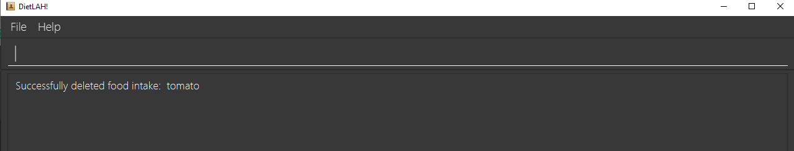

  

# User Guide

## Table of Contents

<!--ts-->
* [Introduction](#introduction)
* [Understanding the User Guide](#understanding-the-user-guide)
* [Quick start](#quick-start)
* [Date format](#date-format)
* [Features](#features)
* [1. Body Mass Index (BMI) Tracker](#1-body-mass-index-bmi-tracker)
  * [1.1. Input user information](#11-input-user-information)
  * [1.2. View user information](#12-view-user-information)
  * [1.3. Update user information](#13-update-user-information)
* [2. Diet Plan Selector](#2-diet-plan-selector)
  * [2.1. Get diet recommendations based on current BMI](#21-get-diet-recommendation-based-on-current-bmi)
  * [2.2. View active diet plan](#22-view-active-diet-plan)
  * [2.3. Select active diet plan](#23-select-active-diet-plan)
  * [2.4. List all available diet plans](#24-list-all-available-diet-plans)
  * [2.5. View information about a particular diet plan](#25-view-information-about-a-particular-diet-plan)
* [3. Macronutrients Tracker](#3-macronutrients-tracker)
  * [3.1. Add food item](#31-add-food-item)
  * [3.2. Update food item](#32-update-food-item)
  * [3.3. List food item](#33-list-food-item)
  * [3.4. Delete food item](#34-delete-food-item)
  * [3.5. Input food intake](#35-input-food-intake)
     * [3.5.1. Input food intake (For new food items that are not created before)](#351-input-food-intake-for-new-food-items-that-are-not-created-before)
     * [3.5.2. Input food intake (For existing food items)](#352-input-food-intake-for-existing-food-items)
     * [3.5.3. Input food intake (For existing food items, using different nutrient value(s))](#353-input-food-intake-for-existing-food-items-using-different-nutrient-values)
  * [3.6. Update food intake](#36-update-food-intake)
  * [3.7. Delete food intake](#37-delete-food-intake)
  * [3.8. Query food intake](#38-query-food-intake)
     * [3.8.1. Query food intake on a day](#381-query-food-intake-on-a-day)
     * [3.8.2. Query food intake over a period of days](#382-query-food-intake-over-a-period-of-days)
  * [4. Progress report](#4-progress-report)
     * [4.1 Generate progress report](#41-generate-progress-report)
  * [5. Miscellaneous](#5-miscellaneous)
     * [5.1 Reset application to blank](#51-reset-application-to-blank)
     * [5.2 Populate application with sample template data](#52-populate-application-with-sample-template-data)
     * [5.3 Exit the application](#53-exit-the-application)
* [Command summary](#command-summary)
* [Glossary](#glossary)
* [Appendix](#appendix)
  * [A1. Diet plans](#a1-diet-plans)
      * [A1.1 Standard Ketogenic Diet](#a11-standard-ketogenic-diet)
      * [A1.2 High Protein Ketogenic Diet](#a12-high-protein-ketogenic-diet)
      * [A1.3 Balanced Plan For Weight Gain](#a13-balanced-plan-for-weight-gain)
      * [A1.4 Clean Bulk](#a14-clean-bulk)
      * [A1.5 High Carbohydrates Bulk](#a15-high-carbohydrates-bulk)
      * [A1.6 Balanced Plan](#a16-balanced-plan)
<!--te-->

---

## Introduction

DietLAH! is a **desktop app that allows you to easily set up a diet plan and track your meals so that you will be able to maintain your ideal body weight.**

With many people facing weight-loss challenges from months of working at home due to the ongoing pandemic, DietLAH! aims to make it as easy as possible for you to lose weight with just a few simple steps!

Compared to traditional diet tracking apps such as MyFitnessPal, you interact with DietLAH! by putting in text inputs into the app, which allows you to record your meals and track your weight much faster!

---

## Understanding the User Guide

To make browsing the user guide more pleasant for you, here are some of the symbols and formats used throughout the guide:

Legend | Description
-------|-------------
`Inline code` | Commands and user input
💡 <strong>Tip</strong> | Tip - Extra information that may be useful
✏️ <strong>Note</strong> | Note - Important things to take note of
⚠️ <strong>Warning</strong> | Warning - Be extra careful with these

## Quick start

1. Ensure that you have [Java 11](https://www.oracle.com/sg/java/technologies/javase-jdk11-downloads.html) or above installed in your computer.

2. Download the [latest DietLAH.jar](https://github.com/AY2021S2-CS2103T-T12-2/tp/releases) from our website.

3. Move the `DietLAH.jar` file to the directory where you would like to store the application.

4. Double-click the file to start DietLAH!

5. When you first launch DietLAH!, this is what it looks like:

  

  It will show some basic information on how to use it, and some sample data will already be present. 

6. Type the command in the command box at the top and press Enter to execute it. e.g. typing **`help`** and pressing Enter will open the help window. 
   Here are some quick commands to get you started:
   
   * **`RESET`**` t/blank`: Resets sample data in the application.

   * **`BMI`**` g/M a/43 h/170 w/70 i/50`: Sets up your user profile with the gender (male), age (43), height (170cm), weight (70kg) and ideal weight (50kg).

   * **`bmi_query`**: Returns information on your current BMI profile.

   * **`plan_recommend`**: Get a recommended diet plan based on your current BMI.

   * **`plan_set`**`p/1`: Sets your current diet plan to the first in the list.

   * `**food_intake_add** d/31 Mar 2021 n/tomatoes p/10 c/10 f/10`: Adds tomato consumption with protein of 10g, carbohydrates of 10g and fats of 10g to the food intake for 31 Mar 2021.

   * `**food_intake_query** d/31 Mar 2021`: Shows the food intake for 31 Mar 2021.

   * **`progress`**: Shows your progress towards your ideal weight.

7. Refer to the [Features](#features) section below for details of each command

---

## Date format
DietLAH! uses the following date format for command inputs: `dd Mmm yyyy` which is clearer to interpret and reduces the chances of typos. Refer to the table below for more information:

Legend | Description
-------|-------------
dd | Day in the calendar month, ranging from 0 - 31, without leading zeroes
Mmm | 3-letter textual representation of a month in the calendar year, ranging from Jan - Dec, case sensitive
yyyy | Numerical 4-digit representation of a year in the calendar, e.g. 2021

Some example date inputs: `3 Jan 2021`, `21 Feb 2021`, `30 Mar 2021`

---

## Features

---

## 1. Body Mass Index (BMI) Tracker

### 1.1 Input user information

When you first launch DietLAH!, some sample data will already be loaded. 

DietLAH! uses your information to provide personalized recommendations based on your personal goals and current characteristics.

    ✏️ <strong>Note:</strong> You need to enter this command before all other commands will work! Also, note that you need to clear the sample data before you can use this command!

**Command Format:** `bmi g/GENDER a/AGE h/HEIGHT(CM) w/WEIGHT(KG) i/IDEAL_WEIGHT(KG)`  
**Example:** `bmi g/M a/43 h/170 w/70 i/80`  
**Expected output:**

  

### 1.2 View user information

You can view your information and associated health risks (if any), at any time by using the command given below.

**Command Format:** `bmi_query`  
**Expected output:**

  

### 1.3 Update user information

From time to time, we may have lost or gained weight following our diet plan. This allows you to update your information to reflect those changes.

**Command Format:** `bmi_update g/GENDER a/AGE h/HEIGHT(CM) w/WEIGHT(KG) i/IDEAL_WEIGHT(KG)`  
**Example:** `bmi_update g/M a/43 h/170 w/70 i/80`  
**Expected output:**

  

## 2. Diet Plan Selector

### 2.1 Get diet recommendation based on current BMI

Get a personalized diet plan based on your current BMI and characteristics.

**Command Format:** `plan_recommend`  
**Expected output:**

  

### 2.2 View active diet plan

Shows you the current active diet plan you have selected.

**Command Format:** `plan_current`  
**Expected output:**

  

### 2.3 Select active diet plan

Change your current active diet plan to another one. It's okay to change your mind!

**Command Format:** `plan_set p/ID`  
**Example:** `plan_set p/1`  
**Expected output:**

  

### 2.4 List all available diet plans

Shows you a list of currently available diet plans.

**Command Format:** `plan_list`  
**Expected output:**

  

### 2.5 View information about a particular diet plan

Interested in trying out a diet plan? Find out more about its daily nutritional requirements.

**Command Format:** `plan p/ID`  
**Example:** `plan p/1`  
**Expected output:**

  

## 3. Macronutrients Tracker

### 3.1 Add food item

Save food items you frequently consume, so you don't have to re-enter them every time! Your food list acts as a shortcut to help speed up your food intake recording.

**Command Format:** `food_add n/FOOD_NAME c/CARBOS(G) f/FATS(G) p/PROTEINS(G)`  
**Example:** `food_add n/tomato c/10 f/10 p/10`

  ✏️ <strong>Note:</strong> Food names must be unique. All food nutrients' value specified must lie within the range of 0 to 1000, both inclusive, and can be up to 2 decimal places.

**Expected output:**

  

### 3.2 Update food item

Update food items in your food list with new nutrition values.

**Command Format:** `food_update n/FOOD_NAME c/CARBOS(G) f/FATS(G) p/PROTEINS(G)`  
**Example:** `food_update n/tomato c/20 f/30 p/40`

  ✏️ <strong>Note:</strong> Ensure that the food item exists in the application. All food nutrients' value specified must lie within the range of 0 to 1000, both inclusive, and can be up to 2 decimal places.

💡 <strong>Tip:</strong> Not all nutrient fields are compulsory. Save time from having to re-enter data and only include fields you wish to update!

**Expected output:**

  

### 3.3 List food item

Shows you all the food items stored in your food list.

**Command Format:** `food_list`  
**Example:** `food_list`  
**Expected output:**

  

### 3.4 Delete food item

Deletes the specified food item.

**Command Format:** `food_delete n/name`  
**Example:** `food_delete n/tomato`

  ⚠️ <strong>Warning</strong> Deletion of a food item will not affect older food intake item records with similar name.

**Expected output:**

  

### 3.5 Input food intake

For tracking your diet plan progress, you are encouraged to record your daily food intake. 

You are allowed to add food intakes from the future. This is because you can use the function to perform a "food forecast" - so that you will know if eating the foods you have put in would go over your recommended daily intake of nutrients.

For your convenience, there are a few ways to input a food intake. Refer to the different scenarios outlined below!

  ✏️ <strong>Note:</strong> If there are multiple food intakes with the same date and name, the food name will be <strong>automatically renamed</strong> to include a duplicate count for easy identification. This is because there can be multiple food intakes for the same food in the given day, and they may contain different nutrient values.   
E.g. when you record two 'chicken rice' in the food intake, they will appear as chicken rice and Chicken rice #2 respectively.

#### 3.5.1 Input food intake (For new food items that are not created before)

Record your food intake for the specified date with a new food item not currently in your food list. The food will also be added to your food list for your convenience!

**Command Format:** `food_intake_add d/DATE(in dd Mmm yyyy format) n/FOOD_NAME c/CARBOS(G) f/FATS(G) p/PROTEINS(G)`  
**Example:** `food_intake_add d/31 Mar 2021 n/tomato c/10 f/10 p/10`

  ✏️ <strong>Note:</strong> At least one nutrient value(s) is required to create new food item. If a particular nutrient value is not provided, it will be set to 0 by default. The food nutrients' value specified must lie within the range of 0 to 1000, both inclusive, and can be up to 2 decimal places.

**Expected output:**

  

#### 3.5.2 Input food intake (For existing food items)

Record your food intake for the specified date using an existing food from your food list. Now you can save time having to re-enter your favourite food!

**Command Format:** `food_intake_add d/DATE(in dd Mmm yyyy format) n/FOOD_NAME`  
**Example:** `food_intake_add d/31 Mar 2021 n/tomato`

**Expected output:**

  

#### 3.5.3 Input food intake (For existing food items, using different nutrient value(s))

Record your food intake for the specified date using an existing food from your food list, but with different nutrient value(s). The value(s) will also be updated in your food list.

**Command Format:** `food_intake_add d/DATE(in dd Mmm yyyy format) n/FOOD_NAME c/CARBOS(G) f/FATS(G) p/PROTEINS(G)`  
**Example:** `food_intake_add d/31 Mar 2021 n/tomato c/20 f/35 p/50`

  ✏️ <strong>Note:</strong> Any nutrient value(s) specified for an existing food item will be overwritten and updated in the food list for future use. Older food intake record(s) associated with the same food item will retain their original values. The food nutrients' value specified must lie within the range of 0 to 1000, both inclusive, and can be up to 2 decimal places.

**Expected output:**

  

### 3.6 Update food intake

Update the nutrient value(s) of a previously entered food intake given the date and food name.

**Command Format:** `food_intake_update d/DATE(in dd Mmm yyyy format) n/FOOD_NAME c/CARBOS(G) f/FATS(G) p/PROTEINS(G)`  
**Example:** `food_intake_update d/31 Mar 2021 n/tomato c/20 f/40 p/50`

  💡 <strong>Tip:</strong> Not all nutrient fields are required and only the specified nutrient fields will be updated with the new value while the other values remain unchanged. 

  ✏️ <strong>Note:</strong> The food nutrients' value specified must lie within the range of 0 to 1000, both inclusive, and can be up to 2 decimal places. 

**Expected output:**

  

### 3.7 Delete food intake

Delete a food intake record from the application.

**Command Format:** `food_intake_delete d/DATE(in dd Mmm yyyy format) n/FOOD_NAME`  
**Example:** `food_intake_delete d/31 Mar 2021 n/tomato`

  ⚠️ <strong>Warning</strong> After deletion of a food intake, if there are multiple food intake with the same name, their duplicate count will be reordered.

**Expected output:**

  

### 3.8 Query food intake

View the list of food intakes on a given day or over a period of days. Refer to the different scenarios outlined below!

### 3.8.1 Query food intake on a day

View the list of food intakes on a specific day.

**Command Format:** `food_intake_query d/DATE(in dd Mmm yyyy format)`  
**Example:** `food_intake_query d/31 Mar 2021`  
**Expected output:**

  

### 3.8.2 Query food intake over a period of days

View the list of food intakes over a period of days (both inclusive).

**Command Format:** `food_intake_query df/DATE_FROM(in dd Mmm yyyy format) dt/DATE_TO(in dd Mmm yyyy format)`  
**Example:** `food_intake_query df/1 Mar 2021 dt/31 Mar 2021`  
**Expected output:**

  

## 4. Progress report

### 4.1 Generate progress report

Generates a progress report based on your current active diet plan. Your food intake will be calculated against the daily requirements to generate a report detailing how much you have adhered to the plan's requirements.

**Command Format:** `progress`

  ✏️ <strong>Note:</strong> An active diet plan must be selected before running this command.

**Expected output:**

  

## 5. Miscellaneous

### 5.1 Reset application to blank

Get rid of all existing records and start afresh.

**Command Format:** `reset t/blank`  
**Expected output:**

  

### 5.2 Populate application with sample template data

Get rid of all existing records and populate it with the sample template data.

**Command Format:** `reset t/template`  
**Expected output:**

  

### 5.3 Exit the application

Closes the application.

**Command Format:** `exit`

---

## Command summary

Action | Format, Examples
-------|------------------
**Input user information** | `bmi g/GENDER a/AGE h/HEIGHT(CM) w/WEIGHT(KG) i/IDEAL_WEIGHT(KG)​`   e.g. `bmi g/M a/43 h/170 w/70 i/80`
**View user information** | `bmi_query`
**Update user information** | `bmi_update g/GENDER a/AGE h/HEIGHT(CM) w/WEIGHT(KG) i/IDEAL_WEIGHT(KG)`  e.g. `bmi_update g/M a/43 h/170 w/70 i/80`
**Get diet plan recommendation based on current BMI** | `plan_recommend`
**View active diet plan** | `plan_current`
**Select active diet plan** | `plan_set p/plan`  e.g. `plan active p/1`
**List all available diet plans** | `plan_list`
**View information about a particular diet plan** | `plan p/ID​`  e.g. `plan p/1`
**Add food item** | `food_add n/FOOD_NAME c/CARBOS(G) f/FATS(G) p/PROTEINS(G)`   e.g. `food_add n/tomato c/10 f/10 p/10`
**Update food item** | `food_update n/FOOD_NAME c/CARBOS(G) f/FATS(G) p/PROTEINS(G)`   e.g. `food_update n/tomato c/20 f/30 p/40`
**List food items** | `food_list`
**Delete food item** | `food_delete n/FOOD_NAME`   e.g. `food_delete n/tomato`
**Input food intake (For newly created food items)** | `food_intake_add d/DATE(in dd Mmm yyyy format) n/FOOD_NAME c/CARBOHYDRATES(G) f/FATS(G) p/PROTEINS(G)`   e.g.`food_intake_add d/31 Mar 2021 n/tomato c/10 f/10 p/10`
**Input food intake (For existing food items)** | `food_intake_add d/DATE(in dd Mmm yyyy format) n/FOOD_NAME`   e.g. `food_intake_add d/31 Mar 2021 n/tomato`
**Input food intake (For existing food items, using different nutrient value(s))** | `food_intake_add d/DATE(in d MMM yyyy format) n/FOOD_NAME c/CARBOHYDRATES(G) f/FATS(G) p/PROTEINS(G)`   e.g. `food_intake_add d/31 Mar 2021 n/tomato c/20 f/35 p/50`
**Update food intake** | `food_intake_update d/DATE(in dd Mmm yyyy format) n/FOOD_NAME c/CARBOS f/FATS p/PROTEINS`   e.g. `food_intake_update d/31 Mar 2021 n/tomato c/20 f/40 p/50`
**Delete food intake** | `food_intake_delete d/DATE(in dd Mmm yyyy format) n/FOOD_NAME`   e.g. `food_intake_delete d/31 Mar 2021 n/tomato`
**Query food intake on a day** | `food_intake_query d/DATE(in dd Mmm yyyy format)`   e.g. `food_intake_query d/31 Mar 2021`
**Query food intake over a period of days** | `food_intake_query df/DATE_FROM(in dd Mmm yyyy format) dt/DATE_TO(in dd Mmm yyyy format)`   e.g. `food_intake_query df/1 Mar 2021 dt/31 Mar 2021`
**Generate progress report** | `progress`
**Reset application data** | `reset t/blank`
**Populate application with sample template data** | `reset t/template`
**Exit the application** | `exit`

---

## Glossary

In this glossary, you can find a list of terms that is used throughout this guide and reference their corresponding meaning.

Technical Terms | Meaning
----------------|---------
**Alias** | A term used to represent something. For instance the alias `df/` represents the date from a period.
**Command-Line Interface (CLI)** | An interface that users send commands to a computer program through the form of lines of text.
**Graphic User Interface (GUI)** | An interface that displays interactive visual components for a computer program.
**Java** | A programming language that is used to build this application.

Health Terms | Meaning
-------------|---------
**Body Mass Index (BMI)** | A value derived from the mass and height of a person, by taking the body mass divided by the square of the body height.
**Macronutrients** | Nutrients, such as fats, proteins and carbohydrates that provide us with energy.

---

## Appendix

---

## A1. Diet Plans

The following are diet plans options that comes with DietLAH!.

### A1.1 Standard Ketogenic Diet

The Standard Ketogenic Diet is a high-fat, low-carb weight-loss diet. It is designed in such a way that by reducing the intake of carbohydrates, the body is forced to burn its fat reserves for fuel thereby resulting in weight-loss.

The Standard Ketogenic Diet is suitable for individuals suffering from Type II Diabetes where excess carbohydrates would have been converted into glucose.

**Classification:** `Weight Loss`  
**Composition:** `70% Fat` `10% Carbohydrates` `20% Proteins`

### A1.2 High-Protein Ketogenic Diet

The High-Protein Ketogenic Diet is a variation of the Ketogenic Diet (high-fat, low-carb) which increases the protein intake. This variation is designed to help athletes and bodybuilders maintain their muscle mass whilst burning fat.

**Classification:** `Weight Loss`  
**Composition:** `60% Fat` `5% Carbohydrates` `35% Proteins`

### A1.3 Balanced Plan For Weight Gain

This plan is aimed at individuals who are intending to gain healthy weight in a balanced manner. Some exercise coupled with this diet plan will allow individuals to gain some muscle steadily.

**Classification:** `Weight Gain`  
**Composition:** `30% Fat` `35% Carbohydrates` `35% Proteins`

### A1.4 Clean Bulk

The clean bulk is a process which bodybuilders use to gain lean muscle mass. The clean bulk emphasizes consuming healthy whole foods as compared to eating sugary and 
processed foods to hit the calorie intake.

**Classification:** `Weight Gain`  
**Composition:** `30% Fat` `30% Carbohydrates` `40% Proteins`

### A1.5 High Carbohydrates Bulk

This plan is intended for athletes who are involved in high intensity sports which require high energy consumption. As such, this plan prescribes a higher amount of carbohydrates to offset this need whilst ensuring the protein intake is enough to promote muscle growth and in turn, healthy weight gain.

**Classification:** `Weight Gain`  
**Composition:** `15% Fat` `55% Carbohydrates` `30% Proteins`

### A1.6 Balanced Plan

The perfect ying-yang. Eat healthy food and complete the calorie goal. Eat lots of fruits and vegetables, and base meals on higher fiber starchy carbohydrates.

**Classification:** `Maintain Weight`  
**Composition:** `30% Fat` `40% Carbohydrates` `30% Proteins`
