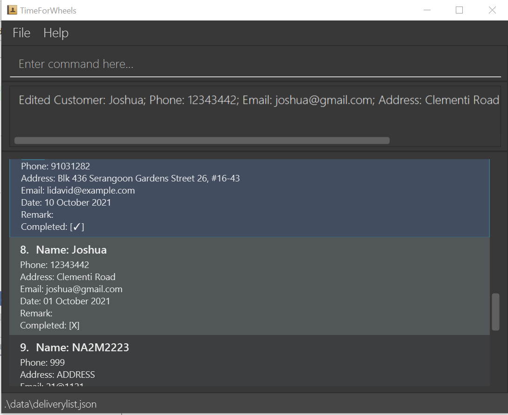
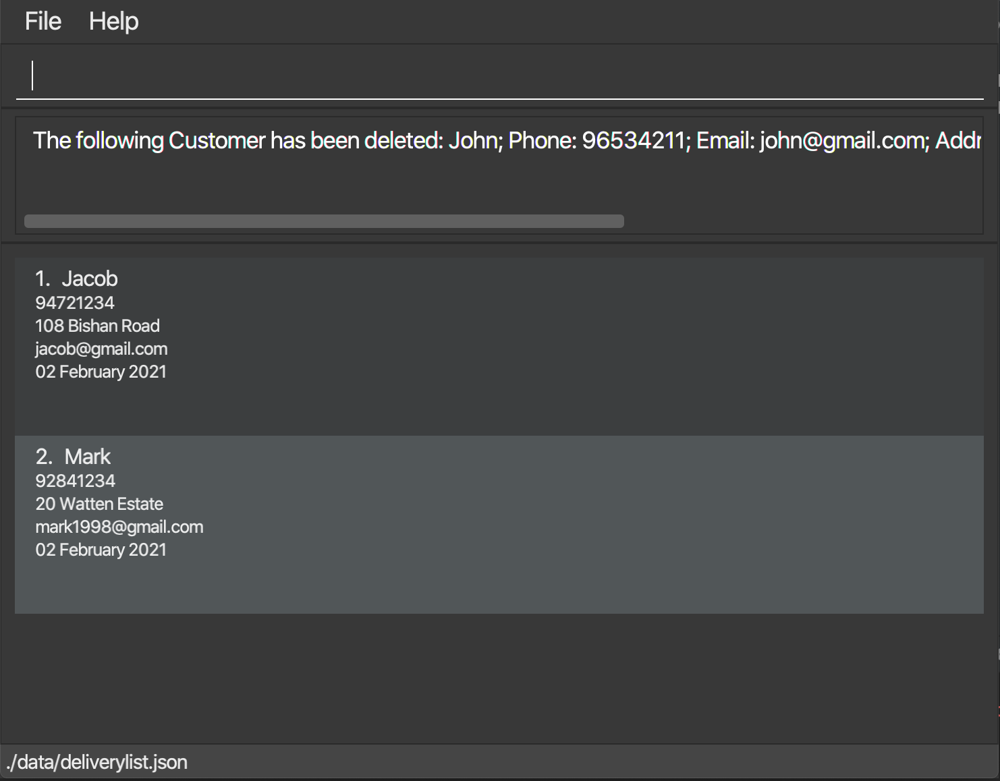

TimeForWheels is an app for delivery drivers to manage their orders efficiently. It is optimized for use via a Command
Line Interface while still having the benefits of a Graphical User Interface(GUI). Overall, TimeForWheels aims to
increase work productivity for delivery drivers by simplifying the delivery management and planning process.

* **Table of Contents**
    * Quick Start
    * Features
        * Viewing help
        * Add a delivery task
        * Edit a delivery task
        * Add a remark to a delivery task
        * Delete a delivery task
        * Clear all delivery tasks
        * List all delivery tasks
        * Mark delivery task as done
        * Find delivery task using keyword matching any attribute  
        * Statistics of delivery workflow
        * View completed delivery tasks
        * View uncompleted delivery tasks
        * Exit application

--------------------------------------------------------------------------------------------------------------------

## Quick start

1. Ensure you have Java `11` or above installed in your Computer.

1. Download the latest `TimeforWheels.jar` from [here](https://github.com/AY2021S2-CS2103T-W10-3/tp/releases).

1. Copy the file to the folder you want to use as the _home folder_ for your TimeforWheels.

1. Double-click the file to start the app. The GUI similar to the below should appear in a few seconds. Note how the app
   contains some sample data. 
   

1. Type the command in the command box and press Enter to execute it. e.g. typing **`help`** and pressing Enter will
   open the help window. 
   Some example commands you can try:

    * **`list`** : Lists all delivery points

    * **`add`**`n/Johnathan Tan p/98723456 a/108 Bishan street, block 123, #01-01 e/johnathan@gmail.com d/2021-05-05` : Adds a delivery with address `108 Bishan street, block 123, #01-01` to the
      Delivery list.

    * **`delete`**`3` : Deletes the 3rd delivery point shown in the current list.

    * **`done`**`3` : Marks the 3rd delivery task as done.

    * **`exit`** : Exits the app.

1. Refer to the [Features](#features) below for details of each command.

--------------------------------------------------------------------------------------------------------------------

## Features

**:information_source: Notes about the command format:** 

* Words in `UPPER_CASE` are the parameters to be supplied by the user. 
  e.g. in `add n/NAME`, `NAME` is a parameter which can be used as `add n/John Doe`.

* Items in square brackets are optional. 
  e.g `n/NAME [t/TAG]` can be used as `n/John Doe t/friend` or as `n/John Doe`.

* Items with `…`​ after them can be used multiple times including zero times. 
  e.g. `[t/TAG]…​` can be used as ` ` (i.e. 0 times), `t/friend`, `t/friend t/family` etc.

* Parameters can be in any order. 
  e.g. if the command specifies `n/NAME p/PHONE_NUMBER`, `p/PHONE_NUMBER n/NAME` is also acceptable.

* If a parameter is expected only once in the command but you specified it multiple times, only the last occurrence of
  the parameter will be taken. 
  e.g. if you specify `p/12341234 p/56785678`, only `p/56785678` will be taken.

* Extraneous parameters for commands that do not take in parameters (such as `help`, `list`, `exit` and `clear`) will be
  ignored. 
  e.g. if the command specifies `help 123`, it will be interpreted as `help`.

### Viewing help : `help`

**Purpose:** Shows all the available commands and how to use them

**Format:** `help`

**Examples:**

* `help` - Help returns Adding a delivery task: add Deleting a delivery task: delete Listing the delivery task: list
  Finding a delivery task: find Seeking for tech-support: help

### Add a delivery tasks: `add`

**Purpose:** Adds a delivery task to the delivery list.

**Format:** `add n/NAME p/PHONE a/ADDRESS e/EMAIL d/DATE`

**Examples:**

* `add n/Mark p/92841234 a/20 Watten Estate e/mark1998@gmail.com d/2021-02-02
  `
  

### Edit a delivery task: `edit INDEX PREFIX/ATTRIBUTE`

**Purpose:** Edits any selected attribute of the delivery entry except the remark.

**Prefix:** `n/`, `p/`, `a/`, `e/`, `t/`, `d/`

**Attribute:** Enter information based on the format of the attribute specified.

**Note:** 
  * You can edit multiple attributes.
  * Remark can be edited separately through the remark command.
  * INDEX refers to the number shown in front of each delivery

**Format:** `edit INDEX PREFIX/ATTRIBUTE`

**Examples:**

* `edit 8 n/Joshua`

* `edit 8 a/Clementi Road d/2021-10-01`

### Add a remark to a delivery tasks: `add`

**Purpose:** Adds a remark to a delivery task in the delivery list.

**Format:** `remark TASK NUMBER r/REMARK`

**Examples:**

* `remark 1 r/needs utensils
  `

### Delete a delivery task : `delete`

**Purpose:** Deletes the delivery task from the delivery list.

**Format:** `delete TASK NUMBER``

* Deletes a delivery task from the list.
* The TASK NUMBER refers to the number shown in the displayed delivery list.
* The index must be a positive number 1, 2, 3,

**Examples:**

* `delete 2` - delete 2 will delete the second delivery task in the delivery list.
  

### List all delivery tasks : `list`

**Purpose:** Shows all the delivery points

**Format:** `list`

**Examples:**

* `list` - Lists all the delivery points

### Clear all delivery tasks : `list`

**Purpose:** Clear all the delivery tasks

**Format:** `clear`

**Examples:**

* `clear` - Clears all the delivery tasks in the delivery list

### Mark delivery task as done : `done`

**Purpose:** Set a delivery task in the delivery list to done or not done

**Format:** `done TASK NUMBER`

* Sets the delivery task as done [✓].
* The TASK NUMBER refers to the number shown in the displayed delivery list.
* The TASK NUMBER must be a positive number such as 1, 2, 3
* If the delivery task is already marked as done [✓], running this command will mark it as not done [X]

**Example:**

* `done 2` - done 2 will set the second delivery task in the delivery list as done.

### Find deliveries using keywords matching any attribute: `find KEYWORDS`
**Attributes:** Name, Telephone Number, Address, Date, Remark, Done, Email

**Purpose** Find deliveries that match certain attribute

**Notes:**
* It is worth noting that you have to key in a full `KEYWORD` to retrieve a result.
  That is, if you want to find `Alex Yeoh`, then typing `find Al` would not return a result,
  but `find Alex` or `find Yeoh` will. So, avoid keying in incomplete keywords.
* Incomplete keywords are disabled in order to reduce the number of unnecessary search results which
  may defeat the aim of the feature.
  
**Format** `find KEYWORDS`

* One of the following results will show:
  * Deliveries matching the keywords
  * No matches found
    
**Example**
1. Finding by name: `find Alex`

   
   

   
2. Finding by address: `find Tampines`

   
   

   
3. finding by telephone number: `find 87438807`

   
   

   
4. finding by date of delivery: `find 2021-10-10`

   
   

### Sort delivery tasks in the list: `sort`

**Purpose** Sort delivery tasks first by completion status (incomplete first), 
then urgency tags (only applicable for incomplete tasks), and lastly date.

**Format:** `sort`

**Examples:**

* `sort` - Lists all incomplete delivery tasks (urgent ones first) followed by completed delivery tasks, which are all
sorted by date.

### Statistics of delivery workflow : `stats`

**Purpose:** Get a summary report of the current delivery workflow

**Format:** `stats`

* The following data will be calculated and shown on the screen:
  * Deliveries Done, Deliveries Not Done, Deliveries Due, Deliveries Not Due
  * Fragile Deliveries , Liquid Deliveries, Food Deliveries, Hot Deliveries
  * Cold Deliveries , Heavy Deliveries, Bulky Deliveries, Urgent Deliveries
  * Other Deliveries
  * `Deliveries Done` are Deliveries that have been marked done
  * `Deliveries Not Done` are Deliveries that have not been marked as done
  * `Deliveries Due` are Deliveries that have exceeded their delivery date and are still marked as not done
  * `Deliveries Not Due` are Deliveries that have not yet exceeded their delivery date and are marked as not done
  * `Fragile Deliveries` are Deliveries with tags marked as fragile
  * `Liquid Deliveries` are Deliveries with tags marked as liquid
  * `Food Deliveries` are Deliveries with tags marked as food
  * `Hot Deliveries` are Deliveries with tags marked as hot
  * `Cold Deliveries` are Deliveries with tags marked as cold
  * `Heavy Deliveries` are Deliveries with tags marked as heavy
  * `Bulky Deliveries` are Deliveries with tags marked as bulky
  * `Urgent Deliveries` are Deliveries with tags marked as urgent
  * `Other Deliveries` are Deliveries without any tags 
  
  
**How to interpret the displayed data:**
 * `Deliveries Done : 5 ( 83.33% )` means 5 and 83.33% of the deliveries in the list are marked as done 
 * `Deliveries Due: 1 ( 16.67% )` means 1 and 16.67% of the deliveries in the list are due 
  
**Example:**

* `stats` - outputs the calculated figures as shown below

### View completed delivery tasks: `completed`

**Purpose:** Filter out the completed deliveries in the delivery list

**Format:** `completed`

**Example:**

* `completed` - outputs the list of completed deliveries

### View uncompleted delivery tasks: `uncompleted`

**Purpose:** Filter out the uncompleted deliveries in the delivery list

**Format:** `uncompleted`

**Example:**

* `uncompleted` - outputs the list of uncompleted deliveries

### Exit application : `exit`

**Purpose:** Exits the program.

**Format:** `exit`

**Examples:**

* `exit` - Exits the program

--------------------------------------------------------------------------------------------------------------------

## FAQ

**Q**: How do I transfer my data to another Computer? 
**A**: Install the app in the other computer and overwrite the empty data file it creates with the file that contains
the data of your previous AddressBook home folder.

--------------------------------------------------------------------------------------------------------------------

## Command summary

Action | Format,  Example(s)
--------|------------------
**Help** | `help`  e.g., `help`
**Add** | `add n/NAME p/PHONE a/ADDRESS e/EMAIL d/DATETIME`   e.g., `add n/Johnathan p/98723456 a/123, Clementi Rd, 1234665 e/johnathan@gmail.com d/01-02-2021`
**Edit** | `edit INDEX n/NAME`, `p/PHONE`, `a/ADDRESS`, `e/EMAIL`, `t/TAG`, `d/DATE `  e.g.,`edit 1 a/102 Bishan Street`
**Remark** | `remark INDEX r/REMARK`  e.g.,`remark 1 r/needs untensils`
**Delete** | `delete INDEX`  e.g., `delete 3`
**Clear** | `clear`  e.g., `clear`
**List** | `list`  e.g., `list`
**Done** | `done INDEX`  e.g., `done 2`
**Find** | `find <keyword>` e.g., `find alex`
**Stats** | `stats`   e.g., `stats`
**Completed** | `completed`   e.g., `completed`
**Uncompleted** | `uncompleted`   e.g., `uncompleted`
**Exit** | `exit`  e.g., `exit`

